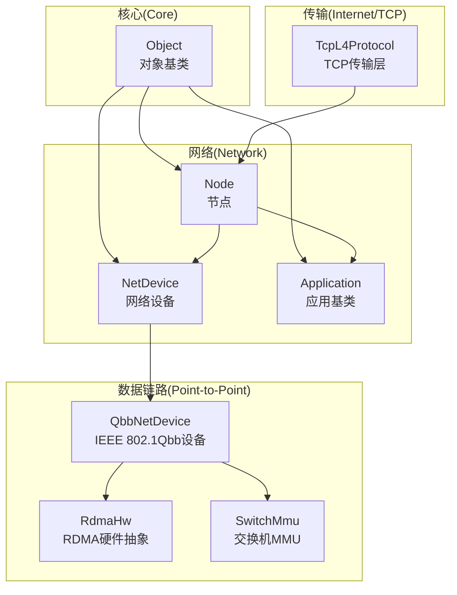
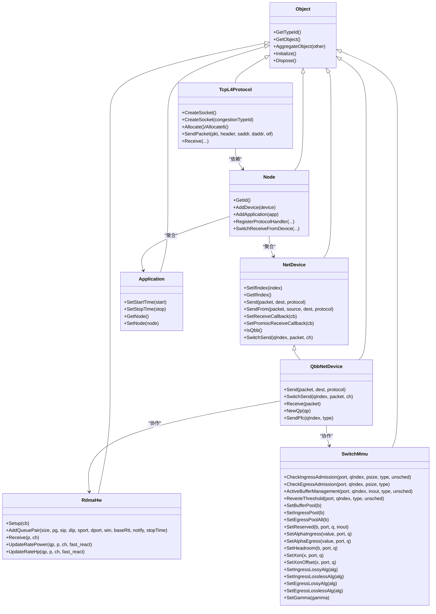
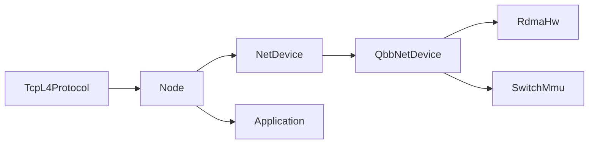

# API参考手册

<cite>
**本文档引用的文件**
- [README.md](file://README.md)
- [object.h](file://simulator/ns-3.39/src/core/model/object.h)
- [node.h](file://simulator/ns-3.39/src/network/model/node.h)
- [net-device.h](file://simulator/ns-3.39/src/network/model/net-device.h)
- [application.h](file://simulator/ns-3.39/src/network/model/application.h)
- [tcp-l4-protocol.h](file://simulator/ns-3.39/src/internet/model/tcp-l4-protocol.h)
- [switch-mmu.h](file://simulator/ns-3.39/src/point-to-point/model/switch-mmu.h)
- [qbb-net-device.h](file://simulator/ns-3.39/src/point-to-point/model/qbb-net-device.h)
- [rdma-hw.h](file://simulator/ns-3.39/src/point-to-point/model/rdma-hw.h)
- [node.h](file://simulator/ns-3.39/src/network/model/node.h)
- [net-device.h](file://simulator/ns-3.39/src/network/model/net-device.h)
- [application.h](file://simulator/ns-3.39/src/network/model/application.h)
- [tcp-l4-protocol.h](file://simulator/ns-3.39/src/internet/model/tcp-l4-protocol.h)
- [switch-mmu.h](file://simulator/ns-3.39/src/point-to-point/model/switch-mmu.h)
- [qbb-net-device.h](file://simulator/ns-3.39/src/point-to-point/model/qbb-net-device.h)
- [rdma-hw.h](file://simulator/ns-3.39/src/point-to-point/model/rdma-hw.h)
</cite>

## 目录
1. [简介](#简介)
2. [项目结构](#项目结构)
3. [核心组件](#核心组件)
4. [架构总览](#架构总览)
5. [详细组件分析](#详细组件分析)
6. [依赖分析](#依赖分析)
7. [性能考虑](#性能考虑)
8. [故障排除指南](#故障排除指南)
9. [结论](#结论)
10. [附录](#附录)

## 简介
本手册面向需要深入理解和使用NS-3数据中心平台API的开发者，系统性梳理核心类、网络类、协议类、应用类与工具类的接口规范、继承关系、公共方法、属性说明与使用示例。文档基于仓库中的实际源码进行分析，提供可追溯的“章节来源”与“图表来源”，帮助读者快速定位实现细节与最佳实践。

## 项目结构
NS-3数据中心平台在ns-3.39基础上扩展了数据中心相关功能，重点包括：
- 数据中心拥塞控制算法（如PowerTCP）与RDMA支持
- 交换机缓冲管理模型（SONIC、Reverie等）
- 多队列优先级调度与PFC/QCN机制
- RDMA硬件抽象层与队列对管理

**图表来源**
- [object.h:88-447](file://simulator/ns-3.39/src/core/model/object.h#L88-L447)
- [node.h:58-331](file://simulator/ns-3.39/src/network/model/node.h#L58-L331)
- [net-device.h:101-379](file://simulator/ns-3.39/src/network/model/net-device.h#L101-L379)
- [application.h:60-153](file://simulator/ns-3.39/src/network/model/application.h#L60-L153)
- [tcp-l4-protocol.h:80-379](file://simulator/ns-3.39/src/internet/model/tcp-l4-protocol.h#L80-L379)
- [qbb-net-device.h:77-259](file://simulator/ns-3.39/src/point-to-point/model/qbb-net-device.h#L77-L259)
- [rdma-hw.h:24-161](file://simulator/ns-3.39/src/point-to-point/model/rdma-hw.h#L24-L161)
- [switch-mmu.h:11-179](file://simulator/ns-3.39/src/point-to-point/model/switch-mmu.h#L11-L179)

**章节来源**
- [README.md:10-110](file://README.md#L10-L110)

## 核心组件
本节概述数据中心平台的关键API模块及其职责：
- 核心对象体系：所有组件的基类与生命周期管理
- 网络节点与设备：节点、网络设备、应用的统一接口
- 传输层协议：TCP多拥塞控制算法与端点管理
- 数据链路扩展：Qbb设备、RDMA硬件抽象、交换机MMU

**章节来源**
- [object.h:88-447](file://simulator/ns-3.39/src/core/model/object.h#L88-L447)
- [node.h:58-331](file://simulator/ns-3.39/src/network/model/node.h#L58-L331)
- [net-device.h:101-379](file://simulator/ns-3.39/src/network/model/net-device.h#L101-L379)
- [application.h:60-153](file://simulator/ns-3.39/src/network/model/application.h#L60-L153)
- [tcp-l4-protocol.h:80-379](file://simulator/ns-3.39/src/internet/model/tcp-l4-protocol.h#L80-L379)
- [qbb-net-device.h:77-259](file://simulator/ns-3.39/src/point-to-point/model/qbb-net-device.h#L77-L259)
- [rdma-hw.h:24-161](file://simulator/ns-3.39/src/point-to-point/model/rdma-hw.h#L24-L161)
- [switch-mmu.h:11-179](file://simulator/ns-3.39/src/point-to-point/model/switch-mmu.h#L11-L179)

## 架构总览
数据中心平台采用分层架构：核心对象层、网络层、传输层、数据链路层与RDMA硬件抽象层协同工作，支持TCP/IP与RDMA混合流量、多队列优先级调度、动态阈值与ABM/Reverie缓冲管理。

**图表来源**
- [object.h:88-447](file://simulator/ns-3.39/src/core/model/object.h#L88-L447)
- [node.h:58-331](file://simulator/ns-3.39/src/network/model/node.h#L58-L331)
- [net-device.h:101-379](file://simulator/ns-3.39/src/network/model/net-device.h#L101-L379)
- [application.h:60-153](file://simulator/ns-3.39/src/network/model/application.h#L60-L153)
- [tcp-l4-protocol.h:80-379](file://simulator/ns-3.39/src/internet/model/tcp-l4-protocol.h#L80-L379)
- [qbb-net-device.h:77-259](file://simulator/ns-3.39/src/point-to-point/model/qbb-net-device.h#L77-L259)
- [rdma-hw.h:24-161](file://simulator/ns-3.39/src/point-to-point/model/rdma-hw.h#L24-L161)
- [switch-mmu.h:11-179](file://simulator/ns-3.39/src/point-to-point/model/switch-mmu.h#L11-L179)

## 详细组件分析

### 核心类：Object
- 继承关系：所有ns-3对象的根类，提供引用计数、聚合、初始化/销毁回调
- 关键方法与属性
  - 类型标识与实例类型查询
  - 聚合其他对象、迭代聚合对象
  - 初始化与销毁生命周期钩子
- 使用要点
  - 所有自定义组件应从Object派生
  - 需要显式调用Dispose以打破循环引用

**章节来源**
- [object.h:88-447](file://simulator/ns-3.39/src/core/model/object.h#L88-L447)

### 网络类：Node
- 继承关系：Object
- 职责：管理节点ID、系统ID、网络设备列表、应用列表、协议处理器注册
- 关键方法
  - 设备与应用的增删查
  - 协议处理器注册（普通/混杂模式）
  - 设备添加事件监听器
  - 扩展接口：交换机接收回调、出队通知
- 异常与边界
  - 注册处理器时需确保协议号与设备匹配
  - 混杂模式下可能收到非目标地址包

**章节来源**
- [node.h:58-331](file://simulator/ns-3.39/src/network/model/node.h#L58-L331)

### 网络类：NetDevice
- 继承关系：Object
- 职责：抽象网络设备接口，向上提供发送/接收回调，向下连接Channel
- 关键方法
  - 接口索引、地址、MTU、链路状态
  - 发送/带源地址发送
  - 设置接收回调与混杂模式回调
  - 扩展接口：Qbb判断、交换机侧发送
- 参数与返回
  - Send/SendFrom返回布尔值表示是否成功入队
  - 回调签名包含设备指针、包、协议号、地址等

**章节来源**
- [net-device.h:101-379](file://simulator/ns-3.39/src/network/model/net-device.h#L101-L379)

### 应用类：Application
- 继承关系：Object
- 职责：封装应用生命周期（启动/停止）、与Node关联
- 关键方法
  - 启停时间设置
  - 获取/设置所属Node
  - 子类需重写StartApplication/StopApplication
- 事件机制
  - 内部使用EventId在指定时间触发启停

**章节来源**
- [application.h:60-153](file://simulator/ns-3.39/src/network/model/application.h#L60-L153)

### 协议类：TcpL4Protocol
- 继承关系：IpL4Protocol
- 职责：TCP套接字工厂、端点分配/回收、收发路径、ICMP回传
- 关键方法
  - CreateSocket（支持指定拥塞控制/恢复算法）
  - Allocate/Allocate6分配IPv4/IPv6端点
  - SendPacket发送TCP报文
  - Receive处理上层IP输入
- 端到端流程
  - 套接字绑定后加入内部映射表
  - 收包时根据端点分发至对应TcpSocketBase

**章节来源**
- [tcp-l4-protocol.h:80-379](file://simulator/ns-3.39/src/internet/model/tcp-l4-protocol.h#L80-L379)

### 数据链路类：QbbNetDevice
- 继承关系：PointToPointNetDevice
- 职责：支持IEEE 802.1Qbb优先级队列、PFC暂停/恢复、QCN显式拥塞通知、RDMA高优先级队列
- 关键方法
  - Send/SwitchSend按优先级入队
  - Receive拦截并处理暂停帧
  - NewQp/ReassignedQp管理RDMA队列对
  - SendPfc发送PFC暂停/恢复
- 统计与追踪
  - 提供入队/出队/丢弃追踪回调
  - 提供周期性统计接口（发送/接收字节数）

**章节来源**
- [qbb-net-device.h:77-259](file://simulator/ns-3.39/src/point-to-point/model/qbb-net-device.h#L77-L259)

### 工具类：RdmaHw
- 继承关系：Object
- 职责：RDMA硬件抽象，队列对管理，拥塞控制算法实现（PowerTCP、HPCC-PINT、TIMELY、DCTCP等）
- 关键方法
  - Setup/QP管理：AddQueuePair/DeleteQueuePair/GetQp
  - 收包处理：ReceiveUdp/ReceiveCnp/ReceiveAck/Receive
  - 速率更新：UpdateRatePower/UpdateRateHp/UpdateRateTimely/HandleAckDctcp
  - 表项管理：AddTableEntry/ClearTable/RedistributeQp
- 算法特性
  - 支持多种数据中心拥塞控制策略
  - 提供Mellanox版本的DCQCN与HPCC-PINT参数

**章节来源**
- [rdma-hw.h:24-161](file://simulator/ns-3.39/src/point-to-point/model/rdma-hw.h#L24-L161)

### 工具类：SwitchMmu
- 继承关系：Object
- 职责：交换机缓冲管理，支持动态阈值与ABM/Reverie算法
- 关键方法
  - 入/出方向准入检查与更新
  - 暂停/恢复判定与设置
  - ECN配置与拥塞标记
  - 缓冲池配置：总池、入口池、共享池、各端口队列保留/头存
  - 队列阈值计算：静态/动态阈值、FlowAwareBuffer、Reverie阈值
  - ABM相关：队列占用、去队速率、拥塞指示、更新间隔
- 参数与返回
  - 多数方法返回布尔或字节大小
  - 配置方法多为setter，支持全局与按端口/队列粒度

**章节来源**
- [switch-mmu.h:11-179](file://simulator/ns-3.39/src/point-to-point/model/switch-mmu.h#L11-L179)

## 依赖分析
- 组件耦合
  - Node聚合NetDevice与Application，是网络拓扑的核心容器
  - QbbNetDevice依赖RdmaHw与SwitchMmu实现RDMA与缓冲管理
  - TcpL4Protocol依赖Node以接入IP栈与Socket工厂
- 外部依赖
  - 通过回调与追踪机制与上层应用解耦
  - 属性系统用于运行时配置（例如拥塞控制算法类型）

**图表来源**
- [node.h:58-331](file://simulator/ns-3.39/src/network/model/node.h#L58-L331)
- [net-device.h:101-379](file://simulator/ns-3.39/src/network/model/net-device.h#L101-L379)
- [qbb-net-device.h:77-259](file://simulator/ns-3.39/src/point-to-point/model/qbb-net-device.h#L77-L259)
- [rdma-hw.h:24-161](file://simulator/ns-3.39/src/point-to-point/model/rdma-hw.h#L24-L161)
- [switch-mmu.h:11-179](file://simulator/ns-3.39/src/point-to-point/model/switch-mmu.h#L11-L179)
- [tcp-l4-protocol.h:80-379](file://simulator/ns-3.39/src/internet/model/tcp-l4-protocol.h#L80-L379)

## 性能考虑
- 多队列优先级调度
  - QbbNetDevice支持8个队列，RDMA高优先级队列确保低延迟
- 缓冲管理
  - SwitchMmu支持动态阈值与ABM/Reverie算法，降低尾延时与丢包
- 拥塞控制
  - RdmaHw集成多种数据中心拥塞控制算法，按场景选择合适策略
- 统计与追踪
  - 通过TracedCallback收集入队/出队/丢弃事件，便于性能分析

## 故障排除指南
- 发送失败
  - 检查NetDevice::Send/SendFrom返回值；确认设备已正确连接与链路状态正常
- 包未达应用
  - 确认Node::RegisterProtocolHandler已注册且协议号匹配；混杂模式下注意包类型过滤
- RDMA队列对异常
  - 使用RdmaHw::AddQueuePair/AddTableEntry建立QP与路由表；检查QP完成回调
- 缓冲溢出
  - 调整SwitchMmu的保留/头存/阈值参数；启用ABM/Reverie算法

**章节来源**
- [net-device.h:242-275](file://simulator/ns-3.39/src/network/model/net-device.h#L242-L275)
- [node.h:184-194](file://simulator/ns-3.39/src/network/model/node.h#L184-L194)
- [rdma-hw.h:50-78](file://simulator/ns-3.39/src/point-to-point/model/rdma-hw.h#L50-L78)
- [switch-mmu.h:36-74](file://simulator/ns-3.39/src/point-to-point/model/switch-mmu.h#L36-L74)

## 结论
本手册梳理了NS-3数据中心平台的核心API，覆盖对象基类、网络节点与设备、应用、传输层协议以及数据链路与RDMA工具类。通过清晰的类关系图与接口说明，开发者可以快速理解组件职责、掌握配置参数与使用方式，并结合示例脚本开展仿真验证。

## 附录
- 参考构建与运行说明
  - 配置与编译：参见仓库README中的构建步骤
  - 示例：PowerTCP、ABM、Credence、Reverie示例位于examples目录
- 相关变更与扩展
  - README中列出对ns-3.39的主要修改清单，便于对照理解新增能力

**章节来源**
- [README.md:66-110](file://README.md#L66-L110)