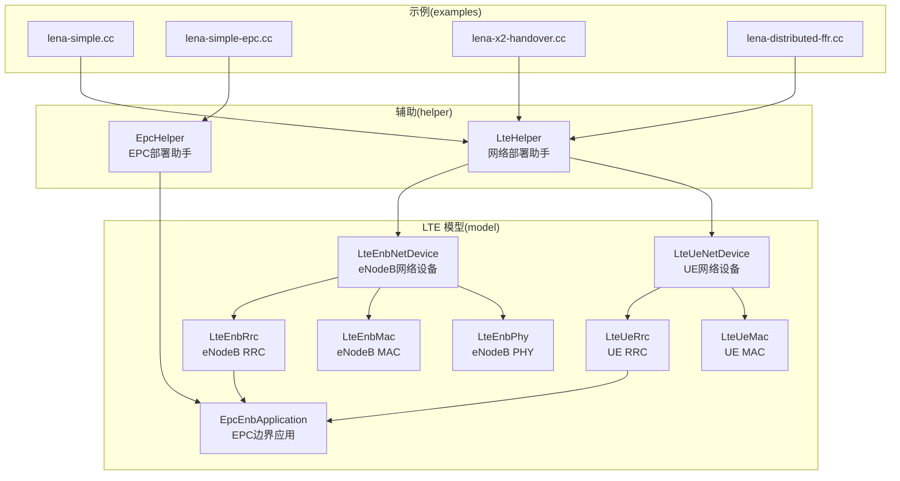
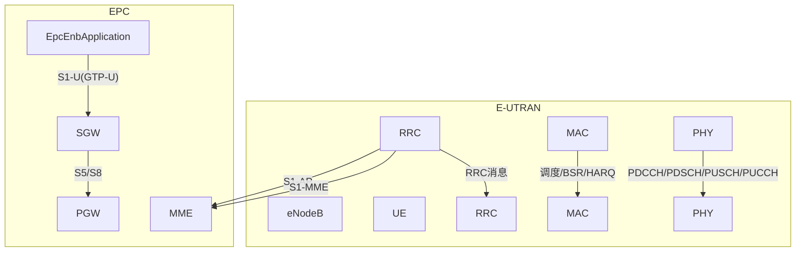
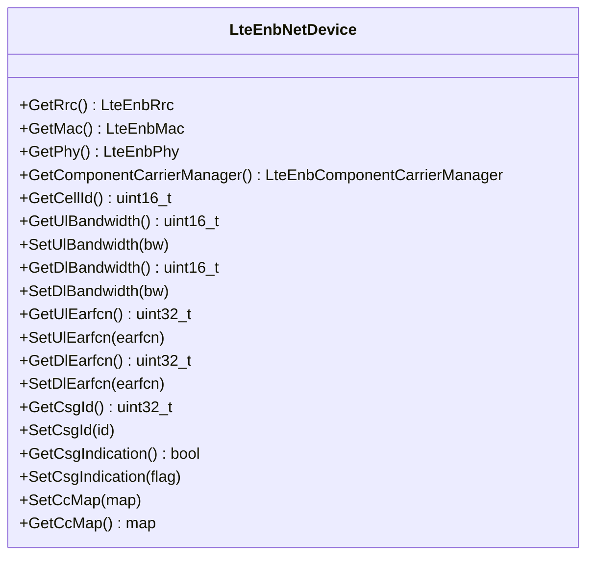
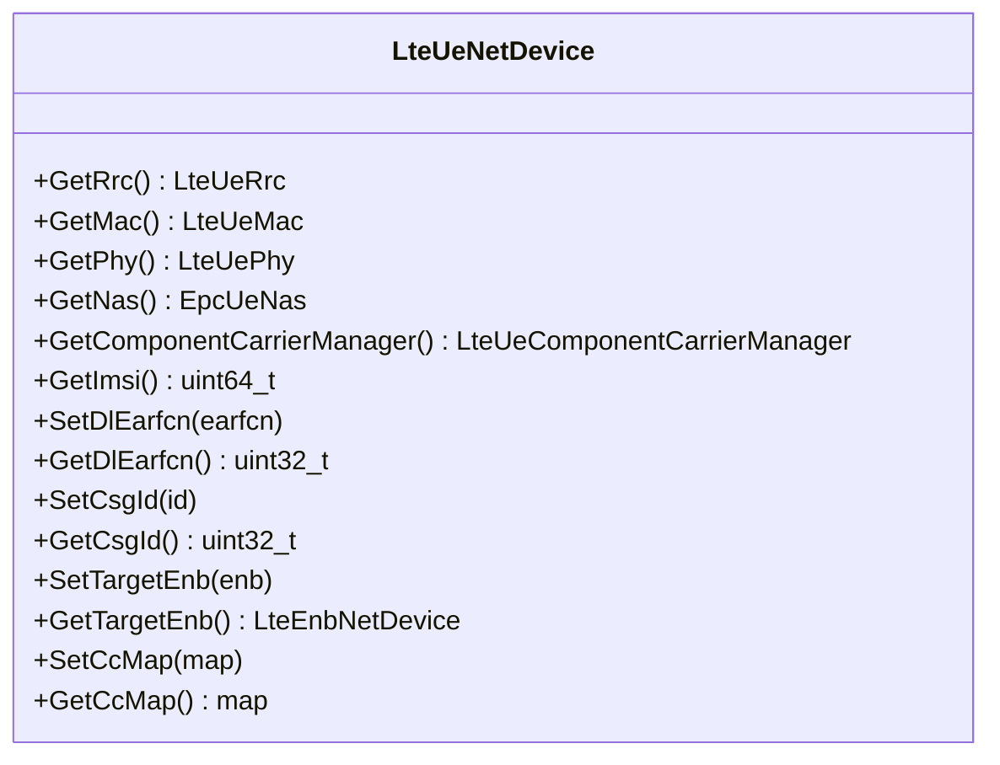
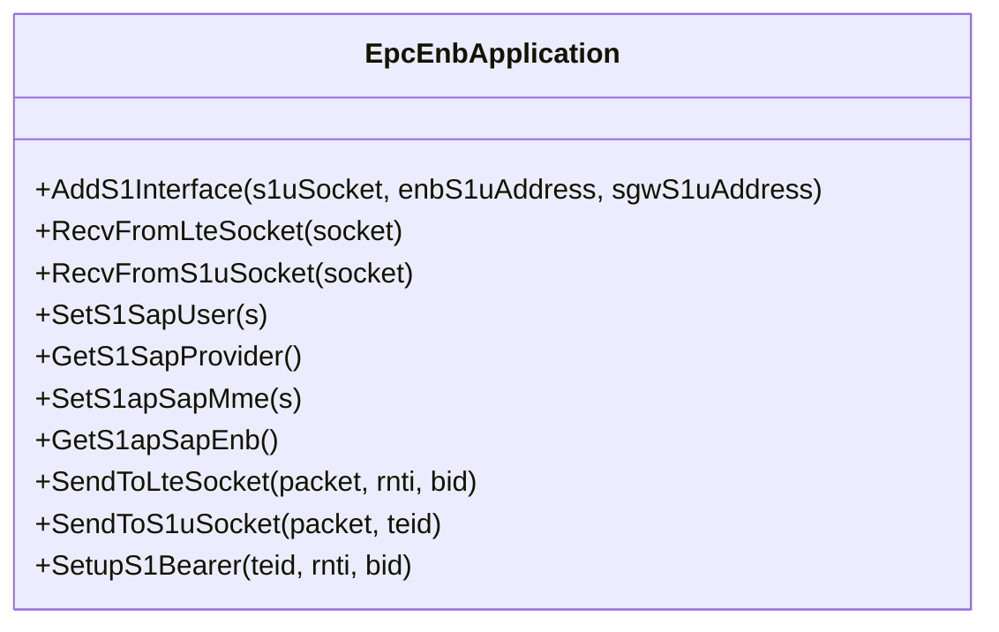
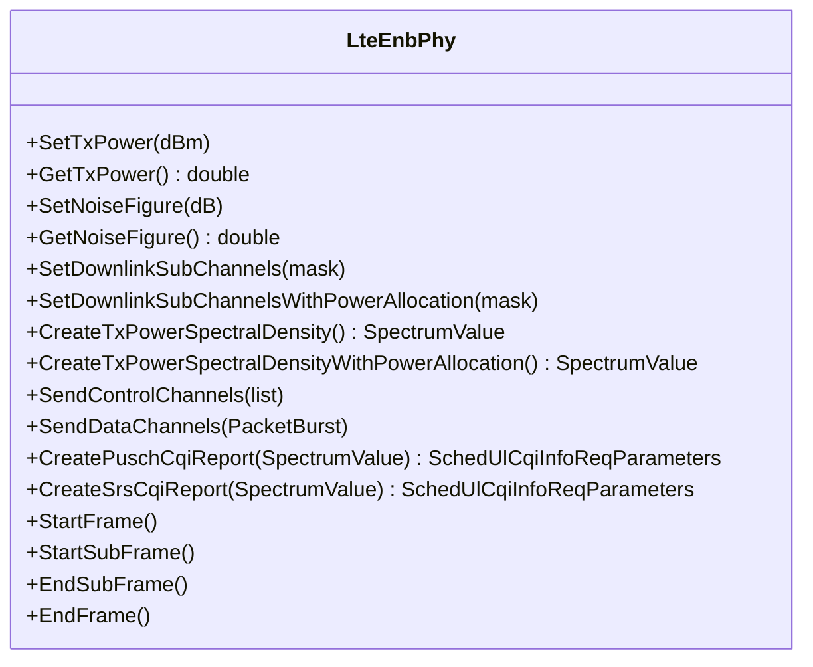
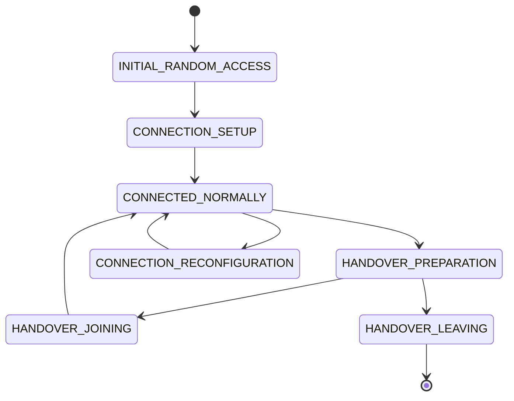
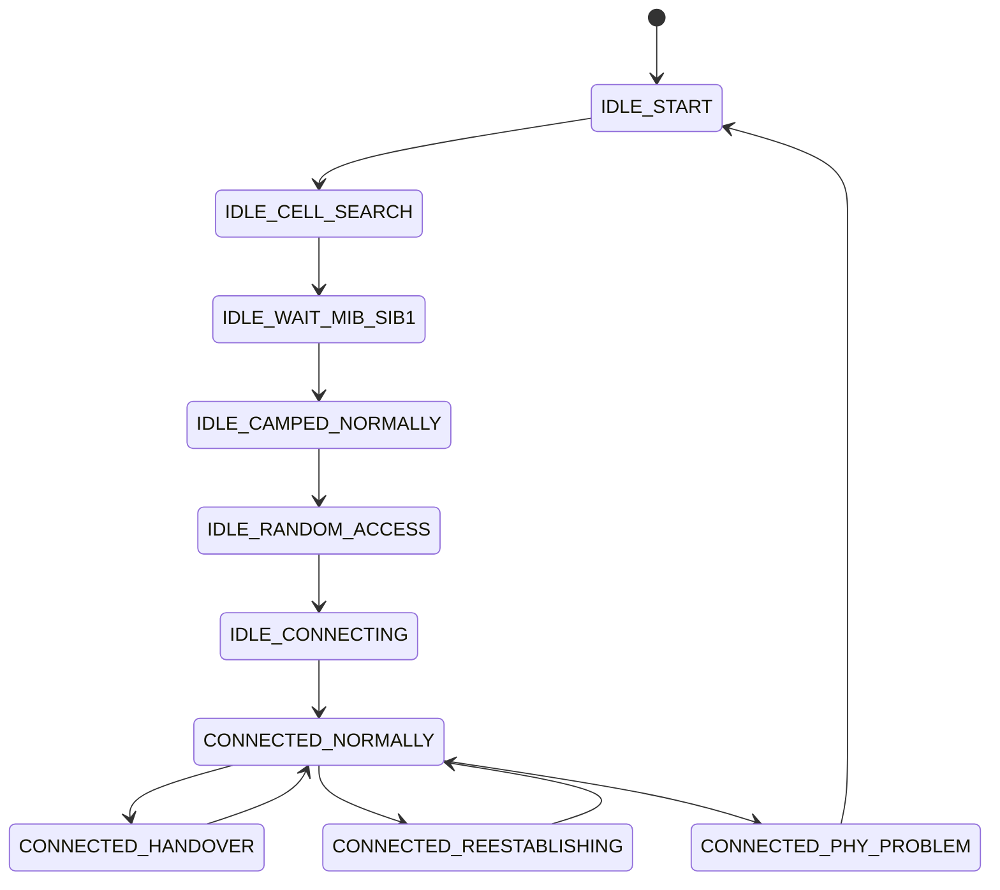
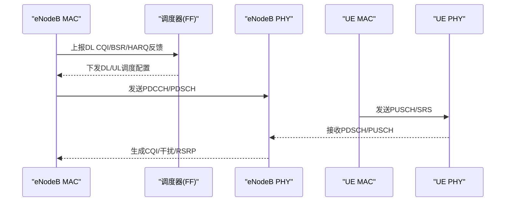
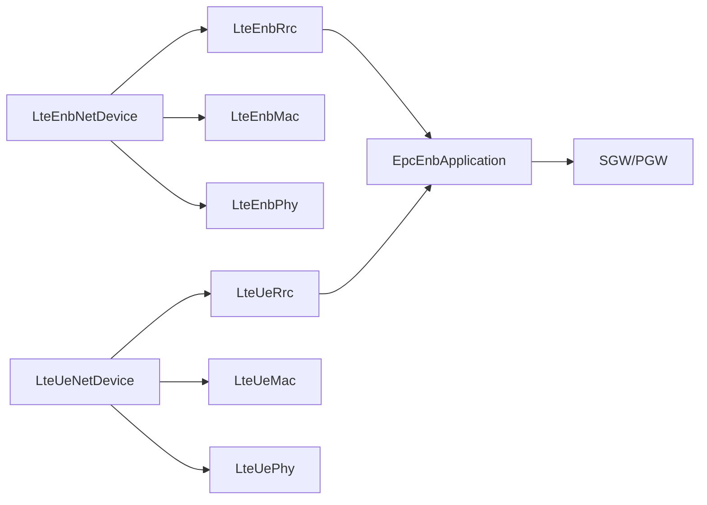

# LTE网络API

<cite>
**本文引用的文件**
- [lte-enb-net-device.h](file://src/lte/model/lte-enb-net-device.h)
- [lte-ue-net-device.h](file://src/lte/model/lte-ue-net-device.h)
- [epc-enb-application.h](file://src/lte/model/epc-enb-application.h)
- [lte-enb-phy.h](file://src/lte/model/lte-enb-phy.h)
- [lte-enb-rrc.h](file://src/lte/model/lte-enb-rrc.h)
- [lte-ue-rrc.h](file://src/lte/model/lte-ue-rrc.h)
- [lte-enb-mac.h](file://src/lte/model/lte-enb-mac.h)
- [lte-ue-mac.h](file://src/lte/model/lte-ue-mac.h)
- [lte-helper.h](file://src/lte/helper/lte-helper.h)
- [epc-helper.h](file://src/lte/helper/epc-helper.h)
- [lenna-simple.cc](file://src/lte/examples/lena-simple.cc)
- [lenna-simple-epc.cc](file://src/lte/examples/lena-simple-epc.cc)
- [lenna-x2-handover.cc](file://src/lte/examples/lena-x2-handover.cc)
- [lenna-distributed-ffr.cc](file://src/lte/examples/lena-distributed-ffr.cc)
</cite>

## 目录
1. [简介](#简介)
2. [项目结构](#项目结构)
3. [核心组件](#核心组件)
4. [架构总览](#架构总览)
5. [详细组件分析](#详细组件分析)
6. [依赖关系分析](#依赖关系分析)
7. [性能考虑](#性能考虑)
8. [故障排查指南](#故障排查指南)
9. [结论](#结论)
10. [附录](#附录)

## 简介
本文件为 NS-3 LTE 模块的完整 API 文档，聚焦于 eNodeB、UE、EPC 边界网关（EpcEnbApplication）等核心类的接口规范与使用方法。内容覆盖 4G LTE 网络架构、eNodeB 配置、UE 管理、EPS 承载建立与释放、移动性管理（含 X2 切换）、QoS 控制、RRC 状态机、调度算法与干扰管理等主题，并通过实际示例脚本路径指导部署与验证。

## 项目结构
LTE 模块位于 ns-3.39 的 src/lte 目录下，按功能划分为 model（核心实体与协议栈）、helper（网络拓扑与辅助工具）、examples（典型场景脚本）三大部分。核心网络设备类（LteEnbNetDevice、LteUeNetDevice）以及 RRC/MAC/PHY 子层均在 model 下实现；helper 提供高层封装以简化部署；examples 展示了从简单单小区到复杂多小区、多频段、多用户场景。

图表来源
- [lte-enb-net-device.h:58-100](file://src/lte/model/lte-enb-net-device.h#L58-L100)
- [lte-ue-net-device.h:56-100](file://src/lte/model/lte-ue-net-device.h#L56-L100)
- [lte-enb-rrc.h:654-700](file://src/lte/model/lte-enb-rrc.h#L654-L700)
- [lte-ue-rrc.h:76-120](file://src/lte/model/lte-ue-rrc.h#L76-L120)
- [lte-enb-mac.h:57-120](file://src/lte/model/lte-enb-mac.h#L57-L120)
- [lte-ue-mac.h:43-100](file://src/lte/model/lte-ue-mac.h#L43-L100)
- [epc-enb-application.h:49-120](file://src/lte/model/epc-enb-application.h#L49-L120)
- [lte-helper.h](file://src/lte/helper/lte-helper.h)
- [epc-helper.h](file://src/lte/helper/epc-helper.h)
- [lenna-simple.cc](file://src/lte/examples/lena-simple.cc)
- [lenna-simple-epc.cc](file://src/lte/examples/lena-simple-epc.cc)
- [lenna-x2-handover.cc](file://src/lte/examples/lena-x2-handover.cc)
- [lenna-distributed-ffr.cc](file://src/lte/examples/lena-distributed-ffr.cc)

章节来源
- [lte-enb-net-device.h:58-100](file://src/lte/model/lte-enb-net-device.h#L58-L100)
- [lte-ue-net-device.h:56-100](file://src/lte/model/lte-ue-net-device.h#L56-L100)
- [epc-enb-application.h:49-120](file://src/lte/model/epc-enb-application.h#L49-L120)

## 核心组件
本节概述 LTE 模块的关键类及其职责：
- LteEnbNetDevice：eNodeB 网络设备，聚合 RRC、MAC、PHY、调度器、ANR、频率复用等子系统，提供频谱带宽、EARFCN、CSG 等配置接口。
- LteUeNetDevice：UE 网络设备，聚合 RRC、MAC、PHY、NAS、组件载波管理，提供 IMSI、EARFCN、CSG、目标 eNodeB 等配置接口。
- EpcEnbApplication：安装在 eNodeB 内部的应用，桥接 S1-U 接口与 LTE 无线侧，负责用户面数据包转发、S1-AP/S1-SAP 协议交互、EPS 承载建立与释放。
- LteEnbRrc/LteUeRrc：eNodeB/UE 的无线资源控制实体，维护 RRC 状态机、测量配置、连接建立/重配置、切换、承载管理。
- LteEnbMac/LteUeMac：eNodeB/UE 的媒体访问控制实体，处理调度请求、缓冲区状态报告、随机接入过程、HARQ 反馈。
- LteEnbPhy：eNodeB 物理层，生成功率谱密度、发送控制/数据信道、上报 CQI、SINR、干扰统计。

章节来源
- [lte-enb-net-device.h:58-272](file://src/lte/model/lte-enb-net-device.h#L58-L272)
- [lte-ue-net-device.h:56-200](file://src/lte/model/lte-ue-net-device.h#L56-L200)
- [epc-enb-application.h:49-341](file://src/lte/model/epc-enb-application.h#L49-L341)
- [lte-enb-rrc.h:654-800](file://src/lte/model/lte-enb-rrc.h#L654-L800)
- [lte-ue-rrc.h:76-800](file://src/lte/model/lte-ue-rrc.h#L76-L800)
- [lte-enb-mac.h:57-471](file://src/lte/model/lte-enb-mac.h#L57-L471)
- [lte-ue-mac.h:43-307](file://src/lte/model/lte-ue-mac.h#L43-L307)
- [lte-enb-phy.h:44-521](file://src/lte/model/lte-enb-phy.h#L44-L521)

## 架构总览
下图展示 LTE 无线接入网（E-UTRAN）与 EPC 的交互关系，以及 eNodeB/UE 各子层之间的耦合与数据流。

图表来源
- [epc-enb-application.h:24-50](file://src/lte/model/epc-enb-application.h#L24-L50)
- [lte-enb-rrc.h:696-800](file://src/lte/model/lte-enb-rrc.h#L696-L800)
- [lte-ue-rrc.h:137-240](file://src/lte/model/lte-ue-rrc.h#L137-L240)

## 详细组件分析

### LteEnbNetDevice（eNodeB网络设备）
- 职责：作为 eNodeB 的统一入口，聚合 RRC、MAC、PHY、调度器、ANR、频率复用、组件载波管理等子系统；提供频谱带宽、EARFCN、CSG、CellId 等配置与查询接口。
- 关键接口要点：
  - 获取子模块指针：GetRrc()、GetMac()、GetPhy()、GetComponentCarrierManager()
  - 带宽与频点：SetUlBandwidth()/GetUlBandwidth()、SetDlBandwidth()/GetDlBandwidth()、SetUlEarfcn()/GetUlEarfcn()、SetDlEarfcn()/GetDlEarfcn()
  - CSG：SetCsgId()/GetCsgId()、SetCsgIndication()/GetCsgIndication()
  - 组件载波：SetCcMap()/GetCcMap()
- 使用建议：在部署阶段通过 LteHelper 设置频点与带宽后，调用 UpdateConfig() 将属性同步至各子模块。

图表来源
- [lte-enb-net-device.h:58-272](file://src/lte/model/lte-enb-net-device.h#L58-L272)

章节来源
- [lte-enb-net-device.h:58-272](file://src/lte/model/lte-enb-net-device.h#L58-L272)

### LteUeNetDevice（UE网络设备）
- 职责：作为 UE 的统一入口，聚合 RRC、MAC、PHY、NAS、组件载波管理；提供 IMSI、EARFCN、CSG、目标 eNodeB、组件载波映射等配置与查询接口。
- 关键接口要点：
  - 获取子模块指针：GetRrc()、GetMac()、GetPhy()、GetNas()、GetComponentCarrierManager()
  - IMSI/EARFCN/CSG：GetImsi()/SetCsgId()/GetCsgId()、SetDlEarfcn()/GetDlEarfcn()
  - 目标 eNodeB：SetTargetEnb()/GetTargetEnb()
  - 组件载波：SetCcMap()/GetCcMap()

图表来源
- [lte-ue-net-device.h:56-200](file://src/lte/model/lte-ue-net-device.h#L56-L200)

章节来源
- [lte-ue-net-device.h:56-200](file://src/lte/model/lte-ue-net-device.h#L56-L200)

### EpcEnbApplication（EPC边界应用）
- 职责：在 eNodeB 内部充当用户面网关，桥接 LTE 无线侧与 S1-U 接口，负责：
  - 用户面数据包在 LTE Socket 与 S1-U Socket 间的转发
  - S1-AP/S1-SAP 协议交互（初始上下文建立、切换、承载释放指示）
  - EPS 承载建立与释放（TEID 映射、RBID 映射）
- 关键接口要点：
  - AddS1Interface()：添加 S1-U 接口（本地/对端地址）
  - RecvFromLteSocket()/RecvFromS1uSocket()：接收回调
  - SetS1SapUser()/GetS1SapProvider()、SetS1apSapMme()/GetS1apSapEnb()
  - SendToLteSocket()/SendToS1uSocket()：发送用户面数据
  - SetupS1Bearer()：建立 S1 承载

图表来源
- [epc-enb-application.h:49-341](file://src/lte/model/epc-enb-application.h#L49-L341)

章节来源
- [epc-enb-application.h:49-341](file://src/lte/model/epc-enb-application.h#L49-L341)

### LteEnbPhy（eNodeB物理层）
- 职责：模拟 eNodeB 物理层，负责：
  - 功率谱密度生成、下行子载波分配与功率分配
  - 控制/数据信道发送（PDCCH/PDSCH/PUCCH/PUSCH）
  - 上行 CQI 生成（基于 PUSCH/SRS）、SINR/干扰上报
  - TTI 循环（StartFrame/SubFrame/EndFrame）
- 关键接口要点：
  - SetTxPower()/GetTxPower()、SetNoiseFigure()/GetNoiseFigure()
  - SetDownlinkSubChannels()/SetDownlinkSubChannelsWithPowerAllocation()
  - CreateTxPowerSpectralDensity()/CreateTxPowerSpectralDensityWithPowerAllocation()
  - SendControlChannels()/SendDataChannels()
  - CreatePuschCqiReport()/CreateSrsCqiReport()
  - ReportInterference()/ReportRsReceivedPower()

图表来源
- [lte-enb-phy.h:44-521](file://src/lte/model/lte-enb-phy.h#L44-L521)

章节来源
- [lte-enb-phy.h:44-521](file://src/lte/model/lte-enb-phy.h#L44-L521)

### RRC 状态机与承载管理

#### LteEnbRrc（eNodeB RRC）
- UeManager：每个 UE 的 RRC 管理单元，维护状态机（初始随机接入、连接建立、承载配置、切换准备/加入/离开等），处理测量报告、承载建立/启动/释放、X2 切换流程。
- 关键能力：
  - SetupDataRadioBearer()/RecordDataRadioBearersToBeStarted()/StartDataRadioBearers()
  - PrepareHandover()/RecvHandoverRequestAck()/SendUeContextRelease()
  - SendData()/RecvSnStatusTransfer()/RecvUeContextRelease()

图表来源
- [lte-enb-rrc.h:66-110](file://src/lte/model/lte-enb-rrc.h#L66-L110)

章节来源
- [lte-enb-rrc.h:66-800](file://src/lte/model/lte-enb-rrc.h#L66-L800)

#### LteUeRrc（UE RRC）
- 状态机：空闲态（搜索/等待 MIB/SIB1/SIB2）、随机接入、连接态（正常/切换/重建立/物理问题）。
- 关键能力：
  - ApplyMeasConfig()/SaveUeMeasurements()/MeasurementReportTriggering()/SendMeasurementReport()
  - ApplyRadioResourceConfigDedicated()/ApplyRadioResourceConfigDedicatedSecondaryCarrier()
  - StartConnection()/LeaveConnectedMode()

图表来源
- [lte-ue-rrc.h:98-114](file://src/lte/model/lte-ue-rrc.h#L98-L114)

章节来源
- [lte-ue-rrc.h:98-800](file://src/lte/model/lte-ue-rrc.h#L98-L800)

### MAC 与调度
- LteEnbMac：向调度器上报 CQI/BSR/HARQ，下发调度指令（DL/UL），处理 RACH 前导分配、逻辑信道配置。
- LteUeMac：发起随机接入（竞争/非竞争）、周期性 BSR 报告、接收调度结果并上交 RLC。

图表来源
- [lte-enb-mac.h:190-471](file://src/lte/model/lte-enb-mac.h#L190-L471)
- [lte-ue-mac.h:130-307](file://src/lte/model/lte-ue-mac.h#L130-L307)

章节来源
- [lte-enb-mac.h:190-471](file://src/lte/model/lte-enb-mac.h#L190-L471)
- [lte-ue-mac.h:130-307](file://src/lte/model/lte-ue-mac.h#L130-L307)

## 依赖关系分析
- 设备到子层：LteEnbNetDevice/LteUeNetDevice 分别持有 RRC/MAC/PHY/NAS/组件载波管理等子模块指针，形成“设备容器”模式。
- SAP 接口：RRC/MAC/PHY 之间通过 SAP（Service Access Point）解耦，例如 EnbRrc-Cmac、UeRrc-Cphy、EnbPhy-MAC 等。
- EPC 桥接：EpcEnbApplication 通过 S1-AP/S1-SAP 与 MME 交互，通过 GTP-U 与 SGW/PGW 交互。

图表来源
- [lte-enb-net-device.h:58-100](file://src/lte/model/lte-enb-net-device.h#L58-L100)
- [lte-ue-net-device.h:56-100](file://src/lte/model/lte-ue-net-device.h#L56-L100)
- [epc-enb-application.h:24-50](file://src/lte/model/epc-enb-application.h#L24-L50)

章节来源
- [lte-enb-net-device.h:58-100](file://src/lte/model/lte-enb-net-device.h#L58-L100)
- [lte-ue-net-device.h:56-100](file://src/lte/model/lte-ue-net-device.h#L56-L100)
- [epc-enb-application.h:24-50](file://src/lte/model/epc-enb-application.h#L24-L50)

## 性能考虑
- 调度与公平性：通过 FF MAC 调度器接口（FfMacSchedSap/FfMacCschedSap）选择不同算法（如 PF、MMSE、Proportional Fair），影响吞吐与公平性。
- 干扰管理：LteEnbPhy 支持上报干扰谱密度与 RS 功率，结合 RRC 的测量配置可优化邻区管理与频率复用策略。
- 移动性：X2 切换减少掉话时间，需合理设置测量门限与触发参数；分布式频率复用（D-FR）可降低小区间干扰。
- 多载波聚合：组件载波管理（CCM）支持多 CC 并行传输，提升容量与覆盖。

## 故障排查指南
- 随机接入失败：检查 LteUeMac 的 RA 响应超时事件与前导发射计数；确认 RACH 配置与 eNodeB 资源是否充足。
- 连接建立超时：关注 LteEnbRrc/UeRrc 的连接请求/设置超时事件，核对 MIB/SIB1 下发与测量配置。
- 承载建立失败：核查 EpcEnbApplication 的 S1-AP 初始上下文建立流程与 TEID/RBID 映射。
- 干扰过高：查看 LteEnbPhy 的干扰上报与 SINR 回调，调整功率、子载波分配或切换参数。

章节来源
- [lte-ue-mac.h:280-307](file://src/lte/model/lte-ue-mac.h#L280-L307)
- [lte-enb-rrc.h:600-640](file://src/lte/model/lte-enb-rrc.h#L600-L640)
- [epc-enb-application.h:180-260](file://src/lte/model/epc-enb-application.h#L180-L260)
- [lte-enb-phy.h:277-320](file://src/lte/model/lte-enb-phy.h#L277-L320)

## 结论
NS-3 LTE 模块通过清晰的设备-子层分层与 SAP 解耦，提供了可扩展的 4G LTE 仿真框架。借助 LteHelper/EpcHelper，用户可在单/多小区、多频段、多用户场景中快速部署网络；通过 RRC 状态机、MAC 调度与 EPC 承载管理，能够覆盖从基础接入到复杂移动性与 QoS 控制的多种需求。

## 附录

### API 使用示例（脚本路径）
- 单小区基础仿真：[lena-simple.cc](file://src/lte/examples/lena-simple.cc)
- EPC 连接仿真：[lena-simple-epc.cc](file://src/lte/examples/lena-simple-epc.cc)
- X2 切换仿真：[lena-x2-handover.cc](file://src/lte/examples/lena-x2-handover.cc)
- 分布式频率复用仿真：[lena-distributed-ffr.cc](file://src/lte/examples/lena-distributed-ffr.cc)

章节来源
- [lenna-simple.cc](file://src/lte/examples/lena-simple.cc)
- [lenna-simple-epc.cc](file://src/lte/examples/lena-simple-epc.cc)
- [lenna-x2-handover.cc](file://src/lte/examples/lena-x2-handover.cc)
- [lenna-distributed-ffr.cc](file://src/lte/examples/lena-distributed-ffr.cc)