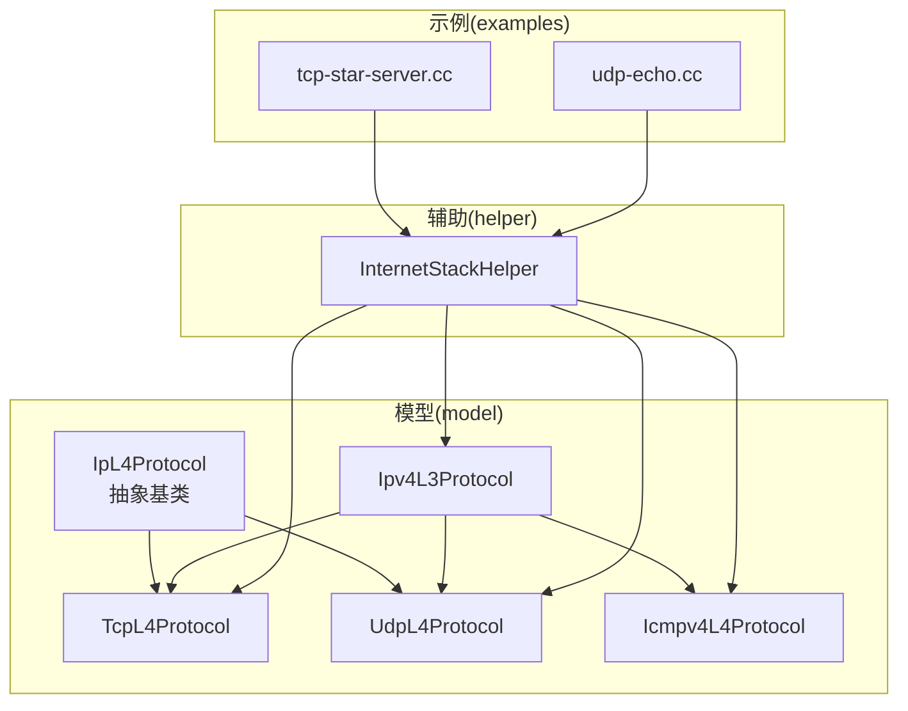
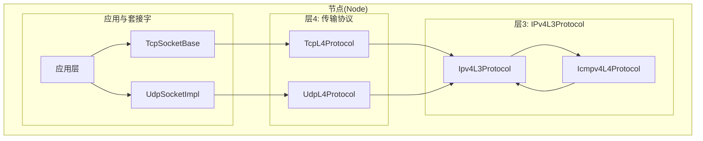
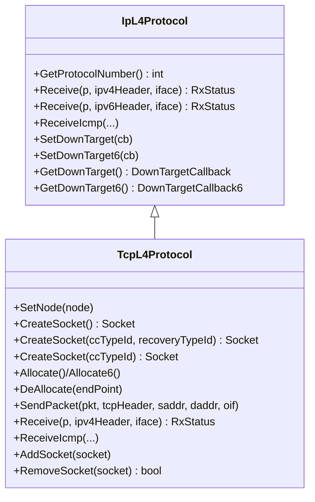
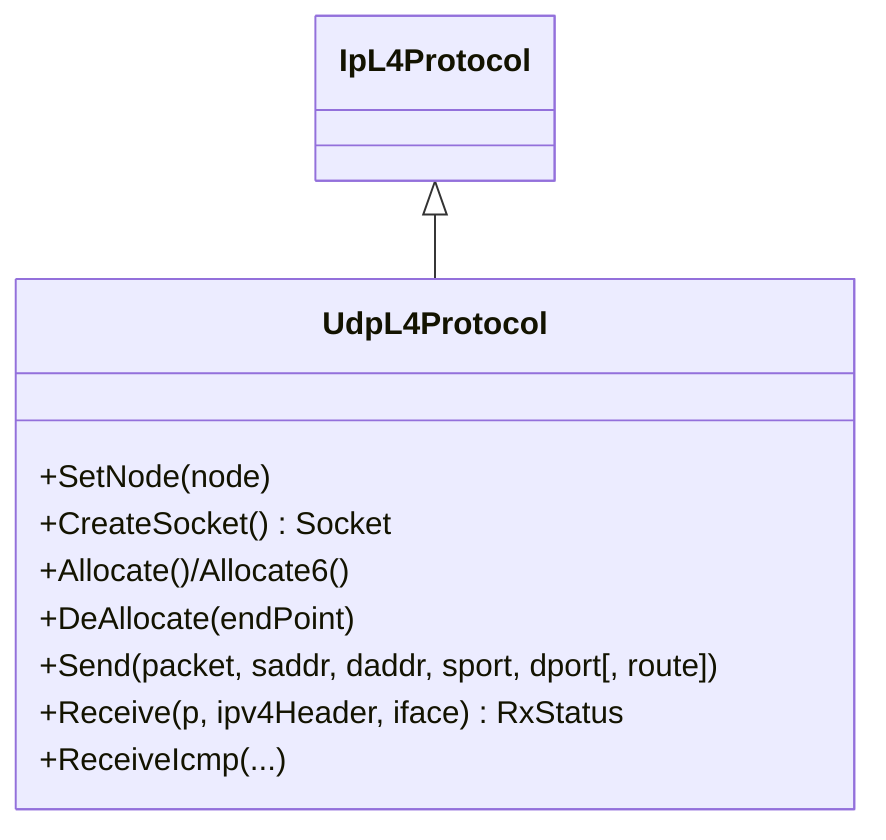
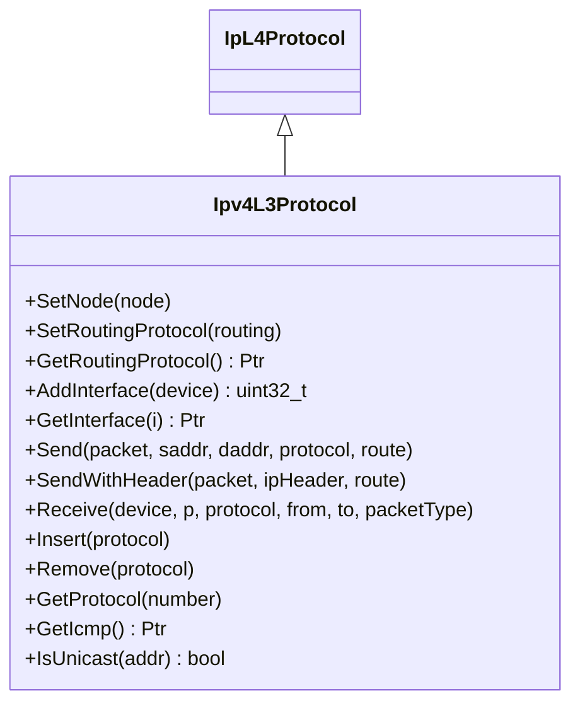
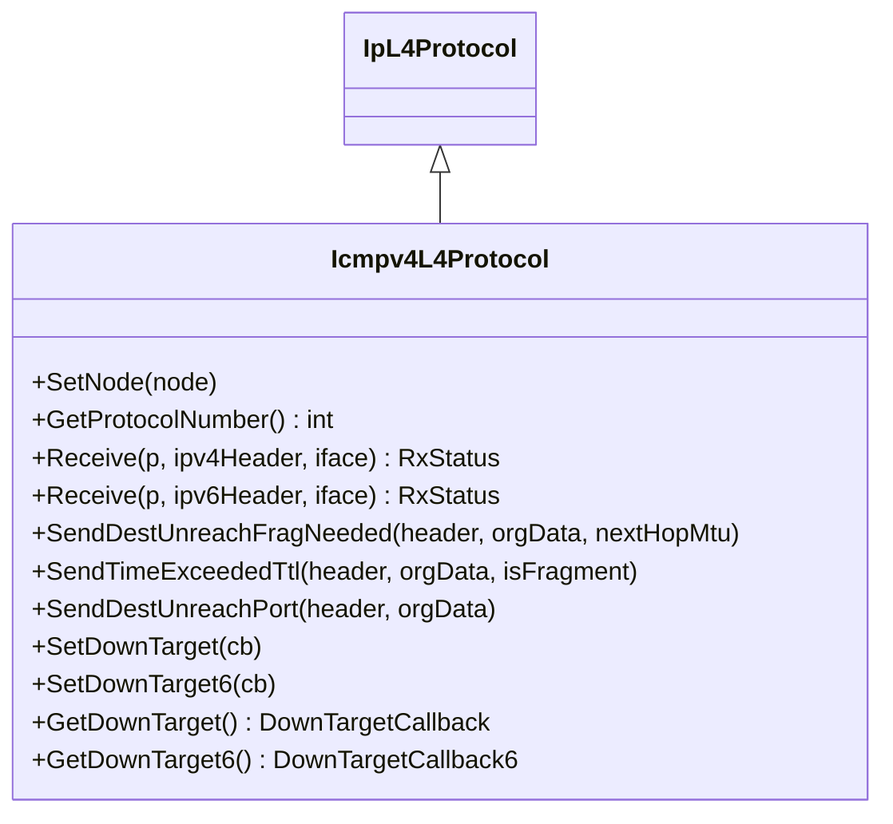
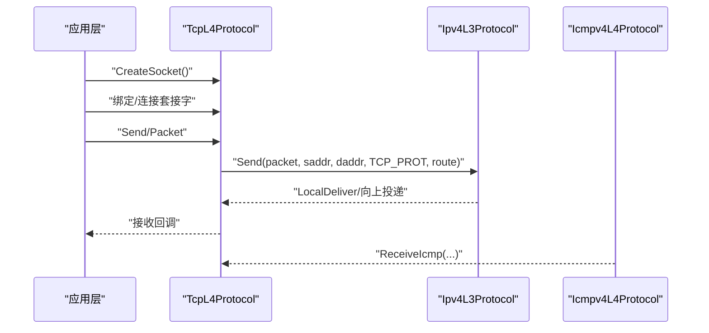
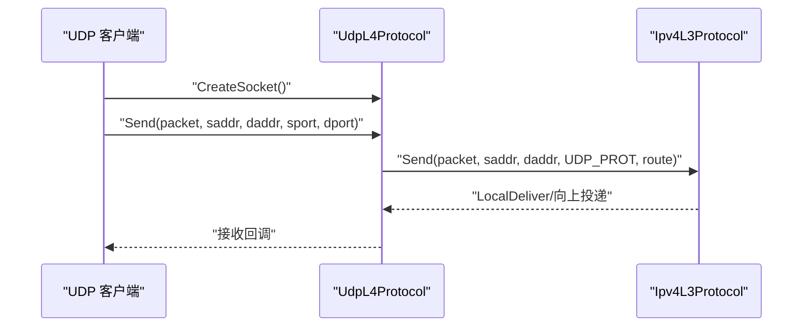
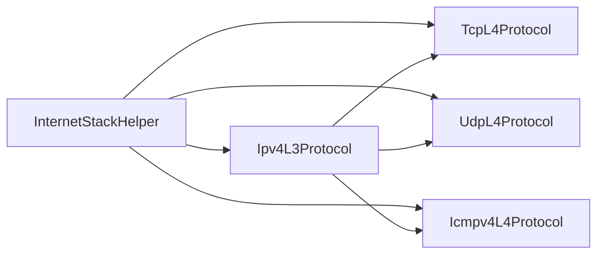

# 互联网协议API

<cite>
**本文引用的文件**
- [ip-l4-protocol.h](file://simulator/ns-3.39/src/internet/model/ip-l4-protocol.h)
- [tcp-l4-protocol.h](file://simulator/ns-3.39/src/internet/model/tcp-l4-protocol.h)
- [udp-l4-protocol.h](file://simulator/ns-3.39/src/internet/model/udp-l4-protocol.h)
- [ipv4-l3-protocol.h](file://simulator/ns-3.39/src/internet/model/ipv4-l3-protocol.h)
- [icmpv4-l4-protocol.h](file://simulator/ns-3.39/src/internet/model/icmpv4-l4-protocol.h)
- [icmpv4-l4-protocol.cc](file://simulator/ns-3.39/src/internet/model/icmpv4-l4-protocol.cc)
- [internet-stack.rst](file://simulator/ns-3.39/src/internet/doc/internet-stack.rst)
- [internet-stack-helper.h](file://simulator/ns-3.39/src/internet/helper/internet-stack-helper.h)
- [tcp-star-server.cc](file://simulator/ns-3.39/examples/tcp/tcp-star-server.cc)
- [udp-echo.cc](file://simulator/ns-3.39/examples/udp/udp-echo.cc)
</cite>

## 目录
1. [简介](#简介)
2. [项目结构](#项目结构)
3. [核心组件](#核心组件)
4. [架构总览](#架构总览)
5. [详细组件分析](#详细组件分析)
6. [依赖分析](#依赖分析)
7. [性能考虑](#性能考虑)
8. [故障排查指南](#故障排查指南)
9. [结论](#结论)
10. [附录](#附录)

## 简介
本文件为 NS-3 互联网协议栈的完整 API 文档，聚焦于以下协议类的接口规范与使用方法：
- 传输层：TcpL4Protocol、UdpL4Protocol
- 网络层：Ipv4L3Protocol
- ICMP（IPv4）：Icmpv4L4Protocol

内容涵盖：
- 协议类的继承层次与协作关系
- 各类接口规范（创建套接字、端点分配、发送/接收、ICMP 处理、向下回调等）
- 典型应用场景（TCP 连接建立、UDP 数据传输、路由配置）
- 代码级调用流程图与时序图，帮助快速理解协议栈内部工作机理

## 项目结构
NS-3 的互联网模块位于 simulator/ns-3.39/src/internet，主要由以下子目录组成：
- model：协议实现（如 TcpL4Protocol、UdpL4Protocol、Ipv4L3Protocol、Icmpv4L4Protocol 等）
- helper：辅助工具（如 InternetStackHelper、地址助手、路由助手等）
- examples：示例程序（如 TCP 星型服务器、UDP 回显）

图表来源
- [ip-l4-protocol.h:51-191](file://simulator/ns-3.39/src/internet/model/ip-l4-protocol.h#L51-L191)
- [tcp-l4-protocol.h:80-379](file://simulator/ns-3.39/src/internet/model/tcp-l4-protocol.h#L80-L379)
- [udp-l4-protocol.h:63-304](file://simulator/ns-3.39/src/internet/model/udp-l4-protocol.h#L63-L304)
- [ipv4-l3-protocol.h:81-638](file://simulator/ns-3.39/src/internet/model/ipv4-l3-protocol.h#L81-L638)
- [icmpv4-l4-protocol.h:46-229](file://simulator/ns-3.39/src/internet/model/icmpv4-l4-protocol.h#L46-L229)
- [internet-stack-helper.h:88-344](file://simulator/ns-3.39/src/internet/helper/internet-stack-helper.h#L88-L344)

章节来源
- [internet-stack.rst:1-318](file://simulator/ns-3.39/src/internet/doc/internet-stack.rst#L1-L318)

## 核心组件
本节概述四大协议类的关键职责与公共接口。

- IpL4Protocol（抽象基类）
  - 定义传输层通用接口：GetProtocolNumber、Receive（IPv4/IPv6）、ReceiveIcmp、向下回调设置与获取等
  - 提供 RxStatus 枚举用于接收返回状态（成功、校验失败、端点关闭、端点不可达）

- TcpL4Protocol（TCP 实现）
  - 负责 TCP 套接字工厂、端点分配（IPv4/IPv6）、数据包发送、端点查找与 RST 处理
  - 提供 CreateSocket、Allocate/Allocate6、DeAllocate、SendPacket、AddSocket/RemoveSocket 等

- UdpL4Protocol（UDP 实现）
  - 负责 UDP 套接字工厂、端点分配、数据报发送、端点管理
  - 提供 CreateSocket、Allocate/Allocate6、DeAllocate、Send 等

- Ipv4L3Protocol（IPv4 实现）
  - 负责接口管理、路由、分片/重组、本地投递、ICMP 获取、发送/接收入口
  - 提供 Send/SendWithHeader、Receive、Insert/Remove 协议、GetInterface 等

- Icmpv4L4Protocol（ICMPv4 实现）
  - 负责处理 ICMP 消息（回显、目的不可达、超时等），并向 L4 层转发错误信息
  - 提供 SendDestUnreachFragNeeded、SendTimeExceededTtl、SendDestUnreachPort 等

章节来源
- [ip-l4-protocol.h:51-191](file://simulator/ns-3.39/src/internet/model/ip-l4-protocol.h#L51-L191)
- [tcp-l4-protocol.h:80-379](file://simulator/ns-3.39/src/internet/model/tcp-l4-protocol.h#L80-L379)
- [udp-l4-protocol.h:63-304](file://simulator/ns-3.39/src/internet/model/udp-l4-protocol.h#L63-L304)
- [ipv4-l3-protocol.h:81-638](file://simulator/ns-3.39/src/internet/model/ipv4-l3-protocol.h#L81-L638)
- [icmpv4-l4-protocol.h:46-229](file://simulator/ns-3.39/src/internet/model/icmpv4-l4-protocol.h#L46-L229)

## 架构总览
下图展示了节点内协议栈的聚合与交互关系，以及数据包在发送/接收路径上的流转。

图表来源
- [internet-stack.rst:105-180](file://simulator/ns-3.39/src/internet/doc/internet-stack.rst#L105-L180)
- [ipv4-l3-protocol.h:119-135](file://simulator/ns-3.39/src/internet/model/ipv4-l3-protocol.h#L119-L135)
- [tcp-l4-protocol.h:260-289](file://simulator/ns-3.39/src/internet/model/tcp-l4-protocol.h#L260-L289)
- [udp-l4-protocol.h:253-284](file://simulator/ns-3.39/src/internet/model/udp-l4-protocol.h#L253-L284)
- [icmpv4-l4-protocol.h:124-129](file://simulator/ns-3.39/src/internet/model/icmpv4-l4-protocol.h#L124-L129)

## 详细组件分析

### 组件一：TcpL4Protocol（TCP 传输层）
- 继承关系
  - TcpL4Protocol 继承自 IpL4Protocol，实现 TCP 协议族的传输层逻辑
- 关键接口
  - 套接字工厂：CreateSocket（支持指定拥塞控制与恢复算法 TypeId）
  - 端点管理：Allocate/Allocate6、DeAllocate（IPv4/IPv6）
  - 发送接口：SendPacket（IP 无关）、SendPacketV4/V6（IPv4/IPv6）
  - 接收与错误处理：Receive（IPv4/IPv6）、ReceiveIcmp、NoEndPointsFound
  - 生命周期：SetNode、AddSocket/RemoveSocket、NotifyNewAggregate、DoDispose
- 处理流程
  - 应用通过 TcpSocketBase 调用 TcpL4Protocol::SendPacket 下发数据
  - TcpL4Protocol 将数据交给 Ipv4L3Protocol（通过 DownTarget 回调）
  - 收到上层数据时，Ipv4L3Protocol 解析协议号并调用 TcpL4Protocol::Receive
  - 若无匹配端点，触发 RST 或错误处理

图表来源
- [ip-l4-protocol.h:51-191](file://simulator/ns-3.39/src/internet/model/ip-l4-protocol.h#L51-L191)
- [tcp-l4-protocol.h:80-379](file://simulator/ns-3.39/src/internet/model/tcp-l4-protocol.h#L80-L379)

章节来源
- [tcp-l4-protocol.h:80-379](file://simulator/ns-3.39/src/internet/model/tcp-l4-protocol.h#L80-L379)

### 组件二：UdpL4Protocol（UDP 传输层）
- 继承关系
  - UdpL4Protocol 继承自 IpL4Protocol，实现 UDP 无连接、不可靠数据报服务
- 关键接口
  - 套接字工厂：CreateSocket
  - 端点管理：Allocate/Allocate6、DeAllocate（IPv4/IPv6）
  - 发送接口：Send（支持 IPv4/IPv6、带路由参数）
  - 接收与错误处理：Receive（IPv4/IPv6）、ReceiveIcmp
  - 生命周期：SetNode、RemoveSocket、NotifyNewAggregate、DoDispose

图表来源
- [ip-l4-protocol.h:51-191](file://simulator/ns-3.39/src/internet/model/ip-l4-protocol.h#L51-L191)
- [udp-l4-protocol.h:63-304](file://simulator/ns-3.39/src/internet/model/udp-l4-protocol.h#L63-L304)

章节来源
- [udp-l4-protocol.h:63-304](file://simulator/ns-3.39/src/internet/model/udp-l4-protocol.h#L63-L304)

### 组件三：Ipv4L3Protocol（IPv4 网络层）
- 关键职责
  - 接口管理：AddInterface、GetInterface、SetUp/SetDown、SetForwarding
  - 地址管理：AddAddress、GetAddress、SelectSourceAddress、IsUnicast
  - 路由与转发：SetRoutingProtocol、Send/SendWithHeader、LocalDeliver、IpForward、IpMulticastForward
  - 分片/重组：DoFragmentation、ProcessFragment、HandleTimeout
  - 协议注册：Insert/Remove、GetProtocol、GetIcmp
- 生命周期：SetNode、NotifyNewAggregate、DoDispose

图表来源
- [ipv4-l3-protocol.h:81-638](file://simulator/ns-3.39/src/internet/model/ipv4-l3-protocol.h#L81-L638)
- [ip-l4-protocol.h:51-191](file://simulator/ns-3.39/src/internet/model/ip-l4-protocol.h#L51-L191)

章节来源
- [ipv4-l3-protocol.h:81-638](file://simulator/ns-3.39/src/internet/model/ipv4-l3-protocol.h#L81-L638)

### 组件四：Icmpv4L4Protocol（ICMPv4）
- 关键职责
  - 处理入站 ICMP 消息：Echo、Destination Unreachable、Time Exceeded
  - 向上层转发错误信息：Forward（携带源、类型、代码、载荷等）
  - 错误消息生成：SendDestUnreachFragNeeded、SendTimeExceededTtl、SendDestUnreachPort
  - 设置/获取向下回调：SetDownTarget、SetDownTarget6、GetDownTarget、GetDownTarget6
- 生命周期：SetNode、NotifyNewAggregate、DoDispose

图表来源
- [icmpv4-l4-protocol.h:46-229](file://simulator/ns-3.39/src/internet/model/icmpv4-l4-protocol.h#L46-L229)
- [ip-l4-protocol.h:51-191](file://simulator/ns-3.39/src/internet/model/ip-l4-protocol.h#L51-L191)

章节来源
- [icmpv4-l4-protocol.h:46-229](file://simulator/ns-3.39/src/internet/model/icmpv4-l4-protocol.h#L46-L229)
- [icmpv4-l4-protocol.cc:40-65](file://simulator/ns-3.39/src/internet/model/icmpv4-l4-protocol.cc#L40-L65)

### API 使用方法与典型场景

#### TCP 连接建立（星型拓扑）
- 步骤概览
  - 安装互联网栈：InternetStackHelper::Install
  - 配置全局静态路由：Ipv4GlobalRoutingHelper::PopulateRoutingTables
  - 创建 TCP 接收端（PacketSink）与发送端（OnOffApplication）
  - 启动仿真并观察 ASCII/PCAP 跟踪输出
- 示例参考
  - [tcp-star-server.cc:87-158](file://simulator/ns-3.39/examples/tcp/tcp-star-server.cc#L87-L158)

图表来源
- [tcp-star-server.cc:87-158](file://simulator/ns-3.39/examples/tcp/tcp-star-server.cc#L87-L158)
- [tcp-l4-protocol.h:260-289](file://simulator/ns-3.39/src/internet/model/tcp-l4-protocol.h#L260-L289)
- [ipv4-l3-protocol.h:176-189](file://simulator/ns-3.39/src/internet/model/ipv4-l3-protocol.h#L176-L189)
- [icmpv4-l4-protocol.h:124-129](file://simulator/ns-3.39/src/internet/model/icmpv4-l4-protocol.h#L124-L129)

章节来源
- [tcp-star-server.cc:87-158](file://simulator/ns-3.39/examples/tcp/tcp-star-server.cc#L87-L158)

#### UDP 数据传输（CSMA 广域网）
- 步骤概览
  - 安装互联网栈：InternetStackHelper::Install
  - 配置 CSMA 设备与地址：CsmaHelper、Ipv4AddressHelper
  - 创建 UDP 回显服务器与客户端（UdpEchoServerHelper/UdpEchoClientHelper）
  - 启动仿真并观察 ASCII/PCAP 跟踪输出
- 示例参考
  - [udp-echo.cc:67-147](file://simulator/ns-3.39/examples/udp/udp-echo.cc#L67-L147)

图表来源
- [udp-echo.cc:67-147](file://simulator/ns-3.39/examples/udp/udp-echo.cc#L67-L147)
- [udp-l4-protocol.h:253-284](file://simulator/ns-3.39/src/internet/model/udp-l4-protocol.h#L253-L284)
- [ipv4-l3-protocol.h:176-189](file://simulator/ns-3.39/src/internet/model/ipv4-l3-protocol.h#L176-L189)

章节来源
- [udp-echo.cc:67-147](file://simulator/ns-3.39/examples/udp/udp-echo.cc#L67-L147)

#### 路由配置（全局静态路由）
- 步骤概览
  - 安装 IPv4 栈与路由：InternetStackHelper::Install
  - 配置全局静态路由表：Ipv4GlobalRoutingHelper::PopulateRoutingTables
  - 在节点上设置默认 TTL、接口状态、转发能力等
- 参考
  - [internet-stack.rst:114-180](file://simulator/ns-3.39/src/internet/doc/internet-stack.rst#L114-L180)
  - [ipv4-l3-protocol.h:119-222](file://simulator/ns-3.39/src/internet/model/ipv4-l3-protocol.h#L119-L222)

章节来源
- [internet-stack.rst:114-180](file://simulator/ns-3.39/src/internet/doc/internet-stack.rst#L114-L180)
- [ipv4-l3-protocol.h:119-222](file://simulator/ns-3.39/src/internet/model/ipv4-l3-protocol.h#L119-L222)

## 依赖分析
- 组件耦合
  - TcpL4Protocol 与 UdpL4Protocol 均依赖 IpL4Protocol 抽象接口
  - Ipv4L3Protocol 作为网络层核心，向上承载 TCP/UDP/ICMP，向下对接设备与链路层
  - InternetStackHelper 负责在节点上聚合上述对象，并设置默认路由策略
- 外部依赖
  - 节点对象（Node）通过聚合方式组合协议实例
  - 应用层通过 Socket 工厂（如 TcpSocketFactory、UdpSocketFactory）创建套接字

图表来源
- [internet-stack-helper.h:88-92](file://simulator/ns-3.39/src/internet/helper/internet-stack-helper.h#L88-L92)
- [ipv4-l3-protocol.h:127-134](file://simulator/ns-3.39/src/internet/model/ipv4-l3-protocol.h#L127-L134)

章节来源
- [internet-stack-helper.h:88-92](file://simulator/ns-3.39/src/internet/helper/internet-stack-helper.h#L88-L92)
- [ipv4-l3-protocol.h:127-134](file://simulator/ns-3.39/src/internet/model/ipv4-l3-protocol.h#L127-L134)

## 性能考虑
- 分片与重组
  - IPv4L3Protocol 支持分片与重组，但不完全模拟 Linux 行为；注意避免碎片攻击测试场景
- MTU 与路径 MTU
  - UDP 建议发送不超过 1500 字节 MTU 的数据报；可通过 Icmpv4L4Protocol 的错误消息进行 PMTU 更新
- ARP 缓存队列
  - ARP 缓存待处理队列有限（默认 3 个数据报），突发或巨包可能导致队列溢出；可增大 PendingQueueSize
- 路由与转发
  - 启用全局静态路由有助于简化拓扑，但在大规模网络中需关注路由表规模与查询开销

章节来源
- [ipv4-l3-protocol.h:74-80](file://simulator/ns-3.39/src/internet/model/ipv4-l3-protocol.h#L74-L80)
- [internet-stack.rst:166-175](file://simulator/ns-3.39/src/internet/doc/internet-stack.rst#L166-L175)

## 故障排查指南
- 常见问题
  - 端点未找到导致 RST：检查端点是否正确分配与绑定
  - 校验失败：确认 TCP/UDP 校验和相关配置与数据完整性
  - 路由缺失：确保已安装并启用路由协议（如全局静态路由）
  - 分片超时：关注 HandleTimeout 与 FragmentKey 管理
- 排查建议
  - 启用相应日志组件（如 TcpL4Protocol、TcpSocketImpl、PacketSink）
  - 使用 ASCII/PCAP 跟踪定位丢包位置
  - 检查接口状态（IsUp/SetUp）、转发标志（IsForwarding/SetForwarding）

章节来源
- [tcp-l4-protocol.h:333-336](file://simulator/ns-3.39/src/internet/model/tcp-l4-protocol.h#L333-L336)
- [ipv4-l3-protocol.h:517-532](file://simulator/ns-3.39/src/internet/model/ipv4-l3-protocol.h#L517-L532)
- [internet-stack.rst:166-175](file://simulator/ns-3.39/src/internet/doc/internet-stack.rst#L166-L175)

## 结论
本文系统梳理了 NS-3 中 TCP、UDP、IPv4、ICMPv4 的协议类接口与协作关系，并结合示例展示了典型应用场景。通过 InternetStackHelper 的聚合机制，用户可在节点上快速装配完整的互联网协议栈，并利用跟踪工具定位性能瓶颈与异常路径。建议在实际仿真中结合路由策略、MTU 与 ARP 队列参数进行针对性优化。

## 附录
- 协议号速查
  - TCP：0x06
  - UDP：0x11
  - ICMPv4：0x01
  - IPv4：0x0800
- 相关示例路径
  - TCP 星型服务器：examples/tcp/tcp-star-server.cc
  - UDP 回显：examples/udp/udp-echo.cc