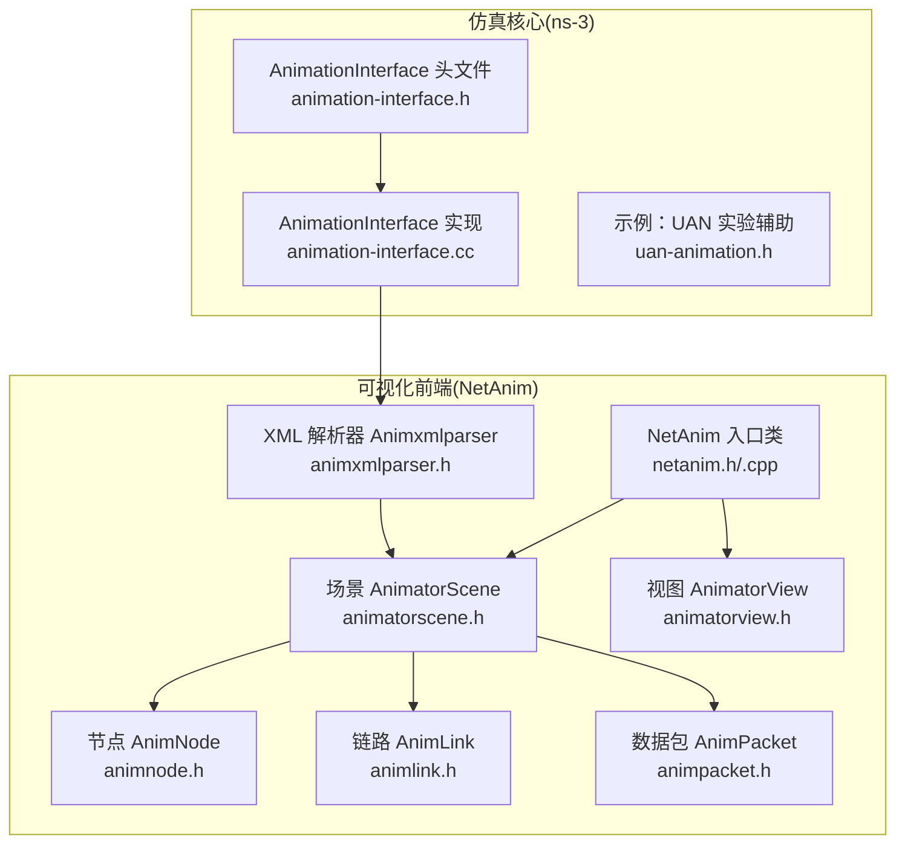
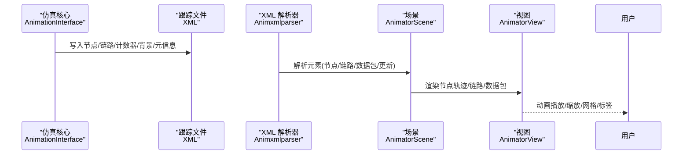
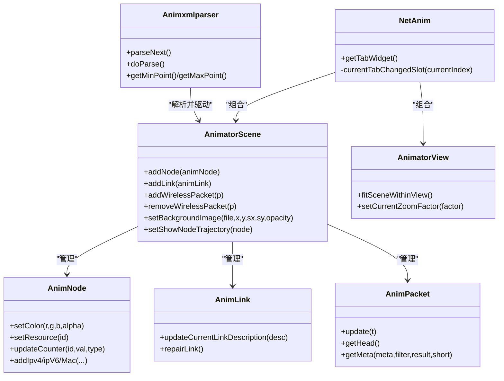
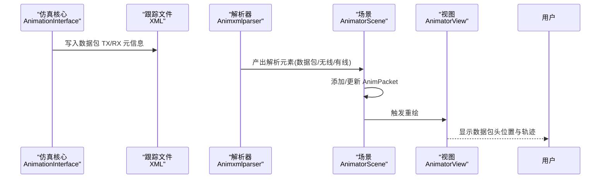
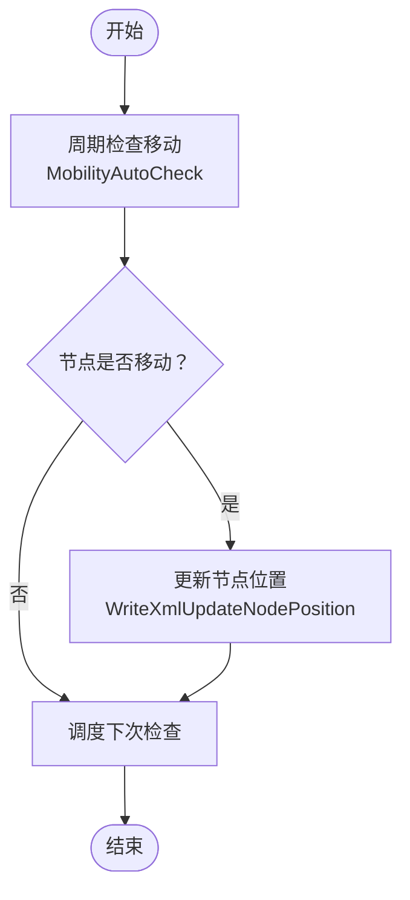
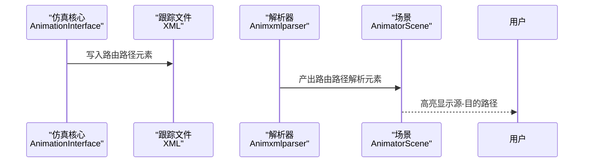
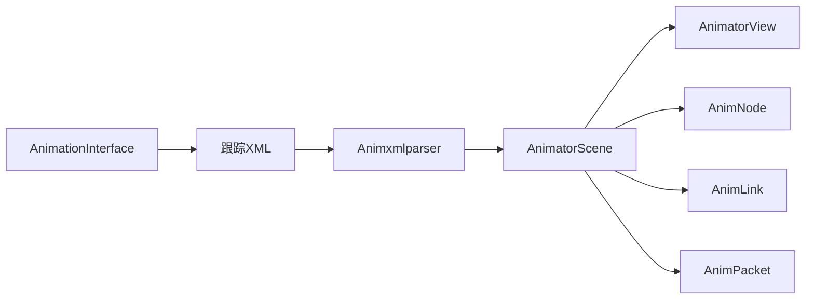

# 可视化API

<cite>
**本文引用的文件**
- [animation-interface.h](file://simulator/ns-3.39/src/netanim/model/animation-interface.h)
- [animation-interface.cc](file://simulator/ns-3.39/src/netanim/model/animation-interface.cc)
- [netanim.h](file://simulator/netanim-3.109/netanim.h)
- [netanim.cpp](file://simulator/netanim-3.109/netanim.cpp)
- [animnode.h](file://simulator/netanim-3.109/animnode.h)
- [animpacket.h](file://simulator/netanim-3.109/animpacket.h)
- [animatorscene.h](file://simulator/netanim-3.109/animatorscene.h)
- [animatorview.h](file://simulator/netanim-3.109/animatorview.h)
- [animlink.h](file://simulator/netanim-3.109/animlink.h)
- [animxmlparser.h](file://simulator/netanim-3.109/animxmlparser.h)
- [uan-animation.h](file://simulator/ns-3.39/src/netanim/examples/uan-animation.h)
</cite>

## 目录
1. [简介](#简介)
2. [项目结构](#项目结构)
3. [核心组件](#核心组件)
4. [架构总览](#架构总览)
5. [详细组件分析](#详细组件分析)
6. [依赖关系分析](#依赖关系分析)
7. [性能考虑](#性能考虑)
8. [故障排查指南](#故障排查指南)
9. [结论](#结论)
10. [附录](#附录)

## 简介
本文件为 NS-3 可视化模块的详细 API 文档，重点覆盖以下内容：
- AnimationInterface 类：仿真核心侧用于生成可视化跟踪文件（XML）的接口，支持节点移动、路由路径、计数器、数据包元信息、资源与背景等更新。
- NetAnim 相关类：Qt 前端可视化引擎，负责解析跟踪文件、渲染节点轨迹、链路、数据包传输、统计面板等。

目标是帮助开发者快速掌握如何在仿真脚本中启用可视化、配置动画参数、定制样式、控制输出格式，并理解与仿真核心的集成方式及性能优化策略。

## 项目结构
该仓库包含两部分：
- ns-3 核心模块（src/netanim/model）：提供 AnimationInterface API，负责写入跟踪 XML 文件。
- NetAnim 前端（netanim-3.109）：基于 Qt 的可视化播放器，解析 XML 并渲染动画。

图表来源
- [animation-interface.h:1-120](file://simulator/ns-3.39/src/netanim/model/animation-interface.h#L1-L120)
- [animation-interface.cc:77-124](file://simulator/ns-3.39/src/netanim/model/animation-interface.cc#L77-L124)
- [netanim.h:28-42](file://simulator/netanim-3.109/netanim.h#L28-L42)
- [animatorscene.h:72-116](file://simulator/netanim-3.109/animatorscene.h#L72-L116)
- [animnode.h:35-112](file://simulator/netanim-3.109/animnode.h#L35-L112)
- [animlink.h:25-51](file://simulator/netanim-3.109/animlink.h#L25-L51)
- [animpacket.h:360-416](file://simulator/netanim-3.109/animpacket.h#L360-L416)
- [animxmlparser.h:156-220](file://simulator/netanim-3.109/animxmlparser.h#L156-L220)

章节来源
- [animation-interface.h:1-120](file://simulator/ns-3.39/src/netanim/model/animation-interface.h#L1-L120)
- [animation-interface.cc:77-124](file://simulator/ns-3.39/src/netanim/model/animation-interface.cc#L77-L124)
- [netanim.h:28-42](file://simulator/netanim-3.109/netanim.h#L28-L42)

## 核心组件
- AnimationInterface（仿真核心）
  - 职责：初始化跟踪文件、周期性写入节点位置、路由表、计数器、数据包元信息、资源与背景等；提供接口设置起止时间、最大包数、回调、跳过数据包追踪等。
  - 关键能力：启用/禁用计数器（IPv4 L3、队列、WiFi MAC/PHY）、启用路由跟踪、更新节点描述/颜色/尺寸/图片、添加资源、设置背景、打印源-目的路径、设置常位置、启用/禁用数据包元信息等。
- NetAnim（前端播放器）
  - 职责：解析 XML 跟踪文件，构建场景（节点、链路、数据包），管理视图缩放与网格、轨迹显示、界面文本、背景图等。
  - 关键类：AnimatorScene、AnimatorView、AnimNode、AnimLink、AnimPacket、Animxmlparser。

章节来源
- [animation-interface.h:87-428](file://simulator/ns-3.39/src/netanim/model/animation-interface.h#L87-L428)
- [animation-interface.cc:250-317](file://simulator/ns-3.39/src/netanim/model/animation-interface.cc#L250-L317)
- [netanim.cpp:29-56](file://simulator/netanim-3.109/netanim.cpp#L29-L56)

## 架构总览
下图展示从仿真核心到前端播放器的数据流与交互：

图表来源
- [animation-interface.cc:532-568](file://simulator/ns-3.39/src/netanim/model/animation-interface.cc#L532-L568)
- [animxmlparser.h:156-220](file://simulator/netanim-3.109/animxmlparser.h#L156-L220)
- [animatorscene.h:72-116](file://simulator/netanim-3.109/animatorscene.h#L72-L116)
- [animatorview.h:29-56](file://simulator/netanim-3.109/animatorview.h#L29-L56)

## 详细组件分析

### AnimationInterface 类 API
- 初始化与生命周期
  - 构造函数：传入输出文件名，内部启动动画并打开文件句柄。
  - 析构：停止动画并关闭文件。
  - 静态 IsInitialized：判断是否已初始化。
- 时间窗口与文件切分
  - SetStartTime/SetStopTime：设置采集起止时间。
  - SetMaxPktsPerTraceFile：限制单个跟踪文件中的数据包数量，超过后自动切分文件名。
  - SkipPacketTracing：仅采集移动、路由、计数器，不记录数据包，减小文件体积。
- 计数器与统计
  - EnableIpv4L3ProtocolCounters：启用 IPv4 L3 协议计数器（Tx/Rx/Drop）。
  - EnableQueueCounters：启用队列入队/出队/丢弃计数器。
  - EnableWifiMacCounters / EnableWifiPhyCounters：启用 WiFi MAC/PHY 丢弃计数器。
  - AddNodeCounter：注册自定义节点计数器，返回计数器 ID，后续通过 UpdateNodeCounter 更新。
- 节点与链路属性
  - UpdateNodeDescription / UpdateNodeColor / UpdateNodeSize / UpdateNodeImage：更新节点描述、颜色、尺寸、图片。
  - UpdateLinkDescription：更新链路描述（如带宽等）。
  - SetBackgroundImage：设置背景图及其位置、缩放、透明度。
  - SetConstantPosition：为节点设置固定位置（常用于静态拓扑）。
- 路由跟踪
  - EnableIpv4RouteTracking：启用路由表跟踪，可指定节点集合与轮询间隔。
  - AddSourceDestination：为某源节点添加一条目的 IPv4 地址，便于在前端高亮路径。
- 数据包与元信息
  - EnablePacketMetadata：开启数据包元信息打印（如协议字段）。
  - 内部维护不同无线技术的“待处理数据包”映射，周期清理以避免内存膨胀。
- 辅助查询
  - GetTracePktCount：当前跟踪文件中的数据包计数（测试用途）。
  - GetNodeEnergyFraction：节点剩余能量分数（测试用途）。

章节来源
- [animation-interface.h:87-428](file://simulator/ns-3.39/src/netanim/model/animation-interface.h#L87-L428)
- [animation-interface.cc:77-124](file://simulator/ns-3.39/src/netanim/model/animation-interface.cc#L77-L124)
- [animation-interface.cc:126-214](file://simulator/ns-3.39/src/netanim/model/animation-interface.cc#L126-L214)
- [animation-interface.cc:250-317](file://simulator/ns-3.39/src/netanim/model/animation-interface.cc#L250-L317)
- [animation-interface.cc:319-423](file://simulator/ns-3.39/src/netanim/model/animation-interface.cc#L319-L423)
- [animation-interface.cc:449-498](file://simulator/ns-3.39/src/netanim/model/animation-interface.cc#L449-L498)

### NetAnim 前端类族
- NetAnim
  - 组合多个模式页签（动画、统计、数据包、设计），并管理当前焦点页签。
- AnimatorScene
  - 管理节点、链路、数据包、轨迹、网格、背景图、接口文本等；提供清空、显示/隐藏、边界设置、缩放等操作。
- AnimatorView
  - 视图层，支持缩放、滚轮事件、重绘；提供 fitSceneWithinView 等布局功能。
- AnimNode
  - 表示一个可视化的节点，支持颜色、尺寸、图片、轨迹、计数器值、IPv4/IPv6/MAC 地址等。
- AnimLink
  - 表示链路，支持描述文本、点位坐标、修复链接等。
- AnimPacket
  - 表示数据包传输过程，支持解析元信息（ARP/PPP/Ethernet/WiFi/IPv4/IPv6/TCP/UDP/ICMP/AODV/DSDV/OLSR 等），绘制头位置、速度、半径、过滤类型等。
- Animxmlparser
  - 解析跟踪 XML，按时间顺序产出解析元素（节点、链路、数据包、更新、背景、计数器等），并统计边界、首包/千包/末包时间等。

图表来源
- [netanim.h:28-42](file://simulator/netanim-3.109/netanim.h#L28-L42)
- [animatorscene.h:72-116](file://simulator/netanim-3.109/animatorscene.h#L72-L116)
- [animatorview.h:29-56](file://simulator/netanim-3.109/animatorview.h#L29-L56)
- [animnode.h:35-112](file://simulator/netanim-3.109/animnode.h#L35-L112)
- [animlink.h:25-51](file://simulator/netanim-3.109/animlink.h#L25-L51)
- [animpacket.h:360-416](file://simulator/netanim-3.109/animpacket.h#L360-L416)
- [animxmlparser.h:156-220](file://simulator/netanim-3.109/animxmlparser.h#L156-L220)

章节来源
- [netanim.cpp:29-80](file://simulator/netanim-3.109/netanim.cpp#L29-L80)
- [animatorscene.h:72-167](file://simulator/netanim-3.109/animatorscene.h#L72-L167)
- [animatorview.h:29-56](file://simulator/netanim-3.109/animatorview.h#L29-L56)
- [animnode.h:35-164](file://simulator/netanim-3.109/animnode.h#L35-L164)
- [animlink.h:25-91](file://simulator/netanim-3.109/animlink.h#L25-L91)
- [animpacket.h:360-468](file://simulator/netanim-3.109/animpacket.h#L360-L468)
- [animxmlparser.h:156-224](file://simulator/netanim-3.109/animxmlparser.h#L156-L224)

### 数据包传输可视化流程

图表来源
- [animation-interface.cc:532-568](file://simulator/ns-3.39/src/netanim/model/animation-interface.cc#L532-L568)
- [animxmlparser.h:156-220](file://simulator/netanim-3.109/animxmlparser.h#L156-L220)
- [animatorscene.h:80-92](file://simulator/netanim-3.109/animatorscene.h#L80-L92)
- [animpacket.h:360-416](file://simulator/netanim-3.109/animpacket.h#L360-L416)

### 节点轨迹与移动更新流程

图表来源
- [animation-interface.cc:478-498](file://simulator/ns-3.39/src/netanim/model/animation-interface.cc#L478-L498)
- [animation-interface.cc:532-568](file://simulator/ns-3.39/src/netanim/model/animation-interface.cc#L532-L568)

### 路由路径跟踪流程

图表来源
- [animation-interface.cc:570-587](file://simulator/ns-3.39/src/netanim/model/animation-interface.cc#L570-L587)
- [animxmlparser.h:156-220](file://simulator/netanim-3.109/animxmlparser.h#L156-L220)

## 依赖关系分析
- 仿真核心对前端的依赖
  - AnimationInterface 仅负责写入 XML，不直接依赖 Qt；前端通过 Animxmlparser 解析 XML 并渲染。
- 前端内部耦合
  - AnimatorScene 组合 AnimNode/AnimLink/AnimPacket 管理器，统一进行增删改查与渲染。
  - AnimatorView 依赖 AnimatorScene 进行绘制与交互。
- 模块间接口契约
  - XML 字段与枚举（如 ParsedElementType）定义了前后端一致的数据契约，确保解析与渲染稳定。

图表来源
- [animation-interface.cc:532-568](file://simulator/ns-3.39/src/netanim/model/animation-interface.cc#L532-L568)
- [animxmlparser.h:156-220](file://simulator/netanim-3.109/animxmlparser.h#L156-L220)
- [animatorscene.h:72-116](file://simulator/netanim-3.109/animatorscene.h#L72-L116)
- [animatorview.h:29-56](file://simulator/netanim-3.109/animatorview.h#L29-L56)
- [animnode.h:35-112](file://simulator/netanim-3.109/animnode.h#L35-L112)
- [animlink.h:25-51](file://simulator/netanim-3.109/animlink.h#L25-L51)
- [animpacket.h:360-416](file://simulator/netanim-3.109/animpacket.h#L360-L416)

章节来源
- [animation-interface.cc:532-568](file://simulator/ns-3.39/src/netanim/model/animation-interface.cc#L532-L568)
- [animxmlparser.h:156-220](file://simulator/netanim-3.109/animxmlparser.h#L156-L220)
- [animatorscene.h:72-116](file://simulator/netanim-3.109/animatorscene.h#L72-L116)

## 性能考虑
- 减少数据包追踪
  - 使用 SkipPacketTracing：当仅需观察移动、路由与计数器时，可显著降低文件大小与写入开销。
- 控制采样频率
  - SetMobilityPollInterval：移动位置采样间隔越低，写入越频繁，可能影响性能；默认 0.25s。
  - 计数器轮询间隔：EnableIpv4L3ProtocolCounters/EnableQueueCounters/EnableWifiMacCounters/EnableWifiPhyCounters 的轮询间隔越短，写入越多。
- 文件切分
  - SetMaxPktsPerTraceFile：合理设置单文件包数上限，避免单文件过大导致解析与播放卡顿。
- 资源与背景
  - 背景图透明度与缩放应适度，避免过度绘制；仅在需要时启用背景图。
- 计数器数量
  - 自定义计数器数量不宜过多，避免频繁写入与前端渲染压力。

章节来源
- [animation-interface.h:237-237](file://simulator/ns-3.39/src/netanim/model/animation-interface.h#L237-L237)
- [animation-interface.h:227-227](file://simulator/ns-3.39/src/netanim/model/animation-interface.h#L227-L227)
- [animation-interface.cc:126-214](file://simulator/ns-3.39/src/netanim/model/animation-interface.cc#L126-L214)

## 故障排查指南
- 未看到节点移动
  - 检查是否设置了常位置（SetConstantPosition），或移动模型是否正确挂载；确认时间窗口内有移动事件。
- 数据包未显示
  - 确认未调用 SkipPacketTracing；若启用了 EnablePacketMetadata，请确保已开启 Packet::EnablePrinting。
- 路由路径未高亮
  - 确认已调用 AddSourceDestination 并且路由跟踪已启用；检查路由文件是否被正确解析。
- 背景图不显示
  - 检查文件路径、透明度范围（0.0~1.0）与缩放比例；确认已调用 SetBackgroundImage。
- 性能问题
  - 降低移动采样频率、减少计数器轮询间隔、启用文件切分、减少自定义计数器数量。

章节来源
- [animation-interface.cc:319-423](file://simulator/ns-3.39/src/netanim/model/animation-interface.cc#L319-L423)
- [animation-interface.cc:286-293](file://simulator/ns-3.39/src/netanim/model/animation-interface.cc#L286-L293)
- [animation-interface.cc:126-214](file://simulator/ns-3.39/src/netanim/model/animation-interface.cc#L126-L214)

## 结论
AnimationInterface 提供了从仿真核心输出可视化跟踪数据的能力，覆盖节点移动、链路、计数器、路由与数据包元信息；NetAnim 前端则负责解析与渲染，形成完整的可视化闭环。通过合理配置时间窗口、采样频率、文件切分与资源使用，可在保证可视化质量的同时兼顾性能。

## 附录

### 常见使用场景与示例路径
- 启用数据包元信息并设置最大包数
  - 示例路径：[animation-interface.cc:286-293](file://simulator/ns-3.39/src/netanim/model/animation-interface.cc#L286-L293)
  - 示例路径：[animation-interface.h:227-227](file://simulator/ns-3.39/src/netanim/model/animation-interface.h#L227-L227)
- 设置节点颜色与图片
  - 示例路径：[animation-interface.cc:392-405](file://simulator/ns-3.39/src/netanim/model/animation-interface.cc#L392-L405)
  - 示例路径：[animation-interface.cc:341-350](file://simulator/ns-3.39/src/netanim/model/animation-interface.cc#L341-L350)
- 启用 WiFi MAC/PHY 计数器
  - 示例路径：[animation-interface.cc:133-172](file://simulator/ns-3.39/src/netanim/model/animation-interface.cc#L133-L172)
- 启用路由跟踪并添加源-目的路径
  - 示例路径：[animation-interface.cc:217-247](file://simulator/ns-3.39/src/netanim/model/animation-interface.cc#L217-L247)
- 设置背景图
  - 示例路径：[animation-interface.cc:363-375](file://simulator/ns-3.39/src/netanim/model/animation-interface.cc#L363-L375)
- UAN 示例参考
  - 示例路径：[uan-animation.h:33-76](file://simulator/ns-3.39/src/netanim/examples/uan-animation.h#L33-L76)