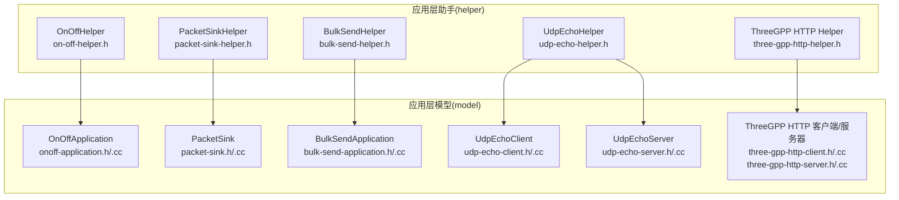
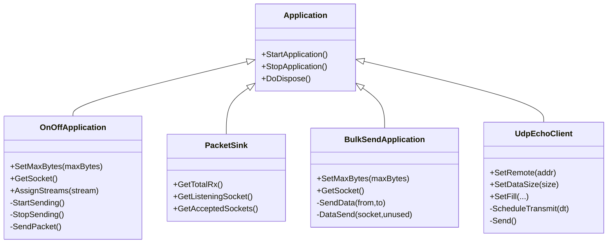
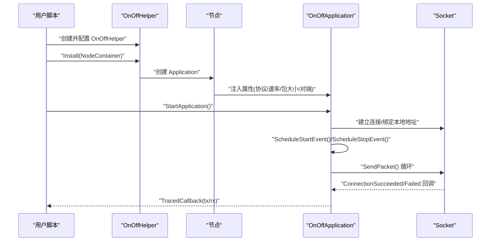
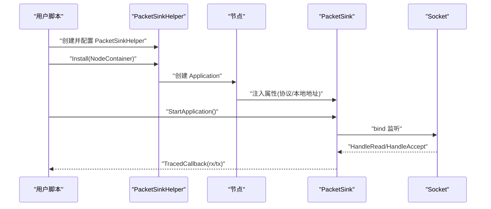
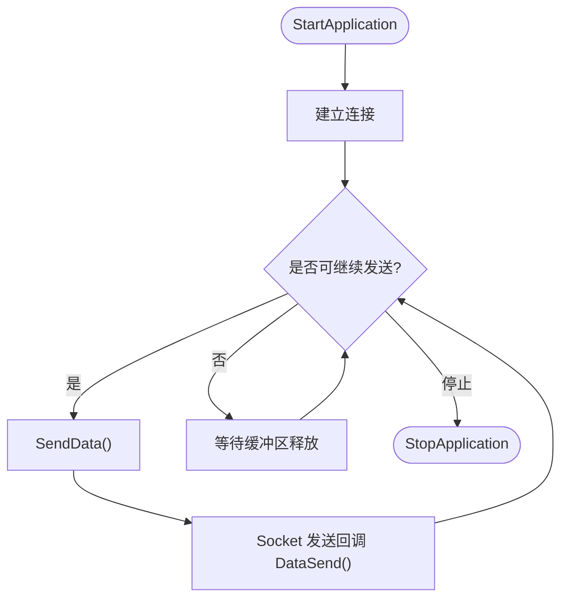
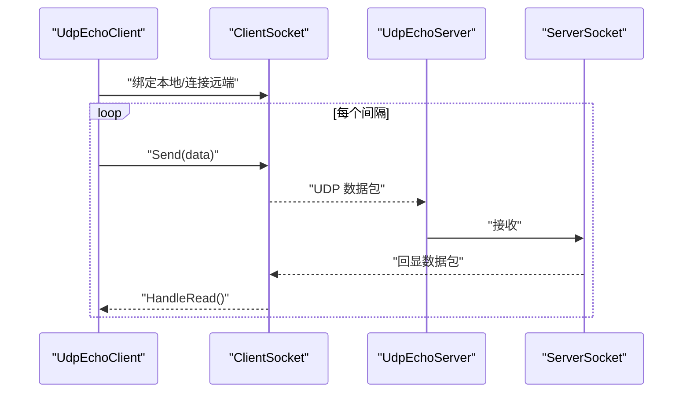
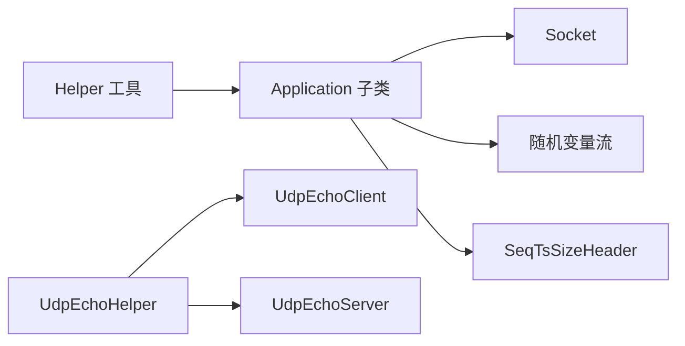

# 应用层API

<cite>
**本文引用的文件**
- [onoff-application.h](file://src/applications/model/onoff-application.h)
- [packet-sink.h](file://src/applications/model/packet-sink.h)
- [bulk-send-application.h](file://src/applications/model/bulk-send-application.h)
- [udp-echo-client.h](file://src/applications/model/udp-echo-client.h)
- [on-off-helper.h](file://src/applications/helper/on-off-helper.h)
- [packet-sink-helper.h](file://src/applications/helper/packet-sink-helper.h)
- [bulk-send-helper.h](file://src/applications/helper/bulk-send-helper.h)
- [udp-echo-helper.h](file://src/applications/helper/udp-echo-helper.h)
- [onoff-application.cc](file://src/applications/model/onoff-application.cc)
- [packet-sink.cc](file://src/applications/model/packet-sink.cc)
- [bulk-send-application.cc](file://src/applications/model/bulk-send-application.cc)
- [udp-echo-client.cc](file://src/applications/model/udp-echo-client.cc)
- [udp-echo-server.h](file://src/applications/model/udp-echo-server.h)
- [udp-echo-server.cc](file://src/applications/model/udp-echo-server.cc)
- [three-gpp-http-client.h](file://src/applications/model/three-gpp-http-client.h)
- [three-gpp-http-server.h](file://src/applications/model/three-gpp-http-server.h)
- [three-gpp-http-helper.h](file://src/applications/helper/three-gpp-http-helper.h)
- [examples/three-gpp-http-example.cc](file://src/applications/examples/three-gpp-http-example.cc)
</cite>

## 目录
1. [简介](#简介)
2. [项目结构](#项目结构)
3. [核心组件](#核心组件)
4. [架构总览](#架构总览)
5. [详细组件分析](#详细组件分析)
6. [依赖关系分析](#依赖关系分析)
7. [性能考量](#性能考量)
8. [故障排查指南](#故障排查指南)
9. [结论](#结论)
10. [附录：扩展与自定义开发指南](#附录扩展与自定义开发指南)

## 简介
本文件为 NS-3 应用层模块的详细 API 文档，聚焦以下应用类及其配套 Helper 的完整接口说明：
- OnOffApplication：基于“开/关”模式的恒定比特率流量生成器
- PacketSink：通用应用层接收端，支持单播/组播场景
- BulkSendApplication：尽力而为的持续发送应用（面向可靠传输）
- UdpEchoClient/UdpEchoServer：UDP 回显客户端/服务端
- ThreeGPP HTTP 客户端/服务器：面向 5G/3GPP 场景的 HTTP 流量模型

文档覆盖配置参数、启动方法、数据收发接口、典型使用示例（FTP/HTTP/视频流）、以及扩展与自定义开发建议。

## 项目结构
应用层相关源码位于 applications 模块，按“model”和“helper”分层组织：
- model：具体应用实现（如 OnOffApplication、PacketSink、BulkSendApplication、UdpEchoClient/Server、ThreeGPP HTTP）
- helper：辅助安装与属性设置（如 OnOffHelper、PacketSinkHelper、BulkSendHelper、UdpEchoHelper、ThreeGPP HTTP Helper）

**图表来源**
- [onoff-application.h:95-215](file://src/applications/model/onoff-application.h#L95-L215)
- [packet-sink.h:71-204](file://src/applications/model/packet-sink.h#L71-L204)
- [bulk-send-application.h:75-175](file://src/applications/model/bulk-send-application.h#L75-L175)
- [udp-echo-client.h:39-183](file://src/applications/model/udp-echo-client.h#L39-L183)
- [on-off-helper.h:43-128](file://src/applications/helper/on-off-helper.h#L43-L128)
- [packet-sink-helper.h:35-96](file://src/applications/helper/packet-sink-helper.h#L35-L96)
- [bulk-send-helper.h:43-106](file://src/applications/helper/bulk-send-helper.h#L43-L106)
- [udp-echo-helper.h:38-229](file://src/applications/helper/udp-echo-helper.h#L38-L229)
- [three-gpp-http-client.h](file://src/applications/model/three-gpp-http-client.h)
- [three-gpp-http-server.h](file://src/applications/model/three-gpp-http-server.h)
- [three-gpp-http-helper.h](file://src/applications/helper/three-gpp-http-helper.h)

**章节来源**
- [onoff-application.h:1-220](file://src/applications/model/onoff-application.h#L1-L220)
- [packet-sink.h:1-210](file://src/applications/model/packet-sink.h#L1-L210)
- [bulk-send-application.h:1-180](file://src/applications/model/bulk-send-application.h#L1-L180)
- [udp-echo-client.h:1-188](file://src/applications/model/udp-echo-client.h#L1-L188)
- [on-off-helper.h:1-133](file://src/applications/helper/on-off-helper.h#L1-L133)
- [packet-sink-helper.h:1-101](file://src/applications/helper/packet-sink-helper.h#L1-L101)
- [bulk-send-helper.h:1-111](file://src/applications/helper/bulk-send-helper.h#L1-L111)
- [udp-echo-helper.h:1-234](file://src/applications/helper/udp-echo-helper.h#L1-L234)

## 核心组件
本节概述四大核心应用类的关键职责与公共能力：
- OnOffApplication：周期性“开/关”产生恒定比特率流量；支持可选序列号+时间戳+大小头用于统计
- PacketSink：通用接收端，统计总接收字节、跟踪连接生命周期事件、可导出 SeqTsSize 头信息
- BulkSendApplication：尽可能快地发送数据，直到达到上限或缓冲区拥塞；仅适用于可靠传输
- UdpEchoClient/UdpEchoServer：回显测试应用，验证端到端连通性与延迟特性

**章节来源**
- [onoff-application.h:42-94](file://src/applications/model/onoff-application.h#L42-L94)
- [packet-sink.h:39-70](file://src/applications/model/packet-sink.h#L39-L70)
- [bulk-send-application.h:36-74](file://src/applications/model/bulk-send-application.h#L36-L74)
- [udp-echo-client.h:33-38](file://src/applications/model/udp-echo-client.h#L33-L38)

## 架构总览
应用层通过 Application 基类统一生命周期管理（StartApplication/StopApplication），并通过 Socket 进行数据收发。Helper 负责对象工厂化创建与属性注入，简化用户侧配置。

**图表来源**
- [onoff-application.h:95-215](file://src/applications/model/onoff-application.h#L95-L215)
- [packet-sink.h:71-204](file://src/applications/model/packet-sink.h#L71-L204)
- [bulk-send-application.h:75-175](file://src/applications/model/bulk-send-application.h#L75-L175)
- [udp-echo-client.h:39-183](file://src/applications/model/udp-echo-client.h#L39-L183)

## 详细组件分析

### OnOffApplication（恒定比特率“开/关”流量）
- 关键职责
  - 在“开”阶段以指定速率与包大小持续发送；在“关”阶段暂停发送
  - 支持最大发送字节数限制；支持启用 SeqTsSizeHeader 辅助统计
- 启动与停止
  - StartApplication：初始化并调度首个发送事件
  - StopApplication：取消挂起事件并断开连接
- 配置要点
  - 协议类型（如 UDP/TCP）、对端地址、On/Off 时间分布、数据速率、包大小、最大字节数
  - 可选启用 SeqTsSizeHeader 并通过 Trace 回调导出统计
- 典型用法
  - 使用 OnOffHelper 快速批量部署；通过 SetAttribute 注入参数；通过 AssignStreams 固定随机种子

**图表来源**
- [on-off-helper.h:43-128](file://src/applications/helper/on-off-helper.h#L43-L128)
- [onoff-application.h:136-215](file://src/applications/model/onoff-application.h#L136-L215)

**章节来源**
- [onoff-application.h:95-215](file://src/applications/model/onoff-application.h#L95-L215)
- [on-off-helper.h:43-128](file://src/applications/helper/on-off-helper.h#L43-L128)

### PacketSink（通用接收端）
- 关键职责
  - 接收来自底层协议栈的数据，统计总接收字节
  - 支持监听套接字与多连接接受；可导出 SeqTsSizeHeader 信息
- 启动与停止
  - StartApplication：绑定本地地址并注册回调
  - StopApplication：关闭监听与已接受套接字
- 配置要点
  - 协议类型（如 TCP/UDP）、本地地址、是否启用 SeqTsSizeHeader
- 典型用法
  - 使用 PacketSinkHelper 安装；通过 GetTotalRx 获取吞吐统计

**图表来源**
- [packet-sink-helper.h:35-96](file://src/applications/helper/packet-sink-helper.h#L35-L96)
- [packet-sink.h:112-204](file://src/applications/model/packet-sink.h#L112-L204)

**章节来源**
- [packet-sink.h:71-204](file://src/applications/model/packet-sink.h#L71-L204)
- [packet-sink-helper.h:35-96](file://src/applications/helper/packet-sink-helper.h#L35-L96)

### BulkSendApplication（持续发送）
- 关键职责
  - 尽可能快地发送数据，利用下层发送缓冲区空间，维持稳定带宽
  - 支持最大字节数上限；支持 SeqTsSizeHeader
- 启动与停止
  - StartApplication：建立连接并开始发送
  - StopApplication：停止后续发送
- 配置要点
  - 协议类型（仅 SOCK_STREAM/SOCK_SEQPACKET，如 TCP）、对端地址、每次发送大小、最大字节数
- 典型用法
  - 使用 BulkSendHelper 安装；通过 SetAttribute 设置参数；依赖 Socket 的 SendCallback 自适应拥塞

**图表来源**
- [bulk-send-application.h:112-175](file://src/applications/model/bulk-send-application.h#L112-L175)

**章节来源**
- [bulk-send-application.h:75-175](file://src/applications/model/bulk-send-application.h#L75-L175)
- [bulk-send-helper.h:43-106](file://src/applications/helper/bulk-send-helper.h#L43-L106)

### UdpEchoClient/UdpEchoServer（UDP 回显）
- 关键职责
  - UdpEchoClient：周期性发送数据包并等待服务端回显
  - UdpEchoServer：接收并原样回显收到的数据包
- 启动与停止
  - 客户端：StartApplication 后按间隔定时发送；StopApplication 取消待发事件
  - 服务端：StartApplication 绑定端口并注册回调处理接收
- 配置要点
  - 客户端：远端地址/端口、包间间隔、数据大小/填充策略
  - 服务端：端口、可选属性
- 典型用法
  - 使用 UdpEchoHelper 安装；通过 SetFill 设置负载内容；通过 TracedCallback 观察收发

**图表来源**
- [udp-echo-client.h:137-183](file://src/applications/model/udp-echo-client.h#L137-L183)
- [udp-echo-server.h](file://src/applications/model/udp-echo-server.h)

**章节来源**
- [udp-echo-client.h:39-183](file://src/applications/model/udp-echo-client.h#L39-L183)
- [udp-echo-helper.h:38-229](file://src/applications/helper/udp-echo-helper.h#L38-L229)

### ThreeGPP HTTP 客户端/服务器（5G/3GPP 场景）
- 关键职责
  - 模拟 3GPP 场景下的 HTTP 请求/响应行为，支持时变业务特征
- 启动与停止
  - 客户端：发起请求序列，解析响应
  - 服务器：处理请求并返回响应
- 典型用法
  - 使用 ThreeGPP HTTP Helper 安装；参考示例脚本进行端到端配置

**章节来源**
- [three-gpp-http-client.h](file://src/applications/model/three-gpp-http-client.h)
- [three-gpp-http-server.h](file://src/applications/model/three-gpp-http-server.h)
- [three-gpp-http-helper.h](file://src/applications/helper/three-gpp-http-helper.h)
- [examples/three-gpp-http-example.cc](file://src/applications/examples/three-gpp-http-example.cc)

## 依赖关系分析
- 组件耦合
  - 所有应用均继承自 Application，统一生命周期管理
  - OnOff/BulkSend 依赖 Socket 与随机变量流；PacketSink 依赖 Socket 与可选 SeqTsSizeHeader
  - UdpEchoClient/Server 依赖 UDP Socket
- 外部依赖
  - Helper 通过 ObjectFactory 创建应用实例并注入属性
  - TracedCallback 提供可观测性与统计导出

**图表来源**
- [on-off-helper.h:127-128](file://src/applications/helper/on-off-helper.h#L127-L128)
- [packet-sink-helper.h:95-96](file://src/applications/helper/packet-sink-helper.h#L95-L96)
- [bulk-send-helper.h:105-106](file://src/applications/helper/bulk-send-helper.h#L105-L106)
- [udp-echo-helper.h:100-101](file://src/applications/helper/udp-echo-helper.h#L100-L101)

**章节来源**
- [on-off-helper.h:1-133](file://src/applications/helper/on-off-helper.h#L1-L133)
- [packet-sink-helper.h:1-101](file://src/applications/helper/packet-sink-helper.h#L1-L101)
- [bulk-send-helper.h:1-111](file://src/applications/helper/bulk-send-helper.h#L1-L111)
- [udp-echo-helper.h:1-234](file://src/applications/helper/udp-echo-helper.h#L1-L234)

## 性能考量
- OnOffApplication
  - 包大小与速率决定发送间隔；启用 SeqTsSizeHeader 会占用部分载荷空间
  - 首次发送延迟等于包大小/速率；重启时缓存剩余时间以保持连续性
- PacketSink
  - 对于 TCP 多连接场景需维护监听套接字与已接受套接字列表
  - 启用 SeqTsSizeHeader 有助于精确统计与抖动分析
- BulkSendApplication
  - 依赖下层发送缓冲区状态；在高延迟链路中可能受 RTT 影响
  - 适合评估链路带宽利用率与拥塞控制行为
- UdpEchoClient/Server
  - UDP 不保证可靠性，适合时延测量与丢包率评估
  - 可通过不同填充策略模拟不同负载特征

[本节为通用指导，不直接分析具体文件]

## 故障排查指南
- 连接失败
  - 检查 OnOff/BulkSend 的对端地址与端口；确认协议类型匹配（TCP/UDP）
  - 查看 ConnectionSucceeded/Failed 回调日志
- 无流量或吞吐偏低
  - 确认 On/Off 参数与速率设置；检查最大字节数限制
  - 对于 BulkSend，确认下层缓冲区未过早拥塞
- 统计缺失
  - 确保启用了 SeqTsSizeHeader 并正确订阅 TracedCallback
  - 对于 PacketSink，确认已启用相应 Trace 源
- UDP 回显无响应
  - 核对服务端端口与客户端远端地址；确保防火墙与路由可达

**章节来源**
- [onoff-application.h:206-214](file://src/applications/model/onoff-application.h#L206-L214)
- [packet-sink.h:120-136](file://src/applications/model/packet-sink.h#L120-L136)
- [bulk-send-application.h:155-174](file://src/applications/model/bulk-send-application.h#L155-L174)
- [udp-echo-client.h:150-157](file://src/applications/model/udp-echo-client.h#L150-L157)

## 结论
NS-3 应用层提供了从简单回显到复杂 3GPP HTTP 的全栈工具集。通过 Application 基类与 Helper 工具，用户可以快速搭建典型网络应用实验，结合 TracedCallback 实现细粒度观测与统计。针对不同场景（FTP/HTTP/视频流）可选择 OnOff/BulkSend 或 ThreeGPP HTTP，以满足仿真目标与精度需求。

[本节为总结性内容，不直接分析具体文件]

## 附录：扩展与自定义开发指南
- 新增应用类步骤
  - 继承 Application，实现 StartApplication/StopApplication
  - 通过 Socket 进行数据收发；必要时引入自定义头部（参考 SeqTsSizeHeader）
  - 提供 Helper 类封装对象创建与属性注入
- 配置参数建议
  - 明确定义可配置属性（速率、包大小、最大字节数、随机变量参数）
  - 提供 AssignStreams 接口以便可重复性实验
- Trace 与统计
  - 暴露 TracedCallback 以支持外部观测
  - 如需统计聚合，可在应用内维护计数器并在 StopApplication 输出结果
- 示例参考
  - 参考 OnOffHelper/PacketSinkHelper/BulkSendHelper/UdpEchoHelper 的实现风格
  - 参考 ThreeGPP HTTP 示例脚本进行端到端集成

**章节来源**
- [on-off-helper.h:43-128](file://src/applications/helper/on-off-helper.h#L43-L128)
- [packet-sink-helper.h:35-96](file://src/applications/helper/packet-sink-helper.h#L35-L96)
- [bulk-send-helper.h:43-106](file://src/applications/helper/bulk-send-helper.h#L43-L106)
- [udp-echo-helper.h:38-229](file://src/applications/helper/udp-echo-helper.h#L38-L229)
- [three-gpp-http-helper.h](file://src/applications/helper/three-gpp-http-helper.h)