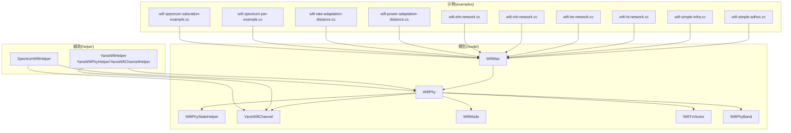
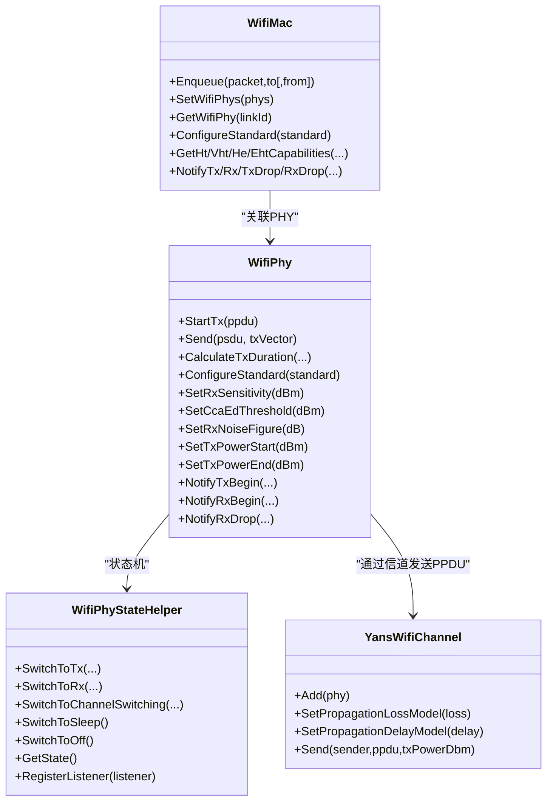
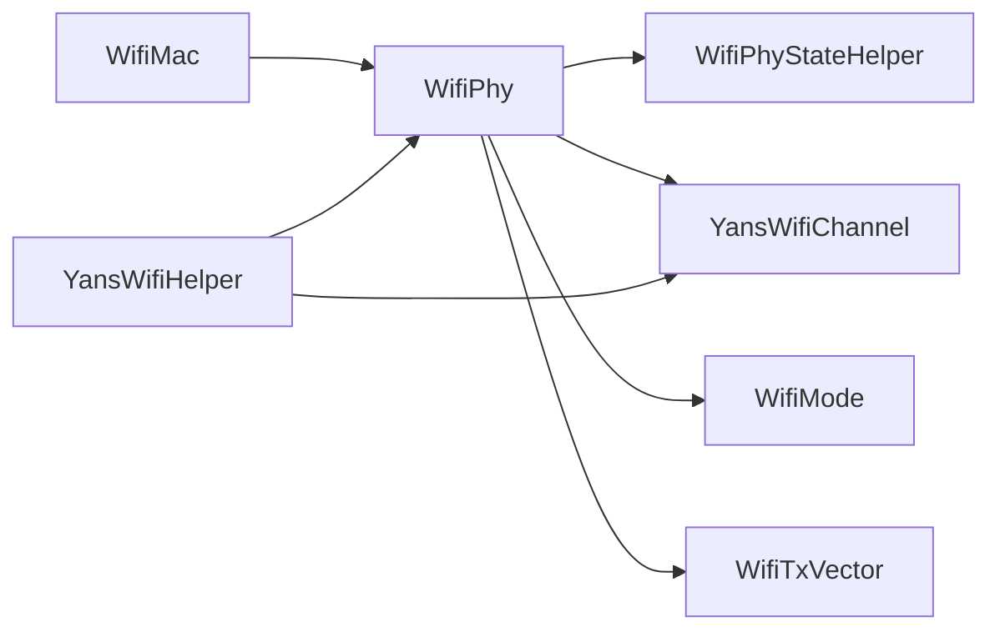
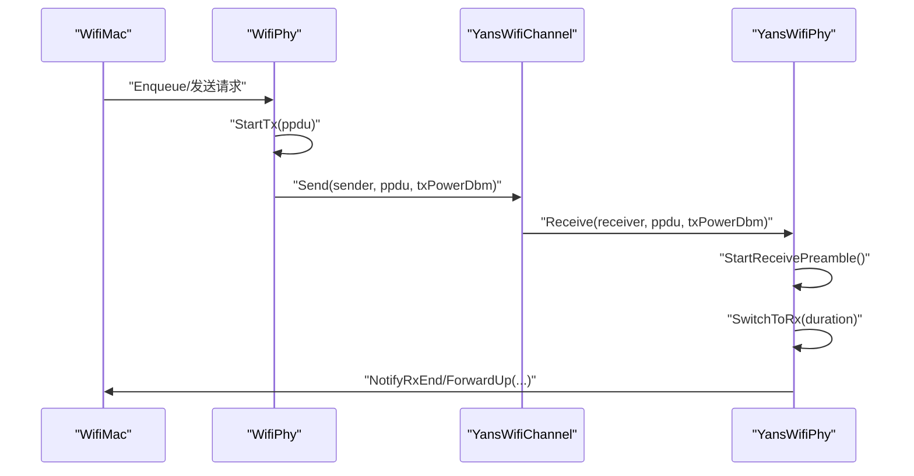
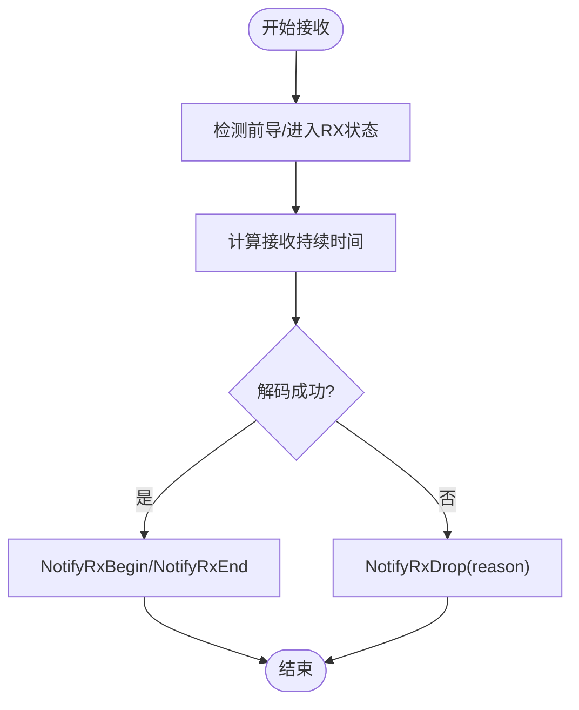

# 无线网络API

<cite>
**本文引用的文件**   
- [wifi-phy.h](file://simulator/ns-3.39/src/wifi/model/wifi-phy.h)
- [wifi-mac.h](file://simulator/ns-3.39/src/wifi/model/wifi-mac.h)
- [yans-wifi-channel.h](file://simulator/ns-3.39/src/wifi/model/yans-wifi-channel.h)
- [wifi-phy-state-helper.h](file://simulator/ns-3.39/src/wifi/model/wifi-phy-state-helper.h)
- [wifi-mode.h](file://simulator/ns-3.39/src/wifi/model/wifi-mode.h)
- [wifi-tx-vector.h](file://simulator/ns-3.39/src/wifi/model/wifi-tx-vector.h)
- [wifi-phy-band.h](file://simulator/ns-3.39/src/wifi/model/wifi-phy-band.h)
- [yans-wifi-helper.h](file://simulator/ns-3.39/src/wifi/helper/yans-wifi-helper.h)
- [wifi-80211e-txop.cc](file://examples/wireless/wifi-80211e-txop.cc)
- [wifi-ht-network.cc](file://examples/wireless/wifi-ht-network.cc)
- [wifi-vht-network.cc](file://examples/wireless/wifi-vht-network.cc)
- [wifi-he-network.cc](file://examples/wireless/wifi-he-network.cc)
- [wifi-eht-network.cc](file://examples/wireless/wifi-eht-network.cc)
- [wifi-power-adaptation-distance.cc](file://examples/wireless/wifi-power-adaptation-distance.cc)
- [wifi-rate-adaptation-distance.cc](file://examples/wireless/wifi-rate-adaptation-distance.cc)
- [wifi-spectrum-per-example.cc](file://examples/wireless/wifi-spectrum-per-example.cc)
- [wifi-spectrum-saturation-example.cc](file://examples/wireless/wifi-spectrum-saturation-example.cc)
- [wifi-simple-adhoc.cc](file://examples/wireless/wifi-simple-adhoc.cc)
- [wifi-simple-infra.cc](file://examples/wireless/wifi-simple-infra.cc)
- [wifi-sleep.cc](file://examples/wireless/wifi-sleep.cc)
- [wifi-timing-attributes.cc](file://examples/wireless/wifi-timing-attributes.cc)
- [wifi-ofdm-validation.cc](file://examples/wireless/wifi-ofdm-validation.cc)
- [wifi-ofdm-ht-validation.cc](file://examples/wireless/wifi-ofdm-ht-validation.cc)
- [wifi-ofdm-vht-validation.cc](file://examples/wireless/wifi-ofdm-vht-validation.cc)
- [wifi-ofdm-eht-validation.cc](file://examples/wireless/wifi-ofdm-eht-validation.cc)
- [wifi-multirate.cc](file://examples/wireless/wifi-multirate.cc)
- [wifi-aggregation.cc](file://examples/wireless/wifi-aggregation.cc)
- [wifi-txop-aggregation.cc](file://examples/wireless/wifi-txop-aggregation.cc)
- [wifi-blockack.cc](file://examples/wireless/wifi-blockack.cc)
- [wifi-spatial-reuse.cc](file://examples/wireless/wifi-spatial-reuse.cc)
- [wifi-hidden-terminal.cc](file://examples/wireless/wifi-hidden-terminal.cc)
- [wifi-simple-interference.cc](file://examples/wireless/wifi-simple-interference.cc)
- [wifi-simple-ht-hidden-stations.cc](file://examples/wireless/wifi-simple-ht-hidden-stations.cc)
- [wifi-spectrum-per-interference.cc](file://examples/wireless/wifi-spectrum-per-interference.cc)
- [wifi-clear-channel-cmu.cc](file://examples/wireless/wifi-clear-channel-cmu.cc)
- [wifi-error-models-comparison.cc](file://examples/wireless/wifi-error-models-comparison.cc)
- [wifi-dsss-validation.cc](file://examples/wireless/wifi-dsss-validation.cc)
- [wifi-ap.cc](file://examples/wireless/wifi-ap.cc)
- [wifi-spectrum-wifi-helper.h](file://simulator/ns-3.39/src/wifi/helper/spectrum-wifi-helper.h)
- [wifi-spectrum-wifi-helper.cc](file://simulator/ns-3.39/src/wifi/helper/spectrum-wifi-helper.cc)
</cite>

## 目录
1. [简介](#简介)
2. [项目结构](#项目结构)
3. [核心组件](#核心组件)
4. [架构总览](#架构总览)
5. [详细组件分析](#详细组件分析)
6. [依赖关系分析](#依赖关系分析)
7. [性能考量](#性能考量)
8. [故障排查指南](#故障排查指南)
9. [结论](#结论)
10. [附录](#附录)

## 简介
本文件面向NS-3无线网络模块（Wi-Fi）的使用者与开发者，系统化梳理并解释以下核心API与概念：
- 物理层：WifiPhy 及其状态机（WifiPhyStateHelper）
- MAC 层：WifiMac 及其队列调度、帧交换管理
- 信道模型：YansWifiChannel 及传播模型
- 频段与调制编码：WifiPhyBand、WifiMode、WifiTxVector
- 网络配置与示例：YansWifiHelper、典型场景脚本
- 无线特性：功率控制、空间复用、多用户（MU）、块确认（BlockAck）、时隙与帧交换

目标是帮助读者快速掌握 Wi-Fi 模型在 NS-3 中的接口、行为与最佳实践，并通过仓库中的示例脚本定位到可直接参考的实现路径。

## 项目结构
NS-3 的 Wi-Fi 模块位于 simulator/ns-3.39/src/wifi 下，按“model”、“helper”、“examples”组织。其中：
- model：核心类定义（WifiPhy、WifiMac、YansWifiChannel、WifiMode、WifiTxVector 等）
- helper：高层封装（YansWifiHelper、SpectrumWifiHelper 等）
- examples：覆盖典型场景（基础 Ad hoc/Infrastructure、MIMO、HE/EHT、干扰、功率/速率自适应、Spectrum 模式等）

图示来源
- [wifi-phy.h:52-157](file://simulator/ns-3.39/src/wifi/model/wifi-phy.h#L52-L157)
- [wifi-mac.h:93-120](file://simulator/ns-3.39/src/wifi/model/wifi-mac.h#L93-L120)
- [yans-wifi-channel.h:45-86](file://simulator/ns-3.39/src/wifi/model/yans-wifi-channel.h#L45-L86)
- [wifi-phy-state-helper.h:68-108](file://simulator/ns-3.39/src/wifi/model/wifi-phy-state-helper.h#L68-L108)
- [wifi-mode.h:50-87](file://simulator/ns-3.39/src/wifi/model/wifi-mode.h#L50-L87)
- [wifi-tx-vector.h:108-148](file://simulator/ns-3.39/src/wifi/model/wifi-tx-vector.h#L108-L148)
- [wifi-phy-band.h:32-44](file://simulator/ns-3.39/src/wifi/model/wifi-phy-band.h#L32-L44)
- [yans-wifi-helper.h:38-101](file://simulator/ns-3.39/src/wifi/helper/yans-wifi-helper.h#L38-L101)

章节来源
- [wifi-phy.h:52-157](file://simulator/ns-3.39/src/wifi/model/wifi-phy.h#L52-L157)
- [wifi-mac.h:93-120](file://simulator/ns-3.39/src/wifi/model/wifi-mac.h#L93-L120)
- [yans-wifi-channel.h:45-86](file://simulator/ns-3.39/src/wifi/model/yans-wifi-channel.h#L45-L86)
- [wifi-phy-state-helper.h:68-108](file://simulator/ns-3.39/src/wifi/model/wifi-phy-state-helper.h#L68-L108)
- [wifi-mode.h:50-87](file://simulator/ns-3.39/src/wifi/model/wifi-mode.h#L50-L87)
- [wifi-tx-vector.h:108-148](file://simulator/ns-3.39/src/wifi/model/wifi-tx-vector.h#L108-L148)
- [wifi-phy-band.h:32-44](file://simulator/ns-3.39/src/wifi/model/wifi-phy-band.h#L32-L44)
- [yans-wifi-helper.h:38-101](file://simulator/ns-3.39/src/wifi/helper/yans-wifi-helper.h#L38-L101)

## 核心组件
- WifiPhy：Wi-Fi 物理层抽象，负责发送/接收 PPDU、状态机切换、时隙计算、回调注册、能量阈值与噪声系数设置、标准与频段配置等。
- WifiPhyStateHelper：物理层状态机（空闲/CCA忙碌/RX/TX/切换/睡眠/关闭），提供状态查询、事件通知与跟踪回调。
- WifiMac：MAC 层基类，管理链路实体、EDCA/QoS、队列调度、帧交换管理器、块确认、能力查询等。
- YansWifiChannel：YANS 信道模型，连接多个 YansWifiPhy，支持传播损耗与延迟模型。
- WifiMode/WifiTxVector/WifiPhyBand：调制编码、传输向量（含MU参数）、频段枚举。

章节来源
- [wifi-phy.h:52-157](file://simulator/ns-3.39/src/wifi/model/wifi-phy.h#L52-L157)
- [wifi-phy-state-helper.h:68-108](file://simulator/ns-3.39/src/wifi/model/wifi-phy-state-helper.h#L68-L108)
- [wifi-mac.h:93-120](file://simulator/ns-3.39/src/wifi/model/wifi-mac.h#L93-L120)
- [yans-wifi-channel.h:45-86](file://simulator/ns-3.39/src/wifi/model/yans-wifi-channel.h#L45-L86)
- [wifi-mode.h:50-87](file://simulator/ns-3.39/src/wifi/model/wifi-mode.h#L50-L87)
- [wifi-tx-vector.h:108-148](file://simulator/ns-3.39/src/wifi/model/wifi-tx-vector.h#L108-L148)
- [wifi-phy-band.h:32-44](file://simulator/ns-3.39/src/wifi/model/wifi-phy-band.h#L32-L44)

## 架构总览
下图展示 WifiPhy、WifiMac、YansWifiChannel 以及状态机之间的交互关系。

图示来源
- [wifi-phy.h:52-157](file://simulator/ns-3.39/src/wifi/model/wifi-phy.h#L52-L157)
- [wifi-phy-state-helper.h:68-108](file://simulator/ns-3.39/src/wifi/model/wifi-phy-state-helper.h#L68-L108)
- [wifi-mac.h:93-120](file://simulator/ns-3.39/src/wifi/model/wifi-mac.h#L93-L120)
- [yans-wifi-channel.h:45-86](file://simulator/ns-3.39/src/wifi/model/yans-wifi-channel.h#L45-L86)

## 详细组件分析

### WifiPhy（物理层）
- 关键职责
  - 发送/接收 PPDU（StartTx、Send）
  - 计算传输时长（CalculateTxDuration、GetPayloadDuration、GetStartOfPacketDuration）
  - 能量阈值与噪声设置（SetRxSensitivity、SetCcaEdThreshold、SetRxNoiseFigure）
  - 功率范围与流分配（SetTxPowerStart、SetTxPowerEnd、AssignStreams）
  - 标准与频段配置（ConfigureStandard、GetStandard、GetPhyBand）
  - 回调与跟踪（SetReceiveOkCallback、SetReceiveErrorCallback、NotifyTx/Rx/RxDrop）
- 常用接口要点
  - 通过 StartTx 触发发送；Send 支持单/多 PSDU 与 TXVECTOR
  - 通过 CalculateTxDuration 估算占用时隙，结合 SIFS/Slot/Pifs 获取介质访问参数
  - 通过 SetCcaEdThreshold/SetRxSensitivity 控制 CCA 与接收灵敏度
  - 通过 ConfigureStandard 选择 Wi-Fi 标准（802.11a/b/g/n/ac/ax/be）

章节来源
- [wifi-phy.h:154-157](file://simulator/ns-3.39/src/wifi/model/wifi-phy.h#L154-L157)
- [wifi-phy.h:234-264](file://simulator/ns-3.39/src/wifi/model/wifi-phy.h#L234-L264)
- [wifi-phy.h:384-397](file://simulator/ns-3.39/src/wifi/model/wifi-phy.h#L384-L397)
- [wifi-phy.h:403-421](file://simulator/ns-3.39/src/wifi/model/wifi-phy.h#L403-L421)
- [wifi-phy.h:509-523](file://simulator/ns-3.39/src/wifi/model/wifi-phy.h#L509-L523)
- [wifi-phy.h:546-583](file://simulator/ns-3.39/src/wifi/model/wifi-phy.h#L546-L583)

### WifiPhyStateHelper（物理层状态机）
- 关键职责
  - 维护状态（空闲/CCA忙碌/RX/TX/切换/睡眠/关闭）
  - 切换与事件通知（SwitchToTx/Rx/SwitchToChannelSwitching/Sleep/Off）
  - 接收成功/失败处理（NotifyRxPsduSucceeded/Failed）
  - 监听器注册与跟踪回调（RegisterListener、StateTracedCallback 等）
- 使用建议
  - 在自定义 PHY 中委托状态机进行状态转换
  - 通过监听器观察状态变化与收发事件

章节来源
- [wifi-phy-state-helper.h:68-108](file://simulator/ns-3.39/src/wifi/model/wifi-phy-state-helper.h#L68-L108)
- [wifi-phy-state-helper.h:178-187](file://simulator/ns-3.39/src/wifi/model/wifi-phy-state-helper.h#L178-L187)
- [wifi-phy-state-helper.h:213-224](file://simulator/ns-3.39/src/wifi/model/wifi-phy-state-helper.h#L213-L224)
- [wifi-phy-state-helper.h:254-266](file://simulator/ns-3.39/src/wifi/model/wifi-phy-state-helper.h#L254-L266)

### WifiMac（MAC 层）
- 关键职责
  - 设备与链路管理（SetDevice、GetNLinks、GetLinkIdByAddress）
  - 队列与调度（SetMacQueueScheduler、GetTxopQueue、GetQosTxop）
  - 帧交换与通道接入（GetFrameExchangeManager、GetChannelAccessManager）
  - 能力查询（GetHt/Vht/He/EhtCapabilities、GetMaxAmpdu/AmsduSize）
  - 块确认（GetBaAgreementEstablishedAsOriginator/Recipient、BA/ BAR 类型）
  - 上报与转发（ForwardUp、NotifyTx/Rx/TxDrop/RxDrop）
- 使用建议
  - 在 ConfigureStandard 后再设置远程站管理器与 PHY
  - 对于 QoS 场景启用相应队列与调度策略

章节来源
- [wifi-mac.h:114-120](file://simulator/ns-3.39/src/wifi/model/wifi-mac.h#L114-L120)
- [wifi-mac.h:128-136](file://simulator/ns-3.39/src/wifi/model/wifi-mac.h#L128-L136)
- [wifi-mac.h:217-223](file://simulator/ns-3.39/src/wifi/model/wifi-mac.h#L217-L223)
- [wifi-mac.h:454-454](file://simulator/ns-3.39/src/wifi/model/wifi-mac.h#L454-L454)
- [wifi-mac.h:485-506](file://simulator/ns-3.39/src/wifi/model/wifi-mac.h#L485-L506)
- [wifi-mac.h:606-618](file://simulator/ns-3.39/src/wifi/model/wifi-mac.h#L606-L618)
- [wifi-mac.h:736-752](file://simulator/ns-3.39/src/wifi/model/wifi-mac.h#L736-L752)

### YansWifiChannel（YANS 信道）
- 关键职责
  - 连接多个 YansWifiPhy 并广播 PPDU
  - 设置传播损耗与延迟模型（SetPropagationLossModel、SetPropagationDelayModel）
  - 通过 Send 将 PPDU 分发给其他接收端
- 使用建议
  - 先设置传播模型，再安装设备
  - 可叠加多个损耗模型以构建复杂环境

章节来源
- [yans-wifi-channel.h:65-86](file://simulator/ns-3.39/src/wifi/model/yans-wifi-channel.h#L65-L86)
- [yans-wifi-channel.h:114-114](file://simulator/ns-3.39/src/wifi/model/yans-wifi-channel.h#L114-L114)

### WifiMode、WifiTxVector、WifiPhyBand（调制编码与频段）
- WifiMode
  - 提供数据/物理速率、调制阶数、编码率、是否允许组合等
  - 支持非HT与HT/MCS 模式
- WifiTxVector
  - 传输参数载体（模式、功率等级、前导、GI、NSS、STBC/LDPC、聚合、BSS Color、TriggerResponding、RU分配等）
  - 支持 SU 与 MU（HE/EHT）参数
- WifiPhyBand
  - 定义 2.4/5/6/60 GHz 与未指定频段

章节来源
- [wifi-mode.h:50-87](file://simulator/ns-3.39/src/wifi/model/wifi-mode.h#L50-L87)
- [wifi-tx-vector.h:108-148](file://simulator/ns-3.39/src/wifi/model/wifi-tx-vector.h#L108-L148)
- [wifi-phy-band.h:32-44](file://simulator/ns-3.39/src/wifi/model/wifi-phy-band.h#L32-L44)

### YansWifiHelper（高层封装）
- YansWifiChannelHelper
  - 默认配置（常数传播延迟、对数距离损耗）
  - 动态添加传播损耗模型与设置传播延迟模型
- YansWifiPhyHelper
  - 与 YansWifiChannel 绑定，创建 PHY 实例

章节来源
- [yans-wifi-helper.h:54-87](file://simulator/ns-3.39/src/wifi/helper/yans-wifi-helper.h#L54-L87)
- [yans-wifi-helper.h:132-148](file://simulator/ns-3.39/src/wifi/helper/yans-wifi-helper.h#L132-L148)

## 依赖关系分析
- WifiMac 依赖 WifiPhy 与 WifiRemoteStationManager；通过 LinkEntity 管理多链路
- WifiPhy 依赖 WifiPhyStateHelper 进行状态机管理，并通过 YansWifiChannel 与其他 PHY 通信
- WifiTxVector 与 WifiMode 协同决定速率与调制参数
- Helper 层为上层用户提供便捷的安装与配置入口

图示来源
- [wifi-mac.h:350-375](file://simulator/ns-3.39/src/wifi/model/wifi-mac.h#L350-L375)
- [wifi-phy.h:52-157](file://simulator/ns-3.39/src/wifi/model/wifi-phy.h#L52-L157)
- [wifi-phy-state-helper.h:68-108](file://simulator/ns-3.39/src/wifi/model/wifi-phy-state-helper.h#L68-L108)
- [yans-wifi-channel.h:45-86](file://simulator/ns-3.39/src/wifi/model/yans-wifi-channel.h#L45-L86)
- [yans-wifi-helper.h:119-148](file://simulator/ns-3.39/src/wifi/helper/yans-wifi-helper.h#L119-L148)

## 性能考量
- 传播模型与随机性
  - 传播损耗与延迟模型会影响吞吐与时延统计；可通过 AssignStreams 固定随机种子以提升可重复性
- 功率与速率自适应
  - 结合 WifiRemoteStationManager 与功率范围设置，可在不同距离/干扰场景下优化链路质量
- 多用户与聚合
  - HE/EHT 的 RU 分配与 A-MPDU/A-MSDU 聚合显著影响容量与公平性，需合理配置 TXVECTOR 与队列调度
- 状态机与竞争窗口
  - CCA 与竞争窗口设置影响空口利用率与冲突概率

[本节为通用指导，不涉及具体文件分析]

## 故障排查指南
- 接收灵敏度与 CCA 阈值
  - 若出现大量误判或无法检测信号，检查 SetRxSensitivity 与 SetCcaEdThreshold 的设置是否合理
- 传播模型配置
  - 未设置传播模型时，YansWifiChannel 不会分发 PPDU；确保先 AddPropagationLoss 与 SetPropagationDelay
- 状态异常
  - 通过 WifiPhyStateHelper 的监听器与跟踪回调观察状态切换是否符合预期
- 速率与调制
  - 若速率异常，检查 WifiMode 是否被标准允许（IsValid），以及 TXVECTOR 参数组合是否合法

章节来源
- [wifi-phy.h:732-750](file://simulator/ns-3.39/src/wifi/model/wifi-phy.h#L732-L750)
- [yans-wifi-channel.h:65-86](file://simulator/ns-3.39/src/wifi/model/yans-wifi-channel.h#L65-L86)
- [wifi-phy-state-helper.h:254-266](file://simulator/ns-3.39/src/wifi/model/wifi-phy-state-helper.h#L254-L266)
- [wifi-tx-vector.h:358-358](file://simulator/ns-3.39/src/wifi/model/wifi-tx-vector.h#L358-L358)

## 结论
NS-3 的 Wi-Fi 模块以 WifiPhy/WifiMac/YansWifiChannel 为核心，辅以 WifiMode/WifiTxVector/WifiPhyBand 等类型，形成完整的物理层、MAC 层与信道模型体系。借助 YansWifiHelper/SpectrumWifiHelper，用户可以快速搭建从基础 Ad hoc/Infrastructure 到 MIMO、HE/EHT、Spectrum 等复杂场景。通过合理的传播模型、功率与速率自适应、多用户与聚合策略，以及对状态机与竞争窗口的精细配置，可以获得贴近真实设备行为且具备高重现性的仿真结果。

[本节为总结性内容，不涉及具体文件分析]

## 附录

### API 使用与场景示例（路径指引）
- 基础 Ad hoc/Infrastructure
  - [wifi-simple-adhoc.cc](file://examples/wireless/wifi-simple-adhoc.cc)
  - [wifi-simple-infra.cc](file://examples/wireless/wifi-simple-infra.cc)
- MIMO 与多链路
  - [wifi-80211e-txop.cc](file://examples/wireless/wifi-80211e-txop.cc)
  - [wifi-ht-network.cc](file://examples/wireless/wifi-ht-network.cc)
  - [wifi-vht-network.cc](file://examples/wireless/wifi-vht-network.cc)
  - [wifi-he-network.cc](file://examples/wireless/wifi-he-network.cc)
  - [wifi-eht-network.cc](file://examples/wireless/wifi-eht-network.cc)
- 功率与速率自适应
  - [wifi-power-adaptation-distance.cc](file://examples/wireless/wifi-power-adaptation-distance.cc)
  - [wifi-rate-adaptation-distance.cc](file://examples/wireless/wifi-rate-adaptation-distance.cc)
- Spectrum 模式
  - [wifi-spectrum-per-example.cc](file://examples/wireless/wifi-spectrum-per-example.cc)
  - [wifi-spectrum-saturation-example.cc](file://examples/wireless/wifi-spectrum-saturation-example.cc)
  - [wifi-spectrum-wifi-helper.h](file://simulator/ns-3.39/src/wifi/helper/spectrum-wifi-helper.h)
  - [wifi-spectrum-wifi-helper.cc](file://simulator/ns-3.39/src/wifi/helper/spectrum-wifi-helper.cc)
- 时隙与帧交换
  - [wifi-timing-attributes.cc](file://examples/wireless/wifi-timing-attributes.cc)
- 调制验证
  - [wifi-ofdm-validation.cc](file://examples/wireless/wifi-ofdm-validation.cc)
  - [wifi-ofdm-ht-validation.cc](file://examples/wireless/wifi-ofdm-ht-validation.cc)
  - [wifi-ofdm-vht-validation.cc](file://examples/wireless/wifi-ofdm-vht-validation.cc)
  - [wifi-ofdm-eht-validation.cc](file://examples/wireless/wifi-ofdm-eht-validation.cc)
  - [wifi-dsss-validation.cc](file://examples/wireless/wifi-dsss-validation.cc)
- 多速率与聚合
  - [wifi-multirate.cc](file://examples/wireless/wifi-multirate.cc)
  - [wifi-aggregation.cc](file://examples/wireless/wifi-aggregation.cc)
  - [wifi-txop-aggregation.cc](file://examples/wireless/wifi-txop-aggregation.cc)
- 块确认与空间复用
  - [wifi-blockack.cc](file://examples/wireless/wifi-blockack.cc)
  - [wifi-spatial-reuse.cc](file://examples/wireless/wifi-spatial-reuse.cc)
- 干扰与隐藏终端
  - [wifi-hidden-terminal.cc](file://examples/wireless/wifi-hidden-terminal.cc)
  - [wifi-simple-interference.cc](file://examples/wireless/wifi-simple-interference.cc)
  - [wifi-simple-ht-hidden-stations.cc](file://examples/wireless/wifi-simple-ht-hidden-stations.cc)
  - [wifi-spectrum-per-interference.cc](file://examples/wireless/wifi-spectrum-per-interference.cc)
  - [wifi-clear-channel-cmu.cc](file://examples/wireless/wifi-clear-channel-cmu.cc)
  - [wifi-error-models-comparison.cc](file://examples/wireless/wifi-error-models-comparison.cc)
- AP 场景
  - [wifi-ap.cc](file://examples/wireless/wifi-ap.cc)

### 关键流程示意

#### 发送流程（WifiPhy → YansWifiChannel → 接收端）

图示来源
- [wifi-mac.h:328-337](file://simulator/ns-3.39/src/wifi/model/wifi-mac.h#L328-L337)
- [wifi-phy.h:154-157](file://simulator/ns-3.39/src/wifi/model/wifi-phy.h#L154-L157)
- [yans-wifi-channel.h:86-86](file://simulator/ns-3.39/src/wifi/model/yans-wifi-channel.h#L86-L86)
- [wifi-phy-state-helper.h:187-187](file://simulator/ns-3.39/src/wifi/model/wifi-phy-state-helper.h#L187-L187)

#### 接收流程（状态机与回调）

图示来源
- [wifi-phy.h:110-112](file://simulator/ns-3.39/src/wifi/model/wifi-phy.h#L110-L112)
- [wifi-phy-state-helper.h:213-224](file://simulator/ns-3.39/src/wifi/model/wifi-phy-state-helper.h#L213-L224)
- [wifi-phy.h:568-583](file://simulator/ns-3.39/src/wifi/model/wifi-phy.h#L568-L583)