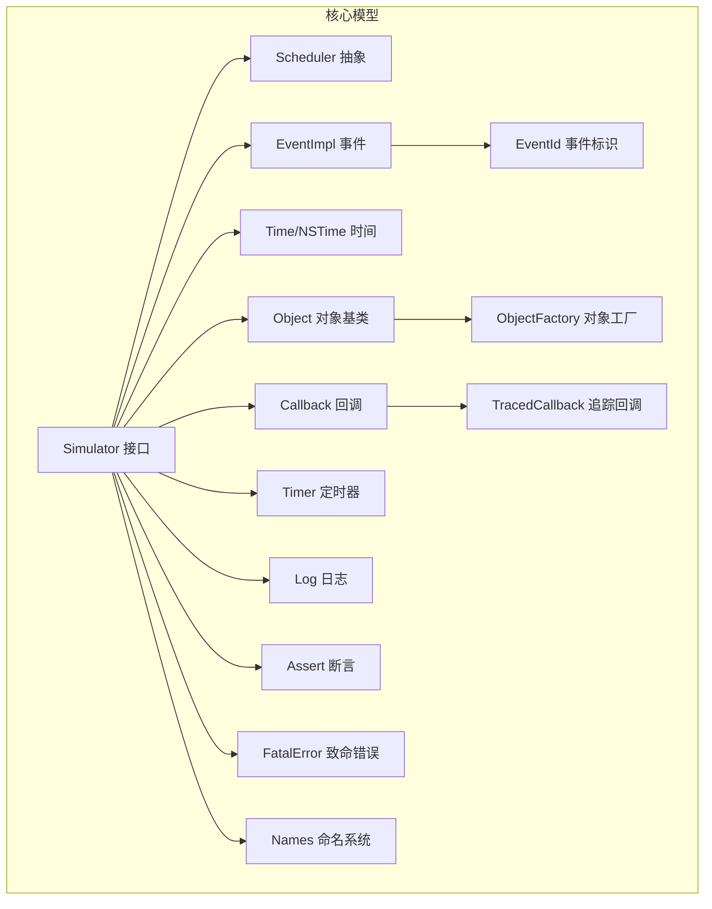
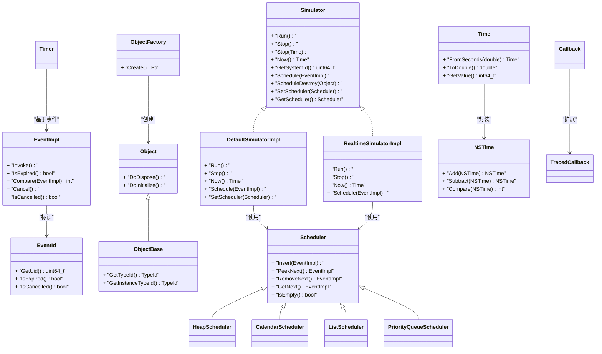
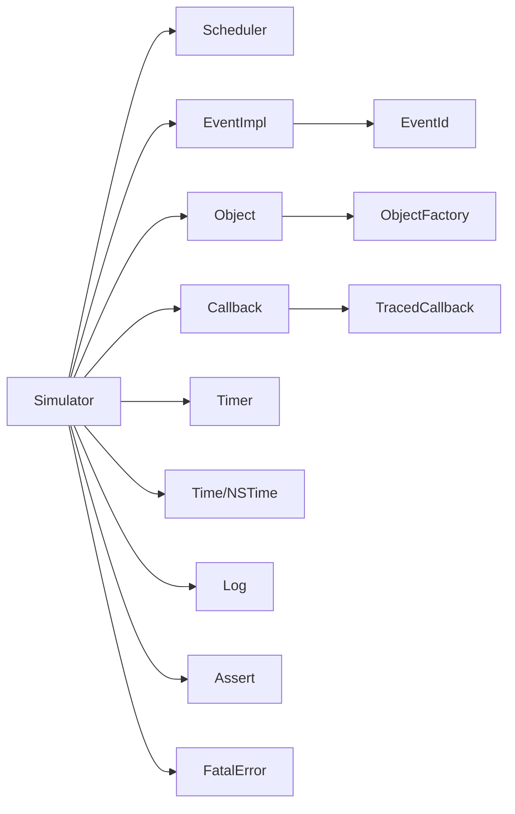

# 核心API

<cite>
**本文引用的文件**
- [simulator.h](file://simulator/ns-3.39/src/core/model/simulator.h)
- [simulator-impl.h](file://simulator/ns-3.39/src/core/model/simulator-impl.h)
- [default-simulator-impl.h](file://simulator/ns-3.39/src/core/model/default-simulator-impl.h)
- [realtime-simulator-impl.h](file://simulator/ns-3.39/src/core/model/realtime-simulator-impl.h)
- [event-impl.h](file://simulator/ns-3.39/src/core/model/event-impl.h)
- [event-id.h](file://simulator/ns-3.39/src/core/model/event-id.h)
- [make-event.h](file://simulator/ns-3.39/src/core/model/make-event.h)
- [object.h](file://simulator/ns-3.39/src/core/model/object.h)
- [object-base.h](file://simulator/ns-3.39/src/core/model/object-base.h)
- [object-factory.h](file://simulator/ns-3.39/src/core/model/object-factory.h)
- [nstime.h](file://simulator/ns-3.39/src/core/model/nstime.h)
- [time.h](file://simulator/ns-3.39/src/core/model/time.h)
- [callback.h](file://simulator/ns-3.39/src/core/model/callback.h)
- [scheduler.h](file://simulator/ns-3.39/src/core/model/scheduler.h)
- [heap-scheduler.h](file://simulator/ns-3.39/src/core/model/heap-scheduler.h)
- [calendar-scheduler.h](file://simulator/ns-3.39/src/core/model/calendar-scheduler.h)
- [list-scheduler.h](file://simulator/ns-3.39/src/core/model/list-scheduler.h)
- [priority-queue-scheduler.h](file://simulator/ns-3.39/src/core/model/priority-queue-scheduler.h)
- [timer.h](file://simulator/ns-3.39/src/core/model/timer.h)
- [traced-callback.h](file://simulator/ns-3.39/src/core/model/traced-callback.h)
- [names.h](file://simulator/ns-3.39/src/core/model/names.h)
- [log.h](file://simulator/ns-3.39/src/core/model/log.h)
- [fatal-error.h](file://simulator/ns-3.39/src/core/model/fatal-error.h)
- [assert.h](file://simulator/ns-3.39/src/core/model/assert.h)
</cite>

## 目录
1. [引言](#引言)
2. [项目结构](#项目结构)
3. [核心组件](#核心组件)
4. [架构总览](#架构总览)
5. [详细组件分析](#详细组件分析)
6. [依赖分析](#依赖分析)
7. [性能考虑](#性能考虑)
8. [故障排查指南](#故障排查指南)
9. [结论](#结论)
10. [附录](#附录)

## 引言
本文件为NS-3核心模块的完整API文档，聚焦于Simulator类、EventImpl类、Object类、Time类等关键类的公共接口与使用方式，涵盖事件调度、时间管理、对象系统、回调机制等主题。文档以“自底向上”的方式组织：先给出高层架构，再逐层深入到具体类与API，辅以图示帮助理解。目标读者为需要深入理解NS-3底层机制的开发者。

## 项目结构
NS-3核心模块位于simulator/ns-3.39/src/core/model目录，围绕以下核心子系统组织：
- 时间与时钟：NSTime、Time及其打印器
- 调度器：Scheduler及多种实现（堆、日历、列表、优先队列）
- 模拟器：Simulator接口与默认/实时实现
- 事件系统：EventImpl、EventId、make_event工具
- 对象系统：Object、ObjectBase、ObjectFactory、Names
- 回调与定时器：Callback、TracedCallback、Timer
- 日志与断言：Log、Assert、FatalError

图表来源
- [simulator.h](file://simulator/ns-3.39/src/core/model/simulator.h)
- [scheduler.h](file://simulator/ns-3.39/src/core/model/scheduler.h)
- [event-impl.h](file://simulator/ns-3.39/src/core/model/event-impl.h)
- [event-id.h](file://simulator/ns-3.39/src/core/model/event-id.h)
- [nstime.h](file://simulator/ns-3.39/src/core/model/nstime.h)
- [object.h](file://simulator/ns-3.39/src/core/model/object.h)
- [object-factory.h](file://simulator/ns-3.39/src/core/model/object-factory.h)
- [names.h](file://simulator/ns-3.39/src/core/model/names.h)
- [callback.h](file://simulator/ns-3.39/src/core/model/callback.h)
- [traced-callback.h](file://simulator/ns-3.39/src/core/model/traced-callback.h)
- [timer.h](file://simulator/ns-3.39/src/core/model/timer.h)
- [log.h](file://simulator/ns-3.39/src/core/model/log.h)
- [assert.h](file://simulator/ns-3.39/src/core/model/assert.h)
- [fatal-error.h](file://simulator/ns-3.39/src/core/model/fatal-error.h)

章节来源
- [simulator.h](file://simulator/ns-3.39/src/core/model/simulator.h)
- [scheduler.h](file://simulator/ns-3.39/src/core/model/scheduler.h)
- [event-impl.h](file://simulator/ns-3.39/src/core/model/event-impl.h)
- [event-id.h](file://simulator/ns-3.39/src/core/model/event-id.h)
- [nstime.h](file://simulator/ns-3.39/src/core/model/nstime.h)
- [object.h](file://simulator/ns-3.39/src/core/model/object.h)
- [object-factory.h](file://simulator/ns-3.39/src/core/model/object-factory.h)
- [names.h](file://simulator/ns-3.39/src/core/model/names.h)
- [callback.h](file://simulator/ns-3.39/src/core/model/callback.h)
- [traced-callback.h](file://simulator/ns-3.39/src/core/model/traced-callback.h)
- [timer.h](file://simulator/ns-3.39/src/core/model/timer.h)
- [log.h](file://simulator/ns-3.39/src/core/model/log.h)
- [assert.h](file://simulator/ns-3.39/src/core/model/assert.h)
- [fatal-error.h](file://simulator/ns-3.39/src/core/model/fatal-error.h)

## 核心组件
本节概述核心API的关键职责与交互关系：
- Simulator：模拟器入口，负责启动、停止、推进仿真时间、调度事件、注册全局回调与日志。
- EventImpl/EventId：事件抽象与标识，支持延迟执行、取消、比较与序列化。
- Object/ObjectBase/ObjectFactory：对象系统基础，提供类型识别、属性访问、对象创建与生命周期管理。
- Time/NSTime：高精度时间表示与运算，支持纳秒级分辨率与单位转换。
- Scheduler：事件调度策略抽象，提供多种实现以平衡性能与特性。
- Callback/TracedCallback/Timer：回调机制与定时器封装，支持事件驱动与周期性任务。
- Names/Log/Assert/FatalError：命名、日志、断言与致命错误处理，支撑调试与运行期诊断。

章节来源
- [simulator.h](file://simulator/ns-3.39/src/core/model/simulator.h)
- [event-impl.h](file://simulator/ns-3.39/src/core/model/event-impl.h)
- [event-id.h](file://simulator/ns-3.39/src/core/model/event-id.h)
- [object.h](file://simulator/ns-3.39/src/core/model/object.h)
- [object-base.h](file://simulator/ns-3.39/src/core/model/object-base.h)
- [object-factory.h](file://simulator/ns-3.39/src/core/model/object-factory.h)
- [nstime.h](file://simulator/ns-3.39/src/core/model/nstime.h)
- [time.h](file://simulator/ns-3.39/src/core/model/time.h)
- [callback.h](file://simulator/ns-3.39/src/core/model/callback.h)
- [traced-callback.h](file://simulator/ns-3.39/src/core/model/traced-callback.h)
- [timer.h](file://simulator/ns-3.39/src/core/model/timer.h)
- [names.h](file://simulator/ns-3.39/src/core/model/names.h)
- [log.h](file://simulator/ns-3.39/src/core/model/log.h)
- [assert.h](file://simulator/ns-3.39/src/core/model/assert.h)
- [fatal-error.h](file://simulator/ns-3.39/src/core/model/fatal-error.h)

## 架构总览
NS-3采用“接口+实现分离”的设计：上层通过Simulator接口统一调度，内部可切换默认或实时实现；事件由EventImpl承载，通过EventId进行唯一标识；对象系统通过ObjectBase与ObjectFactory构建；调度器抽象屏蔽不同实现细节；回调与定时器提供灵活的异步机制；日志与断言贯穿全系统。

图表来源
- [simulator.h](file://simulator/ns-3.39/src/core/model/simulator.h)
- [default-simulator-impl.h](file://simulator/ns-3.39/src/core/model/default-simulator-impl.h)
- [realtime-simulator-impl.h](file://simulator/ns-3.39/src/core/model/realtime-simulator-impl.h)
- [event-impl.h](file://simulator/ns-3.39/src/core/model/event-impl.h)
- [event-id.h](file://simulator/ns-3.39/src/core/model/event-id.h)
- [object.h](file://simulator/ns-3.39/src/core/model/object.h)
- [object-base.h](file://simulator/ns-3.39/src/core/model/object-base.h)
- [object-factory.h](file://simulator/ns-3.39/src/core/model/object-factory.h)
- [scheduler.h](file://simulator/ns-3.39/src/core/model/scheduler.h)
- [heap-scheduler.h](file://simulator/ns-3.39/src/core/model/heap-scheduler.h)
- [calendar-scheduler.h](file://simulator/ns-3.39/src/core/model/calendar-scheduler.h)
- [list-scheduler.h](file://simulator/ns-3.39/src/core/model/list-scheduler.h)
- [priority-queue-scheduler.h](file://simulator/ns-3.39/src/core/model/priority-queue-scheduler.h)
- [time.h](file://simulator/ns-3.39/src/core/model/time.h)
- [nstime.h](file://simulator/ns-3.39/src/core/model/nstime.h)
- [callback.h](file://simulator/ns-3.39/src/core/model/callback.h)
- [traced-callback.h](file://simulator/ns-3.39/src/core/model/traced-callback.h)
- [timer.h](file://simulator/ns-3.39/src/core/model/timer.h)

## 详细组件分析

### Simulator类与实现
- 公共接口要点
  - 启动/停止：Run()、Stop()、Stop(Time)
  - 时间查询：Now()返回当前仿真时间
  - 系统标识：GetSystemId()返回系统唯一ID
  - 事件调度：Schedule(EventImpl)、ScheduleDestroy(Object)
  - 调度器管理：SetScheduler(Scheduler)、GetScheduler()
  - 全局回调与日志：注册/触发全局回调，配置日志级别与输出
- 实现形态
  - 默认实现DefaultSimulatorImpl：常规离线仿真，支持堆/日历/列表/优先队列调度器
  - 实时实现RealtimeSimulatorImpl：按真实时间推进，适合硬件在环或实时观测
- 使用建议
  - 在复杂场景中优先选择合适的调度器实现
  - 使用ScheduleDestroy确保对象销毁时机可控
  - Run前完成所有事件与对象初始化

章节来源
- [simulator.h](file://simulator/ns-3.39/src/core/model/simulator.h)
- [default-simulator-impl.h](file://simulator/ns-3.39/src/core/model/default-simulator-impl.h)
- [realtime-simulator-impl.h](file://simulator/ns-3.39/src/core/model/realtime-simulator-impl.h)

### EventImpl与EventId
- EventImpl
  - Invoke()执行事件逻辑
  - IsExpired()/IsCancelled()状态查询
  - Compare(EventImpl)用于排序与优先队列
  - Cancel()取消事件
- EventId
  - GetUid()获取事件唯一ID
  - IsExpired()/IsCancelled()查询事件状态
- 事件生命周期
  - 创建：通过make_event工具生成EventImpl
  - 调度：Simulator.Schedule(EventImpl)
  - 执行：调度器取出并调用EventImpl.Invoke()
  - 取消/过期：可被取消或因时间条件过期
- 参数与返回
  - Compare返回整数用于排序
  - Cancel返回布尔值指示是否成功取消未执行事件
- 错误处理
  - 重复取消或对已过期事件取消的行为需由调用方避免
  - 事件回调异常应被捕获并记录，避免中断仿真

章节来源
- [event-impl.h](file://simulator/ns-3.39/src/core/model/event-impl.h)
- [event-id.h](file://simulator/ns-3.39/src/core/model/event-id.h)
- [make-event.h](file://simulator/ns-3.39/src/core/model/make-event.h)

### Object、ObjectBase与ObjectFactory
- ObjectBase
  - 提供类型系统基础：GetTypeId()/GetInstanceTypeId()
- Object
  - 生命周期钩子：DoInitialize()/DoDispose()
  - 继承后可重写上述方法以实现初始化与清理
- ObjectFactory
  - Create()创建派生类型的对象实例
  - 与TypeId配合实现反射式对象构造
- 使用模式
  - 通过ObjectFactory按类型创建对象
  - 在对象构造后调用Initialize，销毁前调用Dispose
- 注意事项
  - 避免在析构中直接访问尚未Dispose的对象成员
  - 属性访问与追踪需在对象初始化后进行

章节来源
- [object-base.h](file://simulator/ns-3.39/src/core/model/object-base.h)
- [object.h](file://simulator/ns-3.39/src/core/model/object.h)
- [object-factory.h](file://simulator/ns-3.39/src/core/model/object-factory.h)

### Time与NSTime
- Time
  - 提供从秒等单位构造Time的能力
  - ToDouble()与GetValue()用于数值化表示
  - 支持与Time/NSTime的加减与比较
- NSTime
  - 高精度时间表示，支持加减与比较
  - 作为内部计时核心，保证纳秒级分辨率
- 单位与精度
  - Time常用于应用层接口，NSTime用于内核计时
  - 跨模块传递时注意单位一致性
- 实践建议
  - 事件调度与时间比较统一使用Time/NSTime的对应方法
  - 避免频繁进行单位转换以减少误差累积

章节来源
- [time.h](file://simulator/ns-3.39/src/core/model/time.h)
- [nstime.h](file://simulator/ns-3.39/src/core/model/nstime.h)

### 回调机制与定时器
- Callback
  - 封装函数指针/成员函数/lambda等可调用对象
  - 支持绑定参数与上下文
- TracedCallback
  - 在回调触发时自动记录与传播
  - 适用于事件追踪与可观测性
- Timer
  - 基于事件的定时器封装
  - 支持单次/周期性触发，与EventImpl协同工作
- 使用建议
  - 优先使用TracedCallback进行关键路径观测
  - 定时器到期回调中避免长时间阻塞操作

章节来源
- [callback.h](file://simulator/ns-3.39/src/core/model/callback.h)
- [traced-callback.h](file://simulator/ns-3.39/src/core/model/traced-callback.h)
- [timer.h](file://simulator/ns-3.39/src/core/model/timer.h)

### 调度器体系
- 抽象接口Scheduler
  - Insert/PeekNext/RemoveNext/GetNext/IsEmpty
- 具体实现
  - HeapScheduler：基于堆的O(log n)插入与O(1)取最小
  - CalendarScheduler：分桶日历，适合稀疏事件
  - ListScheduler：有序链表，简单稳定
  - PriorityQueueScheduler：优先队列实现，兼顾灵活性
- 选型建议
  - 高频短间隔事件：优先HeapScheduler
  - 事件分布稀疏且时间跨度大：CalendarScheduler
  - 对实现复杂度敏感：ListScheduler
  - 需要灵活优先级控制：PriorityQueueScheduler

章节来源
- [scheduler.h](file://simulator/ns-3.39/src/core/model/scheduler.h)
- [heap-scheduler.h](file://simulator/ns-3.39/src/core/model/heap-scheduler.h)
- [calendar-scheduler.h](file://simulator/ns-3.39/src/core/model/calendar-scheduler.h)
- [list-scheduler.h](file://simulator/ns-3.39/src/core/model/list-scheduler.h)
- [priority-queue-scheduler.h](file://simulator/ns-3.39/src/core/model/priority-queue-scheduler.h)

### 名称系统与日志
- Names
  - 为对象与事件分配人类可读名称，便于调试与可视化
- Log
  - 提供多级别日志输出，支持格式化与过滤
- Assert
  - 条件断言，失败时触发致命错误流程
- FatalError
  - 致命错误处理，确保异常情况下安全退出

章节来源
- [names.h](file://simulator/ns-3.39/src/core/model/names.h)
- [log.h](file://simulator/ns-3.39/src/core/model/log.h)
- [assert.h](file://simulator/ns-3.39/src/core/model/assert.h)
- [fatal-error.h](file://simulator/ns-3.39/src/core/model/fatal-error.h)

## 依赖分析
- 组件耦合
  - Simulator依赖Scheduler与EventImpl；默认与实时实现共享接口
  - EventImpl依赖EventId；调度器依赖EventImpl排序与取出
  - Object与ObjectFactory解耦对象创建与使用
  - Callback/TracedCallback与Timer依赖EventImpl
  - Time/NSTime为跨模块通用数据类型
- 外部依赖
  - 日志与断言依赖平台标准库与运行时环境
  - 实时实现依赖系统时钟与线程同步原语

图表来源
- [simulator.h](file://simulator/ns-3.39/src/core/model/simulator.h)
- [scheduler.h](file://simulator/ns-3.39/src/core/model/scheduler.h)
- [event-impl.h](file://simulator/ns-3.39/src/core/model/event-impl.h)
- [event-id.h](file://simulator/ns-3.39/src/core/model/event-id.h)
- [object.h](file://simulator/ns-3.39/src/core/model/object.h)
- [object-factory.h](file://simulator/ns-3.39/src/core/model/object-factory.h)
- [callback.h](file://simulator/ns-3.39/src/core/model/callback.h)
- [traced-callback.h](file://simulator/ns-3.39/src/core/model/traced-callback.h)
- [timer.h](file://simulator/ns-3.39/src/core/model/timer.h)
- [time.h](file://simulator/ns-3.39/src/core/model/time.h)
- [nstime.h](file://simulator/ns-3.39/src/core/model/nstime.h)
- [log.h](file://simulator/ns-3.39/src/core/model/log.h)
- [assert.h](file://simulator/ns-3.39/src/core/model/assert.h)
- [fatal-error.h](file://simulator/ns-3.39/src/core/model/fatal-error.h)

## 性能考虑
- 事件调度
  - 选择合适调度器：高频短间隔事件优先堆调度；稀疏事件可用日历调度
  - 减少事件数量：合并相似事件，避免微小时间片的密集调度
- 时间计算
  - 统一使用Time/NSTime接口，避免重复单位换算
  - 避免在热路径中进行字符串格式化
- 对象生命周期
  - 使用ScheduleDestroy确保对象在正确时机释放
  - 避免在回调中创建大量临时对象
- 回调与追踪
  - 仅在必要时启用TracedCallback，降低开销
  - 合理设置日志级别，避免过多磁盘IO

## 故障排查指南
- 事件未执行
  - 检查EventId状态（是否已取消/过期）
  - 确认Simulator.Run()已调用且未提前Stop
  - 核对调度器实现与事件时间戳
- 对象未释放
  - 确认已调用ScheduleDestroy
  - 检查对象Dispose流程是否抛出异常
- 时间不一致
  - 统一使用Simulator.Now()获取当前时间
  - 避免混用不同时间源
- 日志与断言
  - 使用Names为关键对象命名，便于定位
  - 在Assert失败时检查前置条件与边界情况
  - 致命错误发生时保存现场日志并复盘

章节来源
- [event-id.h](file://simulator/ns-3.39/src/core/model/event-id.h)
- [simulator.h](file://simulator/ns-3.39/src/core/model/simulator.h)
- [object.h](file://simulator/ns-3.39/src/core/model/object.h)
- [names.h](file://simulator/ns-3.39/src/core/model/names.h)
- [log.h](file://simulator/ns-3.39/src/core/model/log.h)
- [assert.h](file://simulator/ns-3.39/src/core/model/assert.h)
- [fatal-error.h](file://simulator/ns-3.39/src/core/model/fatal-error.h)

## 结论
NS-3核心模块通过清晰的接口与可插拔实现，提供了高性能、可扩展的离线与实时仿真能力。掌握Simulator、EventImpl、Object、Time等核心类的API与协作关系，是高效开发与优化NS-3仿真的关键。建议在项目初期明确调度器与对象生命周期策略，并结合日志与断言体系建立完善的调试与监控机制。

## 附录
- 快速参考
  - 启动仿真：Simulator.Run()
  - 停止仿真：Simulator.Stop() 或 Stop(时间点)
  - 当前时间：Simulator.Now()
  - 调度事件：Simulator.Schedule(EventImpl)
  - 创建对象：ObjectFactory.Create()
  - 注册回调：Callback/TracedCallback
  - 设置定时器：Timer
  - 命名与日志：Names、Log
  - 断言与致命错误：Assert、FatalError