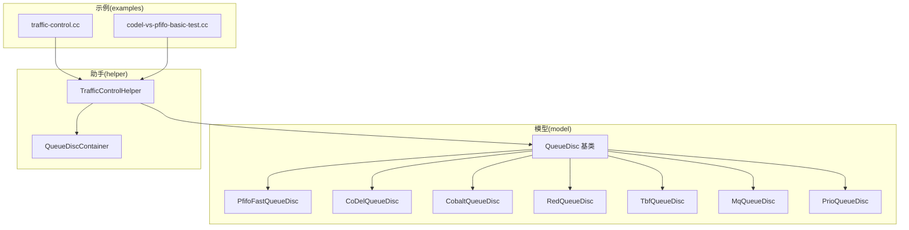
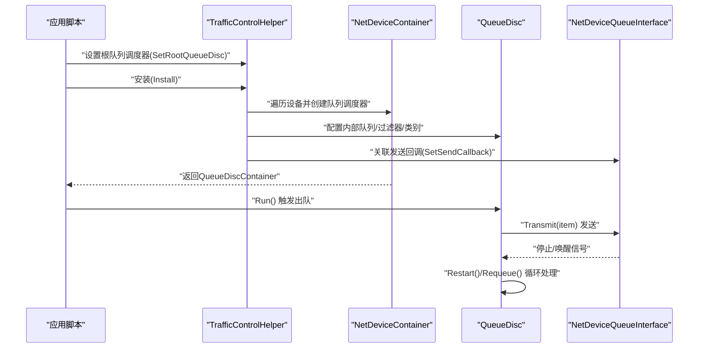
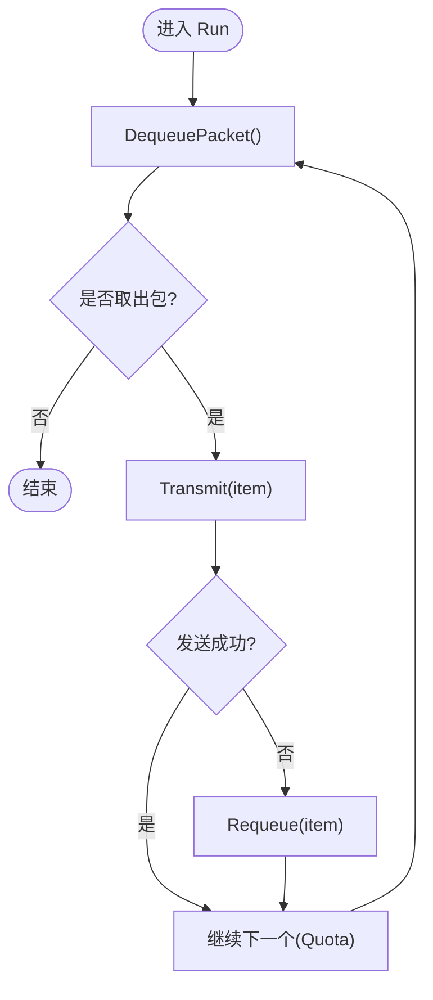
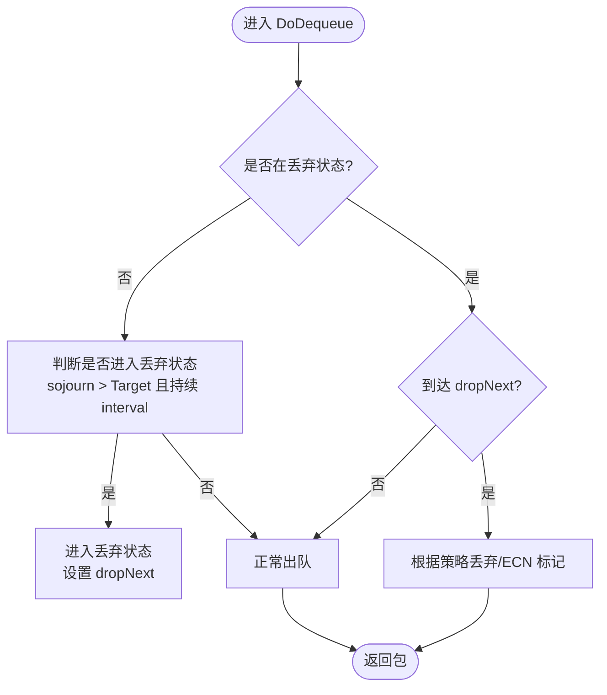
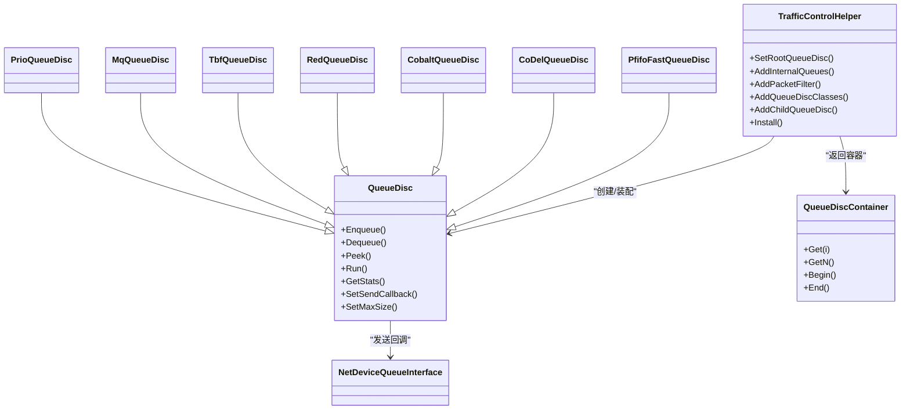

# 流量控制API

<cite>
**本文引用的文件**   
- [queue-disc.h](file://simulator/ns-3.39/src/traffic-control/model/queue-disc.h)
- [pfifo-fast-queue-disc.h](file://simulator/ns-3.39/src/traffic-control/model/pfifo-fast-queue-disc.h)
- [codel-queue-disc.h](file://simulator/ns-3.39/src/traffic-control/model/codel-queue-disc.h)
- [cobalt-queue-disc.h](file://simulator/ns-3.39/src/traffic-control/model/cobalt-queue-disc.h)
- [red-queue-disc.h](file://simulator/ns-3.39/src/traffic-control/model/red-queue-disc.h)
- [tbf-queue-disc.h](file://simulator/ns-3.39/src/traffic-control/model/tbf-queue-disc.h)
- [mq-queue-disc.h](file://simulator/ns-3.39/src/traffic-control/model/mq-queue-disc.h)
- [prio-queue-disc.h](file://simulator/ns-3.39/src/traffic-control/model/prio-queue-disc.h)
- [traffic-control-helper.h](file://simulator/ns-3.39/src/traffic-control/helper/traffic-control-helper.h)
- [queue-disc-container.h](file://simulator/ns-3.39/src/traffic-control/helper/queue-disc-container.h)
- [traffic-control.cc](file://simulator/ns-3.39/examples/traffic-control/traffic-control.cc)
- [codel-vs-pfifo-basic-test.cc](file://simulator/ns-3.39/src/traffic-control/examples/codel-vs-pfifo-basic-test.cc)
</cite>

## 目录
1. [简介](#简介)
2. [项目结构](#项目结构)
3. [核心组件](#核心组件)
4. [架构总览](#架构总览)
5. [详细组件分析](#详细组件分析)
6. [依赖关系分析](#依赖关系分析)
7. [性能考量](#性能考量)
8. [故障排查指南](#故障排查指南)
9. [结论](#结论)
10. [附录](#附录)

## 简介
本文件为 NS-3 流量控制模块的完整 API 文档，聚焦于队列调度（QueueDisc）体系及其典型实现（如 PfifoFast、CoDel、Cobalt、RED、TBF、MQ、Prio 等），系统阐述以下内容：
- QueueDisc 抽象类的接口规范与生命周期
- 典型队列算法的配置参数、行为特征与适用场景
- 队列管理、拥塞控制、流量整形等 API 的使用方法
- 与网络设备的集成方式（通过 TrafficControlHelper 安装）
- 性能调优建议与监控统计实践

## 项目结构
NS-3 流量控制模块位于 traffic-control 子目录，按“模型（model）+ 助手（helper）+ 示例（examples）”组织：
- model：队列调度器实现与基础抽象（QueueDisc 及其派生类）
- helper：安装与配置工具（TrafficControlHelper、QueueDiscContainer）
- examples：使用示例与对比测试脚本

图示来源
- [queue-disc.h:183-748](file://simulator/ns-3.39/src/traffic-control/model/queue-disc.h#L183-L748)
- [pfifo-fast-queue-disc.h:49-82](file://simulator/ns-3.39/src/traffic-control/model/pfifo-fast-queue-disc.h#L49-L82)
- [codel-queue-disc.h:61-220](file://simulator/ns-3.39/src/traffic-control/model/codel-queue-disc.h#L61-L220)
- [cobalt-queue-disc.h:59-257](file://simulator/ns-3.39/src/traffic-control/model/cobalt-queue-disc.h#L59-L257)
- [red-queue-disc.h:79-315](file://simulator/ns-3.39/src/traffic-control/model/red-queue-disc.h#L79-L315)
- [tbf-queue-disc.h:48-164](file://simulator/ns-3.39/src/traffic-control/model/tbf-queue-disc.h#L48-L164)
- [mq-queue-disc.h:36-63](file://simulator/ns-3.39/src/traffic-control/model/mq-queue-disc.h#L36-L63)
- [prio-queue-disc.h:51-90](file://simulator/ns-3.39/src/traffic-control/model/prio-queue-disc.h#L51-L90)
- [traffic-control-helper.h:117-372](file://simulator/ns-3.39/src/traffic-control/helper/traffic-control-helper.h#L117-L372)
- [queue-disc-container.h:45-168](file://simulator/ns-3.39/src/traffic-control/helper/queue-disc-container.h#L45-L168)
- [traffic-control.cc:137-145](file://simulator/ns-3.39/examples/traffic-control/traffic-control.cc#L137-L145)
- [codel-vs-pfifo-basic-test.cc:172-212](file://simulator/ns-3.39/src/traffic-control/examples/codel-vs-pfifo-basic-test.cc#L172-L212)

章节来源
- [queue-disc.h:114-182](file://simulator/ns-3.39/src/traffic-control/model/queue-disc.h#L114-L182)
- [traffic-control-helper.h:117-138](file://simulator/ns-3.39/src/traffic-control/helper/traffic-control-helper.h#L117-L138)

## 核心组件
本节聚焦 QueueDisc 抽象类及其关键接口，涵盖队列容量、统计、回调、运行机制与事件追踪。

- 接口概览
  - 队列容量与尺寸
    - 设置/获取最大容量：SetMaxSize、GetMaxSize、GetCurrentSize
    - 尺寸策略：QueueDiscSizePolicy（单内部队列、单子队列调度器、多队列、无限制）
  - 统计与追踪
    - 获取统计：GetStats（包含入队/出队/丢弃/重入队/标记等）
    - 追踪源：Enqueue/Dequeue/Requeue/Drop/DropBeforeEnqueue/DropAfterDequeue/Mark；以及 SojournTime
  - 运行与调度
    - Enqueue/Dequeue/Peek/Run
    - Quota 控制（默认配额常量）
    - 发送回调 SendCallback 与 SetSendCallback
  - 内部结构
    - 内部队列：AddInternalQueue、GetInternalQueue、GetNInternalQueues
    - 分类器：AddPacketFilter、GetPacketFilter、GetNPacketFilters、Classify
    - 类别：AddQueueDiscClass、GetQueueDiscClass、GetNQueueDiscClasses
  - 生命周期与状态
    - 初始化：DoInitialize 调用 CheckConfig 与 InitializeParams
    - 丢包/标记通知：DropBeforeEnqueue、DropAfterDequeue、Mark
    - 唤醒模式：GetWakeMode（根或子队列激活）

- 关键数据结构
  - Stats：累计计数与字节数、按原因分类的丢弃/标记统计
  - 内部队列类型：QueueDisc::InternalQueue（Queue<QueueDiscItem>）
  - WakeMode：WAKE_ROOT/WAKE_CHILD

章节来源
- [queue-disc.h:183-748](file://simulator/ns-3.39/src/traffic-control/model/queue-disc.h#L183-L748)

## 架构总览
下图展示 TrafficControlHelper 如何将队列调度器安装到网络设备，并与设备传输队列交互：

图示来源
- [traffic-control-helper.h:267-278](file://simulator/ns-3.39/src/traffic-control/helper/traffic-control-helper.h#L267-L278)
- [queue-disc.h:421-425](file://simulator/ns-3.39/src/traffic-control/model/queue-disc.h#L421-L425)
- [queue-disc.h:650-676](file://simulator/ns-3.39/src/traffic-control/model/queue-disc.h#L650-L676)

章节来源
- [traffic-control-helper.h:267-306](file://simulator/ns-3.39/src/traffic-control/helper/traffic-control-helper.h#L267-L306)
- [queue-disc.h:352-379](file://simulator/ns-3.39/src/traffic-control/model/queue-disc.h#L352-L379)

## 详细组件分析

### QueueDisc 基类（接口与生命周期）
- 设计要点
  - 以 Linux 队列调度器为参考，支持内部队列、类别与外部分类器
  - 支持多队列感知（如 MQ），可按设备传输队列数量映射
  - 提供统一的统计与追踪接口，便于观测延迟、丢包、重入队等
- 关键流程
  - 初始化：CheckConfig → InitializeParams
  - 运行：Run → DequeuePacket → Transmit → Restart/Requeue
  - 回调：SetSendCallback 与 SojournTime 追踪

图示来源
- [queue-disc.h:637-676](file://simulator/ns-3.39/src/traffic-control/model/queue-disc.h#L637-L676)

章节来源
- [queue-disc.h:183-748](file://simulator/ns-3.39/src/traffic-control/model/queue-disc.h#L183-L748)

### PfifoFastQueueDisc（优先级队列）
- 特性
  - 三层优先级队列（基于包优先级映射到带宽）
  - 默认容量为每带 1000 包；可自定义内部队列数量与容量
  - 不允许配置外部分类器
- 常用属性
  - MaxSize（影响三内部队列容量）
  - 丢弃原因：队列上限超限
- 使用建议
  - 适用于区分业务优先级的场景（如 VoIP/视频/后台）
  - 与设备侧小队列配合，避免设备队列积压导致缓冲膨胀

章节来源
- [pfifo-fast-queue-disc.h:29-82](file://simulator/ns-3.39/src/traffic-control/model/pfifo-fast-queue-disc.h#L29-L82)

### CoDelQueueDisc（受控延迟）
- 特性
  - 基于 CoDel 控制律，跟踪最小排队延迟窗口
  - 支持 ECN 标记与 L4S（CE 阈值）
  - 丢包/标记策略：目标延迟超限触发
- 关键参数
  - Target（目标延迟）、Interval（滑动最小值窗口）、CeThreshold（CE 阈值）
  - MinBytes（最小字节数阈值）、useEcn/useL4s
- 行为
  - 计算 dropNext（基于倒数平方根近似与 Newton 步骤）
  - 在 dropping 状态下周期性丢弃或标记

图示来源
- [codel-queue-disc.h:114-220](file://simulator/ns-3.39/src/traffic-control/model/codel-queue-disc.h#L114-L220)

章节来源
- [codel-queue-disc.h:61-220](file://simulator/ns-3.39/src/traffic-control/model/codel-queue-disc.h#L61-L220)

### CobaltQueueDisc（CoDel + BLUE 并行）
- 特性
  - 同时运行 CoDel 与 BLUE，兼顾响应式与非响应式流
  - 支持动态调整 BLUE 的丢弃概率，结合 CoDel 的控制律
- 关键参数
  - Target、Interval、CeThreshold、useEcn/useL4s
  - BlueThreshold、增量/减量参数、pDrop
- 行为
  - 依据 CoDel 判断是否进入丢弃状态
  - 依据 BLUE 在队列满/空时更新丢弃概率
  - 并行决策后确定丢弃/标记

章节来源
- [cobalt-queue-disc.h:59-257](file://simulator/ns-3.39/src/traffic-control/model/cobalt-queue-disc.h#L59-L257)

### RedQueueDisc（RED/ARED/Feng 自适应）
- 特性
  - 经典 RED 概率丢弃；支持 ARED（自适应）与 Feng 自适应
  - 支持 Gentle（平滑上升）、HardDrop（超过最大阈值强制丢弃）、ECN 标记
- 关键参数
  - 最小/最大阈值、队列权重、最大丢弃概率、自适应参数（alpha/beta/a/b）
  - 目标延迟、时间间隔、RTT 等
- 行为
  - 更新平均队列长度、计算当前最大丢弃概率
  - 按概率进行早丢或强制丢弃/标记

章节来源
- [red-queue-disc.h:79-315](file://simulator/ns-3.39/src/traffic-control/model/red-queue-disc.h#L79-L315)

### TbfQueueDisc（令牌桶整形）
- 特性
  - 双桶（突发/峰值）整形，支持速率与 MTU 参数
  - 可附加内层队列调度器（作为子队列）
- 关键参数
  - Burst（第一桶突发）、Mtu（第二桶 MTU）、Rate（第一桶速率）、PeakRate（第二桶速率）
- 行为
  - 入队检查令牌是否充足；不足则延迟唤醒
  - 出队时消耗令牌，满足速率限制

章节来源
- [tbf-queue-disc.h:48-164](file://simulator/ns-3.39/src/traffic-control/model/tbf-queue-disc.h#L48-L164)

### MqQueueDisc（多队列感知）
- 特性
  - 与设备传输队列一一对应，直接转发到子队列
  - 唤醒模式：WAKE_CHILD（由子队列自身激活）
- 适用场景
  - 多队列网卡（如 WiFi）的直通式调度

章节来源
- [mq-queue-disc.h:36-63](file://simulator/ns-3.39/src/traffic-control/model/mq-queue-disc.h#L36-L63)

### PrioQueueDisc（优先级分类）
- 特性
  - 类别化队列，按优先级映射到带宽
  - 支持自定义 priomap，未分类包按优先级映射
- 适用场景
  - 需要显式区分业务等级的场景

章节来源
- [prio-queue-disc.h:51-90](file://simulator/ns-3.39/src/traffic-control/model/prio-queue-disc.h#L51-L90)

## 依赖关系分析
- 组件耦合
  - QueueDisc 与 NetDeviceQueueInterface：通过 SetSendCallback/Transmit 交互
  - TrafficControlHelper：集中创建与装配 QueueDisc、内部队列、分类器、类别
  - QueueDiscContainer：持有多个队列调度器指针，便于批量访问
- 外部依赖
  - 网络栈（Internet 模块）、点对点设备（PointToPoint）、流量生成应用（Applications）

图示来源
- [queue-disc.h:183-748](file://simulator/ns-3.39/src/traffic-control/model/queue-disc.h#L183-L748)
- [traffic-control-helper.h:117-372](file://simulator/ns-3.39/src/traffic-control/helper/traffic-control-helper.h#L117-L372)
- [queue-disc-container.h:45-168](file://simulator/ns-3.39/src/traffic-control/helper/queue-disc-container.h#L45-L168)
- [pfifo-fast-queue-disc.h:49-82](file://simulator/ns-3.39/src/traffic-control/model/pfifo-fast-queue-disc.h#L49-L82)
- [codel-queue-disc.h:61-220](file://simulator/ns-3.39/src/traffic-control/model/codel-queue-disc.h#L61-L220)
- [cobalt-queue-disc.h:59-257](file://simulator/ns-3.39/src/traffic-control/model/cobalt-queue-disc.h#L59-L257)
- [red-queue-disc.h:79-315](file://simulator/ns-3.39/src/traffic-control/model/red-queue-disc.h#L79-L315)
- [tbf-queue-disc.h:48-164](file://simulator/ns-3.39/src/traffic-control/model/tbf-queue-disc.h#L48-L164)
- [mq-queue-disc.h:36-63](file://simulator/ns-3.39/src/traffic-control/model/mq-queue-disc.h#L36-L63)
- [prio-queue-disc.h:51-90](file://simulator/ns-3.39/src/traffic-control/model/prio-queue-disc.h#L51-L90)

章节来源
- [traffic-control-helper.h:308-372](file://simulator/ns-3.39/src/traffic-control/helper/traffic-control-helper.h#L308-L372)

## 性能考量
- 缓冲区大小
  - 设备侧队列过大会引发缓冲膨胀（bufferbloat），应保持较小设备队列，将排队压力转移到 TC 层队列调度器
- 队列算法选择
  - 低延迟高公平：CoDel/Cobalt（尤其 L4S）
  - 自适应拥塞：RED/ARED/Feng（适合复杂拓扑与长肥管道）
  - 速率整形：TBF（限制突发与峰值）
  - 优先级区分：PfifoFast/Prio（区分业务等级）
- 参数调优建议
  - CoDel：Target=5ms、Interval≈100ms；启用 ECN/L4S 时设置 CeThreshold
  - RED：minTh/maxTh 与队列权重匹配链路带宽/延迟；自适应参数需结合 RTT
  - TBF：burst≈MTU×队列深度，peakRate≥带宽，确保不阻塞链路
  - PfifoFast：合理分配三带宽，避免高优先级饿死
- 监控与观测
  - 使用 SojournTime、PacketsInQueue、DropBeforeEnqueue/DropAfterDequeue 等追踪源
  - 结合 FlowMonitor 获取吞吐、时延、抖动与 DSCP 统计

## 故障排查指南
- 常见问题
  - 丢包过多：检查队列上限、算法参数（Target/Interval、RED 阈值、TBF 令牌）
  - 延迟异常：确认设备队列是否过大；评估是否启用 ECN/L4S
  - 出队停滞：核查 NetDeviceQueueInterface 的停止/唤醒回调是否正确传递
- 排查步骤
  - 启用相关模块日志（如 CoDel/PfifoFast）
  - 连接追踪回调，输出 SojournTime、队列长度变化
  - 对比不同队列算法在同一拓扑下的表现
- 参考示例
  - traffic-control.cc：演示安装 RED、连接队列长度与 SojournTime 追踪、统计丢包与吞吐
  - codel-vs-pfifo-basic-test.cc：对比 CoDel 与 PfifoFast 的拥塞窗口与 PCAP 输出

章节来源
- [traffic-control.cc:137-247](file://simulator/ns-3.39/examples/traffic-control/traffic-control.cc#L137-L247)
- [codel-vs-pfifo-basic-test.cc:172-256](file://simulator/ns-3.39/src/traffic-control/examples/codel-vs-pfifo-basic-test.cc#L172-L256)

## 结论
NS-3 流量控制模块以 QueueDisc 为核心抽象，提供了从简单优先级队列到先进拥塞控制（CoDel/Cobalt）与整形（TBF）的完整能力集。通过 TrafficControlHelper，用户可以灵活地为设备安装根队列调度器，并进一步配置内部队列、分类器与类别。结合丰富的追踪与统计接口，可在真实网络场景中完成性能调优与问题定位。

## 附录

### API 使用示例路径
- 安装根队列调度器（示例）
  - [traffic-control.cc:137-139](file://simulator/ns-3.39/examples/traffic-control/traffic-control.cc#L137-L139)
  - [codel-vs-pfifo-basic-test.cc:172-212](file://simulator/ns-3.39/src/traffic-control/examples/codel-vs-pfifo-basic-test.cc#L172-L212)
- 追踪与统计
  - [traffic-control.cc:141-150](file://simulator/ns-3.39/examples/traffic-control/traffic-control.cc#L141-L150)
  - [traffic-control.cc:203-247](file://simulator/ns-3.39/examples/traffic-control/traffic-control.cc#L203-L247)

### 配置参数速查（部分）
- CoDel
  - Target、Interval、CeThreshold、MinBytes、useEcn、useL4s
  - 参考：[codel-queue-disc.h:208-220](file://simulator/ns-3.39/src/traffic-control/model/codel-queue-disc.h#L208-L220)
- RED/ARED/Feng
  - minTh、maxTh、qW、lInterm、isGentle、isARED、isAdaptMaxP、alpha/beta、isFengAdaptive、a/b、useEcn、useHardDrop
  - 参考：[red-queue-disc.h:262-314](file://simulator/ns-3.39/src/traffic-control/model/red-queue-disc.h#L262-L314)
- TBF
  - Burst、Mtu、Rate、PeakRate
  - 参考：[tbf-queue-disc.h:153-163](file://simulator/ns-3.39/src/traffic-control/model/tbf-queue-disc.h#L153-L163)
- PfifoFast
  - MaxSize（影响三内部队列容量）
  - 参考：[pfifo-fast-queue-disc.h:60-75](file://simulator/ns-3.39/src/traffic-control/model/pfifo-fast-queue-disc.h#L60-L75)
- MQ/Prio
  - MQ：WAKE_CHILD；Prio：priomap 映射
  - 参考：[mq-queue-disc.h:52-63](file://simulator/ns-3.39/src/traffic-control/model/mq-queue-disc.h#L52-L63)、[prio-queue-disc.h:72-80](file://simulator/ns-3.39/src/traffic-control/model/prio-queue-disc.h#L72-L80)