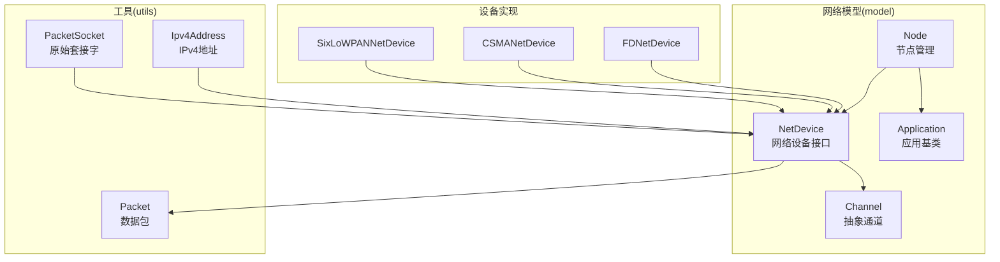
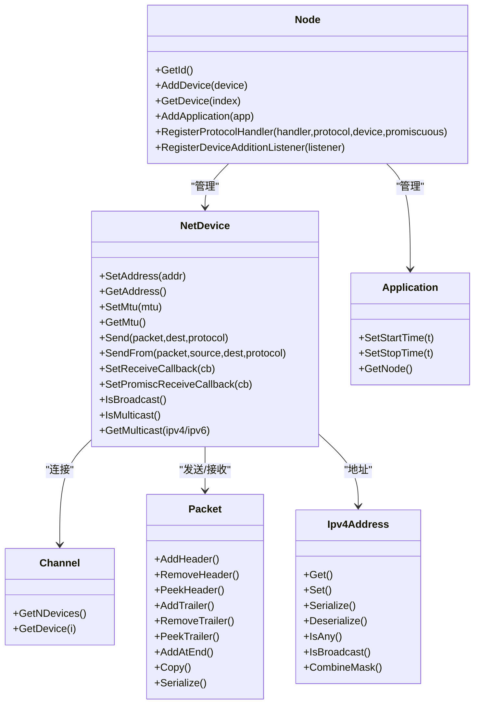
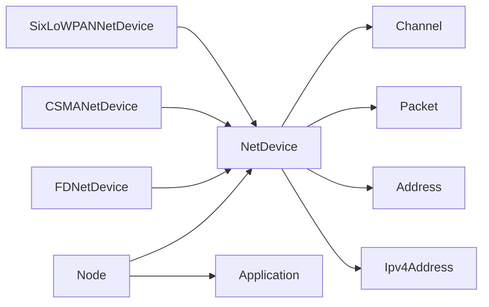
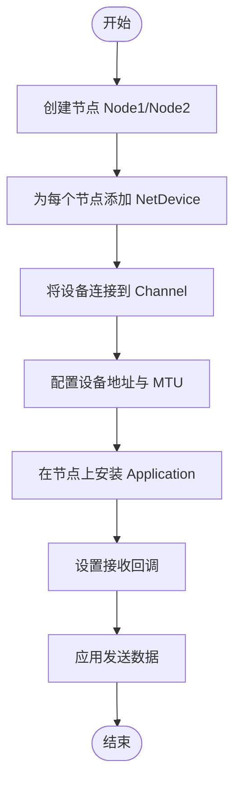

# 网络API

<cite>
**本文引用的文件**
- [node.h](file://simulator/ns-3.39/src/network/model/node.h)
- [net-device.h](file://simulator/ns-3.39/src/network/model/net-device.h)
- [packet.h](file://simulator/ns-3.39/src/network/model/packet.h)
- [ipv4-address.h](file://simulator/ns-3.39/src/network/utils/ipv4-address.h)
- [channel.h](file://simulator/ns-3.39/src/network/model/channel.h)
- [application.h](file://simulator/ns-3.39/src/network/model/application.h)
- [fd-net-device.h](file://simulator/ns-3.39/src/fd-net-device/model/fd-net-device.h)
- [csma-net-device.h](file://simulator/ns-3.39/src/csma/model/csma-net-device.h)
- [sixlowpan-net-device.h](file://simulator/ns-3.39/src/sixlowpan/model/sixlowpan-net-device.h)
- [packet-socket.h](file://simulator/ns-3.39/src/network/utils/packet-socket.h)
</cite>

## 目录
1. [简介](#简介)
2. [项目结构](#项目结构)
3. [核心组件](#核心组件)
4. [架构总览](#架构总览)
5. [详细组件分析](#详细组件分析)
6. [依赖分析](#依赖分析)
7. [性能考虑](#性能考虑)
8. [故障排查指南](#故障排查指南)
9. [结论](#结论)
10. [附录：常见场景与最佳实践](#附录常见场景与最佳实践)

## 简介
本文件为 NS-3 网络模块的详细 API 文档，聚焦于网络核心类的完整接口说明与使用方法，包括：
- 节点 Node：节点生命周期、设备与应用管理、协议处理器注册、设备添加监听器
- 网络设备 NetDevice：发送/接收、链路状态、广播/组播支持、回调设置
- 数据包 Packet：头部/尾部操作、标签（Tag）系统、序列化与拷贝策略
- 地址 Ipv4Address：IPv4 地址构造、掩码、类型判断与转换
- 通道 Channel：抽象通道接口，连接多个 NetDevice
- 应用 Application：应用生命周期控制与事件调度
- 设备实现示例：FDNetDevice、CSMANetDevice、SixLoWPANNetDevice
- 套接字 PacketSocket：应用与设备间的直接通信

文档同时提供网络类之间的关系图、典型场景流程图与最佳实践建议，帮助读者快速掌握 NS-3 网络建模与仿真。

## 项目结构
NS-3 的网络层位于 src/network 子目录，主要由以下层次构成：
- model：核心对象模型（Node、NetDevice、Channel、Application）
- utils：通用工具（PacketSocket、IPv4Address 等）
- 具体设备实现：src/{module}/model 下的设备类（如 fd-net-device、csma、sixlowpan）

**图表来源**
- [node.h:58-331](file://simulator/ns-3.39/src/network/model/node.h#L58-L331)
- [net-device.h:101-384](file://simulator/ns-3.39/src/network/model/net-device.h#L101-L384)
- [channel.h:44-85](file://simulator/ns-3.39/src/network/model/channel.h#L44-L85)
- [application.h:60-158](file://simulator/ns-3.39/src/network/model/application.h#L60-L158)
- [packet.h:238-873](file://simulator/ns-3.39/src/network/model/packet.h#L238-L873)
- [ipv4-address.h:41-429](file://simulator/ns-3.39/src/network/utils/ipv4-address.h#L41-L429)
- [packet-socket.h:40-69](file://simulator/ns-3.39/src/network/utils/packet-socket.h#L40-L69)
- [fd-net-device.h:184-235](file://simulator/ns-3.39/src/fd-net-device/model/fd-net-device.h#L184-L235)
- [csma-net-device.h:466-514](file://simulator/ns-3.39/src/csma/model/csma-net-device.h#L466-L514)
- [sixlowpan-net-device.h:276-305](file://simulator/ns-3.39/src/sixlowpan/model/sixlowpan-net-device.h#L276-L305)

**章节来源**
- [node.h:41-331](file://simulator/ns-3.39/src/network/model/node.h#L41-L331)
- [net-device.h:49-384](file://simulator/ns-3.39/src/network/model/net-device.h#L49-L384)
- [channel.h:35-85](file://simulator/ns-3.39/src/network/model/channel.h#L35-L85)
- [application.h:34-158](file://simulator/ns-3.39/src/network/model/application.h#L34-L158)
- [packet.h:190-873](file://simulator/ns-3.39/src/network/model/packet.h#L190-L873)
- [ipv4-address.h:34-429](file://simulator/ns-3.39/src/network/utils/ipv4-address.h#L34-L429)
- [packet-socket.h:40-69](file://simulator/ns-3.39/src/network/utils/packet-socket.h#L40-L69)
- [fd-net-device.h:184-235](file://simulator/ns-3.39/src/fd-net-device/model/fd-net-device.h#L184-L235)
- [csma-net-device.h:466-514](file://simulator/ns-3.39/src/csma/model/csma-net-device.h#L466-L514)
- [sixlowpan-net-device.h:276-305](file://simulator/ns-3.39/src/sixlowpan/model/sixlowpan-net-device.h#L276-L305)

## 核心组件
本节对 Node、NetDevice、Packet、Ipv4Address 进行 API 概览与职责说明。

- Node
  - 职责：聚合 NetDevice 与 Application；维护协议处理器；通知设备添加事件；提供本地时间与节点类型扩展
  - 关键接口：AddDevice、GetDevice、GetNDevices、AddApplication、GetApplication、RegisterProtocolHandler、RegisterDeviceAdditionListener
  - 参考路径：[node.h:100-214](file://simulator/ns-3.39/src/network/model/node.h#L100-L214)

- NetDevice
  - 职责：向上层提供统一发送/接收接口；管理链路状态、MTU、广播/组播；设置回调以传递上层数据
  - 关键接口：SetAddress、GetAddress、SetMtu、GetMtu、Send/SendFrom、SetReceiveCallback、SetPromiscReceiveCallback、IsBroadcast/IsMulticast、GetMulticast
  - 参考路径：[net-device.h:111-379](file://simulator/ns-3.39/src/network/model/net-device.h#L111-L379)

- Packet
  - 职责：承载协议头/尾与标签；支持 COW 拷贝；提供序列化/反序列化；支持按字节/包级标签迭代
  - 关键接口：AddHeader/RemoveHeader/PpeekHeader、AddTrailer/RemoveTrailer/PpeekTrailer、AddAtEnd/AddPaddingAtEnd、Copy/GetSerializedSize/Serialize、AddByteTag/AddPacketTag/RemovePacketTag/PeekPacketTag
  - 参考路径：[packet.h:240-772](file://simulator/ns-3.39/src/network/model/packet.h#L240-L772)

- Ipv4Address
  - 职责：IPv4 地址表示与运算；掩码匹配；类型判断与转换
  - 关键接口：Get/Set、Serialize/Deserialize、IsAny/IsLocalhost/IsBroadcast/IsMulticast、CombineMask、ConvertTo/ConvertFrom
  - 参考路径：[ipv4-address.h:41-429](file://simulator/ns-3.39/src/network/utils/ipv4-address.h#L41-L429)

**章节来源**
- [node.h:41-331](file://simulator/ns-3.39/src/network/model/node.h#L41-L331)
- [net-device.h:49-384](file://simulator/ns-3.39/src/network/model/net-device.h#L49-L384)
- [packet.h:190-873](file://simulator/ns-3.39/src/network/model/packet.h#L190-L873)
- [ipv4-address.h:34-429](file://simulator/ns-3.39/src/network/utils/ipv4-address.h#L34-L429)

## 架构总览
下图展示 NS-3 网络层核心对象之间的交互关系与数据流方向。

**图表来源**
- [node.h:58-331](file://simulator/ns-3.39/src/network/model/node.h#L58-L331)
- [net-device.h:101-384](file://simulator/ns-3.39/src/network/model/net-device.h#L101-L384)
- [channel.h:44-85](file://simulator/ns-3.39/src/network/model/channel.h#L44-L85)
- [application.h:60-158](file://simulator/ns-3.39/src/network/model/application.h#L60-L158)
- [packet.h:238-873](file://simulator/ns-3.39/src/network/model/packet.h#L238-L873)
- [ipv4-address.h:41-429](file://simulator/ns-3.39/src/network/utils/ipv4-address.h#L41-L429)

## 详细组件分析

### Node 类 API 详解
- 节点标识与时间
  - GetId、GetLocalTime、GetSystemId
- 设备管理
  - AddDevice、GetDevice、GetNDevices
- 应用管理
  - AddApplication、DeleteApplication、GetApplication、GetNApplications
- 协议处理器
  - RegisterProtocolHandler、UnregisterProtocolHandler（支持非混杂与混杂模式）
- 设备事件监听
  - RegisterDeviceAdditionListener、UnregisterDeviceAdditionListener
- 扩展能力
  - SetNodeType/GetNodeType、SwitchReceiveFromDevice、SwitchNotifyDequeue

参考路径：
- [node.h:65-214](file://simulator/ns-3.39/src/network/model/node.h#L65-L214)

**章节来源**
- [node.h:65-214](file://simulator/ns-3.39/src/network/model/node.h#L65-L214)

### NetDevice 接口详解
- 地址与 MTU
  - SetAddress、GetAddress、SetMtu、GetMtu
- 链路与回调
  - IsLinkUp、AddLinkChangeCallback、SetReceiveCallback、SetPromiscReceiveCallback
- 广播/组播
  - IsBroadcast、GetBroadcast、IsMulticast、GetMulticast(Ipv4Address)、GetMulticast(Ipv6Address)
- 发送接口
  - Send、SendFrom（支持“MAC 欺骗”源地址）
- 设备属性
  - IsBridge、IsPointToPoint、SupportsSendFrom
- 扩展能力
  - IsQbb、SwitchSend

参考路径：
- [net-device.h:111-379](file://simulator/ns-3.39/src/network/model/net-device.h#L111-L379)

**章节来源**
- [net-device.h:111-379](file://simulator/ns-3.39/src/network/model/net-device.h#L111-L379)

### Packet 数据包 API 详解
- 构造与拷贝
  - 默认构造、零填充构造、缓冲区反序列化、复制构造、Copy()
- 头/尾操作
  - AddHeader、RemoveHeader、PeekHeader（固定/可变长度）
  - AddTrailer、RemoveTrailer、PeekTrailer
- 拼接与裁剪
  - AddAtEnd、AddPaddingAtEnd、RemoveAtEnd、RemoveAtStart
- 序列化与打印
  - GetSerializedSize、Serialize、Print/ToString、BeginItem
  - EnablePrinting、EnableChecking
- 标签系统
  - 字节标签：AddByteTag、GetByteTagIterator、FindFirstMatchingByteTag、RemoveAllByteTags、PrintByteTags
  - 包标签：AddPacketTag、RemovePacketTag、ReplacePacketTag、PeekPacketTag、GetPacketTagIterator、RemoveAllPacketTags
- 性能特性
  - COW 拷贝语义与脏/非脏操作开销差异

参考路径：
- [packet.h:240-772](file://simulator/ns-3.39/src/network/model/packet.h#L240-L772)

**章节来源**
- [packet.h:240-772](file://simulator/ns-3.39/src/network/model/packet.h#L240-L772)

### Ipv4Address 地址 API 详解
- 构造与设置
  - 构造函数（整型/字符串）、Set/Get、Serialize/Deserialize
- 判断与转换
  - IsInitialized、IsAny、IsLocalhost、IsBroadcast、IsMulticast、IsLocalMulticast
  - ConvertTo/ConvertFrom、IsMatchingType
- 子网与掩码
  - CombineMask、GetSubnetDirectedBroadcast、IsSubnetDirectedBroadcast
  - Ipv4Mask：Get/Set、GetInverse、GetPrefixLength、GetLoopback/GetZero/GetOnes、IsMatch

参考路径：
- [ipv4-address.h:41-429](file://simulator/ns-3.39/src/network/utils/ipv4-address.h#L41-L429)

**章节来源**
- [ipv4-address.h:41-429](file://simulator/ns-3.39/src/network/utils/ipv4-address.h#L41-L429)

### 设备实现示例

#### FDNetDevice
- 广播/组播能力设置：SetIsBroadcast、SetIsMulticast
- 写入接口：Write
- 缓冲区管理：AllocateBuffer、FreeBuffer
- 回调：ReceiveCallback
- 文件描述符：GetFileDescriptor
- 生命周期：DoInitialize、DoDispose

参考路径：
- [fd-net-device.h:184-235](file://simulator/ns-3.39/src/fd-net-device/model/fd-net-device.h#L184-L235)

**章节来源**
- [fd-net-device.h:184-235](file://simulator/ns-3.39/src/fd-net-device/model/fd-net-device.h#L184-L235)

#### CSMANetDevice
- 发送状态机：READY/BUSY/GAP/BACKOFF
- 参数：EncapsulationMode、DataRate、Time Interframe Gap、Backoff
- 接收使能：m_receiveEnable

参考路径：
- [csma-net-device.h:466-514](file://simulator/ns-3.39/src/csma/model/csma-net-device.h#L466-L514)

**章节来源**
- [csma-net-device.h:466-514](file://simulator/ns-3.39/src/csma/model/csma-net-device.h#L466-L514)

#### SixLoWPANNetDevice
- 发送封装：DoSend(packet, source, dest, protocolNumber, doSendFrom)
- 接收回调：m_rxCallback、m_promiscRxCallback

参考路径：
- [sixlowpan-net-device.h:276-305](file://simulator/ns-3.39/src/sixlowpan/model/sixlowpan-net-device.h#L276-L305)

**章节来源**
- [sixlowpan-net-device.h:276-305](file://simulator/ns-3.39/src/sixlowpan/model/sixlowpan-net-device.h#L276-L305)

### PacketSocket 与应用到设备的直连
- 作用：在应用与 NetDevice 之间建立类似“原始套接字”的链接
- 绑定/连接语义：仅使用协议与设备字段进行绑定；连接时设置默认目的地址
- 发送行为：Send/SendTo 使用协议、设备与“物理地址”字段决定传输路径

参考路径：
- [packet-socket.h:40-69](file://simulator/ns-3.39/src/network/utils/packet-socket.h#L40-L69)

**章节来源**
- [packet-socket.h:40-69](file://simulator/ns-3.39/src/network/utils/packet-socket.h#L40-L69)

## 依赖分析
- Node 依赖 NetDevice、Application、Packet、Address（通过 NetDevice）
- NetDevice 依赖 Channel、Packet、Address（IPv4/IPv6）、Node
- Packet 依赖 Header/Trailer、Tag、Buffer、NixVector
- Ipv4Address 依赖 Address 抽象类型与 AttributeHelper
- 设备实现依赖 NetDevice 接口与具体链路模型

**图表来源**
- [node.h:58-331](file://simulator/ns-3.39/src/network/model/node.h#L58-L331)
- [net-device.h:101-384](file://simulator/ns-3.39/src/network/model/net-device.h#L101-L384)
- [channel.h:44-85](file://simulator/ns-3.39/src/network/model/channel.h#L44-L85)
- [packet.h:238-873](file://simulator/ns-3.39/src/network/model/packet.h#L238-L873)
- [ipv4-address.h:41-429](file://simulator/ns-3.39/src/network/utils/ipv4-address.h#L41-L429)
- [fd-net-device.h:184-235](file://simulator/ns-3.39/src/fd-net-device/model/fd-net-device.h#L184-L235)
- [csma-net-device.h:466-514](file://simulator/ns-3.39/src/csma/model/csma-net-device.h#L466-L514)
- [sixlowpan-net-device.h:276-305](file://simulator/ns-3.39/src/sixlowpan/model/sixlowpan-net-device.h#L276-L305)

**章节来源**
- [node.h:58-331](file://simulator/ns-3.39/src/network/model/node.h#L58-L331)
- [net-device.h:101-384](file://simulator/ns-3.39/src/network/model/net-device.h#L101-L384)
- [channel.h:44-85](file://simulator/ns-3.39/src/network/model/channel.h#L44-L85)
- [packet.h:238-873](file://simulator/ns-3.39/src/network/model/packet.h#L238-L873)
- [ipv4-address.h:41-429](file://simulator/ns-3.39/src/network/utils/ipv4-address.h#L41-L429)
- [fd-net-device.h:184-235](file://simulator/ns-3.39/src/fd-net-device/model/fd-net-device.h#L184-L235)
- [csma-net-device.h:466-514](file://simulator/ns-3.39/src/csma/model/csma-net-device.h#L466-L514)
- [sixlowpan-net-device.h:276-305](file://simulator/ns-3.39/src/sixlowpan/model/sixlowpan-net-device.h#L276-L305)

## 性能考虑
- Packet 的 COW 拷贝机制在无修改情况下代价极低；涉及头部/尾部增删、标签替换等“脏操作”会触发潜在拷贝，应避免在热路径频繁执行
- NetDevice 的 Send/SendFrom 与回调设置应在初始化阶段完成，减少运行期开销
- 广播/组播处理可能带来额外 CPU 开销，建议按需启用
- 设备实现中的状态机（如 CSMA）与回退参数会影响吞吐与时延，需结合链路特性调优

[本节为通用指导，无需特定文件引用]

## 故障排查指南
- 发送失败
  - 检查 NetDevice::Send 返回值与链路状态（IsLinkUp、AddLinkChangeCallback）
  - 确认目标地址类型与设备支持（IsBroadcast/IsMulticast/GetMulticast）
- 接收异常
  - 确认已设置 ReceiveCallback 或 PromiscReceiveCallback
  - 混杂模式下注意区分 PacketType（Host/Broadcast/Multicast/OtherHost）
- 地址问题
  - Ipv4Address 的 IsAny/IsBroadcast/IsLocalhost 判断是否符合预期
  - 掩码匹配错误会导致子网判断异常
- 标签丢失或不生效
  - 字节标签为常量操作，确保在 const 上下文也能正确设置
  - 包标签需在需要时显式 Add/Peek/Remove

**章节来源**
- [net-device.h:155-379](file://simulator/ns-3.39/src/network/model/net-device.h#L155-L379)
- [ipv4-address.h:103-168](file://simulator/ns-3.39/src/network/utils/ipv4-address.h#L103-L168)
- [packet.h:564-772](file://simulator/ns-3.39/src/network/model/packet.h#L564-L772)

## 结论
NS-3 网络模块通过 Node、NetDevice、Packet、Ipv4Address 等核心类实现了从应用到链路的完整抽象。理解各组件的职责边界与接口契约，有助于高效构建拓扑、连接设备、处理数据包与分配地址。结合设备实现细节与性能注意事项，可在保证正确性的同时获得良好的仿真效率。

[本节为总结，无需特定文件引用]

## 附录：常见场景与最佳实践

### 场景一：构建简单点对点拓扑并发送数据
- 步骤
  - 创建两个 Node
  - 为每个 Node 添加一个 PointToPointNetDevice，并连接到同一 Channel
  - 在 Node 上安装 Application，使用 Socket 发送数据
  - 设置 NetDevice 的地址与 MTU，配置链路回调
- 流程图

[本图为概念流程，无需图表来源]

### 场景二：多跳网络与路由
- 步骤
  - 使用多个 Node 与 NetDevice 构建链路
  - 为每个 NetDevice 分配不同 Ipv4 地址与掩码
  - 注册协议处理器以处理特定协议号的数据包
- 注意
  - 确保链路层广播/组播能力满足需求
  - 合理设置 MTU，避免 IP 层分片

**章节来源**
- [node.h:184-214](file://simulator/ns-3.39/src/network/model/node.h#L184-L214)
- [net-device.h:111-153](file://simulator/ns-3.39/src/network/model/net-device.h#L111-L153)
- [ipv4-address.h:127-168](file://simulator/ns-3.39/src/network/utils/ipv4-address.h#L127-L168)

### 最佳实践
- 在初始化阶段完成 NetDevice 的地址与 MTU 设置，避免运行期变更
- 使用 Packet 的 COW 特性，尽量避免在热路径中执行“脏操作”
- 对于广播/组播流量，谨慎开启混杂模式回调，降低处理开销
- 明确区分应用层与链路层职责，通过 PacketSocket 实现直连时保持最小耦合
- 为复杂设备（如 CSMA）合理配置数据率、帧间隔与回退参数

[本节为通用指导，无需特定文件引用]