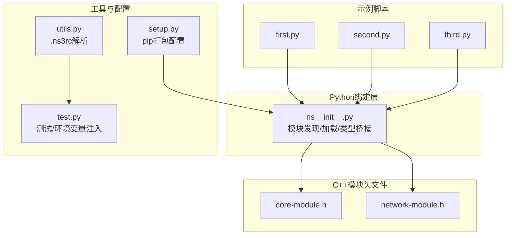
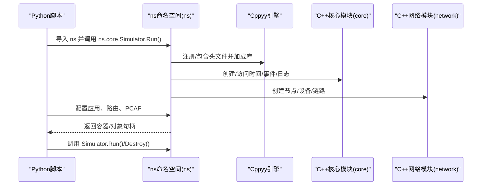
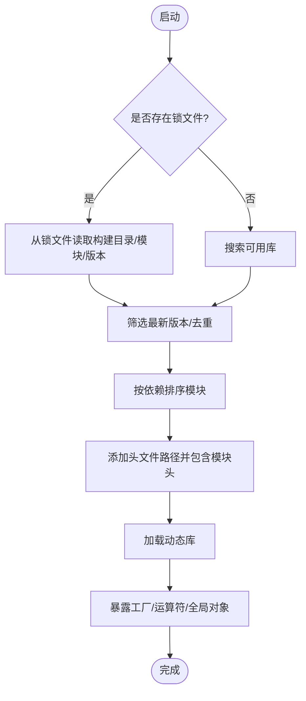
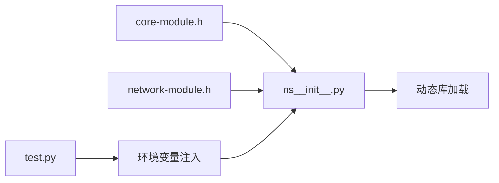

# Python API基础

<cite>
**本文引用的文件**
- [ns__init__.py](file://simulator/ns-3.39/bindings/python/ns__init__.py)
- [first.py](file://simulator/ns-3.39/examples/tutorial/first.py)
- [second.py](file://simulator/ns-3.39/examples/tutorial/second.py)
- [third.py](file://simulator/ns-3.39/examples/tutorial/third.py)
- [core-module.h](file://simulator/ns-3.39/build/include/ns3/core-module.h)
- [network-module.h](file://simulator/ns-3.39/build/include/ns3/network-module.h)
- [utils.py](file://simulator/ns-3.39/utils.py)
- [test.py](file://simulator/ns-3.39/test.py)
- [setup.py](file://simulator/ns-3.39/setup.py)
</cite>

## 目录
1. [引言](#引言)
2. [项目结构](#项目结构)
3. [核心组件](#核心组件)
4. [架构总览](#架构总览)
5. [详细组件分析](#详细组件分析)
6. [依赖分析](#依赖分析)
7. [性能考虑](#性能考虑)
8. [故障排查指南](#故障排查指南)
9. [结论](#结论)
10. [附录：API参考与示例](#附录api参考与示例)

## 引言
本文件系统性阐述 NS-3 的 Python 绑定（Python API）基础，覆盖以下主题：
- Python 绑定的整体架构与模块加载流程
- 类型映射与数据转换规则（C++ 到 Python）
- 核心类在 Python 中的接口使用方式（如 Simulator、Node、Packet 等）
- 完整 API 参考（方法、属性、参数传递）
- 性能与内存管理注意事项
- 基础仿真脚本编写示例（创建节点、配置设备、运行仿真、获取结果）

目标读者为初学者与需要快速上手 NS-3 Python 接口的工程师。

## 项目结构
NS-3 的 Python 绑定位于 bindings/python 下，通过动态加载 C++ 模块库并借助 Cppyy 将 C++ 类型暴露给 Python。示例脚本位于 examples/tutorial 中，展示了从点对点到无线网络的典型用法。

图表来源
- [ns__init__.py:373-597](file://simulator/ns-3.39/bindings/python/ns__init__.py#L373-L597)
- [core-module.h:1-108](file://simulator/ns-3.39/build/include/ns3/core-module.h#L1-L108)
- [network-module.h:1-92](file://simulator/ns-3.39/build/include/ns3/network-module.h#L1-L92)
- [first.py:16-65](file://simulator/ns-3.39/examples/tutorial/first.py#L16-L65)
- [second.py:19-96](file://simulator/ns-3.39/examples/tutorial/second.py#L19-L96)
- [third.py:19-151](file://simulator/ns-3.39/examples/tutorial/third.py#L19-L151)
- [utils.py:89-125](file://simulator/ns-3.39/utils.py#L89-L125)
- [test.py:594-694](file://simulator/ns-3.39/test.py#L594-L694)
- [setup.py:1-36](file://simulator/ns-3.39/setup.py#L1-L36)

章节来源
- [ns__init__.py:373-597](file://simulator/ns-3.39/bindings/python/ns__init__.py#L373-L597)
- [core-module.h:1-108](file://simulator/ns-3.39/build/include/ns3/core-module.h#L1-L108)
- [network-module.h:1-92](file://simulator/ns-3.39/build/include/ns3/network-module.h#L1-L92)
- [first.py:16-65](file://simulator/ns-3.39/examples/tutorial/first.py#L16-L65)
- [second.py:19-96](file://simulator/ns-3.39/examples/tutorial/second.py#L19-L96)
- [third.py:19-151](file://simulator/ns-3.39/examples/tutorial/third.py#L19-L151)
- [utils.py:89-125](file://simulator/ns-3.39/utils.py#L89-L125)
- [test.py:594-694](file://simulator/ns-3.39/test.py#L594-L694)
- [setup.py:1-36](file://simulator/ns-3.39/setup.py#L1-L36)

## 核心组件
- ns 命名空间对象：由 ns__init__.py 动态构建，包含所有已启用模块的 C++ 类型与工厂函数（如 CreateObject、GetObject），以及对 C++ 时间比较运算符的 Python 包装。
- 核心模块（core）：提供时间、事件、日志、命令行、模拟器控制等能力。
- 网络模块（network）：提供节点、设备、链路、地址、包等网络实体容器与辅助类。
- 示例脚本：演示从简单点对点到混合有线/无线拓扑的完整仿真流程。

章节来源
- [ns__init__.py:482-591](file://simulator/ns-3.39/bindings/python/ns__init__.py#L482-L591)
- [core-module.h:1-108](file://simulator/ns-3.39/build/include/ns3/core-module.h#L1-L108)
- [network-module.h:1-92](file://simulator/ns-3.39/build/include/ns3/network-module.h#L1-L92)
- [first.py:25-65](file://simulator/ns-3.39/examples/tutorial/first.py#L25-L65)
- [second.py:38-96](file://simulator/ns-3.39/examples/tutorial/second.py#L38-L96)
- [third.py:54-151](file://simulator/ns-3.39/examples/tutorial/third.py#L54-L151)

## 架构总览
下图展示了 Python 层如何通过 Cppyy 访问 C++ 模块，以及示例脚本如何组织一次完整仿真。

图表来源
- [ns__init__.py:431-471](file://simulator/ns-3.39/bindings/python/ns__init__.py#L431-L471)
- [first.py:25-65](file://simulator/ns-3.39/examples/tutorial/first.py#L25-L65)
- [second.py:62-96](file://simulator/ns-3.39/examples/tutorial/second.py#L62-L96)
- [third.py:107-151](file://simulator/ns-3.39/examples/tutorial/third.py#L107-L151)

## 详细组件分析

### Python 绑定与模块加载（ns__init__.py）
- 模块发现与版本选择
  - 通过锁文件或库搜索策略定位已构建的 ns-3 库，过滤重复与不兼容版本，选择最新版本并按依赖顺序排序。
- Cppyy 集成
  - 添加库路径与头文件路径，包含各模块头文件，加载对应动态库；注册智能指针类型，设置调试选项。
- 运算符与便捷函数
  - 为 C++ 时间类型添加 Python 比较运算符包装；定义 CreateObject/GetObject 工厂函数以支持泛型对象创建与聚合查询。
- 全局对象生命周期
  - 对 Node 的析构进行特殊处理，避免在 Python 层过早销毁导致悬挂引用。

图表来源
- [ns__init__.py:373-471](file://simulator/ns-3.39/bindings/python/ns__init__.py#L373-L471)

章节来源
- [ns__init__.py:13-32](file://simulator/ns-3.39/bindings/python/ns__init__.py#L13-L32)
- [ns__init__.py:313-371](file://simulator/ns-3.39/bindings/python/ns__init__.py#L313-L371)
- [ns__init__.py:384-422](file://simulator/ns-3.39/bindings/python/ns__init__.py#L384-L422)
- [ns__init__.py:431-471](file://simulator/ns-3.39/bindings/python/ns__init__.py#L431-L471)
- [ns__init__.py:482-591](file://simulator/ns-3.39/bindings/python/ns__init__.py#L482-L591)

### 核心类：Simulator（ns.core.Simulator）
- 主要职责
  - 控制仿真时钟推进、事件调度、运行与销毁。
- 常用方法
  - Run()：开始仿真循环直至队列清空或显式停止。
  - Destroy()：清理资源，释放对象。
  - Stop(Time)：安排在指定时间停止仿真。
- 参数与返回
  - Run()/Destroy() 通常无返回值；Stop(Time) 接受时间类型参数。
- 使用要点
  - 在安装应用与路由后调用 Run()；如需截断仿真，先调用 Stop() 再 Run()。

章节来源
- [first.py:62-65](file://simulator/ns-3.39/examples/tutorial/first.py#L62-L65)
- [second.py:88-96](file://simulator/ns-3.39/examples/tutorial/second.py#L88-L96)
- [third.py:138-151](file://simulator/ns-3.39/examples/tutorial/third.py#L138-L151)

### 核心类：Node（ns.network.Node）
- 主要职责
  - 表示网络中的端系统，承载协议栈与应用。
- 常用方法
  - GetId()：获取节点标识。
  - GetDevice(index)：获取指定索引的设备。
  - GetObject(Type)：获取聚合对象（如应用、协议实例）。
- 使用要点
  - 通过 NodeContainer 批量创建；与 InternetStackHelper/PointToPointHelper/CsmaHelper 等配合安装设备与协议栈。

章节来源
- [network-module.h:24-24](file://simulator/ns-3.39/build/include/ns3/network-module.h#L24-L24)
- [first.py:28-30](file://simulator/ns-3.39/examples/tutorial/first.py#L28-L30)
- [second.py:43-48](file://simulator/ns-3.39/examples/tutorial/second.py#L43-L48)
- [third.py:58-60](file://simulator/ns-3.39/examples/tutorial/third.py#L58-L60)

### 核心类：Packet（ns.network.Packet）
- 主要职责
  - 表示网络传输的数据单元，支持构造、写入、读取与统计。
- 常用方法
  - GetSize()：获取包大小。
  - PeekData()/CopyData()：读取包内容。
  - 常见辅助：与 Socket/应用配合使用。
- 使用要点
  - 在应用层（如 UdpEchoClient）生成与发送；在服务器端接收并统计。

章节来源
- [network-module.h:27-27](file://simulator/ns-3.39/build/include/ns3/network-module.h#L27-L27)
- [first.py:54-60](file://simulator/ns-3.39/examples/tutorial/first.py#L54-L60)
- [second.py:79-86](file://simulator/ns-3.39/examples/tutorial/second.py#L79-L86)
- [third.py:129-136](file://simulator/ns-3.39/examples/tutorial/third.py#L129-L136)

### 设备与链路：PointToPointHelper、CsmaHelper、WifiHelper
- PointToPointHelper
  - 设置设备速率与链路延迟，安装到 NodeContainer 上。
- CsmaHelper
  - 设置共享介质速率与延迟，适合多节点接入的局域网场景。
- WifiHelper + YansWifiPhyHelper + WifiMacHelper
  - 配置无线信道、物理层与 MAC 层，支持 STA/AP 模式。
- 使用要点
  - 先创建 NodeContainer，再用相应 Helper 安装设备；随后安装 InternetStack 并分配 IPv4 地址。

章节来源
- [first.py:31-35](file://simulator/ns-3.39/examples/tutorial/first.py#L31-L35)
- [second.py:50-60](file://simulator/ns-3.39/examples/tutorial/second.py#L50-L60)
- [third.py:81-94](file://simulator/ns-3.39/examples/tutorial/third.py#L81-L94)

### 应用与路由：UdpEchoServerHelper、UdpEchoClientHelper、InternetStackHelper、Ipv4GlobalRoutingHelper
- UdpEchoServerHelper/UdpEchoClientHelper
  - 提供回显服务与客户端，用于验证连通性与吞吐。
- InternetStackHelper
  - 为节点安装 TCP/IP 协议栈。
- Ipv4GlobalRoutingHelper.PopulateRoutingTables()
  - 自动填充全局路由表，便于跨子网通信。
- 使用要点
  - 在目标节点安装服务器应用，在源节点安装客户端应用；设置 MaxPackets、Interval、PacketSize 等属性；在仿真末期收集结果。

章节来源
- [first.py:46-61](file://simulator/ns-3.39/examples/tutorial/first.py#L46-L61)
- [second.py:73-88](file://simulator/ns-3.39/examples/tutorial/second.py#L73-L88)
- [third.py:123-138](file://simulator/ns-3.39/examples/tutorial/third.py#L123-L138)

### 类型映射与数据转换规则
- 智能指针与对象句柄
  - C++ 中的 Ptr<T> 在 Python 中作为对象句柄存在，支持 GetObject<T>() 查询聚合对象。
- 时间类型
  - C++ 时间类型通过 Cppyy 包装为 Python 对象，支持比较运算符（==、!=、<、<=、>、>=）。
- 属性与值类型
  - 字符串、整数、布尔、时间等基础类型在 Python 与 C++ 之间自动转换；复杂类型（如 Address、DataRate）通过对应的 Value 类型传递。
- 函数与模板
  - CreateObject/GetObject 通过 Cppyy.cppdef 动态生成模板实例化函数，以支持泛型对象创建与查询。

章节来源
- [ns__init__.py:482-496](file://simulator/ns-3.39/bindings/python/ns__init__.py#L482-L496)
- [ns__init__.py:522-561](file://simulator/ns-3.39/bindings/python/ns__init__.py#L522-L561)
- [ns__init__.py:563-591](file://simulator/ns-3.39/bindings/python/ns__init__.py#L563-L591)

## 依赖分析
- 模块依赖排序
  - 依据库间符号依赖关系进行分层加载，确保父模块先于子模块被包含与加载。
- 头文件聚合
  - 通过 core-module.h 与 network-module.h 等聚合头文件集中包含模块内常用类型，简化 Python 端的类型暴露。
- 测试与环境注入
  - test.py 读取构建配置，注入 PYTHONPATH/LD_LIBRARY_PATH/DYLD_LIBRARY_PATH 等环境变量，保证 Python 能找到 ns-3 库与头文件。

图表来源
- [core-module.h:1-108](file://simulator/ns-3.39/build/include/ns3/core-module.h#L1-L108)
- [network-module.h:1-92](file://simulator/ns-3.39/build/include/ns3/network-module.h#L1-L92)
- [ns__init__.py:466-471](file://simulator/ns-3.39/bindings/python/ns__init__.py#L466-L471)
- [test.py:639-694](file://simulator/ns-3.39/test.py#L639-L694)

章节来源
- [ns__init__.py:384-422](file://simulator/ns-3.39/bindings/python/ns__init__.py#L384-L422)
- [core-module.h:1-108](file://simulator/ns-3.39/build/include/ns3/core-module.h#L1-L108)
- [network-module.h:1-92](file://simulator/ns-3.39/build/include/ns3/network-module.h#L1-L92)
- [test.py:639-694](file://simulator/ns-3.39/test.py#L639-L694)

## 性能考虑
- Cppyy 开销
  - 首次导入与动态类型解析会带来额外开销；建议在脚本开头一次性导入所需模块并复用对象。
- 事件与调度
  - 合理设置应用 Start/Stop 时间，避免过多短周期事件堆积；使用合适的 Time 单位（如 Seconds、NanoSeconds）减少精度损失。
- I/O 与追踪
  - PCAP 输出与日志开启会增加磁盘与 CPU 压力；仅在调试阶段启用，生产运行关闭或限制输出范围。
- 内存管理
  - 注意 Node 等对象的生命周期，避免在 Python 层过早删除导致 C++ 层悬挂；必要时保留引用直到仿真结束。

[本节为通用指导，无需列出具体文件来源]

## 故障排查指南
- 缺少 Cppyy
  - 若未安装 Cppyy，导入 ns 将报错并提示安装方式。
- 库未找到或版本冲突
  - 检查 LD_LIBRARY_PATH/DYLD_LIBRARY_PATH/PYTHONPATH 是否包含 ns-3 构建产物；确认只存在一个兼容版本的库。
- 模块未启用
  - 通过 .ns3rc 或构建配置启用所需模块；test.py 提供了读取配置与注入环境变量的参考实现。
- 路径问题
  - test.py 的 make_paths() 逻辑可作为设置环境变量的范例，确保 Python 能正确发现 ns-3 的库与头文件。

章节来源
- [ns__init__.py:431-438](file://simulator/ns-3.39/bindings/python/ns__init__.py#L431-L438)
- [utils.py:89-125](file://simulator/ns-3.39/utils.py#L89-L125)
- [test.py:594-694](file://simulator/ns-3.39/test.py#L594-L694)

## 结论
NS-3 的 Python 绑定通过 Cppyy 实现 C++ 类型到 Python 的无缝桥接，结合模块聚合头文件与动态库加载机制，为用户提供了简洁一致的仿真脚本接口。遵循本文的 API 使用规范、类型映射规则与性能建议，可快速构建从简单到复杂的网络仿真脚本。

[本节为总结性内容，无需列出具体文件来源]

## 附录：API参考与示例

### API参考（核心类与常用方法）
- ns.core.Simulator
  - Run()：开始仿真
  - Stop(Time)：安排停止时间
  - Destroy()：销毁仿真
- ns.network.Node
  - GetId()：获取节点 ID
  - GetDevice(index)：获取设备
  - GetObject(Type)：获取聚合对象
- ns.network.Packet
  - GetSize()：获取包大小
  - PeekData()/CopyData()：读取内容
- ns.point_to_point.PointToPointHelper
  - SetDeviceAttribute(key, Value)
  - SetChannelAttribute(key, Value)
  - Install(NodeContainer)
- ns.csma.CsmaHelper
  - SetChannelAttribute(...)
  - Install(NodeContainer)
- ns.wifi.WifiHelper/WifiMacHelper/YansWifiPhyHelper
  - 安装无线设备与配置 MAC/PHY
- ns.internet.InternetStackHelper
  - Install(NodeContainer)
- ns.internet.Ipv4AddressHelper
  - SetBase(Address, Mask)
  - Assign(DeviceContainer)
- ns.applications.UdpEchoServerHelper/UdpEchoClientHelper
  - Install(NodeContainer)
  - SetAttribute(key, Value)

章节来源
- [first.py:25-65](file://simulator/ns-3.39/examples/tutorial/first.py#L25-L65)
- [second.py:38-96](file://simulator/ns-3.39/examples/tutorial/second.py#L38-L96)
- [third.py:54-151](file://simulator/ns-3.39/examples/tutorial/third.py#L54-L151)

### 基础仿真脚本编写步骤
- 步骤一：导入 ns 并配置日志
  - 示例：启用 UdpEchoClient/Server 日志级别
- 步骤二：创建节点与设备
  - 使用 NodeContainer 创建节点；使用 PointToPointHelper/CsmaHelper/WifiHelper 安装设备
- 步骤三：安装协议栈与分配地址
  - 使用 InternetStackHelper 安装协议栈；使用 Ipv4AddressHelper 分配地址
- 步骤四：部署应用
  - 使用 UdpEchoServerHelper 在目的节点部署服务器；使用 UdpEchoClientHelper 在源节点部署客户端，设置 MaxPackets、Interval、PacketSize
- 步骤五：运行与清理
  - 调用 Simulator.Run() 运行仿真；结束后调用 Simulator.Destroy()

章节来源
- [first.py:25-65](file://simulator/ns-3.39/examples/tutorial/first.py#L25-L65)
- [second.py:38-96](file://simulator/ns-3.39/examples/tutorial/second.py#L38-L96)
- [third.py:54-151](file://simulator/ns-3.39/examples/tutorial/third.py#L54-L151)

### 学习路径建议
- 第一步：阅读并运行 first.py，理解基本的点对点拓扑与回显应用
- 第二步：阅读 second.py，掌握混合拓扑（点对点 + CSMA）与路由表填充
- 第三步：阅读 third.py，学习无线（WiFi）场景与移动模型
- 第四步：查阅 ns.core 与 ns.network 的头文件聚合，了解可用类型与方法
- 第五步：结合 utils.py 与 test.py 的配置与环境注入逻辑，解决实际工程中的路径与模块问题

章节来源
- [first.py:16-65](file://simulator/ns-3.39/examples/tutorial/first.py#L16-L65)
- [second.py:19-96](file://simulator/ns-3.39/examples/tutorial/second.py#L19-L96)
- [third.py:19-151](file://simulator/ns-3.39/examples/tutorial/third.py#L19-L151)
- [core-module.h:1-108](file://simulator/ns-3.39/build/include/ns3/core-module.h#L1-L108)
- [network-module.h:1-92](file://simulator/ns-3.39/build/include/ns3/network-module.h#L1-L92)
- [utils.py:89-125](file://simulator/ns-3.39/utils.py#L89-L125)
- [test.py:594-694](file://simulator/ns-3.39/test.py#L594-L694)