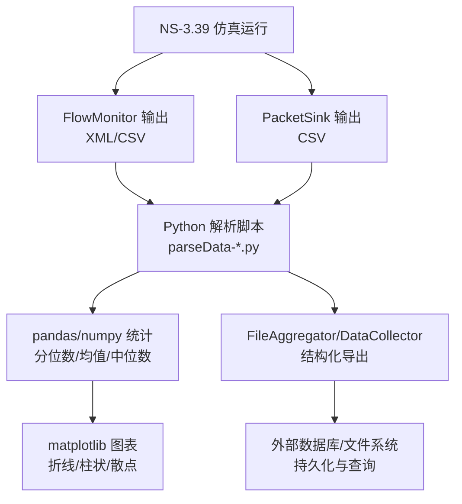
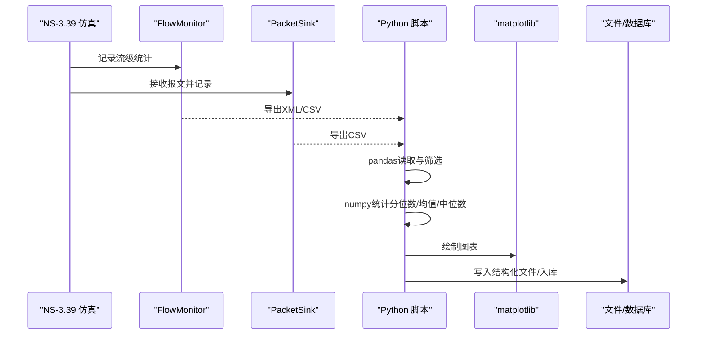
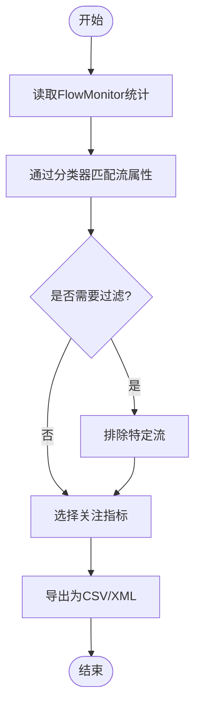
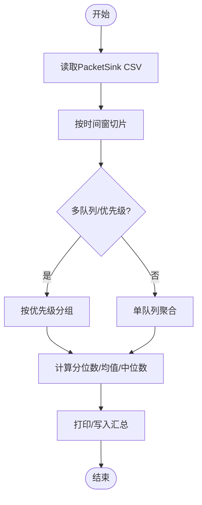
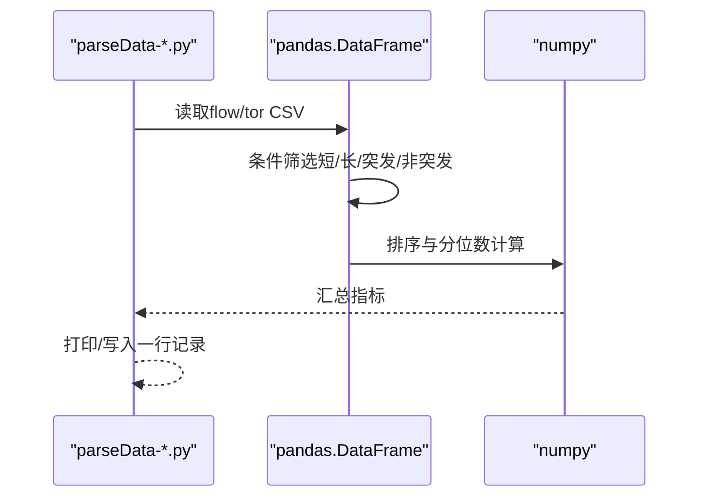
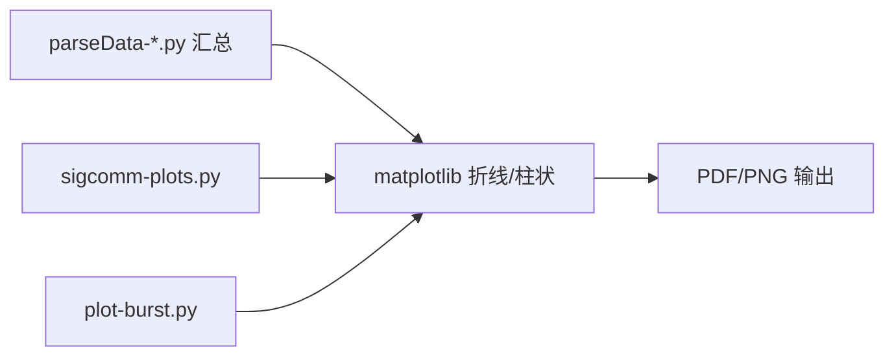
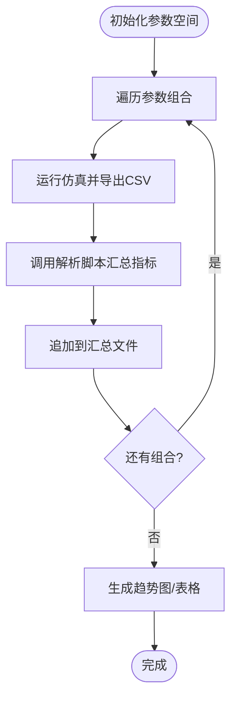
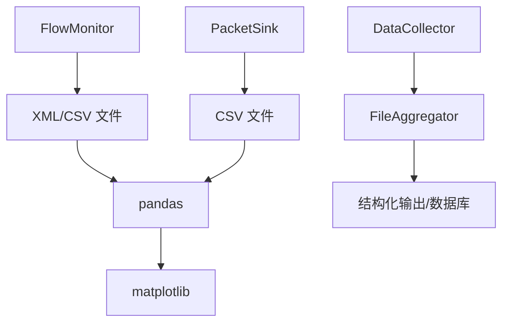

# Python数据分析

<cite>
**本文引用的文件**
- [README.md](file://README.md)
- [parseData-multiQ.py](file://simulator/ns-3.39/examples/ABM/parseData-multiQ.py)
- [parseData-singleQ.py](file://simulator/ns-3.39/examples/ABM/parseData-singleQ.py)
- [parseData-singleQLoads.py](file://simulator/ns-3.39/examples/ABM/parseData-singleQLoads.py)
- [plot-burst.py](file://simulator/ns-3.39/examples/PowerTCP/plot-burst.py)
- [sigcomm-plots.py](file://simulator/ns-3.39/examples/Reverie/sigcomm-plots.py)
- [wifi-olsr-flowmon.py](file://simulator/ns-3.39/src/flow-monitor/examples/wifi-olsr-flowmon.py)
- [flow-monitor.rst](file://simulator/ns-3.39/src/flow-monitor/doc/flow-monitor.rst)
- [file-aggregator.h](file://simulator/ns-3.39/src/stats/model/file-aggregator.h)
- [data-collector.h](file://simulator/ns-3.39/src/stats/model/data-collector.h)
</cite>

## 目录
1. [引言](#引言)
2. [项目结构](#项目结构)
3. [核心组件](#核心组件)
4. [架构总览](#架构总览)
5. [详细组件分析](#详细组件分析)
6. [依赖关系分析](#依赖关系分析)
7. [性能考量](#性能考量)
8. [故障排查指南](#故障排查指南)
9. [结论](#结论)
10. [附录](#附录)

## 引言
本文件面向使用NS-3进行网络仿真与数据分析的研究者与工程师，系统化讲解如何利用Python对仿真结果进行采集、处理、统计与可视化。重点覆盖以下方面：
- 使用FlowMonitor、PacketSink等组件的数据输出格式与解析方法
- 基于pandas/numpy/matplotlib的统计分析与图表绘制实践
- 批量实验设计（参数扫描、结果汇总、趋势分析）
- 数据存储格式与可扩展的数据库集成思路
- 从原始数据到科学结论的完整分析流程案例

## 项目结构
该仓库以NS-3.39为核心，围绕数据中心场景扩展了多种拥塞控制与缓冲管理算法，并配套了丰富的Python分析脚本与绘图工具。关键路径如下：
- 分析脚本：examples目录下的ABM、PowerTCP、Reverie等子目录中包含数据解析与可视化脚本
- 流量监控：src/flow-monitor提供FlowMonitor示例与文档
- 统计与聚合：src/stats/model提供DataCollector与FileAggregator接口，便于导出结构化数据
- 可视化：各案例脚本展示了多类图表绘制与多指标对比

**章节来源**
- [README.md: 83-96:83-96](file://README.md#L83-L96)

## 核心组件
- FlowMonitor：用于统计流级指标（吞吐、时延、丢包等），支持序列化为XML或按需读取
- PacketSink：用于接收并记录报文到达信息，常配合流量分类器进行统计
- 数据解析脚本：基于pandas读取CSV，按业务需求筛选与聚合
- 可视化脚本：基于matplotlib绘制时序图、箱线图、多指标同图等
- 结构化导出：DataCollector/FileAggregator提供统一的实验描述与多维数据写入能力

**章节来源**
- [wifi-olsr-flowmon.py: 148-180:148-180](file://simulator/ns-3.39/src/flow-monitor/examples/wifi-olsr-flowmon.py#L148-L180)
- [flow-monitor.rst: 87-115:87-115](file://simulator/ns-3.39/src/flow-monitor/doc/flow-monitor.rst#L87-L115)
- [file-aggregator.h: 312-356:312-356](file://simulator/ns-3.39/src/stats/model/file-aggregator.h#L312-L356)
- [data-collector.h: 55-118:55-118](file://simulator/ns-3.39/src/stats/model/data-collector.h#L55-L118)

## 架构总览
下图展示了从仿真到分析的端到端流程：仿真生成原始数据 → Python解析与清洗 → 统计与可视化 → 结果归档与复现。

**图表来源**
- [wifi-olsr-flowmon.py: 148-180:148-180](file://simulator/ns-3.39/src/flow-monitor/examples/wifi-olsr-flowmon.py#L148-L180)
- [parseData-multiQ.py: 42-101:42-101](file://simulator/ns-3.39/examples/ABM/parseData-multiQ.py#L42-L101)
- [plot-burst.py: 56-111:56-111](file://simulator/ns-3.39/examples/PowerTCP/plot-burst.py#L56-L111)

## 详细组件分析

### FlowMonitor 数据输出与解析
- 输出形式：支持XML序列化；也可在仿真结束时直接遍历流统计
- 关键字段：流ID、协议、源/目的地址与端口、接收包数、时延、吞吐等
- 解析要点：
  - 使用分类器定位流属性（协议、端口）
  - 过滤异常流（如特定UDP端口）以避免噪声干扰
  - 将统计结果写入CSV以便后续pandas处理

**图表来源**
- [wifi-olsr-flowmon.py: 148-180:148-180](file://simulator/ns-3.39/src/flow-monitor/examples/wifi-olsr-flowmon.py#L148-L180)

**章节来源**
- [flow-monitor.rst: 87-115:87-115](file://simulator/ns-3.39/src/flow-monitor/doc/flow-monitor.rst#L87-L115)
- [wifi-olsr-flowmon.py: 148-180:148-180](file://simulator/ns-3.39/src/flow-monitor/examples/wifi-olsr-flowmon.py#L148-L180)

### PacketSink 数据输出与解析
- 输出形式：CSV，包含时间戳、节点、队列长度、吞吐等
- 解析要点：
  - 按时间窗口截取（如运行稳定期）
  - 对关键指标排序并计算分位数（99.9/99/95分位）、均值、中位数
  - 多队列场景下按优先级拆分统计

**图表来源**
- [parseData-multiQ.py: 83-98:83-98](file://simulator/ns-3.39/examples/ABM/parseData-multiQ.py#L83-L98)
- [parseData-singleQ.py: 107-122:107-122](file://simulator/ns-3.39/examples/ABM/parseData-singleQ.py#L107-L122)

**章节来源**
- [parseData-multiQ.py: 19-44:19-44](file://simulator/ns-3.39/examples/ABM/parseData-multiQ.py#L19-L44)
- [parseData-singleQ.py: 30-44:30-44](file://simulator/ns-3.39/examples/ABM/parseData-singleQ.py#L30-L44)

### 数据解析与统计（ABM案例）
- 输入：flow与tor两类CSV
- 关键步骤：
  - 计算短/长/突发/非突发流的slowdown分位数
  - 计算上行吞吐与缓冲占用的统计量
  - 输出：多指标拼接的一行记录，便于批量实验汇总

**图表来源**
- [parseData-multiQ.py: 42-101:42-101](file://simulator/ns-3.39/examples/ABM/parseData-multiQ.py#L42-L101)
- [parseData-singleQ.py: 45-125:45-125](file://simulator/ns-3.39/examples/ABM/parseData-singleQ.py#L45-L125)

**章节来源**
- [parseData-multiQ.py: 42-101:42-101](file://simulator/ns-3.39/examples/ABM/parseData-multiQ.py#L42-L101)
- [parseData-singleQ.py: 45-125:45-125](file://simulator/ns-3.39/examples/ABM/parseData-singleQ.py#L45-L125)
- [parseData-singleQLoads.py: 45-125:45-125](file://simulator/ns-3.39/examples/ABM/parseData-singleQLoads.py#L45-L125)

### 可视化与趋势分析（PowerTCP/Reverie案例）
- PowerTCP：绘制吞吐与时延、队列长度、功率随时间变化的双轴图
- Reverie：多算法/多参数组合的趋势对比，包含PFC暂停次数、不同分位FCT、缓冲占用等

**图表来源**
- [plot-burst.py: 56-111:56-111](file://simulator/ns-3.39/examples/PowerTCP/plot-burst.py#L56-L111)
- [sigcomm-plots.py: 102-181:102-181](file://simulator/ns-3.39/examples/Reverie/sigcomm-plots.py#L102-L181)

**章节来源**
- [plot-burst.py: 1-115:1-115](file://simulator/ns-3.39/examples/PowerTCP/plot-burst.py#L1-L115)
- [sigcomm-plots.py: 1-800:1-800](file://simulator/ns-3.39/examples/Reverie/sigcomm-plots.py#L1-L800)

### 批量实验设计与执行
- 参数扫描：在脚本中循环不同算法、负载、突发大小、优先级等
- 结果汇总：将每组实验的指标拼接为一行，写入汇总文件
- 趋势分析：按参数分组绘制多指标曲线，观察算法优劣与鲁棒性

[本图为概念性流程，不直接映射具体源码文件]

## 依赖关系分析
- FlowMonitor与PacketSink依赖NS-3仿真内核提供的统计接口
- Python解析脚本依赖pandas/numpy/matplotlib生态
- DataCollector/FileAggregator提供统一的结构化输出接口，便于接入数据库或批处理流水线

**图表来源**
- [wifi-olsr-flowmon.py: 148-180:148-180](file://simulator/ns-3.39/src/flow-monitor/examples/wifi-olsr-flowmon.py#L148-L180)
- [file-aggregator.h: 312-356:312-356](file://simulator/ns-3.39/src/stats/model/file-aggregator.h#L312-L356)
- [data-collector.h: 55-118:55-118](file://simulator/ns-3.39/src/stats/model/data-collector.h#L55-L118)

**章节来源**
- [file-aggregator.h: 312-356:312-356](file://simulator/ns-3.39/src/stats/model/file-aggregator.h#L312-L356)
- [data-collector.h: 55-118:55-118](file://simulator/ns-3.39/src/stats/model/data-collector.h#L55-L118)

## 性能考量
- 数据规模：大规模仿真会产生大量CSV行，建议采用分块读取与增量写入
- 内存占用：pandas读取大文件时注意内存峰值，必要时分段处理
- I/O瓶颈：批量实验建议并行运行仿真，串行解析汇总
- 可重复性：固定随机种子与参数，确保结果可复现

[本节为通用指导，不直接分析具体文件]

## 故障排查指南
- FlowMonitor“丢失包”问题：仿真结束时队列中的排队报文可能被计为丢失，建议在停止应用前预留足够时间让队列清空
- 数据噪声：过滤特定UDP端口或异常流，避免影响统计
- 时间窗口：仅使用稳态阶段的数据，避免启动瞬态干扰

**章节来源**
- [flow-monitor.rst: 87-115:87-115](file://simulator/ns-3.39/src/flow-monitor/doc/flow-monitor.rst#L87-L115)

## 结论
通过将FlowMonitor与PacketSink的输出与Python解析脚本结合，可以高效地完成从原始仿真数据到统计分析与可视化的全流程。借助DataCollector/FileAggregator可进一步实现结构化导出与数据库集成，支撑更大规模的批量实验与长期演进分析。

## 附录
- 常用命令与入口
  - PowerTCP/ABM/Reverie案例脚本位于各自examples目录，可直接参考其run/results脚本组织批量实验
- 数据字段速查
  - Flow统计：时间、流大小、FCT、基准FCT、slowdown、基础RTT、流起始时间、优先级、突发标记等
  - TOR统计：时间、TOR编号、缓冲大小(MB)、占用百分比、上行吞吐、各优先级计数等

**章节来源**
- [README.md: 83-96:83-96](file://README.md#L83-L96)
- [parseData-multiQ.py: 16-41:16-41](file://simulator/ns-3.39/examples/ABM/parseData-multiQ.py#L16-L41)
- [parseData-singleQ.py: 19-44:19-44](file://simulator/ns-3.39/examples/ABM/parseData-singleQ.py#L19-L44)