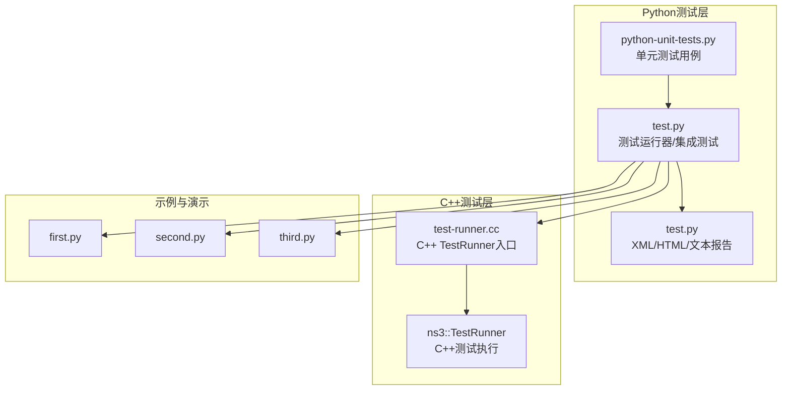
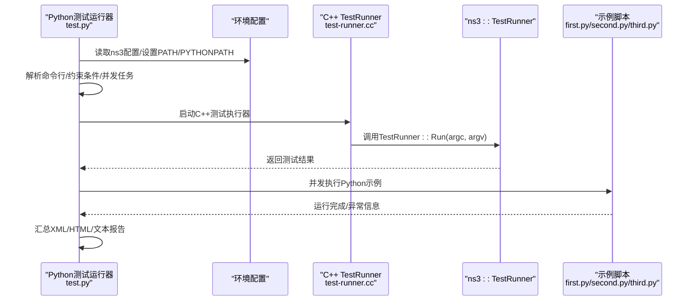
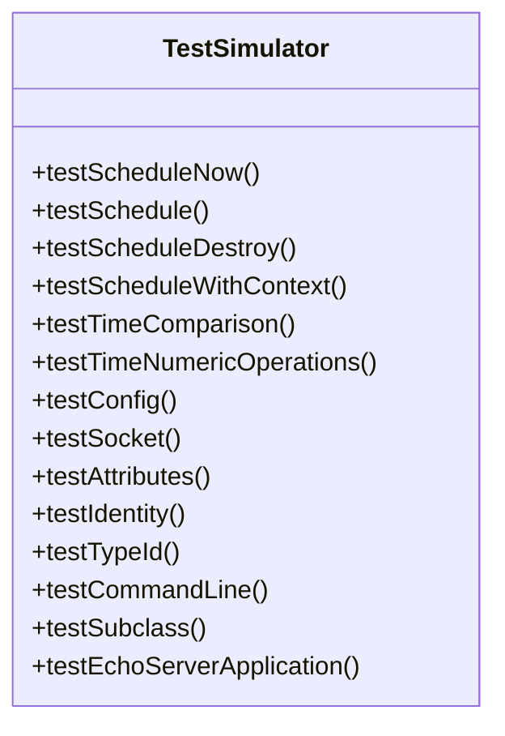
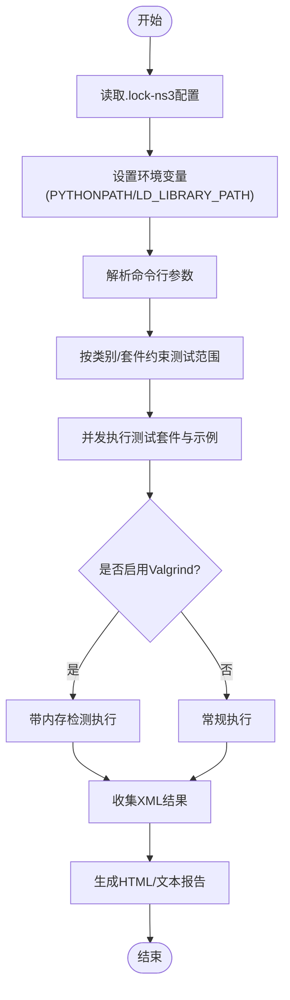
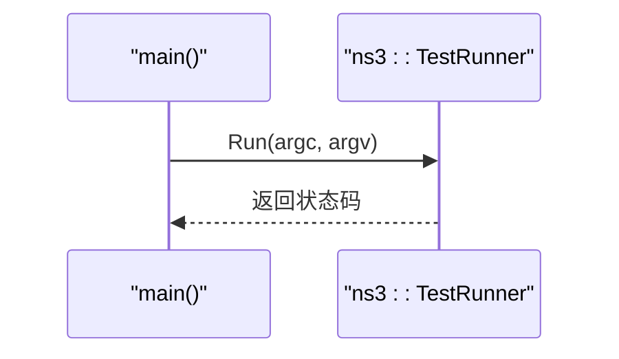
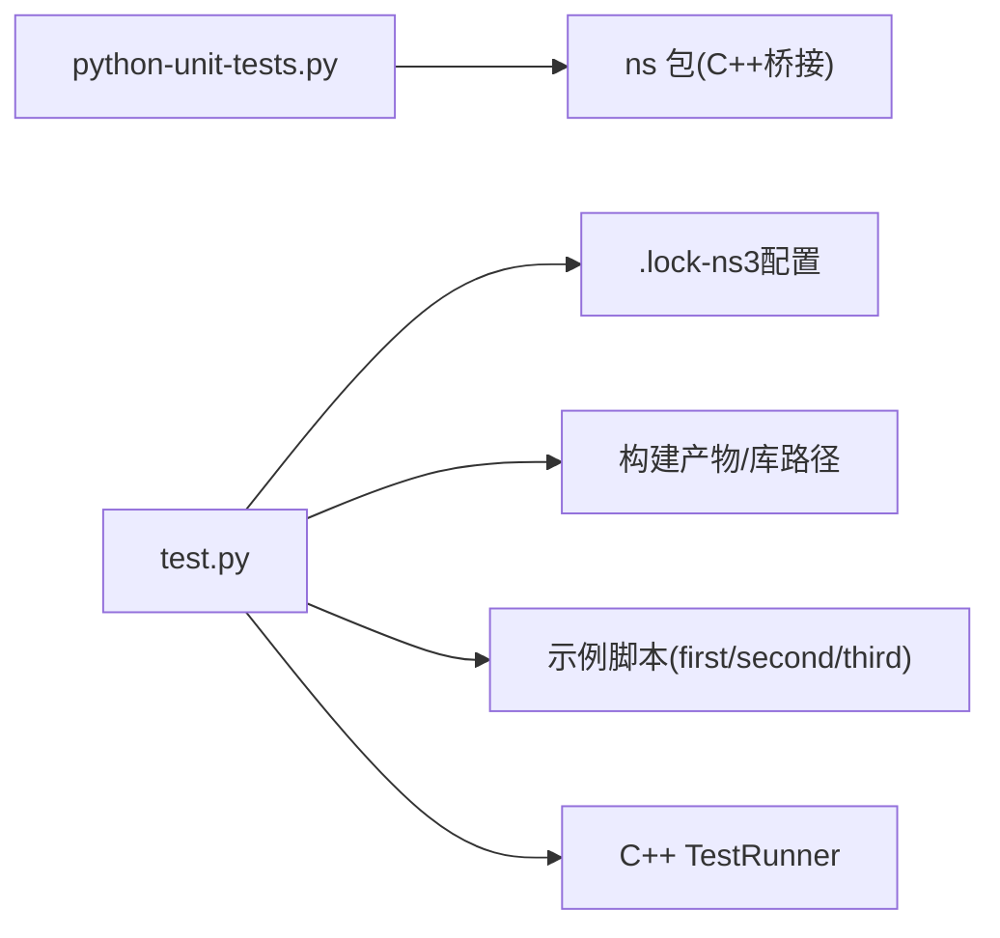

# Python测试框架

<cite>
**本文档引用的文件**
- [python-unit-tests.py](file://simulator/ns-3.39/utils/python-unit-tests.py)
- [test.py](file://simulator/ns-3.39/test.py)
- [test-runner.cc](file://simulator/ns-3.39/utils/test-runner.cc)
- [test-ns3.py](file://simulator/ns-3.39/utils/tests/test-ns3.py)
- [test-test.py](file://simulator/ns-3.39/utils/tests/test-test.py)
- [BakeTestSuite.py](file://simulator/bake/test/BakeTestSuite.py)
- [TestBake.py](file://simulator/bake/test/TestBake.py)
- [first.py](file://simulator/ns-3.39/examples/tutorial/first.py)
- [second.py](file://simulator/ns-3.39/examples/tutorial/second.py)
- [third.py](file://simulator/ns-3.39/examples/tutorial/third.py)
</cite>

## 目录
1. [简介](#简介)
2. [项目结构](#项目结构)
3. [核心组件](#核心组件)
4. [架构总览](#架构总览)
5. [详细组件分析](#详细组件分析)
6. [依赖关系分析](#依赖关系分析)
7. [性能考虑](#性能考虑)
8. [故障排查指南](#故障排查指南)
9. [结论](#结论)
10. [附录](#附录)

## 简介
本指南面向使用NS-3的开发者，系统讲解如何基于Python构建与运行单元测试与集成测试，涵盖测试用例设计、断言方法、测试数据准备、与C++测试框架的协作与混合测试策略、自动化测试最佳实践（CI配置、覆盖率分析、回归测试）、测试环境搭建与依赖管理、以及测试结果报告生成。文档同时提供可直接参考的示例脚本路径与调试技巧。

## 项目结构
NS-3的测试体系由三层组成：
- Python单元测试：位于utils目录下的python-unit-tests.py，覆盖仿真器调度、时间运算、套接字、属性系统、命令行解析等核心能力。
- Python测试运行器与集成测试：位于根目录的test.py，负责扫描可执行示例、并发执行、Valgrind内存检查、结果汇总与报告生成，并通过C++ TestRunner驱动C++测试。
- 示例与演示：examples/tutorial下的Python脚本作为“可运行的测试用例”，可用于端到端集成验证。

图表来源
- [python-unit-tests.py:1-491](file://simulator/ns-3.39/utils/python-unit-tests.py#L1-L491)
- [test.py:1-800](file://simulator/ns-3.39/test.py#L1-L800)
- [test-runner.cc:1-25](file://simulator/ns-3.39/utils/test-runner.cc#L1-L25)
- [first.py:1-65](file://simulator/ns-3.39/examples/tutorial/first.py#L1-L65)
- [second.py:1-96](file://simulator/ns-3.39/examples/tutorial/second.py#L1-L96)
- [third.py:1-151](file://simulator/ns-3.39/examples/tutorial/third.py#L1-L151)

章节来源
- [python-unit-tests.py:1-491](file://simulator/ns-3.39/utils/python-unit-tests.py#L1-L491)
- [test.py:1-800](file://simulator/ns-3.39/test.py#L1-L800)
- [test-runner.cc:1-25](file://simulator/ns-3.39/utils/test-runner.cc#L1-L25)
- [first.py:1-65](file://simulator/ns-3.39/examples/tutorial/first.py#L1-L65)
- [second.py:1-96](file://simulator/ns-3.39/examples/tutorial/second.py#L1-L96)
- [third.py:1-151](file://simulator/ns-3.39/examples/tutorial/third.py#L1-L151)

## 核心组件
- Python单元测试框架：基于unittest，覆盖事件调度、时间比较与运算、套接字收发、对象属性存取、类型查找、命令行参数解析、应用层EchoServer等。
- 测试运行器：解析ns3配置、动态设置环境变量、并发执行示例与测试、支持Valgrind内存检测、生成XML/HTML/文本报告。
- C++ TestRunner：C++侧测试入口，统一由test-runner.cc调用ns3::TestRunner::Run。
- 示例脚本：教程示例作为“可运行的测试用例”，便于端到端回归验证。

章节来源
- [python-unit-tests.py:28-491](file://simulator/ns-3.39/utils/python-unit-tests.py#L28-L491)
- [test.py:594-799](file://simulator/ns-3.39/test.py#L594-L799)
- [test-runner.cc:20-25](file://simulator/ns-3.39/utils/test-runner.cc#L20-L25)

## 架构总览
下图展示了从Python测试到C++测试再到示例执行的整体流程：

图表来源
- [test.py:594-799](file://simulator/ns-3.39/test.py#L594-L799)
- [test-runner.cc:20-25](file://simulator/ns-3.39/utils/test-runner.cc#L20-L25)
- [first.py:1-65](file://simulator/ns-3.39/examples/tutorial/first.py#L1-L65)
- [second.py:1-96](file://simulator/ns-3.39/examples/tutorial/second.py#L1-L96)
- [third.py:1-151](file://simulator/ns-3.39/examples/tutorial/third.py#L1-L151)

## 详细组件分析

### Python单元测试组件分析
该组件以unittest.TestCase为基础，覆盖以下关键领域：
- 事件调度与上下文：验证Schedule/ScheduleNow/ScheduleWithContext/ScheduleDestroy的行为与时间戳一致性。
- 时间运算与比较：对Time类进行加减、比较与数值运算断言。
- 配置与命令行：通过Config.SetDefault与CommandLine解析参数。
- 套接字与网络：创建UDP套接字、绑定、发送接收、回调注册。
- 属性系统：设置/获取对象属性，指针值存取与有效性校验。
- 类型系统：LookupByNameFailSafe与TypeId查询。
- 应用层示例：自定义EchoServer应用，模拟回显逻辑并进行事件调度。

图表来源
- [python-unit-tests.py:28-491](file://simulator/ns-3.39/utils/python-unit-tests.py#L28-L491)

章节来源
- [python-unit-tests.py:39-487](file://simulator/ns-3.39/utils/python-unit-tests.py#L39-L487)

### 测试运行器与集成测试组件分析
- 配置读取：从.lock-ns3文件中提取ENABLE_*、MODULE_PATH、版本等关键配置项。
- 环境注入：根据平台设置DYLD_LIBRARY_PATH/LD_LIBRARY_PATH/PATH/PYTHONPATH。
- 并发执行：为每个测试套件/示例分配独立临时输出目录，避免输出交错。
- Valgrind支持：在需要时启用内存泄漏检测与抑制文件。
- 报告生成：将XML结果转换为HTML/文本报告，包含失败详情与时间统计。

图表来源
- [test.py:594-799](file://simulator/ns-3.39/test.py#L594-L799)
- [test.py:237-563](file://simulator/ns-3.39/test.py#L237-L563)

章节来源
- [test.py:594-799](file://simulator/ns-3.39/test.py#L594-L799)
- [test.py:237-563](file://simulator/ns-3.39/test.py#L237-L563)

### C++测试运行器组件分析
- 入口函数：test-runner.cc仅调用ns3::TestRunner::Run(argc, argv)，实现跨平台统一入口。
- 协作方式：Python测试运行器负责组织与并发控制，C++侧负责具体测试执行与结果返回。

图表来源
- [test-runner.cc:20-25](file://simulator/ns-3.39/utils/test-runner.cc#L20-L25)

章节来源
- [test-runner.cc:20-25](file://simulator/ns-3.39/utils/test-runner.cc#L20-L25)

### 示例脚本作为测试用例
- first.py：点对点拓扑上的UDP回显端到端验证，适合回归测试。
- second.py：点对点+CSMA混合拓扑，含命令行参数解析与PCAP输出。
- third.py：WiFi+CSMA+点对点混合拓扑，含移动性与路由表填充。

章节来源
- [first.py:1-65](file://simulator/ns-3.39/examples/tutorial/first.py#L1-L65)
- [second.py:1-96](file://simulator/ns-3.39/examples/tutorial/second.py#L1-L96)
- [third.py:1-151](file://simulator/ns-3.39/examples/tutorial/third.py#L1-L151)

## 依赖关系分析
- Python单元测试依赖ns包（通过cppyy桥接C++），断言与仿真器API紧密耦合。
- 测试运行器依赖ns3配置文件与构建产物，需正确设置PYTHONPATH与库路径。
- 示例脚本作为外部输入，被测试运行器发现并执行，形成“示例即测试”的模式。

图表来源
- [python-unit-tests.py:21-24](file://simulator/ns-3.39/utils/python-unit-tests.py#L21-L24)
- [test.py:594-799](file://simulator/ns-3.39/test.py#L594-L799)
- [first.py:1-65](file://simulator/ns-3.39/examples/tutorial/first.py#L1-L65)
- [second.py:1-96](file://simulator/ns-3.39/examples/tutorial/second.py#L1-L96)
- [third.py:1-151](file://simulator/ns-3.39/examples/tutorial/third.py#L1-L151)

章节来源
- [python-unit-tests.py:21-24](file://simulator/ns-3.39/utils/python-unit-tests.py#L21-L24)
- [test.py:594-799](file://simulator/ns-3.39/test.py#L594-L799)

## 性能考虑
- 并发执行：测试运行器为不同套件/示例分配独立临时目录，避免输出竞争，提高吞吐。
- 轻量级报告：XML为主，HTML/文本按需生成，减少I/O开销。
- Valgrind开关：仅在需要时启用，避免影响日常开发效率。
- 示例缓存：示例程序通常已编译，直接执行即可，无需重复编译。

## 故障排查指南
- 环境未配置：若未执行ns3 configure或.lock-ns3不存在，测试运行器会提示错误。请先执行ns3 configure并确保构建产物存在。
- 路径问题：PYTHONPATH与库路径需指向构建目录的bindings/python与模块路径。测试运行器会自动设置，但如手动运行可能需要检查。
- 并发输出交错：测试运行器已处理并发输出合并；如仍出现，请检查临时目录权限与磁盘空间。
- Valgrind报错：可参考测试运行器中的抑制文件与生成抑制表达式的说明，定位并记录问题。
- 示例失败：检查示例脚本的命令行参数、日志级别与PCAP输出，确认网络拓扑与接口地址配置正确。

章节来源
- [test.py:594-799](file://simulator/ns-3.39/test.py#L594-L799)

## 结论
NS-3的Python测试框架通过unittest单元测试、test.py集成测试运行器与C++ TestRunner协同工作，实现了从核心API到端到端示例的全链路验证。配合并发执行、Valgrind内存检测与多格式报告，能够高效支撑持续集成与回归测试。建议在CI中开启必要的测试套件与示例，结合覆盖率工具与抑制策略，确保质量与稳定性。

## 附录

### 测试用例设计与断言方法
- 事件调度：断言回调参数列表与当前时间一致，验证Schedule/ScheduleNow/ScheduleWithContext/ScheduleDestroy行为。
- 时间运算：断言Time加减与比较运算结果，验证数值运算精度。
- 配置与命令行：断言Config.SetDefault生效与CommandLine解析参数正确。
- 套接字：断言发送/接收的数据包大小与非空性，验证回调触发。
- 属性系统：断言属性设置/获取与指针对象有效性。
- 类型系统：断言LookupByNameFailSafe返回值与TypeId名称。
- 应用层：断言自定义EchoServer的回显逻辑与事件调度。

章节来源
- [python-unit-tests.py:39-487](file://simulator/ns-3.39/utils/python-unit-tests.py#L39-L487)

### 测试数据准备与示例脚本
- 使用示例脚本作为“可运行的测试用例”，在test.py中自动发现并执行。
- 可通过命令行参数控制示例行为（如日志级别、节点数量、拓扑规模）。
- 建议在示例中加入断言或导出关键指标，便于自动化验证。

章节来源
- [first.py:1-65](file://simulator/ns-3.39/examples/tutorial/first.py#L1-L65)
- [second.py:1-96](file://simulator/ns-3.39/examples/tutorial/second.py#L1-L96)
- [third.py:1-151](file://simulator/ns-3.39/examples/tutorial/third.py#L1-L151)

### 与C++测试框架的协作与混合测试策略
- Python单元测试聚焦高层API与组合场景，C++测试聚焦底层实现细节。
- 通过test-runner.cc统一入口，Python运行器负责组织与并发，C++运行器负责具体执行。
- 建议在C++测试中增加边界条件与性能基准，在Python中增加端到端与回归验证。

章节来源
- [test-runner.cc:20-25](file://simulator/ns-3.39/utils/test-runner.cc#L20-L25)
- [test.py:594-799](file://simulator/ns-3.39/test.py#L594-L799)

### 自动化测试最佳实践
- CI配置：在流水线中先执行ns3 configure与build，再运行test.py，按需启用Valgrind。
- 覆盖率分析：结合C++覆盖率工具与Python覆盖率工具，分别统计C++与Python代码覆盖率。
- 回归测试：将示例脚本纳入每日回归，重点关注关键拓扑与协议组合。
- 报告生成：默认生成XML，按需生成HTML/文本报告，便于团队审阅。

章节来源
- [test.py:237-563](file://simulator/ns-3.39/test.py#L237-L563)

### 测试环境搭建与依赖管理
- 安装ns3依赖后执行ns3 configure --enable-tests --enable-examples。
- 设置PYTHONPATH指向构建目录的bindings/python。
- 如需Valgrind，安装Valgrind并配置抑制文件。
- Docker容器：可使用Docker容器管理器在隔离环境中运行测试。

章节来源
- [test.py:594-799](file://simulator/ns-3.39/test.py#L594-L799)
- [test-ns3.py:187-250](file://simulator/ns-3.39/utils/tests/test-ns3.py#L187-L250)

### 测试结果报告生成
- XML：作为主存储格式，包含测试套件、用例、失败详情与耗时。
- HTML：将XML转为富文本报告，突出显示失败与跳过。
- 文本：生成简洁文本摘要，便于快速审阅。

章节来源
- [test.py:237-563](file://simulator/ns-3.39/test.py#L237-L563)

### 实际测试示例与调试技巧
- 单元测试示例：参考python-unit-tests.py中的各个test_*方法，理解断言与期望行为。
- 集成测试示例：参考first.py/second.py/third.py，作为端到端回归用例。
- 调试技巧：
  - 提高日志级别（如LogComponentEnable）以获取更详细输出。
  - 使用PCAP输出定位网络层面问题。
  - 在Python中打印中间状态，或在C++中添加断言与日志。

章节来源
- [python-unit-tests.py:39-487](file://simulator/ns-3.39/utils/python-unit-tests.py#L39-L487)
- [first.py:1-65](file://simulator/ns-3.39/examples/tutorial/first.py#L1-L65)
- [second.py:1-96](file://simulator/ns-3.39/examples/tutorial/second.py#L1-L96)
- [third.py:1-151](file://simulator/ns-3.39/examples/tutorial/third.py#L1-L151)