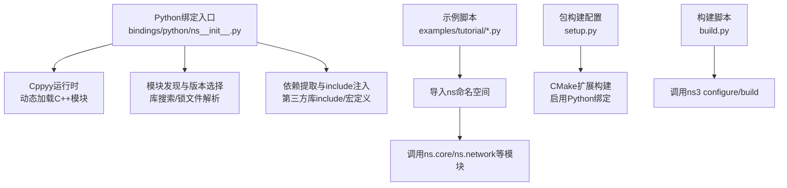
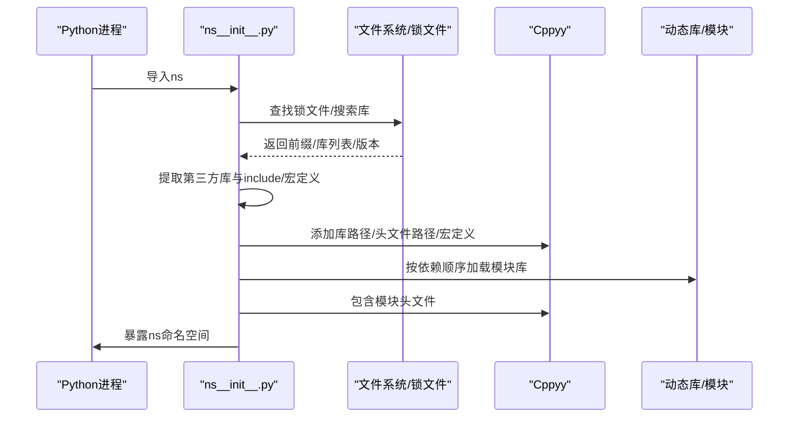
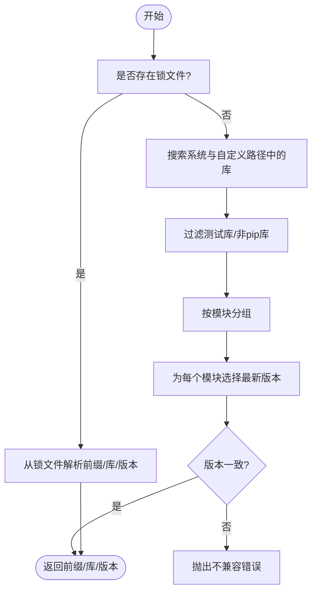
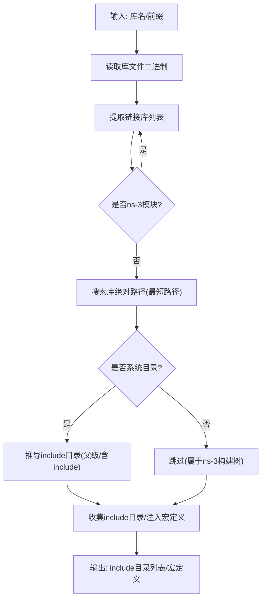
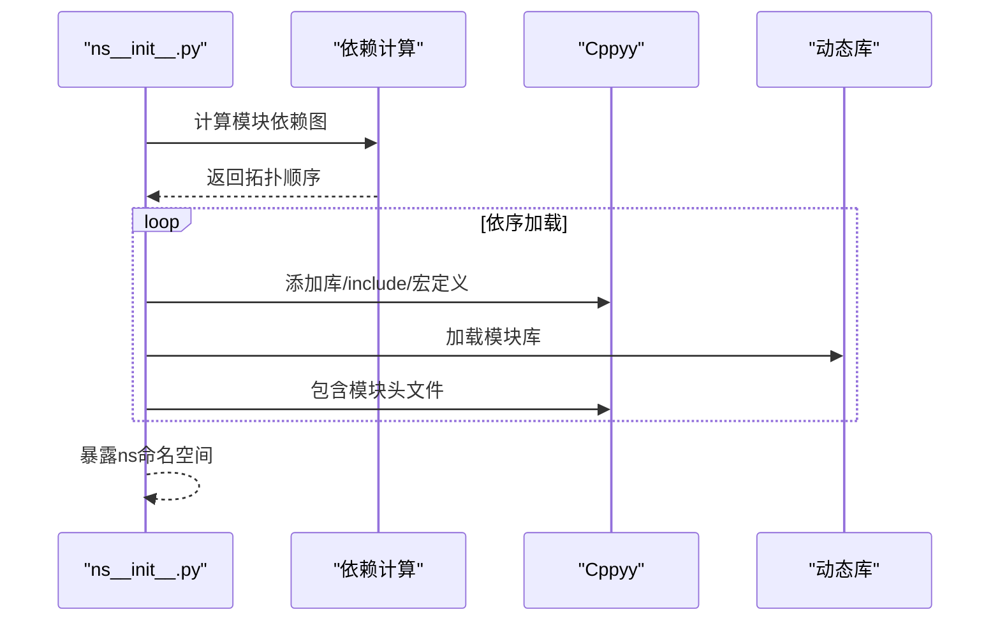
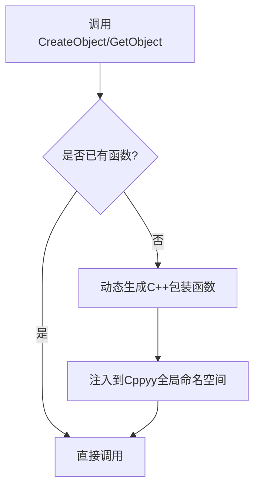
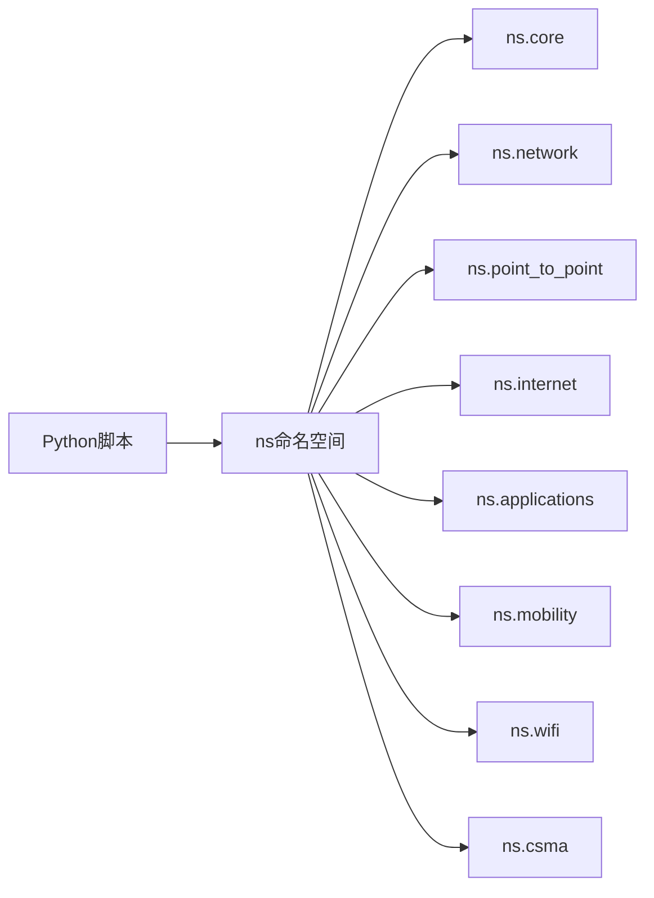

# Python绑定

<cite>
**本文引用的文件**
- [ns__init__.py](file://simulator/ns-3.39/bindings/python/ns__init__.py)
- [first.py](file://simulator/ns-3.39/examples/tutorial/first.py)
- [third.py](file://simulator/ns-3.39/examples/tutorial/third.py)
- [setup.py](file://simulator/ns-3.39/setup.py)
- [README.md](file://simulator/README.md)
- [build.py](file://simulator/build.py)
- [constants.py](file://simulator/constants.py)
- [util.py](file://simulator/util.py)
- [examples-to-run.py](file://simulator/ns-3.39/examples/tutorial/examples-to-run.py)
</cite>

## 目录
1. [简介](#简介)
2. [项目结构](#项目结构)
3. [核心组件](#核心组件)
4. [架构总览](#架构总览)
5. [详细组件分析](#详细组件分析)
6. [依赖关系分析](#依赖关系分析)
7. [性能考量](#性能考量)
8. [故障排查指南](#故障排查指南)
9. [结论](#结论)
10. [附录](#附录)

## 简介
本文件系统性阐述NS-3数据中心平台的Python绑定架构与使用方法，覆盖以下主题：
- Python绑定的整体设计：基于Cppyy桥接C++核心，动态加载模块库并注入Python命名空间。
- 类型映射与接口规范：对象指针、智能指针、时间比较运算符、对象获取与创建等。
- 基本与高级用法：节点容器、网络栈安装、地址分配、应用安装、仿真运行与销毁。
- 扩展开发：如何在Python中调用C++模块头文件、处理第三方库依赖、按依赖顺序加载模块。
- 自动化测试与脚本实践：示例脚本、命令行参数解析、日志与路由表填充。
- 与C++核心的交互机制与性能考虑：库搜索策略、依赖排序、include路径与宏定义注入。

## 项目结构
与Python绑定直接相关的核心目录与文件如下：
- 绑定入口与加载逻辑：bindings/python/ns__init__.py
- 示例脚本（Python）：examples/tutorial/*.py
- 包构建配置：setup.py
- 构建辅助脚本：build.py、constants.py、util.py
- 示例清单：examples/tutorial/examples-to-run.py
- 顶层说明：README.md

图表来源
- [ns__init__.py:373-597](file://simulator/ns-3.39/bindings/python/ns__init__.py#L373-L597)
- [first.py:16-65](file://simulator/ns-3.39/examples/tutorial/first.py#L16-L65)
- [third.py:19-151](file://simulator/ns-3.39/examples/tutorial/third.py#L19-L151)
- [setup.py:6-35](file://simulator/ns-3.39/setup.py#L6-L35)
- [build.py:48-58](file://simulator/ns-3.39/build.py#L48-L58)

章节来源
- [ns__init__.py:13-372](file://simulator/ns-3.39/bindings/python/ns__init__.py#L13-L372)
- [first.py:16-65](file://simulator/ns-3.39/examples/tutorial/first.py#L16-L65)
- [third.py:19-151](file://simulator/ns-3.39/examples/tutorial/third.py#L19-L151)
- [setup.py:6-35](file://simulator/ns-3.39/setup.py#L6-L35)
- [build.py:48-58](file://simulator/ns-3.39/build.py#L48-L58)
- [README.md:1-33](file://simulator/README.md#L1-L33)

## 核心组件
- 库搜索与定位
  - 通过环境变量、工作目录与绑定所在目录组合搜索动态库，过滤系统库目录，生成库名到路径列表的映射。
  - 支持从“锁文件”定位源码构建产物，或从已安装包中搜索库。
- 版本与模块解析
  - 解析库名中的版本号与模块名，确保同一模块仅保留最新版本，避免不兼容版本混杂。
- 依赖提取与include注入
  - 读取目标库的链接信息，识别第三方库，递归收集include目录与宏定义，注入Cppyy编译上下文。
- 模块加载与命名空间暴露
  - 按依赖拓扑顺序加载各模块库，包含对应模块头文件，最终将ns命名空间暴露给Python使用者。
- 运算符与工具函数增强
  - 注入时间比较运算符重载，提供安全的对象查找接口，统一对象创建与获取入口。

章节来源
- [ns__init__.py:57-124](file://simulator/ns-3.39/bindings/python/ns__init__.py#L57-L124)
- [ns__init__.py:225-268](file://simulator/ns-3.39/bindings/python/ns__init__.py#L225-L268)
- [ns__init__.py:290-371](file://simulator/ns-3.39/bindings/python/ns__init__.py#L290-L371)
- [ns__init__.py:384-472](file://simulator/ns-3.39/bindings/python/ns__init__.py#L384-L472)
- [ns__init__.py:482-561](file://simulator/ns-3.39/bindings/python/ns__init__.py#L482-L561)

## 架构总览
下图展示Python绑定从启动到可用的关键流程：库发现、依赖解析、include注入、模块加载与命名空间暴露。

图表来源
- [ns__init__.py:373-597](file://simulator/ns-3.39/bindings/python/ns__init__.py#L373-L597)

章节来源
- [ns__init__.py:373-597](file://simulator/ns-3.39/bindings/python/ns__init__.py#L373-L597)

## 详细组件分析

### 组件A：库发现与版本选择
- 功能要点
  - 优先从“锁文件”定位构建产物；否则在系统路径中搜索ns-3库。
  - 过滤测试库与不兼容版本，确保同一模块仅保留最新版本。
- 关键流程
  - 锁文件解析：读取构建配置，组装库名并校验存在性。
  - 搜索模式：合并PATH/LD_LIBRARY_PATH与当前目录，递归扫描动态库扩展名。
  - 版本筛选：对同模块多版本进行去重与最新版本判定，必要时抛出不兼容异常。

图表来源
- [ns__init__.py:13-32](file://simulator/ns-3.39/bindings/python/ns__init__.py#L13-L32)
- [ns__init__.py:313-371](file://simulator/ns-3.39/bindings/python/ns__init__.py#L313-L371)

章节来源
- [ns__init__.py:13-32](file://simulator/ns-3.39/bindings/python/ns__init__.py#L13-L32)
- [ns__init__.py:313-371](file://simulator/ns-3.39/bindings/python/ns__init__.py#L313-L371)

### 组件B：依赖提取与include注入
- 功能要点
  - 读取目标库的链接信息，识别第三方库，递归向上收集include目录。
  - 注入宏定义（如GSL、libxml2、SQLite3、OpenFlow、CLICK），用于条件编译。
- 关键流程
  - 链接库提取：二进制扫描匹配库名，解析为绝对路径集合。
  - include目录推导：优先系统include目录，其次回溯父级路径，补充“include”子目录。
  - 宏定义注入：根据第三方库设置相应宏，保证头文件条件编译正确。

图表来源
- [ns__init__.py:148-222](file://simulator/ns-3.39/bindings/python/ns__init__.py#L148-L222)

章节来源
- [ns__init__.py:148-222](file://simulator/ns-3.39/bindings/python/ns__init__.py#L148-L222)

### 组件C：模块加载与命名空间暴露
- 功能要点
  - 按依赖拓扑顺序加载模块库，确保先加载被依赖模块。
  - 将模块头文件纳入编译上下文，随后加载库，最终暴露ns命名空间。
  - 兼容旧版pybindgen风格：为每个模块名附加别名属性。
- 关键流程
  - 依赖排序：统计每个模块的ns-3依赖，采用拓扑层序遍历。
  - include与宏：逐个模块注入include路径与宏定义。
  - 加载与暴露：包含头文件后加载库，并将cppyy实例暴露到ns命名空间。

图表来源
- [ns__init__.py:384-472](file://simulator/ns-3.39/bindings/python/ns__init__.py#L384-L472)

章节来源
- [ns__init__.py:384-472](file://simulator/ns-3.39/bindings/python/ns__init__.py#L384-L472)

### 组件D：运算符与工具函数增强
- 时间比较运算符：通过内联C++注入，将Python侧的比较映射到C++的Time类比较。
- 对象创建与获取：统一CreateObject/Create与模板GetObject接口，支持按类型或字符串获取聚合对象。
- 节点生命周期：拦截Node析构，延迟删除以避免仿真结束前对象提前释放。

图表来源
- [ns__init__.py:522-591](file://simulator/ns-3.39/bindings/python/ns__init__.py#L522-L591)

章节来源
- [ns__init__.py:482-561](file://simulator/ns-3.39/bindings/python/ns__init__.py#L482-L561)
- [ns__init__.py:522-591](file://simulator/ns-3.39/bindings/python/ns__init__.py#L522-L591)

### 组件E：Python API使用示例与最佳实践
- 基本操作
  - 启用日志、创建节点容器、安装点对点设备与Internet栈、分配IPv4地址、安装UDP回显客户端/服务器应用、控制启动与停止时间、运行仿真并销毁。
- 高级功能
  - 命令行参数解析、网格位置分配器、随机游走与固定位置模型、PCAP抓包与DLT类型设置、全局路由表填充。
- 最佳实践
  - 使用Seconds/TimeValue等类型封装时间与数值，避免裸字符串导致的类型不匹配。
  - 在安装应用前完成所有设备与地址分配，确保路由表正确建立。
  - 使用Stop控制仿真终止时间，避免资源泄漏。

章节来源
- [first.py:25-65](file://simulator/ns-3.39/examples/tutorial/first.py#L25-L65)
- [third.py:39-151](file://simulator/ns-3.39/examples/tutorial/third.py#L39-L151)

## 依赖关系分析
- 外部依赖
  - Cppyy：绑定核心，负责动态加载C++库与头文件、注入宏定义与运算符。
  - 第三方库：GSL、libxml2、SQLite3、OpenFlow、CLICK等，通过宏定义与include路径注入。
- 内部耦合
  - ns__init__.py内部模块化清晰：库搜索、版本解析、依赖提取、模块加载、增强函数分别实现，降低耦合度。
- 可能的循环依赖
  - 通过拓扑排序避免模块间循环加载；第三方库include路径独立于模块加载顺序。

图表来源
- [first.py:16-65](file://simulator/ns-3.39/examples/tutorial/first.py#L16-L65)
- [third.py:19-151](file://simulator/ns-3.39/examples/tutorial/third.py#L19-L151)

章节来源
- [first.py:16-65](file://simulator/ns-3.39/examples/tutorial/first.py#L16-L65)
- [third.py:19-151](file://simulator/ns-3.39/examples/tutorial/third.py#L19-L151)

## 性能考量
- 库搜索与缓存
  - 使用LRU缓存缓存库搜索结果，减少重复扫描。
- 依赖排序
  - 采用拓扑层序遍历，避免不必要的重复加载与错误依赖。
- include路径与宏定义
  - 仅注入必要的第三方include路径与宏，减少编译开销。
- 运行时优化
  - 使用Seconds/TimeValue等类型封装，减少字符串解析成本。
  - 控制日志级别，避免过多日志输出影响性能。

章节来源
- [ns__init__.py:57-124](file://simulator/ns-3.39/bindings/python/ns__init__.py#L57-L124)
- [ns__init__.py:384-472](file://simulator/ns-3.39/bindings/python/ns__init__.py#L384-L472)

## 故障排查指南
- 缺少Cppyy
  - 现象：导入ns时报错提示缺少Cppyy。
  - 处理：安装Cppyy并重试。
- 未找到ns-3库
  - 现象：库搜索失败或提示未找到ns-3库。
  - 处理：确认构建产物存在、锁文件有效、库路径在LD_LIBRARY_PATH中。
- 不兼容版本
  - 现象：同一模块存在多个版本或不同版本混杂。
  - 处理：清理旧版本库，确保仅保留最新版本。
- 第三方库缺失
  - 现象：包含头文件时报错，提示找不到第三方库。
  - 处理：安装对应第三方库并确保其include目录可被发现。
- 节点提前释放
  - 现象：仿真中途出现节点对象失效。
  - 处理：避免在仿真运行期间手动删除节点；使用默认析构策略。

章节来源
- [ns__init__.py:432-438](file://simulator/ns-3.39/bindings/python/ns__init__.py#L432-L438)
- [ns__init__.py:313-371](file://simulator/ns-3.39/bindings/python/ns__init__.py#L313-L371)
- [ns__init__.py:182-187](file://simulator/ns-3.39/bindings/python/ns__init__.py#L182-L187)
- [ns__init__.py:505-510](file://simulator/ns-3.39/bindings/python/ns__init__.py#L505-L510)

## 结论
NS-3的Python绑定通过Cppyy实现了对C++核心的高效桥接，具备完善的库发现、版本选择、依赖解析与模块加载能力。借助统一的命名空间与增强的工具函数，用户可以以Python方式快速搭建网络仿真场景并进行数据分析。建议在生产环境中遵循本文的最佳实践，合理配置第三方依赖与include路径，以获得稳定且高性能的仿真体验。

## 附录
- 包构建配置要点
  - 启用Python绑定、指定Python组件路径、开启PIP打包与lib64目录支持。
- 构建与运行
  - 使用build.py协调ns3 configure与build，确保示例与测试可选构建。
- 示例清单
  - examples-to-run.py列出需持续验证的C++与Python示例，便于回归测试。

章节来源
- [setup.py:6-35](file://simulator/ns-3.39/setup.py#L6-L35)
- [build.py:48-58](file://simulator/ns-3.39/build.py#L48-L58)
- [examples-to-run.py:9-29](file://simulator/ns-3.39/examples/tutorial/examples-to-run.py#L9-L29)
- [README.md:10-32](file://simulator/README.md#L10-L32)