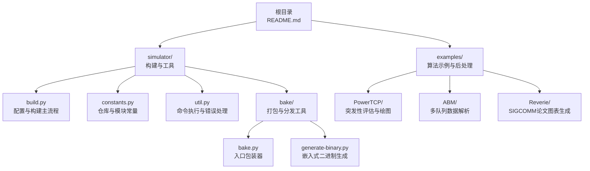
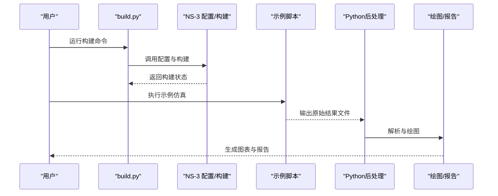
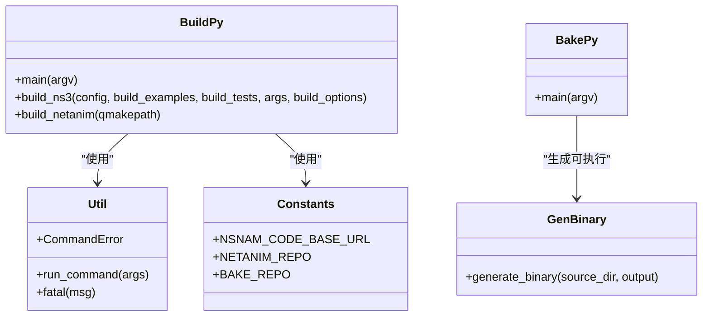
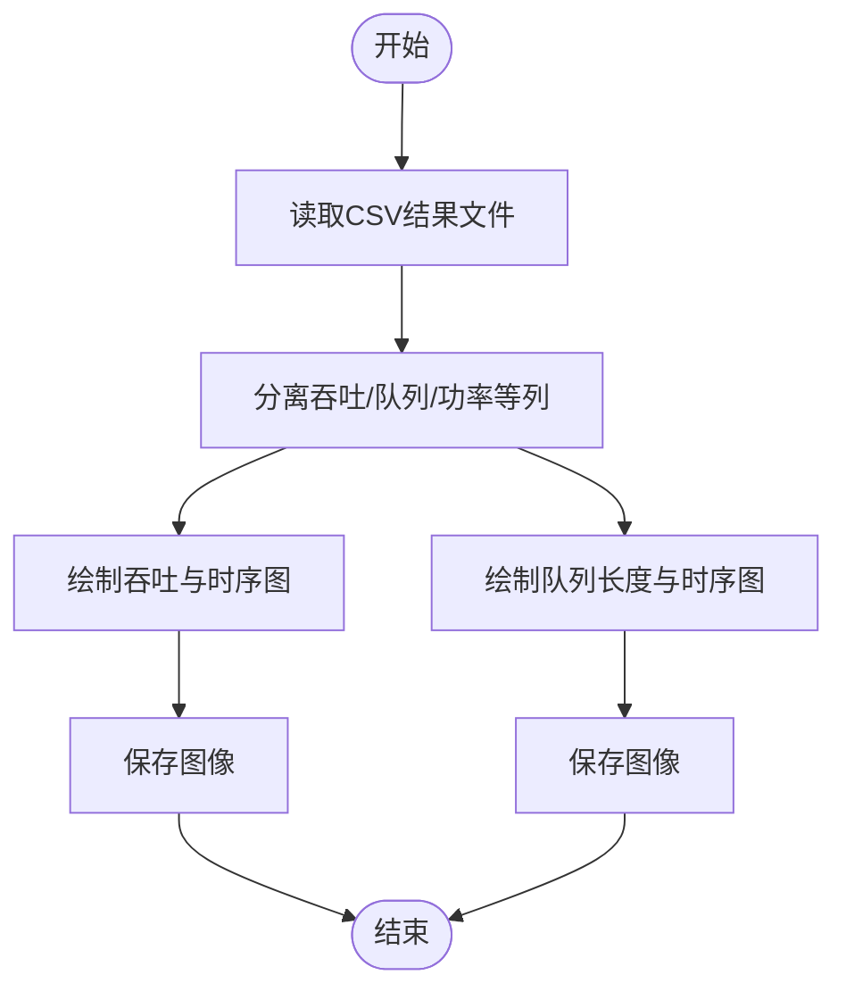
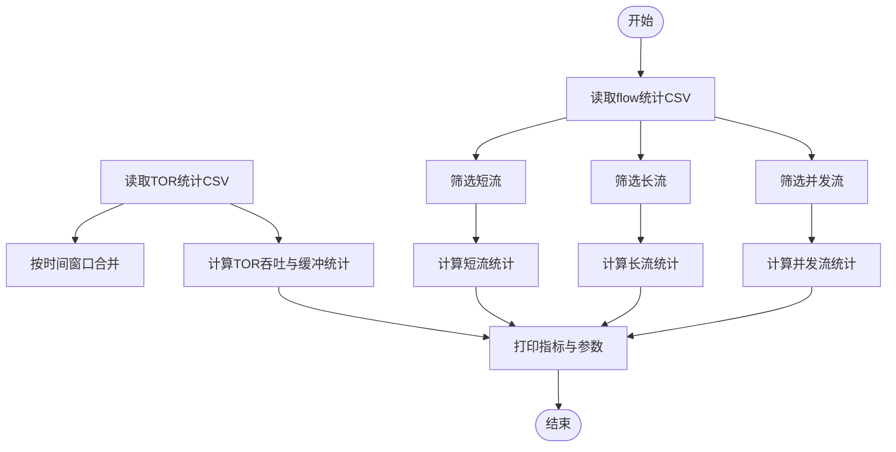
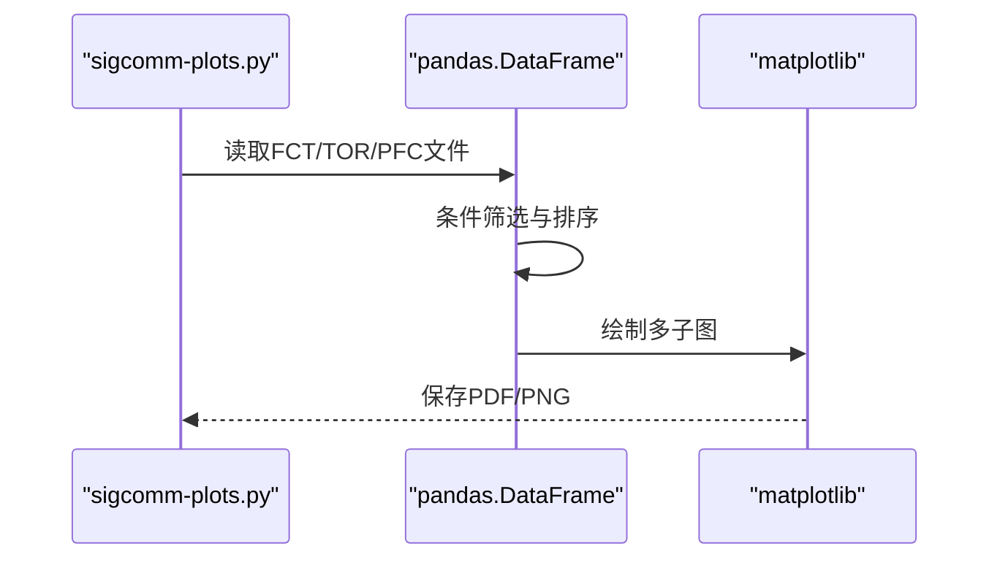
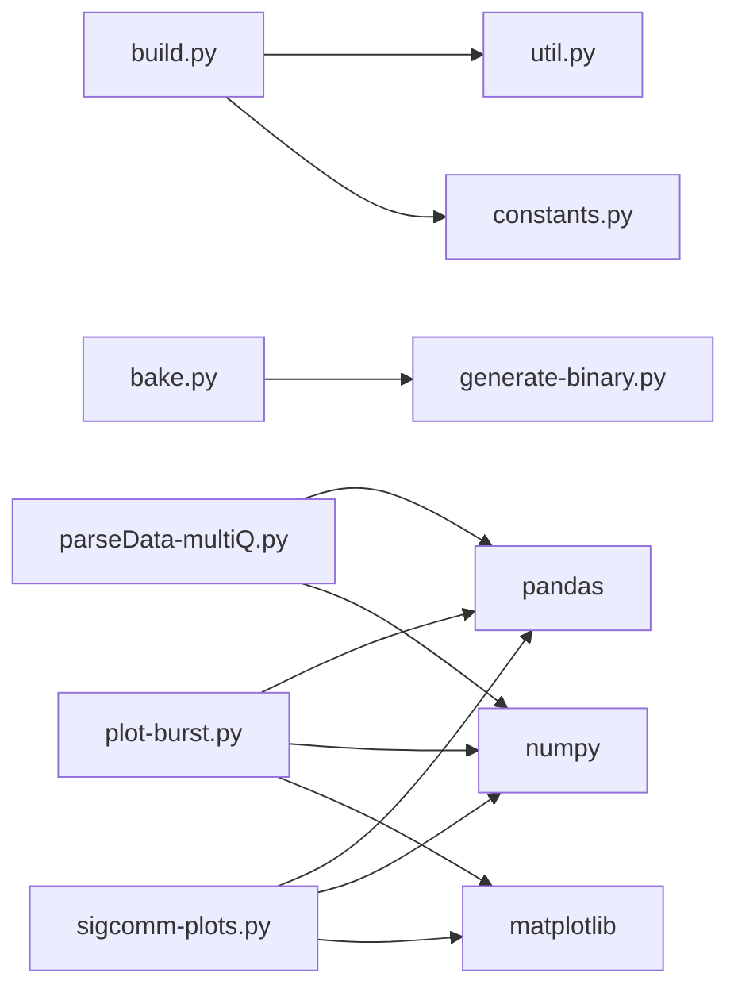

# Python脚本开发

<cite>
**本文引用的文件**
- [README.md](file://README.md)
- [build.py](file://simulator/build.py)
- [constants.py](file://simulator/constants.py)
- [util.py](file://simulator/util.py)
- [bake.py](file://simulator/bake/bake.py)
- [generate-binary.py](file://simulator/bake/generate-binary.py)
- [plot-burst.py](file://simulator/ns-3.39/examples/PowerTCP/plot-burst.py)
- [sigcomm-plots.py](file://simulator/ns-3.39/examples/Reverie/sigcomm-plots.py)
- [parseData-multiQ.py](file://simulator/ns-3.39/examples/ABM/parseData-multiQ.py)
</cite>

## 目录
1. [简介](#简介)
2. [项目结构](#项目结构)
3. [核心组件](#核心组件)
4. [架构总览](#架构总览)
5. [详细组件分析](#详细组件分析)
6. [依赖关系分析](#依赖关系分析)
7. [性能考虑](#性能考虑)
8. [故障排查指南](#故障排查指南)
9. [结论](#结论)
10. [附录](#附录)

## 简介
本指南面向使用NS-3进行网络仿真研究的开发者，系统讲解如何用Python编写高质量的仿真脚本，覆盖拓扑构建、参数扫描、结果收集与分析、可视化与报告生成等全流程。文档以仓库中的真实脚本为依据，结合构建与工具链（如bake、NetAnim）的实际实现，给出可操作的最佳实践与优化建议。

## 项目结构
该仓库围绕NS-3扩展了数据中心场景下的拥塞控制与缓冲管理算法，并配套了大量Python脚本用于运行仿真、解析结果与绘制图表。顶层README提供了构建与运行说明；simulator目录下包含构建脚本、常量定义与工具函数；examples目录中包含各算法的示例与后处理脚本。

**图示来源**
- [README.md:1-241](file://README.md#L1-L241)
- [build.py:1-148](file://simulator/build.py#L1-L148)
- [constants.py:1-12](file://simulator/constants.py#L1-L12)
- [util.py:1-26](file://simulator/util.py#L1-L26)
- [bake.py:1-57](file://simulator/bake/bake.py#L1-L57)
- [generate-binary.py:1-110](file://simulator/bake/generate-binary.py#L1-L110)

**章节来源**
- [README.md:66-110](file://README.md#L66-L110)
- [build.py:48-148](file://simulator/build.py#L48-L148)

## 核心组件
- 构建与工具链
  - build.py：统一调用NS-3的配置与构建流程，支持启用示例与测试、传递构建选项、以及可选地构建NetAnim。
  - util.py：提供run_command与fatal等通用工具，封装子进程执行与错误处理。
  - constants.py：集中定义仓库地址、NetAnim与bake相关路径常量。
  - bake：提供打包与生成可执行二进制的能力，便于在不同环境复现脚本运行。
- 示例与后处理
  - PowerTCP：包含突发性评估的绘图脚本，演示时序数据的读取、多轴绘图与保存。
  - ABM：包含多队列场景的数据解析脚本，演示统计指标计算与CSV输出。
  - Reverie：包含大规模参数扫描的图表生成脚本，演示多维度数据聚合与可视化。

**章节来源**
- [build.py:48-148](file://simulator/build.py#L48-L148)
- [util.py:12-26](file://simulator/util.py#L12-L26)
- [constants.py:1-12](file://simulator/constants.py#L1-L12)
- [bake.py:26-57](file://simulator/bake/bake.py#L26-L57)
- [generate-binary.py:54-94](file://simulator/bake/generate-binary.py#L54-L94)
- [plot-burst.py:1-115](file://simulator/ns-3.39/examples/PowerTCP/plot-burst.py#L1-L115)
- [parseData-multiQ.py:1-102](file://simulator/ns-3.39/examples/ABM/parseData-multiQ.py#L1-L102)
- [sigcomm-plots.py:1-800](file://simulator/ns-3.39/examples/Reverie/sigcomm-plots.py#L1-L800)

## 架构总览
下图展示了从用户命令到仿真执行与结果可视化的整体流程，以及工具链与示例脚本之间的关系。

**图示来源**
- [build.py:48-148](file://simulator/build.py#L48-L148)
- [plot-burst.py:1-115](file://simulator/ns-3.39/examples/PowerTCP/plot-burst.py#L1-L115)
- [parseData-multiQ.py:1-102](file://simulator/ns-3.39/examples/ABM/parseData-multiQ.py#L1-L102)
- [sigcomm-plots.py:1-800](file://simulator/ns-3.39/examples/Reverie/sigcomm-plots.py#L1-L800)

## 详细组件分析

### 组件A：构建与工具链（build.py、util.py、constants.py、bake）
- 功能职责
  - build.py：解析命令行参数，定位NS-3源码目录，按需构建示例与测试，并可选择跳过或自定义qmake路径以构建NetAnim。
  - util.py：封装命令执行与异常处理，统一输出命令行日志，便于调试。
  - constants.py：集中管理仓库URL与模块名称，降低硬编码风险。
  - bake：通过generate-binary将源码打包为可执行二进制，便于跨平台复用。
- 设计要点
  - 模块化：将“命令执行”“常量定义”“入口包装”拆分为独立模块，提升可维护性。
  - 可配置：支持传入选项与qmake路径，适配不同系统环境。
  - 错误处理：统一抛出CommandError并由上层捕获，避免静默失败。
- 复杂度与性能
  - 命令执行为O(1)开销，主要瓶颈在NS-3编译时间；可通过并行构建与缓存策略优化。
- 依赖关系
  - build.py依赖util与constants；bake依赖generate-binary生成可执行体。

**图示来源**
- [build.py:48-148](file://simulator/build.py#L48-L148)
- [util.py:12-26](file://simulator/util.py#L12-L26)
- [constants.py:1-12](file://simulator/constants.py#L1-L12)
- [bake.py:26-57](file://simulator/bake/bake.py#L26-L57)
- [generate-binary.py:54-94](file://simulator/bake/generate-binary.py#L54-L94)

**章节来源**
- [build.py:48-148](file://simulator/build.py#L48-L148)
- [util.py:12-26](file://simulator/util.py#L12-L26)
- [constants.py:1-12](file://simulator/constants.py#L1-L12)
- [bake.py:26-57](file://simulator/bake/bake.py#L26-L57)
- [generate-binary.py:54-94](file://simulator/bake/generate-binary.py#L54-L94)

### 组件B：PowerTCP绘图脚本（plot-burst.py）
- 功能职责
  - 读取PowerTCP仿真输出的时序数据，绘制吞吐、队列长度与功耗随时间变化的双轴图，并保存为PDF/PNG。
- 数据流
  - 输入：results_burst目录下的result-*.burst文件。
  - 处理：pandas读取列数据，matplotlib绘制两条y轴曲线。
  - 输出：按算法分类保存图像文件。
- 复杂度与性能
  - I/O与绘图为主，适合批处理；可通过并行读取与批量保存优化。
- 最佳实践
  - 使用with上下文管理文件；统一设置字体大小与网格样式；按算法循环生成子图。

**图示来源**
- [plot-burst.py:40-115](file://simulator/ns-3.39/examples/PowerTCP/plot-burst.py#L40-L115)

**章节来源**
- [plot-burst.py:1-115](file://simulator/ns-3.39/examples/PowerTCP/plot-burst.py#L1-L115)

### 组件C：ABM多队列数据解析（parseData-multiQ.py）
- 功能职责
  - 读取flow与TOR统计文件，按短/长/并发等条件分组，计算多种统计指标（均值、中位数、95/99/99.9分位），并将结果打印为一行数值序列。
- 数据流
  - 输入：flow与tor统计CSV文件，以及实验参数（带宽、RTT、负载、突发等）。
  - 处理：pandas过滤与排序，numpy计算统计量。
  - 输出：标准输出打印统计指标与参数。
- 复杂度与性能
  - O(n log n)主要来自排序；对大文件可考虑分块读取与内存映射。
- 最佳实践
  - 明确列名与索引，避免硬编码；对缺失或空数据做边界检查。

**图示来源**
- [parseData-multiQ.py:42-102](file://simulator/ns-3.39/examples/ABM/parseData-multiQ.py#L42-L102)

**章节来源**
- [parseData-multiQ.py:1-102](file://simulator/ns-3.39/examples/ABM/parseData-multiQ.py#L1-L102)

### 组件D：Reverie大规模参数扫描绘图（sigcomm-plots.py）
- 功能职责
  - 针对RDMA/TCP混合场景，读取多组评估文件（FCT、TOR、OUT、PFC），按算法与参数组合计算统计量并生成多类图表。
- 数据流
  - 输入：dump目录下按命名规则生成的.fct/.tor/.out/.pfc文件。
  - 处理：pandas按条件筛选与聚合，matplotlib绘制折线图与标注。
  - 输出：按类别保存PDF/PNG。
- 复杂度与性能
  - 多文件I/O与多次筛选，建议缓存中间DataFrame；对重复参数组合可预计算。
- 最佳实践
  - 使用字典映射算法编号与名称；统一网格与刻度设置；分图保存避免重叠。

**图示来源**
- [sigcomm-plots.py:100-270](file://simulator/ns-3.39/examples/Reverie/sigcomm-plots.py#L100-L270)

**章节来源**
- [sigcomm-plots.py:1-800](file://simulator/ns-3.39/examples/Reverie/sigcomm-plots.py#L1-L800)

## 依赖关系分析
- 内部依赖
  - build.py依赖util.py提供的run_command与fatal，以及constants.py中的仓库常量。
  - bake.py依赖generate-binary.py生成可执行二进制。
- 外部依赖
  - 示例脚本依赖pandas、numpy、matplotlib等第三方库进行数据处理与可视化。
- 循环依赖
  - 当前模块间无循环导入，结构清晰。

**图示来源**
- [build.py:8-148](file://simulator/build.py#L8-L148)
- [util.py:12-26](file://simulator/util.py#L12-L26)
- [constants.py:1-12](file://simulator/constants.py#L1-L12)
- [bake.py:26-57](file://simulator/bake/bake.py#L26-L57)
- [generate-binary.py:54-94](file://simulator/bake/generate-binary.py#L54-L94)
- [plot-burst.py:8-16](file://simulator/ns-3.39/examples/PowerTCP/plot-burst.py#L8-L16)
- [parseData-multiQ.py:1-5](file://simulator/ns-3.39/examples/ABM/parseData-multiQ.py#L1-L5)
- [sigcomm-plots.py:9-18](file://simulator/ns-3.39/examples/Reverie/sigcomm-plots.py#L9-L18)

**章节来源**
- [build.py:8-148](file://simulator/build.py#L8-L148)
- [util.py:12-26](file://simulator/util.py#L12-L26)
- [constants.py:1-12](file://simulator/constants.py#L1-L12)
- [bake.py:26-57](file://simulator/bake/bake.py#L26-L57)
- [generate-binary.py:54-94](file://simulator/bake/generate-binary.py#L54-L94)
- [plot-burst.py:8-16](file://simulator/ns-3.39/examples/PowerTCP/plot-burst.py#L8-L16)
- [parseData-multiQ.py:1-5](file://simulator/ns-3.39/examples/ABM/parseData-multiQ.py#L1-L5)
- [sigcomm-plots.py:9-18](file://simulator/ns-3.39/examples/Reverie/sigcomm-plots.py#L9-L18)

## 性能考虑
- 并行化
  - 将多个仿真任务拆分为独立进程并行执行，利用CPU多核加速。
- I/O优化
  - 对大文件采用分块读取与延迟加载；减少重复打开/关闭文件。
- 缓存与增量
  - 对重复的统计计算结果进行缓存；仅对新增数据集进行增量处理。
- 可视化批处理
  - 合理设置图像分辨率与格式，避免过度渲染；批量保存时使用矢量格式（PDF）保留质量。
- 构建优化
  - 使用构建选项与并行编译；缓存中间产物，缩短二次构建时间。

## 故障排查指南
- 构建失败
  - 检查是否正确配置NS-3与依赖；确认qmake路径；查看build.py输出的错误提示。
- 命令执行异常
  - 利用util.py的run_command与fatal统一捕获与输出；根据返回码定位问题。
- 数据解析错误
  - 确认输入文件路径与列名一致；对缺失值与异常值进行边界检查；必要时增加日志输出。
- 可视化问题
  - 检查matplotlib后端与字体配置；确保保存路径存在且有写权限。

**章节来源**
- [build.py:12-47](file://simulator/build.py#L12-L47)
- [util.py:5-26](file://simulator/util.py#L5-L26)
- [plot-burst.py:18-24](file://simulator/ns-3.39/examples/PowerTCP/plot-burst.py#L18-L24)
- [parseData-multiQ.py:42-102](file://simulator/ns-3.39/examples/ABM/parseData-multiQ.py#L42-L102)
- [sigcomm-plots.py:20-23](file://simulator/ns-3.39/examples/Reverie/sigcomm-plots.py#L20-L23)

## 结论
本指南基于仓库中的真实脚本，总结了NS-3 Python脚本开发的关键流程与最佳实践。通过模块化设计、清晰的错误处理、合理的数据处理与可视化策略，开发者可以高效完成从拓扑构建、参数扫描到结果分析与报告生成的完整工作流。建议在实际项目中遵循本文的组织方式与优化策略，持续迭代与完善自动化流水线。

## 附录
- 快速开始
  - 在根目录执行构建与示例运行说明见README。
  - 使用build.py进行配置与构建，按需启用示例与测试。
- 常用命令参考
  - 构建：python3 simulator/build.py --enable-examples --enable-tests
  - 自定义qmake：python3 simulator/build.py --qmake-path /usr/bin/qmake-qt5
- 示例脚本清单
  - PowerTCP绘图：simulator/ns-3.39/examples/PowerTCP/plot-burst.py
  - ABM解析：simulator/ns-3.39/examples/ABM/parseData-multiQ.py
  - Reverie绘图：simulator/ns-3.39/examples/Reverie/sigcomm-plots.py

**章节来源**
- [README.md:66-110](file://README.md#L66-L110)
- [build.py:61-78](file://simulator/build.py#L61-L78)