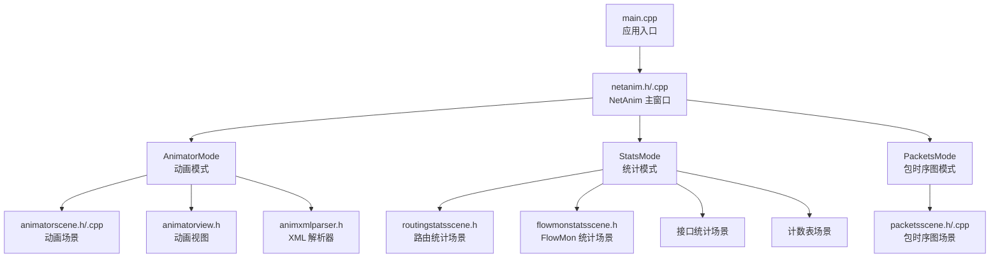
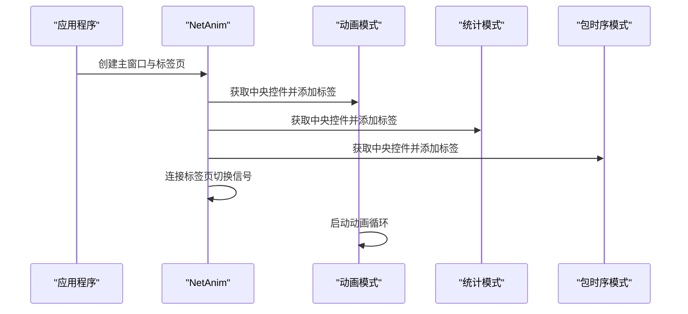
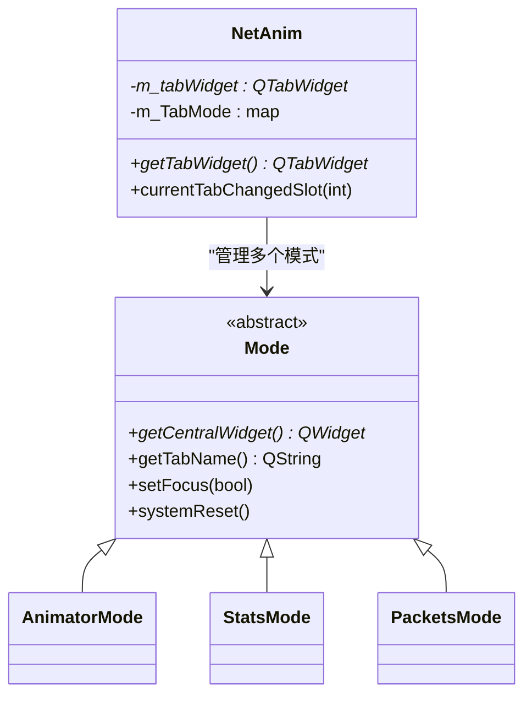
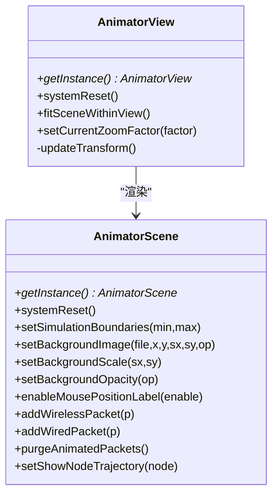
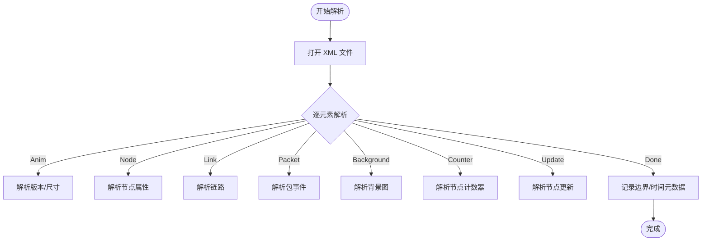
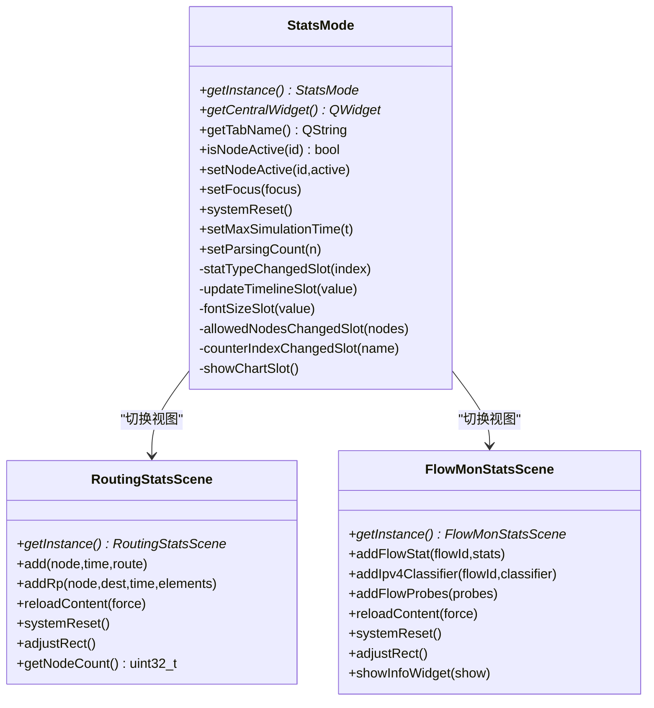
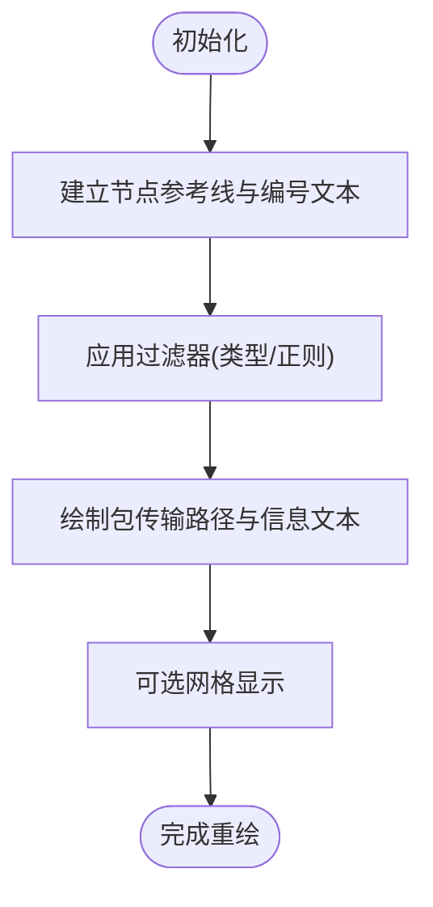
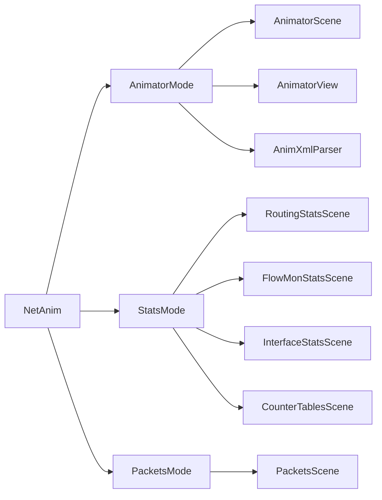

# 可视化工具

<cite>
**本文引用的文件**   
- [main.cpp](file://simulator/netanim-3.109/main.cpp)
- [netanim.h](file://simulator/netanim-3.109/netanim.h)
- [netanim.cpp](file://simulator/netanim-3.109/netanim.cpp)
- [animatorscene.h](file://simulator/netanim-3.109/animatorscene.h)
- [animatorscene.cpp](file://simulator/netanim-3.109/animatorscene.cpp)
- [animatorview.h](file://simulator/netanim-3.109/animatorview.h)
- [animxmlparser.h](file://simulator/netanim-3.109/animxmlparser.h)
- [packetsscene.h](file://simulator/netanim-3.109/packetsscene.h)
- [packetsscene.cpp](file://simulator/netanim-3.109/packetsscene.cpp)
- [statsmode.h](file://simulator/netanim-3.109/statsmode.h)
- [statsmode.cpp](file://simulator/netanim-3.109/statsmode.cpp)
- [flowmonstatsscene.h](file://simulator/netanim-3.109/flowmonstatsscene.h)
- [routingstatsscene.h](file://simulator/netanim-3.109/routingstatsscene.h)
</cite>

## 目录
1. [简介](#简介)
2. [项目结构](#项目结构)
3. [核心组件](#核心组件)
4. [架构总览](#架构总览)
5. [详细组件分析](#详细组件分析)
6. [依赖关系分析](#依赖关系分析)
7. [性能考虑](#性能考虑)
8. [故障排查指南](#故障排查指南)
9. [结论](#结论)
10. [附录](#附录)

## 简介
本文件为 NS-3 数据中心平台可视化工具的详细技术文档，聚焦于 NetAnim 图形化动画系统与统计分析模块。内容涵盖界面功能、动画控制、自定义配置、输出格式、数据可视化（统计图表、性能分析、结果导出与报告生成）、渲染参数与显示效果调节、实际案例演示与最佳实践建议。目标是帮助用户以直观方式呈现仿真结果，快速理解网络拓扑、节点行为、链路状态与流量统计。

## 项目结构
NetAnim 作为独立的 Qt 应用程序，通过主入口启动，组织三大核心模式：动画模式（拓扑与包流动画）、统计模式（路由、接口、FlowMon、计数表等统计信息）、包时序图模式（按时间轴展示包传输）。各模式由对应的场景类负责渲染与交互，解析器负责读取与解析 NS-3 输出的 XML 动画/统计跟踪文件。

**图表来源**
- [main.cpp:24-46](file://simulator/netanim-3.109/main.cpp#L24-L46)
- [netanim.h:28-42](file://simulator/netanim-3.109/netanim.h#L28-L42)
- [netanim.cpp:29-56](file://simulator/netanim-3.109/netanim.cpp#L29-L56)
- [animatorscene.h:72-167](file://simulator/netanim-3.109/animatorscene.h#L72-L167)
- [animatorview.h:29-56](file://simulator/netanim-3.109/animatorview.h#L29-L56)
- [animxmlparser.h:156-220](file://simulator/netanim-3.109/animxmlparser.h#L156-L220)
- [statsmode.h:42-177](file://simulator/netanim-3.109/statsmode.h#L42-L177)
- [routingstatsscene.h:51-82](file://simulator/netanim-3.109/routingstatsscene.h#L51-L82)
- [flowmonstatsscene.h:28-64](file://simulator/netanim-3.109/flowmonstatsscene.h#L28-L64)
- [packetsscene.h:29-75](file://simulator/netanim-3.109/packetsscene.h#L29-L75)

**章节来源**
- [main.cpp:24-46](file://simulator/netanim-3.109/main.cpp#L24-L46)
- [netanim.h:28-42](file://simulator/netanim-3.109/netanim.h#L28-L42)
- [netanim.cpp:29-56](file://simulator/netanim-3.109/netanim.cpp#L29-L56)

## 核心组件
- NetAnim 主窗口：管理三个标签页（动画、统计、包时序），负责焦点切换与最大化显示。
- AnimatorScene/AnimatorView：负责绘制拓扑节点、链路、无线/有线包轨迹、网格、背景图、鼠标位置提示等；支持缩放、适配视图、重置等操作。
- AnimXmlParser：解析 NS-3 输出的动画 XML 文件，提取节点、链路、包事件、资源、背景图、节点计数器等信息，并维护最大仿真时间、边界点等元数据。
- StatsMode：提供路由、接口、FlowMon、计数表四种统计视图，支持时间轴滑条、字体大小、节点过滤、解析进度与弹窗提示。
- PacketsScene：按时间轴绘制包传输路径，支持过滤器（类型/正则）与网格显示。
- 统计场景：RoutingStatsScene、FlowMonStatsScene 等，负责将解析后的统计数据映射到图形代理控件中进行展示。

**章节来源**
- [netanim.h:28-42](file://simulator/netanim-3.109/netanim.h#L28-L42)
- [netanim.cpp:29-56](file://simulator/netanim-3.109/netanim.cpp#L29-L56)
- [animatorscene.h:72-167](file://simulator/netanim-3.109/animatorscene.h#L72-L167)
- [animatorview.h:29-56](file://simulator/netanim-3.109/animatorview.h#L29-L56)
- [animxmlparser.h:156-220](file://simulator/netanim-3.109/animxmlparser.h#L156-L220)
- [statsmode.h:42-177](file://simulator/netanim-3.109/statsmode.h#L42-L177)
- [packetsscene.h:29-75](file://simulator/netanim-3.109/packetsscene.h#L29-L75)

## 架构总览
下图展示了从应用启动到各模式加载与渲染的关键流程：

**图表来源**
- [main.cpp:42-46](file://simulator/netanim-3.109/main.cpp#L42-L46)
- [netanim.cpp:33-55](file://simulator/netanim-3.109/netanim.cpp#L33-L55)

## 详细组件分析

### NetAnim 主窗口与标签页管理
- 负责创建 QTabWidget 并添加动画、统计、包时序三个模式的中央控件。
- 监听当前标签页变化，调用对应模式的 setFocus(true/false) 切换焦点。
- 默认最大化显示并启动动画模式。

**图表来源**
- [netanim.h:28-42](file://simulator/netanim-3.109/netanim.h#L28-L42)
- [netanim.cpp:29-80](file://simulator/netanim-3.109/netanim.cpp#L29-L80)
- [statsmode.h:42-62](file://simulator/netanim-3.109/statsmode.h#L42-L62)

**章节来源**
- [netanim.h:28-42](file://simulator/netanim-3.109/netanim.h#L28-L42)
- [netanim.cpp:29-80](file://simulator/netanim-3.109/netanim.cpp#L29-L80)

### 动画场景 AnimatorScene 与视图 AnimatorView
- AnimatorScene 提供单例访问、网格绘制、背景图设置、鼠标位置标签、节点轨迹、包轨迹清理与显示、场景边界设定等功能。
- AnimatorView 支持缩放、滚轮事件、适配视图、系统重置等。

**图表来源**
- [animatorscene.h:72-167](file://simulator/netanim-3.109/animatorscene.h#L72-L167)
- [animatorview.h:29-56](file://simulator/netanim-3.109/animatorview.h#L29-L56)

**章节来源**
- [animatorscene.h:72-167](file://simulator/netanim-3.109/animatorscene.h#L72-L167)
- [animatorscene.cpp:34-110](file://simulator/netanim-3.109/animatorscene.cpp#L34-L110)
- [animatorview.h:29-56](file://simulator/netanim-3.109/animatorview.h#L29-L56)

### XML 解析器 AnimXmlParser
- 支持解析版本、拓扑尺寸、节点（含坐标、颜色、可见性、电池容量等）、链路、包接收事件、背景图、节点计数器、资源、节点更新（位置/颜色/描述/尺寸/图片/系统ID）等。
- 提供解析进度查询、最大仿真时间、首包/千包/末包时间、节点坐标边界等元数据。

**图表来源**
- [animxmlparser.h:53-153](file://simulator/netanim-3.109/animxmlparser.h#L53-L153)
- [animxmlparser.h:156-220](file://simulator/netanim-3.109/animxmlparser.h#L156-L220)

**章节来源**
- [animxmlparser.h:156-220](file://simulator/netanim-3.109/animxmlparser.h#L156-L220)

### 统计模式 StatsMode 与统计场景
- StatsMode 提供四种统计视图：IP-MAC、Routing、FlowMon、Counter Tables。
- 提供节点选择（全选/反选）、时间轴滑条、字体大小、允许节点编辑框、FlowMon 文件按钮、计数表下拉框、解析进度与弹窗提示。
- 统计场景（如 RoutingStatsScene、FlowMonStatsScene）将解析数据映射为代理控件，支持重载内容、对齐布局、清空代理映射等。

**图表来源**
- [statsmode.h:42-177](file://simulator/netanim-3.109/statsmode.h#L42-L177)
- [routingstatsscene.h:51-82](file://simulator/netanim-3.109/routingstatsscene.h#L51-L82)
- [flowmonstatsscene.h:28-64](file://simulator/netanim-3.109/flowmonstatsscene.h#L28-L64)

**章节来源**
- [statsmode.h:42-177](file://simulator/netanim-3.109/statsmode.h#L42-L177)
- [statsmode.cpp:54-107](file://simulator/netanim-3.109/statsmode.cpp#L54-L107)
- [routingstatsscene.h:51-82](file://simulator/netanim-3.109/routingstatsscene.h#L51-L82)
- [flowmonstatsscene.h:28-64](file://simulator/netanim-3.109/flowmonstatsscene.h#L28-L64)

### 包时序图场景 PacketsScene
- 单例场景，支持按节点绘制水平参考线、时间刻度、包传输路径、网格显示、过滤器（类型/正则）与信息气泡。
- 提供重绘函数，根据起止时间与允许节点集合重新绘制。

**图表来源**
- [packetsscene.h:29-75](file://simulator/netanim-3.109/packetsscene.h#L29-L75)
- [packetsscene.cpp:36-67](file://simulator/netanim-3.109/packetsscene.cpp#L36-L67)
- [packetsscene.cpp:137-164](file://simulator/netanim-3.109/packetsscene.cpp#L137-L164)
- [packetsscene.cpp:178-200](file://simulator/netanim-3.109/packetsscene.cpp#L178-L200)

**章节来源**
- [packetsscene.h:29-75](file://simulator/netanim-3.109/packetsscene.h#L29-L75)
- [packetsscene.cpp:36-67](file://simulator/netanim-3.109/packetsscene.cpp#L36-L67)
- [packetsscene.cpp:137-164](file://simulator/netanim-3.109/packetsscene.cpp#L137-L164)
- [packetsscene.cpp:178-200](file://simulator/netanim-3.109/packetsscene.cpp#L178-L200)

## 依赖关系分析
- NetAnim 依赖各 Mode 子类（AnimatorMode/StatsMode/PacketsMode）提供 UI 中央控件与标签名。
- AnimatorMode 依赖 AnimatorScene/AnimatorView/AnimXmlParser 实现渲染与解析。
- StatsMode 依赖 RoutingStatsScene/FlowMonStatsScene 等统计场景。
- PacketsMode 依赖 PacketsScene。

**图表来源**
- [netanim.cpp:33-50](file://simulator/netanim-3.109/netanim.cpp#L33-L50)
- [statsmode.cpp:86-107](file://simulator/netanim-3.109/statsmode.cpp#L86-L107)

**章节来源**
- [netanim.cpp:33-50](file://simulator/netanim-3.109/netanim.cpp#L33-L50)
- [statsmode.cpp:86-107](file://simulator/netanim-3.109/statsmode.cpp#L86-L107)

## 性能考虑
- 场景重置：AnimatorScene 的 systemReset 清理包轨迹、节点、链路与网格，避免累积渲染开销。
- 边界与适配：根据最小/最大节点坐标动态计算场景矩形并适配视图，减少无效空白区域。
- 缩放与变换：AnimatorView 使用缩放因子与变换更新，避免频繁重绘。
- 解析优化：AnimXmlParser 维护最大仿真时间、首包/千包/末包时间与节点边界，便于快速定位与分段处理。
- 统计场景：统计场景在重载内容时清理代理映射，降低内存占用与重绘成本。

[本节为通用性能建议，不直接分析具体文件]

## 故障排查指南
- 日志启用：主入口启用了多个组件日志（AnimatorScene、AnimatorView、AnimNode、AnimPacket、AnimatorMode、ResizeableItem、Animxmlparser、AnimPropertyBrowser、GraphPacket、CounterTablesScene、PacketsMode、PacketsScene），可通过日志定位问题。
- 背景图加载失败：当背景图为空时会弹窗提示，检查文件路径与权限。
- 时间轴异常：确保 XML 中存在有效的仿真时间范围，解析器会据此设置滑条范围。
- 节点不可见或坐标异常：检查 XML 中节点坐标与可见性字段，确认边界计算逻辑是否生效。
- 统计视图无数据：确认已正确加载相应 XML 文件（路由/FlowMon/计数表），并检查允许节点列表与过滤条件。

**章节来源**
- [main.cpp:26-39](file://simulator/netanim-3.109/main.cpp#L26-L39)
- [animatorscene.cpp:165-190](file://simulator/netanim-3.109/animatorscene.cpp#L165-L190)
- [statsmode.cpp:142-157](file://simulator/netanim-3.109/statsmode.cpp#L142-L157)

## 结论
NetAnim 通过清晰的模块划分与 Qt 图形框架，提供了从拓扑动画到统计分析的完整可视化方案。其核心优势在于：
- 高内聚的场景与视图分离，便于扩展与维护；
- 完整的 XML 解析能力，覆盖动画、统计与资源；
- 多样化的统计视图与灵活的过滤/筛选机制；
- 友好的交互体验（缩放、时间轴、字体、节点选择）。

建议在大规模仿真中结合“场景重置”“边界适配”“解析进度提示”等机制，以获得更流畅的可视化体验。

[本节为总结性内容，不直接分析具体文件]

## 附录

### 可视化配置选项与渲染参数
- 动画场景
  - 网格：设置网格数量、显示/隐藏网格、坐标标注。
  - 背景图：设置文件路径、位置、缩放、透明度。
  - 鼠标位置标签：启用/禁用并在工具提示中显示实时坐标。
  - 节点轨迹：按节点显示移动轨迹。
  - 场景边界：根据节点坐标自动计算并适配视图。
- 视图
  - 缩放：设置当前缩放因子，支持滚轮缩放。
  - 适配：将场景整体适配至视图范围内。
- 统计模式
  - 统计类型：IP-MAC、Routing、FlowMon、Counter Tables。
  - 时间轴：滑条控制当前仿真时刻。
  - 字体大小：调整文本显示字号。
  - 允许节点：输入节点 ID 列表，仅显示指定节点。
  - FlowMon 文件：加载 FlowMon XML 文件。
  - 计数表：选择可用计数表。
  - 显示表格：切换统计表格/图表显示。
- 包时序图
  - 过滤器：按包类型或正则表达式过滤。
  - 网格：可选网格辅助阅读时间轴。

**章节来源**
- [animatorscene.h:94-110](file://simulator/netanim-3.109/animatorscene.h#L94-L110)
- [animatorview.h:35-49](file://simulator/netanim-3.109/animatorview.h#L35-L49)
- [statsmode.h:95-111](file://simulator/netanim-3.109/statsmode.h#L95-L111)
- [statsmode.cpp:124-183](file://simulator/netanim-3.109/statsmode.cpp#L124-L183)
- [packetsscene.h:34-37](file://simulator/netanim-3.109/packetsscene.h#L34-L37)

### 输出格式与报告生成
- 动画输出：通过场景截图或导出背景图的方式保存当前帧画面。
- 统计输出：统计场景支持显示/隐藏信息面板，可将统计结果复制到外部工具进行进一步分析与报告生成。
- 包时序图：可将包传输路径与标注导出为图像或 PDF（依赖外部工具）。

[本节为通用说明，不直接分析具体文件]

### 实际案例演示与最佳实践
- 案例一：数据中心拓扑动画
  - 步骤：准备 NS-3 输出的动画 XML；在动画模式中加载 XML；启用背景图与网格；使用时间轴滑条观察节点移动与包传输；必要时调整字体大小与缩放。
  - 最佳实践：提前设置场景边界，避免过大空白；合理使用网格与坐标标注；对无线区域可叠加无线圆圈以增强可视性。
- 案例二：路由统计分析
  - 步骤：在统计模式中选择 Routing 视图；加载路由 XML；设置时间轴与允许节点；查看路由变化路径。
  - 最佳实践：先预解析并设置最大仿真时间；使用“全选/反选”快速切换节点；结合 FlowMon 统计验证吞吐与丢包。
- 案例三：包时序图分析
  - 步骤：在包时序模式中加载 XML；设置过滤器（类型/正则）；启用网格；观察包传输路径与冲突。
  - 最佳实践：针对特定节点组合绘制参考线；利用正则过滤关注的元信息；导出图像用于报告。

[本节为概念性案例与建议，不直接分析具体文件]