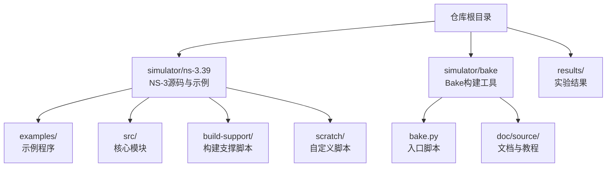
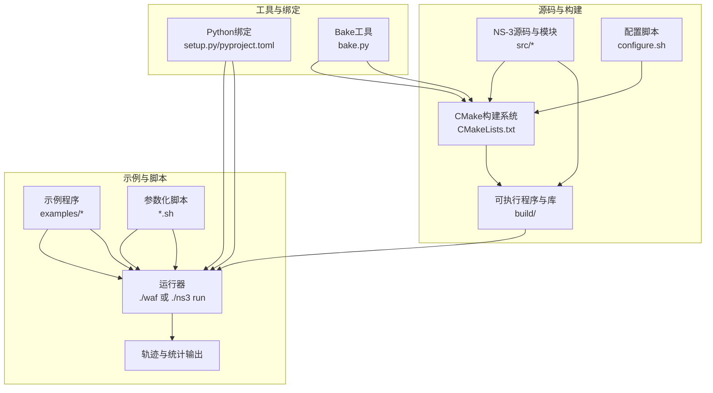
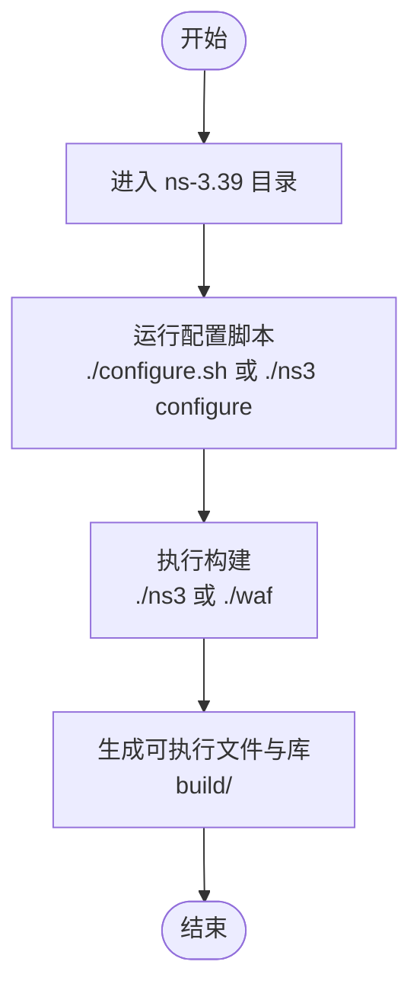
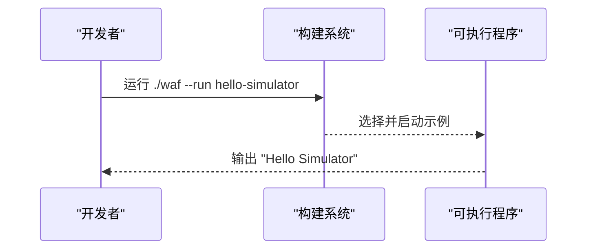
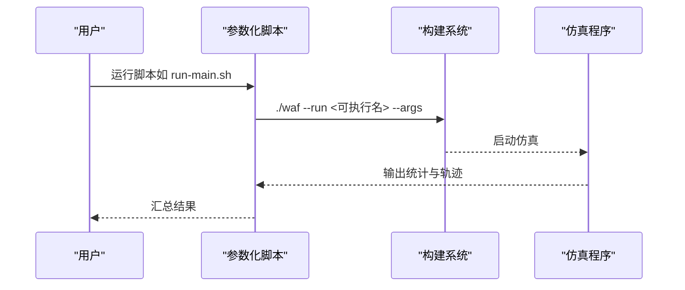
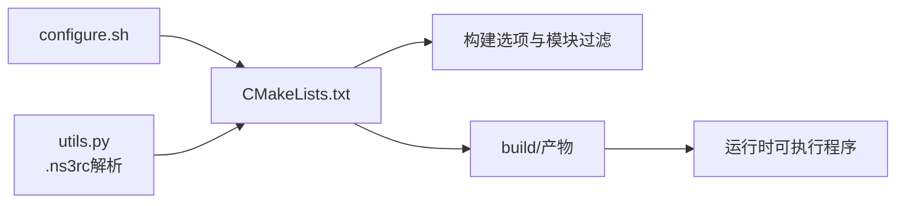

# 快速开始

<cite>
**本文引用的文件**   
- [README.md](file://README.md)
- [ns-3.39/README.md](file://simulator/ns-3.39/README.md)
- [ns-3.39/RELEASE_NOTES.md](file://simulator/ns-3.39/RELEASE_NOTES.md)
- [ns-3.39/configure.sh](file://simulator/ns-3.39/configure.sh)
- [ns-3.39/CMakeLists.txt](file://simulator/ns-3.39/CMakeLists.txt)
- [ns-3.39/setup.py](file://simulator/ns-3.39/setup.py)
- [ns-3.39/pyproject.toml](file://simulator/ns-3.39/pyproject.toml)
- [ns-3.39/utils.py](file://simulator/ns-3.39/utils.py)
- [ns-3.39/examples/tutorial/hello-simulator.cc](file://simulator/ns-3.39/examples/tutorial/hello-simulator.cc)
- [ns-3.39/examples/ABM/run-main.sh](file://simulator/ns-3.39/examples/ABM/run-main.sh)
- [ns-3.39/examples/PowerTCP/script-burst.sh](file://simulator/ns-3.39/examples/PowerTCP/script-burst.sh)
- [ns-3.39/examples/Reverie/run-gamma.sh](file://simulator/ns-3.39/examples/Reverie/run-gamma.sh)
- [ns-3.39/examples/PowerTCP/config-burst.txt](file://simulator/ns-3.39/examples/PowerTCP/config-burst.txt)
- [bake/bake.py](file://simulator/bake/bake.py)
- [bake/doc/source/bake-tutorial.rst](file://simulator/bake/doc/source/bake-tutorial.rst)
</cite>

## 目录
1. [简介](#简介)
2. [项目结构](#项目结构)
3. [核心组件](#核心组件)
4. [架构总览](#架构总览)
5. [详细组件分析](#详细组件分析)
6. [依赖关系分析](#依赖关系分析)
7. [性能考虑](#性能考虑)
8. [故障排除指南](#故障排除指南)
9. [结论](#结论)
10. [附录](#附录)

## 简介
本指南面向首次接触 NS-3 数据中心网络仿真平台（基于 ns-3.39 扩展）的用户，目标是帮助你在 Windows、Linux 和 macOS 平台上完成安装与配置，顺利编译构建，并通过第一个 C++ 仿真示例验证环境。随后，你将学习如何运行数据中心相关算法示例（如 PowerTCP、ABM、Reverie），并掌握常见问题的排查方法。

## 项目结构
仓库包含以下关键目录与文件：
- simulator/ns-3.39：NS-3 源码与扩展模块，包含构建系统、示例、工具等
- simulator/bake：Bake 构建与依赖管理工具
- results/：实验结果存放目录（示例）
- README.md：项目说明与示例入口

**图表来源**
- [README.md](file://README.md)
- [ns-3.39/README.md](file://simulator/ns-3.39/README.md)

**章节来源**
- [README.md](file://README.md)
- [ns-3.39/README.md](file://simulator/ns-3.39/README.md)

## 核心组件
- 配置与构建系统
  - 使用 CMake 作为构建系统，提供丰富的构建选项（启用示例、启用 Python 绑定、启用日志、启用断言等）
  - 提供便捷的配置脚本以设置常用构建参数
- 示例与脚本
  - 提供基础示例（如 hello-simulator）验证编译与运行
  - 提供数据中心相关示例脚本（ABM、PowerTCP、Reverie）用于批量运行与参数化实验
- 工具链与依赖
  - 支持通过 pip 安装预构建的 Python 绑定（可选）
  - 提供 .ns3rc 配置文件读取逻辑，控制模块启用/禁用与示例/测试开关

**章节来源**
- [ns-3.39/CMakeLists.txt](file://simulator/ns-3.39/CMakeLists.txt)
- [ns-3.39/configure.sh](file://simulator/ns-3.39/configure.sh)
- [ns-3.39/utils.py](file://simulator/ns-3.39/utils.py)
- [ns-3.39/examples/tutorial/hello-simulator.cc](file://simulator/ns-3.39/examples/tutorial/hello-simulator.cc)

## 架构总览
下图展示了从源码到可执行程序的关键流程，以及 Python 绑定与 Bake 工具的角色。

**图表来源**
- [ns-3.39/CMakeLists.txt](file://simulator/ns-3.39/CMakeLists.txt)
- [ns-3.39/configure.sh](file://simulator/ns-3.39/configure.sh)
- [ns-3.39/setup.py](file://simulator/ns-3.39/setup.py)
- [ns-3.39/pyproject.toml](file://simulator/ns-3.39/pyproject.toml)
- [bake/bake.py](file://simulator/bake/bake.py)

## 详细组件分析

### 安装与系统要求
- 支持平台与最低要求
  - Linux：g++-9 或更高；或 LLVM/clang++-6 或更高
  - macOS：Xcode 11 或更高
  - Windows：MSys2/MinGW64 工具链或 WSL2
  - Python：3.6 及以上
  - CMake：3.10 及以上
- Python API 要求
  - 使用 Cppyy 版本 2.4.2（避免 3.x）

建议在各平台先安装上述工具链与依赖，再进行后续步骤。

**章节来源**
- [ns-3.39/RELEASE_NOTES.md](file://simulator/ns-3.39/RELEASE_NOTES.md)

### 依赖库与工具准备
- 包管理器与系统依赖
  - Linux 发行版可通过 apt/yum/yast 等安装系统依赖
  - macOS 可通过 Homebrew（port）安装
- 建议安装
  - 构建工具：CMake、编译器（GCC/Clang）、Python 3
  - 可选：pip、git、文本编辑器

提示：若使用 Bake 工具，它会根据当前系统识别包管理器并提示安装命令。

**章节来源**
- [bake/bake.py](file://simulator/bake/bake.py)

### 配置脚本与构建选项
- 配置脚本
  - 默认调用 ./ns3 configure，设置优化构建、启用示例、启用 Python 绑定、关闭警告为错误等
- 关键构建选项（来自 CMakeLists.txt）
  - 启用示例：NS3_EXAMPLES=ON
  - 启用 Python 绑定：NS3_PYTHON_BINDINGS=ON
  - 启用日志：NS3_LOG=ON
  - 启用断言：NS3_ASSERT=ON
  - 其他：启用 GTK3/Eigen、SQLite、可视化模块、缓存加速（ccache）、快速链接器（mold/lld）等

你可以通过修改 configure.sh 或直接使用 ./ns3 configure 的参数覆盖默认值。

**章节来源**
- [ns-3.39/configure.sh](file://simulator/ns-3.39/configure.sh)
- [ns-3.39/CMakeLists.txt](file://simulator/ns-3.39/CMakeLists.txt)

### 编译与构建过程
- 步骤
  1) 进入 ns-3.39 目录
  2) 运行配置脚本（或 ./ns3 configure）
  3) 运行构建（./ns3 或 ./waf）
- 输出
  - 构建产物位于 build/ 目录
  - 示例程序与可执行文件随示例启用而生成

**图表来源**
- [ns-3.39/configure.sh](file://simulator/ns-3.39/configure.sh)
- [ns-3.39/README.md](file://simulator/ns-3.39/README.md)

**章节来源**
- [ns-3.39/README.md](file://simulator/ns-3.39/README.md)

### 第一个仿真程序：hello-simulator
- 目标
  - 验证 C++ 编译与运行环境是否正确
- 步骤
  1) 在 ns-3.39/examples/tutorial 中找到 hello-simulator.cc
  2) 使用 ./waf --run 或 ./ns3 run 运行该示例
  3) 观察控制台输出“Hello Simulator”
- 预期输出
  - 控制台打印 Hello Simulator 字样
  - 可能生成轨迹文件（取决于示例）

**图表来源**
- [ns-3.39/examples/tutorial/hello-simulator.cc](file://simulator/ns-3.39/examples/tutorial/hello-simulator.cc)

**章节来源**
- [ns-3.39/examples/tutorial/hello-simulator.cc](file://simulator/ns-3.39/examples/tutorial/hello-simulator.cc)

### 运行数据中心示例
- PowerTCP
  - 使用脚本批量运行不同拥塞控制算法与拓扑参数组合
  - 示例脚本会自动计算缓冲区大小、请求速率等参数并启动多个并行实验
- ABM
  - 提供多组参数扫描（负载、突发大小、队列算法等）
  - 自动等待 CPU 核心空闲后启动新任务
- Reverie
  - 提供针对 RDMA/TCP 混合场景的参数化实验脚本

**图表来源**
- [ns-3.39/examples/ABM/run-main.sh](file://simulator/ns-3.39/examples/ABM/run-main.sh)
- [ns-3.39/examples/PowerTCP/script-burst.sh](file://simulator/ns-3.39/examples/PowerTCP/script-burst.sh)
- [ns-3.39/examples/Reverie/run-gamma.sh](file://simulator/ns-3.39/examples/Reverie/run-gamma.sh)

**章节来源**
- [ns-3.39/examples/ABM/run-main.sh](file://simulator/ns-3.39/examples/ABM/run-main.sh)
- [ns-3.39/examples/PowerTCP/script-burst.sh](file://simulator/ns-3.39/examples/PowerTCP/script-burst.sh)
- [ns-3.39/examples/Reverie/run-gamma.sh](file://simulator/ns-3.39/examples/Reverie/run-gamma.sh)

### Python 绑定与安装（可选）
- 通过 pip 安装预构建的 ns3 Python 包
- 注意：Python API 与 C++ API 不完全一致，部分功能受限
- 可参考 ns-3 文档获取 API 使用说明

**章节来源**
- [ns-3.39/README.md](file://simulator/ns-3.39/README.md)

### .ns3rc 配置文件
- 作用
  - 控制启用/禁用模块列表、是否启用示例与测试
- 读取逻辑
  - 优先读取当前工作目录下的 .ns3rc，否则回退到用户主目录
  - 解析模块列表与布尔开关，未找到时采用默认值

**章节来源**
- [ns-3.39/utils.py](file://simulator/ns-3.39/utils.py)

## 依赖关系分析
- 组件耦合
  - CMakeLists.txt 定义了大量构建选项与模块过滤逻辑
  - configure.sh 将常用选项固化为默认配置
  - utils.py 提供 .ns3rc 解析能力，影响模块启用范围
- 外部依赖
  - CMake、编译器、Python、可选 GUI 库（GTK3/Eigen）、SQLite
  - Windows 平台需要 MSys2/MinGW64 或 WSL2

**图表来源**
- [ns-3.39/CMakeLists.txt](file://simulator/ns-3.39/CMakeLists.txt)
- [ns-3.39/configure.sh](file://simulator/ns-3.39/configure.sh)
- [ns-3.39/utils.py](file://simulator/ns-3.39/utils.py)

**章节来源**
- [ns-3.39/CMakeLists.txt](file://simulator/ns-3.39/CMakeLists.txt)
- [ns-3.39/configure.sh](file://simulator/ns-3.39/configure.sh)
- [ns-3.39/utils.py](file://simulator/ns-3.39/utils.py)

## 性能考虑
- 构建优化
  - 启用 ccache 与快速链接器（mold/lld）可显著缩短二次构建时间
  - 启用预编译头（PCH）与 LTO（可选）提升编译速度与运行时性能
- 运行时
  - 示例与测试默认不启用，可在 .ns3rc 中按需开启
  - Python 绑定加载开销较大，建议仅在需要时使用

**章节来源**
- [ns-3.39/CMakeLists.txt](file://simulator/ns-3.39/CMakeLists.txt)

## 故障排除指南
- 平台与工具链
  - Windows：确认已安装 MSys2/MinGW64 或 WSL2，并使用其终端
  - macOS：确保 Xcode 命令行工具可用
  - Linux：使用 apt/yum 等安装缺失的系统依赖
- 编译失败
  - 检查编译器版本是否满足最低要求
  - 确认 CMake 版本满足 3.10+
  - 若使用 Bake，遵循其提示安装系统依赖
- Python 绑定
  - 确保 Cppyy 版本为 2.4.2
  - 若 pip 安装失败，检查网络与权限
- 示例无法运行
  - 确认已成功构建并生成对应可执行文件
  - 检查示例参数与输入文件路径（如 PowerTCP 的配置文件）

**章节来源**
- [ns-3.39/RELEASE_NOTES.md](file://simulator/ns-3.39/RELEASE_NOTES.md)
- [bake/bake.py](file://simulator/bake/bake.py)

## 结论
通过本指南，你可以在三大主流平台上完成 NS-3 数据中心网络仿真的安装与配置，成功运行第一个示例，并进一步探索 PowerTCP、ABM、Reverie 等数据中心算法的批量实验脚本。遇到问题时，可依据故障排除章节定位原因并解决。建议在正式开展研究前，先在小规模拓扑上验证环境，再逐步扩大实验规模。

## 附录

### 平台差异与建议
- Windows
  - 推荐使用 WSL2 或 MSys2/MinGW64
  - 避免在原生 Windows 上使用过旧的工具链
- Linux
  - 使用发行版官方仓库安装依赖
  - 如需图形界面，确保 GTK3 可用
- macOS
  - 使用 Homebrew 安装缺失依赖
  - 确保 Xcode 11+ 及命令行工具

**章节来源**
- [ns-3.39/RELEASE_NOTES.md](file://simulator/ns-3.39/RELEASE_NOTES.md)

### 常用命令速查
- 进入 ns-3.39 目录
- 运行配置脚本：./configure.sh
- 构建：./ns3 或 ./waf
- 运行示例：./ns3 run hello-simulator
- 运行数据中心脚本：bash examples/ABM/run-main.sh 或其他脚本

**章节来源**
- [ns-3.39/configure.sh](file://simulator/ns-3.39/configure.sh)
- [ns-3.39/README.md](file://simulator/ns-3.39/README.md)