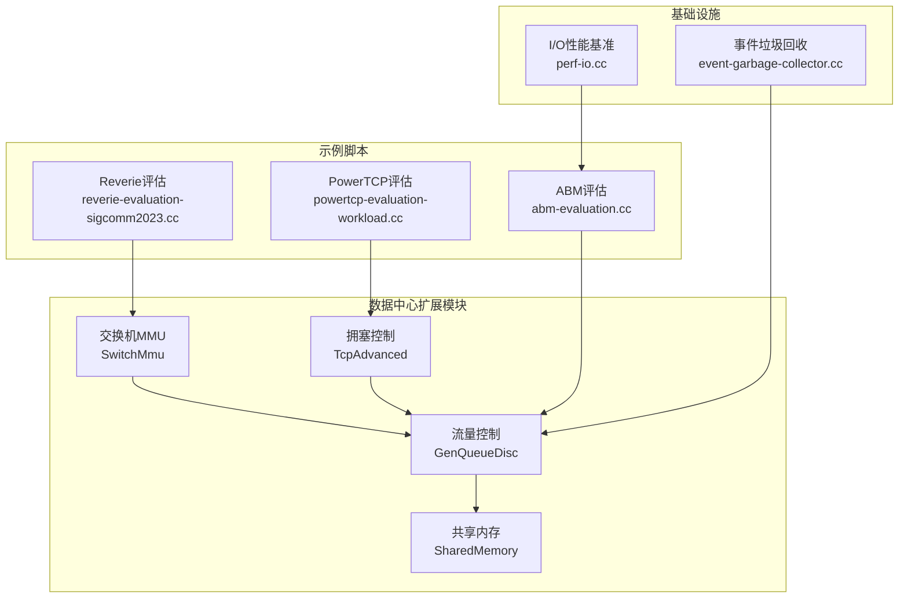
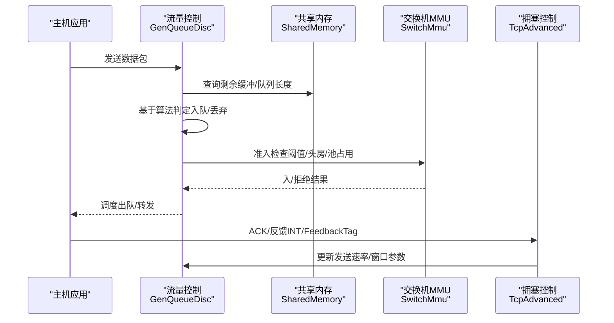
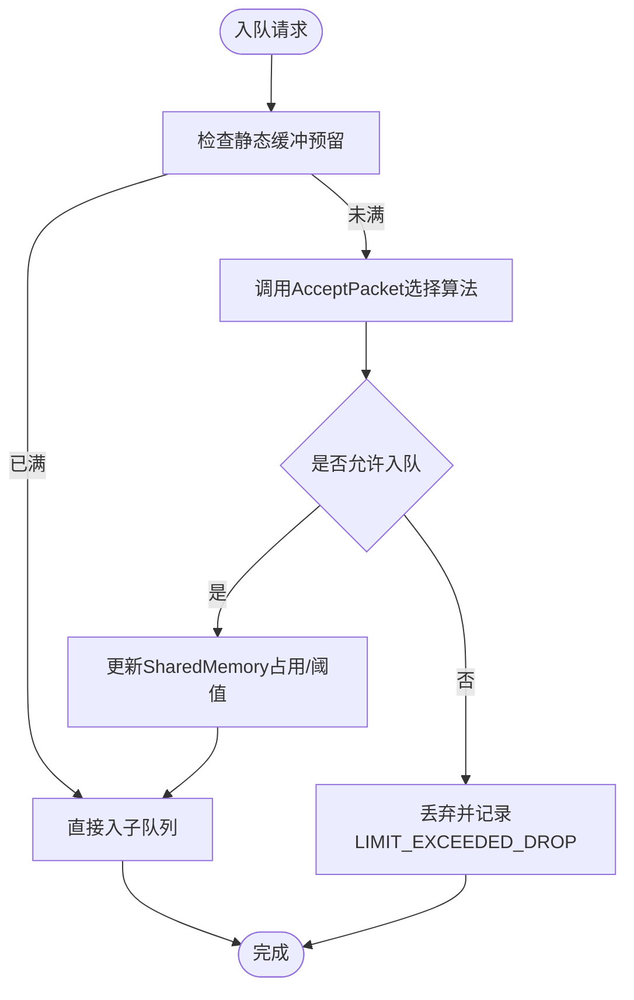
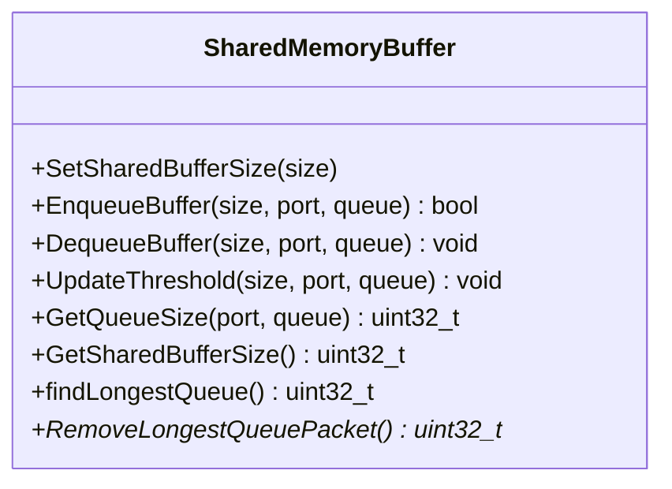
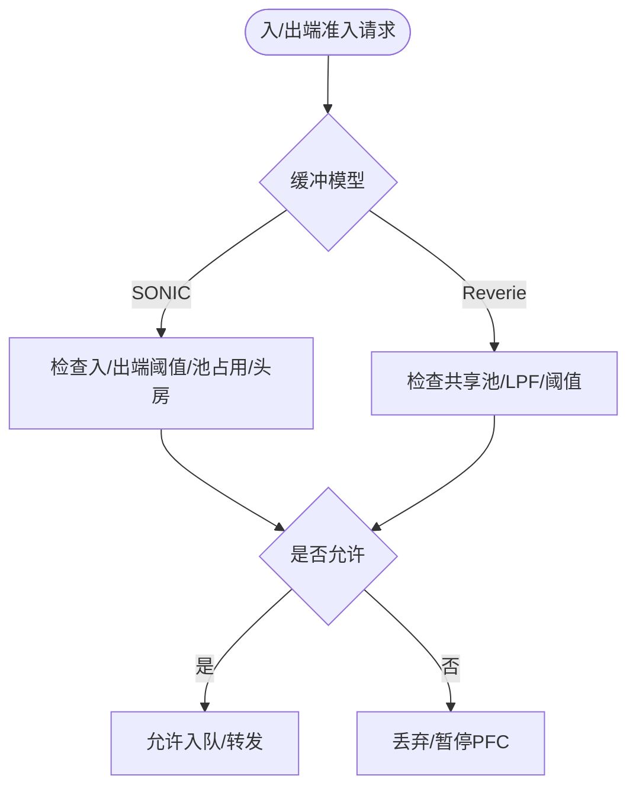
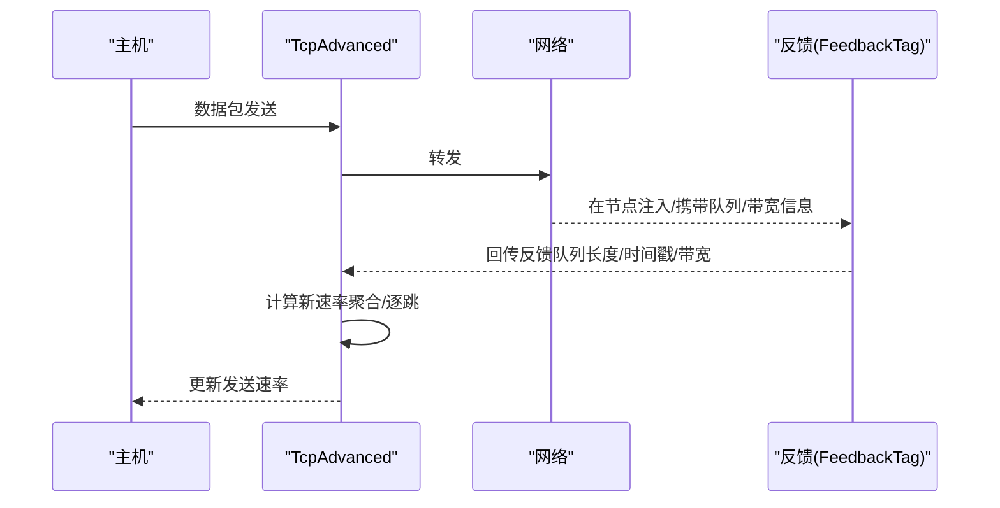
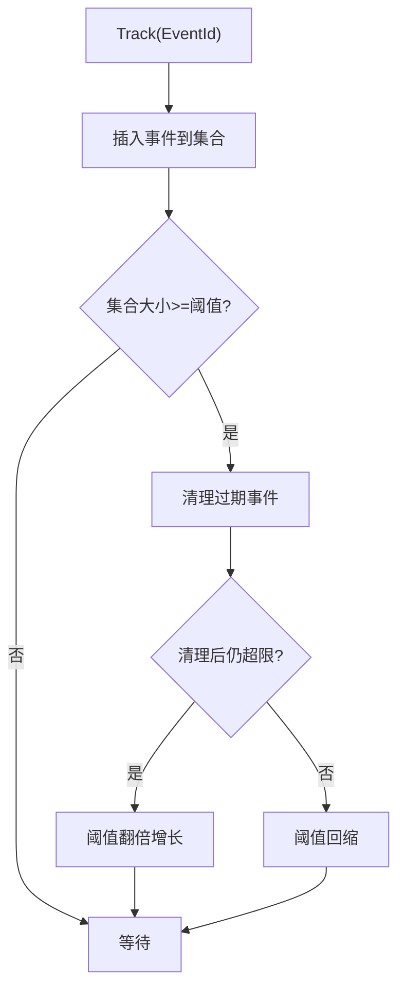
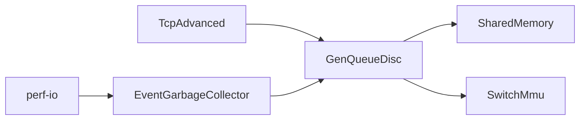

# 性能优化

<cite>
**本文引用的文件**
- [README.md](file://README.md)
- [gen-queue-disc.cc](file://simulator/ns-3.39/src/traffic-control/model/gen-queue-disc.cc)
- [shared-memory.cc](file://simulator/ns-3.39/src/traffic-control/model/shared-memory.cc)
- [switch-mmu.cc](file://simulator/ns-3.39/src/point-to-point/model/switch-mmu.cc)
- [tcp-advanced.cc](file://simulator/ns-3.39/src/internet/model/tcp-advanced.cc)
- [event-garbage-collector.cc](file://simulator/ns-3.39/src/core/helper/event-garbage-collector.cc)
- [perf-io.cc](file://simulator/ns-3.39/utils/perf/perf-io.cc)
- [abm-evaluation.cc](file://simulator/ns-3.39/examples/ABM/abm-evaluation.cc)
- [powertcp-evaluation-workload.cc](file://simulator/ns-3.39/examples/PowerTCP/powertcp-evaluation-workload.cc)
- [reverie-evaluation-sigcomm2023.cc](file://simulator/ns-3.39/examples/Reverie/reverie-evaluation-sigcomm2023.cc)
</cite>

## 目录
1. [引言](#引言)
2. [项目结构](#项目结构)
3. [核心组件](#核心组件)
4. [架构总览](#架构总览)
5. [详细组件分析](#详细组件分析)
6. [依赖关系分析](#依赖关系分析)
7. [性能考量](#性能考量)
8. [故障排查指南](#故障排查指南)
9. [结论](#结论)
10. [附录](#附录)

## 引言
本指南面向高性能计算与大规模数据中心仿真场景，聚焦于NS-3数据中心扩展版本在内存管理、事件调度、缓冲与队列、拥塞控制与转发路径上的性能优化策略与实操建议。文档基于仓库中的缓冲管理（GenQueueDisc、SharedMemory）、交换机MMU（SwitchMmu）、拥塞控制（TcpAdvanced）以及事件垃圾回收与I/O基准工具，结合示例脚本（ABM、PowerTCP、Reverie）给出可复用的调优方法、瓶颈识别手段与优化实践。

## 项目结构
该仓库围绕数据中心网络仿真扩展了多类缓冲管理算法、RDMA/TCP融合栈与交换机内存模型，并提供了丰富的示例脚本用于评估不同算法在真实工作负载下的性能表现。

图示来源
- [gen-queue-disc.cc:1-800](file://simulator/ns-3.39/src/traffic-control/model/gen-queue-disc.cc#L1-L800)
- [shared-memory.cc:1-360](file://simulator/ns-3.39/src/traffic-control/model/shared-memory.cc#L1-L360)
- [switch-mmu.cc:1-800](file://simulator/ns-3.39/src/point-to-point/model/switch-mmu.cc#L1-L800)
- [tcp-advanced.cc:1-607](file://simulator/ns-3.39/src/internet/model/tcp-advanced.cc#L1-L607)
- [abm-evaluation.cc:1-800](file://simulator/ns-3.39/examples/ABM/abm-evaluation.cc#L1-L800)
- [powertcp-evaluation-workload.cc:1-800](file://simulator/ns-3.39/examples/PowerTCP/powertcp-evaluation-workload.cc#L1-L800)
- [reverie-evaluation-sigcomm2023.cc:1-800](file://simulator/ns-3.39/examples/Reverie/reverie-evaluation-sigcomm2023.cc#L1-L800)
- [event-garbage-collector.cc:1-100](file://simulator/ns-3.39/src/core/helper/event-garbage-collector.cc#L1-L100)
- [perf-io.cc:1-148](file://simulator/ns-3.39/utils/perf/perf-io.cc#L1-L148)

章节来源
- [README.md:1-241](file://README.md#L1-L241)

## 核心组件
- 流量控制与缓冲管理：GenQueueDisc提供多种缓冲分配策略（动态阈值、ABM、FAB、IB、LQD、Credence），并配合SharedMemory实现跨端口/队列的共享缓冲统计与阈值更新。
- 交换机内存模型：SwitchMmu实现基于SONIC/Reverie的入/出端缓冲池与头房（headroom）管理，支持按端口/队列的阈值计算与准入控制。
- 拥塞控制：TcpAdvanced封装PowerTCP、Theta-PowerTCP、HPCC、TIMELY等数据中心拥塞控制算法，利用反馈信息进行速率自适应。
- 事件系统与内存：EventGarbageCollector降低事件表膨胀带来的内存与CPU开销；perf-io基准用于评估输出写入性能，辅助定位I/O瓶颈。

章节来源
- [gen-queue-disc.cc:1-800](file://simulator/ns-3.39/src/traffic-control/model/gen-queue-disc.cc#L1-L800)
- [shared-memory.cc:1-360](file://simulator/ns-3.39/src/traffic-control/model/shared-memory.cc#L1-L360)
- [switch-mmu.cc:1-800](file://simulator/ns-3.39/src/point-to-point/model/switch-mmu.cc#L1-L800)
- [tcp-advanced.cc:1-607](file://simulator/ns-3.39/src/internet/model/tcp-advanced.cc#L1-L607)
- [event-garbage-collector.cc:1-100](file://simulator/ns-3.39/src/core/helper/event-garbage-collector.cc#L1-L100)
- [perf-io.cc:1-148](file://simulator/ns-3.39/utils/perf/perf-io.cc#L1-L148)

## 架构总览
数据中心仿真以“主机应用层”为起点，经由“点对点链路与交换机MMU”，进入“流量控制与队列调度”，最终到达“拥塞控制与转发”。数据面反馈通过INT/FeedbackTag回传至拥塞控制与队列管理模块，形成闭环。

图示来源
- [gen-queue-disc.cc:583-800](file://simulator/ns-3.39/src/traffic-control/model/gen-queue-disc.cc#L583-L800)
- [shared-memory.cc:170-246](file://simulator/ns-3.39/src/traffic-control/model/shared-memory.cc#L170-L246)
- [switch-mmu.cc:656-739](file://simulator/ns-3.39/src/point-to-point/model/switch-mmu.cc#L656-L739)
- [tcp-advanced.cc:143-289](file://simulator/ns-3.39/src/internet/model/tcp-advanced.cc#L143-L289)

## 详细组件分析

### 组件A：GenQueueDisc（缓冲管理与调度）
- 功能要点
  - 多算法接入：DT/FAB/IB/LQD/Credence等，统一通过AcceptPacket分发。
  - 共享内存集成：Enqueue/Dequeue时维护SharedMemory占用、阈值与平均队列长度。
  - 采样与统计：吞吐、队列长度、丢弃事件、到达/离开回调，便于性能分析。
- 关键流程
  - 入队前根据算法计算阈值并判断是否允许入队；若允许则更新SharedMemory并入子队列。
  - 出队时记录端口级吞吐与队列状态，必要时触发INT反馈更新。
- 性能影响因素
  - 队列数（nPrior）、轮询/严格优先级（RoundRobin/StrictPriority）。
  - 算法参数（updateInterval、静态缓冲staticBuffer、alphaUnsched等）。
  - 与SharedMemory的交互频率与阈值更新周期。

图示来源
- [gen-queue-disc.cc:583-683](file://simulator/ns-3.39/src/traffic-control/model/gen-queue-disc.cc#L583-L683)
- [shared-memory.cc:170-186](file://simulator/ns-3.39/src/traffic-control/model/shared-memory.cc#L170-L186)

章节来源
- [gen-queue-disc.cc:1-800](file://simulator/ns-3.39/src/traffic-control/model/gen-queue-disc.cc#L1-L800)
- [shared-memory.cc:1-360](file://simulator/ns-3.39/src/traffic-control/model/shared-memory.cc#L1-L360)

### 组件B：SharedMemory（共享缓冲统计与阈值）
- 功能要点
  - 维护全局共享缓冲总量、占用、剩余与平均占用。
  - 记录各端口/队列队列长度与平均队列长度，支持LQD阈值动态调整。
  - 提供阈值更新（UpdateThreshold）、最长队列查找（findLongestQueue）、移除最长队列包（RemoveLongestQueuePacket）等接口。
- 性能影响因素
  - 阈值更新粒度（如每端口/每队列的Deq采样窗口）。
  - 平均占用计算的指数滑动窗口参数（AverageInterval）。
  - 队列指针缓存与尾包访问效率。

图示来源
- [shared-memory.cc:107-298](file://simulator/ns-3.39/src/traffic-control/model/shared-memory.cc#L107-L298)

章节来源
- [shared-memory.cc:1-360](file://simulator/ns-3.39/src/traffic-control/model/shared-memory.cc#L1-L360)

### 组件C：SwitchMmu（交换机内存模型与准入控制）
- 功能要点
  - 支持SONIC与Reverie两种缓冲模型：入/出端池、头房（headroom）、共享池等。
  - 入/出端阈值计算：DT/ABM/FAB等算法，结合饱和度、队列长度、去队速率等。
  - 入/出端准入检查：综合队列阈值、池占用、头房使用与全局ASIC缓冲上限。
- 性能影响因素
  - 入/出端算法配置（ingressAlg/egressAlg）。
  - 头房总量与每队列头房上限（xoffTotal/xoff）。
  - 去队速率更新周期（updateIntervalNS）与带宽估计精度。

图示来源
- [switch-mmu.cc:656-739](file://simulator/ns-3.39/src/point-to-point/model/switch-mmu.cc#L656-L739)
- [switch-mmu.cc:742-800](file://simulator/ns-3.39/src/point-to-point/model/switch-mmu.cc#L742-L800)

章节来源
- [switch-mmu.cc:1-800](file://simulator/ns-3.39/src/point-to-point/model/switch-mmu.cc#L1-L800)

### 组件D：TcpAdvanced（数据中心拥塞控制）
- 功能要点
  - 支持PowerTCP、Theta-PowerTCP、HPCC、TIMELY等算法，依据INT反馈或RTT变化动态调整发送速率。
  - FastReact快速反应机制与聚合/逐跳速率更新策略。
- 性能影响因素
  - 反馈采样策略（sampleFeedback）、多速率模式（multipleRate）。
  - 目标利用率（targetUtil）、基础RTT（baseRtt）与最小/最大速率限制。
  - 速率更新间隔与平滑因子（如EWMA）。

图示来源
- [tcp-advanced.cc:143-289](file://simulator/ns-3.39/src/internet/model/tcp-advanced.cc#L143-L289)
- [tcp-advanced.cc:381-502](file://simulator/ns-3.39/src/internet/model/tcp-advanced.cc#L381-L502)

章节来源
- [tcp-advanced.cc:1-607](file://simulator/ns-3.39/src/internet/model/tcp-advanced.cc#L1-L607)

### 组件E：事件系统与内存（EventGarbageCollector）
- 功能要点
  - 跟踪EventId集合并在达到清理阈值后批量清理过期事件，避免事件表无限增长。
  - 自适应增长/收缩清理阈值，平衡清理成本与内存占用。
- 性能影响因素
  - 初始清理阈值与最大阈值上限。
  - 清理触发条件（事件数量超过阈值）与清理后阈值调整策略。

图示来源
- [event-garbage-collector.cc:37-89](file://simulator/ns-3.39/src/core/helper/event-garbage-collector.cc#L37-L89)

章节来源
- [event-garbage-collector.cc:1-100](file://simulator/ns-3.39/src/core/helper/event-garbage-collector.cc#L1-L100)

### 组件F：I/O性能基准（perf-io）
- 功能要点
  - 对比C标准I/O与C++流写入性能，支持多次迭代取最小耗时，减少系统干扰。
- 性能影响因素
  - 写入次数（n）、迭代次数（iter）、二进制/文本模式。
  - 文件系统类型与磁盘IO特性。

章节来源
- [perf-io.cc:1-148](file://simulator/ns-3.39/utils/perf/perf-io.cc#L1-L148)

## 依赖关系分析
- GenQueueDisc依赖SharedMemory进行共享缓冲统计与阈值更新；同时与SwitchMmu在入/出端准入上协同。
- TcpAdvanced依赖INT/FeedbackTag提供的队列状态与带宽信息，驱动速率调整。
- 示例脚本通过配置GenQueueDisc/TrafficControl、TcpSocket参数与SwitchMmu属性，验证不同算法在真实拓扑与工作负载下的性能表现。

图示来源
- [gen-queue-disc.cc:583-800](file://simulator/ns-3.39/src/traffic-control/model/gen-queue-disc.cc#L583-L800)
- [shared-memory.cc:170-246](file://simulator/ns-3.39/src/traffic-control/model/shared-memory.cc#L170-L246)
- [switch-mmu.cc:656-739](file://simulator/ns-3.39/src/point-to-point/model/switch-mmu.cc#L656-L739)
- [tcp-advanced.cc:143-289](file://simulator/ns-3.39/src/internet/model/tcp-advanced.cc#L143-L289)
- [event-garbage-collector.cc:1-100](file://simulator/ns-3.39/src/core/helper/event-garbage-collector.cc#L1-L100)
- [perf-io.cc:1-148](file://simulator/ns-3.39/utils/perf/perf-io.cc#L1-L148)

章节来源
- [abm-evaluation.cc:496-800](file://simulator/ns-3.39/examples/ABM/abm-evaluation.cc#L496-L800)
- [powertcp-evaluation-workload.cc:547-800](file://simulator/ns-3.39/examples/PowerTCP/powertcp-evaluation-workload.cc#L547-L800)
- [reverie-evaluation-sigcomm2023.cc:642-800](file://simulator/ns-3.39/examples/Reverie/reverie-evaluation-sigcomm2023.cc#L642-L800)

## 性能考量
- 内存管理
  - 合理设置静态缓冲（staticBuffer）与共享缓冲（SharedMemory.BufferSize），避免频繁触发丢弃与阈值更新。
  - 使用EventGarbageCollector降低事件表规模，减少内存峰值与CPU扫描开销。
- 事件优化
  - 控制事件清理阈值增长步长与上限，避免清理过于频繁或阈值过大导致内存压力。
  - 将高频定时器合并为更长周期（如updateInterval），减少Simulator.Schedule调用次数。
- 并行与大规模仿真
  - 在示例中通过命令行参数与配置项（如nPrior、sched、算法选择）控制并发与调度复杂度。
  - 使用perf-io评估输出写入瓶颈，必要时切换到二进制模式或减少写入频率。
- 缓冲与队列
  - 根据拓扑带宽与延迟估算合理设置SwitchMmu的入/出端池与头房，避免因准入失败导致的PFC风暴。
  - 选择合适的缓冲算法（ABM/Reverie/LQD等）以提升高负载下公平性与稳定性。
- 拥塞控制
  - 针对数据中心场景启用PowerTCP/Theta-PowerTCP或HPCC/TIMELY，结合INT反馈提高收敛速度与稳定性。
  - 调整目标利用率与基础RTT，避免过度或不足的速率抑制。

## 故障排查指南
- 丢包率异常升高
  - 检查GenQueueDisc的AcceptPacket判定逻辑与SharedMemory阈值是否过低；核对SwitchMmu的入/出端阈值与头房使用情况。
  - 若采用LQD，确认RemoveLongestQueuePacket是否有效释放队列空间。
- 吞吐偏低
  - 核查TcpAdvanced的反馈采样与多速率模式配置；检查目标利用率与最小/最大速率限制。
  - 检查GenQueueDisc的轮询/严格优先级策略与队列数设置。
- 内存/事件膨胀
  - 检查EventGarbageCollector的阈值增长/收缩策略是否合理；适当增大初始阈值或降低清理频率。
- I/O瓶颈
  - 使用perf-io基准对比C与C++写入性能，必要时减少写入频率或切换二进制模式。

章节来源
- [gen-queue-disc.cc:583-800](file://simulator/ns-3.39/src/traffic-control/model/gen-queue-disc.cc#L583-L800)
- [shared-memory.cc:271-298](file://simulator/ns-3.39/src/traffic-control/model/shared-memory.cc#L271-L298)
- [switch-mmu.cc:656-739](file://simulator/ns-3.39/src/point-to-point/model/switch-mmu.cc#L656-L739)
- [tcp-advanced.cc:143-289](file://simulator/ns-3.39/src/internet/model/tcp-advanced.cc#L143-L289)
- [event-garbage-collector.cc:37-89](file://simulator/ns-3.39/src/core/helper/event-garbage-collector.cc#L37-L89)
- [perf-io.cc:67-148](file://simulator/ns-3.39/utils/perf/perf-io.cc#L67-L148)

## 结论
通过对GenQueueDisc、SharedMemory、SwitchMmu与TcpAdvanced的协同优化，结合事件系统与I/O基准工具，可在大规模数据中心仿真中显著提升性能与稳定性。建议从缓冲阈值与算法选择入手，配合拥塞控制反馈与事件清理策略，逐步迭代调优并以示例脚本进行量化评估。

## 附录
- 实际测试案例与优化实践
  - ABM评估：通过命令行参数控制算法、队列数与CC协议，结合ToR统计输出评估吞吐与占用。
  - PowerTCP评估：启用INT反馈与功率型速率控制，评估不同工作负载下的FCT与慢启动行为。
  - Reverie评估：配置SONIC/Reverie缓冲模型与入/出端算法，评估高负载下公平性与稳定性。
- 优化效果对比
  - 建议以“吞吐、P99 FCT、丢包率、队列平均占用”等指标作为对比维度，结合示例脚本的输出文件进行统计分析。

章节来源
- [abm-evaluation.cc:318-800](file://simulator/ns-3.39/examples/ABM/abm-evaluation.cc#L318-L800)
- [powertcp-evaluation-workload.cc:547-800](file://simulator/ns-3.39/examples/PowerTCP/powertcp-evaluation-workload.cc#L547-L800)
- [reverie-evaluation-sigcomm2023.cc:642-800](file://simulator/ns-3.39/examples/Reverie/reverie-evaluation-sigcomm2023.cc#L642-L800)