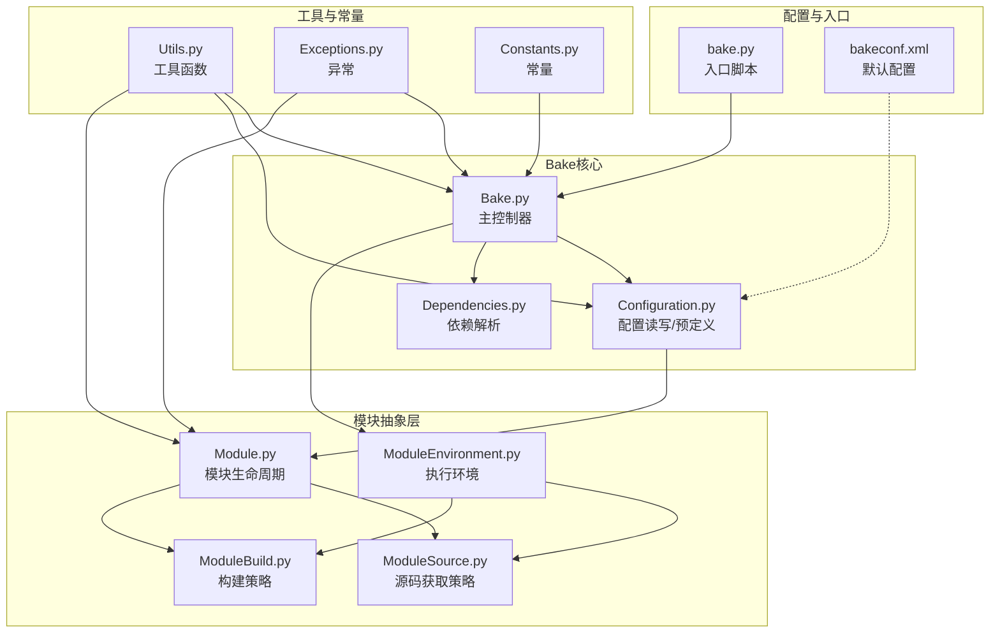
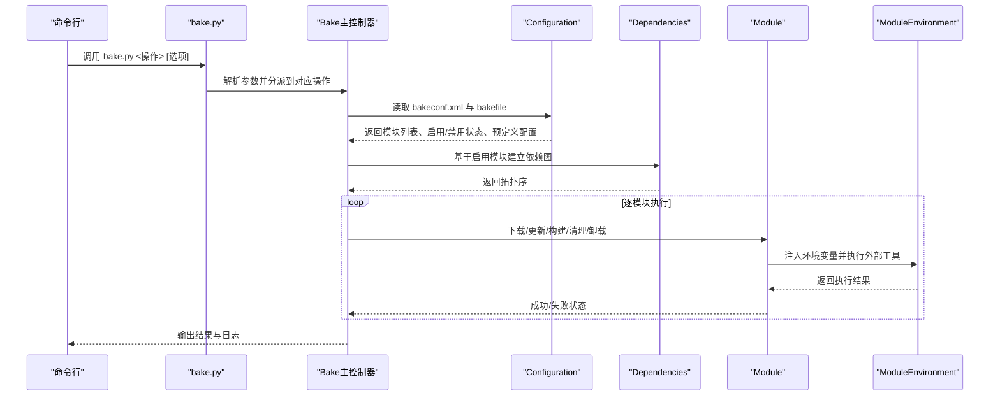
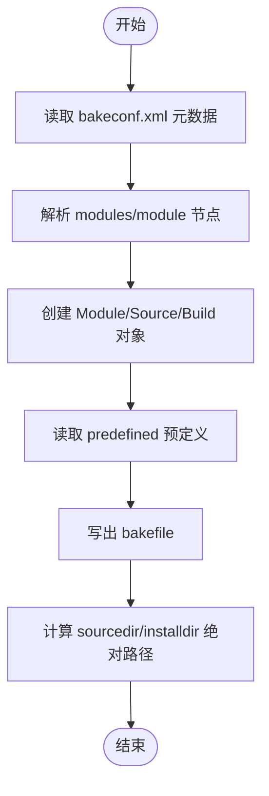
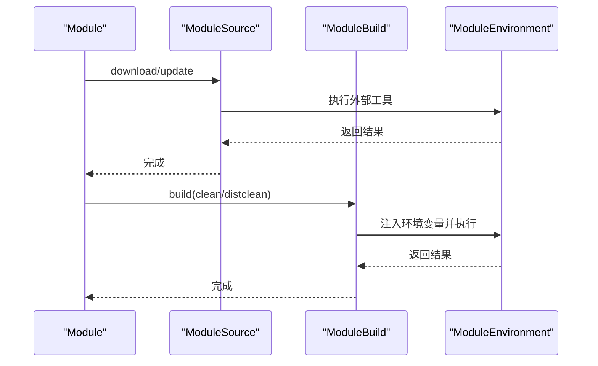
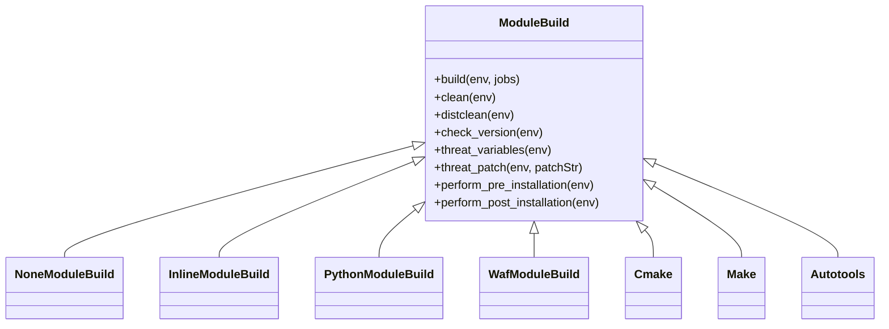
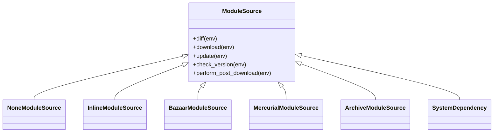
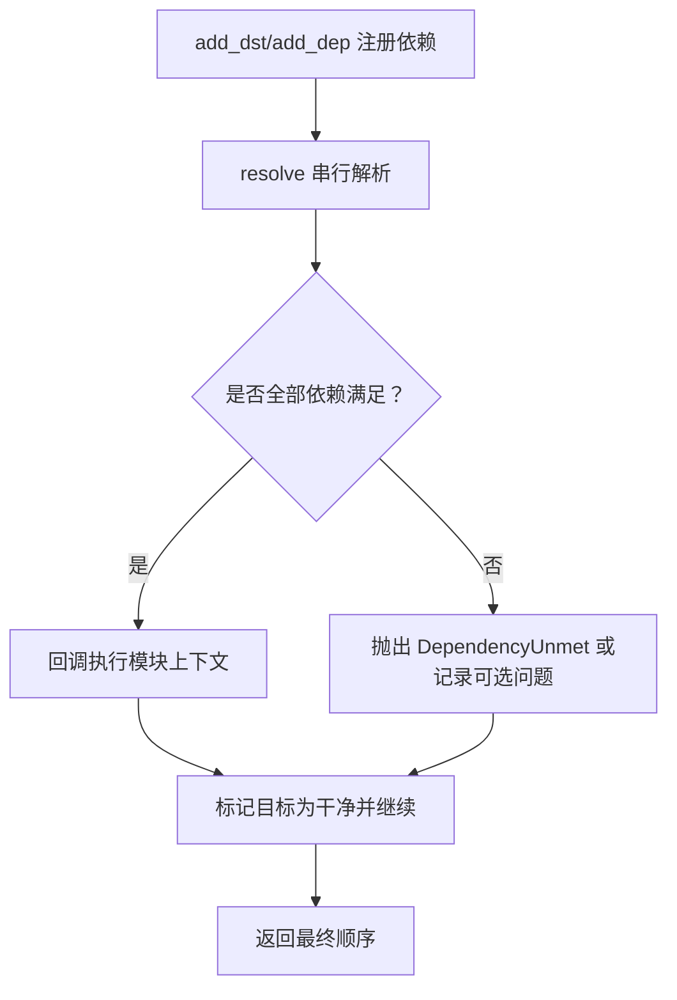
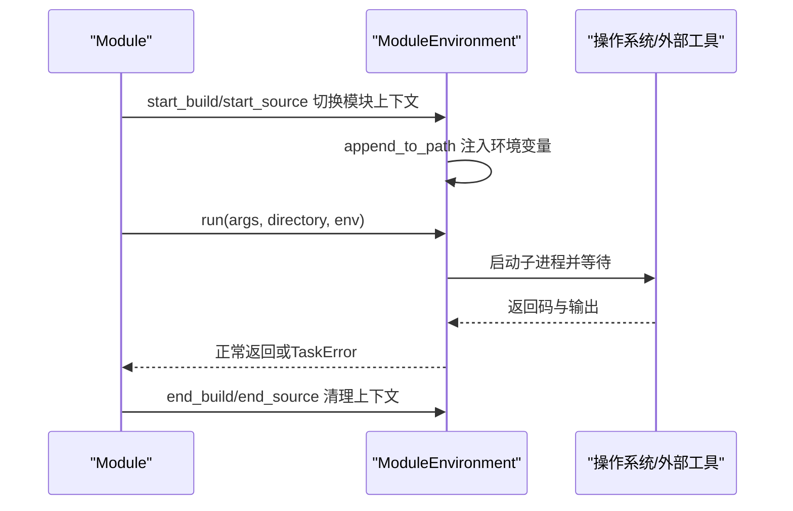
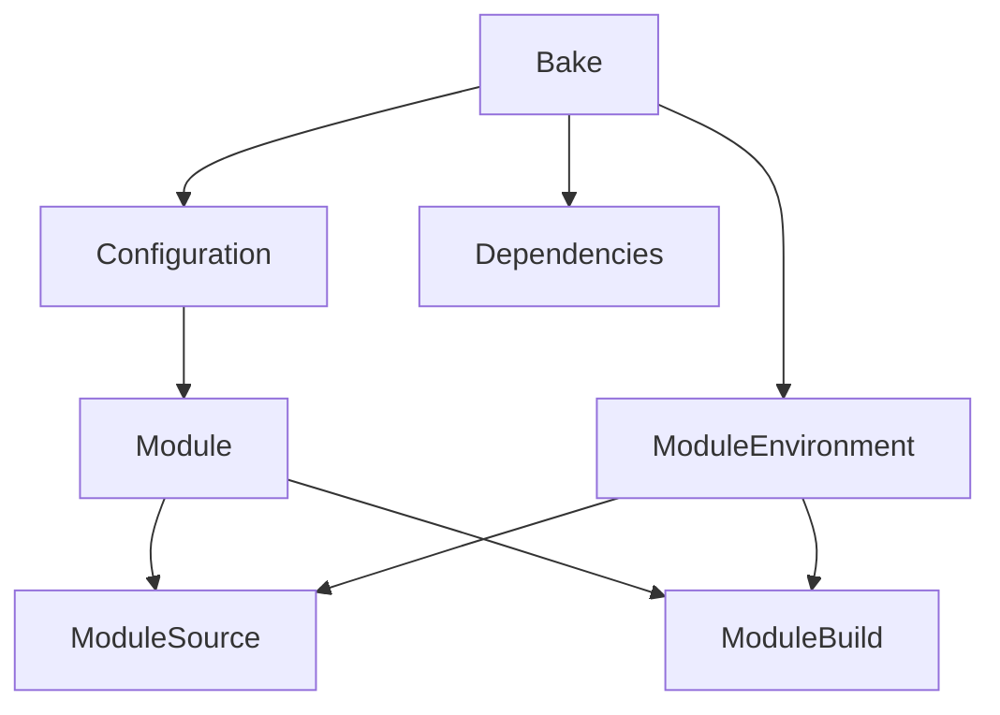

# Bake扩展系统

<cite>
**本文档引用的文件**
- [Bake.py](file://simulator/bake/bake/Bake.py)
- [Configuration.py](file://simulator/bake/bake/Configuration.py)
- [Module.py](file://simulator/bake/bake/Module.py)
- [ModuleBuild.py](file://simulator/bake/bake/ModuleBuild.py)
- [ModuleEnvironment.py](file://simulator/bake/bake/ModuleEnvironment.py)
- [Dependencies.py](file://simulator/bake/bake/Dependencies.py)
- [ModuleSource.py](file://simulator/bake/bake/ModuleSource.py)
- [Constants.py](file://simulator/bake/bake/Constants.py)
- [Exceptions.py](file://simulator/bake/bake/Exceptions.py)
- [Utils.py](file://simulator/bake/bake/Utils.py)
- [bakeconf.xml](file://simulator/bake/bakeconf.xml)
- [bake.py](file://simulator/bake/bake.py)
</cite>

## 目录
1. [简介](#简介)
2. [项目结构](#项目结构)
3. [核心组件](#核心组件)
4. [架构总览](#架构总览)
5. [详细组件分析](#详细组件分析)
6. [依赖分析](#依赖分析)
7. [性能考虑](#性能考虑)
8. [故障排除指南](#故障排除指南)
9. [结论](#结论)
10. [附录](#附录)

## 简介
本文件为Bake扩展系统的深度技术文档，面向需要在NS-3环境中集成第三方模块或自定义扩展的开发者。内容覆盖Bake作为NS-3扩展构建工具的核心架构与工作机制，包括bakeconf.xml配置文件的结构与参数设置、模块发现与依赖解析、构建流程与安装管理等。文档同时提供配置示例与最佳实践，并给出常见问题的排查方法。

## 项目结构
Bake位于simulator/bake目录下，采用模块化设计，核心文件组织如下：
- 配置与入口：bake.py（入口脚本）、bakeconf.xml（默认配置）
- 核心引擎：Bake.py（主控制器）、Configuration.py（配置读写与预定义）
- 模块抽象：Module.py（模块基类与生命周期）、ModuleBuild.py（构建策略多态）、ModuleSource.py（源码获取多态）、ModuleEnvironment.py（执行环境）
- 依赖解析：Dependencies.py（有向无环图依赖解析）
- 工具与常量：Utils.py（通用工具）、Exceptions.py（异常体系）、Constants.py（应用商店API常量）

图表来源
- [Bake.py:1-800](file://simulator/bake/bake/Bake.py#L1-L800)
- [Configuration.py:1-524](file://simulator/bake/bake/Configuration.py#L1-L524)
- [Module.py:1-634](file://simulator/bake/bake/Module.py#L1-L634)
- [ModuleBuild.py:1-830](file://simulator/bake/bake/ModuleBuild.py#L1-L830)
- [ModuleEnvironment.py:1-538](file://simulator/bake/bake/ModuleEnvironment.py#L1-L538)
- [Dependencies.py:1-467](file://simulator/bake/bake/Dependencies.py#L1-L467)
- [ModuleSource.py:1-953](file://simulator/bake/bake/ModuleSource.py#L1-L953)
- [Utils.py:1-254](file://simulator/bake/bake/Utils.py#L1-L254)
- [Exceptions.py:1-50](file://simulator/bake/bake/Exceptions.py#L1-L50)
- [Constants.py:1-3](file://simulator/bake/bake/Constants.py#L1-L3)
- [bakeconf.xml](file://simulator/bake/bakeconf.xml)
- [bake.py](file://simulator/bake/bake.py)

章节来源
- [Bake.py:1-800](file://simulator/bake/bake/Bake.py#L1-L800)
- [Configuration.py:1-524](file://simulator/bake/bake/Configuration.py#L1-L524)

## 核心组件
- 主控制器（Bake）：负责命令行解析、配置读取、模块启用/禁用、依赖解析、迭代执行与日志记录。
- 配置系统（Configuration）：读写bakefile与bakeconf.xml，解析模块元数据、预定义配置、启用/禁用列表与目录路径计算。
- 模块抽象（Module）：封装下载、更新、清理、构建、安装、卸载等生命周期操作；支持递归子模块处理。
- 构建策略（ModuleBuild）：以多态实现对不同构建工具（如make、cmake、waf、autotools、python、none）的支持。
- 源码获取（ModuleSource）：以多态实现对不同SCM与归档格式（如mercurial、bazaar、archive、system_dependency、none）的支持。
- 执行环境（ModuleEnvironment）：统一管理源/目标目录、环境变量（PATH/LD_LIBRARY_PATH/PKG_CONFIG_PATH/PYTHONPATH）、进程执行与版本检查。
- 依赖解析（Dependencies）：基于有向图的拓扑排序，支持可选依赖与错误传播。
- 工具与异常（Utils/Exceptions/Constants）：提供通用工具、异常类型与应用商店API常量。

章节来源
- [Bake.py:70-800](file://simulator/bake/bake/Bake.py#L70-L800)
- [Configuration.py:81-524](file://simulator/bake/bake/Configuration.py#L81-L524)
- [Module.py:110-634](file://simulator/bake/bake/Module.py#L110-L634)
- [ModuleBuild.py:46-830](file://simulator/bake/bake/ModuleBuild.py#L46-L830)
- [ModuleSource.py:55-953](file://simulator/bake/bake/ModuleSource.py#L55-L953)
- [ModuleEnvironment.py:36-538](file://simulator/bake/bake/ModuleEnvironment.py#L36-L538)
- [Dependencies.py:95-467](file://simulator/bake/bake/Dependencies.py#L95-L467)
- [Utils.py:170-254](file://simulator/bake/bake/Utils.py#L170-L254)
- [Exceptions.py:26-50](file://simulator/bake/bake/Exceptions.py#L26-L50)
- [Constants.py:1-3](file://simulator/bake/bake/Constants.py#L1-L3)

## 架构总览
Bake通过“配置驱动 + 多态策略 + 依赖解析”的方式实现模块化扩展。其控制流从bake.py入口开始，经由Bake主控制器协调Configuration读取bakeconf.xml与用户bakefile，随后根据启用模块集调用Dependencies进行依赖拓扑排序，再依次调用Module的生命周期方法（download/build/clean等），期间由ModuleEnvironment统一注入环境变量与执行外部工具。

图表来源
- [bake.py](file://simulator/bake/bake.py)
- [Bake.py:70-800](file://simulator/bake/bake/Bake.py#L70-L800)
- [Configuration.py:103-453](file://simulator/bake/bake/Configuration.py#L103-L453)
- [Dependencies.py:175-467](file://simulator/bake/bake/Dependencies.py#L175-L467)
- [Module.py:171-617](file://simulator/bake/bake/Module.py#L171-L617)
- [ModuleEnvironment.py:490-538](file://simulator/bake/bake/ModuleEnvironment.py#L490-L538)

## 详细组件分析

### 配置系统（Configuration）
- 功能要点
  - 读取bakeconf.xml中的modules节点，解析每个模块的source/build/depends_on信息。
  - 支持预定义配置（predefined）：包含启用/禁用列表、变量设置/追加、目录配置。
  - 写出bakefile：记录启用模块、禁用模块、已安装模块、相对目录根等。
  - 计算绝对路径：结合relative_directory_root与bakefile位置生成sourcedir/installdir。
- 关键流程
  - read_metadata：解析XML并构造Module对象树。
  - read_predefined：解析预定义集合。
  - write：生成bakefile。
  - compute_*：路径计算与校验。

图表来源
- [Configuration.py:103-453](file://simulator/bake/bake/Configuration.py#L103-L453)
- [Configuration.py:403-453](file://simulator/bake/bake/Configuration.py#L403-L453)

章节来源
- [Configuration.py:81-524](file://simulator/bake/bake/Configuration.py#L81-L524)

### 模块生命周期（Module）
- 功能要点
  - 下载/更新：递归处理子模块，支持强制下载与补丁应用。
  - 构建：根据构建策略执行构建、清理、distclean；记录安装产物。
  - 安装/卸载：维护已安装文件清单，支持卸载与全清理。
  - 版本检查：分别检查源码与构建工具版本。
- 关键流程
  - download/update：调用source策略执行。
  - build：调用build策略执行，注入环境变量，监控安装产物变化。
  - clean/distclean/fullclean/uninstall：按需清理源/构建/安装目录。

图表来源
- [Module.py:171-617](file://simulator/bake/bake/Module.py#L171-L617)
- [ModuleSource.py:91-953](file://simulator/bake/bake/ModuleSource.py#L91-L953)
- [ModuleBuild.py:99-830](file://simulator/bake/bake/ModuleBuild.py#L99-L830)
- [ModuleEnvironment.py:490-538](file://simulator/bake/bake/ModuleEnvironment.py#L490-L538)

章节来源
- [Module.py:110-634](file://simulator/bake/bake/Module.py#L110-L634)

### 构建策略（ModuleBuild）
- 支持类型
  - none：无需构建（系统依赖等）。
  - inline：内联Python脚本构建。
  - python：调用setup.py构建与安装。
  - waf：调用waf configure/build/install。
  - cmake：调用cmake生成与构建。
  - make：直接调用make。
  - autotools：autoreconf与configure/make。
- 关键能力
  - 变量注入：PATH/LD_LIBRARY_PATH/PKG_CONFIG_PATH/自定义变量。
  - 补丁应用：支持patch工具与重复应用检测。
  - 预/后安装钩子：pre_installation/post_installation。
  - 平台限制：supported_os属性限制运行平台。

图表来源
- [ModuleBuild.py:46-830](file://simulator/bake/bake/ModuleBuild.py#L46-L830)

章节来源
- [ModuleBuild.py:46-830](file://simulator/bake/bake/ModuleBuild.py#L46-L830)

### 源码获取（ModuleSource）
- 支持类型
  - none：无源码获取。
  - inline：内联Python逻辑。
  - bazaar/mercurial：分布式版本控制仓库。
  - archive：压缩包归档（自动识别解压工具）。
  - system_dependency：系统依赖检测与提示安装方式。
- 关键能力
  - 依赖表达式：支持布尔表达式测试程序/文件/导入存在性。
  - 自动安装提示：针对常见发行版给出安装命令建议。
  - 后下载钩子：download后执行自定义命令。

图表来源
- [ModuleSource.py:55-953](file://simulator/bake/bake/ModuleSource.py#L55-L953)

章节来源
- [ModuleSource.py:55-953](file://simulator/bake/bake/ModuleSource.py#L55-L953)

### 依赖解析（Dependencies）
- 功能要点
  - 建立目标-来源依赖图，支持可选依赖标记。
  - 拓扑排序输出执行顺序，支持回调函数逐模块处理。
  - 错误传播：未满足依赖抛出DependencyUnmet，可区分必需/可选。
  - 可选链追踪：记录可选依赖链路，避免重复告警。
- 关键流程
  - add_dst/add_dep：注册目标与依赖。
  - resolve：串行解析，必要时重解析新增依赖。
  - checkDependencies：预扫描启用模块的完整依赖链。

图表来源
- [Dependencies.py:175-467](file://simulator/bake/bake/Dependencies.py#L175-L467)

章节来源
- [Dependencies.py:95-467](file://simulator/bake/bake/Dependencies.py#L95-L467)

### 执行环境（ModuleEnvironment）
- 功能要点
  - 统一管理srcdir/objdir/installdir，模块切换时更新当前模块名。
  - 注入环境变量：PATH、LD_LIBRARY_PATH/DYLD_LIBRARY_PATH、PKG_CONFIG_PATH、PYTHONPATH。
  - 进程执行：run方法统一包装子进程，捕获错误并支持交互模式。
  - 版本检查：check_program支持正则匹配与版本比较。
  - 环境文件：生成bash环境脚本，导出PATH/LD_LIBRARY_PATH/PKG_CONFIG_PATH/PYTHONPATH。

图表来源
- [ModuleEnvironment.py:490-538](file://simulator/bake/bake/ModuleEnvironment.py#L490-L538)

章节来源
- [ModuleEnvironment.py:36-538](file://simulator/bake/bake/ModuleEnvironment.py#L36-L538)

### 主控制器（Bake）
- 功能要点
  - 命令行解析：fix-config/list/configure/等子命令。
  - 启用/禁用模块：支持-a（全部启用）、-m（最小化启用）、--enable/--disable。
  - 变量设置：支持对单模块或全部模块设置/追加构建变量。
  - 日志与环境：支持stdout/logfile/logdir三种日志模式，可生成环境脚本。
  - 迭代执行：_iterate基于Dependencies进行拓扑遍历。
- 关键流程
  - _configure：读取bakeconf.xml与contrib配置，合并预定义，处理enable/disable/set/append，写出bakefile。
  - _iterate：建立依赖图，逐模块执行functor，处理可选依赖与错误。

章节来源
- [Bake.py:70-800](file://simulator/bake/bake/Bake.py#L70-L800)

## 依赖分析
- 组件耦合
  - Bake强依赖Configuration与Dependencies；弱依赖Module、ModuleSource、ModuleBuild、ModuleEnvironment。
  - Module通过组合持有ModuleSource与ModuleBuild实例，形成策略模式。
  - ModuleEnvironment贯穿所有外部工具调用，承担环境注入职责。
- 外部依赖
  - Python标准库与第三方库（如distro、requests等）用于平台检测与网络请求。
  - 构建工具链（make/cmake/waf/autotools等）与SCM工具（hg/bzr/unzip等）由ModuleEnvironment检查与调用。

图表来源
- [Bake.py:70-800](file://simulator/bake/bake/Bake.py#L70-L800)
- [Configuration.py:81-524](file://simulator/bake/bake/Configuration.py#L81-L524)
- [Module.py:110-634](file://simulator/bake/bake/Module.py#L110-L634)
- [ModuleBuild.py:46-830](file://simulator/bake/bake/ModuleBuild.py#L46-L830)
- [ModuleSource.py:55-953](file://simulator/bake/bake/ModuleSource.py#L55-L953)
- [ModuleEnvironment.py:36-538](file://simulator/bake/bake/ModuleEnvironment.py#L36-L538)
- [Dependencies.py:95-467](file://simulator/bake/bake/Dependencies.py#L95-L467)

章节来源
- [Bake.py:70-800](file://simulator/bake/bake/Bake.py#L70-L800)
- [Dependencies.py:95-467](file://simulator/bake/bake/Dependencies.py#L95-L467)

## 性能考虑
- 依赖解析复杂度
  - 依赖图构建与拓扑排序的时间复杂度近似O(V+E)，其中V为模块数，E为依赖边数。
  - 可选依赖会增加分支与回溯成本，建议尽量减少不必要的可选链。
- 构建阶段优化
  - 使用并行编译参数（如waf/cmake/make的-j选项）提升构建速度。
  - 合理设置objdir与源码分离，避免重复构建。
- I/O与网络
  - archive下载与解压、SCM克隆/拉取可能成为瓶颈，建议缓存与离线镜像。
  - system_dependency安装提示仅作引导，实际安装仍需管理员权限，谨慎使用--sudo。

## 故障排除指南
- 常见错误与定位
  - 依赖未满足：查看DependencyUnmet错误信息，确认必需依赖是否启用且版本满足。
  - 构建工具缺失：检查ModuleEnvironment的版本检查与环境变量注入。
  - 路径配置错误：核对Configuration.compute_*与relative_directory_root。
  - 权限问题：涉及sudo安装的模块需使用--sudo选项。
- 排查步骤
  - 启用详细日志：-v/-vv/-vvv查看命令与返回码。
  - 固化配置：使用fix-config修复bakefile与配置一致性。
  - 单模块验证：使用-one指定模块，缩小问题范围。
  - 环境脚本：生成bakeSetEnv.sh确保PATH/LD_LIBRARY_PATH等正确。

章节来源
- [Bake.py:78-91](file://simulator/bake/bake/Bake.py#L78-L91)
- [ModuleEnvironment.py:490-538](file://simulator/bake/bake/ModuleEnvironment.py#L490-L538)
- [Dependencies.py:390-418](file://simulator/bake/bake/Dependencies.py#L390-L418)

## 结论
Bake通过清晰的模块化架构与多态策略，为NS-3扩展提供了灵活、可扩展的构建与管理框架。开发者可通过bakeconf.xml声明模块元数据与预定义配置，借助Bake的依赖解析与生命周期管理，快速集成第三方模块或自定义扩展。配合良好的日志与环境管理，Bake能够有效降低扩展开发与维护成本。

## 附录

### bakeconf.xml配置要点与参数说明
- modules/module节点
  - name/type/min_version/max_version：模块标识与版本约束。
  - source/build/depends_on：模块的源码获取策略、构建策略与依赖声明。
  - built_once：是否仅构建一次。
- predefined节点
  - enable/disable：预设启用/禁用模块集合。
  - set/append：按模块或全局设置/追加构建变量。
  - configuration：预设sourcedir/installdir。
- bakefile（由Bake生成）
  - 记录enabled/disabled、installed列表、relative_directory_root、bakefile路径与metadata哈希。

章节来源
- [Configuration.py:308-453](file://simulator/bake/bake/Configuration.py#L308-L453)
- [bakeconf.xml](file://simulator/bake/bakeconf.xml)

### 常用命令与最佳实践
- 初始化与配置
  - bake.py configure [--enable/--disable/-a/-m] [--set/--append] [--predefined] [--sourcedir/--installdir]
- 依赖与构建
  - bake.py list [-c]：列出模块（含contrib）。
  - bake.py [download/update/build/clean/distclean/fullclean/uninstall] [--one/--all/--start/--after]
- 最佳实践
  - 将公共构建变量集中到预定义配置，减少重复设置。
  - 对可选依赖使用optional标记，避免阻塞主流程。
  - 在CI中固定objdir与并行参数，提升稳定性与速度。
  - 使用--sudo谨慎安装系统依赖，优先通过包管理器解决。

章节来源
- [Bake.py:482-800](file://simulator/bake/bake/Bake.py#L482-L800)