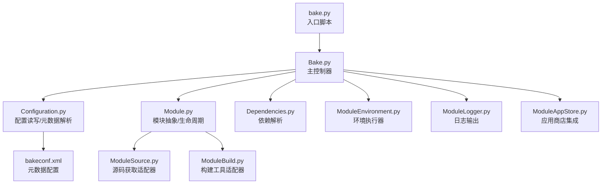
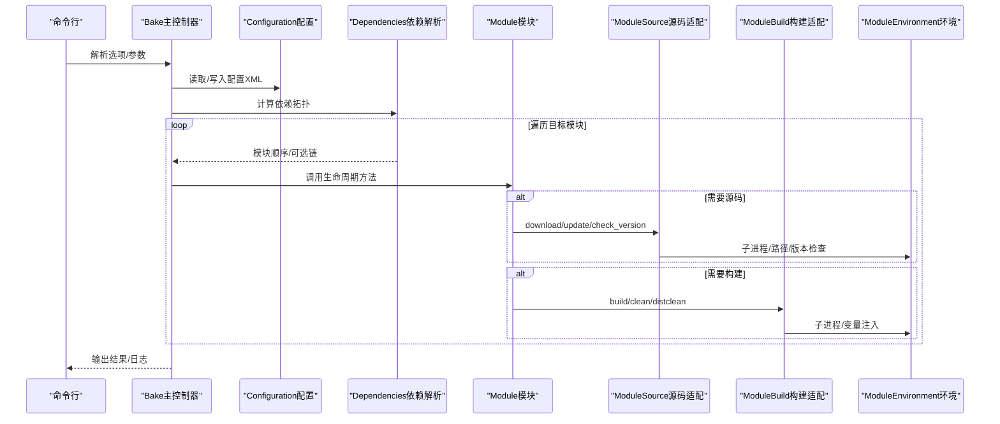
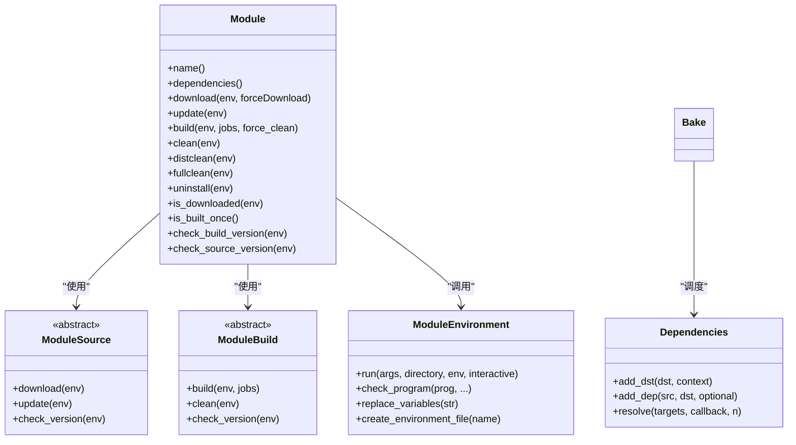
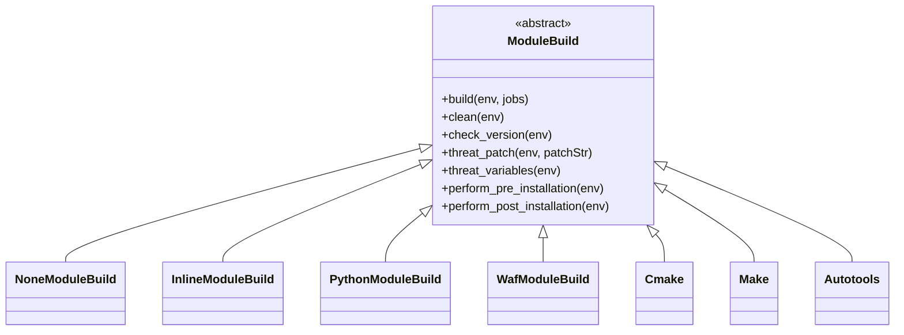
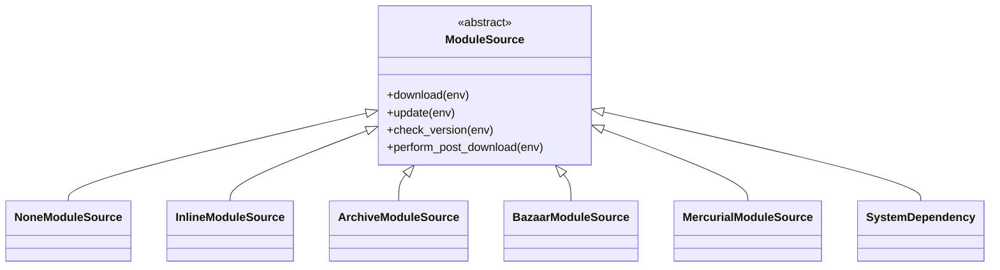
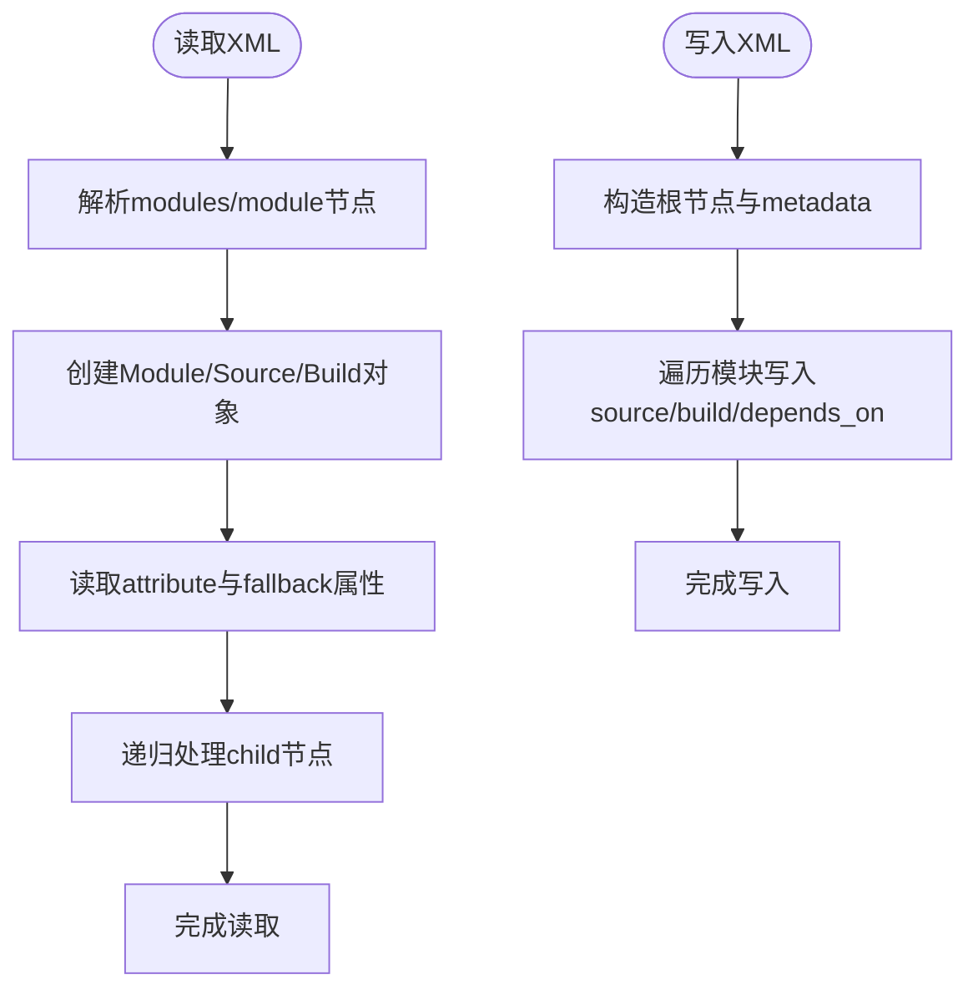
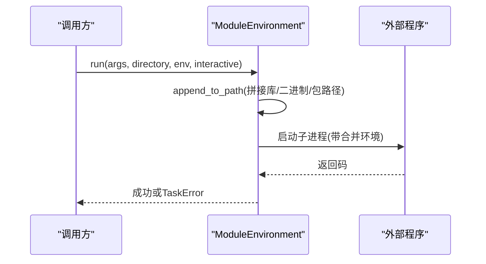
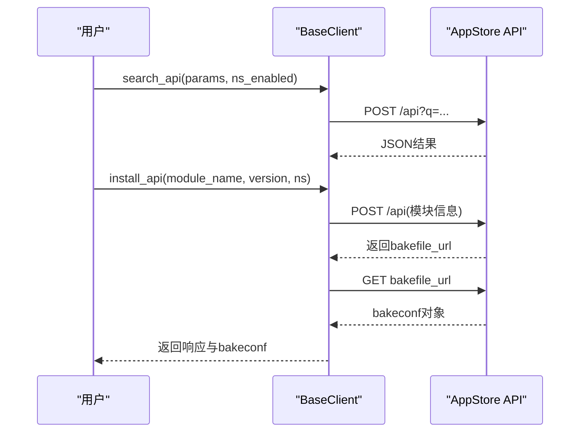
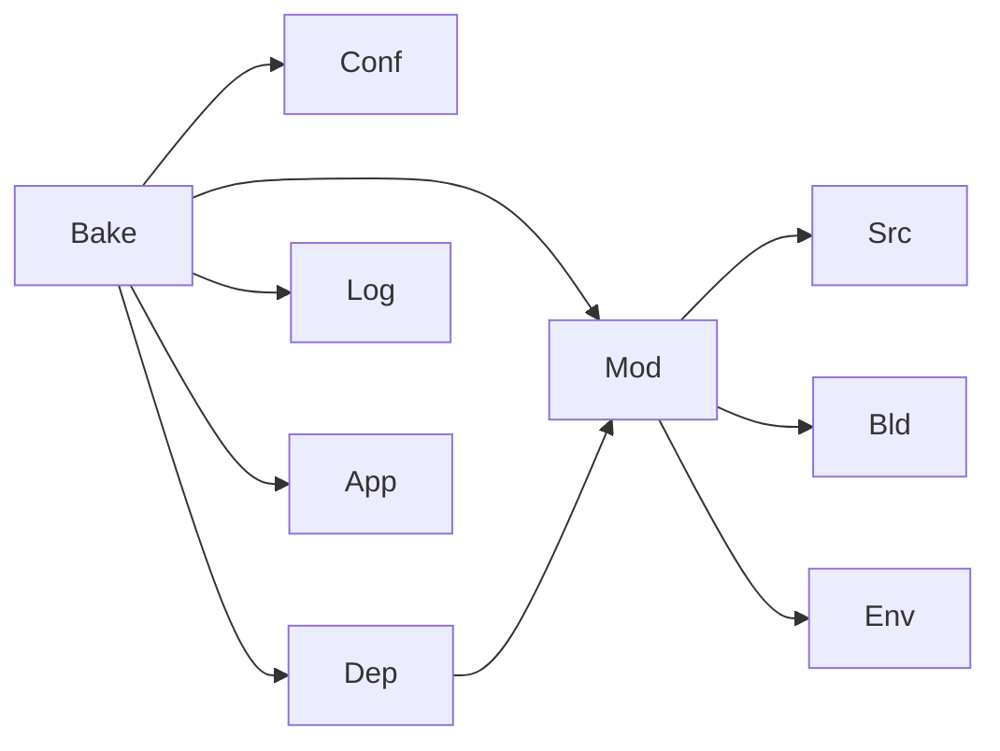

# 扩展开发

<cite>
**本文引用的文件**   
- [Bake.py](file://simulator/bake/bake/Bake.py)
- [Configuration.py](file://simulator/bake/bake/Configuration.py)
- [Module.py](file://simulator/bake/bake/Module.py)
- [ModuleBuild.py](file://simulator/bake/bake/ModuleBuild.py)
- [ModuleEnvironment.py](file://simulator/bake/bake/ModuleEnvironment.py)
- [ModuleSource.py](file://simulator/bake/bake/ModuleSource.py)
- [Dependencies.py](file://simulator/bake/bake/Dependencies.py)
- [Utils.py](file://simulator/bake/bake/Utils.py)
- [ModuleLogger.py](file://simulator/bake/bake/ModuleLogger.py)
- [ModuleAppStore.py](file://simulator/bake/bake/ModuleAppStore.py)
- [bake.py](file://simulator/bake/bake.py)
- [bakeconf.xml](file://simulator/bake/bakeconf.xml)
- [examples/ns3/bakeconf.xml](file://simulator/bake/examples/ns3/bakeconf.xml)
- [examples/ns3/predefined.xml](file://simulator/bake/examples/ns3/predefined.xml)
- [examples/numesis/bakeconf.xml](file://simulator/bake/examples/numesis/bakeconf.xml)
- [test/TestModuleBuild.py](file://simulator/bake/test/TestModuleBuild.py)
- [test/TestModuleSource.py](file://simulator/bake/test/TestModuleSource.py)
- [test/TestModuleDependencies.py](file://simulator/bake/test/TestModuleDependencies.py)
- [test/TestModuleEnvironment.py](file://simulator/bake/test/TestModuleEnvironment.py)
- [test/TestModuleUtils.py](file://simulator/bake/test/TestModuleUtils.py)
- [test/TestBake.py](file://simulator/bake/test/TestBake.py)
</cite>

## 目录
1. [简介](#简介)
2. [项目结构](#项目结构)
3. [核心组件](#核心组件)
4. [架构总览](#架构总览)
5. [详细组件分析](#详细组件分析)
6. [依赖分析](#依赖分析)
7. [性能考虑](#性能考虑)
8. [故障排查指南](#故障排查指南)
9. [结论](#结论)
10. [附录](#附录)

## 简介
本指南面向需要在NS-3数据中心平台基础上进行扩展开发的高级用户，系统讲解Bake扩展系统的架构设计、模块开发流程与发布管理策略。内容覆盖：模块模板与接口规范、构建配置与测试方法、最佳实践与质量保障、实际开发案例与调试技巧。通过本指南，您将获得从概念到落地的完整扩展开发解决方案。

## 项目结构
Bake位于simulator/bake目录下，采用分层模块化设计：
- 核心入口与控制流：bake.py、Bake.py
- 配置与元数据：Configuration.py、bakeconf.xml及示例
- 模块抽象与生命周期：Module.py
- 构建系统适配：ModuleBuild.py（支持make/cmake/waf/autotools/python等）
- 源码获取适配：ModuleSource.py（支持archive/bazaar/mercurial/system_dependency等）
- 环境交互：ModuleEnvironment.py
- 依赖解析：Dependencies.py
- 工具与日志：Utils.py、ModuleLogger.py
- 应用商店集成：ModuleAppStore.py
- 测试套件：test/ 下各单元测试

图表来源
- [bake.py:1-200](file://simulator/bake/bake.py#L1-L200)
- [Bake.py:70-120](file://simulator/bake/bake/Bake.py#L70-L120)
- [Configuration.py:81-120](file://simulator/bake/bake/Configuration.py#L81-L120)
- [Module.py:110-140](file://simulator/bake/bake/Module.py#L110-L140)
- [ModuleSource.py:55-100](file://simulator/bake/bake/ModuleSource.py#L55-L100)
- [ModuleBuild.py:46-95](file://simulator/bake/bake/ModuleBuild.py#L46-L95)
- [Dependencies.py:95-120](file://simulator/bake/bake/Dependencies.py#L95-L120)
- [ModuleEnvironment.py:36-70](file://simulator/bake/bake/ModuleEnvironment.py#L36-L70)
- [ModuleLogger.py:32-80](file://simulator/bake/bake/ModuleLogger.py#L32-L80)
- [ModuleAppStore.py:30-60](file://simulator/bake/bake/ModuleAppStore.py#L30-L60)
- [bakeconf.xml:1-100](file://simulator/bake/bakeconf.xml#L1-L100)

章节来源
- [bake.py:1-200](file://simulator/bake/bake.py#L1-L200)
- [bakeconf.xml:1-200](file://simulator/bake/bakeconf.xml#L1-L200)

## 核心组件
- 主控制器Bake：负责命令解析、配置加载、模块迭代与依赖解析、错误处理与日志输出。
- 配置系统Configuration：XML元数据解析与生成，预定义配置、启用/禁用模块集合持久化。
- 模块抽象Module：统一下载、更新、清理、构建、安装、卸载等生命周期操作；支持依赖声明与可选依赖链。
- 构建适配器ModuleBuild：封装make/cmake/waf/autotools/python/none/inline等构建方式。
- 源码适配器ModuleSource：封装archive/bazaar/mercurial/system_dependency/none/inline等源码获取方式。
- 环境执行器ModuleEnvironment：封装路径、变量、程序版本检测、子进程执行与sudo能力。
- 依赖解析Dependencies：拓扑排序、可选依赖处理、循环依赖检测与失败回退。
- 工具与日志Utils/ModuleLogger：参数拆分、XML美化、颜色输出、日志分级。
- 应用商店ModuleAppStore：与ns-3-AppStore交互，支持搜索与安装流程。

章节来源
- [Bake.py:70-120](file://simulator/bake/bake/Bake.py#L70-L120)
- [Configuration.py:81-120](file://simulator/bake/bake/Configuration.py#L81-L120)
- [Module.py:110-140](file://simulator/bake/bake/Module.py#L110-L140)
- [ModuleBuild.py:46-95](file://simulator/bake/bake/ModuleBuild.py#L46-L95)
- [ModuleSource.py:55-100](file://simulator/bake/bake/ModuleSource.py#L55-L100)
- [ModuleEnvironment.py:36-70](file://simulator/bake/bake/ModuleEnvironment.py#L36-L70)
- [Dependencies.py:95-120](file://simulator/bake/bake/Dependencies.py#L95-L120)
- [Utils.py:170-210](file://simulator/bake/bake/Utils.py#L170-L210)
- [ModuleLogger.py:32-80](file://simulator/bake/bake/ModuleLogger.py#L32-L80)
- [ModuleAppStore.py:30-60](file://simulator/bake/bake/ModuleAppStore.py#L30-L60)

## 架构总览
Bake以“配置驱动 + 适配器模式”为核心，通过XML元数据描述模块的源码获取、构建方式、依赖关系与预设变量，再由Bake调度执行。其关键流程如下：

图表来源
- [Bake.py:780-820](file://simulator/bake/bake/Bake.py#L780-L820)
- [Configuration.py:413-453](file://simulator/bake/bake/Configuration.py#L413-L453)
- [Dependencies.py:175-220](file://simulator/bake/bake/Dependencies.py#L175-L220)
- [Module.py:226-274](file://simulator/bake/bake/Module.py#L226-L274)
- [ModuleSource.py:91-100](file://simulator/bake/bake/ModuleSource.py#L91-L100)
- [ModuleBuild.py:99-105](file://simulator/bake/bake/ModuleBuild.py#L99-L105)
- [ModuleEnvironment.py:490-538](file://simulator/bake/bake/ModuleEnvironment.py#L490-L538)

## 详细组件分析

### 组件A：模块生命周期与接口规范
- 生命周期方法：download/update/build/clean/distclean/fullclean/uninstall/is_downloaded/is_built_once/check_build_version/check_source_version
- 依赖声明：ModuleDependency（含可选依赖），支持递归解析与去重
- 变量注入：支持CFLAGS/CXXFLAGS/LDFLAGS、PATH/LD_LIBRARY_PATH/PKG_CONFIG_PATH、新变量追加
- 错误处理：TaskError异常、可选停止模式、颜色输出与详细回溯

图表来源
- [Module.py:110-140](file://simulator/bake/bake/Module.py#L110-L140)
- [ModuleSource.py:55-100](file://simulator/bake/bake/ModuleSource.py#L55-L100)
- [ModuleBuild.py:46-95](file://simulator/bake/bake/ModuleBuild.py#L46-L95)
- [ModuleEnvironment.py:36-70](file://simulator/bake/bake/ModuleEnvironment.py#L36-L70)
- [Dependencies.py:95-120](file://simulator/bake/bake/Dependencies.py#L95-L120)

章节来源
- [Module.py:110-140](file://simulator/bake/bake/Module.py#L110-L140)
- [Module.py:226-274](file://simulator/bake/bake/Module.py#L226-L274)
- [Module.py:417-517](file://simulator/bake/bake/Module.py#L417-L517)

### 组件B：构建系统适配器（ModuleBuild）
- 支持类型：none、inline、python、waf、cmake、make、autotools
- 关键属性：objdir、patch、v_PATH/v_LD_LIBRARY/v_PKG_CONFIG、pre/post_installation、supported_os、ignore_predefined_flags、new_variable
- 版本校验：各工具版本要求（如cmake、make、waf）
- 参数传递：configure_arguments/build_arguments/install_arguments等

图表来源
- [ModuleBuild.py:46-95](file://simulator/bake/bake/ModuleBuild.py#L46-L95)
- [ModuleBuild.py:245-261](file://simulator/bake/bake/ModuleBuild.py#L245-L261)
- [ModuleBuild.py:289-349](file://simulator/bake/bake/ModuleBuild.py#L289-L349)
- [ModuleBuild.py:350-491](file://simulator/bake/bake/ModuleBuild.py#L350-L491)
- [ModuleBuild.py:493-614](file://simulator/bake/bake/ModuleBuild.py#L493-L614)
- [ModuleBuild.py:616-712](file://simulator/bake/bake/ModuleBuild.py#L616-L712)
- [ModuleBuild.py:714-800](file://simulator/bake/bake/ModuleBuild.py#L714-L800)

章节来源
- [ModuleBuild.py:245-261](file://simulator/bake/bake/ModuleBuild.py#L245-L261)
- [ModuleBuild.py:350-491](file://simulator/bake/bake/ModuleBuild.py#L350-L491)
- [ModuleBuild.py:493-614](file://simulator/bake/bake/ModuleBuild.py#L493-L614)

### 组件C：源码获取适配器（ModuleSource）
- 支持类型：none、inline、archive、bazaar、mercurial、system_dependency
- 关键属性：module_directory、patch、new_variable、post_download
- 系统依赖：支持表达式检测（文件/可执行/导入）、包管理器识别、可选sudo安装提示

图表来源
- [ModuleSource.py:55-100](file://simulator/bake/bake/ModuleSource.py#L55-L100)
- [ModuleSource.py:256-275](file://simulator/bake/bake/ModuleSource.py#L256-L275)
- [ModuleSource.py:277-289](file://simulator/bake/bake/ModuleSource.py#L277-L289)
- [ModuleSource.py:374-494](file://simulator/bake/bake/ModuleSource.py#L374-L494)
- [ModuleSource.py:290-332](file://simulator/bake/bake/ModuleSource.py#L290-L332)
- [ModuleSource.py:334-371](file://simulator/bake/bake/ModuleSource.py#L334-L371)
- [ModuleSource.py:496-800](file://simulator/bake/bake/ModuleSource.py#L496-L800)

章节来源
- [ModuleSource.py:374-494](file://simulator/bake/bake/ModuleSource.py#L374-L494)
- [ModuleSource.py:496-800](file://simulator/bake/bake/ModuleSource.py#L496-L800)

### 组件D：依赖解析与可选链
- 依赖图构建：add_dst/add_dep，支持可选依赖标记
- 拓扑排序：_sort按深度优先生成执行序列
- 失败处理：DependencyUnmet异常、可选依赖降级提示
- 可选链记录：recDependencies追踪可选依赖链

```mermaid
flowchart TD
Start(["开始"]) --> AddDsts["注册目标(add_dst)"]
AddDsts --> AddDeps["注册依赖(add_dep)<br/>标记可选"]
AddDeps --> Sort["_sort生成序列"]
Sort --> Loop{"逐个执行"}
Loop --> |成功| Next["下一个目标"]
Loop --> |失败且非可选| Raise["抛出DependencyUnmet"]
Loop --> |失败且可选| Warn["打印可选依赖警告"]
Next --> Loop
Warn --> Loop
Raise --> End(["结束"])
Loop --> |完成| End
```

图表来源
- [Dependencies.py:111-148](file://simulator/bake/bake/Dependencies.py#L111-L148)
- [Dependencies.py:253-297](file://simulator/bake/bake/Dependencies.py#L253-L297)
- [Dependencies.py:332-418](file://simulator/bake/bake/Dependencies.py#L332-L418)

章节来源
- [Dependencies.py:175-220](file://simulator/bake/bake/Dependencies.py#L175-L220)
- [Dependencies.py:434-467](file://simulator/bake/bake/Dependencies.py#L434-L467)

### 组件E：配置与元数据（Configuration）
- 元数据节点：modules/module/source/build/depends_on
- 预定义配置：predefined/enable/disable/set/append/configuration
- 写入/读取：defineXml/_write_metadata/_read_metadata
- 路径计算：相对根目录与绝对路径映射

图表来源
- [Configuration.py:308-373](file://simulator/bake/bake/Configuration.py#L308-L373)
- [Configuration.py:413-453](file://simulator/bake/bake/Configuration.py#L413-L453)
- [Configuration.py:403-412](file://simulator/bake/bake/Configuration.py#L403-L412)

章节来源
- [Configuration.py:103-182](file://simulator/bake/bake/Configuration.py#L103-L182)
- [Configuration.py:308-373](file://simulator/bake/bake/Configuration.py#L308-L373)

### 组件F：环境执行器（ModuleEnvironment）
- 路径与变量：LD_LIBRARY_PATH/PATH/PKG_CONFIG_PATH、PYTHONPATH
- 程序检测：check_program带版本正则匹配
- 子进程执行：run封装环境拼接、工作目录、标准流
- 环境文件：create_environment_file生成bash脚本

图表来源
- [ModuleEnvironment.py:490-538](file://simulator/bake/bake/ModuleEnvironment.py#L490-L538)
- [ModuleEnvironment.py:363-407](file://simulator/bake/bake/ModuleEnvironment.py#L363-L407)

章节来源
- [ModuleEnvironment.py:490-538](file://simulator/bake/bake/ModuleEnvironment.py#L490-L538)
- [ModuleEnvironment.py:363-407](file://simulator/bake/bake/ModuleEnvironment.py#L363-L407)

### 组件G：应用商店集成（ModuleAppStore）
- 搜索API：search_api(q, ns)
- 安装API：install_api(module_name, version, ns)，返回bakefile对象
- 基础URL：BASE_URL=https://apps.nsnam.org

图表来源
- [ModuleAppStore.py:46-98](file://simulator/bake/bake/ModuleAppStore.py#L46-L98)

章节来源
- [ModuleAppStore.py:30-98](file://simulator/bake/bake/ModuleAppStore.py#L30-L98)

## 依赖分析
- 组件耦合
  - Bake强依赖Configuration、Dependencies、Module、ModuleSource、ModuleBuild、ModuleEnvironment、ModuleLogger
  - Module对Source/Build为组合关系，对Environment进行子进程调用
  - Dependencies独立于具体模块，仅依赖ModuleDependency接口
- 外部依赖
  - requests（应用商店）
  - distro/platform/subprocess/regex等标准库
- 循环依赖
  - 未发现直接循环；依赖通过抽象接口解耦

图表来源
- [Bake.py:40-55](file://simulator/bake/bake/Bake.py#L40-L55)
- [Module.py:34-40](file://simulator/bake/bake/Module.py#L34-L40)
- [Dependencies.py:40-41](file://simulator/bake/bake/Dependencies.py#L40-L41)
- [ModuleAppStore.py:26-27](file://simulator/bake/bake/ModuleAppStore.py#L26-L27)

章节来源
- [Bake.py:40-55](file://simulator/bake/bake/Bake.py#L40-L55)
- [Module.py:34-40](file://simulator/bake/bake/Module.py#L34-L40)
- [Dependencies.py:40-41](file://simulator/bake/bake/Dependencies.py#L40-L41)

## 性能考虑
- 并行构建：Dependencies._resolve_parallel预留接口，当前回退串行；建议在稳定后启用多核构建
- 日志级别：-v/-vv/-vvv控制命令与标准输出分离，避免冗余I/O
- 变量注入：threat_variables批量追加PATH/LD_LIBRARY_PATH/PKG_CONFIG，减少重复查找
- 清理策略：clean/distclean/fullclean按需选择，避免重复编译
- 可选依赖：合理使用可选依赖降低构建失败概率，提升整体成功率

## 故障排查指南
- 常见错误
  - TaskError：子进程失败、版本不满足、权限不足
  - DependencyUnmet：不可满足依赖或可选依赖失败
  - ParseError：XML格式错误或哈希不一致
- 排查步骤
  - 使用--debug/--verbose查看详细回溯与命令输出
  - 使用fix-config修复配置文件与启用状态
  - 使用--stop-on-error在首次错误时中断
  - 检查supported_os与系统版本匹配
  - 使用--sudo尝试以管理员权限安装系统依赖
- 相关实现
  - 异常捕获与回溯打印：Utils.print_backtrace
  - 错误包装与传播：TaskError/DependencyUnmet
  - 配置修复：Bake._fix_config
  - 环境变量注入：ModuleEnvironment.append_to_path

章节来源
- [Utils.py:35-62](file://simulator/bake/bake/Utils.py#L35-L62)
- [Dependencies.py:46-55](file://simulator/bake/bake/Dependencies.py#L46-L55)
- [Bake.py:92-206](file://simulator/bake/bake/Bake.py#L92-L206)
- [ModuleEnvironment.py:464-488](file://simulator/bake/bake/ModuleEnvironment.py#L464-L488)

## 结论
Bake通过清晰的抽象与适配器模式，将复杂的模块构建与依赖管理问题转化为可配置、可扩展、可测试的工程化流程。遵循本文档的接口规范、开发流程与最佳实践，您可以高效地为NS-3数据中心平台开发高质量扩展模块，并通过测试与调试确保稳定性与可维护性。

## 附录

### A. 自定义模块开发流程
- 步骤
  1) 在bakeconf.xml中新增modules/module节点，设置name/type/min_version/max_version
  2) 配置source节点：type为archive/bazaar/mercurial/system_dependency等，填写必要属性
  3) 配置build节点：type为make/cmake/waf/autotools/python/none/inline等，填写构建参数
  4) 在depends_on中声明依赖模块（可选）
  5) 使用predefined定义常用组合，便于快速启用/禁用
  6) 运行bake configure/list/enable/disable等命令验证
  7) 执行bake download/build/clean等生命周期命令
- 示例参考
  - [bakeconf.xml:1-200](file://simulator/bake/bakeconf.xml#L1-L200)
  - [examples/ns3/bakeconf.xml:1-200](file://simulator/bake/examples/ns3/bakeconf.xml#L1-L200)
  - [examples/ns3/predefined.xml:1-200](file://simulator/bake/examples/ns3/predefined.xml#L1-L200)
  - [examples/numesis/bakeconf.xml:1-200](file://simulator/bake/examples/numesis/bakeconf.xml#L1-L200)

章节来源
- [Configuration.py:308-373](file://simulator/bake/bake/Configuration.py#L308-L373)
- [ModuleSource.py:374-494](file://simulator/bake/bake/ModuleSource.py#L374-L494)
- [ModuleBuild.py:493-614](file://simulator/bake/bake/ModuleBuild.py#L493-L614)

### B. 接口规范与约束
- 必填属性
  - source/build节点type必须存在，且对应适配器支持
  - inline类型需提供code子节点与classname属性
  - system_dependency需提供至少一种检测条件（file/executable/import）
- 可选属性
  - supported_os用于限制平台
  - ignore_predefined_flags允许忽略预设编译标志
  - 可选依赖通过ModuleDependency标记optional=true
- 变量注入
  - v_PATH/v_LD_LIBRARY/v_PKG_CONFIG/new_variable用于环境变量追加
  - CFLAGS/CXXFLAGS/LDFLAGS用于编译器标志

章节来源
- [Configuration.py:187-227](file://simulator/bake/bake/Configuration.py#L187-L227)
- [ModuleBuild.py:56-81](file://simulator/bake/bake/ModuleBuild.py#L56-L81)
- [ModuleSource.py:63-75](file://simulator/bake/bake/ModuleSource.py#L63-L75)

### C. 构建配置要点
- make/cmake/waf/autotools
  - configure_arguments/build_arguments/install_arguments用于传参
  - objdir用于区分源/目标目录
- python
  - 使用setup.py build/install，支持--install-*路径参数
- none/inline
  - none适用于无需构建的模块
  - inline支持内联Python代码作为构建逻辑

章节来源
- [ModuleBuild.py:350-491](file://simulator/bake/bake/ModuleBuild.py#L350-L491)
- [ModuleBuild.py:493-614](file://simulator/bake/bake/ModuleBuild.py#L493-L614)
- [ModuleBuild.py:616-712](file://simulator/bake/bake/ModuleBuild.py#L616-L712)
- [ModuleBuild.py:714-800](file://simulator/bake/bake/ModuleBuild.py#L714-L800)
- [ModuleBuild.py:289-349](file://simulator/bake/bake/ModuleBuild.py#L289-L349)

### D. 测试方法与质量保证
- 单元测试
  - test/TestModuleBuild.py：构建适配器测试
  - test/TestModuleSource.py：源码适配器测试
  - test/TestModuleDependencies.py：依赖解析测试
  - test/TestModuleEnvironment.py：环境执行器测试
  - test/TestModuleUtils.py：工具函数测试
  - test/TestBake.py：主控制器集成测试
- 质量保障
  - 使用--debug与详细日志定位问题
  - 预定义配置减少手工配置误差
  - 可选依赖降低整体失败率
  - 建议在CI中执行测试套件

章节来源
- [test/TestModuleBuild.py:1-200](file://simulator/bake/test/TestModuleBuild.py#L1-L200)
- [test/TestModuleSource.py:1-200](file://simulator/bake/test/TestModuleSource.py#L1-L200)
- [test/TestModuleDependencies.py:1-200](file://simulator/bake/test/TestModuleDependencies.py#L1-L200)
- [test/TestModuleEnvironment.py:1-200](file://simulator/bake/test/TestModuleEnvironment.py#L1-L200)
- [test/TestModuleUtils.py:1-200](file://simulator/bake/test/TestModuleUtils.py#L1-L200)
- [test/TestBake.py:1-200](file://simulator/bake/test/TestBake.py#L1-L200)

### E. 实际开发案例与调试技巧
- 案例
  - 使用archive类型引入第三方压缩包，设置extract_directory与post_download
  - 使用waf类型配置configure_arguments与build_arguments
  - 使用system_dependency声明系统依赖并通过包管理器安装
- 调试
  - 使用--logdir按模块输出日志，便于定位问题模块
  - 使用--one/--start/--after精确控制执行范围
  - 使用--sudo在具备权限时自动安装系统依赖
  - 使用pre_installation/post_installation钩子执行前置/后置命令

章节来源
- [ModuleSource.py:374-494](file://simulator/bake/bake/ModuleSource.py#L374-L494)
- [ModuleBuild.py:401-462](file://simulator/bake/bake/ModuleBuild.py#L401-L462)
- [ModuleSource.py:496-800](file://simulator/bake/bake/ModuleSource.py#L496-L800)
- [Bake.py:759-780](file://simulator/bake/bake/Bake.py#L759-L780)
- [ModuleEnvironment.py:363-407](file://simulator/bake/bake/ModuleEnvironment.py#L363-L407)