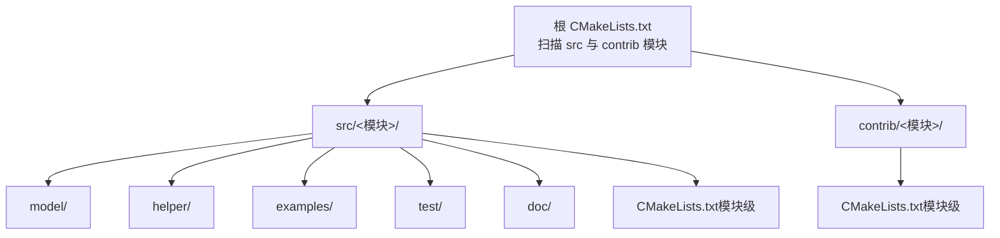
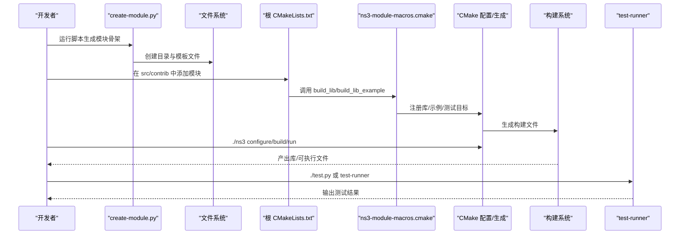
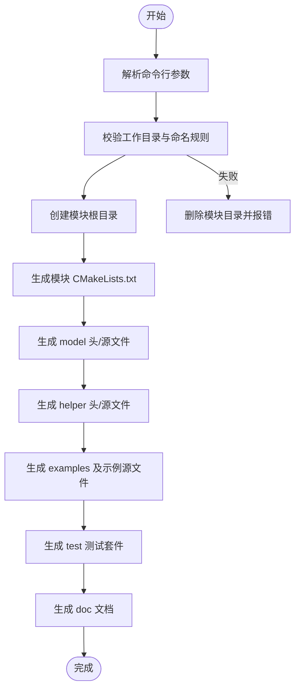
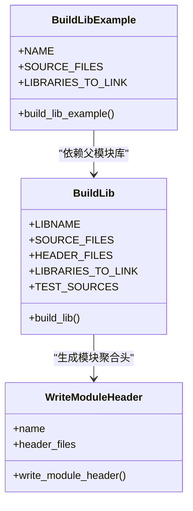
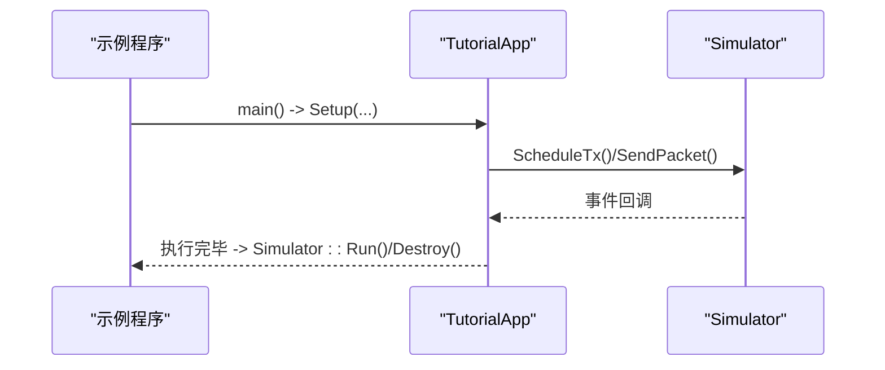
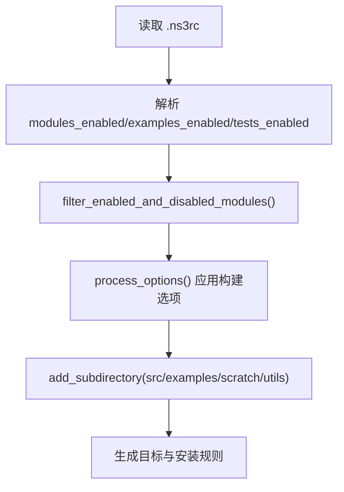
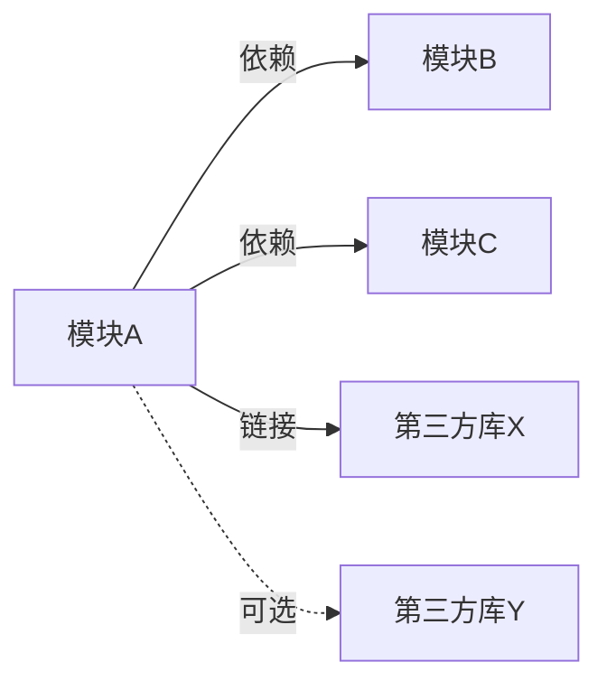

# 自定义模块开发

<cite>
**本文引用的文件**   
- [create-module.py](file://simulator/ns-3.39/utils/create-module.py)
- [CMakeLists.txt（根）](file://simulator/ns-3.39/CMakeLists.txt)
- [ns3-module-macros.cmake](file://simulator/ns-3.39/build-support/custom-modules/ns3-module-macros.cmake)
- [CMakeLists.txt（core 模块）](file://simulator/ns-3.39/src/core/CMakeLists.txt)
- [object.h](file://simulator/ns-3.39/src/core/model/object.h)
- [tutorial-app.h](file://simulator/ns-3.39/examples/tutorial/tutorial-app.h)
- [working-with-cmake.rst](file://simulator/ns-3.39/doc/manual/source/working-with-cmake.rst)
- [new-modules.rst](file://simulator/ns-3.39/doc/manual/source/new-modules.rst)
- [test-runner.cc](file://simulator/ns-3.39/utils/test-runner.cc)
- [utils.py](file://simulator/ns-3.39/utils.py)
</cite>

## 目录
1. [引言](#引言)
2. [项目结构](#项目结构)
3. [核心组件](#核心组件)
4. [架构总览](#架构总览)
5. [详细组件分析](#详细组件分析)
6. [依赖分析](#依赖分析)
7. [性能考虑](#性能考虑)
8. [故障排查指南](#故障排查指南)
9. [结论](#结论)
10. [附录](#附录)

## 引言
本指南面向希望扩展 NS-3 功能的高级开发者，系统讲解如何从零开始创建自定义模块，覆盖模块模板生成、目录结构、CMake 配置、接口设计与命名规范、测试与示例编写、构建与调试、以及集成验证的完整生命周期。文档以仓库中的工具与现有模块为依据，确保内容可操作、可落地。

## 项目结构
NS-3 使用 CMake 作为构建系统，模块通常位于 src/<module> 或 contrib/<module>。每个模块的标准目录包含：
- model：核心模型实现（.cc/.h）
- helper：用户友好的辅助类与工厂（.cc/.h）
- examples：示例程序（含 CMakeLists.txt）
- test：单元测试与回归测试（含 examples-to-run.py）
- doc：模块文档（.rst）
- 根目录 CMakeLists.txt：声明模块、源文件、依赖与测试

图示来源
- [CMakeLists.txt（根）:128-144](file://simulator/ns-3.39/CMakeLists.txt#L128-L144)
- [new-modules.rst:19-44](file://simulator/ns-3.39/doc/manual/source/new-modules.rst#L19-L44)

章节来源
- [CMakeLists.txt（根）:128-144](file://simulator/ns-3.39/CMakeLists.txt#L128-L144)
- [new-modules.rst:19-44](file://simulator/ns-3.39/doc/manual/source/new-modules.rst#L19-L44)

## 核心组件
- 模块模板生成器：utils/create-module.py 负责生成标准目录与骨架文件（CMakeLists、头/源文件、示例、测试、文档），并支持在 src 或 contrib 下创建模块，或按项目路径分组。
- 模块宏与打包：build-support/custom-modules/ns3-module-macros.cmake 定义 build_lib/build_lib_example 等宏，统一处理库目标、公共头安装、测试库、示例子目录递归等。
- 构建入口与选项：根 CMakeLists.txt 提供构建选项（启用示例/测试/日志/断言等）、过滤模块列表、加载 .ns3rc 并写入配置表。
- 示例与测试框架：examples/tutorial/tutorial-app.h 展示应用层组件的典型接口；utils/test-runner.cc 提供测试运行入口；doc/manual/source/tests.rst 指向测试相关章节。

章节来源
- [create-module.py:422-450](file://simulator/ns-3.39/utils/create-module.py#L422-L450)
- [ns3-module-macros.cmake:34-395](file://simulator/ns-3.39/build-support/custom-modules/ns3-module-macros.cmake#L34-L395)
- [CMakeLists.txt（根）:20-108](file://simulator/ns-3.39/CMakeLists.txt#L20-L108)
- [tutorial-app.h:16-79](file://simulator/ns-3.39/examples/tutorial/tutorial-app.h#L16-L79)
- [test-runner.cc:18-24](file://simulator/ns-3.39/utils/test-runner.cc#L18-L24)

## 架构总览
下图展示模块从模板生成到构建、测试与运行的整体流程。

图示来源
- [create-module.py:422-450](file://simulator/ns-3.39/utils/create-module.py#L422-L450)
- [CMakeLists.txt（根）:128-144](file://simulator/ns-3.39/CMakeLists.txt#L128-L144)
- [ns3-module-macros.cmake:34-395](file://simulator/ns-3.39/build-support/custom-modules/ns3-module-macros.cmake#L34-L395)
- [test-runner.cc:18-24](file://simulator/ns-3.39/utils/test-runner.cc#L18-L24)

## 详细组件分析

### 组件A：模块模板生成器（create-module.py）
- 功能要点
  - 生成模块目录结构与骨架文件：CMakeLists.txt、model/*.h/.cc、helper/*.h/.cc、examples/*-example.cc、test/*-test-suite.cc、doc/*.rst。
  - 支持在 src 或 contrib 下创建模块，或通过 --project 指定项目路径进行批量生成。
  - 命名限制与路径解析：仅允许字母、数字、连字符与下划线；自动去除多余路径分隔符；校验项目路径合法性。
  - 错误回滚：若任一步骤失败，删除已创建的模块目录，避免半成品状态。
- 关键行为
  - make_module：依次调用 make_cmakelists、make_model、make_helper、make_examples、make_test、make_doc。
  - 参数解析与校验：检查工作目录是否存在 src/contrib；校验模块名与项目路径字符集；处理 src/ 与 contrib/ 前缀。
  - 输出提示：成功后提示运行 ./ns3 configure 以纳入构建。

图示来源
- [create-module.py:422-450](file://simulator/ns-3.39/utils/create-module.py#L422-L450)
- [create-module.py:549-654](file://simulator/ns-3.39/utils/create-module.py#L549-L654)

章节来源
- [create-module.py:422-450](file://simulator/ns-3.39/utils/create-module.py#L422-L450)
- [create-module.py:549-654](file://simulator/ns-3.39/utils/create-module.py#L549-L654)

### 组件B：模块宏与目标注册（ns3-module-macros.cmake）
- 功能要点
  - build_lib：定义模块库目标、公共头安装、链接第三方与 ns-3 内部库、生成模块聚合头、复制头文件、递归构建 examples、条件构建 tests。
  - build_lib_example：定义示例可执行文件，自动注入父模块与示例所需依赖。
  - write_module_header：生成模块聚合头（<ns3/<module>-module.h>），便于用户通过单一 include 访问模块 API。
- 依赖传播
  - 将 ns-3 模块库与第三方库分别标记为 PUBLIC/PRIVATE，避免不必要地暴露第三方 include 与链接项。
  - 对 Xcode 特殊分支处理对象库与预编译头。

图示来源
- [ns3-module-macros.cmake:34-395](file://simulator/ns-3.39/build-support/custom-modules/ns3-module-macros.cmake#L34-L395)
- [ns3-module-macros.cmake:408-451](file://simulator/ns-3.39/build-support/custom-modules/ns3-module-macros.cmake#L408-L451)
- [ns3-module-macros.cmake:453-502](file://simulator/ns-3.39/build-support/custom-modules/ns3-module-macros.cmake#L453-L502)

章节来源
- [ns3-module-macros.cmake:34-395](file://simulator/ns-3.39/build-support/custom-modules/ns3-module-macros.cmake#L34-L395)
- [ns3-module-macros.cmake:408-451](file://simulator/ns-3.39/build-support/custom-modules/ns3-module-macros.cmake#L408-L451)
- [ns3-module-macros.cmake:453-502](file://simulator/ns-3.39/build-support/custom-modules/ns3-module-macros.cmake#L453-L502)

### 组件C：模块示例与测试（示例与测试框架）
- 示例程序
  - examples/tutorial/tutorial-app.h 展示了基于 ns-3 的应用层组件设计：继承 Application，提供 Setup 接口、事件调度与生命周期钩子。
  - examples/CMakeLists.txt 使用 build_lib_example 宏声明示例，指定源文件与依赖模块。
- 测试框架
  - utils/test-runner.cc 提供统一测试入口，调用 ns3::TestRunner::Run(argc, argv)。
  - test/*-test-suite.cc 使用 TestCase/TestSuite 框架，按模块组织测试用例与测试套件。

图示来源
- [tutorial-app.h:16-79](file://simulator/ns-3.39/examples/tutorial/tutorial-app.h#L16-L79)
- [test-runner.cc:18-24](file://simulator/ns-3.39/utils/test-runner.cc#L18-L24)

章节来源
- [tutorial-app.h:16-79](file://simulator/ns-3.39/examples/tutorial/tutorial-app.h#L16-L79)
- [test-runner.cc:18-24](file://simulator/ns-3.39/utils/test-runner.cc#L18-L24)

### 组件D：构建与配置（根 CMakeLists.txt 与 .ns3rc）
- 构建选项
  - 提供 ENABLE_EXAMPLES、ENABLE_TESTS、ENABLE_LOG、ENABLE_ASSERT 等开关；默认关闭，可通过 ./ns3 configure 启用。
  - 支持多种构建类型（debug/release/optimized/minsizerel），映射到 CMAKE_BUILD_TYPE 与编译器标志。
- 模块过滤
  - NS3_ENABLED_MODULES/NS3_DISABLED_MODULES 控制模块集合；.ns3rc 文件中 modules_enabled/examples_enabled/tests_enabled 影响默认行为。
- 子目录扫描与目标生成
  - 扫描 src 与 contrib 下模块，调用 add_subdirectory 加载；生成包导出与版本信息。

图示来源
- [CMakeLists.txt（根）:134-167](file://simulator/ns-3.39/CMakeLists.txt#L134-L167)
- [utils.py:89-124](file://simulator/ns-3.39/utils.py#L89-L124)

章节来源
- [CMakeLists.txt（根）:20-108](file://simulator/ns-3.39/CMakeLists.txt#L20-L108)
- [CMakeLists.txt（根）:134-167](file://simulator/ns-3.39/CMakeLists.txt#L134-L167)
- [utils.py:89-124](file://simulator/ns-3.39/utils.py#L89-L124)

### 组件E：模块示例（core 模块）
- core 模块展示了典型的模块组织方式：按功能拆分 model、helper、test、doc，使用条件编译与可选特性（如 Boost Units、嵌入版本信息、平台特定源文件）。
- 通过 build_lib 宏集中声明源文件、头文件与测试，简化维护。

章节来源
- [CMakeLists.txt（core 模块）:142-214](file://simulator/ns-3.39/src/core/CMakeLists.txt#L142-L214)
- [CMakeLists.txt（core 模块）:216-321](file://simulator/ns-3.39/src/core/CMakeLists.txt#L216-L321)
- [CMakeLists.txt（core 模块）:323-358](file://simulator/ns-3.39/src/core/CMakeLists.txt#L323-L358)
- [CMakeLists.txt（core 模块）:360-368](file://simulator/ns-3.39/src/core/CMakeLists.txt#L360-L368)

## 依赖分析
- 模块间依赖
  - 模块只声明直接依赖（例如 core 已被 internet/mobility/aodv 等间接依赖），避免重复列出 core。
  - 通过 ${lib<module>} 形式链接，CMake 自动推导传递闭包。
- 第三方库链接
  - 使用 find_external_library 宏探测外部库，再通过 include_directories/link_libraries 注入到目标。
  - 可选择将第三方库仅链接到模块库（PRIVATE）或公开导出（PUBLIC），取决于是否需要对外暴露。

图示来源
- [working-with-cmake.rst:720-740](file://simulator/ns-3.39/doc/manual/source/working-with-cmake.rst#L720-L740)
- [working-with-cmake.rst:742-800](file://simulator/ns-3.39/doc/manual/source/working-with-cmake.rst#L742-L800)

章节来源
- [working-with-cmake.rst:720-740](file://simulator/ns-3.39/doc/manual/source/working-with-cmake.rst#L720-L740)
- [working-with-cmake.rst:742-800](file://simulator/ns-3.39/doc/manual/source/working-with-cmake.rst#L742-L800)

## 性能考虑
- 编译性能
  - 启用 ccache 与预编译头（PRECOMPILE_HEADERS）可显著缩短增量编译时间。
  - 使用 Ninja 生成器与快速链接器（Mold/LLD）提升构建速度。
- 运行时性能
  - 优化构建类型（release/optimized）关闭断言与日志，减少运行时开销。
  - 合理拆分模块，避免不必要的链接与初始化。

## 故障排查指南
- 模块未被构建
  - 确认已运行 ./ns3 configure 以刷新 CMake 缓存；检查 NS3_ENABLED_MODULES/NS3_DISABLED_MODULES 与 .ns3rc 设置。
- 头文件缺失
  - build_lib 会校验 PUBLIC_HEADER 列表，若发现缺失头文件会致命错误；请核对 CMakeLists.txt 中 HEADER_FILES。
- 示例/测试无法运行
  - 确保 ENABLE_EXAMPLES/ENABLE_TESTS 已开启；检查 examples/CMakeLists.txt 与 test/examples-to-run.py。
- 调试与日志
  - 使用 ./ns3 run <target> --gdb 或 ./ns3 run <target> --valgrind；在 CMake 配置中开启 NS3_ASSERT/NS3_LOG 以增强诊断能力。

章节来源
- [CMakeLists.txt（根）:20-108](file://simulator/ns-3.39/CMakeLists.txt#L20-L108)
- [ns3-module-macros.cmake:254-269](file://simulator/ns-3.39/build-support/custom-modules/ns3-module-macros.cmake#L254-L269)
- [working-with-cmake.rst:587-645](file://simulator/ns-3.39/doc/manual/source/working-with-cmake.rst#L587-L645)

## 结论
通过 create-module.py 快速生成模块骨架，结合 ns3-module-macros.cmake 的 build_lib/build_lib_example 宏，配合根 CMakeLists.txt 的构建选项与 .ns3rc 配置，开发者可以高效地完成模块的设计、实现、测试与集成。遵循本文的命名规范、目录结构与依赖管理策略，可确保模块与 NS-3 生态无缝衔接，并具备良好的可维护性与可扩展性。

## 附录

### 开发步骤清单
- 使用 create-module.py 生成模块骨架
- 在模块根 CMakeLists.txt 中声明源文件、公共头文件与直接依赖
- 实现 model 与 helper，遵循 Doxygen 注释与分组
- 编写 test/*-test-suite.cc 与 examples/*-example.cc
- ./ns3 configure --enable-examples --enable-tests
- ./ns3 build 与 ./test.py 验证
- 如需 Python 绑定，启用 NS3_PYTHON_BINDINGS 并重新配置

章节来源
- [new-modules.rst:46-101](file://simulator/ns-3.39/doc/manual/source/new-modules.rst#L46-L101)
- [new-modules.rst:425-441](file://simulator/ns-3.39/doc/manual/source/new-modules.rst#L425-L441)