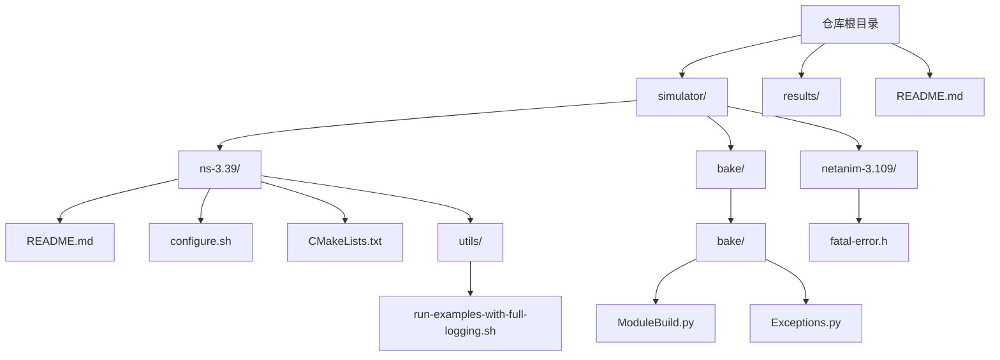
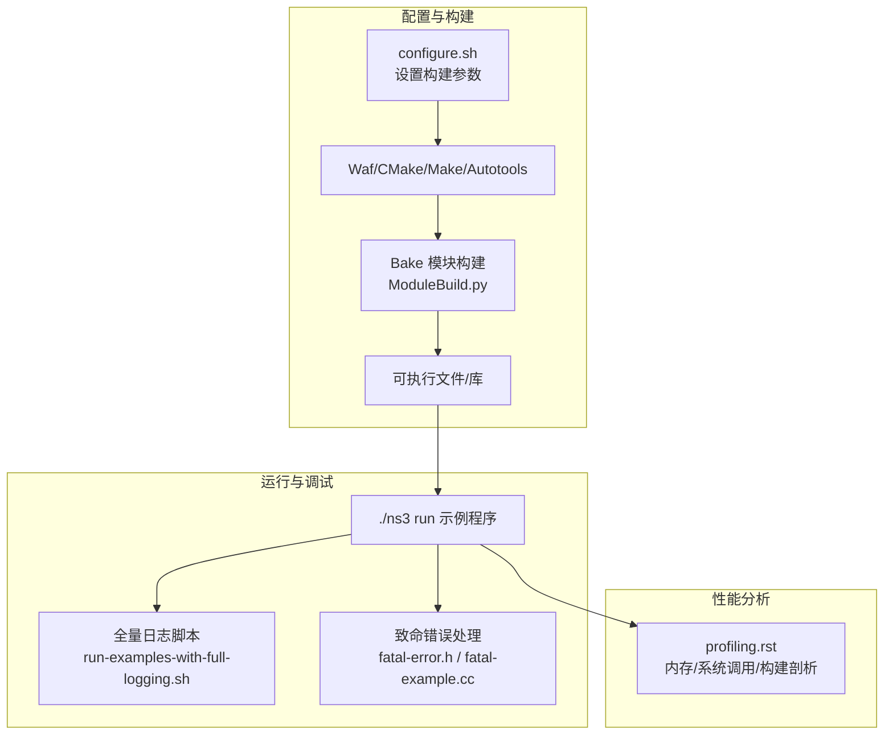
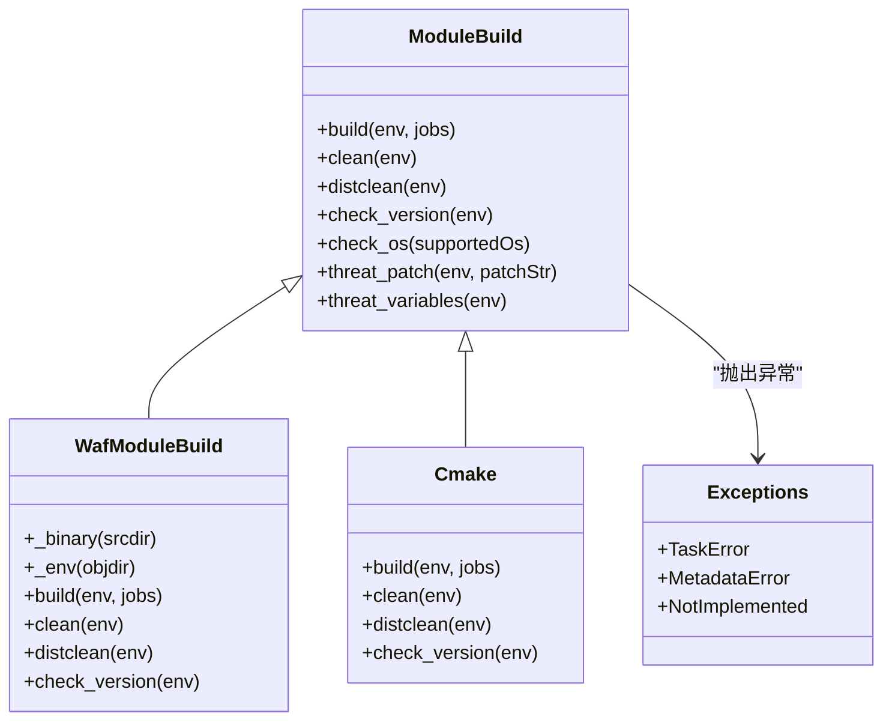
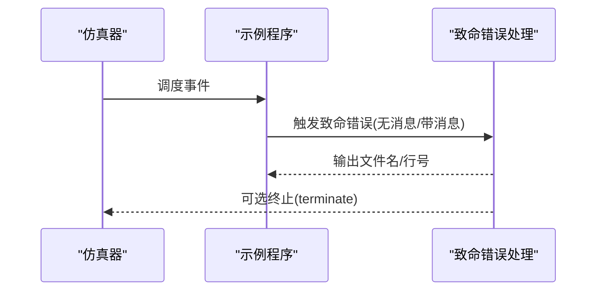
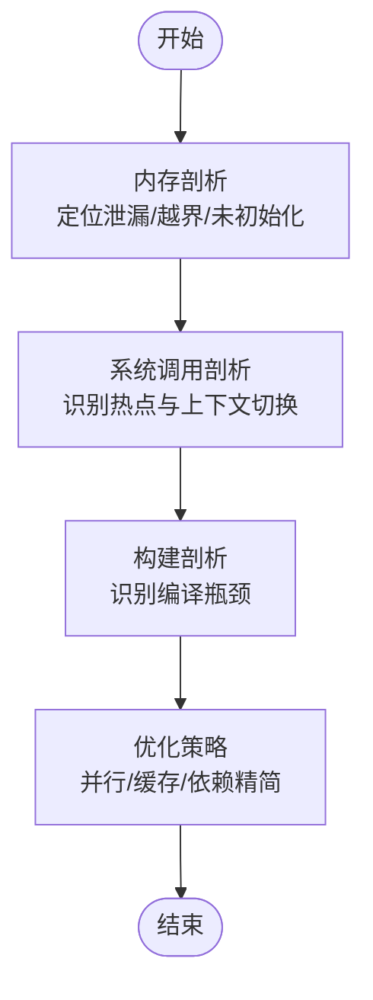
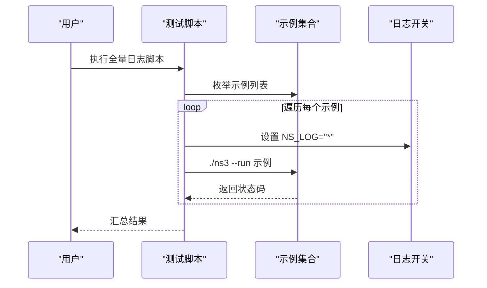
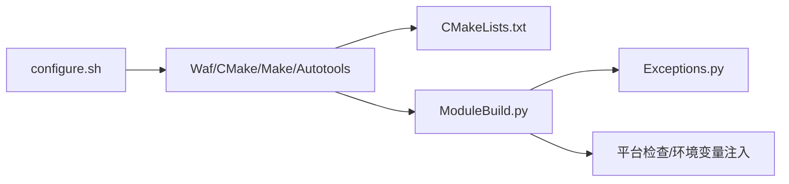

# 故障排除与FAQ

<cite>
**本文引用的文件**
- [README.md](file://README.md)
- [ns-3.39/README.md](file://simulator/ns-3.39/README.md)
- [configure.sh](file://simulator/ns-3.39/configure.sh)
- [run-examples-with-full-logging.sh](file://simulator/ns-3.39/utils/run-examples-with-full-logging.sh)
- [fatal-error.h](file://simulator/netanim-3.109/fatal-error.h)
- [fatal-example.cc](file://simulator/ns-3.39/src/core/examples/fatal-example.cc)
- [profiling.rst](file://simulator/ns-3.39/doc/manual/source/profiling.rst)
- [ModuleBuild.py](file://simulator/bake/bake/ModuleBuild.py)
- [Exceptions.py](file://simulator/bake/bake/Exceptions.py)
- [CMakeLists.txt](file://simulator/ns-3.39/CMakeLists.txt)
</cite>

## 目录
1. [简介](#简介)
2. [项目结构](#项目结构)
3. [核心组件](#核心组件)
4. [架构总览](#架构总览)
5. [详细组件分析](#详细组件分析)
6. [依赖关系分析](#依赖关系分析)
7. [性能注意事项](#性能注意事项)
8. [故障排除指南](#故障排除指南)
9. [结论](#结论)
10. [附录](#附录)

## 简介
本指南面向在使用 NS-3 数据中心平台（基于 ns-3.39）进行仿真研究与开发的用户，聚焦于常见编译错误、运行时错误、性能问题与配置问题的系统性排查与解决。内容涵盖：
- 编译阶段：工具链版本、构建参数、并行构建、安装权限等
- 运行阶段：致命错误处理、日志开关、Python 绑定、示例程序执行
- 性能阶段：内存与系统调用分析、热点定位、构建过程性能优化
- 配置阶段：模块化构建工具（Bake）、目标平台兼容性、环境变量注入
- 社区支持：官方文档、教程与问题反馈渠道

## 项目结构
该仓库包含 NS-3 源码扩展与数据中心相关示例，核心目录如下：
- simulator/ns-3.39：NS-3.39 核心源码与示例、构建脚本与工具
- simulator/bake：模块化构建工具（Bake），用于管理多工具链与依赖
- simulator/netanim-3.109：网络动画可视化组件（含致命错误处理）
- results/：结果输出目录（示例）
- README.md：项目说明与使用指引

**图表来源**
- [README.md](file://README.md)
- [ns-3.39/README.md](file://simulator/ns-3.39/README.md)
- [configure.sh](file://simulator/ns-3.39/configure.sh)
- [CMakeLists.txt](file://simulator/ns-3.39/CMakeLists.txt)
- [run-examples-with-full-logging.sh](file://simulator/ns-3.39/utils/run-examples-with-full-logging.sh)
- [ModuleBuild.py](file://simulator/bake/bake/ModuleBuild.py)
- [Exceptions.py](file://simulator/bake/bake/Exceptions.py)
- [fatal-error.h](file://simulator/netanim-3.109/fatal-error.h)

**章节来源**
- [README.md](file://README.md)
- [ns-3.39/README.md](file://simulator/ns-3.39/README.md)

## 核心组件
- 构建与配置
  - 配置脚本：通过统一入口设置编译器标志、启用示例与 Python 绑定
  - 构建工具：支持 Waf、CMake、Make、Autotools 等多种后端
  - 模块化构建：Bake 提供跨平台、可扩展的模块构建流程
- 日志与致命错误
  - 致命错误宏：无消息/带消息两种形式，统一终止路径
  - 示例程序：演示如何在仿真中触发与处理致命错误
- 性能分析
  - 文档指南：内存与系统调用分析、性能剖析与构建过程优化
- 运行与示例
  - 示例运行脚本：一键全量日志开启运行所有示例，便于快速发现异常

**章节来源**
- [configure.sh](file://simulator/ns-3.39/configure.sh)
- [ModuleBuild.py](file://simulator/bake/bake/ModuleBuild.py)
- [Exceptions.py](file://simulator/bake/bake/Exceptions.py)
- [fatal-error.h](file://simulator/netanim-3.109/fatal-error.h)
- [fatal-example.cc](file://simulator/ns-3.39/src/core/examples/fatal-example.cc)
- [profiling.rst](file://simulator/ns-3.39/doc/manual/source/profiling.rst)
- [run-examples-with-full-logging.sh](file://simulator/ns-3.39/utils/run-examples-with-full-logging.sh)

## 架构总览
下图展示数据中心平台从“配置/构建”到“运行/分析”的整体流程。

**图表来源**
- [configure.sh](file://simulator/ns-3.39/configure.sh)
- [ModuleBuild.py](file://simulator/bake/bake/ModuleBuild.py)
- [run-examples-with-full-logging.sh](file://simulator/ns-3.39/utils/run-examples-with-full-logging.sh)
- [fatal-error.h](file://simulator/netanim-3.109/fatal-error.h)
- [fatal-example.cc](file://simulator/ns-3.39/src/core/examples/fatal-example.cc)
- [profiling.rst](file://simulator/ns-3.39/doc/manual/source/profiling.rst)

## 详细组件分析

### 组件A：构建系统与模块化工具（Bake）
- 功能要点
  - 支持多种构建后端（Waf、CMake、Make、Autotools、Python）
  - 平台检查与环境变量注入（PATH/LD_LIBRARY/PKG_CONFIG）
  - 安装前后钩子命令与补丁应用
  - 错误类型封装（TaskError、MetadataError、NotImplemented）
- 常见问题与对策
  - 平台不支持：检查 supported_os 属性与操作系统匹配
  - 工具缺失：确保所需工具已安装（如 patch、cmake、make、waf）
  - 权限不足：安装阶段需 sudo 权限或调整安装前缀
  - 补丁冲突：先 dry-run 检查是否已应用，避免重复打补丁

**图表来源**
- [ModuleBuild.py](file://simulator/bake/bake/ModuleBuild.py)
- [Exceptions.py](file://simulator/bake/bake/Exceptions.py)

**章节来源**
- [ModuleBuild.py](file://simulator/bake/bake/ModuleBuild.py)
- [Exceptions.py](file://simulator/bake/bake/Exceptions.py)

### 组件B：致命错误处理与调试
- 功能要点
  - 致命错误宏：无消息/带消息两种形式，统一输出文件名与行号，并可选择终止
  - 示例程序：演示在仿真事件中触发不同类型的致命错误
- 调试建议
  - 在关键路径插入致命错误宏以快速暴露逻辑错误
  - 结合日志与断点定位问题发生的时间点与上下文

**图表来源**
- [fatal-error.h](file://simulator/netanim-3.109/fatal-error.h)
- [fatal-example.cc](file://simulator/ns-3.39/src/core/examples/fatal-example.cc)

**章节来源**
- [fatal-error.h](file://simulator/netanim-3.109/fatal-error.h)
- [fatal-example.cc](file://simulator/ns-3.39/src/core/examples/fatal-example.cc)

### 组件C：性能分析与内存泄漏检测
- 内容概要
  - 内存剖析：定位未初始化内存、越界访问、空指针解引用与内存泄漏
  - 系统调用剖析：识别高频系统调用导致的上下文切换开销
  - 构建过程剖析：识别编译瓶颈，加速构建时间
- 推荐工具
  - 内存：Valgrind、Sanitizers、Heaptrack、Bytehound、gperftools
  - 系统调用：strace、perf
  - 构建：并行编译参数与缓存策略

**图表来源**
- [profiling.rst](file://simulator/ns-3.39/doc/manual/source/profiling.rst)

**章节来源**
- [profiling.rst](file://simulator/ns-3.39/doc/manual/source/profiling.rst)

### 组件D：示例运行与全量日志
- 功能要点
  - 自动枚举示例并批量运行
  - 全量日志开关（NS_LOG="*"）便于快速发现异常
- 使用建议
  - 在首次运行前先执行全量日志脚本，捕获潜在警告与错误
  - 对比启用/关闭日志时的行为差异，定位日志相关问题

**图表来源**
- [run-examples-with-full-logging.sh](file://simulator/ns-3.39/utils/run-examples-with-full-logging.sh)

**章节来源**
- [run-examples-with-full-logging.sh](file://simulator/ns-3.39/utils/run-examples-with-full-logging.sh)

## 依赖关系分析
- 构建后端与工具链
  - Waf：ns-3 默认构建方式；支持配置参数与并行构建
  - CMake：现代跨平台构建；需正确设置 objdir 与安装前缀
  - Make/Autotools：传统方式；注意版本要求与依赖
- 模块化构建（Bake）
  - 通过 ModuleBuild 抽象统一不同工具链行为
  - 通过 Exceptions 封装任务失败、元数据错误与未实现项
- 平台与环境
  - 支持的操作系统由 supported_os 控制
  - 环境变量注入（PATH/LD_LIBRARY/PKG_CONFIG）影响工具查找与链接

**图表来源**
- [configure.sh](file://simulator/ns-3.39/configure.sh)
- [CMakeLists.txt](file://simulator/ns-3.39/CMakeLists.txt)
- [ModuleBuild.py](file://simulator/bake/bake/ModuleBuild.py)
- [Exceptions.py](file://simulator/bake/bake/Exceptions.py)

**章节来源**
- [configure.sh](file://simulator/ns-3.39/configure.sh)
- [CMakeLists.txt](file://simulator/ns-3.39/CMakeLists.txt)
- [ModuleBuild.py](file://simulator/bake/bake/ModuleBuild.py)
- [Exceptions.py](file://simulator/bake/bake/Exceptions.py)

## 性能注意事项
- 并行构建
  - 合理设置并行度，避免资源争用导致的编译失败
- 内存与系统调用
  - 高频系统调用会增加上下文切换，影响仿真性能
- 构建缓存与增量编译
  - 利用工具链缓存减少重复工作量
- Python 绑定加载
  - Python 绑定首次加载耗时较长，建议预热或复用进程

[本节为通用指导，无需列出具体文件来源]

## 故障排除指南

### 一、编译错误
- 症状
  - 构建工具缺失（如 cmake、make、waf、patch）
  - 平台不被支持（supported_os 不匹配）
  - 安装权限不足（sudo 权限或安装前缀）
  - 补丁应用失败（文件不存在或已应用）
- 处理步骤
  - 安装缺失工具并确认版本满足要求
  - 检查 supported_os 与当前系统匹配情况
  - 使用 sudo 或修改安装前缀（如 CMAKE_INSTALL_PREFIX）
  - 使用 dry-run 检查补丁状态，避免重复应用
- 相关文件
  - [ModuleBuild.py](file://simulator/bake/bake/ModuleBuild.py)
  - [Exceptions.py](file://simulator/bake/bake/Exceptions.py)

**章节来源**
- [ModuleBuild.py](file://simulator/bake/bake/ModuleBuild.py)
- [Exceptions.py](file://simulator/bake/bake/Exceptions.py)

### 二、运行时错误
- 症状
  - 致命错误导致仿真提前终止
  - 示例程序运行失败（返回非零状态码）
- 处理步骤
  - 使用全量日志脚本快速定位异常
  - 在关键路径插入致命错误宏，缩小问题范围
  - 查看文件名与行号，结合上下文修复逻辑
- 相关文件
  - [run-examples-with-full-logging.sh](file://simulator/ns-3.39/utils/run-examples-with-full-logging.sh)
  - [fatal-error.h](file://simulator/netanim-3.109/fatal-error.h)
  - [fatal-example.cc](file://simulator/ns-3.39/src/core/examples/fatal-example.cc)

**章节来源**
- [run-examples-with-full-logging.sh](file://simulator/ns-3.39/utils/run-examples-with-full-logging.sh)
- [fatal-error.h](file://simulator/netanim-3.109/fatal-error.h)
- [fatal-example.cc](file://simulator/ns-3.39/src/core/examples/fatal-example.cc)

### 三、性能问题
- 症状
  - 仿真运行缓慢、内存占用高、系统调用频繁
- 处理步骤
  - 使用内存剖析工具（如 Valgrind/Sanitizers/Heaptrack）定位泄漏与越界
  - 分析系统调用热点，减少不必要的系统调用
  - 对构建过程进行剖析，优化并行度与缓存策略
- 相关文件
  - [profiling.rst](file://simulator/ns-3.39/doc/manual/source/profiling.rst)

**章节来源**
- [profiling.rst](file://simulator/ns-3.39/doc/manual/source/profiling.rst)

### 四、配置问题
- 症状
  - 构建参数不生效、环境变量未注入、objdir 未创建
- 处理步骤
  - 确认 configure.sh 中的构建参数与工具链一致
  - 检查 CMakeLists.txt 的安装前缀与 objdir 设置
  - 通过 ModuleBuild 的环境变量注入功能验证 PATH/LD_LIBRARY/PKG_CONFIG
- 相关文件
  - [configure.sh](file://simulator/ns-3.39/configure.sh)
  - [CMakeLists.txt](file://simulator/ns-3.39/CMakeLists.txt)
  - [ModuleBuild.py](file://simulator/bake/bake/ModuleBuild.py)

**章节来源**
- [configure.sh](file://simulator/ns-3.39/configure.sh)
- [CMakeLists.txt](file://simulator/ns-3.39/CMakeLists.txt)
- [ModuleBuild.py](file://simulator/bake/bake/ModuleBuild.py)

### 五、调试技巧清单
- 日志分析
  - 使用全量日志脚本快速发现异常
  - 在关键事件处打印日志，记录状态变化
- 断点调试
  - 在致命错误宏附近设置断点，观察调用栈
- 性能分析
  - 内存与系统调用剖析，定位瓶颈
- 内存泄漏检测
  - 使用 Sanitizers/Valgrind/Heaptrack 等工具
- Python 绑定
  - 预热绑定加载，避免首次启动延迟

**章节来源**
- [run-examples-with-full-logging.sh](file://simulator/ns-3.39/utils/run-examples-with-full-logging.sh)
- [profiling.rst](file://simulator/ns-3.39/doc/manual/source/profiling.rst)
- [fatal-error.h](file://simulator/netanim-3.109/fatal-error.h)

### 六、知识库（症状-原因-修复）
- 症状：构建失败（找不到工具）
  - 原因：工具未安装或版本过低
  - 修复：安装/升级工具并满足版本要求
- 症状：平台不被支持
  - 原因：supported_os 与当前系统不匹配
  - 修复：调整 supported_os 或切换受支持平台
- 症状：安装失败（权限不足）
  - 原因：缺少 sudo 权限或安装前缀配置错误
  - 修复：使用 sudo 或设置正确的安装前缀
- 症状：示例运行失败
  - 原因：日志未开启导致异常被隐藏
  - 修复：使用全量日志脚本运行示例
- 症状：仿真运行缓慢
  - 原因：系统调用频繁或内存分配过多
  - 修复：剖析系统调用与内存，优化算法与数据结构

[本节为知识库汇总，无需列出具体文件来源]

### 七、社区支持与问题反馈
- 官方文档与教程
  - NS-3 官方网站与文档：https://www.nsnam.org/documentation/
  - NS-3 开发者贡献指南：https://www.nsnam.org/developers/contributing-code/
- 示例与入门
  - NS-3 示例与教程：https://www.nsnam.org/documentation/latest/
- 问题反馈
  - 通过官方文档提供的渠道提交问题与建议

**章节来源**
- [ns-3.39/README.md](file://simulator/ns-3.39/README.md)

## 结论
本指南围绕 NS-3 数据中心平台的编译、运行、性能与配置四大维度，提供了系统化的故障排除方法与调试技巧。建议在日常工作中：
- 养成“先全量日志、再逐步收敛”的排查习惯
- 使用模块化构建工具统一管理工具链与平台差异
- 借助内存与系统调用剖析持续优化仿真性能
- 及时关注官方文档与社区动态，获取最新支持与补丁

[本节为总结，无需列出具体文件来源]

## 附录

### A. 快速参考：常用命令与文件
- 配置与构建
  - 配置：[configure.sh](file://simulator/ns-3.39/configure.sh)
  - 构建：Waf/CMake/Make/Autotools（依据项目配置）
- 运行与调试
  - 全量日志脚本：[run-examples-with-full-logging.sh](file://simulator/ns-3.39/utils/run-examples-with-full-logging.sh)
  - 致命错误处理：[fatal-error.h](file://simulator/netanim-3.109/fatal-error.h)
  - 示例程序：[fatal-example.cc](file://simulator/ns-3.39/src/core/examples/fatal-example.cc)
- 性能分析
  - 指南：[profiling.rst](file://simulator/ns-3.39/doc/manual/source/profiling.rst)
- 构建工具
  - 模块化构建：[ModuleBuild.py](file://simulator/bake/bake/ModuleBuild.py)
  - 异常定义：[Exceptions.py](file://simulator/bake/bake/Exceptions.py)

**章节来源**
- [configure.sh](file://simulator/ns-3.39/configure.sh)
- [run-examples-with-full-logging.sh](file://simulator/ns-3.39/utils/run-examples-with-full-logging.sh)
- [fatal-error.h](file://simulator/netanim-3.109/fatal-error.h)
- [fatal-example.cc](file://simulator/ns-3.39/src/core/examples/fatal-example.cc)
- [profiling.rst](file://simulator/ns-3.39/doc/manual/source/profiling.rst)
- [ModuleBuild.py](file://simulator/bake/bake/ModuleBuild.py)
- [Exceptions.py](file://simulator/bake/bake/Exceptions.py)