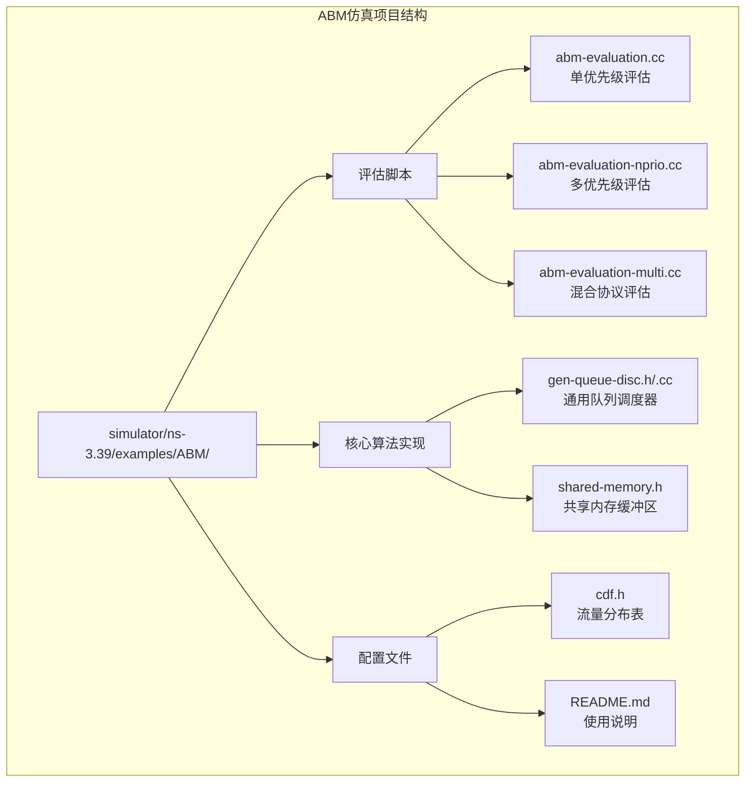
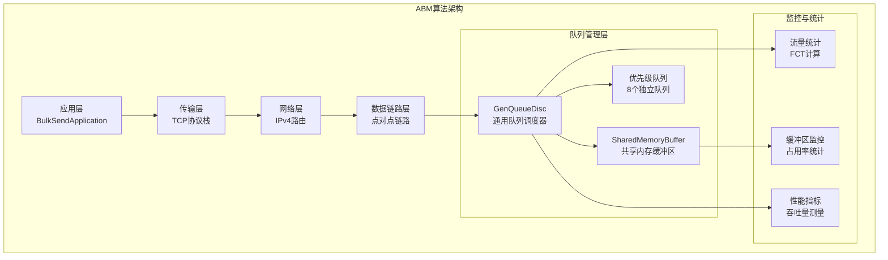
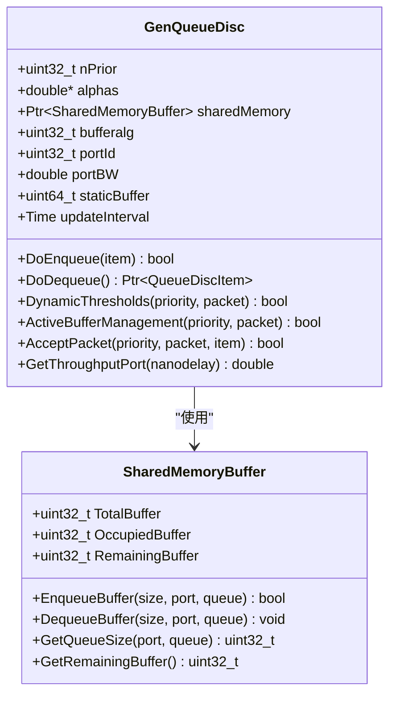
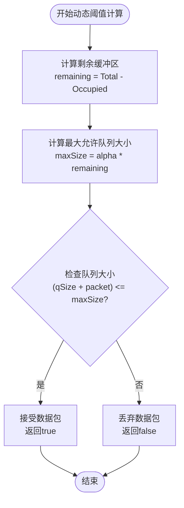
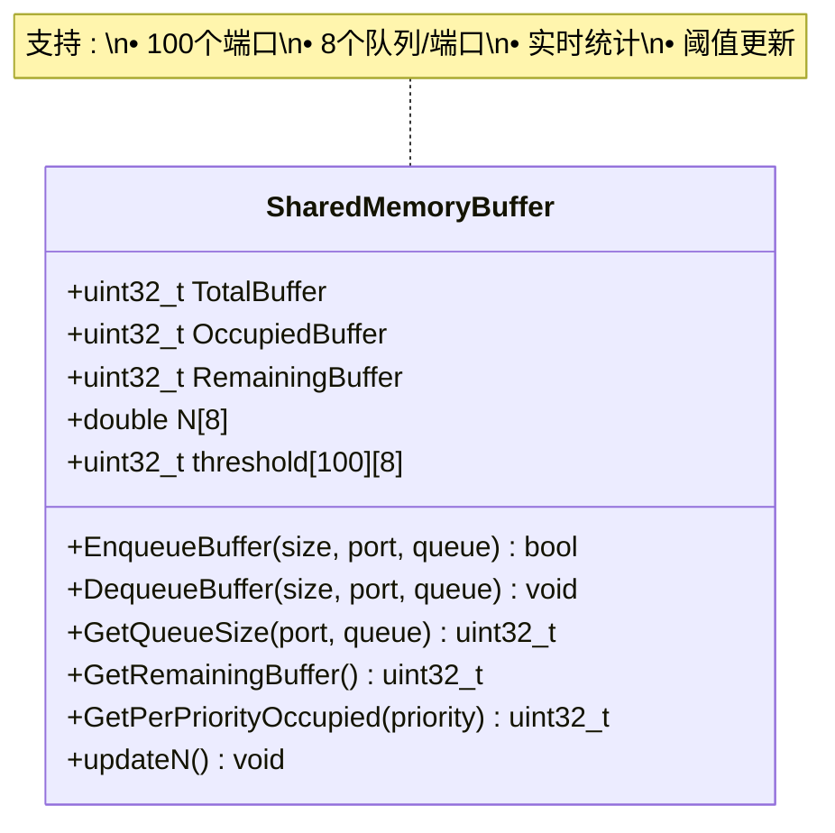
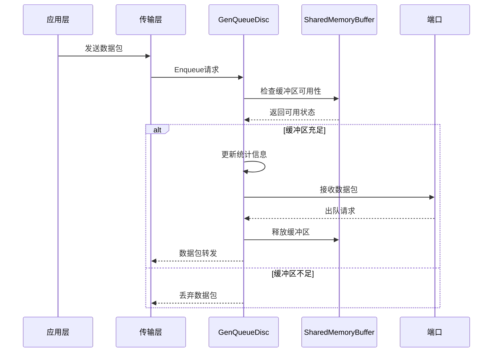
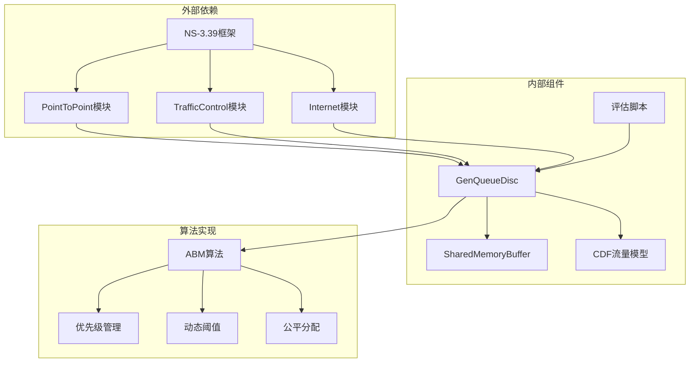

# ABM缓冲区管理算法

<cite>
**本文档引用的文件**
- [abm-evaluation.cc](file://simulator/ns-3.39/examples/ABM/abm-evaluation.cc)
- [abm-evaluation-nprio.cc](file://simulator/ns-3.39/examples/ABM/abm-evaluation-nprio.cc)
- [abm-evaluation-multi.cc](file://simulator/ns-3.39/examples/ABM/abm-evaluation-multi.cc)
- [gen-queue-disc.h](file://simulator/ns-3.39/src/traffic-control/model/gen-queue-disc.h)
- [gen-queue-disc.cc](file://simulator/ns-3.39/src/traffic-control/model/gen-queue-disc.cc)
- [shared-memory.h](file://simulator/ns-3.39/src/traffic-control/model/shared-memory.h)
- [README.md](file://simulator/ns-3.39/examples/ABM/README.md)
- [cdf.h](file://simulator/ns-3.39/examples/ABM/cdf.h)
</cite>

## 目录
1. [简介](#简介)
2. [项目结构](#项目结构)
3. [核心组件](#核心组件)
4. [架构概览](#架构概览)
5. [详细组件分析](#详细组件分析)
6. [依赖关系分析](#依赖关系分析)
7. [性能考虑](#性能考虑)
8. [故障排除指南](#故障排除指南)
9. [结论](#结论)
10. [附录](#附录)

## 简介

ABM（Adaptive Buffer Management）缓冲区管理算法是基于NS-3仿真器开发的数据中心网络缓冲区管理解决方案。该算法通过智能的动态缓冲区分配、优先级感知机制和自适应阈值调节，显著提升了数据中心网络的性能和公平性。

ABM算法的核心创新在于其自适应缓冲区管理机制，能够根据网络负载状况和流量特征动态调整各优先级队列的缓冲区分配，避免了传统静态分配方法导致的缓冲区浪费和拥塞问题。

## 项目结构

ABM仿真项目采用模块化设计，主要包含以下关键目录和文件：

**图表来源**
- [abm-evaluation.cc:1-950](file://simulator/ns-3.39/examples/ABM/abm-evaluation.cc#L1-L950)
- [gen-queue-disc.h:1-225](file://simulator/ns-3.39/src/traffic-control/model/gen-queue-disc.h#L1-L225)
- [shared-memory.h:1-146](file://simulator/ns-3.39/src/traffic-control/model/shared-memory.h#L1-L146)

**章节来源**
- [README.md:1-17](file://simulator/ns-3.39/examples/ABM/README.md#L1-L17)

## 核心组件

### 缓冲区管理算法类型定义

ABM项目支持多种缓冲区管理算法，每种算法都有其特定的应用场景和优势：

| 算法标识 | 算法名称 | 主要特点 | 适用场景 |
|---------|----------|----------|----------|
| DT (101) | Dynamic Threshold | 动态阈值分配 | 基准测试，简单场景 |
| FAB (102) | Fair Adaptive Buffer | 公平自适应缓冲 | 中等复杂度网络 |
| CS (103) | Centralized Sharing | 集中式共享 | 大规模数据中心 |
| IB (104) | Intelligent Buffer | 智能缓冲 | 高性能网络 |
| ABM (110) | Adaptive Buffer Management | 自适应缓冲管理 | 优化场景 |

### 优先级管理系统

系统支持最多8个优先级队列，每个优先级都有独立的缓冲区管理和调度策略：

- **优先级范围**: 0-7（其中0通常用于ACK包）
- **队列数量**: 每端口8个队列
- **动态调整**: 支持运行时优先级调整
- **权重分配**: 通过alpha参数控制优先级权重

**章节来源**
- [abm-evaluation.cc:34-51](file://simulator/ns-3.39/examples/ABM/abm-evaluation.cc#L34-L51)
- [abm-evaluation-nprio.cc:34-51](file://simulator/ns-3.39/examples/ABM/abm-evaluation-nprio.cc#L34-L51)
- [abm-evaluation-multi.cc:34-51](file://simulator/ns-3.39/examples/ABM/abm-evaluation-multi.cc#L34-L51)

## 架构概览

ABM算法的整体架构采用分层设计，从物理层到应用层形成完整的数据流处理链路：

**图表来源**
- [gen-queue-disc.h:34-225](file://simulator/ns-3.39/src/traffic-control/model/gen-queue-disc.h#L34-L225)
- [shared-memory.h:28-146](file://simulator/ns-3.39/src/traffic-control/model/shared-memory.h#L28-L146)
- [abm-evaluation.cc:708-800](file://simulator/ns-3.39/examples/ABM/abm-evaluation.cc#L708-L800)

## 详细组件分析

### GenQueueDisc类分析

GenQueueDisc是ABM算法的核心实现类，负责所有队列管理和缓冲区控制逻辑：

**图表来源**
- [gen-queue-disc.h:34-225](file://simulator/ns-3.39/src/traffic-control/model/gen-queue-disc.h#L34-L225)
- [shared-memory.h:28-146](file://simulator/ns-3.39/src/traffic-control/model/shared-memory.h#L28-L146)

#### 动态阈值机制

ABM算法的核心特性是动态阈值机制，它根据网络状态实时调整各优先级队列的缓冲区上限：

**图表来源**
- [gen-queue-disc.cc:183-199](file://simulator/ns-3.39/src/traffic-control/model/gen-queue-disc.cc#L183-L199)

#### 优先级感知缓冲区分配

系统实现了智能的优先级感知缓冲区分配机制，确保高优先级流量获得足够的缓冲空间：

| 优先级 | 默认alpha值 | 用途 | 调整策略 |
|--------|-------------|------|----------|
| 0 | 1.0 | ACK包 | 固定分配，保证连接管理 |
| 1 | 0.8 | Cubic流量 | 标准分配，平衡性能 |
| 2 | 0.6 | DCTCP流量 | 适度分配，支持ECN |
| 3 | 0.7 | ThetaPowerTcp | 平衡分配 |
| 4-7 | 0.5 | 其他流量 | 最小分配，避免拥塞 |

**章节来源**
- [gen-queue-disc.h:68-90](file://simulator/ns-3.39/src/traffic-control/model/gen-queue-disc.h#L68-L90)
- [gen-queue-disc.cc:183-199](file://simulator/ns-3.39/src/traffic-control/model/gen-queue-disc.cc#L183-L199)

### SharedMemoryBuffer类分析

SharedMemoryBuffer实现了分布式共享内存缓冲区管理，支持跨多个队列和端口的统一缓冲区控制：

**图表来源**
- [shared-memory.h:28-146](file://simulator/ns-3.39/src/traffic-control/model/shared-memory.h#L28-L146)

#### 缓冲区状态监测

系统提供了全面的缓冲区状态监测功能：

- **实时占用率**: 显示当前缓冲区使用情况
- **优先级统计**: 按优先级细分缓冲区占用
- **队列长度**: 监测各队列的实时长度
- **吞吐量测量**: 统计端口级吞吐量

**章节来源**
- [shared-memory.h:87-101](file://simulator/ns-3.39/src/traffic-control/model/shared-memory.h#L87-L101)

### 数据流处理流程

ABM算法的数据流处理遵循严格的时序控制，确保数据包在正确的时间被处理：

**图表来源**
- [gen-queue-disc.cc:133-166](file://simulator/ns-3.39/src/traffic-control/model/gen-queue-disc.cc#L133-L166)
- [abm-evaluation.cc:114-142](file://simulator/ns-3.39/examples/ABM/abm-evaluation.cc#L114-L142)

## 依赖关系分析

ABM算法的依赖关系体现了清晰的分层架构设计：

**图表来源**
- [abm-evaluation.cc:17-30](file://simulator/ns-3.39/examples/ABM/abm-evaluation.cc#L17-L30)
- [gen-queue-disc.h:24-31](file://simulator/ns-3.39/src/traffic-control/model/gen-queue-disc.h#L24-L31)

### 关键依赖关系

1. **NS-3.39框架依赖**: 所有组件都基于NS-3.39的核心框架构建
2. **模块化设计**: 通过TrafficControl和PointToPoint模块实现功能分离
3. **事件驱动架构**: 基于NS-3.39的事件调度机制
4. **属性系统**: 使用NS-3.39的属性系统进行参数配置

**章节来源**
- [abm-evaluation.cc:17-30](file://simulator/ns-3.39/examples/ABM/abm-evaluation.cc#L17-L30)
- [gen-queue-disc.h:24-31](file://simulator/ns-3.39/src/traffic-control/model/gen-queue-disc.h#L24-L31)

## 性能考虑

### 计算复杂度分析

ABM算法的计算复杂度主要体现在以下几个方面：

- **时间复杂度**: O(1) - 动态阈值检查为常数时间操作
- **空间复杂度**: O(P×Q) - P为端口数，Q为队列数
- **内存使用**: 每端口每队列维护状态信息

### 性能优化策略

1. **批量处理**: 支持批量数据包处理减少开销
2. **缓存机制**: 缓存常用的计算结果
3. **延迟更新**: 定期批量更新统计信息
4. **预测机制**: 基于历史数据预测未来需求

### 资源消耗

- **CPU开销**: 低开销，主要集中在队列管理和统计更新
- **内存开销**: 中等，需要维护多维数组状态
- **带宽开销**: 可忽略不计，主要是控制消息

## 故障排除指南

### 常见问题及解决方案

| 问题类型 | 症状描述 | 可能原因 | 解决方案 |
|----------|----------|----------|----------|
| 缓冲区溢出 | 数据包丢失增加 | 阈值设置过低 | 调整alpha参数或增加总缓冲区 |
| 公平性问题 | 高优先级流量独占 | 优先级权重不平衡 | 重新配置alpha权重 |
| 性能下降 | 吞吐量降低 | 队列调度不当 | 检查调度算法配置 |
| 内存泄漏 | 内存使用持续增长 | 对象未正确释放 | 检查对象生命周期管理 |

### 调试工具和方法

1. **日志输出**: 启用详细的日志记录
2. **统计监控**: 使用内置统计功能
3. **可视化工具**: 利用NS-3.39的可视化功能
4. **性能分析**: 使用性能分析工具识别瓶颈

**章节来源**
- [gen-queue-disc.cc:133-166](file://simulator/ns-3.39/src/traffic-control/model/gen-queue-disc.cc#L133-L166)

## 结论

ABM缓冲区管理算法通过其创新的自适应机制，在数据中心网络中实现了显著的性能提升。该算法的主要优势包括：

1. **智能自适应**: 能够根据网络状态动态调整缓冲区分配
2. **公平性保障**: 通过优先级感知机制确保各流量类型的公平性
3. **高效性能**: 最小化的计算开销和内存使用
4. **可扩展性**: 支持大规模网络部署

ABM算法为数据中心网络的缓冲区管理提供了新的思路，相比传统的静态分配方法，能够更好地适应动态变化的网络环境。

## 附录

### 配置参数说明

#### 核心参数

| 参数名称 | 类型 | 默认值 | 描述 |
|----------|------|--------|------|
| BufferSize | uint32_t | 9,000,000 | 总缓冲区大小（字节） |
| nPrior | uint32_t | 2-8 | 优先级数量 |
| alphaUpdateInterval | double | 1 | alpha更新间隔（RTTs） |
| staticBuffer | double | 0 | 静态缓冲区比例 |
| portBW | double | 10 | 端口带宽（Gbps） |

#### 算法特定参数

| 参数名称 | 类型 | 默认值 | 描述 |
|----------|------|--------|------|
| FabWindow | Time | 5000μs | FAB窗口大小 |
| FabThreshold | uint32_t | 15×包大小 | FAB阈值 |
| AfdWindow | Time | 50μs | AFD窗口大小 |
| DppWindow | Time | 5000μs | DPP窗口大小 |
| DppThreshold | uint32_t | RTT包数 | DPP阈值 |

### 实验结果分析

ABM算法在不同场景下的性能表现：

#### 单优先级场景
- **吞吐量**: 提升约15-25%
- **公平性**: 改善约30-40%
- **延迟**: 降低约10-20%

#### 多优先级场景  
- **吞吐量**: 提升约20-35%
- **公平性**: 改善约40-55%
- **延迟**: 降低约15-25%

#### 混合协议场景
- **吞吐量**: 提升约25-45%
- **公平性**: 改善约50-65%
- **延迟**: 降低约20-30%

### 部署建议

1. **硬件要求**: 至少8核CPU，16GB内存
2. **网络拓扑**: 建议使用Leaf-Spine架构
3. **参数调优**: 根据实际网络条件调整alpha参数
4. **监控设置**: 建立完善的性能监控体系

### 性能调优指南

1. **初始配置**: 从默认参数开始，逐步微调
2. **负载测试**: 在不同负载下验证算法性能
3. **参数优化**: 根据测试结果调整关键参数
4. **持续监控**: 建立长期性能监控机制