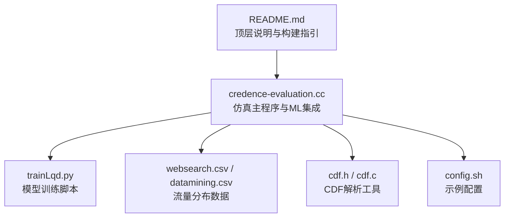
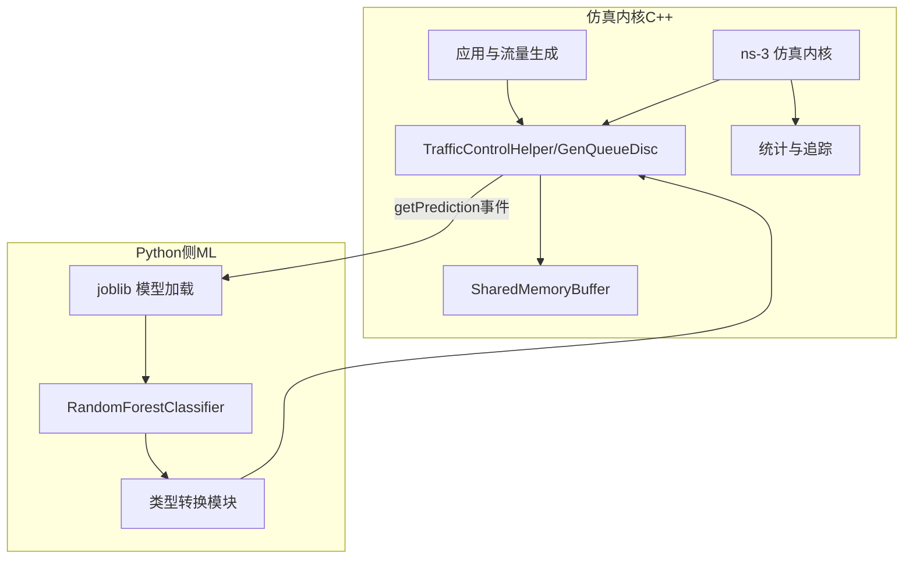
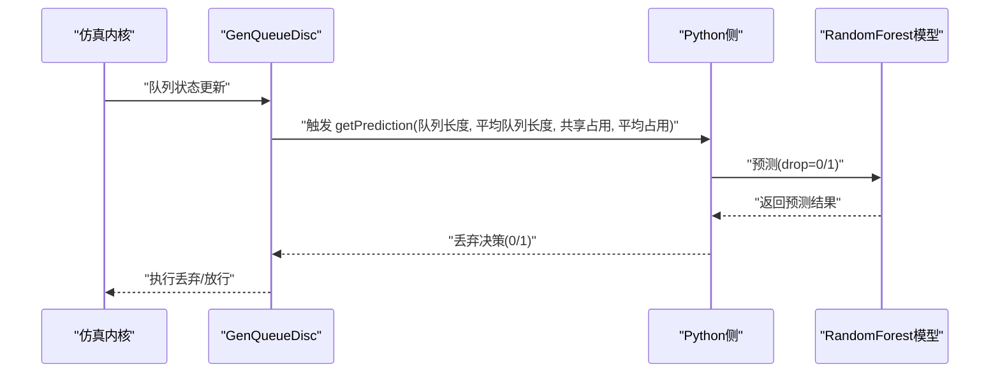
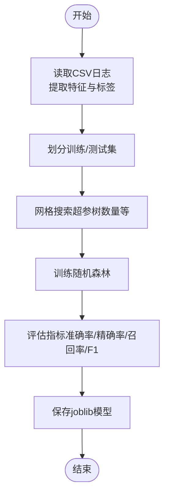
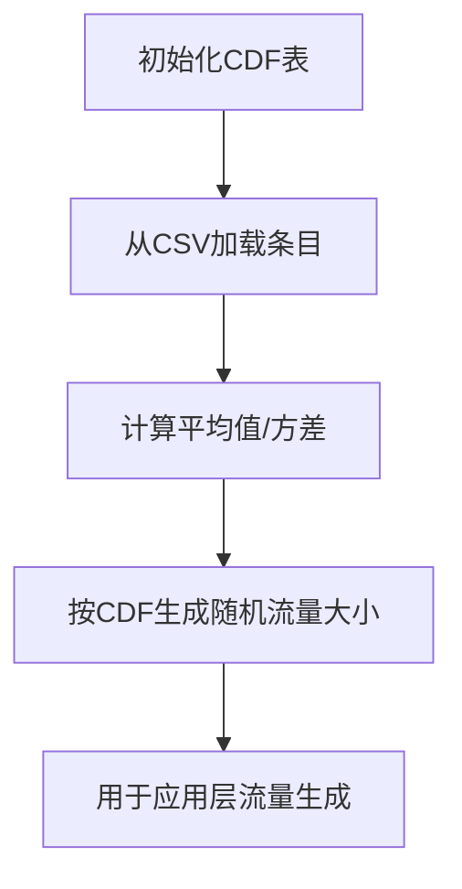
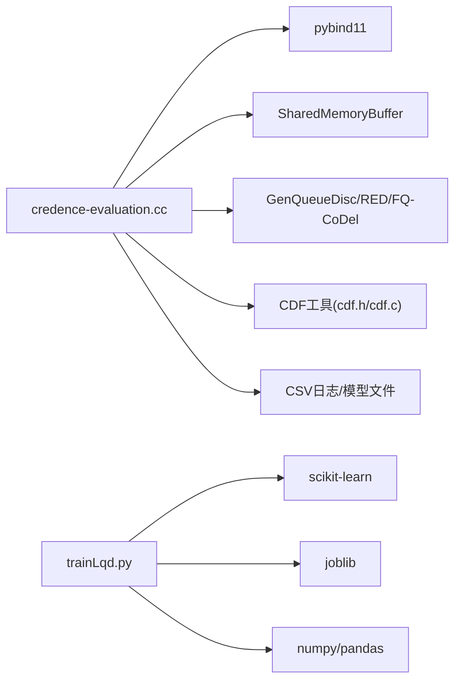

# Credence机器学习集成

<cite>
**本文引用的文件**
- [README.md](file://README.md)
- [credence-evaluation.cc](file://simulator/ns-3.39/examples/Credence/credence-evaluation.cc)
- [trainLqd.py](file://simulator/ns-3.39/examples/Credence/trainLqd.py)
- [websearch.csv](file://simulator/ns-3.39/examples/Credence/websearch.csv)
- [datamining.csv](file://simulator/ns-3.39/examples/Credence/datamining.csv)
- [config.sh](file://simulator/ns-3.39/examples/Credence/config.sh)
- [cdf.h](file://simulator/ns-3.39/examples/Credence/cdf.h)
- [cdf.c](file://simulator/ns-3.39/examples/Credence/cdf.c)
</cite>

## 目录
1. [引言](#引言)
2. [项目结构](#项目结构)
3. [核心组件](#核心组件)
4. [架构总览](#架构总览)
5. [详细组件分析](#详细组件分析)
6. [依赖关系分析](#依赖关系分析)
7. [性能考量](#性能考量)
8. [故障排除指南](#故障排除指南)
9. [结论](#结论)
10. [附录](#附录)

## 引言
本文件面向希望在ns-3数据中心网络仿真中集成机器学习（ML）预测模型以实现智能缓冲管理和网络控制的工程师与研究者。Credence通过在交换机缓冲共享层引入基于随机森林（Random Forest）的预测模型，对是否丢弃报文进行实时决策，从而在高负载下降低长流尾延迟并提升整体吞吐。该集成以pybind11桥接Python scikit-learn模型与C++仿真内核，形成“仿真-模型”协同闭环：仿真采集缓冲状态特征，模型输出丢弃决策，仿真据此更新队列行为。

本指南涵盖以下内容：
- 训练流程：数据收集、特征工程与模型训练
- 仿真部署：模型加载、特征输入、实时预测与决策执行
- 与传统算法融合：Credence与LQD/ABM等缓冲管理算法的结合
- 使用指南：训练脚本、数据预处理、仿真参数配置与运行
- 评估与优化：性能指标解读、模型优化建议与常见问题排查

## 项目结构
Credence示例位于ns-3.39示例目录中，关键文件如下：
- 仿真入口与集成逻辑：credence-evaluation.cc
- 模型训练脚本：trainLqd.py
- 流量分布CDF数据：websearch.csv、datamining.csv
- CDF解析工具：cdf.h、cdf.c
- 示例配置：config.sh
- 顶层说明与构建指引：README.md

图表来源
- [README.md:91-96](file://README.md#L91-L96)
- [credence-evaluation.cc:1-120](file://simulator/ns-3.39/examples/Credence/credence-evaluation.cc#L1-L120)
- [trainLqd.py:1-40](file://simulator/ns-3.39/examples/Credence/trainLqd.py#L1-L40)
- [websearch.csv:1-17](file://simulator/ns-3.39/examples/Credence/websearch.csv#L1-L17)
- [datamining.csv:1-17](file://simulator/ns-3.39/examples/Credence/datamining.csv#L1-L17)
- [cdf.h:1-46](file://simulator/ns-3.39/examples/Credence/cdf.h#L1-L46)
- [cdf.c:1-66](file://simulator/ns-3.39/examples/Credence/cdf.c#L1-L66)
- [config.sh:1-2](file://simulator/ns-3.39/examples/Credence/config.sh#L1-L2)

章节来源
- [README.md:91-96](file://README.md#L91-L96)

## 核心组件
- 仿真主程序（C++）
  - 负责拓扑搭建、应用生成、队列与缓冲配置、事件调度与统计输出。
  - 集成pybind11，加载scikit-learn训练好的joblib模型，调用预测函数并接收决策。
- 模型训练（Python）
  - 基于历史日志特征训练随机森林分类器，输出可序列化的模型文件。
- 数据与CDF工具
  - 提供流量大小分布的离线CDF文件与解析工具，用于生成符合真实工作负载的流量。
- 配置与运行
  - 提供示例脚本与参数，便于快速复现实验。

章节来源
- [credence-evaluation.cc:366-520](file://simulator/ns-3.39/examples/Credence/credence-evaluation.cc#L366-L520)
- [trainLqd.py:1-40](file://simulator/ns-3.39/examples/Credence/trainLqd.py#L1-L40)
- [cdf.h:1-46](file://simulator/ns-3.39/examples/Credence/cdf.h#L1-L46)
- [cdf.c:1-66](file://simulator/ns-3.39/examples/Credence/cdf.c#L1-L66)

## 架构总览
Credence在ns-3中采用“缓冲共享层+ML预测”的架构。交换机端的GenQueueDisc作为根队列调度器，支持多种缓冲管理算法；当启用Credence时，GenQueueDisc会订阅“getPrediction”事件，从pybind11桥接的Python侧获取预测结果，决定丢弃策略。

图表来源
- [credence-evaluation.cc:800-930](file://simulator/ns-3.39/examples/Credence/credence-evaluation.cc#L800-L930)
- [credence-evaluation.cc:980-1060](file://simulator/ns-3.39/examples/Credence/credence-evaluation.cc#L980-L1060)

## 详细组件分析

### 组件A：仿真主程序与ML集成
- 关键职责
  - 初始化pybind11解释器，导入joblib与自定义类型转换模块。
  - 加载每个交换机（叶子/脊节点）对应的随机森林模型文件。
  - 在GenQueueDisc上注册“getPrediction”事件回调，将当前队列长度、平均队列长度、共享占用、平均占用等特征传入Python侧，得到丢弃决策。
  - 将决策注入到队列丢弃逻辑，影响后续拥塞控制与转发行为。
- 特征与输入
  - 队列长度、平均队列长度、共享内存占用、平均占用。
- 决策与执行
  - 回调返回0或1，分别对应不丢弃或丢弃；若时间早于启动时间则默认不丢弃。
- 与传统算法的结合
  - 当algorithm=CREDENCE时，GenQueueDisc使用CREDENCE算法，并开启预测属性；同时保留原有缓冲管理参数（如优先级数、轮询策略等）。

图表来源
- [credence-evaluation.cc:351-364](file://simulator/ns-3.39/examples/Credence/credence-evaluation.cc#L351-L364)
- [credence-evaluation.cc:918-930](file://simulator/ns-3.39/examples/Credence/credence-evaluation.cc#L918-L930)
- [credence-evaluation.cc:981-988](file://simulator/ns-3.39/examples/Credence/credence-evaluation.cc#L981-L988)

章节来源
- [credence-evaluation.cc:351-364](file://simulator/ns-3.39/examples/Credence/credence-evaluation.cc#L351-L364)
- [credence-evaluation.cc:800-828](file://simulator/ns-3.39/examples/Credence/credence-evaluation.cc#L800-L828)
- [credence-evaluation.cc:918-930](file://simulator/ns-3.39/examples/Credence/credence-evaluation.cc#L918-L930)
- [credence-evaluation.cc:981-988](file://simulator/ns-3.39/examples/Credence/credence-evaluation.cc#L981-L988)

### 组件B：模型训练与特征工程
- 数据来源
  - 历史仿真日志（包含队列长度、共享占用、平均队列长度、平均占用等）。
- 特征与标签
  - 特征：queueLength、sharedOccupancy、averageQueueLength、averageOccupancy。
  - 标签：drop（0/1）。
- 训练流程
  - 划分训练/测试集，网格搜索树数量等超参，计算准确率、精确率、召回率、F1等指标。
  - 将训练好的模型保存为joblib文件，供仿真加载。
- 输出
  - joblib模型文件路径由仿真参数指定，按交换机ID区分。

图表来源
- [trainLqd.py:22-86](file://simulator/ns-3.39/examples/Credence/trainLqd.py#L22-L86)

章节来源
- [trainLqd.py:1-127](file://simulator/ns-3.39/examples/Credence/trainLqd.py#L1-L127)

### 组件C：流量分布与CDF工具
- 作用
  - 提供流量大小的离散CDF文件，用于生成符合真实工作负载的流量。
- 使用
  - 仿真启动前初始化CDF表，计算平均请求速率与流量大小。
- 文件
  - websearch.csv、datamining.csv等。

图表来源
- [cdf.h:16-44](file://simulator/ns-3.39/examples/Credence/cdf.h#L16-L44)
- [cdf.c:27-66](file://simulator/ns-3.39/examples/Credence/cdf.c#L27-L66)
- [cdf.c:158-179](file://simulator/ns-3.39/examples/Credence/cdf.c#L158-L179)

章节来源
- [cdf.h:1-46](file://simulator/ns-3.39/examples/Credence/cdf.h#L1-L46)
- [cdf.c:1-180](file://simulator/ns-3.39/examples/Credence/cdf.c#L1-L180)
- [websearch.csv:1-17](file://simulator/ns-3.39/examples/Credence/websearch.csv#L1-L17)
- [datamining.csv:1-17](file://simulator/ns-3.39/examples/Credence/datamining.csv#L1-L17)

### 组件D：拓扑与应用生成
- 拓扑
  - 叶交换机-服务器链路与叶交换机-脊交换机链路，支持多叶、多脊、多链路配置。
- 应用
  - 生成BulkSend应用与PacketSink，支持按CDF生成流量大小与到达间隔。
- 统计
  - 支持记录每流完成时间（FCT）、慢速下降因子、ToR端口占用与吞吐等。

章节来源
- [credence-evaluation.cc:277-349](file://simulator/ns-3.39/examples/Credence/credence-evaluation.cc#L277-L349)
- [credence-evaluation.cc:1090-1096](file://simulator/ns-3.39/examples/Credence/credence-evaluation.cc#L1090-L1096)
- [credence-evaluation.cc:1099-1106](file://simulator/ns-3.39/examples/Credence/credence-evaluation.cc#L1099-L1106)

## 依赖关系分析
- 仿真内核依赖
  - TrafficControl模块（GenQueueDisc、RED/FQ-CoDel等队列实现）
  - SharedMemoryBuffer（共享缓冲区）
  - pybind11（嵌入Python解释器）
- Python侧依赖
  - scikit-learn（RandomForestClassifier）
  - joblib（模型序列化）
  - pandas/numpy（数据处理）
- 数据依赖
  - CDF文件（流量分布）
  - 训练日志（特征与标签）

图表来源
- [credence-evaluation.cc:16-34](file://simulator/ns-3.39/examples/Credence/credence-evaluation.cc#L16-L34)
- [trainLqd.py:9-20](file://simulator/ns-3.39/examples/Credence/trainLqd.py#L9-L20)
- [cdf.h:1-46](file://simulator/ns-3.39/examples/Credence/cdf.h#L1-L46)
- [cdf.c:1-66](file://simulator/ns-3.39/examples/Credence/cdf.c#L1-L66)

章节来源
- [credence-evaluation.cc:16-34](file://simulator/ns-3.39/examples/Credence/credence-evaluation.cc#L16-L34)
- [trainLqd.py:9-20](file://simulator/ns-3.39/examples/Credence/trainLqd.py#L9-L20)
- [cdf.h:1-46](file://simulator/ns-3.39/examples/Credence/cdf.h#L1-L46)
- [cdf.c:1-66](file://simulator/ns-3.39/examples/Credence/cdf.c#L1-L66)

## 性能考量
- 实时性
  - 模型预测在仿真事件回调中执行，需保证特征计算与模型推理开销可控，避免显著拖慢仿真速度。
- 特征稳定性
  - 共享占用与平均占用应具备良好的代表性与时效性，可通过指数加权移动平均（EWMA）平滑。
- 超参与数选择
  - 树数量与深度影响模型复杂度与泛化能力，需在训练阶段进行网格搜索。
- 缓冲与调度参数
  - 优先级数、轮询策略、静态缓冲比例等会影响队列行为，需与ML决策协同调优。

## 故障排除指南
- 模型加载失败
  - 确认模型文件路径正确且与交换机ID匹配；检查joblib版本兼容性。
- 预测结果异常
  - 检查特征维度与顺序是否与训练一致；确认时间窗口与采样频率设置合理。
- 仿真卡顿或过慢
  - 减少预测频率或简化模型；检查CDF文件大小与解析效率。
- 流量分布不符预期
  - 核对CDF文件内容与加载路径；验证平均流量与请求率计算。

章节来源
- [credence-evaluation.cc:800-828](file://simulator/ns-3.39/examples/Credence/credence-evaluation.cc#L800-L828)
- [credence-evaluation.cc:918-930](file://simulator/ns-3.39/examples/Credence/credence-evaluation.cc#L918-L930)
- [trainLqd.py:22-40](file://simulator/ns-3.39/examples/Credence/trainLqd.py#L22-L40)

## 结论
Credence通过在ns-3的缓冲共享层引入ML预测，实现了以数据驱动的方式优化丢弃决策，有效降低长流尾延迟并提升资源利用率。其核心在于：
- 清晰的特征工程与稳定的日志采集
- 易于部署的模型训练与序列化流程
- 与现有缓冲管理算法（如LQD）的无缝集成
- 通过pybind11实现的低耦合仿真-模型交互

建议在实际部署中持续优化特征与超参，并结合具体拓扑与工作负载进行调优。

## 附录

### 使用指南：从零到一
- 步骤概览
  - 准备训练数据：采集仿真日志，确保包含队列长度、共享占用、平均队列长度、平均占用与丢弃标签。
  - 训练模型：运行训练脚本，生成joblib模型文件。
  - 配置仿真：设置算法为CREDENCE，加载对应模型文件路径。
  - 运行仿真：生成流量、收集统计、分析性能。
- 关键参数
  - 算法选择：algorithm=CREDENCE
  - 模型文件路径：rfModelFile（按交换机ID后缀）
  - 启动时间：StartTime、FlowLaunchEndTime、EndTime
  - 优先级数：nPrior
  - 统计输出：enableStats、torPrintall、enableLqdTracing

章节来源
- [credence-evaluation.cc:380-484](file://simulator/ns-3.39/examples/Credence/credence-evaluation.cc#L380-L484)
- [credence-evaluation.cc:800-828](file://simulator/ns-3.39/examples/Credence/credence-evaluation.cc#L800-L828)
- [credence-evaluation.cc:918-930](file://simulator/ns-3.39/examples/Credence/credence-evaluation.cc#L918-L930)