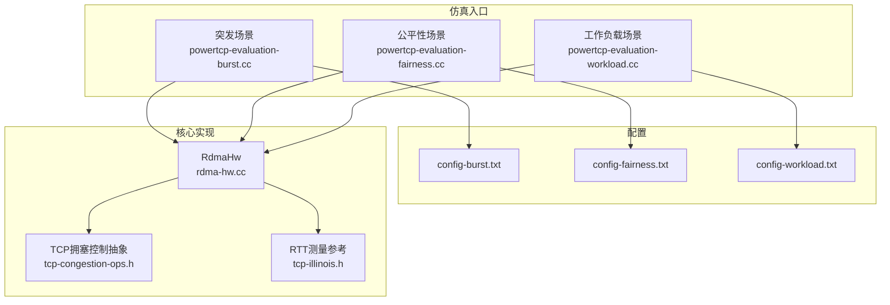
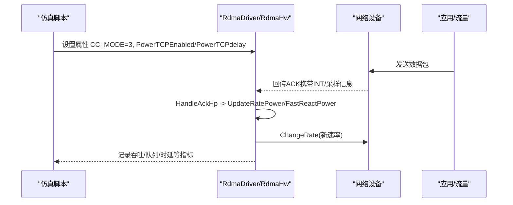
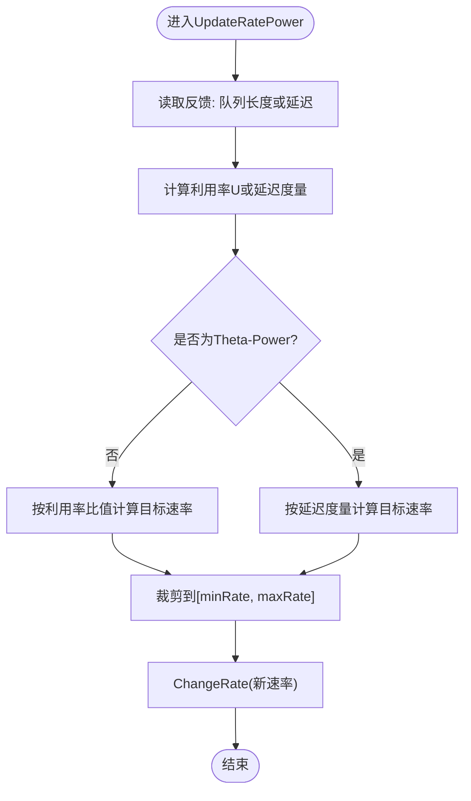
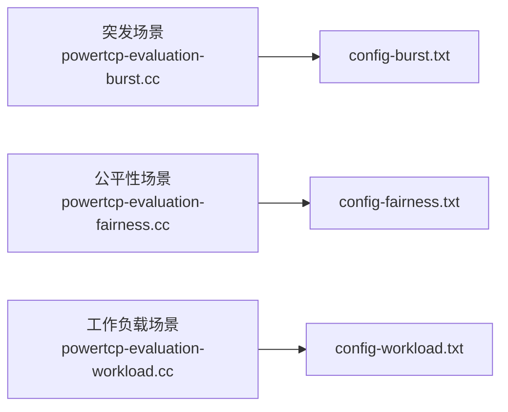
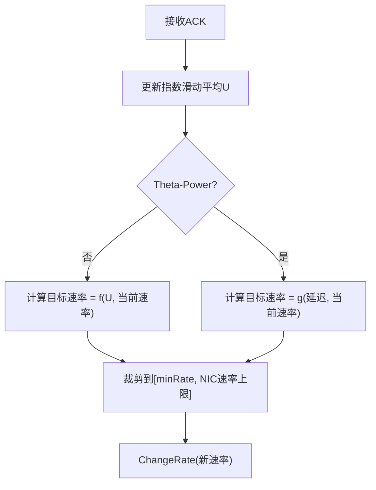
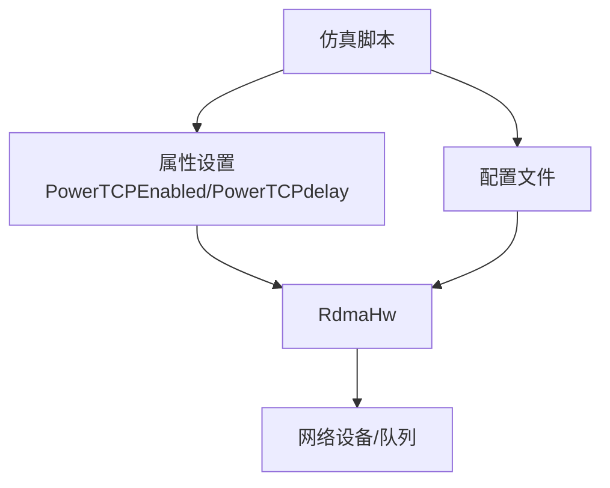

# PowerTCP算法

<cite>
**本文引用的文件**
- [powertcp-evaluation-burst.cc](file://examples/PowerTCP/powertcp-evaluation-burst.cc)
- [powertcp-evaluation-fairness.cc](file://examples/PowerTCP/powertcp-evaluation-fairness.cc)
- [powertcp-evaluation-workload.cc](file://examples/PowerTCP/powertcp-evaluation-workload.cc)
- [README.md](file://examples/PowerTCP/README.md)
- [config-burst.txt](file://examples/PowerTCP/config-burst.txt)
- [config-fairness.txt](file://examples/PowerTCP/config-fairness.txt)
- [config-workload.txt](file://examples/PowerTCP/config-workload.txt)
- [rdma-hw.cc](file://src/point-to-point/model/rdma-hw.cc)
- [tcp-congestion-ops.h](file://src/internet/model/tcp-congestion-ops.h)
- [tcp-illinois.h](file://src/internet/model/tcp-illinois.h)
</cite>

## 目录
1. [引言](#引言)
2. [项目结构](#项目结构)
3. [核心组件](#核心组件)
4. [架构总览](#架构总览)
5. [详细组件分析](#详细组件分析)
6. [依赖关系分析](#依赖关系分析)
7. [性能考量](#性能考量)
8. [故障排查指南](#故障排查指南)
9. [结论](#结论)
10. [附录：配置与使用指南](#附录配置与使用指南)

## 引言
本文件系统化梳理PowerTCP在ns-3中的实现与使用，围绕其核心思想“基于队列长度与延迟的自适应拥塞控制”展开，结合代码级实现与仿真脚本，给出数学模型、反馈机制、速率调整策略、ThetaPower与Power两种变体的差异与适用场景，并提供完整配置参数说明、仿真示例路径与性能评估建议。

## 项目结构
PowerTCP相关代码主要分布在以下位置：
- 仿真入口与场景：examples/PowerTCP/*.cc（突发、公平性、工作负载）
- 配置文件：examples/PowerTCP/config-*.txt
- README：examples/PowerTCP/README.md
- 算法核心实现：src/point-to-point/model/rdma-hw.cc（RdmaHw中的UpdateRatePower/FastReactPower）
- TCP拥塞控制抽象：src/internet/model/tcp-congestion-ops.h
- 参考实现（RTT测量）：src/internet/model/tcp-illinois.h

**图表来源**
- [powertcp-evaluation-burst.cc:400-420](file://examples/PowerTCP/powertcp-evaluation-burst.cc#L400-L420)
- [powertcp-evaluation-fairness.cc:390-410](file://examples/PowerTCP/powertcp-evaluation-fairness.cc#L390-L410)
- [powertcp-evaluation-workload.cc:550-580](file://examples/PowerTCP/powertcp-evaluation-workload.cc#L550-L580)
- [config-burst.txt:1-59](file://examples/PowerTCP/config-burst.txt#L1-L59)
- [config-fairness.txt:1-59](file://examples/PowerTCP/config-fairness.txt#L1-L59)
- [config-workload.txt:1-59](file://examples/PowerTCP/config-workload.txt#L1-L59)
- [rdma-hw.cc:164-181](file://src/point-to-point/model/rdma-hw.cc#L164-L181)
- [tcp-congestion-ops.h:38-117](file://src/internet/model/tcp-congestion-ops.h#L38-L117)
- [tcp-illinois.h:160-189](file://src/internet/model/tcp-illinois.h#L160-L189)

**章节来源**
- [README.md:1-34](file://examples/PowerTCP/README.md#L1-L34)
- [config-burst.txt:1-59](file://examples/PowerTCP/config-burst.txt#L1-L59)
- [config-fairness.txt:1-59](file://examples/PowerTCP/config-fairness.txt#L1-L59)
- [config-workload.txt:1-59](file://examples/PowerTCP/config-workload.txt#L1-L59)

## 核心组件
- RdmaHw中的PowerTCP实现
  - UpdateRatePower：根据队列长度或延迟反馈更新目标速率
  - FastReactPower：快速反应模式下的速率调整
  - 属性开关：PowerTCPEnabled（启用Power）、PowerTCPdelay（启用Theta-Power）
- 仿真脚本
  - 通过命令行参数与配置文件驱动，选择CC_MODE=3（HPCC/PowerTCP），并设置目标利用率、指数加权因子、最小速率等
- TCP拥塞控制抽象
  - TcpCongestionOps定义了拥塞控制接口，为不同算法提供统一扩展点

**章节来源**
- [rdma-hw.cc:164-181](file://src/point-to-point/model/rdma-hw.cc#L164-L181)
- [rdma-hw.cc:976-1098](file://src/point-to-point/model/rdma-hw.cc#L976-L1098)
- [powertcp-evaluation-burst.cc:406-420](file://examples/PowerTCP/powertcp-evaluation-burst.cc#L406-L420)
- [powertcp-evaluation-fairness.cc:394-406](file://examples/PowerTCP/powertcp-evaluation-fairness.cc#L394-L406)
- [powertcp-evaluation-workload.cc:551-561](file://examples/PowerTCP/powertcp-evaluation-workload.cc#L551-L561)
- [tcp-congestion-ops.h:38-117](file://src/internet/model/tcp-congestion-ops.h#L38-L117)

## 架构总览
PowerTCP在ns-3中的运行链路如下：
- 仿真脚本解析配置与命令行参数，设置RDMA节点属性（含PowerTCPEnabled/PowerTCPdelay）
- RdmaHw在收到ACK时触发高速精度拥塞控制逻辑
- UpdateRatePower根据反馈（队列长度或延迟）计算新目标速率并应用到发送速率
- 速率变化通过ChangeRate下发至硬件队列对端口速率进行调节

**图表来源**
- [powertcp-evaluation-burst.cc:979-994](file://examples/PowerTCP/powertcp-evaluation-burst.cc#L979-L994)
- [powertcp-evaluation-fairness.cc:972-973](file://examples/PowerTCP/powertcp-evaluation-fairness.cc#L972-L973)
- [powertcp-evaluation-workload.cc:1177-1178](file://examples/PowerTCP/powertcp-evaluation-workload.cc#L1177-L1178)
- [rdma-hw.cc:779-794](file://src/point-to-point/model/rdma-hw.cc#L779-L794)
- [rdma-hw.cc:980-1098](file://src/point-to-point/model/rdma-hw.cc#L980-L1098)

## 详细组件分析

### 组件一：RdmaHw中的PowerTCP实现
- 关键函数
  - UpdateRatePower：依据反馈（队列长度或延迟）计算新目标速率，考虑最小速率与最大速率约束
  - FastReactPower：在快速反应模式下进行更频繁的速率微调
- 变体区分
  - Power：以队列长度比值作为反馈（u_target控制目标利用率）
  - Theta-Power（PowerTCPdelay=true）：以延迟作为反馈，采用不同的归一化与衰减策略
- 速率边界与上限
  - 使用最小速率、最大速率与NIC速率上限进行裁剪
  - 支持多速率（per-hop）与采样反馈

**图表来源**
- [rdma-hw.cc:980-1098](file://src/point-to-point/model/rdma-hw.cc#L980-L1098)

**章节来源**
- [rdma-hw.cc:164-181](file://src/point-to-point/model/rdma-hw.cc#L164-L181)
- [rdma-hw.cc:976-1098](file://src/point-to-point/model/rdma-hw.cc#L976-L1098)

### 组件二：仿真脚本与场景
- 突发场景（10:1汇聚）
  - 场景：单流突发注入，验证高负载下的稳定性与公平性
  - 脚本：powertcp-evaluation-burst.cc
  - 配置：config-burst.txt
- 公平性场景
  - 场景：多流竞争，评估不同算法的公平性
  - 脚本：powertcp-evaluation-fairness.cc
  - 配置：config-fairness.txt
- 工作负载场景
  - 场景：随请求率/大小变化的工作负载，评估吞吐与时延
  - 脚本：powertcp-evaluation-workload.cc
  - 配置：config-workload.txt

**图表来源**
- [powertcp-evaluation-burst.cc:406-420](file://examples/PowerTCP/powertcp-evaluation-burst.cc#L406-L420)
- [powertcp-evaluation-fairness.cc:394-406](file://examples/PowerTCP/powertcp-evaluation-fairness.cc#L394-L406)
- [powertcp-evaluation-workload.cc:551-561](file://examples/PowerTCP/powertcp-evaluation-workload.cc#L551-L561)
- [config-burst.txt:1-59](file://examples/PowerTCP/config-burst.txt#L1-L59)
- [config-fairness.txt:1-59](file://examples/PowerTCP/config-fairness.txt#L1-L59)
- [config-workload.txt:1-59](file://examples/PowerTCP/config-workload.txt#L1-L59)

**章节来源**
- [README.md:5-25](file://examples/PowerTCP/README.md#L5-L25)
- [powertcp-evaluation-burst.cc:406-420](file://examples/PowerTCP/powertcp-evaluation-burst.cc#L406-L420)
- [powertcp-evaluation-fairness.cc:394-406](file://examples/PowerTCP/powertcp-evaluation-fairness.cc#L394-L406)
- [powertcp-evaluation-workload.cc:551-561](file://examples/PowerTCP/powertcp-evaluation-workload.cc#L551-L561)

### 组件三：数学模型与反馈机制
- 基本假设
  - 利用队列长度或延迟作为网络拥塞信号
  - 通过指数滑动平均估计当前利用率U
  - 目标速率为当前速率与目标利用率的函数
- 反馈类型
  - Power：U = 实际利用率 / 目标利用率，目标速率 ∝ 当前速率 / U
  - Theta-Power：以延迟度量替代利用率，采用不同的归一化与衰减系数
- 速率调整策略
  - 慢启动后阶段：按反馈动态调整目标速率，避免大幅抖动
  - 快速反应：在ACK到达间隔内进行小幅调整，提升响应速度
  - 边界保护：限制最小/最大速率，防止过小导致吞吐不足或过大导致不稳定

**图表来源**
- [rdma-hw.cc:1063-1076](file://src/point-to-point/model/rdma-hw.cc#L1063-L1076)

**章节来源**
- [rdma-hw.cc:1063-1076](file://src/point-to-point/model/rdma-hw.cc#L1063-L1076)

### 组件四：ThetaPower与Power变体对比
- Power（默认）
  - 反馈：队列长度利用率
  - 特点：对队列长度敏感，适合长肥管道与高延迟场景
- Theta-Power（PowerTCPdelay=true）
  - 反馈：延迟度量
  - 特点：对延迟变化敏感，适合低延迟短管道或需要快速响应延迟波动的场景
- 适用场景
  - Power：数据中心长距离、大带宽、长RTT链路
  - Theta-Power：低延迟短链路、实时性要求高的场景

**章节来源**
- [rdma-hw.cc:1063-1076](file://src/point-to-point/model/rdma-hw.cc#L1063-L1076)
- [powertcp-evaluation-burst.cc:406-409](file://examples/PowerTCP/powertcp-evaluation-burst.cc#L406-L409)
- [powertcp-evaluation-fairness.cc:394-397](file://examples/PowerTCP/powertcp-evaluation-fairness.cc#L394-L397)
- [powertcp-evaluation-workload.cc:551-554](file://examples/PowerTCP/powertcp-evaluation-workload.cc#L551-L554)

## 依赖关系分析
- 仿真脚本依赖配置文件与命令行参数，决定CC_MODE与PowerTCP变体
- RdmaHw依赖RdmaDriver/RdmaHw属性（如目标利用率、最小速率、快速反应等）
- 速率更新依赖ACK反馈与INT采样（由CC_MODE与INT_HEADER模式决定）

**图表来源**
- [powertcp-evaluation-burst.cc:979-994](file://examples/PowerTCP/powertcp-evaluation-burst.cc#L979-L994)
- [powertcp-evaluation-fairness.cc:972-973](file://examples/PowerTCP/powertcp-evaluation-fairness.cc#L972-L973)
- [powertcp-evaluation-workload.cc:1177-1178](file://examples/PowerTCP/powertcp-evaluation-workload.cc#L1177-L1178)
- [rdma-hw.cc:164-181](file://src/point-to-point/model/rdma-hw.cc#L164-L181)

**章节来源**
- [powertcp-evaluation-burst.cc:728-735](file://examples/PowerTCP/powertcp-evaluation-burst.cc#L728-L735)
- [powertcp-evaluation-fairness.cc:717-724](file://examples/PowerTCP/powertcp-evaluation-fairness.cc#L717-L724)
- [powertcp-evaluation-workload.cc:921-928](file://examples/PowerTCP/powertcp-evaluation-workload.cc#L921-L928)

## 性能考量
- 目标利用率（U_TARGET）
  - 控制网络利用效率，过高易引发排队，过低浪费带宽
- 指数滑动平均增益（EWMA_GAIN）
  - 影响反馈平滑度与响应速度，较小值更平滑但响应慢
- 最小速率（MIN_RATE）
  - 防止速率过低导致传输效率下降
- 快速反应（FAST_REACT）
  - 提升瞬态响应，可能带来一定抖动
- 多速率与采样反馈（MULTI_RATE/SAMPLE_FEEDBACK）
  - 在复杂拓扑中提升公平性与稳定性

[本节为通用指导，无需特定文件来源]

## 故障排查指南
- 启用/禁用PowerTCP
  - 通过命令行参数或配置文件设置wien/delayWien，或直接设置RdmaHw属性
- 参数不生效
  - 确认CC_MODE=3且INT_HEADER模式正确（NORMAL/PINT）
  - 检查目标利用率、最小速率、EWMA增益等是否合理
- 性能异常
  - 观察队列长度分布与FCT统计，调整U_TARGET与EWMA_GAIN
  - 在Theta-Power与Power之间切换以适配不同链路特性

**章节来源**
- [powertcp-evaluation-burst.cc:406-420](file://examples/PowerTCP/powertcp-evaluation-burst.cc#L406-L420)
- [powertcp-evaluation-fairness.cc:394-406](file://examples/PowerTCP/powertcp-evaluation-fairness.cc#L394-L406)
- [powertcp-evaluation-workload.cc:551-561](file://examples/PowerTCP/powertcp-evaluation-workload.cc#L551-L561)
- [rdma-hw.cc:164-181](file://src/point-to-point/model/rdma-hw.cc#L164-L181)

## 结论
PowerTCP通过“队列长度/延迟”的反馈实现自适应速率控制，在数据中心网络中兼顾吞吐与公平性。Theta-Power与Power分别面向不同链路特征，可按需选择。配合合理的参数调优与仿真验证，可在突发、公平性与工作负载场景下取得稳定性能。

[本节为总结性内容，无需特定文件来源]

## 附录：配置与使用指南

### Alpha、Beta、Gamma等关键参数说明
- 目标利用率（U_TARGET）
  - 作用：期望的网络利用率，用于归一化反馈
  - 调优：0.8~0.95常见；过高易排队，过低浪费带宽
- 指数滑动平均增益（EWMA_GAIN）
  - 作用：平滑反馈信号，影响响应速度
  - 调优：较小值更稳，较大值更快
- 最小速率（MIN_RATE）
  - 作用：速率下限，避免过低导致传输效率差
- 快速反应（FAST_REACT）
  - 作用：在ACK间隔内进行快速速率调整
- 多速率（MULTI_RATE）与采样反馈（SAMPLE_FEEDBACK）
  - 作用：提升复杂拓扑下的公平性与稳定性
- Theta-Power开关（PowerTCPdelay）
  - 作用：启用延迟反馈模式
- 其他
  - RATE_AI/HAI、DCTCP_RATE_AI：增量单位
  - RATE_DECREASE_INTERVAL、ALPHA_RESUME_INTERVAL：速率调整周期
  - CLAMP_TARGET_RATE、RATE_BOUND：目标速率裁剪策略

**章节来源**
- [config-burst.txt:15-59](file://examples/PowerTCP/config-burst.txt#L15-L59)
- [config-fairness.txt:15-59](file://examples/PowerTCP/config-fairness.txt#L15-L59)
- [config-workload.txt:15-59](file://examples/PowerTCP/config-workload.txt#L15-L59)
- [rdma-hw.cc:164-181](file://src/point-to-point/model/rdma-hw.cc#L164-L181)

### NS-3中配置与使用步骤
- 准备环境
  - 设置NS3根目录路径（见README提示）
- 运行场景
  - 突发：./script-burst.sh yes no
  - 公平性：./script-fairness.sh
  - 工作负载：./script-workload.sh
- 解析与绘图
  - ./results-*.sh生成结果
  - Python脚本绘制图表（plot-*.py）

**章节来源**
- [README.md:3-34](file://examples/PowerTCP/README.md#L3-L34)

### 示例：在NS-3中启用PowerTCP
- 在仿真脚本中设置
  - CC_MODE=3
  - PowerTCPEnabled=true
  - PowerTCPdelay=false（启用Power）
- 或通过命令行参数
  - --wien=yes --delayWien=no

**章节来源**
- [powertcp-evaluation-burst.cc:406-420](file://examples/PowerTCP/powertcp-evaluation-burst.cc#L406-L420)
- [powertcp-evaluation-fairness.cc:394-406](file://examples/PowerTCP/powertcp-evaluation-fairness.cc#L394-L406)
- [powertcp-evaluation-workload.cc:551-561](file://examples/PowerTCP/powertcp-evaluation-workload.cc#L551-L561)