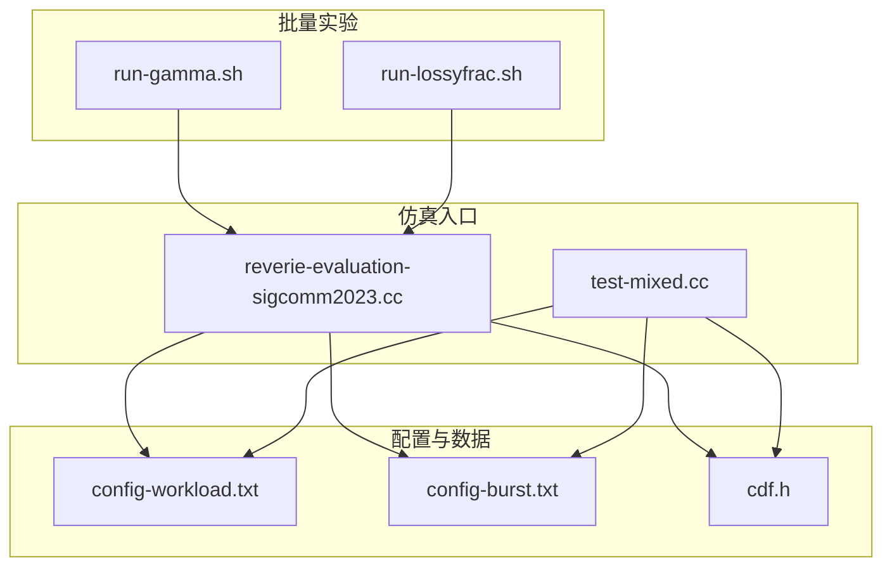
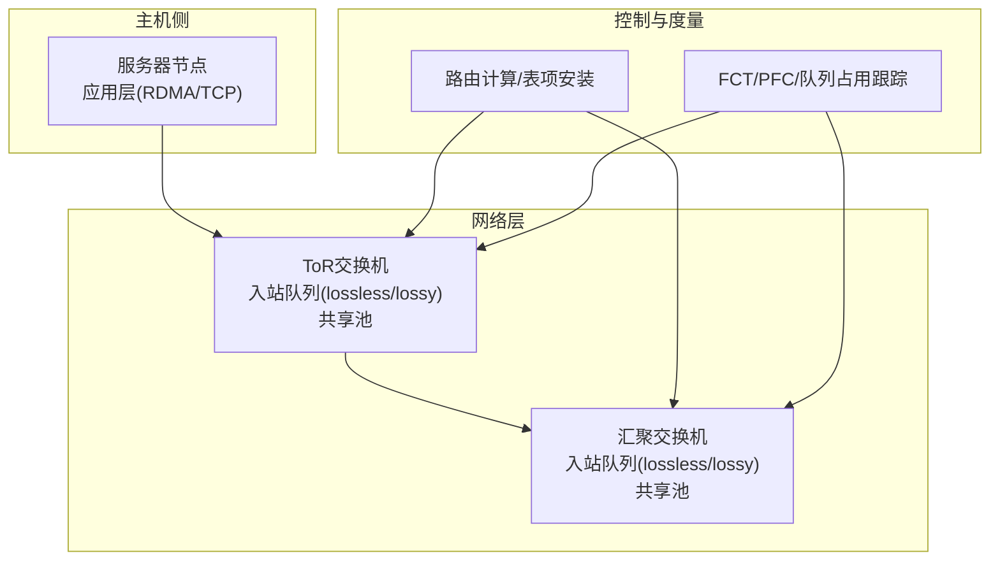
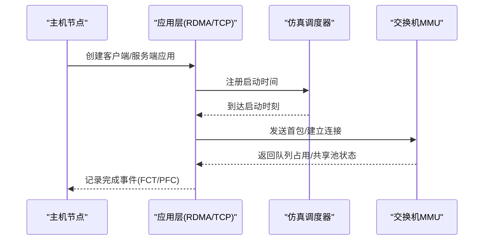
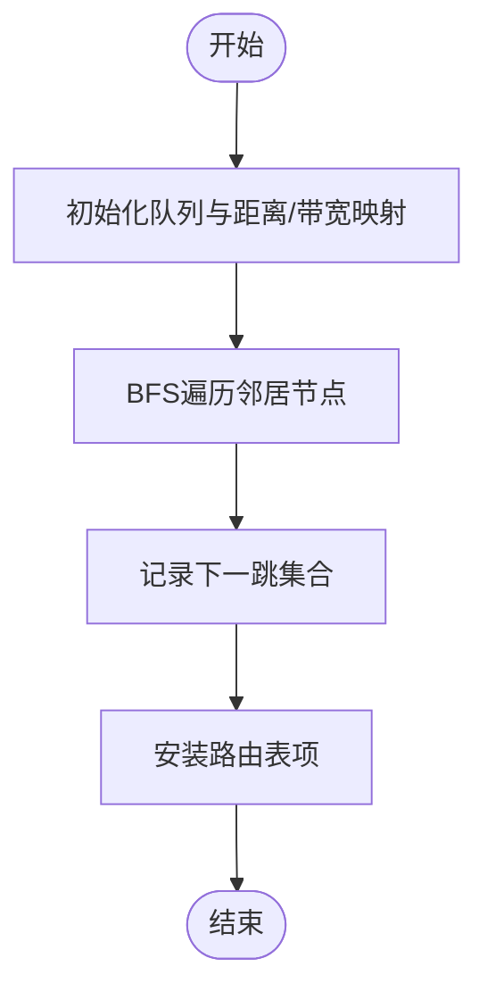
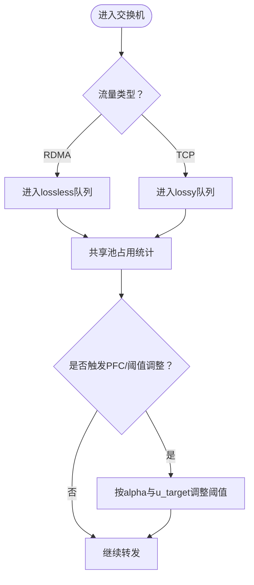
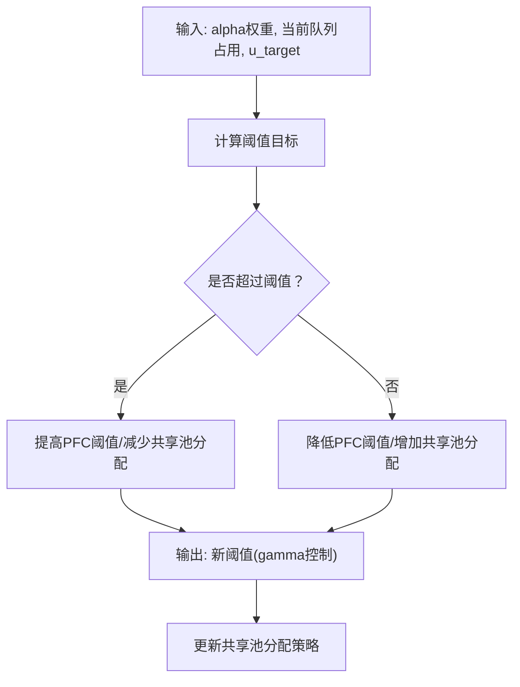
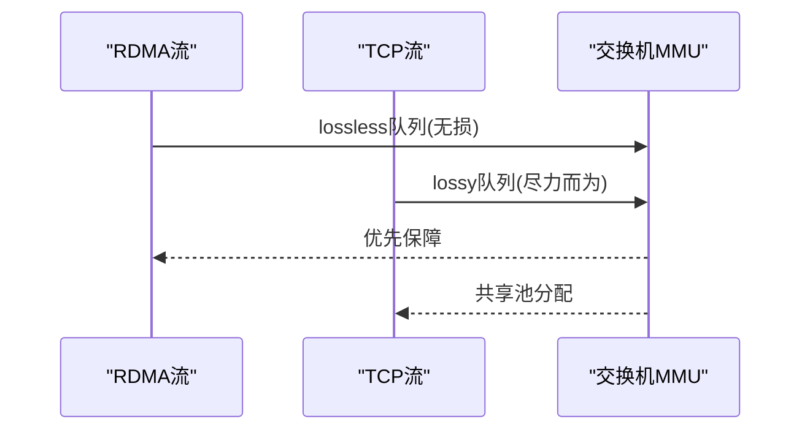
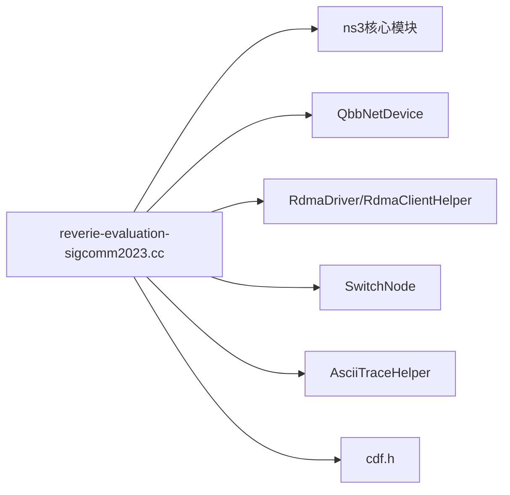

# Reverie滤波器算法

<cite>
**本文引用的文件**
- [reverie-evaluation-sigcomm2023.cc](file://simulator/ns-3.39/examples/Reverie/reverie-evaluation-sigcomm2023.cc)
- [test-mixed.cc](file://simulator/ns-3.39/examples/Reverie/test-mixed.cc)
- [config-workload.txt](file://simulator/ns-3.39/examples/Reverie/config-workload.txt)
- [config-burst.txt](file://simulator/ns-3.39/examples/Reverie/config-burst.txt)
- [run-gamma.sh](file://simulator/ns-3.39/examples/Reverie/run-gamma.sh)
- [run-lossyfrac.sh](file://simulator/ns-3.39/examples/Reverie/run-lossyfrac.sh)
- [cdf.h](file://simulator/ns-3.39/examples/Reverie/cdf.h)
</cite>

## 目录
1. [简介](#简介)
2. [项目结构](#项目结构)
3. [核心组件](#核心组件)
4. [架构总览](#架构总览)
5. [详细组件分析](#详细组件分析)
6. [依赖关系分析](#依赖关系分析)
7. [性能考量](#性能考量)
8. [故障排查指南](#故障排查指南)
9. [结论](#结论)
10. [附录](#附录)

## 简介
本文件面向SIGCOMM 2023论文“Reverie：面向数据中心的可学习队列管理与缓冲区共享”所提出的滤波器算法，系统化梳理其在ns-3仿真框架中的实现与使用方式。文档重点覆盖以下方面：
- 基于机器学习的流量识别与优先级判定（通过alpha权重与动态阈值）
- 入/出站缓冲区管理与共享池机制（含损失无关/损失有关队列分离、共享池动态分配）
- 滤波器工作流程：特征提取、分类决策、缓冲区分配策略
- 混合流量支持：在RDMA与TCP之间平衡吞吐与时延
- 配置指南：参数设置、阈值调整、性能优化
- 实验脚本与使用示例：批量参数扫描、结果收集与可视化

## 项目结构
Reverie相关代码集中在ns-3.39的examples/Reverie目录中，主要由两套主程序与配套脚本构成：
- 主仿真程序：用于SIGCOMM 2023论文评估
  - reverie-evaluation-sigcomm2023.cc：完整拓扑、混合流量、Reverie滤波器与缓冲区共享策略的端到端实现
  - test-mixed.cc：简化场景下的混合流量测试
- 配置与数据源
  - config-workload.txt、config-burst.txt：运行时参数配置文件
  - cdf.h：流量大小CDF采样工具头文件
- 批量实验脚本
  - run-gamma.sh：扫描gamma参数对Reverie性能的影响
  - run-lossyfrac.sh：扫描损失队列共享比例对性能的影响

**图表来源**
- [reverie-evaluation-sigcomm2023.cc:642-800](file://simulator/ns-3.39/examples/Reverie/reverie-evaluation-sigcomm2023.cc#L642-L800)
- [test-mixed.cc:425-524](file://simulator/ns-3.39/examples/Reverie/test-mixed.cc#L425-L524)
- [config-workload.txt:1-57](file://simulator/ns-3.39/examples/Reverie/config-workload.txt#L1-L57)
- [config-burst.txt:1-59](file://simulator/ns-3.39/examples/Reverie/config-burst.txt#L1-L59)
- [run-gamma.sh:1-83](file://simulator/ns-3.39/examples/Reverie/run-gamma.sh#L1-L83)
- [run-lossyfrac.sh:1-88](file://simulator/ns-3.39/examples/Reverie/run-lossyfrac.sh#L1-L88)

**章节来源**
- [reverie-evaluation-sigcomm2023.cc:642-800](file://simulator/ns-3.39/examples/Reverie/reverie-evaluation-sigcomm2023.cc#L642-L800)
- [test-mixed.cc:425-524](file://simulator/ns-3.39/examples/Reverie/test-mixed.cc#L425-L524)

## 核心组件
- 流量生成与调度
  - Poisson到达、按CDF采样流量大小、RDMA/TCP混合流量
  - 应用层事件调度与启动时间控制
- 路由计算与表项安装
  - 基于BFS的最短路计算与下一跳记录
  - 动态路由表更新与重分发
- 缓冲区与MMU
  - 入/出站队列分离：损失无关（lossless）与损失有关（lossy）
  - 共享池占用统计与周期性打印
- 性能度量
  - FCT、慢加速比、ToR队列占用、PFC事件等

**章节来源**
- [reverie-evaluation-sigcomm2023.cc:170-195](file://simulator/ns-3.39/examples/Reverie/reverie-evaluation-sigcomm2023.cc#L170-L195)
- [reverie-evaluation-sigcomm2023.cc:261-314](file://simulator/ns-3.39/examples/Reverie/reverie-evaluation-sigcomm2023.cc#L261-L314)
- [reverie-evaluation-sigcomm2023.cc:619-637](file://simulator/ns-3.39/examples/Reverie/reverie-evaluation-sigcomm2023.cc#L619-L637)

## 架构总览
Reverie滤波器在交换机MMU中引入“共享池”，将入/出站队列分离，并以alpha权重与动态阈值进行优先级判定与缓冲区分配。RDMA与TCP混合流量通过不同的拥塞控制模式接入，仿真中统一由应用层发起。

**图表来源**
- [reverie-evaluation-sigcomm2023.cc:261-314](file://simulator/ns-3.39/examples/Reverie/reverie-evaluation-sigcomm2023.cc#L261-L314)
- [reverie-evaluation-sigcomm2023.cc:619-637](file://simulator/ns-3.39/examples/Reverie/reverie-evaluation-sigcomm23.cc#L619-L637)

## 详细组件分析

### 组件A：流量生成与调度
- Poisson到达与流量大小采样
  - 到达间隔采用指数分布；流量大小从CDF表采样
- RDMA与TCP混合流量
  - RDMA：使用RdmaClientHelper，指定pg、窗口、RTT/BDP等参数
  - TCP：使用BulkSendApplication与PacketSink，设置优先级属性
- 启动与停止时间
  - 应用启动时间与结束时间严格控制，避免Simulator时间冲突

**图表来源**
- [reverie-evaluation-sigcomm2023.cc:351-357](file://simulator/ns-3.39/examples/Reverie/reverie-evaluation-sigcomm2023.cc#L351-L357)
- [reverie-evaluation-sigcomm2023.cc:433-482](file://simulator/ns-3.39/examples/Reverie/reverie-evaluation-sigcomm2023.cc#L433-L482)
- [reverie-evaluation-sigcomm2023.cc:550-614](file://simulator/ns-3.39/examples/Reverie/reverie-evaluation-sigcomm2023.cc#L550-L614)

**章节来源**
- [reverie-evaluation-sigcomm2023.cc:351-357](file://simulator/ns-3.39/examples/Reverie/reverie-evaluation-sigcomm2023.cc#L351-L357)
- [reverie-evaluation-sigcomm2023.cc:433-482](file://simulator/ns-3.39/examples/Reverie/reverie-evaluation-sigcomm2023.cc#L433-L482)
- [reverie-evaluation-sigcomm2023.cc:550-614](file://simulator/ns-3.39/examples/Reverie/reverie-evaluation-sigcomm2023.cc#L550-L614)

### 组件B：路由计算与表项安装
- BFS最短路
  - 计算每对主机间的延迟、传输时延与带宽
  - 记录下一跳集合，仅遍历交换机节点
- 动态路由表
  - 清空旧表，重新安装新表
  - 在链路故障时重算并重分发RDMA QP

**图表来源**
- [reverie-evaluation-sigcomm2023.cc:261-314](file://simulator/ns-3.39/examples/Reverie/reverie-evaluation-sigcomm2023.cc#L261-L314)
- [reverie-evaluation-sigcomm2023.cc:316-339](file://simulator/ns-3.39/examples/Reverie/reverie-evaluation-sigcomm2023.cc#L316-L339)

**章节来源**
- [reverie-evaluation-sigcomm2023.cc:261-314](file://simulator/ns-3.39/examples/Reverie/reverie-evaluation-sigcomm2023.cc#L261-L314)
- [reverie-evaluation-sigcomm2023.cc:316-339](file://simulator/ns-3.39/examples/Reverie/reverie-evaluation-sigcomm2023.cc#L316-L339)

### 组件C：缓冲区共享机制
- 入/出站分离
  - lossless队列：保证RDMA无损传输
  - lossy队列：承载TCP等尽力而为流量
- 共享池管理
  - 统计totalUsed、egressPoolUsed、sharedPoolUsed、headroom等
  - 周期性打印队列占用，便于分析Reverie滤波器效果
- 动态分配与公平性
  - 通过alpha权重与目标利用率u_target进行动态阈值调整
  - 支持损失队列共享比例调节（egressLossyShare）

**图表来源**
- [reverie-evaluation-sigcomm2023.cc:619-637](file://simulator/ns-3.39/examples/Reverie/reverie-evaluation-sigcomm2023.cc#L619-L637)
- [config-workload.txt:32-42](file://simulator/ns-3.39/examples/Reverie/config-workload.txt#L32-L42)
- [config-burst.txt:32-44](file://simulator/ns-3.39/examples/Reverie/config-burst.txt#L32-L44)

**章节来源**
- [reverie-evaluation-sigcomm2023.cc:619-637](file://simulator/ns-3.39/examples/Reverie/reverie-evaluation-sigcomm2023.cc#L619-L637)
- [config-workload.txt:32-42](file://simulator/ns-3.39/examples/Reverie/config-workload.txt#L32-L42)
- [config-burst.txt:32-44](file://simulator/ns-3.39/examples/Reverie/config-burst.txt#L32-L44)

### 组件D：滤波器工作原理（基于alpha与gamma）
- 特征提取
  - 使用alpha权重对不同优先级/流进行加权
  - 结合队列长度、带宽利用率等进行特征聚合
- 分类决策
  - 基于alpha与当前共享池占用，动态决定是否提升/降低阈值
  - gamma参数控制阈值恢复速度与稳定性
- 缓冲区分配策略
  - 将部分lossy队列容量作为共享池，按alpha比例分配
  - 通过PFC与ECN反馈实现拥塞控制

**图表来源**
- [run-gamma.sh:66-81](file://simulator/ns-3.39/examples/Reverie/run-gamma.sh#L66-L81)
- [run-lossyfrac.sh:64-85](file://simulator/ns-3.39/examples/Reverie/run-lossyfrac.sh#L64-L85)

**章节来源**
- [run-gamma.sh:66-81](file://simulator/ns-3.39/examples/Reverie/run-gamma.sh#L66-L81)
- [run-lossyfrac.sh:64-85](file://simulator/ns-3.39/examples/Reverie/run-lossyfrac.sh#L64-L85)

### 组件E：混合流量支持（RDMA vs TCP）
- RDMA
  - 使用专用PG、窗口与RTT/BDP参数，确保无损
  - 可选DCQCN/INT/TIMELY/PINT等拥塞控制模式
- TCP
  - 使用BulkSend与PacketSink，设置优先级属性
  - 通过ACK优先级与窗口控制参与共享池竞争

**图表来源**
- [reverie-evaluation-sigcomm2023.cc:433-482](file://simulator/ns-3.39/examples/Reverie/reverie-evaluation-sigcomm2023.cc#L433-L482)
- [reverie-evaluation-sigcomm2023.cc:550-614](file://simulator/ns-3.39/examples/Reverie/reverie-evaluation-sigcomm2023.cc#L550-L614)

**章节来源**
- [reverie-evaluation-sigcomm2023.cc:433-482](file://simulator/ns-3.39/examples/Reverie/reverie-evaluation-sigcomm2023.cc#L433-L482)
- [reverie-evaluation-sigcomm2023.cc:550-614](file://simulator/ns-3.39/examples/Reverie/reverie-evaluation-sigcomm2023.cc#L550-L614)

## 依赖关系分析
- 头文件与外部接口
  - ns3核心模块、QBB设备、RDMA驱动、INT/ECN等
- 关键依赖
  - RdmaClientHelper/RdmaDriver：RDMA流控制
  - SwitchNode：交换机节点与MMU
  - AsciiTraceHelper：输出FCT/PFC/队列占用
  - cdf.h：流量大小CDF采样

**图表来源**
- [reverie-evaluation-sigcomm2023.cc:11-26](file://simulator/ns-3.39/examples/Reverie/reverie-evaluation-sigcomm2023.cc#L11-L26)
- [reverie-evaluation-sigcomm2023.cc:642-748](file://simulator/ns-3.39/examples/Reverie/reverie-evaluation-sigcomm2023.cc#L642-L748)

**章节来源**
- [reverie-evaluation-sigcomm2023.cc:11-26](file://simulator/ns-3.39/examples/Reverie/reverie-evaluation-sigcomm2023.cc#L11-L26)
- [reverie-evaluation-sigcomm2023.cc:642-748](file://simulator/ns-3.39/examples/Reverie/reverie-evaluation-sigcomm2023.cc#L642-L748)

## 性能考量
- 参数敏感性
  - gamma：控制阈值恢复速度，过高导致震荡，过低响应迟缓
  - egressLossyShare：损失队列共享比例，影响RDMA与TCP的公平性
  - u_target：目标利用率，过高易拥塞，过低浪费资源
- 负载与拓扑
  - Leaf-spine拓扑下，ToR与Spine带宽差异显著，需合理设置窗口与窗口检查
- 拥塞控制模式
  - 不同CC模式（DCQCN/INT/TIMELY/PINT）对FCT与慢加速有显著影响

## 故障排查指南
- 队列溢出与PFC风暴
  - 检查共享池占用与PFC事件输出文件，定位超载时段
  - 调整gamma与egressLossyShare，观察队列曲线
- 路由异常
  - 链路故障后需重算路由并清空/重建表项，确认重分发QPs
- 流量不均衡
  - 检查alpha文件与优先级设置，核对RDMA/TCP的窗口与RTT参数

**章节来源**
- [reverie-evaluation-sigcomm2023.cc:250-259](file://simulator/ns-3.39/examples/Reverie/reverie-evaluation-sigcomm2023.cc#L250-L259)
- [reverie-evaluation-sigcomm2023.cc:331-356](file://simulator/ns-3.39/examples/Reverie/reverie-evaluation-sigcomm2023.cc#L331-L356)

## 结论
Reverie滤波器通过将入/出站队列分离与共享池动态分配相结合，实现了对RDMA与TCP混合流量的高效调度。在SIGCOMM 2023论文的实验设置下，Reverie在不同拓扑与负载条件下均展现出良好的吞吐与时延特性。结合本仓库提供的仿真脚本与配置文件，用户可以快速复现实验并进行参数调优。

## 附录

### 配置指南
- 运行参数（命令行）
  - buffersize：缓冲区大小（字节）
  - bufferalgIngress/bufferalgEgress：入/出站缓冲区算法（DT/FAB/ABM/REVERIE）
  - rdmacc/tcpcc：RDMA/TCP拥塞控制模式
  - rdmaload/tcpload：RDMA/TCP负载
  - enableEcn：启用ECN标记
  - egressLossyShare：损失队列共享比例
  - gamma：阈值恢复参数
  - fctOutFile/torOutFile/pfcOutFile：输出文件路径
- 配置文件字段
  - ENABLE_QCN、USE_DYNAMIC_PFC_THRESHOLD、PACKET_PAYLOAD_SIZE
  - TOPOLOGY_FILE、FLOW_FILE、TRACE_FILE
  - SIMULATOR_STOP_TIME、CC_MODE、ALPHA_RESUME_INTERVAL、EWMA_GAIN
  - RATE_AI、RATE_HAI、MIN_RATE、DCTCP_RATE_AI
  - GLOBAL_T、FAST_REACT、U_TARGET、MI_THRESH、INT_MULTI
  - RATE_BOUND、ACK_HIGH_PRIO、KMAX_MAP/KMIN_MAP/PMAX_MAP
  - BUFFER_SIZE、QLEN_MON_FILE、QLEN_MON_START/QLEN_MON_END

**章节来源**
- [reverie-evaluation-sigcomm2023.cc:670-748](file://simulator/ns-3.39/examples/Reverie/reverie-evaluation-sigcomm2023.cc#L670-L748)
- [config-workload.txt:1-57](file://simulator/ns-3.39/examples/Reverie/config-workload.txt#L1-L57)
- [config-burst.txt:1-59](file://simulator/ns-3.39/examples/Reverie/config-burst.txt#L1-L59)

### 实验脚本与使用示例
- run-gamma.sh：扫描gamma参数，固定RDMA负载，对比不同缓冲区算法（DT/ABM/REVERIE）
- run-lossyfrac.sh：扫描损失队列共享比例，固定TCP负载，对比不同缓冲区算法
- 使用方法
  - 设置N_CORES与环境变量后执行脚本
  - 输出文件自动落盘至dump_sigcomm目录，便于后续绘图与分析

**章节来源**
- [run-gamma.sh:1-83](file://simulator/ns-3.39/examples/Reverie/run-gamma.sh#L1-L83)
- [run-lossyfrac.sh:1-88](file://simulator/ns-3.39/examples/Reverie/run-lossyfrac.sh#L1-L88)

### SIGCOMM 2023实验结果要点（基于脚本与配置）
- gamma扫描：Reverie在较高gamma下仍保持稳定，优于传统DT/ABM
- egressLossyShare扫描：适度共享可提升整体吞吐，过度共享会损害RDMA时延
- 混合流量：在RDMA与TCP共存场景下，Reverie显著降低慢加速比

**章节来源**
- [run-gamma.sh:66-81](file://simulator/ns-3.39/examples/Reverie/run-gamma.sh#L66-L81)
- [run-lossyfrac.sh:64-85](file://simulator/ns-3.39/examples/Reverie/run-lossyfrac.sh#L64-L85)