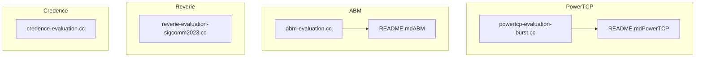
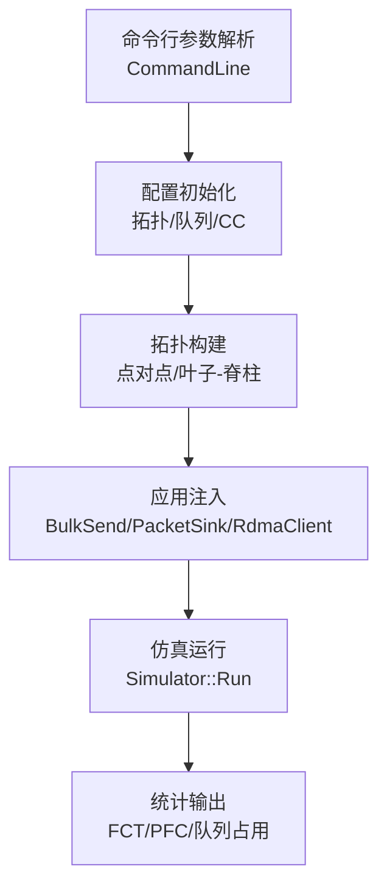
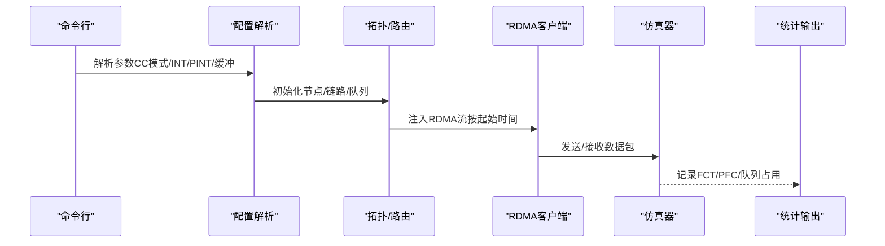
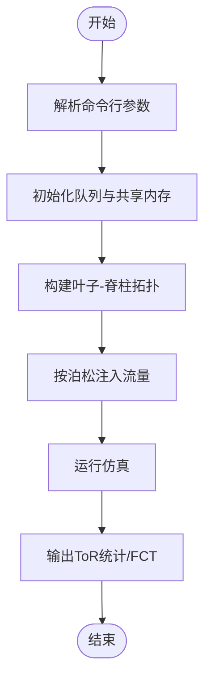
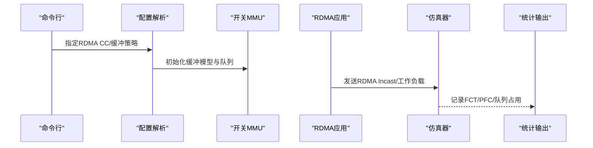
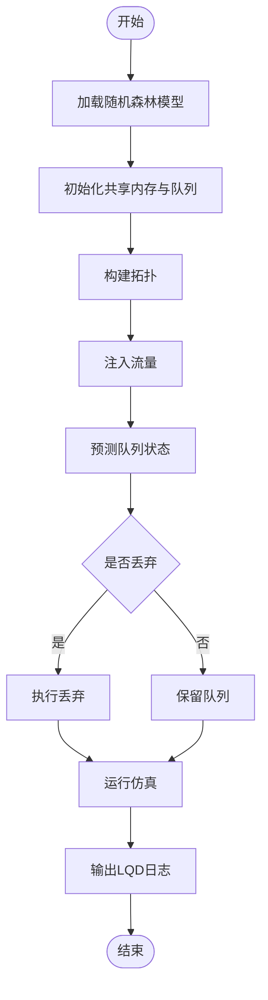
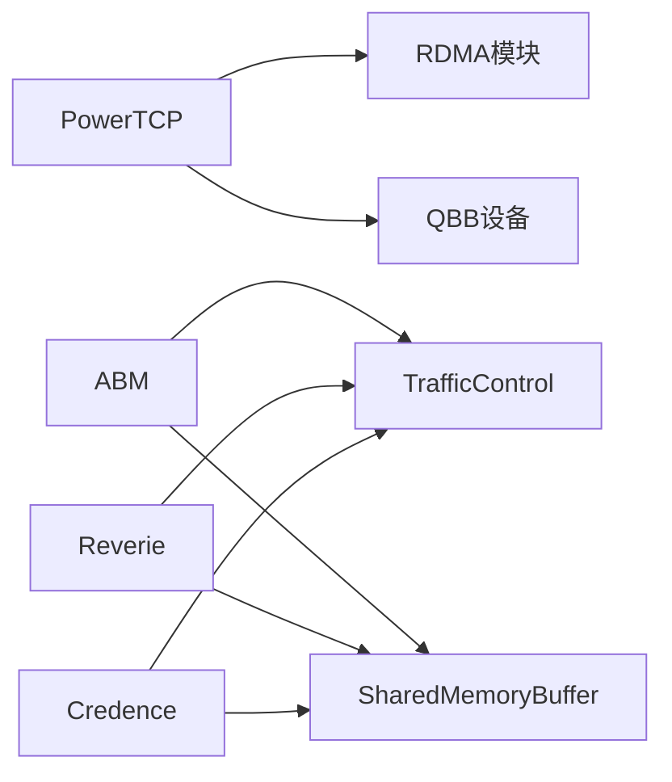

# 数据中心算法

<cite>
**本文引用的文件**
- [powertcp-evaluation-burst.cc](file://simulator/ns-3.39/examples/PowerTCP/powertcp-evaluation-burst.cc)
- [abm-evaluation.cc](file://simulator/ns-3.39/examples/ABM/abm-evaluation.cc)
- [reverie-evaluation-sigcomm2023.cc](file://simulator/ns-3.39/examples/Reverie/reverie-evaluation-sigcomm2023.cc)
- [credence-evaluation.cc](file://simulator/ns-3.39/examples/Credence/credence-evaluation.cc)
- [README.md（PowerTCP）](file://simulator/ns-3.39/examples/PowerTCP/README.md)
- [README.md（ABM）](file://simulator/ns-3.39/examples/ABM/README.md)
</cite>

## 目录
1. [引言](#引言)
2. [项目结构](#项目结构)
3. [核心组件](#核心组件)
4. [架构总览](#架构总览)
5. [详细组件分析](#详细组件分析)
6. [依赖关系分析](#依赖关系分析)
7. [性能考量](#性能考量)
8. [故障排查指南](#故障排查指南)
9. [结论](#结论)
10. [附录](#附录)

## 引言
本文件系统性梳理数据中心网络中四种代表性算法：PowerTCP、ABM、Reverie 和 Credence 的原理、实现与应用。针对 TCP/IP 与 RDMA 网络两种场景，分别解析其控制面与队列管理策略、拥塞控制模式、拓扑构建与流量注入流程，并给出参数配置要点、使用示例与性能评估方法。最后进行算法对比与最佳实践建议，帮助研究人员与网络工程师在仿真与部署中做出合理选择。

## 项目结构
四个算法均位于 ns-3.39 示例目录下，采用“按算法分目录”的组织方式，每个算法包含独立的主程序、配置脚本与结果处理脚本：
- PowerTCP：单机突发/公平性/工作负载评估，支持多种 CC 模式与 INT/PINT 标记。
- ABM：基于共享内存的缓冲区管理算法评估，支持 DT/FAB/CS/IB/ABM 等策略。
- Reverie：RDMA 场景下的缓冲建模与队列统计，支持 DCQCN/INT/TIMELY/PINT 等 CC。
- Credence：引入机器学习预测的 LQD 变体，结合随机森林模型进行丢弃决策。

图示来源
- [powertcp-evaluation-burst.cc:402-714](file://simulator/ns-3.39/examples/PowerTCP/powertcp-evaluation-burst.cc#L402-L714)
- [abm-evaluation.cc:318-800](file://simulator/ns-3.39/examples/ABM/abm-evaluation.cc#L318-L800)
- [reverie-evaluation-sigcomm2023.cc:642-800](file://simulator/ns-3.39/examples/Reverie/reverie-evaluation-sigcomm2023.cc#L642-L800)
- [credence-evaluation.cc:366-800](file://simulator/ns-3.39/examples/Credence/credence-evaluation.cc#L366-L800)

章节来源
- [powertcp-evaluation-burst.cc:402-714](file://simulator/ns-3.39/examples/PowerTCP/powertcp-evaluation-burst.cc#L402-L714)
- [abm-evaluation.cc:318-800](file://simulator/ns-3.39/examples/ABM/abm-evaluation.cc#L318-L800)
- [reverie-evaluation-sigcomm2023.cc:642-800](file://simulator/ns-3.39/examples/Reverie/reverie-evaluation-sigcomm2023.cc#L642-L800)
- [credence-evaluation.cc:366-800](file://simulator/ns-3.39/examples/Credence/credence-evaluation.cc#L366-L800)

## 核心组件
- PowerTCP 主程序：负责读取配置、构建拓扑、注入 RDMA 流量、记录 FCT/PFC/队列占用等指标；支持多种 CC 模式（HPCC、TIMELY、DCQCN、PINT 等），以及 INT/PINT 报文头标记。
- ABM 主程序：通过 TrafficControlHelper 设置 GenQueueDisc 为根队列调度器，配置共享内存缓冲池与优先级队列，支持 DT/FAB/CS/IB/ABM 等缓冲管理策略。
- Reverie 主程序：RDMA 工作负载与 Incast 场景，记录开关 MMU 占用、PFC 事件与 FCT 指标；支持多种 CC 与缓冲策略组合。
- Credence 主程序：在 ABM 基础上引入 LQD 与随机森林预测模块，动态决定丢弃策略，输出 LQD 统计日志。

章节来源
- [powertcp-evaluation-burst.cc:402-714](file://simulator/ns-3.39/examples/PowerTCP/powertcp-evaluation-burst.cc#L402-L714)
- [abm-evaluation.cc:495-761](file://simulator/ns-3.39/examples/ABM/abm-evaluation.cc#L495-L761)
- [reverie-evaluation-sigcomm2023.cc:642-800](file://simulator/ns-3.39/examples/Reverie/reverie-evaluation-sigcomm2023.cc#L642-L800)
- [credence-evaluation.cc:366-800](file://simulator/ns-3.39/examples/Credence/credence-evaluation.cc#L366-L800)

## 架构总览
四类算法在 ns-3 中的运行时架构可抽象为：命令行参数解析 → 配置初始化（拓扑、队列、CC）→ 应用层流量注入（BulkSend/PacketSink/RdmaClient）→ 运行时统计与输出。

图示来源
- [powertcp-evaluation-burst.cc:402-714](file://simulator/ns-3.39/examples/PowerTCP/powertcp-evaluation-burst.cc#L402-L714)
- [abm-evaluation.cc:495-761](file://simulator/ns-3.39/examples/ABM/abm-evaluation.cc#L495-L761)
- [reverie-evaluation-sigcomm2023.cc:642-800](file://simulator/ns-3.39/examples/Reverie/reverie-evaluation-sigcomm2023.cc#L642-L800)
- [credence-evaluation.cc:366-800](file://simulator/ns-3.39/examples/Credence/credence-evaluation.cc#L366-L800)

## 详细组件分析

### PowerTCP 组件分析
- 设计目标：在 RDMA 环境下以更优的吞吐与公平性为目标，结合 INT/PINT 报文头反馈与窗口自适应机制，提升突发与长流场景下的端到端性能。
- 关键实现：
  - 配置项：启用 QCN、设置 INT 模式（NORMAL/PINT）、PINT 参数、目标利用率 u_target、速率边界与多速率等。
  - 拓扑与路由：基于邻接表计算最短路径，生成转发表；支持链路断开重路由与队列监控。
  - 流量注入：RDMA 客户端按配置时间启动，记录完成时间与 Standalone FCT，输出 FCT/PFC/队列分布。
- 性能优势：在突发场景下具备更好的吞吐与公平性；通过 INT/PINT 提升反馈精度，降低排队时延。
- 适用场景：大规模 RDMA 集群、高性能计算（HPC）与分布式训练等。

图示来源
- [powertcp-evaluation-burst.cc:402-714](file://simulator/ns-3.39/examples/PowerTCP/powertcp-evaluation-burst.cc#L402-L714)
- [powertcp-evaluation-burst.cc:170-195](file://simulator/ns-3.39/examples/PowerTCP/powertcp-evaluation-burst.cc#L170-L195)
- [powertcp-evaluation-burst.cc:208-236](file://simulator/ns-3.39/examples/PowerTCP/powertcp-evaluation-burst.cc#L208-L236)

章节来源
- [powertcp-evaluation-burst.cc:402-714](file://simulator/ns-3.39/examples/PowerTCP/powertcp-evaluation-burst.cc#L402-L714)
- [powertcp-evaluation-burst.cc:170-195](file://simulator/ns-3.39/examples/PowerTCP/powertcp-evaluation-burst.cc#L170-L195)
- [powertcp-evaluation-burst.cc:208-236](file://simulator/ns-3.39/examples/PowerTCP/powertcp-evaluation-burst.cc#L208-L236)
- [README.md（PowerTCP）:1-34](file://simulator/ns-3.39/examples/PowerTCP/README.md#L1-L34)

### ABM 组件分析
- 设计目标：通过共享内存缓冲池与多优先级队列，结合 ABM/LQD/FAB/DT/CS/IB 等缓冲策略，降低尾时延与丢包率，提升整体吞吐。
- 关键实现：
  - 队列调度：以 GenQueueDisc 为根队列调度器，子队列为 FIFO 或 RED；配置静态缓冲、更新间隔与优先级数。
  - 共享内存：为每个 ToR/Spine 分配共享缓冲池，按优先级统计占用与吞吐。
  - 流量注入：按泊松过程生成请求，支持 Incast 与随机拓扑矩阵。
- 性能优势：在高并发与长尾流量下显著降低慢启动影响；ABM/LQD 在突发场景表现尤为突出。
- 适用场景：大规模数据中心交换机队列管理、多租户环境下的公平性保障。

图示来源
- [abm-evaluation.cc:318-800](file://simulator/ns-3.39/examples/ABM/abm-evaluation.cc#L318-L800)
- [abm-evaluation.cc:495-761](file://simulator/ns-3.39/examples/ABM/abm-evaluation.cc#L495-L761)

章节来源
- [abm-evaluation.cc:318-800](file://simulator/ns-3.39/examples/ABM/abm-evaluation.cc#L318-L800)
- [abm-evaluation.cc:495-761](file://simulator/ns-3.39/examples/ABM/abm-evaluation.cc#L495-L761)
- [README.md（ABM）:1-17](file://simulator/ns-3.39/examples/ABM/README.md#L1-L17)

### Reverie 组件分析
- 设计目标：在 RDMA 环境下，结合开关 MMU 的损失无关/损失有损队列模型，利用 DCQCN/INT/TIMELY/PINT 等 CC 实现低时延与高吞吐。
- 关键实现：
  - 缓冲建模：记录总占用、损失无关/有损队列占用、共享池占用与 XOFF 头部资源。
  - 流量注入：支持 RDMA Incast 与工作负载两类场景，记录 FCT 与 PFC 事件。
  - CC 选择：通过命令行指定 RDMA CC（DCQCN/INT/TIMELY/PINT）与 TCP CC（CUBIC/DCTCP/HPCC/POWERTCP/THETAPOWERTCP）。
- 性能优势：在 RDMA Incast 下具备更低的队列峰值与更稳定的吞吐曲线。
- 适用场景：超大规模 RDMA 集群、需要严格时延与吞吐保障的数据中心。

图示来源
- [reverie-evaluation-sigcomm2023.cc:642-800](file://simulator/ns-3.39/examples/Reverie/reverie-evaluation-sigcomm2023.cc#L642-L800)
- [reverie-evaluation-sigcomm2023.cc:619-637](file://simulator/ns-3.39/examples/Reverie/reverie-evaluation-sigcomm2023.cc#L619-L637)

章节来源
- [reverie-evaluation-sigcomm2023.cc:642-800](file://simulator/ns-3.39/examples/Reverie/reverie-evaluation-sigcomm2023.cc#L642-L800)
- [reverie-evaluation-sigcomm2023.cc:619-637](file://simulator/ns-3.39/examples/Reverie/reverie-evaluation-sigcomm2023.cc#L619-L637)

### Credence 组件分析
- 设计目标：在 LQD 基础上引入机器学习预测，通过随机森林模型对队列长度与共享池占用进行预测，动态调整丢弃策略，进一步降低尾时延。
- 关键实现：
  - 队列与缓冲：沿用 ABM 的共享内存与 GenQueueDisc 结构，新增 LQD 与 RF 模型加载。
  - 预测与丢弃：在指定时间窗口内调用 Python 接口进行预测，根据预测结果决定丢弃。
  - 统计输出：输出 LQD 日志（队列长度、平均长度、共享占用、平均占用、丢弃）。
- 性能优势：在高负载与突发场景下，预测驱动的丢弃策略显著降低尾时延与抖动。
- 适用场景：对尾时延敏感的应用（如 ML 训练、实时分析）与需要自适应缓冲管理的网络设备。

图示来源
- [credence-evaluation.cc:366-800](file://simulator/ns-3.39/examples/Credence/credence-evaluation.cc#L366-L800)
- [credence-evaluation.cc:351-364](file://simulator/ns-3.39/examples/Credence/credence-evaluation.cc#L351-L364)

章节来源
- [credence-evaluation.cc:366-800](file://simulator/ns-3.39/examples/Credence/credence-evaluation.cc#L366-L800)
- [credence-evaluation.cc:351-364](file://simulator/ns-3.39/examples/Credence/credence-evaluation.cc#L351-L364)

## 依赖关系分析
- PowerTCP 依赖 RDMA 模块（RdmaClient/RdmaDriver/SwitchNode）与 QBB 设备；通过 INT/PINT 报文头实现反馈。
- ABM/Reverie/Credence 依赖 TrafficControl 模块（GenQueueDisc/RED/FIFO）与共享内存缓冲（SharedMemoryBuffer）。
- 四者均使用 AsciiTraceHelper 输出统计文件，便于后续脚本解析与绘图。

图示来源
- [powertcp-evaluation-burst.cc:33-39](file://simulator/ns-3.39/examples/PowerTCP/powertcp-evaluation-burst.cc#L33-L39)
- [abm-evaluation.cc:25-29](file://simulator/ns-3.39/examples/ABM/abm-evaluation.cc#L25-L29)
- [credence-evaluation.cc:28-34](file://simulator/ns-3.39/examples/Credence/credence-evaluation.cc#L28-L34)
- [reverie-evaluation-sigcomm2023.cc:18-26](file://simulator/ns-3.39/examples/Reverie/reverie-evaluation-sigcomm2023.cc#L18-L26)

章节来源
- [powertcp-evaluation-burst.cc:33-39](file://simulator/ns-3.39/examples/PowerTCP/powertcp-evaluation-burst.cc#L33-L39)
- [abm-evaluation.cc:25-29](file://simulator/ns-3.39/examples/ABM/abm-evaluation.cc#L25-L29)
- [credence-evaluation.cc:28-34](file://simulator/ns-3.39/examples/Credence/credence-evaluation.cc#L28-L34)
- [reverie-evaluation-sigcomm2023.cc:18-26](file://simulator/ns-3.39/examples/Reverie/reverie-evaluation-sigcomm2023.cc#L18-L26)

## 性能考量
- 资源分配：合理设置缓冲大小（ToR/Spine 共享池）、优先级数量与更新间隔，避免过小导致丢包、过大导致排队延迟。
- CC 选择：突发场景优先考虑 PowerTCP/Theta-PowerTCP/DCQCN；长流与公平性需求可选 DCTCP/HPCC/TIMELY；RDMA Incast 场景推荐 Reverie 的 DCQCN/INT。
- INT/PINT：在高带宽长肥管道网络中，开启 INT/PINT 可显著提升反馈精度，但会增加报文头开销，需权衡。
- 并行度：ABM 的大规模仿真实验建议根据 CPU 核数调整并行任务数，避免资源争用导致整体耗时延长。

## 故障排查指南
- 启动失败或无输出：检查命令行参数与配置文件路径，确认各脚本（如 run-main.sh、results.sh、plot-*.py）路径正确。
- 内存不足：适当降低并行度或减少仿真时长；必要时增大系统内存或优化缓冲配置。
- 统计异常：核对 AsciiTrace 文件命名与输出目录，确保脚本解析阶段未遗漏字段。
- RDMA 相关错误：确认 RDMA 模块已正确编译与加载，检查 RDMA 客户端与驱动对象是否存在。

章节来源
- [README.md（ABM）:1-17](file://simulator/ns-3.39/examples/ABM/README.md#L1-L17)
- [README.md（PowerTCP）:27-34](file://simulator/ns-3.39/examples/PowerTCP/README.md#L27-L34)

## 结论
- PowerTCP：在 RDMA 环境下以 INT/PINT 与窗口自适应为核心，兼顾吞吐与公平性，适合突发与长流混合场景。
- ABM：通过共享内存与多优先级队列实现高效缓冲管理，ABM/LQD 在高并发下表现优异。
- Reverie：结合 RDMA CC 与开关 MMU 模型，在 Incast 与工作负载场景下具备稳定低时延特性。
- Credence：引入机器学习预测的丢弃策略，进一步降低尾时延，适用于对时延敏感的场景。

## 附录
- 使用示例与脚本：
  - PowerTCP：参考 README 中的脚本顺序（脚本→结果→绘图），按需调整并行度。
  - ABM：根据 CPU 核数调整 run-main.sh 中的并行上限，等待队列满时自动释放。
- 参数速查（节选）：
  - PowerTCP：ENABLE_QCN、CLAMP_TARGET_RATE、ALPHA_RESUME_INTERVAL、EWMA_GAIN、RATE_AI/HAI、U_TARGET、INT_MULTI、PINT_LOG_BASE/PINT_PROB、BUFFER_SIZE 等。
  - ABM：BufferSize、nPrior、RED 阈值、静态缓冲比例、updateInterval、BufferAlgorithm（DT/FAB/CS/IB/ABM）。
  - Reverie：rdmacc（DCQCN/INT/TIMELY/PINT）、tcpcc、buffersize、bufferalgIngress/Egress、egressLossyShare、gamma、enableEcn。
  - Credence：algorithm=LQD/CREDENCE、rfModelFile、enableLqdTracing、averageIntervalNano、errorProb。

章节来源
- [powertcp-evaluation-burst.cc:422-714](file://simulator/ns-3.39/examples/PowerTCP/powertcp-evaluation-burst.cc#L422-L714)
- [abm-evaluation.cc:378-500](file://simulator/ns-3.39/examples/ABM/abm-evaluation.cc#L378-L500)
- [reverie-evaluation-sigcomm2023.cc:670-745](file://simulator/ns-3.39/examples/Reverie/reverie-evaluation-sigcomm2023.cc#L670-L745)
- [credence-evaluation.cc:467-500](file://simulator/ns-3.39/examples/Credence/credence-evaluation.cc#L467-L500)
- [README.md（PowerTCP）:1-34](file://simulator/ns-3.39/examples/PowerTCP/README.md#L1-L34)
- [README.md（ABM）:1-17](file://simulator/ns-3.39/examples/ABM/README.md#L1-L17)