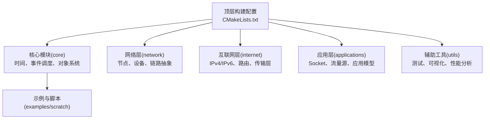
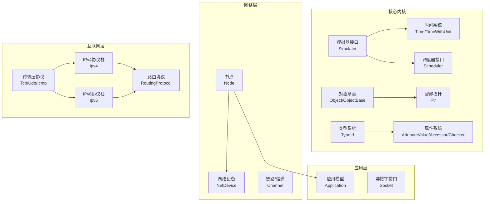
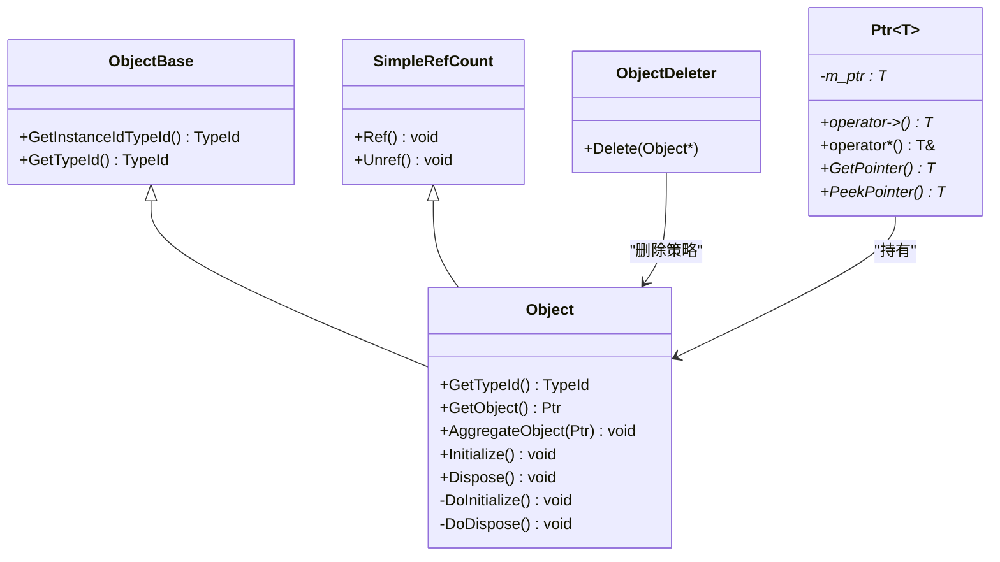
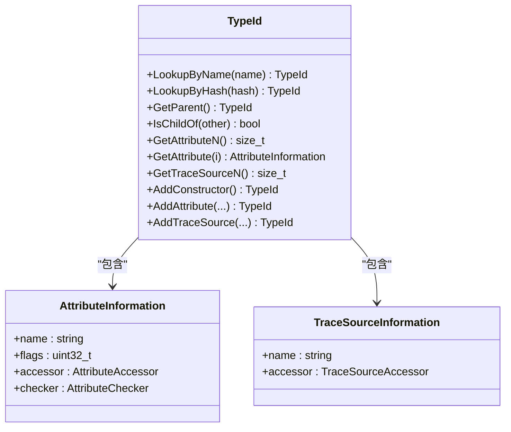
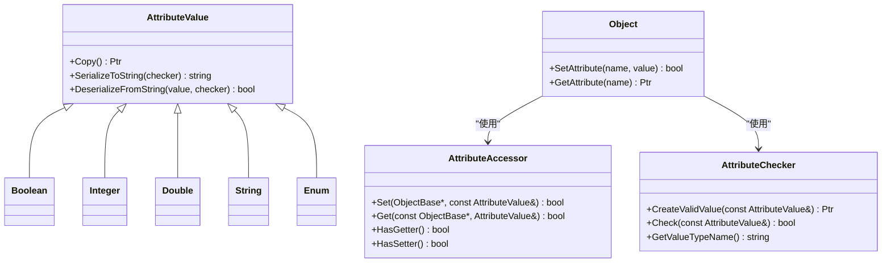
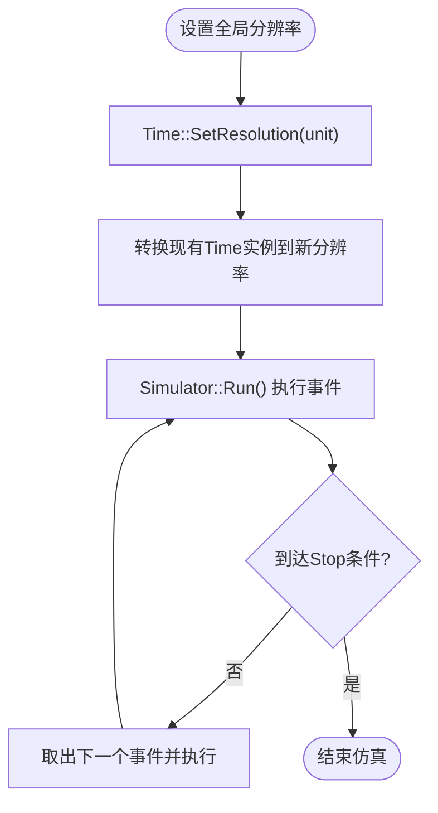
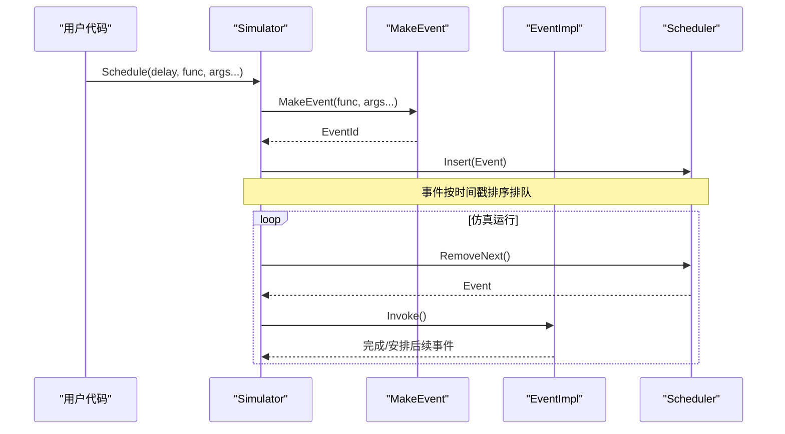
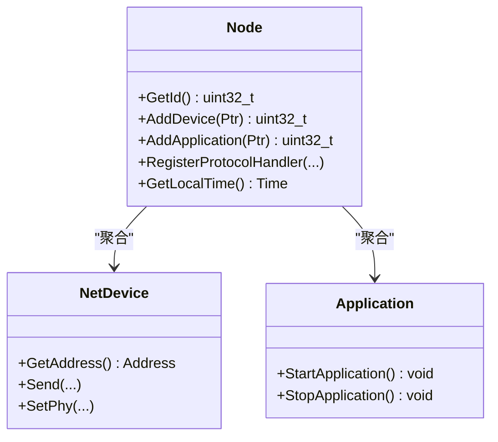
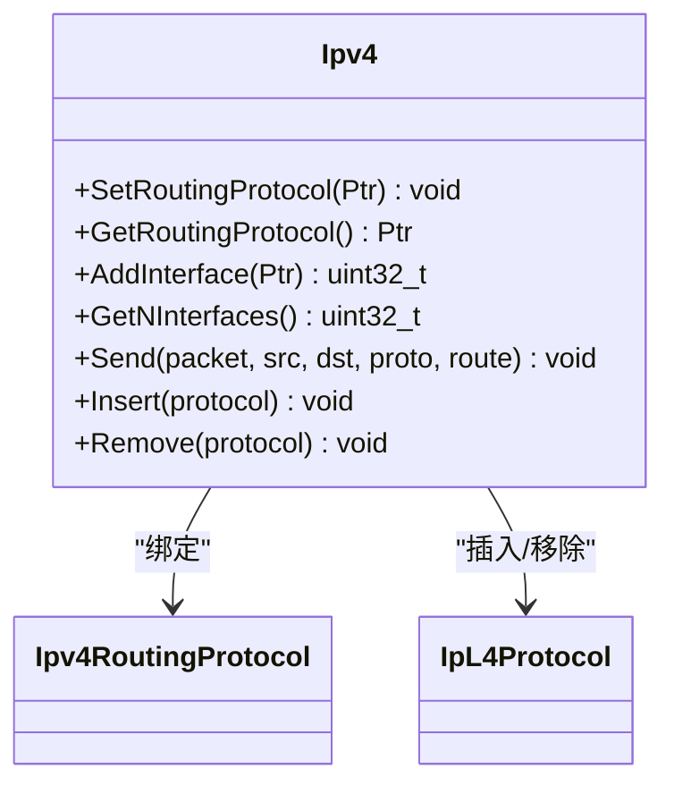
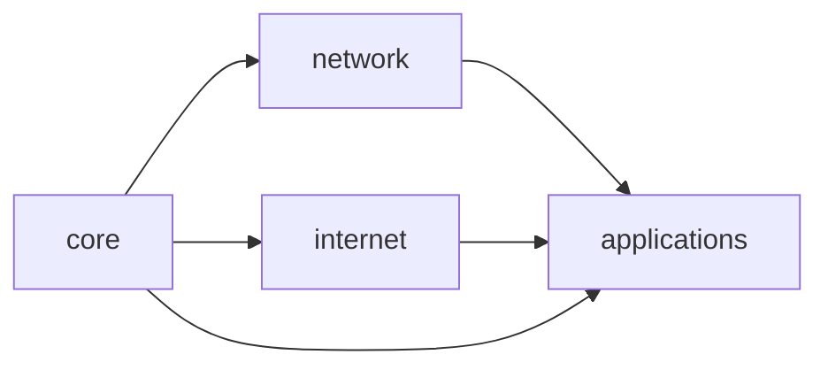

# NS-3架构设计

<cite>
**本文档引用的文件**
- [README.md](file://simulator/ns-3.39/README.md)
- [CMakeLists.txt](file://simulator/ns-3.39/CMakeLists.txt)
- [core/CMakeLists.txt](file://simulator/ns-3.39/src/core/CMakeLists.txt)
- [nstime.h](file://simulator/ns-3.39/src/core/model/nstime.h)
- [simulator.h](file://simulator/ns-3.39/src/core/model/simulator.h)
- [object.h](file://simulator/ns-3.39/src/core/model/object.h)
- [type-id.h](file://simulator/ns-3.39/src/core/model/type-id.h)
- [attribute.h](file://simulator/ns-3.39/src/core/model/attribute.h)
- [ptr.h](file://simulator/ns-3.39/src/core/model/ptr.h)
- [scheduler.h](file://simulator/ns-3.39/src/core/model/scheduler.h)
- [node.h](file://simulator/ns-3.39/src/network/model/node.h)
- [ipv4.h](file://simulator/ns-3.39/src/internet/model/ipv4.h)
</cite>

## 目录
1. [引言](#引言)
2. [项目结构](#项目结构)
3. [核心组件](#核心组件)
4. [架构总览](#架构总览)
5. [详细组件分析](#详细组件分析)
6. [依赖关系分析](#依赖关系分析)
7. [性能考虑](#性能考虑)
8. [故障排除指南](#故障排除指南)
9. [结论](#结论)

## 引言
本文件为NS-3网络仿真器的架构设计文档，系统性阐述其整体架构模式、模块化设计原则与组件组织方式，重点解析核心框架的设计理念、面向对象架构的应用与扩展机制，并深入说明对象系统、类型系统、属性系统的原理与实现细节。同时，文档覆盖模块间依赖关系、接口规范与通信机制，提供架构图与组件关系图以直观展示系统结构，并总结设计模式的应用与架构演进历史。

## 项目结构
NS-3采用分层模块化架构，顶层通过CMake构建系统统一管理各子模块库（如core、network、internet等）。每个模块在src目录下按功能域划分，包含model、helper、examples、test等子目录，遵循“按功能域分层、按职责解耦”的组织原则。顶层README提供了构建与运行指导；CMakeLists.txt定义了可选特性、模块过滤与构建目标。

图表来源
- [CMakeLists.txt:125-171](file://simulator/ns-3.39/CMakeLists.txt#L125-L171)
- [README.md:39-87](file://simulator/ns-3.39/README.md#L39-L87)

章节来源
- [README.md:11-175](file://simulator/ns-3.39/README.md#L11-L175)
- [CMakeLists.txt:1-171](file://simulator/ns-3.39/CMakeLists.txt#L1-L171)

## 核心组件
NS-3的核心由以下基础组件构成：
- 时间与时钟：虚拟时间表示与分辨率控制，支持多单位换算与精度调整。
- 事件调度器：维护未来事件列表，提供多种调度策略（列表、堆、映射、日历、优先队列）以平衡时间与空间复杂度。
- 对象系统：基于智能指针与引用计数的内存管理，支持聚合、初始化/销毁生命周期管理。
- 类型系统：通过TypeId记录类层次、构造器、属性与追踪源信息，支持反射式查询与序列化。
- 属性系统：统一的属性值、访问器与检查器机制，支持配置、序列化与动态修改。
- 模拟器接口：对外暴露Run/Stop/Schedule等API，屏蔽底层调度实现细节。

章节来源
- [nstime.h:104-1506](file://simulator/ns-3.39/src/core/model/nstime.h#L104-L1506)
- [scheduler.h:156-200](file://simulator/ns-3.39/src/core/model/scheduler.h#L156-L200)
- [object.h:88-589](file://simulator/ns-3.39/src/core/model/object.h#L88-L589)
- [type-id.h:58-670](file://simulator/ns-3.39/src/core/model/type-id.h#L58-L670)
- [attribute.h:69-200](file://simulator/ns-3.39/src/core/model/attribute.h#L69-L200)
- [simulator.h:67-640](file://simulator/ns-3.39/src/core/model/simulator.h#L67-L640)

## 架构总览
NS-3采用“核心内核 + 分层模型 + 反射配置”的架构风格。核心内核提供离散事件仿真基础设施（时间、事件、调度），上层模型通过对象系统组合形成网络栈（节点、设备、协议），类型系统与属性系统提供统一的元数据与配置能力，最终通过模拟器接口对外提供一致的编程体验。

图表来源
- [simulator.h:67-105](file://simulator/ns-3.39/src/core/model/simulator.h#L67-L105)
- [scheduler.h:156-190](file://simulator/ns-3.39/src/core/model/scheduler.h#L156-L190)
- [object.h:88-145](file://simulator/ns-3.39/src/core/model/object.h#L88-L145)
- [type-id.h:58-131](file://simulator/ns-3.39/src/core/model/type-id.h#L58-L131)
- [attribute.h:69-103](file://simulator/ns-3.39/src/core/model/attribute.h#L69-L103)
- [ptr.h:76-200](file://simulator/ns-3.39/src/core/model/ptr.h#L76-L200)
- [node.h:58-98](file://simulator/ns-3.39/src/network/model/node.h#L58-L98)
- [ipv4.h:78-122](file://simulator/ns-3.39/src/internet/model/ipv4.h#L78-L122)

## 详细组件分析

### 组件A：对象系统与智能指针
对象系统是NS-3的基础，所有可组合的实体均继承自Object或其派生类。对象通过聚合机制与其他对象关联，支持Initialize/Dispose生命周期管理。智能指针Ptr封装引用计数与资源释放，避免裸指针带来的内存泄漏风险。

图表来源
- [object.h:88-447](file://simulator/ns-3.39/src/core/model/object.h#L88-L447)
- [ptr.h:76-200](file://simulator/ns-3.39/src/core/model/ptr.h#L76-L200)

章节来源
- [object.h:88-589](file://simulator/ns-3.39/src/core/model/object.h#L88-L589)
- [ptr.h:76-200](file://simulator/ns-3.39/src/core/model/ptr.h#L76-L200)

### 组件B：类型系统与反射
TypeId提供类层次、构造器、属性与追踪源的元信息注册与查询能力。通过AddConstructor/AddAttribute/AddTraceSource等接口，模型可以声明自身可配置项与可观测点，供外部工具与用户代码使用。

图表来源
- [type-id.h:58-566](file://simulator/ns-3.39/src/core/model/type-id.h#L58-L566)
- [attribute.h:69-200](file://simulator/ns-3.39/src/core/model/attribute.h#L69-L200)

章节来源
- [type-id.h:58-670](file://simulator/ns-3.39/src/core/model/type-id.h#L58-L670)
- [attribute.h:69-200](file://simulator/ns-3.39/src/core/model/attribute.h#L69-L200)

### 组件C：属性系统与配置
属性系统通过AttributeValue封装值语义，AttributeAccessor负责读写，AttributeChecker进行类型与取值范围校验。该机制统一了配置入口，支持命令行、配置表与运行时修改。

图表来源
- [attribute.h:69-200](file://simulator/ns-3.39/src/core/model/attribute.h#L69-L200)
- [object.h:142-184](file://simulator/ns-3.39/src/core/model/object.h#L142-L184)

章节来源
- [attribute.h:69-200](file://simulator/ns-3.39/src/core/model/attribute.h#L69-L200)
- [object.h:142-184](file://simulator/ns-3.39/src/core/model/object.h#L142-L184)

### 组件D：时间与时钟
Time类提供统一的虚拟时间表示，支持纳秒级分辨率与多单位换算。通过SetResolution可在仿真开始前设定全局分辨率，影响最大仿真时长与精度权衡。

图表来源
- [nstime.h:468-539](file://simulator/ns-3.39/src/core/model/nstime.h#L468-L539)
- [simulator.h:140-171](file://simulator/ns-3.39/src/core/model/simulator.h#L140-L171)

章节来源
- [nstime.h:104-1506](file://simulator/ns-3.39/src/core/model/nstime.h#L104-L1506)
- [simulator.h:140-171](file://simulator/ns-3.39/src/core/model/simulator.h#L140-L171)

### 组件E：事件调度与模拟器接口
Simulator对外提供统一的事件调度API，屏蔽不同Scheduler实现的差异。Scheduler抽象定义了插入、移除、获取下一事件等操作，具体实现包括列表、堆、映射、日历与优先队列等策略。

图表来源
- [simulator.h:231-391](file://simulator/ns-3.39/src/core/model/simulator.h#L231-L391)
- [scheduler.h:196-200](file://simulator/ns-3.39/src/core/model/scheduler.h#L196-L200)

章节来源
- [simulator.h:67-640](file://simulator/ns-3.39/src/core/model/simulator.h#L67-L640)
- [scheduler.h:156-200](file://simulator/ns-3.39/src/core/model/scheduler.h#L156-L200)

### 组件F：网络节点与设备
Node作为网络实体的容器，聚合多个NetDevice与Application，提供设备添加、应用管理与协议处理器注册等能力。Node与设备之间通过Channel连接，形成端到端的数据通路。

图表来源
- [node.h:58-200](file://simulator/ns-3.39/src/network/model/node.h#L58-L200)

章节来源
- [node.h:58-200](file://simulator/ns-3.39/src/network/model/node.h#L58-L200)

### 组件G：互联网协议栈
IPv4作为互联网层的核心抽象，提供路由协议绑定、接口管理、地址分配与L4协议插入/移除等接口。通过与Node/NetDevice的协作，完成从IP层到链路层的数据转发。

图表来源
- [ipv4.h:78-200](file://simulator/ns-3.39/src/internet/model/ipv4.h#L78-L200)

章节来源
- [ipv4.h:78-200](file://simulator/ns-3.39/src/internet/model/ipv4.h#L78-L200)

## 依赖关系分析
NS-3模块间依赖遵循“核心强依赖、上层弱依赖、横向松耦合”原则：
- 核心模块（core）被所有上层模块依赖，提供时间、事件、对象、类型、属性等基础设施。
- 网络层（network）依赖core与internet层的抽象接口，向上提供节点与设备模型。
- 互联网层（internet）依赖network层提供的设备与链路抽象，向下提供路由与传输协议。
- 应用层（applications）仅依赖internet层提供的Socket与高层接口，保持最小依赖。

图表来源
- [CMakeLists.txt:125-171](file://simulator/ns-3.39/CMakeLists.txt#L125-L171)
- [core/CMakeLists.txt:141-214](file://simulator/ns-3.39/src/core/CMakeLists.txt#L141-L214)

章节来源
- [CMakeLists.txt:125-171](file://simulator/ns-3.39/CMakeLists.txt#L125-L171)
- [core/CMakeLists.txt:141-214](file://simulator/ns-3.39/src/core/CMakeLists.txt#L141-L214)

## 性能考虑
- 调度策略选择：根据事件规模与取消频率选择合适的Scheduler实现。高事件量场景建议堆/优先队列策略；需要频繁取消时可考虑映射/列表策略以降低事件列表大小。
- 时间分辨率：分辨率越高，精度越好但最大仿真时长越短。应在仿真需求与精度间权衡。
- 内存管理：智能指针与引用计数避免泄漏，但需注意循环引用导致的资源无法释放，应通过Dispose打破环。
- 并行与分布式：通过系统ID与上下文隔离支持MPI并行仿真，需谨慎处理跨进程状态共享与一致性。

## 故障排除指南
- 事件未执行或提前结束：检查Stop条件与事件调度逻辑，确认事件未被Cancel或已过期。
- 内存泄漏：确保对象通过CreateObject/Ptr创建与管理，避免裸指针；必要时调用Dispose打破引用环。
- 配置不生效：检查属性初始值与访问权限标志，确认属性名拼写正确且在TypeId中注册。
- 单元换算错误：核对Time分辨率设置与单位换算逻辑，避免因分辨率变化导致的时间计算偏差。

章节来源
- [simulator.h:405-437](file://simulator/ns-3.39/src/core/model/simulator.h#L405-L437)
- [object.h:171-184](file://simulator/ns-3.39/src/core/model/object.h#L171-L184)
- [type-id.h:384-431](file://simulator/ns-3.39/src/core/model/type-id.h#L384-L431)
- [nstime.h:468-539](file://simulator/ns-3.39/src/core/model/nstime.h#L468-L539)

## 结论
NS-3通过“核心内核 + 分层模型 + 反射配置”的架构实现了高度模块化与可扩展的网络仿真平台。对象系统、类型系统与属性系统共同构成了统一的元数据与配置框架，事件调度与时间管理保障了离散事件仿真的准确性与时序一致性。该架构既满足教学与研究的易用性需求，又具备工程化的扩展能力与性能优化空间。