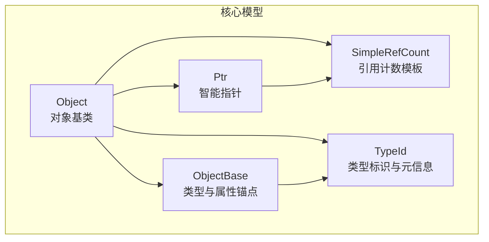
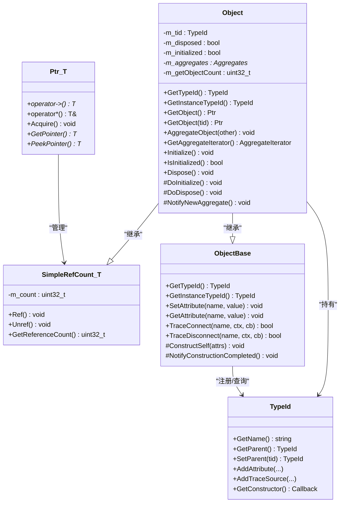
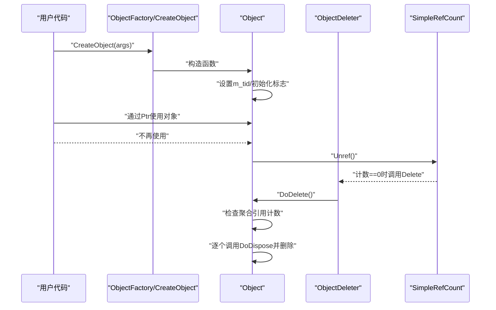
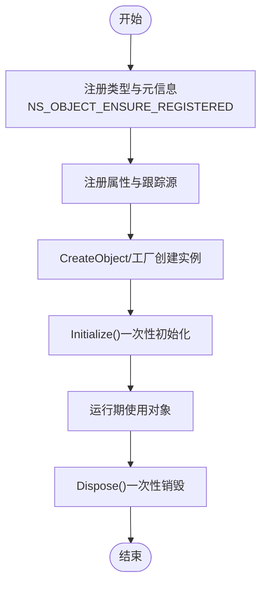
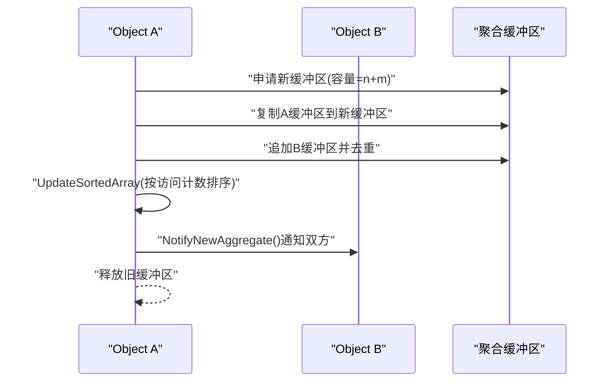
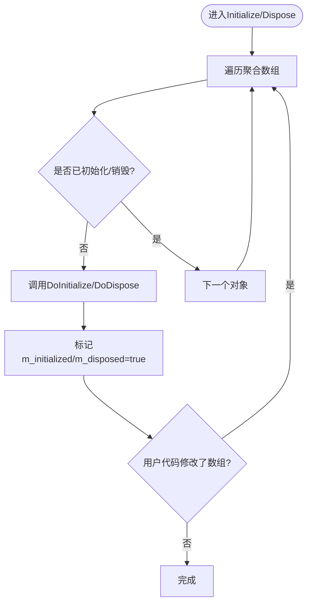
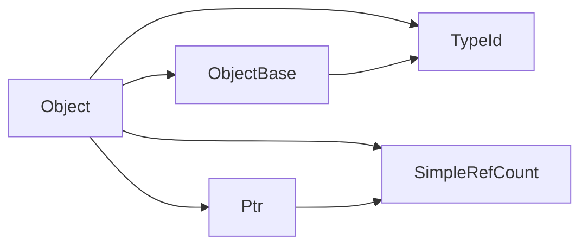

# Object基类

<cite>
**本文档引用的文件**
- [object.h](file://simulator/ns-3.39/src/core/model/object.h)
- [object.cc](file://simulator/ns-3.39/src/core/model/object.cc)
- [object-base.h](file://simulator/ns-3.39/src/core/model/object-base.h)
- [simple-ref-count.h](file://simulator/ns-3.39/src/core/model/simple-ref-count.h)
- [ptr.h](file://simulator/ns-3.39/src/core/model/ptr.h)
- [type-id.h](file://simulator/ns-3.39/src/core/model/type-id.h)
</cite>

## 目录
1. [简介](#简介)
2. [项目结构](#项目结构)
3. [核心组件](#核心组件)
4. [架构总览](#架构总览)
5. [详细组件分析](#详细组件分析)
6. [依赖分析](#依赖分析)
7. [性能考虑](#性能考虑)
8. [故障排查指南](#故障排查指南)
9. [结论](#结论)
10. [附录](#附录)

## 简介
本文件系统性梳理NS-3核心模块中的Object基类设计与实现，覆盖其在类型系统、属性系统、智能指针、引用计数、对象聚合、生命周期管理、初始化与销毁流程、状态管理以及内存策略等方面的设计原理与使用方法。目标是帮助读者快速掌握Object基类的完整能力边界，并在实际建模中正确应用。

## 项目结构
Object基类位于核心模型子系统中，与类型系统（TypeId）、属性系统（ObjectBase）、智能指针（Ptr）及简单引用计数（SimpleRefCount）紧密协作，形成统一的对象生命周期与资源管理框架。

图表来源
- [object.h:88-88](file://simulator/ns-3.39/src/core/model/object.h#L88-L88)
- [object-base.h:172-172](file://simulator/ns-3.39/src/core/model/object-base.h#L172-L172)
- [simple-ref-count.h:79-80](file://simulator/ns-3.39/src/core/model/simple-ref-count.h#L79-L80)
- [ptr.h:76-77](file://simulator/ns-3.39/src/core/model/ptr.h#L76-L77)
- [type-id.h:58-58](file://simulator/ns-3.39/src/core/model/type-id.h#L58-L58)

章节来源
- [object.h:1-100](file://simulator/ns-3.39/src/core/model/object.h#L1-L100)
- [object-base.h:1-120](file://simulator/ns-3.39/src/core/model/object-base.h#L1-L120)
- [simple-ref-count.h:1-80](file://simulator/ns-3.39/src/core/model/simple-ref-count.h#L1-L80)
- [ptr.h:1-120](file://simulator/ns-3.39/src/core/model/ptr.h#L1-L120)
- [type-id.h:1-120](file://simulator/ns-3.39/src/core/model/type-id.h#L1-L120)

## 核心组件
- Object：对象层次的根类，提供聚合、初始化、销毁、类型识别、引用计数委托等能力；通过继承SimpleRefCount实现引用计数，通过ObjectBase接入类型与属性系统。
- ObjectBase：类型与属性系统的锚点，负责TypeId绑定、属性读写、跟踪源连接等。
- SimpleRefCount：通用的CRTP引用计数模板，为任意类提供Ref/Unref能力，配合Ptr进行自动内存管理。
- Ptr：智能指针，封装Raw指针并调用Underlying对象的Ref/Unref完成RAII式资源管理。
- TypeId：类型唯一标识与元信息容器，承载父类关系、构造器、属性、跟踪源等注册信息。

章节来源
- [object.h:88-147](file://simulator/ns-3.39/src/core/model/object.h#L88-L147)
- [object-base.h:172-320](file://simulator/ns-3.39/src/core/model/object-base.h#L172-L320)
- [simple-ref-count.h:79-155](file://simulator/ns-3.39/src/core/model/simple-ref-count.h#L79-L155)
- [ptr.h:76-264](file://simulator/ns-3.39/src/core/model/ptr.h#L76-L264)
- [type-id.h:58-350](file://simulator/ns-3.39/src/core/model/type-id.h#L58-L350)

## 架构总览
Object基类采用“组合+继承”的架构：以SimpleRefCount作为可选父类提供引用计数，以ObjectBase作为类型与属性锚点，以Ptr作为资源管理载体，以TypeId作为类型元数据中心。聚合机制将多个Object实例共享同一块聚合缓冲区，形成“多对象一体”的生命周期管理单元。

图表来源
- [object.h:88-447](file://simulator/ns-3.39/src/core/model/object.h#L88-L447)
- [object-base.h:172-336](file://simulator/ns-3.39/src/core/model/object-base.h#L172-L336)
- [simple-ref-count.h:79-155](file://simulator/ns-3.39/src/core/model/simple-ref-count.h#L79-L155)
- [ptr.h:76-264](file://simulator/ns-3.39/src/core/model/ptr.h#L76-L264)
- [type-id.h:58-460](file://simulator/ns-3.39/src/core/model/type-id.h#L58-L460)

## 详细组件分析

### 引用计数与智能指针（SimpleRefCount + Ptr）
- 设计要点
  - SimpleRefCount通过CRTP模式为任意类注入Ref/Unref能力，默认引用计数初始值为1，避免悬挂指针。
  - Ptr在构造/拷贝时调用Underlying::Ref，在析构时调用Underlying::Unref，实现RAII式自动释放。
  - ObjectDeleter将删除动作委托给Object::DoDelete，确保聚合一致性与销毁顺序可控。
- 生命周期
  - 创建：通过CreateObject/CompleteConstruct生成对象并设置TypeId与属性。
  - 使用：通过Ptr安全访问，内部维护引用计数。
  - 销毁：当最后一个Ptr析构或被重置时，Unref导致计数归零，触发ObjectDeleter::Delete -> DoDelete。
- 复杂度
  - 访问与更新引用计数为O(1)。
  - 内存分配仅在对象创建与聚合缓冲区扩容时发生。

图表来源
- [object.cc:399-437](file://simulator/ns-3.39/src/core/model/object.cc#L399-L437)
- [simple-ref-count.h:126-133](file://simulator/ns-3.39/src/core/model/simple-ref-count.h#L126-L133)
- [ptr.h:723-729](file://simulator/ns-3.39/src/core/model/ptr.h#L723-L729)
- [object.h:60-71](file://simulator/ns-3.39/src/core/model/object.h#L60-L71)

章节来源
- [simple-ref-count.h:79-155](file://simulator/ns-3.39/src/core/model/simple-ref-count.h#L79-L155)
- [ptr.h:76-264](file://simulator/ns-3.39/src/core/model/ptr.h#L76-L264)
- [object.h:60-71](file://simulator/ns-3.39/src/core/model/object.h#L60-L71)
- [object.cc:399-437](file://simulator/ns-3.39/src/core/model/object.cc#L399-L437)

### 类型系统与属性系统（TypeId + ObjectBase）
- 设计要点
  - TypeId记录类名、父类、构造器、属性、跟踪源等元信息，支持按名称/哈希/索引查询。
  - ObjectBase提供属性读写与跟踪源连接接口，并在构造完成后通知。
  - Object通过GetInstanceTypeId返回当前最派生类型，结合TypeId实现动态类型判断与遍历。
- 复杂度
  - 元信息查询基于内部索引/哈希表，通常为O(1)/O(logN)。
  - 属性设置/获取涉及访问器与校验器，时间复杂度取决于具体实现。

图表来源
- [object-base.h:46-57](file://simulator/ns-3.39/src/core/model/object-base.h#L46-L57)
- [type-id.h:311-460](file://simulator/ns-3.39/src/core/model/type-id.h#L311-L460)
- [object.cc:186-242](file://simulator/ns-3.39/src/core/model/object.cc#L186-L242)

章节来源
- [object-base.h:160-336](file://simulator/ns-3.39/src/core/model/object-base.h#L160-L336)
- [type-id.h:58-460](file://simulator/ns-3.39/src/core/model/type-id.h#L58-L460)
- [object.cc:81-93](file://simulator/ns-3.39/src/core/model/object.cc#L81-L93)

### 对象聚合与迭代（AggregateIterator + 聚合缓冲区）
- 设计要点
  - 聚合通过合并两个对象的聚合缓冲区，共享同一块内存，缓冲区首元素即自身，后续为聚合对象。
  - 聚合数组按“最近使用次数”排序，提升GetObject查找效率。
  - 聚合迭代器提供Java风格的HasNext/Next接口，用于遍历聚合对象。
- 复杂度
  - 合并缓冲区为O(n+m)，其中n/m为两组聚合对象数量。
  - 查找与排序基于访问计数，平均查找更快，最坏仍为线性扫描。

图表来源
- [object.cc:258-325](file://simulator/ns-3.39/src/core/model/object.cc#L258-L325)
- [object.h:105-140](file://simulator/ns-3.39/src/core/model/object.h#L105-L140)

章节来源
- [object.h:105-140](file://simulator/ns-3.39/src/core/model/object.h#L105-L140)
- [object.cc:258-325](file://simulator/ns-3.39/src/core/model/object.cc#L258-L325)

### 初始化与销毁流程（Initialize/Dispose + DoInitialize/DoDispose）
- 设计要点
  - Initialize/Dispose保证每个聚合对象只执行一次对应操作，内部通过m_initialized/m_disposed标志控制。
  - 迭代过程中若用户代码修改聚合数组（如Get/Aggregate），会重启遍历以保证一致性。
  - DoDispose在DoDelete中被调用，确保聚合对象按序清理。
- 复杂度
  - 单次初始化/销毁为O(n)，n为聚合对象数量；由于可能重启遍历，最坏情况为O(n^2)，但实际场景中很少发生。

图表来源
- [object.cc:186-242](file://simulator/ns-3.39/src/core/model/object.cc#L186-L242)
- [object.cc:353-364](file://simulator/ns-3.39/src/core/model/object.cc#L353-L364)

章节来源
- [object.cc:186-242](file://simulator/ns-3.39/src/core/model/object.cc#L186-L242)
- [object.cc:353-364](file://simulator/ns-3.39/src/core/model/object.cc#L353-L364)

### 对象生命周期管理与内存策略
- 设计要点
  - 引用计数为0时才真正删除对象，避免悬垂指针。
  - 聚合对象共享缓冲区，删除时按序调用DoDispose并逐个delete，确保资源有序释放。
  - Check/CheckLoose用于在事件回调等场景下检测对象存活状态。
- 最佳实践
  - 始终通过Ptr持有对象，避免手动delete。
  - 需要打破循环引用时，显式调用Dispose以触发DoDispose链。
  - 聚合对象时注意重复聚合的约束，系统会在冲突时抛出致命错误。

章节来源
- [object.cc:366-396](file://simulator/ns-3.39/src/core/model/object.cc#L366-L396)
- [object.cc:399-437](file://simulator/ns-3.39/src/core/model/object.cc#L399-L437)

### API参考（Object基类）
- 类型与实例
  - GetTypeId()/GetInstanceTypeId()：获取静态/动态类型标识。
- 聚合与遍历
  - AggregateObject(Ptr<Object>)：聚合另一个对象。
  - GetAggregateIterator()：获取聚合迭代器。
  - GetObject<T>() / GetObject(TypeId)：按类型检索聚合对象。
- 生命周期
  - Initialize()：一次性初始化。
  - IsInitialized()：查询初始化状态。
  - Dispose()：一次性销毁，触发DoDispose链。
- 回调与通知
  - NotifyNewAggregate()：聚合事件通知钩子，可覆写。
- 内部工具
  - DoGetObject(TypeId)：内部查找聚合对象。
  - DoDelete()：引用计数归零时的删除入口。
  - Check()/CheckLoose()：对象存活状态检查。

章节来源
- [object.h:95-276](file://simulator/ns-3.39/src/core/model/object.h#L95-L276)
- [object.cc:81-93](file://simulator/ns-3.39/src/core/model/object.cc#L81-L93)

### 使用示例与最佳实践
- 示例路径
  - 创建对象：[object.h:577-582](file://simulator/ns-3.39/src/core/model/object.h#L577-L582)
  - 获取对象：[object.h:469-533](file://simulator/ns-3.39/src/core/model/object.h#L469-L533)
  - 聚合对象：[object.cc:258-325](file://simulator/ns-3.39/src/core/model/object.cc#L258-L325)
  - 初始化/销毁：[object.cc:186-242](file://simulator/ns-3.39/src/core/model/object.cc#L186-L242)
- 最佳实践
  - 所有对象均通过CreateObject/Ptr创建与管理。
  - 在DoDispose中释放非内存资源（如文件句柄、网络连接），避免在析构中做任何可能失败的操作。
  - 若存在循环引用，应在合适的时机调用Dispose以打破环路。
  - 聚合对象时遵循“一对一”约束，避免重复聚合同类型对象。

章节来源
- [object.h:577-582](file://simulator/ns-3.39/src/core/model/object.h#L577-L582)
- [object.h:469-533](file://simulator/ns-3.39/src/core/model/object.h#L469-L533)
- [object.cc:258-325](file://simulator/ns-3.39/src/core/model/object.cc#L258-L325)
- [object.cc:186-242](file://simulator/ns-3.39/src/core/model/object.cc#L186-L242)

## 依赖分析
- 组件耦合
  - Object强依赖ObjectBase（类型/属性）、SimpleRefCount（引用计数）、Ptr（RAII）、TypeId（类型元信息）。
  - Object内部通过聚合缓冲区共享所有权，降低多次分配成本。
- 外部依赖
  - 日志系统（NS_LOG）用于调试与诊断。
  - 断言系统（NS_ASSERT/NS_FATAL_ERROR）保障不变量与错误处理。
- 循环依赖
  - 通过前向声明与模板分离减少编译期循环；运行期通过指针与回调避免逻辑循环。

图表来源
- [object.h:23-27](file://simulator/ns-3.39/src/core/model/object.h#L23-L27)
- [ptr.h:76-77](file://simulator/ns-3.39/src/core/model/ptr.h#L76-L77)
- [simple-ref-count.h:79-80](file://simulator/ns-3.39/src/core/model/simple-ref-count.h#L79-L80)
- [object-base.h:172-172](file://simulator/ns-3.39/src/core/model/object-base.h#L172-L172)
- [type-id.h:58-58](file://simulator/ns-3.39/src/core/model/type-id.h#L58-L58)

章节来源
- [object.h:23-27](file://simulator/ns-3.39/src/core/model/object.h#L23-L27)
- [ptr.h:76-77](file://simulator/ns-3.39/src/core/model/ptr.h#L76-L77)
- [simple-ref-count.h:79-80](file://simulator/ns-3.39/src/core/model/simple-ref-count.h#L79-L80)
- [object-base.h:172-172](file://simulator/ns-3.39/src/core/model/object-base.h#L172-L172)
- [type-id.h:58-58](file://simulator/ns-3.39/src/core/model/type-id.h#L58-L58)

## 性能考虑
- 引用计数
  - Ref/Unref为O(1)，GetReferenceCount用于语言绑定与调试。
- 聚合查找
  - 平均O(n)线性扫描，但通过“最近使用计数”排序显著提升热点命中率。
- 初始化/销毁
  - 每个聚合对象仅执行一次，内部重启遍历的开销在实际中极少出现。
- 内存布局
  - 聚合缓冲区采用C风格变长数组技巧，避免二次分配，降低碎片化风险。

## 故障排查指南
- 常见问题
  - “重复聚合同类型对象”：系统会抛出致命错误，需检查聚合逻辑。
  - “引用计数异常”：确认所有路径均通过Ptr管理对象，避免裸指针delete。
  - “初始化/销毁未生效”：确保未在DoInitialize/DoDispose中再次调用Initialize/Dispose。
- 排查手段
  - 使用NS_LOG输出关键路径日志。
  - 使用IsInitialized/CheckLoose辅助定位状态异常。
  - 使用GetReferenceCount验证引用计数变化。

章节来源
- [object.cc:284-291](file://simulator/ns-3.39/src/core/model/object.cc#L284-L291)
- [object.cc:366-396](file://simulator/ns-3.39/src/core/model/object.cc#L366-L396)

## 结论
Object基类通过“类型+属性+引用计数+智能指针+聚合”的组合，构建了NS-3对象系统的核心基础设施。它在保证内存安全的同时，提供了灵活的生命周期管理与高效的运行时特性。遵循本文的最佳实践与API规范，可在复杂仿真场景中稳定地组织对象关系与资源管理。

## 附录
- 相关宏与工具
  - NS_OBJECT_ENSURE_REGISTERED：注册类至TypeId系统。
  - NS_OBJECT_TEMPLATE_CLASS_DEFINE/NS_OBJECT_TEMPLATE_CLASS_TWO_DEFINE：显式实例化模板类并注册。
- 参考实现
  - 完整的聚合缓冲区与排序逻辑参见聚合实现与更新函数。

章节来源
- [object-base.h:46-132](file://simulator/ns-3.39/src/core/model/object-base.h#L46-L132)
- [object.cc:244-256](file://simulator/ns-3.39/src/core/model/object.cc#L244-L256)