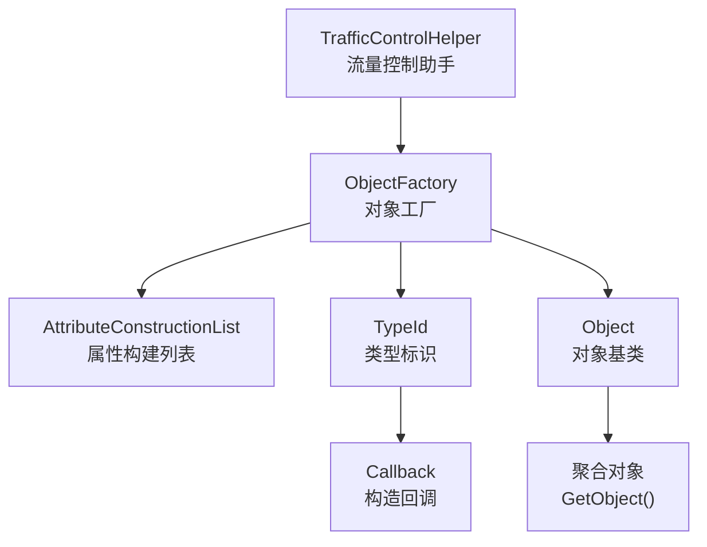
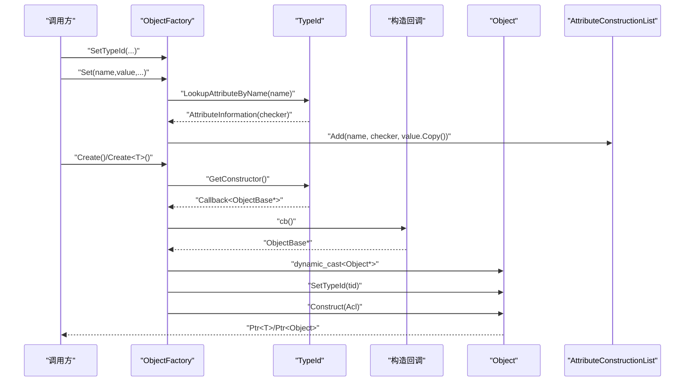
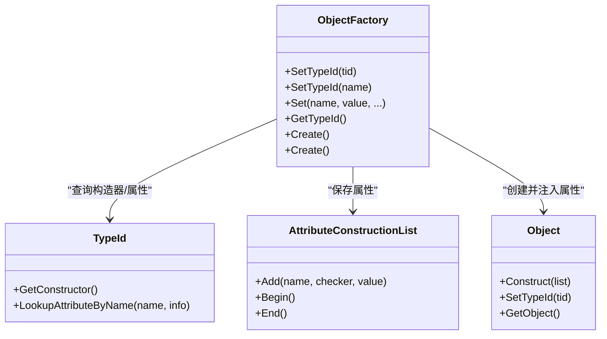

# 对象工厂模式

<cite>
**本文引用的文件**
- [object-factory.h](file://simulator/ns-3.39/src/core/model/object-factory.h)
- [object-factory.cc](file://simulator/ns-3.39/src/core/model/object-factory.cc)
- [object.h](file://simulator/ns-3.39/src/core/model/object.h)
- [type-id.h](file://simulator/ns-3.39/src/core/model/type-id.h)
- [attribute-construction-list.h](file://simulator/ns-3.39/src/core/model/attribute-construction-list.h)
- [object-test-suite.cc](file://simulator/ns-3.39/src/core/test/object-test-suite.cc)
- [attributes.rst](file://simulator/ns-3.39/doc/manual/source/attributes.rst)
- [traffic-control-helper.h](file://simulator/ns-3.39/src/traffic-control/helper/traffic-control-helper.h)
- [traffic-control-helper.cc](file://simulator/ns-3.39/src/traffic-control/helper/traffic-control-helper.cc)
</cite>

## 目录
1. [引言](#引言)
2. [项目结构](#项目结构)
3. [核心组件](#核心组件)
4. [架构总览](#架构总览)
5. [详细组件分析](#详细组件分析)
6. [依赖关系分析](#依赖关系分析)
7. [性能考量](#性能考量)
8. [故障排查指南](#故障排查指南)
9. [结论](#结论)
10. [附录：API 参考与示例路径](#附录api-参考与示例路径)

## 引言
本文件系统化阐述 NS-3 中的对象工厂模式（ObjectFactory），包括设计原理、工厂模式实现、对象创建流程、参数传递与配置管理、在 NS-3 中的应用场景与优势，并给出完整的 API 文档与实际使用示例路径。同时解释工厂模式与类型系统（TypeId）的紧密关系，帮助读者从高层到代码级全面理解。

## 项目结构
NS-3 的对象工厂位于核心模块中，围绕以下关键头文件组织：
- object-factory.h / object-factory.cc：对象工厂类的声明与实现
- object.h：对象基类与构造、属性设置、动态获取等能力
- type-id.h：类型标识与元信息（构造器、属性、检查器）
- attribute-construction-list.h：构建时属性列表的数据结构
- traffic-control-helper.*：展示工厂在高级模块中的典型用法
- attributes.rst：官方手册对工厂与属性配置的说明
- object-test-suite.cc：针对工厂行为的单元测试

图表来源
- [object-factory.h:47-172](file://simulator/ns-3.39/src/core/model/object-factory.h#L47-L172)
- [object-factory.cc:92-104](file://simulator/ns-3.39/src/core/model/object-factory.cc#L92-L104)
- [object.h:399-447](file://simulator/ns-3.39/src/core/model/object.h#L399-L447)
- [type-id.h:274-279](file://simulator/ns-3.39/src/core/model/type-id.h#L274-L279)
- [attribute-construction-list.h:40-86](file://simulator/ns-3.39/src/core/model/attribute-construction-list.h#L40-L86)
- [traffic-control-helper.h:351-434](file://simulator/ns-3.39/src/traffic-control/helper/traffic-control-helper.h#L351-L434)

章节来源
- [object-factory.h:19-238](file://simulator/ns-3.39/src/core/model/object-factory.h#L19-L238)
- [object-factory.cc:19-202](file://simulator/ns-3.39/src/core/model/object-factory.cc#L19-L202)
- [object.h:88-589](file://simulator/ns-3.39/src/core/model/object.h#L88-L589)
- [type-id.h:58-670](file://simulator/ns-3.39/src/core/model/type-id.h#L58-L670)
- [attribute-construction-list.h:19-91](file://simulator/ns-3.39/src/core/model/attribute-construction-list.h#L19-L91)

## 核心组件
- ObjectFactory：负责根据类型标识创建对象，并在构造过程中应用一组属性值；支持链式 Set(...) 配置与流式序列化/反序列化。
- Object：所有可被工厂创建的派生对象的根类，提供构造、初始化、析构、聚合、动态类型获取等能力。
- TypeId：类型元数据容器，记录构造器回调、属性信息、检查器等，是工厂创建对象与属性校验的关键。
- AttributeConstructionList：保存“属性名-检查器-值”的三元组，用于在对象构造阶段一次性注入。
- TrafficControlHelper：展示如何将 ObjectFactory 作为参数传入高层模块，以统一配置子对象类型与属性。

章节来源
- [object-factory.h:47-172](file://simulator/ns-3.39/src/core/model/object-factory.h#L47-L172)
- [object.h:88-447](file://simulator/ns-3.39/src/core/model/object.h#L88-L447)
- [type-id.h:58-322](file://simulator/ns-3.39/src/core/model/type-id.h#L58-L322)
- [attribute-construction-list.h:40-86](file://simulator/ns-3.39/src/core/model/attribute-construction-list.h#L40-L86)
- [traffic-control-helper.h:351-434](file://simulator/ns-3.39/src/traffic-control/helper/traffic-control-helper.h#L351-L434)

## 架构总览
下图展示了工厂模式在 NS-3 中的整体交互：调用方通过 ObjectFactory 指定 TypeId 并设置属性，工厂通过 TypeId 获取构造回调，创建对象后调用 Object::Construct 注入属性，最终返回强指针。

图表来源
- [object-factory.cc:92-104](file://simulator/ns-3.39/src/core/model/object-factory.cc#L92-L104)
- [object.h:399-447](file://simulator/ns-3.39/src/core/model/object.h#L399-L447)
- [type-id.h:274-279](file://simulator/ns-3.39/src/core/model/type-id.h#L274-L279)
- [attribute-construction-list.h:67](file://simulator/ns-3.39/src/core/model/attribute-construction-list.h#L67)

## 详细组件分析

### ObjectFactory 类与工厂模式实现
- 设计要点
  - 工厂持有 TypeId 与 AttributeConstructionList，分别决定“创建什么类型”和“如何配置”。
  - 支持模板递归 Set(...) 实现链式配置，最终由 DoSet(...) 完成属性校验与入库。
  - Create() 调用 TypeId::GetConstructor() 获取构造回调，创建对象后调用 Object::Construct 批量注入属性。
  - 提供友元流操作符，支持字符串形式的配置输入输出（如 “TypeName[attr=value|...]”）。

- 关键接口
  - 构造与配置
    - SetTypeId(TypeId|std::string)
    - Set(const std::string&, const AttributeValue&, ...)
    - GetTypeId()
    - IsTypeIdSet()
  - 创建
    - Create() 返回 Ptr<Object>
    - Create<T>() 返回 Ptr<T>（内部通过 Object::GetObject<T>() 进行动态类型转换）
  - 流式配置
    - operator<< / operator>> 用于序列化/反序列化工厂配置

- 复杂度与性能
  - 属性设置：每次 DoSet() 均进行属性名查询与值有效性校验，复杂度 O(1) 次查表与拷贝。
  - 对象创建：一次回调调用 + 动态类型转换 + 一次批量属性注入，整体 O(1)。

- 错误处理
  - 无效属性名或值校验失败会触发致命错误（NS_FATAL_ERROR），确保配置一致性。
  - 流解析失败时设置输入流状态并中止。

章节来源
- [object-factory.h:47-172](file://simulator/ns-3.39/src/core/model/object-factory.h#L47-L172)
- [object-factory.cc:62-83](file://simulator/ns-3.39/src/core/model/object-factory.cc#L62-L83)
- [object-factory.cc:92-104](file://simulator/ns-3.39/src/core/model/object-factory.cc#L92-L104)
- [object-factory.cc:106-123](file://simulator/ns-3.39/src/core/model/object-factory.cc#L106-L123)
- [object-factory.cc:125-197](file://simulator/ns-3.39/src/core/model/object-factory.cc#L125-L197)

### 对象实例化机制与参数传递
- 实例化流程
  - 通过 TypeId::GetConstructor() 获取构造回调，调用生成 ObjectBase 派生对象。
  - 强制转换为 Object 并设置实例类型标识，随后调用 Object::Construct 将 AttributeConstructionList 中的属性一次性注入。
  - 返回强指针，配合智能指针引用计数管理生命周期。

- 参数传递与配置管理
  - Set(...) 接受任意数量的 name/value 对，内部通过 checker 校验并复制值，存入 AttributeConstructionList。
  - Create() 仅在对象构造阶段应用这些属性，不改变工厂内部状态，便于复用工厂创建多个实例。

- 与类型系统的耦合
  - TypeId::LookupAttributeByName 提供属性存在性与类型检查，确保属性名与值匹配。
  - TypeId::GetConstructor 提供无参构造入口，屏蔽具体类名。

章节来源
- [object-factory.cc:92-104](file://simulator/ns-3.39/src/core/model/object-factory.cc#L92-L104)
- [object.h:399-447](file://simulator/ns-3.39/src/core/model/object.h#L399-L447)
- [type-id.h:476](file://simulator/ns-3.39/src/core/model/type-id.h#L476)
- [type-id.h:274-279](file://simulator/ns-3.39/src/core/model/type-id.h#L274-L279)

### 工厂模式在 NS-3 中的应用场景与优势
- 应用场景
  - 高层模块（如 TrafficControlHelper）通过 ObjectFactory 统一创建队列调度器、丢弃策略等子对象，避免上层硬编码具体类名。
  - 用户脚本与命令行通过 CreateObjectWithAttributes 或 Helper API 间接使用工厂，实现“按需配置、延迟实例化”。

- 优势
  - 解耦：上层无需关心具体类名，只需提供类型名与属性。
  - 可扩展：新增子类只需注册 TypeId，即可被工厂识别。
  - 可配置：支持在创建前集中设置多个属性，保证对象初始状态一致。
  - 可序列化：支持将工厂配置以字符串形式持久化/传输。

章节来源
- [traffic-control-helper.h:351-434](file://simulator/ns-3.39/src/traffic-control/helper/traffic-control-helper.h#L351-L434)
- [attributes.rst:564-602](file://simulator/ns-3.39/doc/manual/source/attributes.rst#L564-L602)

### API 完整文档（方法与语义）
- ObjectFactory
  - 构造函数
    - ObjectFactory()
    - ObjectFactory(const std::string& typeId, Args&&... args)
  - 类型与配置
    - void SetTypeId(TypeId tid)
    - void SetTypeId(std::string tid)
    - bool IsTypeIdSet() const
    - TypeId GetTypeId() const
  - 属性设置
    - void Set(const std::string& name, const AttributeValue& value, Args&&... args)
    - void Set()（递归终止）
  - 创建
    - Ptr<Object> Create() const
    - template <typename T> Ptr<T> Create() const
  - 流式接口
    - friend std::ostream& operator<<(std::ostream&, const ObjectFactory&)
    - friend std::istream& operator>>(std::istream&, ObjectFactory&)

- 辅助函数
  - template <typename T, typename... Args> Ptr<T> CreateObjectWithAttributes(Args... args)

章节来源
- [object-factory.h:47-172](file://simulator/ns-3.39/src/core/model/object-factory.h#L47-L172)
- [object-factory.h:189-190](file://simulator/ns-3.39/src/core/model/object-factory.h#L189-L190)

### 使用示例与最佳实践（示例路径）
- 通过 CreateObjectWithAttributes 设置属性并创建对象
  - 示例路径：[attributes.rst:570-577](file://simulator/ns-3.39/doc/manual/source/attributes.rst#L570-L577)
- 在 Helper API 中使用工厂配置
  - 示例路径：[attributes.rst:581-588](file://simulator/ns-3.39/doc/manual/source/attributes.rst#L581-L588)
- 高层模块中传入 ObjectFactory
  - 示例路径：[traffic-control-helper.h:424](file://simulator/ns-3.39/src/traffic-control/helper/traffic-control-helper.h#L424)
  - 示例路径：[traffic-control-helper.h:434](file://simulator/ns-3.39/src/traffic-control/helper/traffic-control-helper.h#L434)
- 单元测试验证工厂行为
  - 示例路径：[object-test-suite.cc:492-550](file://simulator/ns-3.39/src/core/test/object-test-suite.cc#L492-L550)

章节来源
- [attributes.rst:564-602](file://simulator/ns-3.39/doc/manual/source/attributes.rst#L564-L602)
- [traffic-control-helper.h:424-434](file://simulator/ns-3.39/src/traffic-control/helper/traffic-control-helper.h#L424-L434)
- [object-test-suite.cc:492-550](file://simulator/ns-3.39/src/core/test/object-test-suite.cc#L492-L550)

## 依赖关系分析
- 组件耦合
  - ObjectFactory 依赖 TypeId（查询属性与构造器）、AttributeConstructionList（存储待注入属性）。
  - ObjectFactory 通过 Object::Construct 注入属性，依赖 Object 的初始化流程。
  - TrafficControlHelper 等高层模块依赖 ObjectFactory 以统一创建子对象。

- 外部依赖
  - 回调机制（Callback<ObjectBase*>）用于无参构造。
  - 属性系统（AttributeValue、AttributeChecker）用于属性值校验与序列化。

图表来源
- [object-factory.h:47-172](file://simulator/ns-3.39/src/core/model/object-factory.h#L47-L172)
- [object-factory.cc:92-104](file://simulator/ns-3.39/src/core/model/object-factory.cc#L92-L104)
- [object.h:399-447](file://simulator/ns-3.39/src/core/model/object.h#L399-L447)
- [type-id.h:274-279](file://simulator/ns-3.39/src/core/model/type-id.h#L274-L279)
- [attribute-construction-list.h:67](file://simulator/ns-3.39/src/core/model/attribute-construction-list.h#L67)

章节来源
- [object-factory.h:47-172](file://simulator/ns-3.39/src/core/model/object-factory.h#L47-L172)
- [object.h:399-447](file://simulator/ns-3.39/src/core/model/object.h#L399-L447)
- [type-id.h:274-279](file://simulator/ns-3.39/src/core/model/type-id.h#L274-L279)
- [attribute-construction-list.h:40-86](file://simulator/ns-3.39/src/core/model/attribute-construction-list.h#L40-L86)

## 性能考量
- 属性设置阶段
  - 每次 Set(...) 会进行一次属性名查表与值有效性校验，建议在创建大量对象前预先构建好工厂实例，减少重复校验开销。
- 对象创建阶段
  - GetConstructor() 与一次回调调用成本极低；批量属性注入在 Object::Construct 中完成，整体为常数级。
- 内存与生命周期
  - 工厂不持有对象所有权，返回的 Ptr 通过引用计数管理生命周期，避免悬挂指针与内存泄漏风险。

## 故障排查指南
- 常见问题
  - 设置了不存在的属性名：触发致命错误，检查属性名是否正确且属于该类型。
  - 属性值类型不匹配或越界：校验失败导致致命错误，确认 AttributeValue 类型与范围。
  - 未设置 TypeId：Create() 将无法构造对象，确保先调用 SetTypeId(...)。
  - 流解析失败：输入格式不符合 “TypeName[attr=value|...]” 规范，检查括号、等号与分隔符。

- 定位手段
  - 利用日志组件（NS_LOG）定位工厂与对象构造过程。
  - 使用 operator<< 输出当前工厂配置，核对属性名与值。
  - 使用单元测试用例验证工厂行为（如 ObjectFactoryTestCase）。

章节来源
- [object-factory.cc:70-83](file://simulator/ns-3.39/src/core/model/object-factory.cc#L70-L83)
- [object-factory.cc:125-197](file://simulator/ns-3.39/src/core/model/object-factory.cc#L125-L197)
- [object-test-suite.cc:492-550](file://simulator/ns-3.39/src/core/test/object-test-suite.cc#L492-L550)

## 结论
NS-3 的对象工厂模式通过 TypeId 元信息与属性系统，实现了“类型解耦、配置统一、创建透明”的对象创建框架。它不仅简化了高层模块的子对象创建逻辑，也提升了用户脚本与工具的可配置性与可维护性。结合流式配置与单元测试，工厂模式在 NS-3 中既具备工程可用性，又保持了良好的扩展性与健壮性。

## 附录：API 参考与示例路径
- API 参考
  - ObjectFactory
    - 构造与配置：[object-factory.h:56-85](file://simulator/ns-3.39/src/core/model/object-factory.h#L56-L85)
    - 属性设置：[object-factory.h:98-107](file://simulator/ns-3.39/src/core/model/object-factory.h#L98-L107)
    - 创建：[object-factory.h:115-133](file://simulator/ns-3.39/src/core/model/object-factory.h#L115-L133)
    - 流式接口：[object-factory.h:152-163](file://simulator/ns-3.39/src/core/model/object-factory.h#L152-L163)
  - 辅助函数
    - CreateObjectWithAttributes：[object-factory.h:189-190](file://simulator/ns-3.39/src/core/model/object-factory.h#L189-L190)

- 示例路径
  - 属性配置与工厂使用：[attributes.rst:570-577](file://simulator/ns-3.39/doc/manual/source/attributes.rst#L570-L577)
  - Helper API 中的工厂：[attributes.rst:581-588](file://simulator/ns-3.39/doc/manual/source/attributes.rst#L581-L588)
  - 高层模块传入工厂：[traffic-control-helper.h:424](file://simulator/ns-3.39/src/traffic-control/helper/traffic-control-helper.h#L424)
  - 工厂行为测试：[object-test-suite.cc:492-550](file://simulator/ns-3.39/src/core/test/object-test-suite.cc#L492-L550)