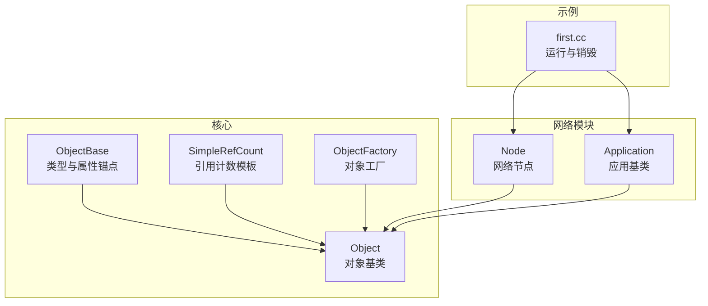
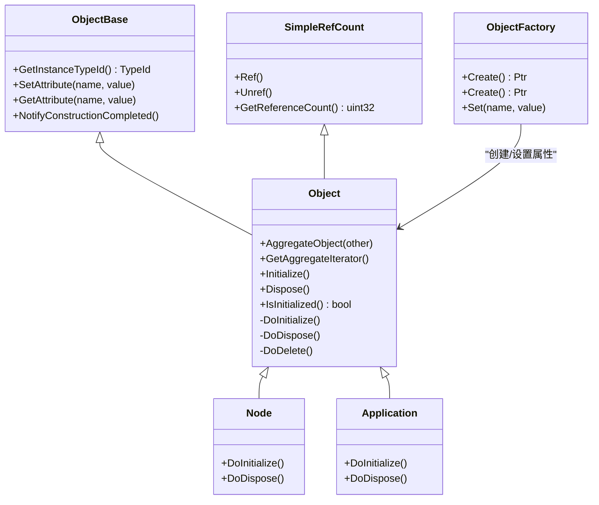
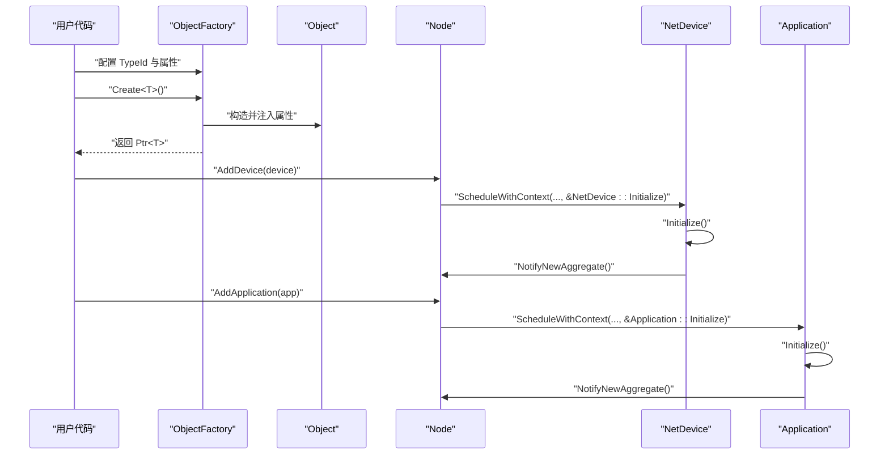
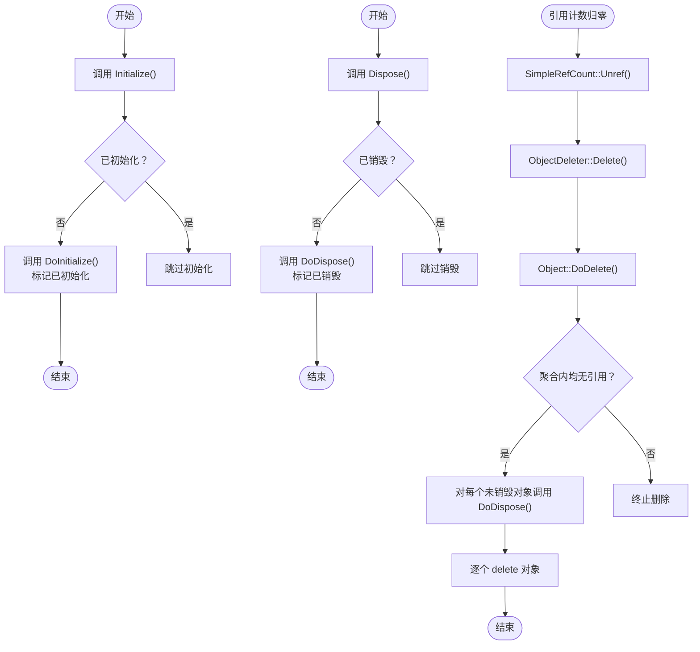
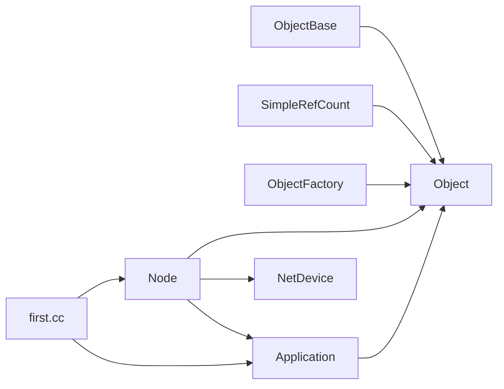

# 对象生命周期管理

<cite>
**本文档引用的文件**
- [object.h](file://simulator/ns-3.39/src/core/model/object.h)
- [object.cc](file://simulator/ns-3.39/src/core/model/object.cc)
- [simple-ref-count.h](file://simulator/ns-3.39/src/core/model/simple-ref-count.h)
- [object-base.h](file://simulator/ns-3.39/src/core/model/object-base.h)
- [object-factory.h](file://simulator/ns-3.39/src/core/model/object-factory.h)
- [node.h](file://simulator/ns-3.39/src/network/model/node.h)
- [node.cc](file://simulator/ns-3.39/src/network/model/node.cc)
- [application.h](file://simulator/ns-3.39/src/network/model/application.h)
- [first.cc](file://simulator/ns-3.39/examples/tutorial/first.cc)
</cite>

## 目录
1. [引言](#引言)
2. [项目结构](#项目结构)
3. [核心组件](#核心组件)
4. [架构总览](#架构总览)
5. [详细组件分析](#详细组件分析)
6. [依赖关系分析](#依赖关系分析)
7. [性能考量](#性能考量)
8. [故障排查指南](#故障排查指南)
9. [结论](#结论)
10. [附录](#附录)

## 引言
本文件系统性阐述 NS-3 中对象生命周期管理机制，覆盖对象创建、初始化、使用与销毁的完整流程；详解 Initialize() 与 Dispose() 的工作机制、调用时机与执行顺序；说明对象状态管理、引用计数与内存回收策略；并提供生命周期各阶段的状态转换图与时序图，最后给出最佳实践与常见陷阱的规避建议。

## 项目结构
NS-3 的对象生命周期管理由核心模块提供统一基类与基础设施，并在具体业务模块（如网络模块）中落地应用。关键位置如下：
- 核心对象基类与生命周期：src/core/model/object.{h,cc}
- 引用计数模板：src/core/model/simple-ref-count.h
- 类型与属性系统锚点：src/core/model/object-base.h
- 对象工厂：src/core/model/object-factory.h
- 网络节点与应用示例：src/network/model/node.{h,cc}、src/network/model/application.h
- 示例脚本：examples/tutorial/first.cc 展示了运行与销毁流程

**图表来源**
- [object.h:88-145](file://simulator/ns-3.39/src/core/model/object.h#L88-L145)
- [simple-ref-count.h:79-155](file://simulator/ns-3.39/src/core/model/simple-ref-count.h#L79-L155)
- [object-base.h:172-341](file://simulator/ns-3.39/src/core/model/object-base.h#L172-L341)
- [object-factory.h:47-172](file://simulator/ns-3.39/src/core/model/object-factory.h#L47-L172)
- [node.h:58-331](file://simulator/ns-3.39/src/network/model/node.h#L58-L331)
- [application.h:60-153](file://simulator/ns-3.39/src/network/model/application.h#L60-L153)
- [first.cc:34-79](file://simulator/ns-3.39/examples/tutorial/first.cc#L34-L79)

**章节来源**
- [object.h:88-145](file://simulator/ns-3.39/src/core/model/object.h#L88-L145)
- [simple-ref-count.h:79-155](file://simulator/ns-3.39/src/core/model/simple-ref-count.h#L79-L155)
- [object-base.h:172-341](file://simulator/ns-3.39/src/core/model/object-base.h#L172-L341)
- [object-factory.h:47-172](file://simulator/ns-3.39/src/core/model/object-factory.h#L47-L172)
- [node.h:58-331](file://simulator/ns-3.39/src/network/model/node.h#L58-L331)
- [application.h:60-153](file://simulator/ns-3.39/src/network/model/application.h#L60-L153)
- [first.cc:34-79](file://simulator/ns-3.39/examples/tutorial/first.cc#L34-L79)

## 核心组件
- Object 基类
  - 提供聚合（AggregateObject）、迭代聚合（GetAggregateIterator）、初始化（Initialize）、销毁（Dispose）、状态检查（IsInitialized）等能力
  - 内部维护 m_disposed 与 m_initialized 状态位，以及聚合对象数组 m_aggregates
- SimpleRefCount 引用计数模板
  - 通过 Ref()/Unref() 维护对象引用计数；当计数归零时触发删除器（默认删除器委托给 Object::DoDelete）
- ObjectBase 类型与属性锚点
  - 为对象提供 TypeId 关联、属性读写、构造完成通知等能力
- ObjectFactory 对象工厂
  - 负责按 TypeId 创建对象并设置初始属性，内部通过 Object::Construct 完成属性初始化
- Node 与 Application
  - Node 在 DoInitialize/DoDispose 中对设备与应用进行生命周期管理
  - Application 同样继承 Object 并可被 Node 管理

**章节来源**
- [object.h:88-447](file://simulator/ns-3.39/src/core/model/object.h#L88-L447)
- [object.cc:185-242](file://simulator/ns-3.39/src/core/model/object.cc#L185-L242)
- [simple-ref-count.h:79-155](file://simulator/ns-3.39/src/core/model/simple-ref-count.h#L79-L155)
- [object-base.h:172-341](file://simulator/ns-3.39/src/core/model/object-base.h#L172-L341)
- [object-factory.h:47-172](file://simulator/ns-3.39/src/core/model/object-factory.h#L47-L172)
- [node.cc:204-247](file://simulator/ns-3.39/src/network/model/node.cc#L204-L247)
- [application.h:60-153](file://simulator/ns-3.39/src/network/model/application.h#L60-L153)

## 架构总览
NS-3 的对象生命周期管理采用“基类 + 引用计数 + 工厂 + 聚合”的组合模式：
- 基类层：Object 提供统一生命周期接口与聚合容器
- 计数层：SimpleRefCount 提供引用计数与自动删除
- 工厂层：ObjectFactory 负责对象创建与属性注入
- 应用层：Node/Application 等业务对象在 DoInitialize/DoDispose 中协调其子对象

**图表来源**
- [object.h:88-447](file://simulator/ns-3.39/src/core/model/object.h#L88-L447)
- [simple-ref-count.h:79-155](file://simulator/ns-3.39/src/core/model/simple-ref-count.h#L79-L155)
- [object-base.h:172-341](file://simulator/ns-3.39/src/core/model/object-base.h#L172-L341)
- [object-factory.h:47-172](file://simulator/ns-3.39/src/core/model/object-factory.h#L47-L172)
- [node.h:58-331](file://simulator/ns-3.39/src/network/model/node.h#L58-L331)
- [application.h:60-153](file://simulator/ns-3.39/src/network/model/application.h#L60-L153)

## 详细组件分析

### 对象创建与初始化流程
- 创建路径
  - 使用 ObjectFactory 指定 TypeId 与属性，调用 Create() 返回 Ptr<Object>
  - ObjectFactory 内部通过 Object::Construct 注入属性，随后返回目标类型的 Ptr<T>
- 初始化路径
  - Node::AddDevice/Node::AddApplication 在调度上下文为 Node 的情况下，分别调用设备与应用的 Initialize()
  - Node::DoInitialize 遍历设备与应用，逐个调用其 Initialize()

**图表来源**
- [object-factory.h:115-132](file://simulator/ns-3.39/src/core/model/object-factory.h#L115-L132)
- [object.cc:143-148](file://simulator/ns-3.39/src/core/model/object.cc#L143-L148)
- [node.cc:137-176](file://simulator/ns-3.39/src/network/model/node.cc#L137-L176)
- [application.h:60-153](file://simulator/ns-3.39/src/network/model/application.h#L60-L153)

**章节来源**
- [object-factory.h:115-132](file://simulator/ns-3.39/src/core/model/object-factory.h#L115-L132)
- [object.cc:143-148](file://simulator/ns-3.39/src/core/model/object.cc#L143-L148)
- [node.cc:137-176](file://simulator/ns-3.39/src/network/model/node.cc#L137-L176)
- [application.h:60-153](file://simulator/ns-3.39/src/network/model/application.h#L60-L153)

### Initialize() 与 Dispose() 机制与顺序
- Initialize() 行为
  - 仅在对象首次被调用时执行 DoInitialize()，后续调用不会重复执行
  - 通过聚合遍历，确保每个聚合对象只初始化一次
  - 支持在 DoInitialize 中安全调用 GetObject()/AggregateObject()
- Dispose() 行为
  - 仅在对象首次被调用时执行 DoDispose()，后续调用不会重复执行
  - 通过聚合遍历，确保每个聚合对象只销毁一次
  - 支持在 DoDispose 中安全调用 GetObject()/AggregateObject()
- 销毁触发
  - 当引用计数降至 0 时，SimpleRefCount::Unref 触发删除器（ObjectDeleter），进而调用 Object::DoDelete
  - DoDelete 会检查聚合内所有对象是否均无引用，若满足则依次调用 DoDispose 并删除

**图表来源**
- [object.h:184-242](file://simulator/ns-3.39/src/core/model/object.h#L184-L242)
- [object.cc:185-242](file://simulator/ns-3.39/src/core/model/object.cc#L185-L242)
- [object.cc:398-437](file://simulator/ns-3.39/src/core/model/object.cc#L398-L437)
- [simple-ref-count.h:126-133](file://simulator/ns-3.39/src/core/model/simple-ref-count.h#L126-L133)

**章节来源**
- [object.h:184-242](file://simulator/ns-3.39/src/core/model/object.h#L184-L242)
- [object.cc:185-242](file://simulator/ns-3.39/src/core/model/object.cc#L185-L242)
- [object.cc:398-437](file://simulator/ns-3.39/src/core/model/object.cc#L398-L437)
- [simple-ref-count.h:126-133](file://simulator/ns-3.39/src/core/model/simple-ref-count.h#L126-L133)

### 对象状态管理、引用计数与内存回收
- 状态位
  - m_initialized：表示对象是否已完成初始化
  - m_disposed：表示对象是否已完成销毁
- 引用计数
  - SimpleRefCount::m_count：记录当前引用数量
  - Ref()/Unref()：分别递增/递减计数；计数为 0 时触发删除
- 内存回收
  - 删除器委托至 Object::DoDelete，后者在聚合内均无引用时，逐个调用 DoDispose 并删除对象
- 松散检查
  - CheckLoose() 用于在事件回调场景下判断聚合内是否存在非零引用，避免误删

**章节来源**
- [object.h:420-430](file://simulator/ns-3.39/src/core/model/object.h#L420-L430)
- [simple-ref-count.h:114-144](file://simulator/ns-3.39/src/core/model/simple-ref-count.h#L114-L144)
- [object.cc:366-396](file://simulator/ns-3.39/src/core/model/object.cc#L366-L396)
- [object.cc:398-437](file://simulator/ns-3.39/src/core/model/object.cc#L398-L437)

### 聚合与迭代
- 聚合
  - AggregateObject 将两个聚合组合并为一个共享缓冲区，更新所有成员的 m_aggregates 指针
  - NotifyNewAggregate 在合并后通知所有聚合对象
- 迭代
  - GetAggregateIterator 提供 Java 风格迭代器，支持遍历聚合对象
- 访问优化
  - GetObject() 通过最近访问次数排序的聚合数组加速查找

**章节来源**
- [object.h:199-212](file://simulator/ns-3.39/src/core/model/object.h#L199-L212)
- [object.cc:258-325](file://simulator/ns-3.39/src/core/model/object.cc#L258-L325)
- [object.cc:150-183](file://simulator/ns-3.39/src/core/model/object.cc#L150-L183)

### Node 与 Application 生命周期协同
- Node::DoInitialize
  - 遍历设备与应用，调用其 Initialize()，随后调用父类 Object::DoInitialize
- Node::DoDispose
  - 先对设备与应用调用 Dispose()，再清理内部容器，最后调用父类 Object::DoDispose
- Application 生命周期
  - 作为 Node 的聚合对象之一，遵循相同的 Initialize()/Dispose() 流程

**章节来源**
- [node.cc:204-247](file://simulator/ns-3.39/src/network/model/node.cc#L204-L247)
- [application.h:60-153](file://simulator/ns-3.39/src/network/model/application.h#L60-L153)

## 依赖关系分析
- 继承关系
  - Node 与 Application 均继承自 Object
  - Object 继承自 ObjectBase，并混入 SimpleRefCount
- 工厂依赖
  - ObjectFactory 依赖 TypeId 与属性系统，最终通过 Object::Construct 完成属性注入
- 运行期依赖
  - Node 在 AddDevice/AddApplication 时通过 Simulator::ScheduleWithContext 调度 Initialize()
  - 示例脚本 first.cc 展示了 Simulator::Run() 与 Simulator::Destroy() 的典型调用序列

**图表来源**
- [object.h:88-145](file://simulator/ns-3.39/src/core/model/object.h#L88-L145)
- [simple-ref-count.h:79-155](file://simulator/ns-3.39/src/core/model/simple-ref-count.h#L79-L155)
- [object-base.h:172-341](file://simulator/ns-3.39/src/core/model/object-base.h#L172-L341)
- [object-factory.h:47-172](file://simulator/ns-3.39/src/core/model/object-factory.h#L47-L172)
- [node.h:58-331](file://simulator/ns-3.39/src/network/model/node.h#L58-L331)
- [application.h:60-153](file://simulator/ns-3.39/src/network/model/application.h#L60-L153)
- [first.cc:34-79](file://simulator/ns-3.39/examples/tutorial/first.cc#L34-L79)

**章节来源**
- [object.h:88-145](file://simulator/ns-3.39/src/core/model/object.h#L88-L145)
- [simple-ref-count.h:79-155](file://simulator/ns-3.39/src/core/model/simple-ref-count.h#L79-L155)
- [object-base.h:172-341](file://simulator/ns-3.39/src/core/model/object-base.h#L172-L341)
- [object-factory.h:47-172](file://simulator/ns-3.39/src/core/model/object-factory.h#L47-L172)
- [node.h:58-331](file://simulator/ns-3.39/src/network/model/node.h#L58-L331)
- [application.h:60-153](file://simulator/ns-3.39/src/network/model/application.h#L60-L153)
- [first.cc:34-79](file://simulator/ns-3.39/examples/tutorial/first.cc#L34-L79)

## 性能考量
- 聚合数组排序
  - GetObject() 访问计数驱动的插入排序，减少后续查找成本
- 初始化/销毁遍历
  - Initialize()/Dispose() 采用重启策略，避免在用户回调中修改聚合数组导致的迭代失效
- 引用计数开销
  - SimpleRefCount 为内联操作，开销极低；注意避免不必要的拷贝与悬挂引用
- 事件上下文
  - Node 在添加设备/应用时使用 ScheduleWithContext，确保回调在正确上下文中执行，降低错误路径风险

**章节来源**
- [object.cc:244-256](file://simulator/ns-3.39/src/core/model/object.cc#L244-L256)
- [object.cc:185-209](file://simulator/ns-3.39/src/core/model/object.cc#L185-L209)
- [object.cc:218-242](file://simulator/ns-3.39/src/core/model/object.cc#L218-L242)
- [node.cc:146-175](file://simulator/ns-3.39/src/network/model/node.cc#L146-L175)

## 故障排查指南
- 多次调用 Initialize()/Dispose()
  - 症状：重复初始化或销毁
  - 原因：未检查 IsInitialized()/m_initialized
  - 解决：遵循仅一次语义，必要时使用 IsInitialized() 判断
- 聚合对象重复聚合
  - 症状：致命错误提示重复聚合
  - 原因：同一类型对象已在聚合中存在
  - 解决：避免重复调用 AggregateObject 或确保类型唯一性
- 引用计数异常
  - 症状：对象提前销毁或泄漏
  - 原因：循环引用或未正确释放 Ptr
  - 解决：必要时手动调用 Dispose() 打破循环；确保作用域结束时 Ptr 自动释放
- 事件回调中的误用
  - 症状：事件回调时对象引用计数为 0
  - 原因：事件可能在无人持有引用时触发
  - 解决：使用 CheckLoose() 或确保事件上下文正确传递

**章节来源**
- [object.cc:284-290](file://simulator/ns-3.39/src/core/model/object.cc#L284-L290)
- [object.cc:366-396](file://simulator/ns-3.39/src/core/model/object.cc#L366-L396)
- [object.cc:398-437](file://simulator/ns-3.39/src/core/model/object.cc#L398-L437)

## 结论
NS-3 的对象生命周期管理以 Object 为核心，结合 SimpleRefCount 的引用计数与 ObjectFactory 的工厂模式，实现了可控、可追踪且高效的对象全生命周期管理。Node 与 Application 在其上实现了业务层面的生命周期编排。遵循仅一次 Initialize()/Dispose() 语义、正确处理聚合与引用计数、善用工厂与上下文调度，是保证模拟稳定性的关键。

## 附录
- 最佳实践
  - 使用 ObjectFactory 设置属性，避免直接构造后遗漏初始化
  - 在 DoInitialize 中仅做一次性初始化，避免副作用
  - 在 DoDispose 中释放资源并断开外部引用，防止循环引用
  - 使用 AggregateObject 建立清晰的父子关系，便于统一 Initialize()/Dispose()
  - 在事件回调中谨慎访问对象，必要时使用 CheckLoose()
- 常见陷阱
  - 忘记调用父类 DoInitialize/DoDispose 导致子对象未正确初始化/销毁
  - 在回调中直接持有裸指针，导致引用计数为 0 时误用
  - 重复聚合相同类型的对象，引发致命错误
  - 在多线程/并发场景下不当使用事件上下文