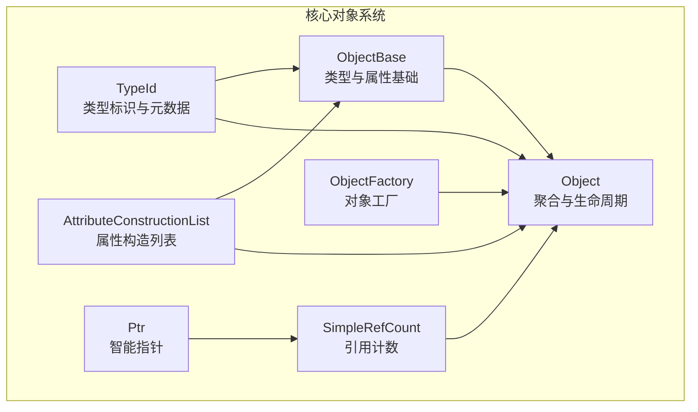
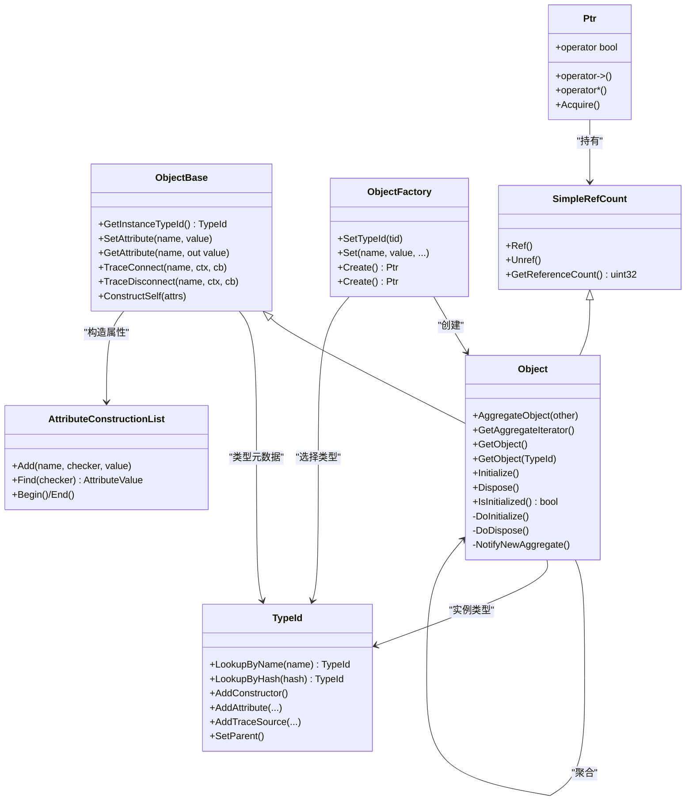
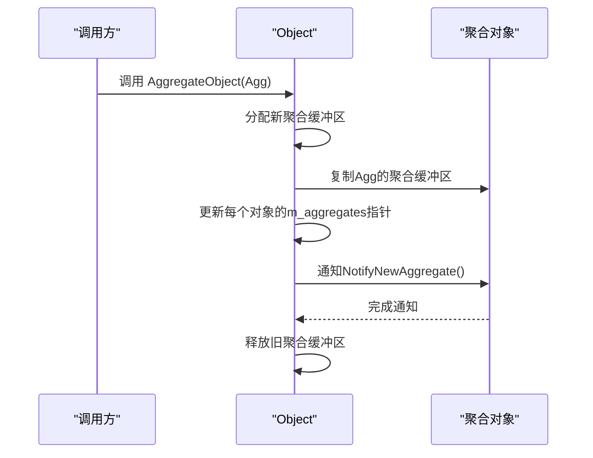
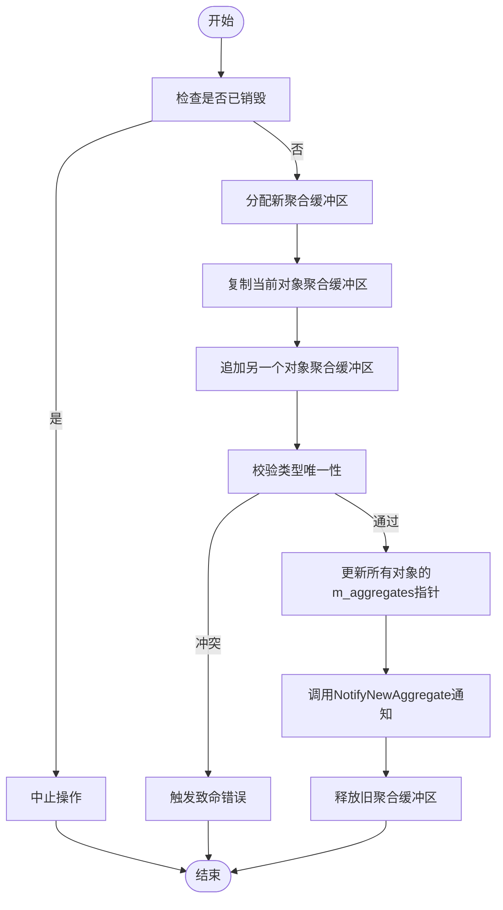
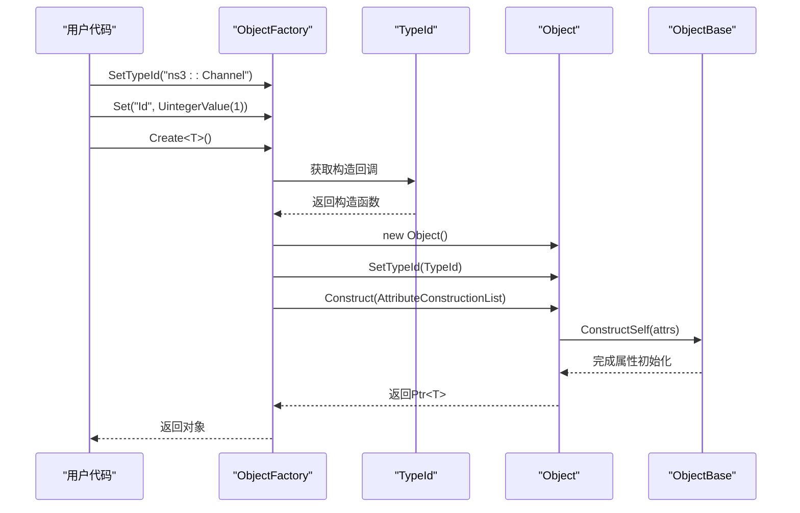
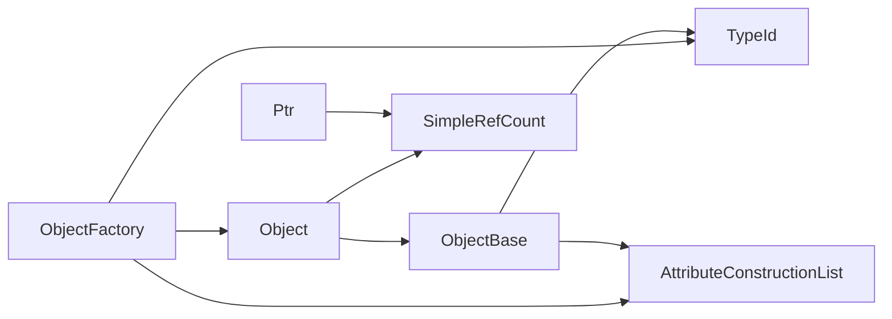

# 对象系统设计

<cite>
**本文档引用的文件**
- [object.h](file://simulator/ns-3.39/src/core/model/object.h)
- [object-base.h](file://simulator/ns-3.39/src/core/model/object-base.h)
- [object-factory.h](file://simulator/ns-3.39/src/core/model/object-factory.h)
- [simple-ref-count.h](file://simulator/ns-3.39/src/core/model/simple-ref-count.h)
- [ptr.h](file://simulator/ns-3.39/src/core/model/ptr.h)
- [type-id.h](file://simulator/ns-3.39/src/core/model/type-id.h)
- [attribute-construction-list.h](file://simulator/ns-3.39/src/core/model/attribute-construction-list.h)
- [object.cc](file://simulator/ns-3.39/src/core/model/object.cc)
- [channel.cc](file://simulator/ns-3.39/src/network/model/channel.cc)
- [hello-simulator.cc](file://simulator/ns-3.39/examples/tutorial/hello-simulator.cc)
</cite>

## 目录
1. [引言](#引言)
2. [项目结构](#项目结构)
3. [核心组件](#核心组件)
4. [架构总览](#架构总览)
5. [详细组件分析](#详细组件分析)
6. [依赖关系分析](#依赖关系分析)
7. [性能考虑](#性能考虑)
8. [故障排查指南](#故障排查指南)
9. [结论](#结论)
10. [附录：使用示例与最佳实践](#附录使用示例与最佳实践)

## 引言
本文件面向NS-3仿真框架的对象系统，系统性阐述Object基类的设计原理、生命周期管理、聚合机制，以及对象工厂模式的实现与使用。文档将从代码级视角解析类型系统、属性系统、智能指针与引用计数、对象创建与初始化流程，并通过类图、时序图与状态图展示对象间的交互关系。最后提供可直接定位到源码的路径指引，帮助读者在实际工程中正确使用对象系统。

## 项目结构
NS-3对象系统位于核心模块（core）下，关键文件包括：
- 基类与生命周期：object.h、object-base.h、object.cc
- 工厂与创建：object-factory.h
- 类型系统：type-id.h
- 属性构造列表：attribute-construction-list.h
- 智能指针与引用计数：ptr.h、simple-ref-count.h

**图表来源**
- [object-base.h:172-341](file://simulator/ns-3.39/src/core/model/object-base.h#L172-L341)
- [object.h:88-447](file://simulator/ns-3.39/src/core/model/object.h#L88-L447)
- [object-factory.h:47-172](file://simulator/ns-3.39/src/core/model/object-factory.h#L47-L172)
- [type-id.h:58-566](file://simulator/ns-3.39/src/core/model/type-id.h#L58-L566)
- [attribute-construction-list.h:40-86](file://simulator/ns-3.39/src/core/model/attribute-construction-list.h#L40-L86)
- [simple-ref-count.h:79-155](file://simulator/ns-3.39/src/core/model/simple-ref-count.h#L79-L155)
- [ptr.h:76-264](file://simulator/ns-3.39/src/core/model/ptr.h#L76-L264)

**章节来源**
- [object.h:1-589](file://simulator/ns-3.39/src/core/model/object.h#L1-L589)
- [object-base.h:1-341](file://simulator/ns-3.39/src/core/model/object-base.h#L1-L341)
- [object-factory.h:1-239](file://simulator/ns-3.39/src/core/model/object-factory.h#L1-L239)
- [type-id.h:1-670](file://simulator/ns-3.39/src/core/model/type-id.h#L1-L670)
- [attribute-construction-list.h:1-91](file://simulator/ns-3.39/src/core/model/attribute-construction-list.h#L1-L91)
- [simple-ref-count.h:1-160](file://simulator/ns-3.39/src/core/model/simple-ref-count.h#L1-L160)
- [ptr.h:1-800](file://simulator/ns-3.39/src/core/model/ptr.h#L1-L800)

## 核心组件
- ObjectBase：为所有对象提供类型绑定、属性读写、跟踪源连接等能力，是类型系统与属性系统的锚点。
- Object：在ObjectBase基础上扩展聚合、初始化/销毁生命周期、引用计数与智能指针集成。
- ObjectFactory：用于按类型名或TypeId创建对象并自动设置属性，支持链式Set与模板化Create。
- TypeId：类型标识与元数据容器，记录父类、构造器、属性、跟踪源等信息。
- AttributeConstructionList：对象构造阶段的属性值列表，配合ObjectBase::ConstructSelf完成属性初始化。
- SimpleRefCount与Ptr：提供轻量CRTP风格的引用计数与智能指针封装，确保内存安全与自动回收。

**章节来源**
- [object-base.h:172-341](file://simulator/ns-3.39/src/core/model/object-base.h#L172-L341)
- [object.h:88-447](file://simulator/ns-3.39/src/core/model/object.h#L88-L447)
- [object-factory.h:47-172](file://simulator/ns-3.39/src/core/model/object-factory.h#L47-L172)
- [type-id.h:58-566](file://simulator/ns-3.39/src/core/model/type-id.h#L58-L566)
- [attribute-construction-list.h:40-86](file://simulator/ns-3.39/src/core/model/attribute-construction-list.h#L40-L86)
- [simple-ref-count.h:79-155](file://simulator/ns-3.39/src/core/model/simple-ref-count.h#L79-L155)
- [ptr.h:76-264](file://simulator/ns-3.39/src/core/model/ptr.h#L76-L264)

## 架构总览
NS-3对象系统采用“类型+属性+工厂+聚合”的架构：
- 类型系统（TypeId）负责描述类的元信息与构造回调；
- 属性系统（ObjectBase/AttributeConstructionList）负责运行期属性读写与构造期初始值注入；
- 工厂（ObjectFactory）负责按类型创建对象并应用属性；
- 聚合（Object）负责对象间组合关系与生命周期协调；
- 引用计数（SimpleRefCount/Ptr）负责内存管理与自动释放。

**图表来源**
- [object-base.h:172-341](file://simulator/ns-3.39/src/core/model/object-base.h#L172-L341)
- [object.h:88-447](file://simulator/ns-3.39/src/core/model/object.h#L88-L447)
- [object-factory.h:47-172](file://simulator/ns-3.39/src/core/model/object-factory.h#L47-L172)
- [type-id.h:58-566](file://simulator/ns-3.39/src/core/model/type-id.h#L58-L566)
- [attribute-construction-list.h:40-86](file://simulator/ns-3.39/src/core/model/attribute-construction-list.h#L40-L86)
- [simple-ref-count.h:79-155](file://simulator/ns-3.39/src/core/model/simple-ref-count.h#L79-L155)
- [ptr.h:76-264](file://simulator/ns-3.39/src/core/model/ptr.h#L76-L264)

## 详细组件分析

### Object基类与生命周期
- 设计要点
  - 继承自SimpleRefCount与ObjectBase，具备引用计数与类型/属性能力。
  - 提供聚合接口AggregateObject与迭代器AggregateIterator，支持对象组合。
  - 生命周期方法Initialize/Dispose分别保证仅一次初始化与销毁，内部通过m_initialized/m_disposed保护。
  - 内部维护聚合数组Aggregates，支持按访问频率排序以优化GetObject查找。

- 关键行为
  - 聚合合并：合并两个对象的聚合缓冲区，更新每个成员的m_aggregates指针，并调用NotifyNewAggregate通知。
  - 初始化顺序：遍历聚合集合，对未初始化对象调用DoInitialize并标记，必要时重启扫描以处理用户代码修改。
  - 销毁顺序：与初始化类似，但调用DoDispose并标记，确保无循环引用导致泄漏。
  - 删除策略：DoDelete检查聚合内引用计数，若全部为零则依次销毁。

**图表来源**
- [object.cc:259-325](file://simulator/ns-3.39/src/core/model/object.cc#L259-L325)

**章节来源**
- [object.h:88-447](file://simulator/ns-3.39/src/core/model/object.h#L88-L447)
- [object.cc:186-242](file://simulator/ns-3.39/src/core/model/object.cc#L186-L242)
- [object.cc:399-437](file://simulator/ns-3.39/src/core/model/object.cc#L399-L437)

### 聚合机制与接口规范
- 聚合规则
  - 同一类型在同一聚合组中只能出现一次，重复聚合会触发致命错误。
  - 聚合后可通过GetObject<T>()或GetObject(TypeId)互相发现对方。
  - 聚合数组按访问频率排序，提升后续查找效率。

- 接口约定
  - NotifyNewAggregate：在聚合发生时被调用，子类可在此方法中进行跨对象协作初始化。
  - DoInitialize/DoDispose：子类重写以执行自身初始化与清理逻辑，需链式调用父类实现。

**图表来源**
- [object.cc:259-325](file://simulator/ns-3.39/src/core/model/object.cc#L259-L325)

**章节来源**
- [object.h:105-212](file://simulator/ns-3.39/src/core/model/object.h#L105-L212)
- [object.cc:150-183](file://simulator/ns-3.39/src/core/model/object.cc#L150-L183)

### 对象工厂模式与创建流程
- ObjectFactory职责
  - 记录目标TypeId与属性初始值列表（AttributeConstructionList）。
  - 支持链式Set(name, value, ...)与模板Create<T>()便捷创建。
  - Create()返回通用Object指针，Create<T>()返回强类型指针。

- 创建流程
  - 由ObjectFactory::Create触发类型构造回调，生成ObjectBase实例。
  - 调用Object::ConstructSelf/Construct注入属性值，随后调用NotifyConstructionCompleted。
  - 最终通过GetObject<T>()返回所需类型的指针。

**图表来源**
- [object-factory.h:47-172](file://simulator/ns-3.39/src/core/model/object-factory.h#L47-L172)
- [type-id.h:562-665](file://simulator/ns-3.39/src/core/model/type-id.h#L562-L665)
- [object-base.h:320](file://simulator/ns-3.39/src/core/model/object-base.h#L320)
- [object.cc:144-148](file://simulator/ns-3.39/src/core/model/object.cc#L144-L148)

**章节来源**
- [object-factory.h:47-172](file://simulator/ns-3.39/src/core/model/object-factory.h#L47-L172)
- [type-id.h:562-665](file://simulator/ns-3.39/src/core/model/type-id.h#L562-L665)
- [attribute-construction-list.h:40-86](file://simulator/ns-3.39/src/core/model/attribute-construction-list.h#L40-L86)

### 类型系统与属性系统
- TypeId
  - 提供类型查询（按名称/哈希）、父子关系判断、构造器注册、属性与跟踪源注册。
  - AddConstructor<T>()通过回调创建实例，SetParent<T>()建立继承关系。

- ObjectBase与属性
  - SetAttribute/GetAttribute提供属性读写；失败时可切换FailSafe版本避免崩溃。
  - ConstructSelf接收AttributeConstructionList，结合TypeId中的属性信息完成初始化。

**章节来源**
- [type-id.h:58-566](file://simulator/ns-3.39/src/core/model/type-id.h#L58-L566)
- [object-base.h:212-320](file://simulator/ns-3.39/src/core/model/object-base.h#L212-L320)

### 引用计数与智能指针
- SimpleRefCount
  - CRTP模板，要求子类继承以获得Ref/Unref能力；Unref归零时委托DELETER删除。
- Ptr
  - 智能指针封装，自动Ref/Unref；提供const_pointer_cast/DynamicCast/StaticCast等转换。

**章节来源**
- [simple-ref-count.h:79-155](file://simulator/ns-3.39/src/core/model/simple-ref-count.h#L79-L155)
- [ptr.h:76-264](file://simulator/ns-3.39/src/core/model/ptr.h#L76-L264)
- [ptr.h:472-797](file://simulator/ns-3.39/src/core/model/ptr.h#L472-L797)

## 依赖关系分析
- 组件耦合
  - Object依赖SimpleRefCount（引用计数）、ObjectBase（类型/属性）、TypeId（类型元数据）、AttributeConstructionList（构造属性）。
  - ObjectFactory依赖TypeId与AttributeConstructionList，间接依赖ObjectBase/Object。
  - Ptr依赖SimpleRefCount，形成对象生命周期与内存管理闭环。

- 可能的循环依赖
  - 聚合场景下，对象间通过m_aggregates相互引用，但通过引用计数与DoDispose确保无泄漏。
  - 工厂与类型系统解耦，通过TypeId回调创建实例，避免编译期强耦合。

**图表来源**
- [object-factory.h:47-172](file://simulator/ns-3.39/src/core/model/object-factory.h#L47-L172)
- [object.h:88-447](file://simulator/ns-3.39/src/core/model/object.h#L88-L447)
- [type-id.h:58-566](file://simulator/ns-3.39/src/core/model/type-id.h#L58-L566)
- [attribute-construction-list.h:40-86](file://simulator/ns-3.39/src/core/model/attribute-construction-list.h#L40-L86)
- [ptr.h:76-264](file://simulator/ns-3.39/src/core/model/ptr.h#L76-L264)

**章节来源**
- [object.h:88-447](file://simulator/ns-3.39/src/core/model/object.h#L88-L447)
- [object-factory.h:47-172](file://simulator/ns-3.39/src/core/model/object-factory.h#L47-L172)
- [ptr.h:76-264](file://simulator/ns-3.39/src/core/model/ptr.h#L76-L264)

## 性能考虑
- 聚合查找优化
  - m_getObjectCount与UpdateSortedArray按访问频率调整聚合数组顺序，降低后续GetObject开销。
- 初始化/销毁稳定性
  - Initialize/Dispose采用“重启扫描”策略，避免用户代码修改聚合表导致的迭代失效。
- 引用计数成本
  - SimpleRefCount基于CRTP，编译期展开，开销极低；Ptr在赋值与析构时进行Ref/Unref，符合RAII。

[本节为通用指导，无需具体文件分析]

## 故障排查指南
- 聚合冲突
  - 症状：重复聚合同一类型触发致命错误。
  - 排查：确认聚合前使用GetObject(TypeId)检测是否存在同类型对象。
  - 参考：[object.cc:284-289](file://simulator/ns-3.39/src/core/model/object.cc#L284-L289)

- 初始化/销毁未生效
  - 症状：多次调用Initialize/Dispose仍只执行一次。
  - 排查：确认DoInitialize/DoDispose是否被正确重写且链式调用父类实现。
  - 参考：[object.cc:186-242](file://simulator/ns-3.39/src/core/model/object.cc#L186-L242)

- 属性设置失败
  - 症状：SetAttribute抛出致命错误。
  - 排查：使用SetAttributeFailSafe或检查属性名、类型与Checker是否匹配。
  - 参考：[object-base.h:212-250](file://simulator/ns-3.39/src/core/model/object-base.h#L212-L250)

- 对象提前销毁
  - 症状：事件回调时对象引用计数为0。
  - 排查：使用CheckLoose检查聚合内是否有非零引用；避免在无外部引用时直接操作对象。
  - 参考：[object.cc:381-396](file://simulator/ns-3.39/src/core/model/object.cc#L381-L396)

**章节来源**
- [object.cc:284-289](file://simulator/ns-3.39/src/core/model/object.cc#L284-L289)
- [object.cc:186-242](file://simulator/ns-3.39/src/core/model/object.cc#L186-L242)
- [object-base.h:212-250](file://simulator/ns-3.39/src/core/model/object-base.h#L212-L250)
- [object.cc:381-396](file://simulator/ns-3.39/src/core/model/object.cc#L381-L396)

## 结论
NS-3对象系统通过清晰的分层设计实现了类型、属性、工厂与聚合的统一：TypeId提供元数据与构造入口，ObjectBase承载类型与属性能力，Object扩展聚合与生命周期，ObjectFactory简化对象创建与配置，SimpleRefCount与Ptr保障内存安全。该体系既满足高性能仿真需求，又提供了良好的扩展性与易用性。

[本节为总结，无需具体文件分析]

## 附录：使用示例与最佳实践
- 创建与配置对象
  - 使用ObjectFactory按类型名创建并设置属性，再通过Create<T>()获取强类型指针。
  - 示例路径：[object-factory.h:205-234](file://simulator/ns-3.39/src/core/model/object-factory.h#L205-L234)

- 注册类型与添加属性
  - 在类中定义GetTypeId并调用NS_OBJECT_ENSURE_REGISTERED宏注册；使用TypeId::AddAttribute/AddTraceSource声明属性与跟踪源。
  - 示例路径：[channel.cc:33-46](file://simulator/ns-3.39/src/network/model/channel.cc#L33-L46)

- 对象聚合与发现
  - 使用AggregateObject建立组合关系；通过GetObject<T>()或GetObject(TypeId)互相发现。
  - 示例路径：[object.h:157-212](file://simulator/ns-3.39/src/core/model/object.h#L157-L212)

- 生命周期管理
  - 在DoInitialize中执行一次性初始化，在DoDispose中释放资源；避免在析构中做复杂逻辑。
  - 示例路径：[object.cc:360-364](file://simulator/ns-3.39/src/core/model/object.cc#L360-L364)

- 最佳实践
  - 优先使用CreateObject/Ptr而非原生new/delete，确保引用计数正确。
  - 避免循环聚合；如需跨对象通信，使用事件或回调而非直接持有指针。
  - 在工厂中集中配置属性，减少分散设置带来的错误。

**章节来源**
- [object-factory.h:205-234](file://simulator/ns-3.39/src/core/model/object-factory.h#L205-L234)
- [channel.cc:33-46](file://simulator/ns-3.39/src/network/model/channel.cc#L33-L46)
- [object.h:157-212](file://simulator/ns-3.39/src/core/model/object.h#L157-L212)
- [object.cc:360-364](file://simulator/ns-3.39/src/core/model/object.cc#L360-L364)