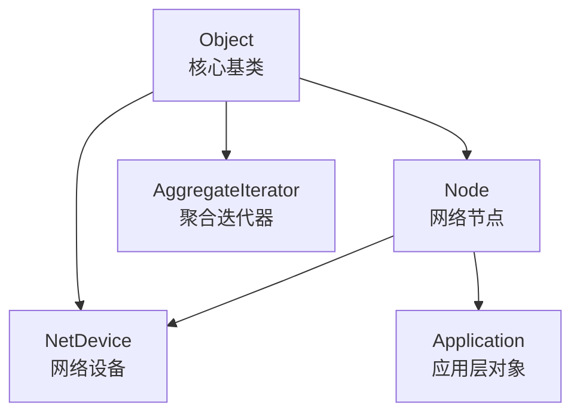
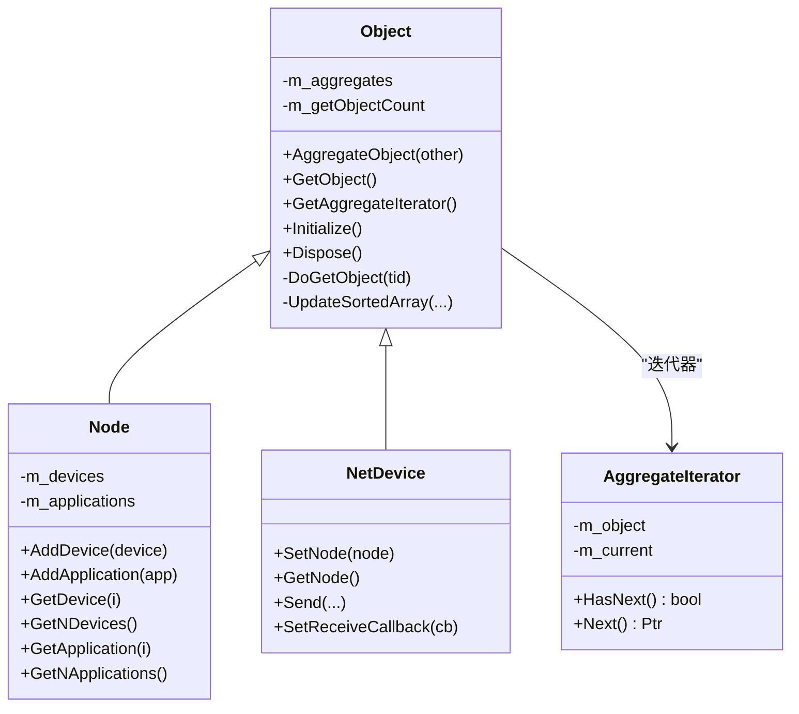
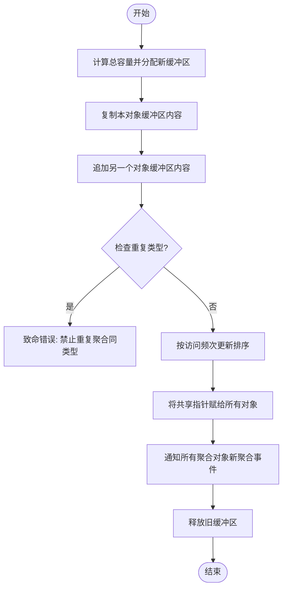
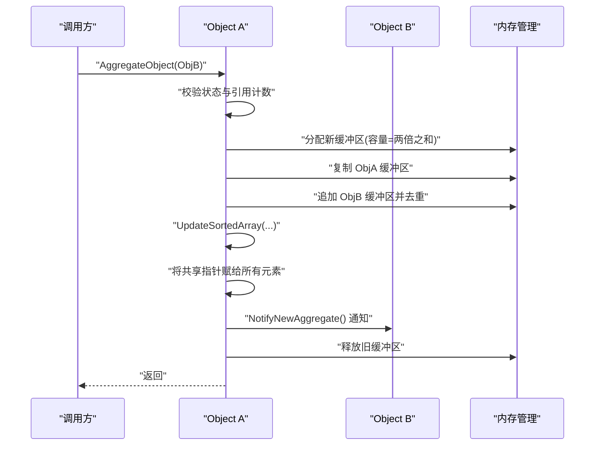
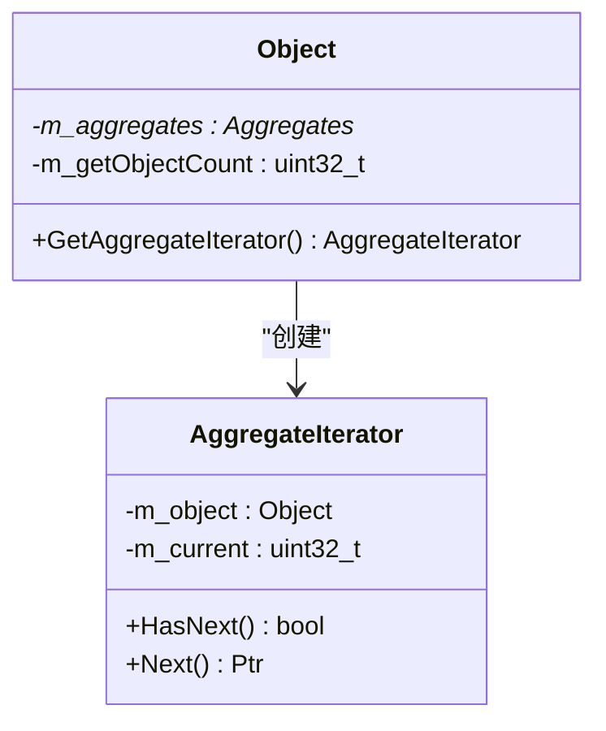
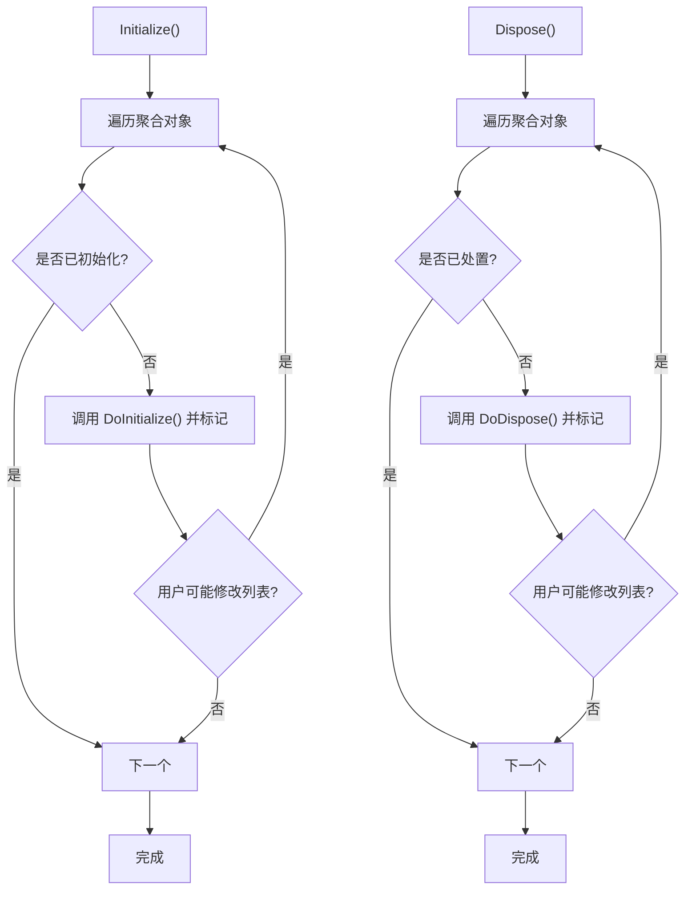
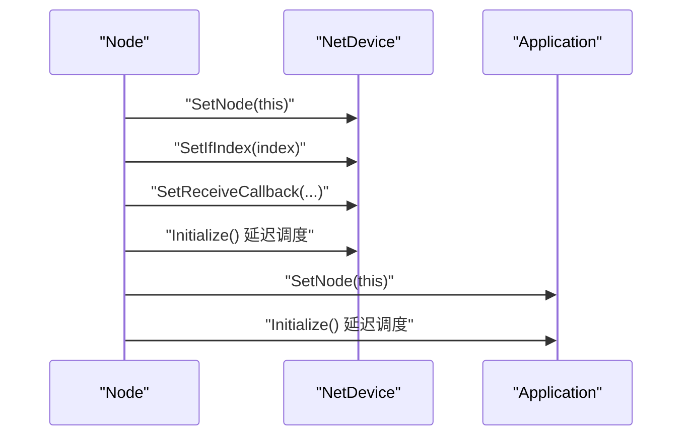
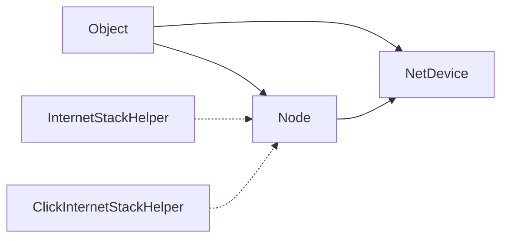

# 对象聚合机制

<cite>
**本文引用的文件**   
- [object.h](file://src/core/model/object.h)
- [object.cc](file://src/core/model/object.cc)
- [node.h](file://src/network/model/node.h)
- [node.cc](file://src/network/model/node.cc)
- [net-device.h](file://src/network/model/net-device.h)
- [net-device.cc](file://src/network/model/net-device.cc)
- [object-internet-stack-helper.h](file://src/internet/helper/internet-stack-helper.h)
- [click-internet-stack-helper.h](file://src/click/helper/click-internet-stack-helper.h)
- [aodv-helper.cc](file://src/aodv/helper/aodv-helper.cc)
- [buildings-helper.cc](file://src/buildings/helper/buildings-helper.cc)
- [three-gpp-v2v-channel-example.cc](file://examples/channel-models/three-gpp-v2v-channel-example.cc)
- [matrix-topology.cc](file://examples/matrix-topology/matrix-topology.cc)
- [object-model.rst](file://doc/manual/source/object-model.rst)
</cite>

## 目录
1. [引言](#引言)
2. [项目结构](#项目结构)
3. [核心组件](#核心组件)
4. [架构总览](#架构总览)
5. [详细组件分析](#详细组件分析)
6. [依赖分析](#依赖分析)
7. [性能考量](#性能考量)
8. [故障排查指南](#故障排查指南)
9. [结论](#结论)
10. [附录](#附录)

## 引言
本文件系统性阐述 NS-3 的对象聚合机制，围绕以下目标展开：设计原理与语义、聚合关系与迭代器、AggregateObject() 实现细节、聚合缓冲区管理策略、对象组合与初始化/销毁流程、典型应用场景（节点聚合、设备聚合、路由协议、建筑模型等），并给出类图、数据结构图、时序图与流程图，辅以实际示例路径与性能优化建议。

## 项目结构
NS-3 的对象聚合根源于核心模块的 Object 类，网络模块的 Node 与 NetDevice 继承自 Object，形成“容器-成员”的典型组合关系。聚合通过 Object::AggregateObject() 将多个对象合并到同一聚合缓冲区，并通过迭代器遍历；同时，Node 负责维护其 NetDevice 与 Application 列表，体现典型的“节点聚合”场景。

图表来源
- [object.h:88-212](file://src/core/model/object.h#L88-L212)
- [node.h:58-142](file://src/network/model/node.h#L58-L142)
- [net-device.h:101-108](file://src/network/model/net-device.h#L101-L108)

章节来源
- [object.h:88-212](file://src/core/model/object.h#L88-L212)
- [node.h:58-142](file://src/network/model/node.h#L58-L142)
- [net-device.h:101-108](file://src/network/model/net-device.h#L101-L108)

## 核心组件
- Object：提供引用计数、初始化/销毁生命周期、聚合接口与迭代器。关键点包括：
  - 聚合缓冲区结构体 Aggregates，采用可变长数组技巧（C 风格柔性数组）一次性分配，避免二次内存分配。
  - 聚合排序策略：按 GetObject 访问频率调整聚合数组顺序，提升后续查找效率。
  - 初始化/销毁传播：Initialize()/Dispose() 会逐个调用聚合对象的 DoInitialize()/DoDispose()，且仅执行一次。
- AggregateIterator：Java 风格迭代器，用于遍历当前对象的所有聚合对象。
- Node：继承 Object，聚合 NetDevice 与 Application，负责设备添加、应用注册与协议回调设置。
- NetDevice：继承 Object，表示链路层设备，与 Node 通过 SetNode/GetNode 关联。

章节来源
- [object.h:88-212](file://src/core/model/object.h#L88-L212)
- [object.cc:150-256](file://src/core/model/object.cc#L150-L256)
- [node.h:58-142](file://src/network/model/node.h#L58-L142)
- [net-device.h:101-108](file://src/network/model/net-device.h#L101-L108)

## 架构总览
下图展示对象聚合在 NS-3 中的整体交互：Node 作为容器聚合 NetDevice/Application；Node/NetDevice 均继承自 Object，从而具备聚合能力；聚合后可通过 GetObject() 或迭代器访问彼此。

图表来源
- [object.h:88-212](file://src/core/model/object.h#L88-L212)
- [object.cc:51-79](file://src/core/model/object.cc#L51-L79)
- [node.h:58-142](file://src/network/model/node.h#L58-L142)
- [net-device.h:101-108](file://src/network/model/net-device.h#L101-L108)

## 详细组件分析

### 聚合缓冲区与数据结构
- 可变长数组技巧：Aggregates 结构体声明一个长度为 1 的 buffer[1]，实际分配时按需扩展，避免两次内存分配。
- 共享指针：每个聚合对象都持有指向同一缓冲区的指针，形成“共享所有权”，便于统一管理与释放。
- 访问计数与排序：m_getObjectCount 记录访问次数，UpdateSortedArray 将最常用对象置于前部，降低后续查找成本。

图表来源
- [object.cc:259-325](file://src/core/model/object.cc#L259-L325)

章节来源
- [object.h:346-447](file://src/core/model/object.h#L346-L447)
- [object.cc:259-325](file://src/core/model/object.cc#L259-L325)

### AggregateObject() 方法实现
- 参数校验：禁止对已处置对象进行聚合，确保聚合前后引用计数安全。
- 合并缓冲区：计算总容量，复制双方缓冲区，去重校验，更新排序。
- 通知机制：使用旧缓冲区快照遍历，保证遍历稳定，避免用户在 NotifyNewAggregate() 中再次聚合导致迭代器失效。
- 内存管理：完成通知后释放旧缓冲区，防止内存泄漏。

图表来源
- [object.cc:259-325](file://src/core/model/object.cc#L259-L325)

章节来源
- [object.cc:259-325](file://src/core/model/object.cc#L259-L325)

### 聚合迭代器
- 迭代器封装：AggregateIterator 持有父对象指针与当前位置索引。
- Java 风格接口：HasNext()/Next() 提供简单易用的遍历能力。
- 安全性：仅能遍历聚合对象，不包含父对象自身；内部构造函数受友元限制，确保只由 Object 创建。

图表来源
- [object.h:105-140](file://src/core/model/object.h#L105-L140)
- [object.cc:51-79](file://src/core/model/object.cc#L51-L79)

章节来源
- [object.h:105-140](file://src/core/model/object.h#L105-L140)
- [object.cc:51-79](file://src/core/model/object.cc#L51-L79)

### 初始化与销毁传播
- Initialize()/Dispose() 会遍历聚合对象列表，调用每个对象的 DoInitialize()/DoDispose()，并仅执行一次。
- 保护机制：若用户在回调中修改聚合列表或调用 GetObject/AggregateObject，框架会重启遍历，确保一致性。

图表来源
- [object.cc:186-242](file://src/core/model/object.cc#L186-L242)

章节来源
- [object.cc:186-242](file://src/core/model/object.cc#L186-L242)

### 节点聚合与设备聚合
- Node 聚合：Node 通过 AddDevice()/AddApplication() 将 NetDevice/Application 聚合到自身，随后调度 Initialize()。
- NetDevice 聚合：NetDevice 与 Node 通过 SetNode()/GetNode() 关联，形成“节点-设备”的聚合关系。

图表来源
- [node.cc:138-177](file://src/network/model/node.cc#L138-L177)
- [net-device.h:284-291](file://src/network/model/net-device.h#L284-L291)

章节来源
- [node.cc:138-177](file://src/network/model/node.cc#L138-L177)
- [net-device.h:284-291](file://src/network/model/net-device.h#L284-L291)

### 应用场景与示例路径
- 路由协议聚合：AODV 协议通过 Helper 在 Node 上聚合路由代理对象。
- 建筑模型聚合：BuildingsHelper 在 Node 上聚合建筑信息对象，用于路径损耗建模。
- V2V 信道示例：在节点上聚合移动模型对象，支持车对车通信场景。
- 矩阵拓扑示例：在节点上聚合本地化模型对象，模拟位置信息。

章节来源
- [aodv-helper.cc:46-46](file://src/aodv/helper/aodv-helper.cc#L46-L46)
- [buildings-helper.cc:52-52](file://src/buildings/helper/buildings-helper.cc#L52-L52)
- [three-gpp-v2v-channel-example.cc:283-310](file://examples/channel-models/three-gpp-v2v-channel-example.cc#L283-L310)
- [matrix-topology.cc:203-203](file://examples/matrix-topology/matrix-topology.cc#L203-L203)

## 依赖分析
- 继承关系：Node/NetDevice 均继承自 Object，天然具备聚合能力。
- 聚合关系：Node 聚合 NetDevice/Application；设备与节点通过 SetNode/GetNode 关联。
- 辅助工具：Helper 类（如 InternetStackHelper、ClickInternetStackHelper）提供批量聚合工具方法，简化用户使用。

图表来源
- [node.h:58-58](file://src/network/model/node.h#L58-L58)
- [net-device.h:101-101](file://src/network/model/net-device.h#L101-L101)
- [object-internet-stack-helper.h:294-294](file://src/internet/helper/internet-stack-helper.h#L294-L294)
- [click-internet-stack-helper.h:175-175](file://src/click/helper/click-internet-stack-helper.h#L175-L175)

章节来源
- [node.h:58-58](file://src/network/model/node.h#L58-L58)
- [net-device.h:101-101](file://src/network/model/net-device.h#L101-L101)
- [object-internet-stack-helper.h:294-294](file://src/internet/helper/internet-stack-helper.h#L294-L294)
- [click-internet-stack-helper.h:175-175](file://src/click/helper/click-internet-stack-helper.h#L175-L175)

## 性能考量
- 查找优化：GetObject() 使用访问计数与插入排序思想维护聚合数组顺序，热点对象优先，降低平均查找复杂度。
- 批量初始化/销毁：Initialize()/Dispose() 采用重启遍历策略，避免回调中修改列表导致的重复工作。
- 内存分配：聚合缓冲区一次性分配，减少碎片与分配开销；析构时按共享指针顺序删除，避免悬挂引用。
- 建议：
  - 避免在 NotifyNewAggregate() 中频繁调用 GetObject()/AggregateObject()，以免触发数组重排。
  - 大规模聚合场景下，尽量按类型分批初始化，减少遍历重启次数。
  - 注意重复聚合检测，避免同一类型对象被多次聚合导致致命错误。

## 故障排查指南
- “重复聚合同一类型”错误：当尝试将同类型的两个对象聚合时触发。应检查聚合逻辑，确保每种类型仅聚合一次。
- “聚合对象已处置”：对已调用 Dispose() 的对象进行聚合会失败。请确认对象生命周期管理。
- “迭代器越界/空指针”：确保在调用 GetAggregateIterator() 后正确使用 HasNext()/Next()，并在对象销毁后不再使用迭代器。
- “初始化/销毁未生效”：确认 Initialize()/Dispose() 是否被正确调度与执行，注意用户回调中对聚合列表的修改可能导致重启遍历。

章节来源
- [object.cc:284-289](file://src/core/model/object.cc#L284-L289)
- [object.cc:262-265](file://src/core/model/object.cc#L262-L265)
- [object.cc:58-72](file://src/core/model/object.cc#L58-L72)

## 结论
NS-3 的对象聚合机制以 Object 为核心，通过共享缓冲区与访问计数排序实现高效、灵活的对象组合。Node/NetDevice 等高层组件在此基础上构建“容器-成员”关系，广泛应用于网络仿真场景。借助聚合迭代器与生命周期传播，开发者可以以非侵入方式扩展功能，提升模块化与可维护性。

## 附录
- 实际示例路径参考：
  - [aodv-helper.cc:46-46](file://src/aodv/helper/aodv-helper.cc#L46-L46)
  - [buildings-helper.cc:52-52](file://src/buildings/helper/buildings-helper.cc#L52-L52)
  - [three-gpp-v2v-channel-example.cc:283-310](file://examples/channel-models/three-gpp-v2v-channel-example.cc#L283-L310)
  - [matrix-topology.cc:203-203](file://examples/matrix-topology/matrix-topology.cc#L203-L203)
  - [object-model.rst:223-239](file://doc/manual/source/object-model.rst#L223-L239)