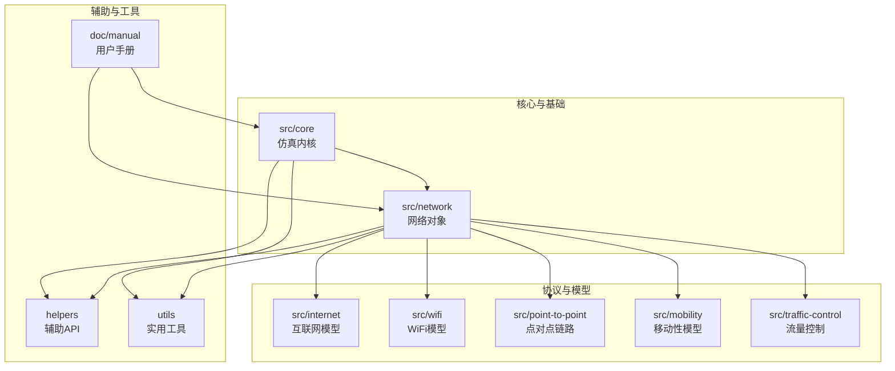
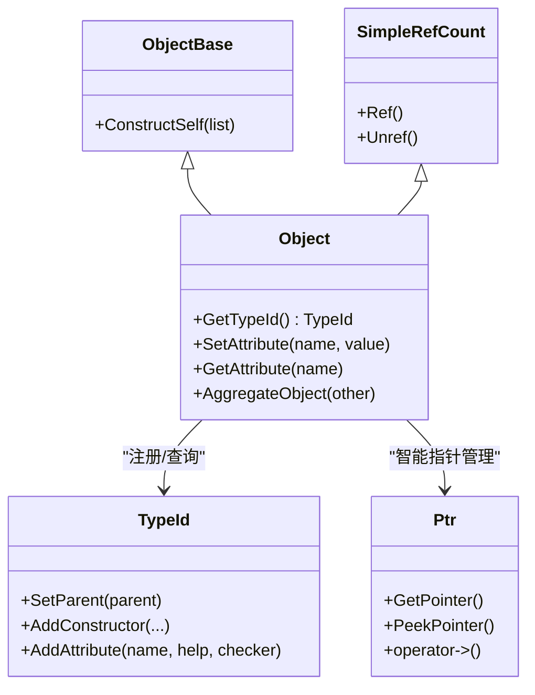
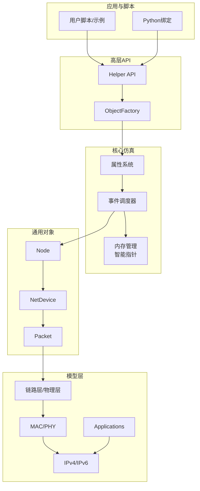
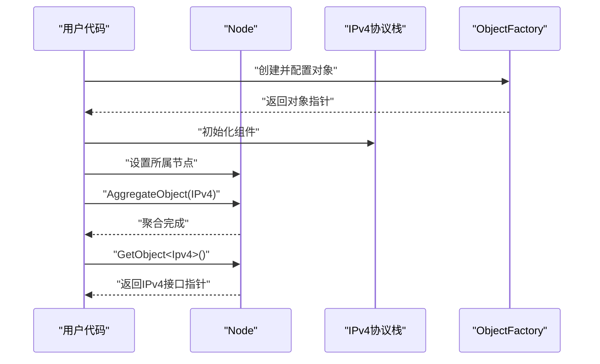
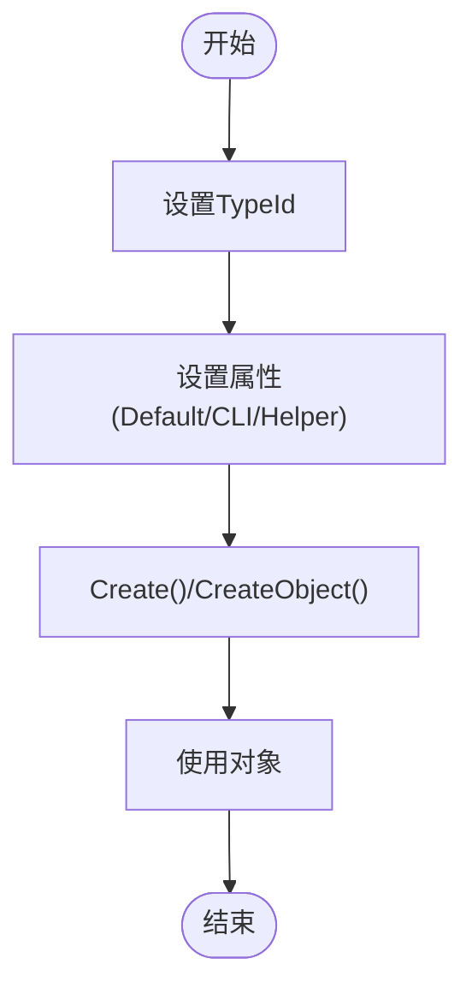
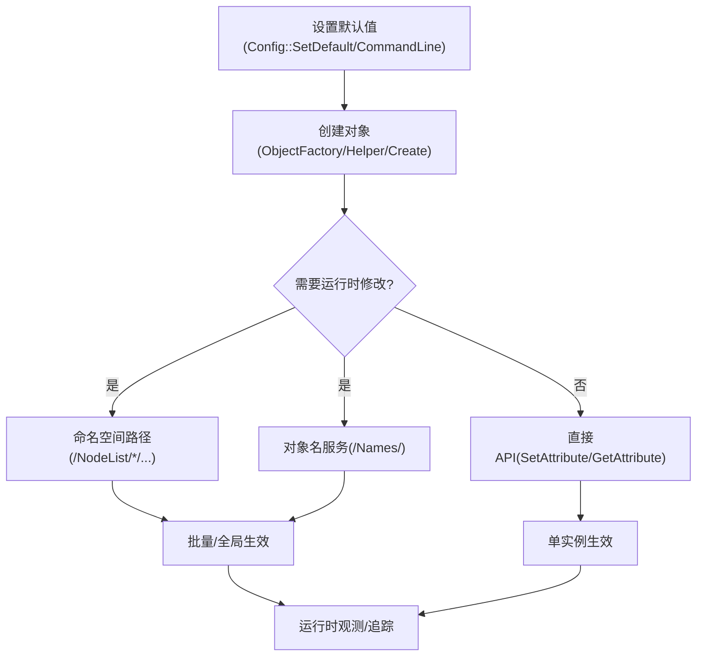
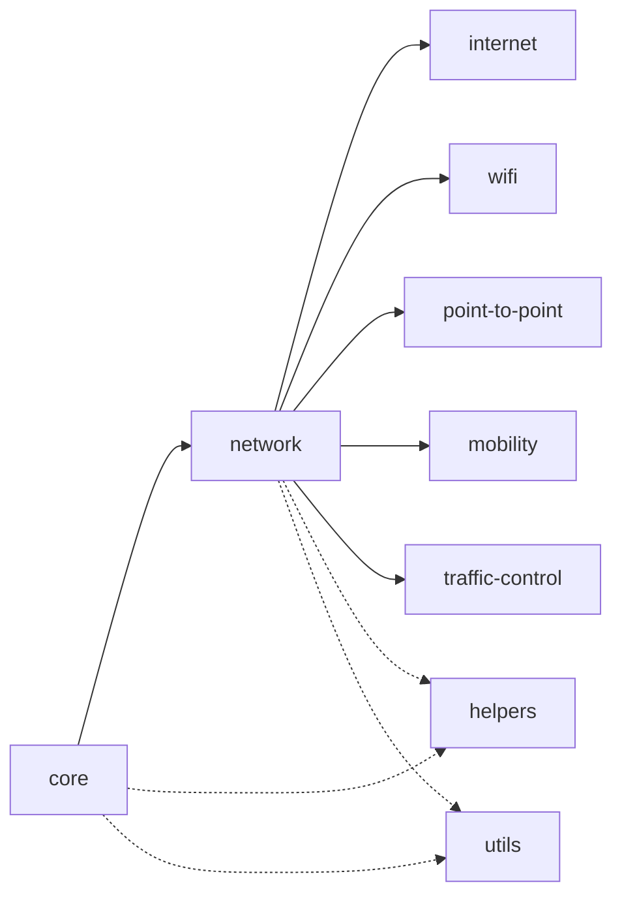

# 整体架构概览

<cite>
**本文档引用的文件**
- [README.md](file://README.md)
- [object-model.rst](file://simulator/ns-3.39/doc/manual/source/object-model.rst)
- [attributes.rst](file://simulator/ns-3.39/doc/manual/source/attributes.rst)
- [organization.rst](file://simulator/ns-3.39/doc/manual/source/organization.rst)
- [features.rst](file://simulator/ns-3.39/doc/manual/source/features.rst)
- [simulator.rst](file://simulator/ns-3.39/doc/manual/source/simulator.rst)
- [object-base.h](file://simulator/ns-3.39/src/core/model/object-base.h)
</cite>

## 目录
1. [引言](#引言)
2. [项目结构](#项目结构)
3. [核心组件](#核心组件)
4. [架构总览](#架构总览)
5. [详细组件分析](#详细组件分析)
6. [依赖分析](#依赖分析)
7. [性能考虑](#性能考虑)
8. [故障排除指南](#故障排除指南)
9. [结论](#结论)
10. [附录](#附录)

## 引言
本文件面向希望全面理解NS-3整体架构与设计理念的读者，系统性阐述其分层结构、模块化组织方式以及通过对象系统、类型系统与属性系统实现的松耦合模块化设计。文档同时总结NS-3在离散事件仿真领域的架构特征，并与同类仿真器进行对比，突出其在可扩展性、可配置性与跨语言支持方面的优势。

## 项目结构
NS-3的源代码主要位于simulator/ns-3.39目录下，采用“模块化分层”的组织方式：核心仿真内核（src/core）与基础数据对象（src/network）构成通用仿真基础；随后是按功能域划分的模型模块（如internet、wifi、point-to-point等），并通过辅助工具与文档体系支撑开发与使用。

- 核心与基础
  - 源码主体集中在src目录，遵循自底向上的层次依赖关系。
  - 核心仿真内核与网络对象独立于具体协议与设备模型，便于泛化复用。
- 辅助与文档
  - doc/manual提供官方手册章节，涵盖对象模型、属性系统、组织结构等主题。
  - doc/models与doc/tutorial分别覆盖模型说明与入门教程。
- 示例与扩展
  - examples目录包含大量端到端示例脚本，体现模块组合与配置实践。
  - contrib与scratch目录用于社区贡献与快速原型开发。

**图表来源**
- [organization.rst:18-47](file://simulator/ns-3.39/doc/manual/source/organization.rst#L18-L47)

**章节来源**
- [organization.rst:1-62](file://simulator/ns-3.39/doc/manual/source/organization.rst#L1-L62)
- [features.rst:1-21](file://simulator/ns-3.39/doc/manual/source/features.rst#L1-L21)

## 核心组件
NS-3的高层架构围绕三大基础设施展开：对象系统、类型系统与属性系统。它们共同支撑了模块间的解耦与可配置性，使得开发者可以在运行时动态装配与调整网络行为。

- 对象系统（Object Model）
  - 基于C++类体系，提供抽象、封装、继承与多态能力。
  - 通过Object/ObjectBase/SimpleRefCount三类基类，赋予对象元信息、聚合机制与智能指针引用计数管理。
  - 支持对象工厂（ObjectFactory）与构造器注册，简化实例化与默认值配置。
- 类型系统（TypeId）
  - 为每个类维护唯一标识与继承关系元数据，支持安全的向上/向下转换与属性继承。
  - 通过AddConstructor/AddAttribute等接口，将构造器与属性声明集中于GetTypeId中。
- 属性系统（Attributes）
  - 将内部成员变量映射为字符串键值，提供统一的读取/设置与范围校验机制。
  - 支持命令行、配置存储与命名空间路径等多种设置入口，便于脚本化与批量配置。

**图表来源**
- [object-model.rst:46-95](file://simulator/ns-3.39/doc/manual/source/object-model.rst#L46-L95)
- [object-model.rst:133-204](file://simulator/ns-3.39/doc/manual/source/object-model.rst#L133-L204)
- [attributes.rst:133-230](file://simulator/ns-3.39/doc/manual/source/attributes.rst#L133-L230)

**章节来源**
- [object-model.rst:9-72](file://simulator/ns-3.39/doc/manual/source/object-model.rst#L9-L72)
- [object-model.rst:153-240](file://simulator/ns-3.39/doc/manual/source/object-model.rst#L153-L240)
- [attributes.rst:16-56](file://simulator/ns-3.39/doc/manual/source/attributes.rst#L16-L56)
- [object-base.h:36-57](file://simulator/ns-3.39/src/core/model/object-base.h#L36-L57)

## 架构总览
NS-3采用“内核+模块+辅助工具”的分层架构。底层内核负责事件调度与内存管理；中间层为通用网络对象与协议栈；上层提供丰富的模型模块与辅助API；最外层是文档、示例与测试体系。

- 分层依赖
  - 核心仿真内核与网络对象相互独立，不依赖具体协议或设备实现，保证通用性与可移植性。
  - 上层模块仅依赖底层公共接口，避免循环依赖与紧耦合。
- 扩展机制
  - 聚合（Aggregation）允许在运行时向节点注入新组件，无需修改基类。
  - 工厂（ObjectFactory）与帮助器（Helper）提供高层封装，降低使用复杂度。
- 配置与可观测性
  - 属性系统贯穿全栈，支持从命令行、配置文件到命名空间路径的多维配置。
  - 回调、追踪与统计工具为性能分析与调试提供支撑。

**图表来源**
- [organization.rst:24-62](file://simulator/ns-3.39/doc/manual/source/organization.rst#L24-L62)
- [simulator.rst:8-19](file://simulator/ns-3.39/doc/manual/source/simulator.rst#L8-L19)

**章节来源**
- [organization.rst:24-62](file://simulator/ns-3.39/doc/manual/source/organization.rst#L24-L62)
- [simulator.rst:8-19](file://simulator/ns-3.39/doc/manual/source/simulator.rst#L8-L19)

## 详细组件分析

### 对象系统与聚合机制
- 设计要点
  - 使用Object/ObjectBase/SimpleRefCount三类基类，分别提供完整对象特性、部分特性与引用计数。
  - 通过AggregateObject实现“组合优于继承”，避免复杂的继承层次导致的脆弱基类问题。
  - GetObject提供类型安全的向下转型与接口查找，替代传统C++ dynamic_cast。
- 典型流程
  - 创建协议组件（如IPv4协议栈）→ 设置所属节点 → 聚合到节点 → 运行时通过GetObject访问接口。

**图表来源**
- [object-model.rst:182-240](file://simulator/ns-3.39/doc/manual/source/object-model.rst#L182-L240)

**章节来源**
- [object-model.rst:153-240](file://simulator/ns-3.39/doc/manual/source/object-model.rst#L153-L240)

### 类型系统与工厂模式
- 设计要点
  - 每个类在GetTypeId中注册自身元信息（父类、构造器、属性），形成树状继承关系。
  - ObjectFactory通过TypeId与属性集合，统一创建与配置对象，减少样板代码。
- 典型流程
  - 指定TypeId → 设置默认属性 → Create()生成实例 → 后续可通过命令行或配置进一步覆盖。

**图表来源**
- [object-model.rst:241-272](file://simulator/ns-3.39/doc/manual/source/object-model.rst#L241-L272)
- [attributes.rst:564-595](file://simulator/ns-3.39/doc/manual/source/attributes.rst#L564-L595)

**章节来源**
- [object-model.rst:241-272](file://simulator/ns-3.39/doc/manual/source/object-model.rst#L241-L272)
- [attributes.rst:564-595](file://simulator/ns-3.39/doc/manual/source/attributes.rst#L564-L595)

### 属性系统与配置入口
- 设计要点
  - 属性以字符串键名暴露，支持默认值、只读/可写、范围检查与序列化。
  - 提供多种设置入口：命令行、ConfigStore、ObjectFactory、Helper、直接API、命名空间路径与通配符。
- 典型流程
  - 设置全局默认值 → 实例化对象 → 运行时通过命名空间路径或对象名服务定位并修改属性。

**图表来源**
- [attributes.rst:26-56](file://simulator/ns-3.39/doc/manual/source/attributes.rst#L26-L56)
- [attributes.rst:668-742](file://simulator/ns-3.39/doc/manual/source/attributes.rst#L668-L742)

**章节来源**
- [attributes.rst:26-56](file://simulator/ns-3.39/doc/manual/source/attributes.rst#L26-L56)
- [attributes.rst:668-742](file://simulator/ns-3.39/doc/manual/source/attributes.rst#L668-L742)

## 依赖分析
NS-3的模块间依赖遵循“自底向上”的单向依赖原则：核心仿真内核与网络对象独立存在，上层模型仅依赖公共接口，避免环依赖与紧耦合。

**图表来源**
- [organization.rst:24-62](file://simulator/ns-3.39/doc/manual/source/organization.rst#L24-L62)

**章节来源**
- [organization.rst:24-62](file://simulator/ns-3.39/doc/manual/source/organization.rst#L24-L62)

## 性能考虑
- 内存管理
  - 引用计数与智能指针（Ptr）避免显式delete带来的内存泄漏风险，建议优先使用CreateObject/Create等工厂方法。
- 配置与初始化
  - 在对象构造前通过ConstructSelf或合理顺序设置属性，避免属性间相互依赖导致的初始化失败。
- 可观测性与追踪
  - 利用属性系统与回调机制进行细粒度观测，结合统计与绘图工具进行性能分析。

[本节为通用指导，不直接分析特定文件]

## 故障排除指南
- 常见问题
  - 对象未正确注册：确保类定义GetTypeId并使用NS_OBJECT_ENSURE_REGISTERED宏。
  - 属性不存在或路径错误：使用/Names命名服务或通配符定位目标对象。
  - 聚合冲突：同一类型对象不可多次聚合到同一宿主。
- 排查步骤
  - 检查TypeId注册与继承链是否正确。
  - 使用命令行参数打印可用属性与默认值，确认配置路径。
  - 通过GetObject安全查找接口，避免裸指针误用。

**章节来源**
- [object-base.h:36-57](file://simulator/ns-3.39/src/core/model/object-base.h#L36-L57)
- [object-model.rst:273-299](file://simulator/ns-3.39/doc/manual/source/object-model.rst#L273-L299)
- [attributes.rst:770-790](file://simulator/ns-3.39/doc/manual/source/attributes.rst#L770-L790)

## 结论
NS-3通过对象系统、类型系统与属性系统的协同，构建了高度模块化、可扩展且易于配置的离散事件仿真平台。其“聚合优于继承”“工厂与帮助器封装”“属性驱动配置”的设计原则，使开发者能够在不修改核心代码的前提下灵活组合与定制网络模型。配合完善的文档与示例体系，NS-3在学术研究与工程实践中均展现出良好的可维护性与可扩展性。

[本节为总结性内容，不直接分析特定文件]

## 附录
- 与其他仿真器的差异与优势
  - 与NS-2相比，NS-3更强调组件化与可插拔性，通过聚合与工厂模式降低继承层次的复杂度。
  - 与OMNeT++相比，NS-3在C++生态中提供了更一致的对象生命周期与内存管理模型，并具备强大的属性系统与Python绑定能力。
  - 与混合仿真平台相比，NS-3专注于网络仿真领域，模型覆盖广、文档完善、社区活跃。

**章节来源**
- [README.md:10-241](file://README.md#L10-L241)