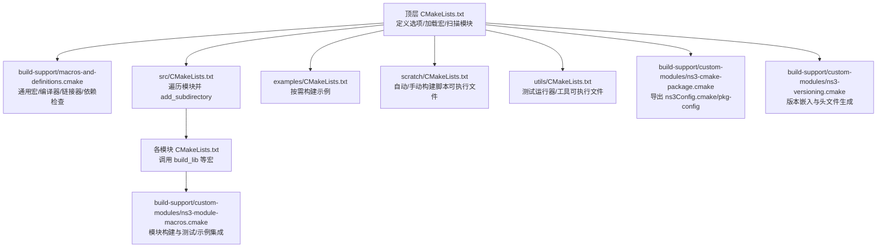
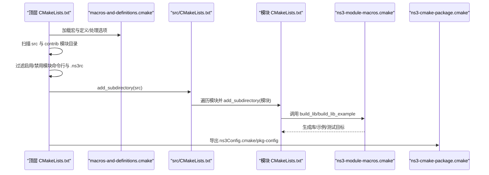
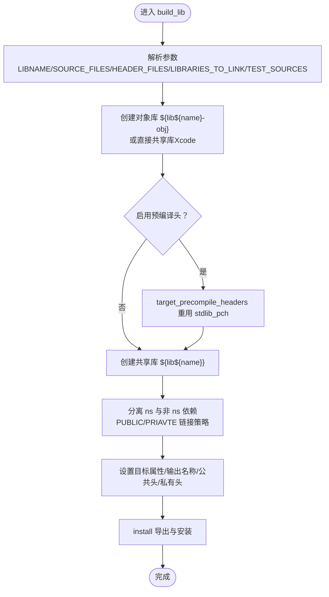
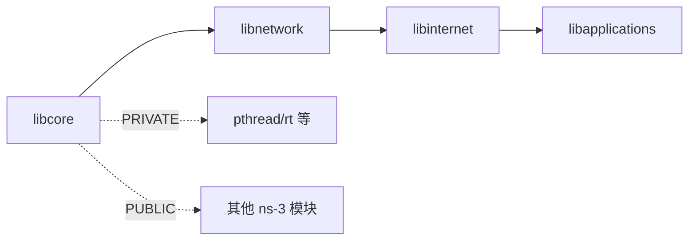
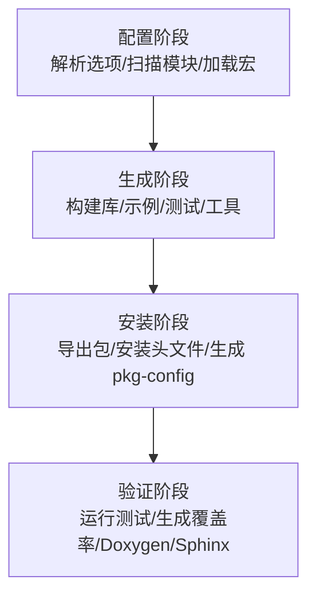

# 构建系统架构

<cite>
**本文引用的文件**
- [CMakeLists.txt](file://simulator/ns-3.39/CMakeLists.txt)
- [macros-and-definitions.cmake](file://simulator/ns-3.39/build-support/macros-and-definitions.cmake)
- [ns3-module-macros.cmake](file://simulator/ns-3.39/build-support/custom-modules/ns3-module-macros.cmake)
- [ns3-configtable.cmake](file://simulator/ns-3.39/build-support/custom-modules/ns3-configtable.cmake)
- [ns3-cmake-package.cmake](file://simulator/ns-3.39/build-support/custom-modules/ns3-cmake-package.cmake)
- [ns3-versioning.cmake](file://simulator/ns-3.39/build-support/custom-modules/ns3-versioning.cmake)
- [FindEigen3.cmake](file://simulator/ns-3.39/build-support/3rd-party/FindEigen3.cmake)
- [FindGTK3.cmake](file://simulator/ns-3.39/build-support/3rd-party/FindGTK3.cmake)
- [Config.cmake.in](file://simulator/ns-3.39/build-support/Config.cmake.in)
- [src/CMakeLists.txt](file://simulator/ns-3.39/src/CMakeLists.txt)
- [examples/CMakeLists.txt](file://simulator/ns-3.39/examples/CMakeLists.txt)
- [scratch/CMakeLists.txt](file://simulator/ns-3.39/scratch/CMakeLists.txt)
- [utils/CMakeLists.txt](file://simulator/ns-3.39/utils/CMakeLists.txt)
- [src/core/CMakeLists.txt](file://simulator/ns-3.39/src/core/CMakeLists.txt)
- [ns3-coverage.cmake](file://simulator/ns-3.39/build-support/custom-modules/ns3-coverage.cmake)
</cite>

## 目录
1. [简介](#简介)
2. [项目结构](#项目结构)
3. [核心组件](#核心组件)
4. [架构总览](#架构总览)
5. [详细组件分析](#详细组件分析)
6. [依赖关系分析](#依赖关系分析)
7. [性能考量](#性能考量)
8. [故障排查指南](#故障排查指南)
9. [结论](#结论)
10. [附录](#附录)

## 简介
本文件系统性梳理 NS-3 的 CMake 构建系统架构，覆盖主构建文件、宏与定义、模块构建宏、包导出与版本嵌入、第三方库查找、以及示例/脚本/工具等子系统的组织方式；并结合实际源码路径，给出模块发现机制、条件编译选项、构建配置管理、目标分类、编译器与链接策略、构建流程图与配置项说明，最后提供定制化、性能优化与跨平台兼容的最佳实践。

## 项目结构
NS-3 的构建系统以顶层 CMakeLists.txt 为核心入口，通过一系列自定义宏与模块完成模块扫描、过滤、构建与导出。主要目录职责如下：
- simulator/ns-3.39：NS-3 源代码与构建支持
  - CMakeLists.txt：顶层构建入口，定义选项、加载宏、扫描模块、分发子目录
  - build-support：构建支撑层
    - macros-and-definitions.cmake：通用宏、编译器检测、输出目录、链接器选择、依赖检查、测试/文档目标等
    - custom-modules：模块化构建与导出相关宏与脚本
      - ns3-module-macros.cmake：模块库构建宏（build_lib、build_lib_example、写模块头）
      - ns3-configtable.cmake：配置表打印与模块列表输出
      - ns3-cmake-package.cmake：生成 ns3Config.cmake、安装导出与 pkg-config 文件
      - ns3-versioning.cmake：版本信息提取与嵌入
      - ns3-coverage.cmake：覆盖率收集与报告
    - 3rd-party：第三方库查找脚本
      - FindEigen3.cmake、FindGTK3.cmake 等
    - Config.cmake.in：包配置模板
  - src：核心模块源码与构建
    - 各模块目录（如 core、network、wifi 等）均含 CMakeLists.txt，使用 ns3-module-macros.cmake 完成构建
  - examples、scratch、utils：示例、脚本与工具的构建
  - build、build-support/empty.cc、build-support/Config.cmake.in 等：构建产物与导出模板

图表来源
- [CMakeLists.txt:125-171](file://simulator/ns-3.39/CMakeLists.txt#L125-L171)
- [macros-and-definitions.cmake:395-750](file://simulator/ns-3.39/build-support/macros-and-definitions.cmake#L395-L750)
- [src/CMakeLists.txt:1-94](file://simulator/ns-3.39/src/CMakeLists.txt#L1-L94)
- [examples/CMakeLists.txt:1-19](file://simulator/ns-3.39/examples/CMakeLists.txt#L1-L19)
- [scratch/CMakeLists.txt:1-102](file://simulator/ns-3.39/scratch/CMakeLists.txt#L1-L102)
- [utils/CMakeLists.txt:1-84](file://simulator/ns-3.39/utils/CMakeLists.txt#L1-L84)
- [ns3-module-macros.cmake:34-395](file://simulator/ns-3.39/build-support/custom-modules/ns3-module-macros.cmake#L34-L395)
- [ns3-cmake-package.cmake:109-152](file://simulator/ns-3.39/build-support/custom-modules/ns3-cmake-package.cmake#L109-L152)
- [ns3-versioning.cmake:73-231](file://simulator/ns-3.39/build-support/custom-modules/ns3-versioning.cmake#L73-L231)

章节来源
- [CMakeLists.txt:1-171](file://simulator/ns-3.39/CMakeLists.txt#L1-L171)
- [src/CMakeLists.txt:1-94](file://simulator/ns-3.39/src/CMakeLists.txt#L1-L94)

## 核心组件
- 顶层构建入口与选项管理
  - 定义最小 CMake 版本、项目名、最低编译器版本要求
  - 提供大量布尔/字符串选项控制功能开关（如示例、测试、日志、警告、Sanitizer、LTO、预编译头、MPI、SQLite、Eigen、GTK3、可视化器、Python 绑定等）
  - 支持用户指定输出目录、启用 ccache、快速链接器（mold/LLD）、时间追踪、IWYU/LWYU 等
- 通用宏与定义
  - 平台/编译器检测与特性开关（Linux/Windows/macOS、GCC/Clang/AppleClang）
  - 输出目录布局（库/可执行文件/头文件）、RPATH 设置、位置无关代码
  - 链接器策略（-Wl,--as-needed 等）、对象库与共享库组合、Monolithic 库与静态库构建
  - 依赖检查与缺失提示（Threads、Python3、Boost、GSL、MPI、LibXml2、GTK3/HarfBuzz、SQLite、Eigen 等）
  - 文档与测试目标（Doxygen/Sphinx、覆盖率、时间追踪、ninja tracing）
- 模块构建宏
  - build_lib：统一处理模块库构建、公共/私有链接、模块头聚合、示例与测试集成、安装导出
  - build_lib_example：模块内示例可执行文件构建
  - write_module_header：生成模块聚合头文件
- 包导出与版本嵌入
  - ns3-cmake-package：生成 ns3Config.cmake、安装导出与 pkg-config 文件
  - ns3-versioning：从 Git 或缓存读取版本信息，生成版本头文件并嵌入构建标识
- 第三方库查找
  - 自定义 Find*.cmake 脚本（Eigen3、GTK3、HarfBuzz、Sphinx 等），提供导入目标与版本检查
- 子系统构建
  - src：模块扫描与逐个 add_subdirectory
  - examples：按需构建示例
  - scratch：自动/手动脚本可执行文件
  - utils：测试运行器、性能工具、文档辅助工具

章节来源
- [CMakeLists.txt:15-123](file://simulator/ns-3.39/CMakeLists.txt#L15-L123)
- [macros-and-definitions.cmake:202-310](file://simulator/ns-3.39/build-support/macros-and-definitions.cmake#L202-L310)
- [ns3-module-macros.cmake:34-395](file://simulator/ns-3.39/build-support/custom-modules/ns3-module-macros.cmake#L34-L395)
- [ns3-cmake-package.cmake:109-152](file://simulator/ns-3.39/build-support/custom-modules/ns3-cmake-package.cmake#L109-L152)
- [ns3-versioning.cmake:73-231](file://simulator/ns-3.39/build-support/custom-modules/ns3-versioning.cmake#L73-L231)
- [FindEigen3.cmake:1-110](file://simulator/ns-3.39/build-support/3rd-party/FindEigen3.cmake#L1-L110)
- [FindGTK3.cmake:1-622](file://simulator/ns-3.39/build-support/3rd-party/FindGTK3.cmake#L1-L622)

## 架构总览
下图展示从顶层到模块级的构建流，包括模块发现、过滤、构建与导出的关键步骤。

图表来源
- [CMakeLists.txt:125-171](file://simulator/ns-3.39/CMakeLists.txt#L125-L171)
- [macros-and-definitions.cmake:395-750](file://simulator/ns-3.39/build-support/macros-and-definitions.cmake#L395-L750)
- [src/CMakeLists.txt:1-94](file://simulator/ns-3.39/src/CMakeLists.txt#L1-L94)
- [ns3-module-macros.cmake:34-395](file://simulator/ns-3.39/build-support/custom-modules/ns3-module-macros.cmake#L34-L395)
- [ns3-cmake-package.cmake:109-152](file://simulator/ns-3.39/build-support/custom-modules/ns3-cmake-package.cmake#L109-L152)

## 详细组件分析

### 主构建文件与选项体系
- 最小 CMake 版本与项目声明
- 编译器最低版本约束（AppleClang/GCC/Clang）
- 功能开关选项（断言、日志、示例、测试、Sanitizer、LTO、预编译头、Python 绑定、可视化器、SQLite、Eigen、GTK3、MPI、网络设备等）
- 输出目录与 ccache/快速链接器/时间追踪/IWYU/LWYU 等性能与诊断选项
- 模块启用/禁用与过滤（NS3_ENABLED_MODULES、NS3_DISABLED_MODULES、NS3_FILTER_MODULE_EXAMPLES_AND_TESTS）
- 加载宏与模块扫描、处理选项、添加子目录、写锁与配置表、导出包

章节来源
- [CMakeLists.txt:1-171](file://simulator/ns-3.39/CMakeLists.txt#L1-L171)

### 通用宏与定义（编译器/链接器/依赖）
- 平台与编译器识别：Linux/Windows/macOS、GCC/Clang/AppleClang，设置颜色诊断、线程数、输出目录、RPATH、位置无关代码
- 链接器策略：根据 GCC/Clang/AppleClang 选择不同链接参数，支持 as-needed、全量链接、静态标志
- 快速链接器：优先检测 mold（GCC≥12.1.0）或 lld，自动注入 -fuse-ld 参数
- 依赖检查：Threads、Python3、Boost、GSL、MPI、LibXml2、SQLite、Eigen、GTK3/HarfBuzz 等，按需启用宏定义与包含目录
- 测试与文档：Doxygen/Sphinx 目标、覆盖率（gcov/lcov）、时间追踪（Clang）、ninja tracing
- 头文件复制与模块聚合头生成、示例/测试扫描与集成

章节来源
- [macros-and-definitions.cmake:202-310](file://simulator/ns-3.39/build-support/macros-and-definitions.cmake#L202-L310)
- [macros-and-definitions.cmake:395-750](file://simulator/ns-3.39/build-support/macros-and-definitions.cmake#L395-L750)
- [macros-and-definitions.cmake:800-1200](file://simulator/ns-3.39/build-support/macros-and-definitions.cmake#L800-L1200)

### 模块构建宏（build_lib 等）
- build_lib：解析参数（库名、源/头文件、链接库、测试源、特性开关等），创建对象库与共享库，设置公共/私有链接，生成模块头文件，复制头文件，按需构建示例与测试，安装导出
- build_lib_example：在父模块基础上构建示例可执行文件，处理缺失依赖与过滤
- write_module_header：生成模块聚合头，避免模块间重复包含

图表来源
- [ns3-module-macros.cmake:34-395](file://simulator/ns-3.39/build-support/custom-modules/ns3-module-macros.cmake#L34-L395)

章节来源
- [ns3-module-macros.cmake:34-395](file://simulator/ns-3.39/build-support/custom-modules/ns3-module-macros.cmake#L34-L395)

### 包导出与版本嵌入
- ns3-cmake-package：为每个模块生成 pkg-config 文件，导出 ns3Targets.cmake，生成 ns3Config.cmake 与 ns3ConfigVersion.cmake，并提供卸载目标
- ns3-versioning：从 Git 描述或缓存读取版本信息，生成版本头文件与构建标识，提供 check-version 目标

章节来源
- [ns3-cmake-package.cmake:109-152](file://simulator/ns-3.39/build-support/custom-modules/ns3-cmake-package.cmake#L109-L152)
- [ns3-versioning.cmake:73-231](file://simulator/ns-3.39/build-support/custom-modules/ns3-versioning.cmake#L73-L231)

### 第三方库查找脚本
- FindEigen3.cmake：查找头文件并检查版本，提供 Eigen3::Eigen 目标
- FindGTK3.cmake：查找 GTK3 及其组件（glib、pango、cairo、harfbuzz 等），支持版本检查与多后缀搜索

章节来源
- [FindEigen3.cmake:1-110](file://simulator/ns-3.39/build-support/3rd-party/FindEigen3.cmake#L1-L110)
- [FindGTK3.cmake:1-622](file://simulator/ns-3.39/build-support/3rd-party/FindGTK3.cmake#L1-L622)

### 子系统构建
- src：扫描模块目录，按需处理 visualizer，逐个 add_subdirectory，构建静态/单体库，处理外部库静态版本映射
- examples：按需扫描并 add_subdirectory，记录示例目录，扫描 Python 示例
- scratch：自动/手动构建脚本可执行文件，支持多源文件与子目录
- utils：构建测试运行器、性能工具与文档辅助工具

章节来源
- [src/CMakeLists.txt:1-94](file://simulator/ns-3.39/src/CMakeLists.txt#L1-L94)
- [examples/CMakeLists.txt:1-19](file://simulator/ns-3.39/examples/CMakeLists.txt#L1-L19)
- [scratch/CMakeLists.txt:1-102](file://simulator/ns-3.39/scratch/CMakeLists.txt#L1-L102)
- [utils/CMakeLists.txt:1-84](file://simulator/ns-3.39/utils/CMakeLists.txt#L1-L84)

### 典型模块构建示例（src/core）
- 条件源/头文件：根据平台（Windows/Unix）、依赖（Boost Units、GSL、版本嵌入）动态加入
- 构建目标：调用 build_lib 完成库构建，同时处理示例作为测试的集成与测试套件

章节来源
- [src/core/CMakeLists.txt:1-368](file://simulator/ns-3.39/src/core/CMakeLists.txt#L1-L368)

## 依赖关系分析
- 模块间链接策略
  - ns-3 内部模块：PUBLIC 链接，确保消费者可直接找到彼此的接口
  - 非 ns-3 依赖：PRIVATE 链接，避免将 pthread、rt 等不必要的系统库传播给使用者
  - 对象库与共享库组合：先构建对象库，再由共享库复用，减少重复编译
- 外部库静态化：静态构建时需要外部库也提供静态版本，否则报错
- Monolithic 库：将所有对象打包为单体共享库，便于链接与部署
- 导出与安装：生成 ns3Config.cmake 与 pkg-config 文件，支持卸载目标

图表来源
- [ns3-module-macros.cmake:141-205](file://simulator/ns-3.39/build-support/custom-modules/ns3-module-macros.cmake#L141-L205)
- [src/CMakeLists.txt:25-94](file://simulator/ns-3.39/src/CMakeLists.txt#L25-L94)

章节来源
- [ns3-module-macros.cmake:141-205](file://simulator/ns-3.39/build-support/custom-modules/ns3-module-macros.cmake#L141-L205)
- [src/CMakeLists.txt:25-94](file://simulator/ns-3.39/src/CMakeLists.txt#L25-L94)

## 性能考量
- 预编译头：启用 PRECOMPILE_HEADERS 可显著缩短编译时间
- ccache：自动探测并配置 ccache，提升二次编译速度
- 快速链接器：优先使用 mold（GCC≥12.1.0）或 lld，减少链接时间
- LTO：按需开启链接时优化（IPO），提升运行时性能
- 并行编译：自动检测 CPU 核心数，充分利用多核
- 时间追踪与分析：Clang 时间追踪与 Ninja tracing，帮助定位瓶颈
- 覆盖率：gcov/lcov 生成 HTML 报告，指导热点优化

章节来源
- [macros-and-definitions.cmake:279-310](file://simulator/ns-3.39/build-support/macros-and-definitions.cmake#L279-L310)
- [ns3-coverage.cmake:18-51](file://simulator/ns-3.39/build-support/custom-modules/ns3-coverage.cmake#L18-L51)

## 故障排查指南
- 编译器版本不满足：根据平台检查最低版本要求并升级编译器
- 依赖缺失：根据错误提示安装对应开发包（如 GTK3、GSL、MPI、SQLite、Eigen、Python3 开发包）
- 静态构建失败：Windows 不支持静态构建；Linux 需要外部库提供静态版本
- Sanitizer 冲突：内存消毒器与其他消毒器不可同时启用
- Python 绑定失败：确认 Python 解释器与开发库可用，且 cppyy 可用
- 覆盖率未生成：确保启用示例与测试，并正确安装 gcov/lcov

章节来源
- [macros-and-definitions.cmake:202-252](file://simulator/ns-3.39/build-support/macros-and-definitions.cmake#L202-L252)
- [macros-and-definitions.cmake:630-665](file://simulator/ns-3.39/build-support/macros-and-definitions.cmake#L630-L665)
- [ns3-coverage.cmake:18-51](file://simulator/ns-3.39/build-support/custom-modules/ns3-coverage.cmake#L18-L51)

## 结论
NS-3 的 CMake 构建系统通过清晰的层次划分与丰富的自定义宏，实现了模块化、可扩展、可移植的构建体验。顶层入口负责选项与环境准备，支撑宏完成编译器/链接器/依赖的适配，模块宏统一了库/示例/测试的构建流程，导出与版本嵌入保证了包管理与版本一致性。配合 ccache、快速链接器、LTO、覆盖率与时间追踪等工具，可在保证可维护性的同时获得良好的构建与运行性能。

## 附录

### 构建流程图（高层）

[此图为概念性流程，无需图表来源]

### 关键配置选项说明（节选）
- 基础与诊断
  - NS3_ASSERT、NS3_LOG、NS3_WARNINGS、NS3_WARNINGS_AS_ERRORS
  - NS3_COLORED_OUTPUT、NS3_VERBOSE
- 功能开关
  - NS3_EXAMPLES、NS3_TESTS、NS3_PYTHON_BINDINGS、NS3_VISUALIZER
  - NS3_EIGEN、NS3_GTK3、NS3_SQLITE、NS3_GSL、NS3_MPI
  - NS3_NETANIM、NS3_FETCH_OPTIONAL_COMPONENTS
- 性能与工具
  - NS3_CCACHE、NS3_FAST_LINKERS、NS3_PRECOMPILE_HEADERS
  - NS3_LINK_TIME_OPTIMIZATION、NS3_NATIVE_OPTIMIZATIONS
  - NS3_COVERAGE、NS3_INCLUDE_WHAT_YOU_USE、NS3_LINK_WHAT_YOU_USE
  - NS3_SANITIZE、NS3_SANITIZE_MEMORY、NS3_CLANG_TIMETRACE、NS3_NINJA_TRACING
- 构建形态
  - NS3_STATIC、NS3_MONOLIB、NS3_OUTPUT_DIRECTORY
- 模块控制
  - NS3_ENABLED_MODULES、NS3_DISABLED_MODULES、NS3_FILTER_MODULE_EXAMPLES_AND_TESTS

章节来源
- [CMakeLists.txt:20-108](file://simulator/ns-3.39/CMakeLists.txt#L20-L108)
- [macros-and-definitions.cmake:395-750](file://simulator/ns-3.39/build-support/macros-and-definitions.cmake#L395-L750)