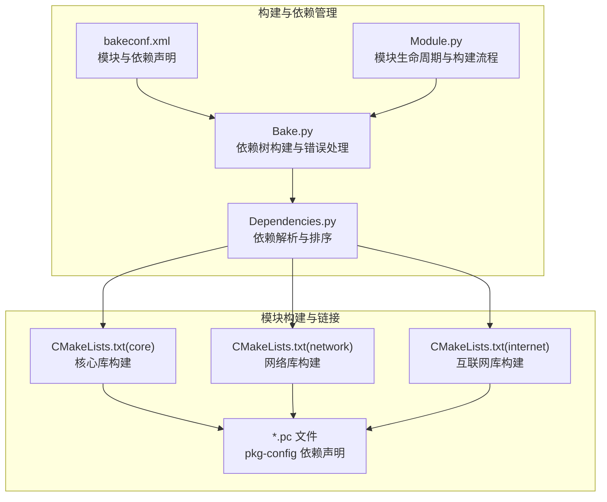
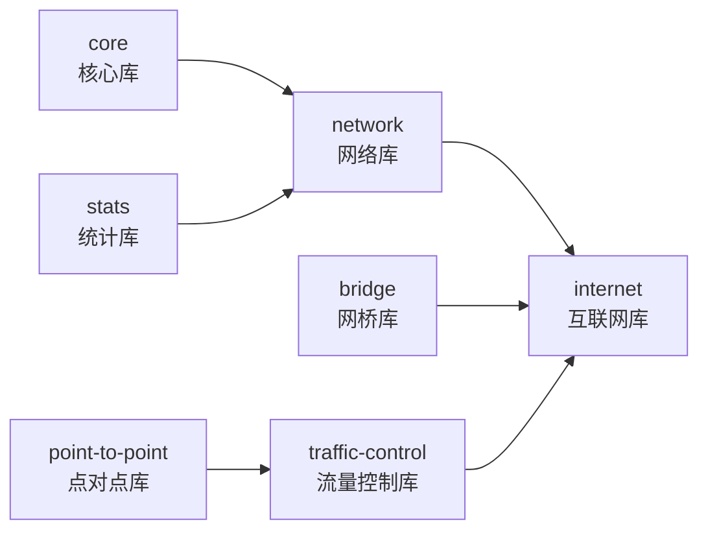
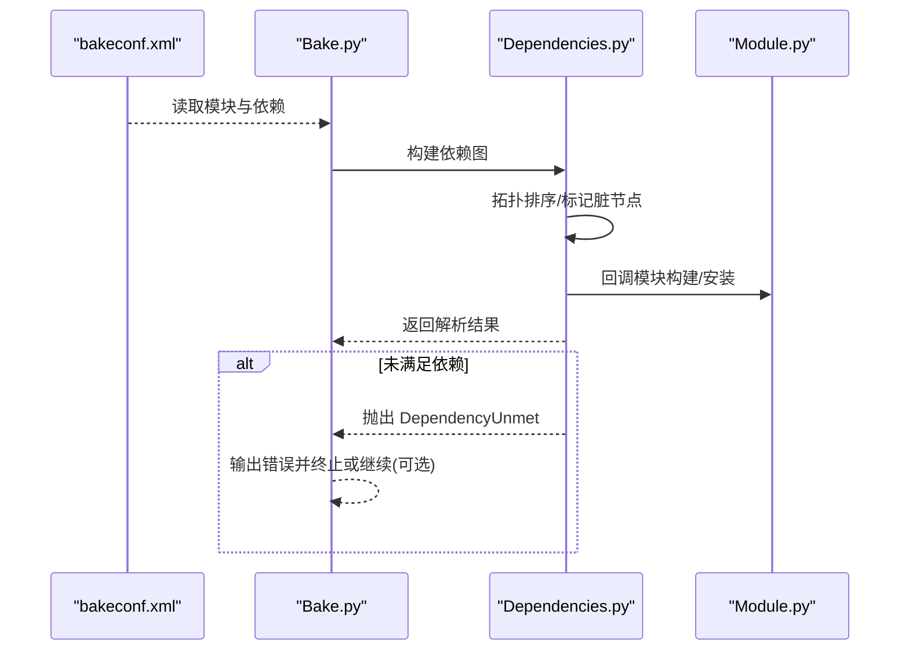
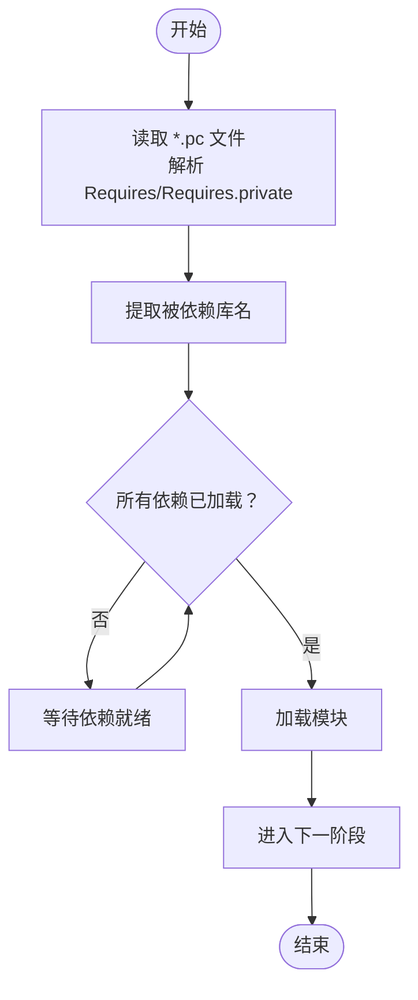
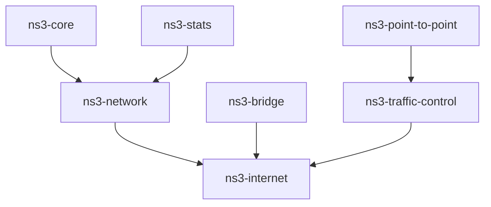

# 模块依赖关系

<cite>
**本文档引用的文件**
- [bakeconf.xml](file://simulator/bake/bakeconf.xml)
- [Dependencies.py](file://simulator/bake/bake/Dependencies.py)
- [Bake.py](file://simulator/bake/bake/Bake.py)
- [Module.py](file://simulator/bake/bake/Module.py)
- [ns3-core.pc](file://simulator/ns-3.39/cmake-cache/pkgconfig/ns3-core.pc)
- [ns3-network.pc](file://simulator/ns-3.39/cmake-cache/pkgconfig/ns3-network.pc)
- [ns3-internet.pc](file://simulator/ns-3.39/cmake-cache/pkgconfig/ns3-internet.pc)
- [ns3-stats.pc](file://simulator/ns-3.39/cmake-cache/pkgconfig/ns3-stats.pc)
- [ns3-bridge.pc](file://simulator/ns-3.39/cmake-cache/pkgconfig/ns3-bridge.pc)
- [ns3-traffic-control.pc](file://simulator/ns-3.39/cmake-cache/pkgconfig/ns3-traffic-control.pc)
- [CMakeLists.txt (core)](file://simulator/ns-3.39/src/core/CMakeLists.txt)
- [CMakeLists.txt (network)](file://simulator/ns-3.39/src/network/CMakeLists.txt)
- [CMakeLists.txt (internet)](file://simulator/ns-3.39/src/internet/CMakeLists.txt)
- [ns__init__.py](file://simulator/ns-3.39/bindings/python/ns__init__.py)
</cite>

## 目录
1. [简介](#简介)
2. [项目结构](#项目结构)
3. [核心组件](#核心组件)
4. [架构总览](#架构总览)
5. [详细组件分析](#详细组件分析)
6. [依赖分析](#依赖分析)
7. [性能考虑](#性能考虑)
8. [故障排查指南](#故障排查指南)
9. [结论](#结论)
10. [附录](#附录)

## 简介
本文件聚焦于 NS-3 的模块依赖关系，系统性梳理核心模块(core)、网络模块(network)与互联网模块(internet)之间的依赖链路，解释依赖解析机制、循环依赖检测与处理策略，并给出模块加载顺序、初始化依赖与运行时依赖的完整视图。同时提供依赖关系图与模块依赖矩阵，总结依赖管理最佳实践与模块解耦策略，帮助读者在扩展或维护 NS-3 模块时做出稳健的设计决策。

## 项目结构
NS-3 的模块化体系由两部分构成：
- 构建与依赖管理：通过 bake 工具与 XML 配置定义模块及其依赖，使用依赖解析器进行拓扑排序与错误检测。
- 模块构建与链接：各模块通过 CMakeLists 组织源码与库依赖，生成 pkg-config 文件描述模块间链接关系。

**图表来源**
- [bakeconf.xml:1-800](file://simulator/bake/bakeconf.xml#L1-L800)
- [Dependencies.py:95-467](file://simulator/bake/bake/Dependencies.py#L95-L467)
- [Bake.py:667-692](file://simulator/bake/bake/Bake.py#L667-L692)
- [Module.py:110-634](file://simulator/bake/bake/Module.py#L110-L634)
- [CMakeLists.txt (core):1-368](file://simulator/ns-3.39/src/core/CMakeLists.txt#L1-L368)
- [CMakeLists.txt (network):1-194](file://simulator/ns-3.39/src/network/CMakeLists.txt#L1-L194)
- [CMakeLists.txt (internet):1-354](file://simulator/ns-3.39/src/internet/CMakeLists.txt#L1-L354)
- [ns3-core.pc:1-14](file://simulator/ns-3.39/cmake-cache/pkgconfig/ns3-core.pc#L1-L14)

**章节来源**
- [bakeconf.xml:1-800](file://simulator/bake/bakeconf.xml#L1-L800)
- [Dependencies.py:95-467](file://simulator/bake/bake/Dependencies.py#L95-L467)
- [Bake.py:667-692](file://simulator/bake/bake/Bake.py#L667-L692)
- [Module.py:110-634](file://simulator/bake/bake/Module.py#L110-L634)
- [CMakeLists.txt (core):1-368](file://simulator/ns-3.39/src/core/CMakeLists.txt#L1-L368)
- [CMakeLists.txt (network):1-194](file://simulator/ns-3.39/src/network/CMakeLists.txt#L1-L194)
- [CMakeLists.txt (internet):1-354](file://simulator/ns-3.39/src/internet/CMakeLists.txt#L1-L354)
- [ns3-core.pc:1-14](file://simulator/ns-3.39/cmake-cache/pkgconfig/ns3-core.pc#L1-L14)

## 核心组件
- 依赖声明与解析
  - bakeconf.xml 声明模块与其依赖（含可选依赖），为解析器提供输入。
  - Dependencies.py 实现依赖收集、拓扑排序、循环依赖检测占位与错误抛出。
  - Bake.py 将配置转换为依赖图，调用解析器并处理未满足依赖。
  - Module.py 定义模块生命周期（下载/更新/构建/清理）与构建流程。

- 模块构建与链接
  - core、network、internet 的 CMakeLists 明确源码与库依赖。
  - *.pc 文件（如 ns3-network.pc、ns3-internet.pc）以 Requires/Requires.private 描述模块间链接关系。

**章节来源**
- [Dependencies.py:28-35](file://simulator/bake/bake/Dependencies.py#L28-L35)
- [Bake.py:667-692](file://simulator/bake/bake/Bake.py#L667-L692)
- [Module.py:110-634](file://simulator/bake/bake/Module.py#L110-L634)
- [CMakeLists.txt (core):1-368](file://simulator/ns-3.39/src/core/CMakeLists.txt#L1-L368)
- [CMakeLists.txt (network):1-194](file://simulator/ns-3.39/src/network/CMakeLists.txt#L1-L194)
- [CMakeLists.txt (internet):1-354](file://simulator/ns-3.39/src/internet/CMakeLists.txt#L1-L354)
- [ns3-network.pc:1-14](file://simulator/ns-3.39/cmake-cache/pkgconfig/ns3-network.pc#L1-L14)
- [ns3-internet.pc:1-14](file://simulator/ns-3.39/cmake-cache/pkgconfig/ns3-internet.pc#L1-L14)

## 架构总览
NS-3 的模块依赖遵循“自底向上”的层次化设计：
- core：提供仿真内核、事件调度、对象系统、日志与随机数等基础能力。
- network：基于 core 提供节点、设备、链路、数据包与队列等网络抽象。
- internet：在 network 之上实现 IP、ICMP、路由、TCP/UDP 等互联网协议栈。

**图表来源**
- [ns3-core.pc:1-14](file://simulator/ns-3.39/cmake-cache/pkgconfig/ns3-core.pc#L1-L14)
- [ns3-network.pc:1-14](file://simulator/ns-3.39/cmake-cache/pkgconfig/ns3-network.pc#L1-L14)
- [ns3-internet.pc:1-14](file://simulator/ns-3.39/cmake-cache/pkgconfig/ns3-internet.pc#L1-L14)
- [ns3-stats.pc:1-14](file://simulator/ns-3.39/cmake-cache/pkgconfig/ns3-stats.pc#L1-L14)
- [ns3-bridge.pc:1-14](file://simulator/ns-3.39/cmake-cache/pkgconfig/ns3-bridge.pc#L1-L14)
- [ns3-traffic-control.pc:1-14](file://simulator/ns-3.39/cmake-cache/pkgconfig/ns3-traffic-control.pc#L1-L14)
- [CMakeLists.txt (network):173-194](file://simulator/ns-3.39/src/network/CMakeLists.txt#L173-L194)
- [CMakeLists.txt (internet):342-354](file://simulator/ns-3.39/src/internet/CMakeLists.txt#L342-L354)

## 详细组件分析

### 依赖解析与循环依赖检测
- 解析流程
  - bakeconf.xml 中的模块依赖被读取并映射到目标与源列表。
  - 依赖解析器执行拓扑排序，优先处理无依赖的“叶子”模块，逐步提升优先级。
  - 支持回调式处理，允许在解析过程中动态追加依赖；若新增依赖导致图变化，解析器会重新迭代直至稳定。

- 循环依赖检测与处理
  - 代码中保留了 CycleDetected 异常类型与相关注释，表明循环依赖检测是预期功能，但当前实现未完全启用。
  - 对于未满足依赖，抛出 DependencyUnmet 并携带失败原因（例如“not available”或“failed”），非可选依赖直接终止，可选依赖发出警告并继续。

**图表来源**
- [bakeconf.xml:1-800](file://simulator/bake/bakeconf.xml#L1-L800)
- [Dependencies.py:175-467](file://simulator/bake/bake/Dependencies.py#L175-L467)
- [Bake.py:667-692](file://simulator/bake/bake/Bake.py#L667-L692)
- [Module.py:417-517](file://simulator/bake/bake/Module.py#L417-L517)

**章节来源**
- [Dependencies.py:28-35](file://simulator/bake/bake/Dependencies.py#L28-L35)
- [Dependencies.py:175-467](file://simulator/bake/bake/Dependencies.py#L175-L467)
- [Bake.py:667-692](file://simulator/bake/bake/Bake.py#L667-L692)

### 模块加载顺序与初始化依赖
- CMake 层面
  - network 依赖 core 与 stats；internet 依赖 network、core、bridge 与 traffic-control。
  - 这些依赖在 CMakeLists 中明确列出，确保编译顺序与链接顺序正确。

- Python 绑定层面
  - Python 加载器根据库文件的链接关系提取依赖，按“可加载模块集合”进行拓扑排序，保证先加载被依赖的模块。

**图表来源**
- [ns3-network.pc:1-14](file://simulator/ns-3.39/cmake-cache/pkgconfig/ns3-network.pc#L1-L14)
- [ns3-internet.pc:1-14](file://simulator/ns-3.39/cmake-cache/pkgconfig/ns3-internet.pc#L1-L14)
- [ns__init__.py:373-423](file://simulator/ns-3.39/bindings/python/ns__init__.py#L373-L423)

**章节来源**
- [CMakeLists.txt (network):173-194](file://simulator/ns-3.39/src/network/CMakeLists.txt#L173-L194)
- [CMakeLists.txt (internet):342-354](file://simulator/ns-3.39/src/internet/CMakeLists.txt#L342-L354)
- [ns__init__.py:373-423](file://simulator/ns-3.39/bindings/python/ns__init__.py#L373-L423)

### 运行时依赖
- 运行时依赖主要体现在库文件的链接关系上：当某模块被加载时，其 pkg-config 文件声明的 Requires/Requires.private 决定了需要先加载的其他模块库。
- Python 绑定层进一步验证并排序这些依赖，避免运行时符号未解析问题。

**章节来源**
- [ns3-network.pc:1-14](file://simulator/ns-3.39/cmake-cache/pkgconfig/ns3-network.pc#L1-L14)
- [ns3-internet.pc:1-14](file://simulator/ns-3.39/cmake-cache/pkgconfig/ns3-internet.pc#L1-L14)
- [ns__init__.py:373-423](file://simulator/ns-3.39/bindings/python/ns__init__.py#L373-L423)

## 依赖分析

### 模块依赖矩阵（基于 pkg-config）
以下矩阵展示模块间的直接依赖关系（来自 *.pc 文件的 Requires/Requires.private 字段）：

- ns3-network
  - 依赖：ns3-core、ns3-stats
- ns3-internet
  - 依赖：ns3-network、ns3-core、ns3-bridge、ns3-traffic-control
- ns3-traffic-control
  - 依赖：ns3-network、ns3-point-to-point、ns3-core

**图表来源**
- [ns3-network.pc:1-14](file://simulator/ns-3.39/cmake-cache/pkgconfig/ns3-network.pc#L1-L14)
- [ns3-internet.pc:1-14](file://simulator/ns-3.39/cmake-cache/pkgconfig/ns3-internet.pc#L1-L14)
- [ns3-traffic-control.pc:1-14](file://simulator/ns-3.39/cmake-cache/pkgconfig/ns3-traffic-control.pc#L1-L14)
- [ns3-bridge.pc:1-14](file://simulator/ns-3.39/cmake-cache/pkgconfig/ns3-bridge.pc#L1-L14)

### 从 XML 到构建的依赖映射
- XML 中的模块依赖（如 dce-*、iproute* 等）在 bakeconf.xml 中声明，Bake.py 负责将其转换为依赖图并交由 Dependencies.py 解析。
- 可选依赖通过 optional 标记区分，解析器在遇到未满足依赖时采取不同策略。

**章节来源**
- [bakeconf.xml:1-800](file://simulator/bake/bakeconf.xml#L1-L800)
- [Bake.py:667-692](file://simulator/bake/bake/Bake.py#L667-L692)
- [Dependencies.py:46-54](file://simulator/bake/bake/Dependencies.py#L46-L54)

## 性能考虑
- 依赖解析的复杂度
  - 拓扑排序的时间复杂度近似 O(V+E)，其中 V 为模块数，E 为依赖边数。对于 NS-3 的模块规模，该复杂度可接受。
  - 当存在大量可选依赖时，解析器可能多次迭代，建议在配置中尽量减少不必要的可选链路。

- 构建与链接优化
  - 在 CMakeLists 中显式声明依赖，有助于并行构建工具（如 Ninja）正确调度任务。
  - 合理拆分模块边界，避免跨模块的隐式耦合，降低链接时间与二进制体积。

[本节为通用指导，无需特定文件来源]

## 故障排查指南
- 未满足依赖
  - 现象：解析阶段抛出 DependencyUnmet，提示“not available”或“failed”。
  - 处理：检查模块是否在配置中启用、系统依赖是否满足、可选依赖是否被忽略。

- 循环依赖
  - 现象：当前实现保留了检测占位，实际报错路径需完善。
  - 处理：人工审查依赖图，消除环路；必要时引入中间层模块解耦。

- Python 加载失败
  - 现象：运行时符号未解析或模块加载顺序不当。
  - 处理：依据 ns__init__.py 的排序逻辑，确认所有被依赖模块已加载。

**章节来源**
- [Dependencies.py:46-54](file://simulator/bake/bake/Dependencies.py#L46-L54)
- [Dependencies.py:390-418](file://simulator/bake/bake/Dependencies.py#L390-L418)
- [Bake.py:667-692](file://simulator/bake/bake/Bake.py#L667-L692)
- [ns__init__.py:373-423](file://simulator/ns-3.39/bindings/python/ns__init__.py#L373-L423)

## 结论
NS-3 的模块依赖体系以 core 为核心、network 为桥梁、internet 为应用层，形成清晰的层次化依赖。构建与依赖管理通过 bakeconf.xml、Dependencies.py 与 Bake.py 协同完成，模块构建与链接则由 CMakeLists 与 pkg-config 共同保障。尽管循环依赖检测尚未完全实现，但现有机制已能有效处理大多数场景下的依赖解析与错误报告。遵循本文的最佳实践与解耦策略，可在扩展新模块时保持系统的稳定性与可维护性。

[本节为总结性内容，无需特定文件来源]

## 附录

### 依赖管理最佳实践
- 明确模块边界：每个模块职责单一，避免跨模块强耦合。
- 优先使用显式依赖：在 CMakeLists 与 pkg-config 中明确列出依赖，便于静态分析与自动化工具处理。
- 控制可选依赖数量：仅在确实可选且不影响核心功能时使用，减少解析复杂度。
- 分层设计：核心模块不依赖高层模块，网络模块不依赖互联网模块，避免环路。

### 模块解耦策略
- 接口隔离：通过抽象接口与工厂模式降低模块间直接依赖。
- 事件驱动：使用事件总线或回调机制替代同步调用链。
- 配置注入：通过配置文件或环境变量传递依赖关系，减少硬编码。

[本节为通用指导，无需特定文件来源]