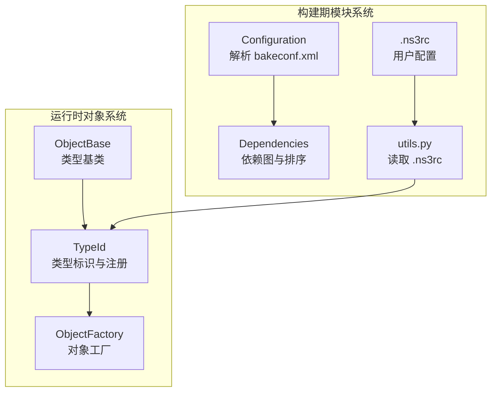
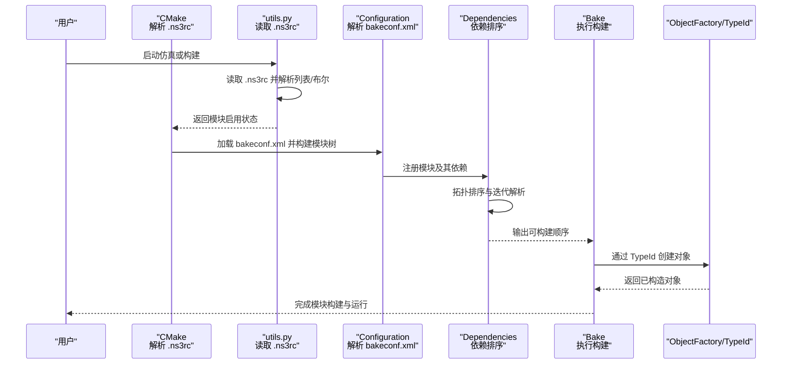
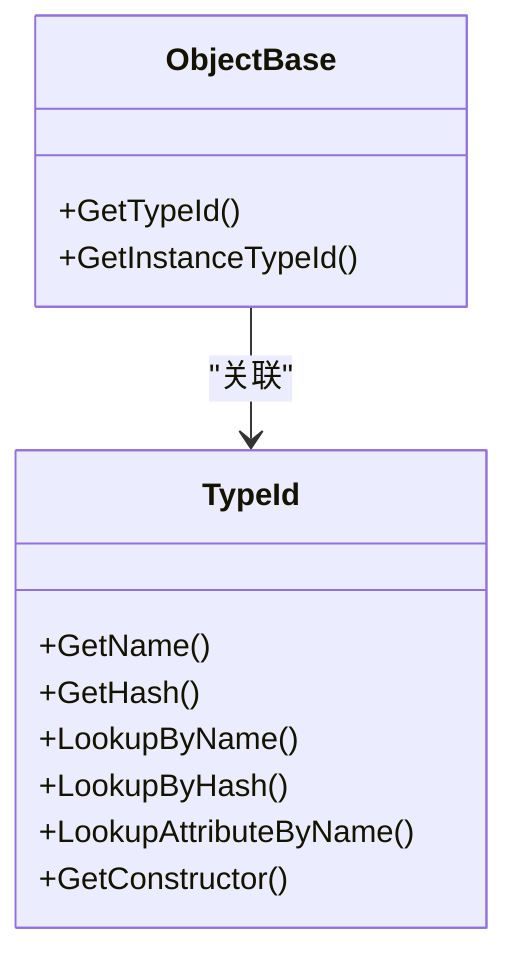
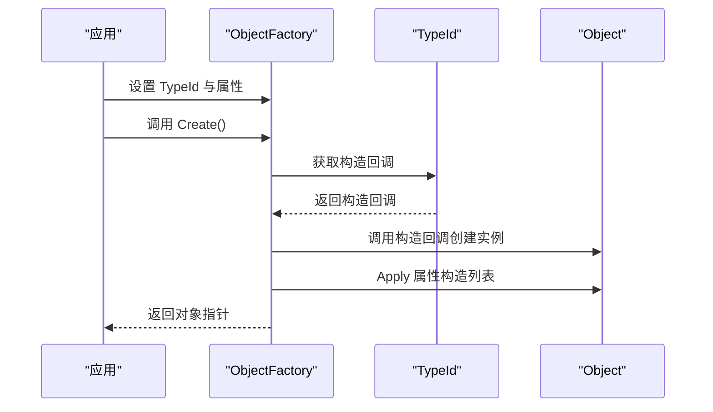
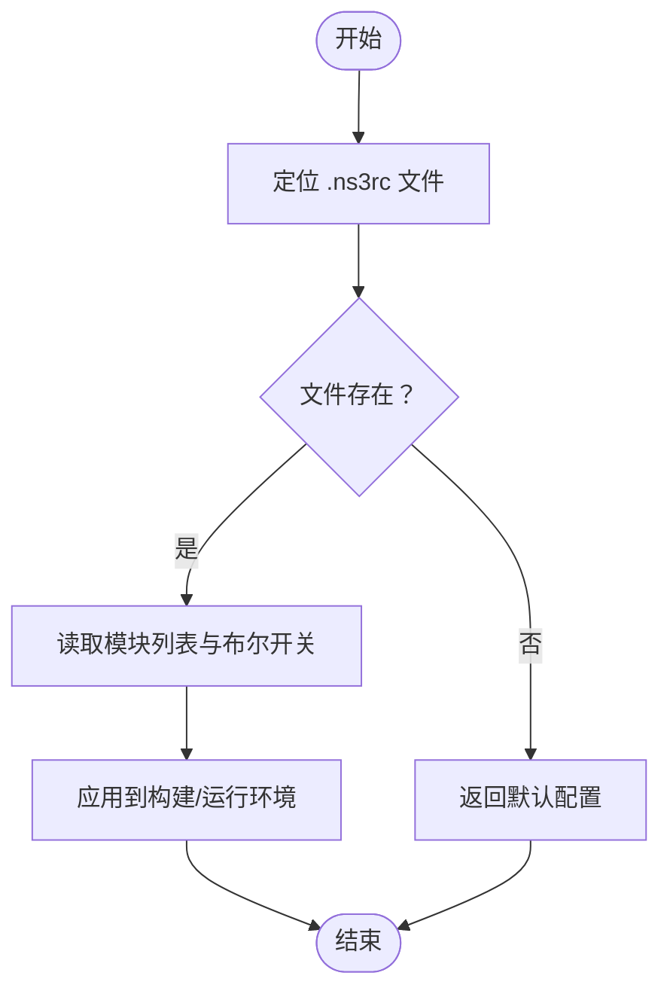
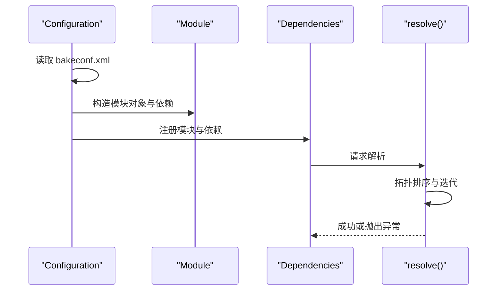
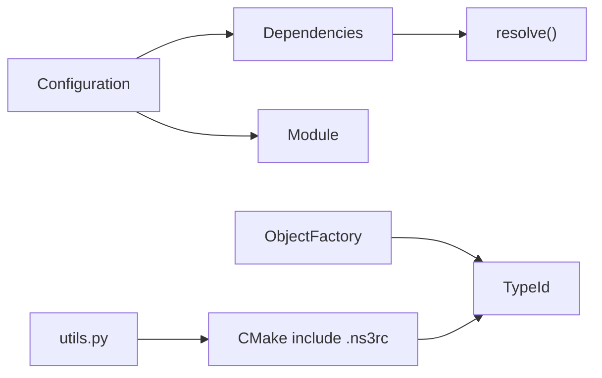

# 模块加载机制

<cite>
**本文引用的文件**
- [object-factory.cc](file://simulator/ns-3.39/src/core/model/object-factory.cc)
- [object-factory.h](file://simulator/ns-3.39/src/core/model/object-factory.h)
- [object-base.h](file://simulator/ns-3.39/src/core/model/object-base.h)
- [type-id.cc](file://simulator/ns-3.39/src/core/model/type-id.cc)
- [.ns3rc](file://simulator/ns-3.39/utils/.ns3rc)
- [utils.py](file://simulator/ns-3.39/utils.py)
- [macros-and-definitions.cmake](file://simulator/ns-3.39/build-support/macros-and-definitions.cmake)
- [Configuration.py](file://simulator/bake/bake/Configuration.py)
- [Dependencies.py](file://simulator/bake/bake/Dependencies.py)
- [Module.py](file://simulator/bake/bake/Module.py)
- [Bake.py](file://simulator/bake/bake/Bake.py)
</cite>

## 目录
1. [引言](#引言)
2. [项目结构](#项目结构)
3. [核心组件](#核心组件)
4. [架构总览](#架构总览)
5. [详细组件分析](#详细组件分析)
6. [依赖关系分析](#依赖关系分析)
7. [性能考量](#性能考量)
8. [故障排查指南](#故障排查指南)
9. [结论](#结论)
10. [附录](#附录)

## 引言
本文件系统性阐述 NS-3 的模块加载机制，覆盖以下关键主题：
- 模块动态加载：从模块发现、配置解析到加载顺序控制的完整流程
- 模块注册与类型系统：基于 TypeId 的对象注册、模板实例化与类型查找
- 对象工厂模式：通过 ObjectFactory 实现对象构造与属性注入
- 配置文件（.ns3rc）：作用、语法与解析策略
- 模块构建与依赖管理：Bake 构建工具中的模块元数据、依赖解析与排序
- 流程图与序列图：模块加载与配置解析的关键时序
- 开发、测试与调试指南：最佳实践与常见问题定位

## 项目结构
NS-3 的模块加载涉及两条主线：
- 运行时对象系统：类型注册、工厂创建、属性设置
- 构建期模块系统：配置文件解析、模块元数据、依赖图构建与拓扑排序

图表来源
- [object-base.h:172-200](file://simulator/ns-3.39/src/core/model/object-base.h#L172-L200)
- [type-id.cc:295-452](file://simulator/ns-3.39/src/core/model/type-id.cc#L295-L452)
- [object-factory.cc:36-104](file://simulator/ns-3.39/src/core/model/object-factory.cc#L36-L104)
- [Configuration.py:314-338](file://simulator/bake/bake/Configuration.py#L314-L338)
- [Dependencies.py:95-148](file://simulator/bake/bake/Dependencies.py#L95-L148)
- [.ns3rc:1-21](file://simulator/ns-3.39/utils/.ns3rc#L1-L21)
- [utils.py:89-124](file://simulator/ns-3.39/utils.py#L89-L124)

章节来源
- [object-base.h:172-200](file://simulator/ns-3.39/src/core/model/object-base.h#L172-L200)
- [type-id.cc:295-452](file://simulator/ns-3.39/src/core/model/type-id.cc#L295-L452)
- [object-factory.cc:36-104](file://simulator/ns-3.39/src/core/model/object-factory.cc#L36-L104)
- [Configuration.py:314-338](file://simulator/bake/bake/Configuration.py#L314-L338)
- [Dependencies.py:95-148](file://simulator/bake/bake/Dependencies.py#L95-L148)
- [.ns3rc:1-21](file://simulator/ns-3.39/utils/.ns3rc#L1-L21)
- [utils.py:89-124](file://simulator/ns-3.39/utils.py#L89-L124)

## 核心组件
- 类型系统与注册
  - 每个派生自 ObjectBase 的类通过宏进行类型注册，确保 TypeId 被登记、大小与父类链被正确设置
  - TypeId 提供名称/哈希查找、属性枚举、构造回调等能力
- 对象工厂
  - ObjectFactory 保存目标 TypeId 与构造期属性列表，支持序列化/反序列化工厂配置字符串
  - Create() 基于 TypeId 的构造回调创建对象，并在 Construct() 中应用属性
- 配置系统
  - .ns3rc 用于声明启用/禁用模块、示例与测试开关
  - utils.py 提供读取函数，解析列表与布尔变量
  - CMake 在编译期根据 .ns3rc 决定启用哪些模块
- 模块系统（Bake）
  - Configuration 解析 bakeconf.xml，构建模块树与依赖关系
  - Dependencies 维护依赖图，执行拓扑排序与迭代解析

章节来源
- [object-base.h:46-57](file://simulator/ns-3.39/src/core/model/object-base.h#L46-L57)
- [type-id.cc:295-452](file://simulator/ns-3.39/src/core/model/type-id.cc#L295-L452)
- [object-factory.cc:42-104](file://simulator/ns-3.39/src/core/model/object-factory.cc#L42-L104)
- [.ns3rc:1-21](file://simulator/ns-3.39/utils/.ns3rc#L1-L21)
- [utils.py:89-124](file://simulator/ns-3.39/utils.py#L89-L124)
- [macros-and-definitions.cmake:2053-2067](file://simulator/ns-3.39/build-support/macros-and-definitions.cmake#L2053-L2067)
- [Configuration.py:314-338](file://simulator/bake/bake/Configuration.py#L314-L338)
- [Dependencies.py:175-297](file://simulator/bake/bake/Dependencies.py#L175-L297)

## 架构总览
下图展示从用户配置到模块构建与对象创建的整体流程。

图表来源
- [.ns3rc:1-21](file://simulator/ns-3.39/utils/.ns3rc#L1-L21)
- [utils.py:89-124](file://simulator/ns-3.39/utils.py#L89-L124)
- [macros-and-definitions.cmake:2053-2067](file://simulator/ns-3.39/build-support/macros-and-definitions.cmake#L2053-L2067)
- [Configuration.py:314-338](file://simulator/bake/bake/Configuration.py#L314-L338)
- [Dependencies.py:175-297](file://simulator/bake/bake/Dependencies.py#L175-L297)
- [object-factory.cc:92-104](file://simulator/ns-3.39/src/core/model/object-factory.cc#L92-L104)

## 详细组件分析

### 组件一：类型系统与对象注册
- 关键点
  - NS_OBJECT_ENSURE_REGISTERED 宏在静态初始化阶段完成类型注册，确保每个类的 TypeId 已登记且具备父类链
  - TypeId 管理器维护名称/哈希映射、属性集合、构造回调等，支持按名/哈希查找与继承链遍历
- 复杂度
  - 查找：按名/哈希查找均为常数级（内部使用哈希表）
  - 属性枚举：沿继承链向上遍历，复杂度 O(h)，h 为继承深度
- 错误处理
  - 若未注册类型或属性无效，构造阶段会触发致命错误

图表来源
- [object-base.h:172-200](file://simulator/ns-3.39/src/core/model/object-base.h#L172-L200)
- [type-id.cc:295-452](file://simulator/ns-3.39/src/core/model/type-id.cc#L295-L452)

章节来源
- [object-base.h:46-57](file://simulator/ns-3.39/src/core/model/object-base.h#L46-L57)
- [type-id.cc:295-452](file://simulator/ns-3.39/src/core/model/type-id.cc#L295-L452)

### 组件二：对象工厂与对象创建
- 关键点
  - ObjectFactory 保存目标 TypeId 与属性构造列表；支持从字符串流反序列化配置
  - Create() 调用 TypeId 的构造回调创建对象，并在 Construct() 应用属性
- 复杂度
  - 属性设置：O(n)，n 为构造参数数量
- 错误处理
  - 属性名不存在或值不合法时，构造阶段会报错

图表来源
- [object-factory.cc:92-104](file://simulator/ns-3.39/src/core/model/object-factory.cc#L92-L104)
- [object-factory.cc:125-197](file://simulator/ns-3.39/src/core/model/object-factory.cc#L125-L197)

章节来源
- [object-factory.cc:42-104](file://simulator/ns-3.39/src/core/model/object-factory.cc#L42-L104)
- [object-factory.cc:125-197](file://simulator/ns-3.39/src/core/model/object-factory.cc#L125-L197)
- [object-factory.h:80-175](file://simulator/ns-3.39/src/core/model/object-factory.h#L80-L175)

### 组件三：模块配置文件与解析
- .ns3rc 作用
  - 声明启用/禁用模块列表、是否启用示例与测试、覆盖其他设置
- 解析流程
  - utils.py 读取当前目录或用户主目录下的 .ns3rc，解析模块列表与布尔开关
  - CMake 在编译期 include .ns3rc 或调用解析函数，决定启用哪些模块
- 语法要点
  - 列表变量：modules_enabled、ns3rc_enabled_modules、ns3rc_disabled_modules
  - 布尔变量：ns3rc_examples_enabled、ns3rc_tests_enabled
  - 可覆盖全局设置：如 NS3_LOG

图表来源
- [utils.py:89-124](file://simulator/ns-3.39/utils.py#L89-L124)
- [macros-and-definitions.cmake:2053-2067](file://simulator/ns-3.39/build-support/macros-and-definitions.cmake#L2053-L2067)
- [.ns3rc:1-21](file://simulator/ns-3.39/utils/.ns3rc#L1-L21)

章节来源
- [.ns3rc:1-21](file://simulator/ns-3.39/utils/.ns3rc#L1-L21)
- [utils.py:89-124](file://simulator/ns-3.39/utils.py#L89-L124)
- [macros-and-definitions.cmake:2053-2067](file://simulator/ns-3.39/build-support/macros-and-definitions.cmake#L2053-L2067)

### 组件四：模块发现与依赖解析（Bake）
- 模块发现
  - Configuration 解析 bakeconf.xml，构建模块对象树，记录 source/build/depends_on
- 依赖解析
  - Dependencies 维护依赖图，add_dep/add_dst 记录源/目标与可选依赖标记
  - resolve 执行拓扑排序，迭代解析，遇到失败抛出 DependencyUnmet
- 加载顺序控制
  - _sort 基于依赖深度计算优先级，先解决叶子节点，再逐层上推

图表来源
- [Configuration.py:314-338](file://simulator/bake/bake/Configuration.py#L314-L338)
- [Dependencies.py:175-297](file://simulator/bake/bake/Dependencies.py#L175-L297)
- [Bake.py:667-692](file://simulator/bake/bake/Bake.py#L667-L692)

章节来源
- [Configuration.py:314-338](file://simulator/bake/bake/Configuration.py#L314-L338)
- [Dependencies.py:95-148](file://simulator/bake/bake/Dependencies.py#L95-L148)
- [Dependencies.py:175-297](file://simulator/bake/bake/Dependencies.py#L175-L297)
- [Bake.py:667-692](file://simulator/bake/bake/Bake.py#L667-L692)

## 依赖关系分析
- 组件耦合
  - ObjectFactory 依赖 TypeId 完成对象创建与属性注入
  - Configuration/Dependencies 依赖模块元数据定义模块间依赖
  - utils.py 与 CMake 共同驱动 .ns3rc 的生效范围
- 外部依赖
  - XML 解析库（ElementTree）用于 bakeconf.xml
  - CMake include 机制用于 .ns3rc 的编译期注入
- 循环依赖检测
  - Dependencies 提供依赖链追踪与异常抛出，避免死锁

图表来源
- [object-factory.cc:92-104](file://simulator/ns-3.39/src/core/model/object-factory.cc#L92-L104)
- [type-id.cc:295-452](file://simulator/ns-3.39/src/core/model/type-id.cc#L295-L452)
- [Configuration.py:314-338](file://simulator/bake/bake/Configuration.py#L314-L338)
- [Dependencies.py:175-297](file://simulator/bake/bake/Dependencies.py#L175-L297)
- [utils.py:89-124](file://simulator/ns-3.39/utils.py#L89-L124)
- [macros-and-definitions.cmake:2053-2067](file://simulator/ns-3.39/build-support/macros-and-definitions.cmake#L2053-L2067)

章节来源
- [object-factory.cc:92-104](file://simulator/ns-3.39/src/core/model/object-factory.cc#L92-L104)
- [type-id.cc:295-452](file://simulator/ns-3.39/src/core/model/type-id.cc#L295-L452)
- [Configuration.py:314-338](file://simulator/bake/bake/Configuration.py#L314-L338)
- [Dependencies.py:175-297](file://simulator/bake/bake/Dependencies.py#L175-L297)
- [utils.py:89-124](file://simulator/ns-3.39/utils.py#L89-L124)
- [macros-and-definitions.cmake:2053-2067](file://simulator/ns-3.39/build-support/macros-and-definitions.cmake#L2053-L2067)

## 性能考量
- 类型查找
  - TypeId 名称/哈希查找为 O(1)，属性枚举沿继承链向上遍历，建议合理设计继承层次以降低开销
- 工厂配置解析
  - 字符串解析采用线性扫描与子串分割，整体 O(n) 与参数数量线性相关
- 依赖解析
  - 拓扑排序与迭代解析的时间复杂度近似 O(V+E)，其中 V 为模块数，E 为依赖边数；可选并行版本预留接口但当前实现为串行

## 故障排查指南
- .ns3rc 未生效
  - 确认文件路径：当前目录或用户主目录
  - 检查变量名与语法：列表需闭合，布尔值为 ON/OFF
  - CMake 是否 include 了 .ns3rc
- 依赖解析失败
  - 检查 bakeconf.xml 中模块名称拼写与 depends_on 定义
  - 关注 DependencyUnmet 异常，定位失败模块与原因
- 对象创建失败
  - 确认 TypeId 已注册，属性名与类型匹配
  - 检查 ObjectFactory 的配置字符串格式

章节来源
- [utils.py:89-124](file://simulator/ns-3.39/utils.py#L89-L124)
- [macros-and-definitions.cmake:2053-2067](file://simulator/ns-3.39/build-support/macros-and-definitions.cmake#L2053-L2067)
- [Dependencies.py:389-418](file://simulator/bake/bake/Dependencies.py#L389-L418)
- [object-factory.cc:62-83](file://simulator/ns-3.39/src/core/model/object-factory.cc#L62-L83)

## 结论
NS-3 的模块加载机制通过“构建期配置 + 运行时类型系统”的组合实现：
- .ns3rc 与 CMake 协作决定启用哪些模块
- Configuration/Dependencies 将模块与依赖关系结构化，保证可重复、可验证的构建顺序
- TypeId/ObjectFactory 提供稳定的对象创建与属性注入能力，支撑仿真运行时的动态装配

该机制既满足大规模模块化扩展的需求，又通过严格的类型检查与依赖解析保障稳定性与可维护性。

## 附录
- 开发建议
  - 新模块应提供清晰的 TypeId 与属性定义，遵循 NS_OBJECT_ENSURE_REGISTERED 宏约定
  - 在 bakeconf.xml 中明确模块依赖，尽量减少可选依赖的使用
- 测试建议
  - 使用单元测试验证对象工厂配置字符串的解析与对象创建
  - 使用集成测试验证模块启用/禁用对仿真行为的影响
- 调试建议
  - 启用详细日志输出，关注 TypeId 查找与属性设置阶段的异常
  - 使用 CMake 的 verbose 模式查看 .ns3rc 生效情况