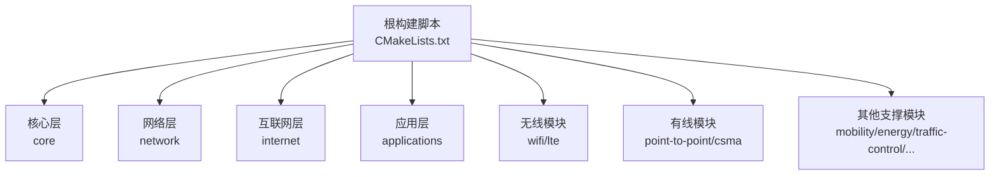
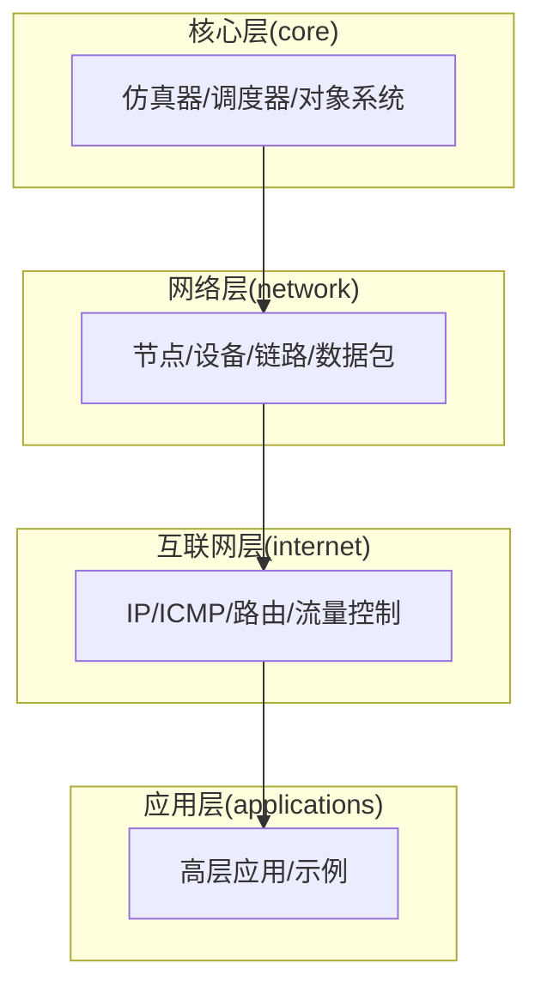
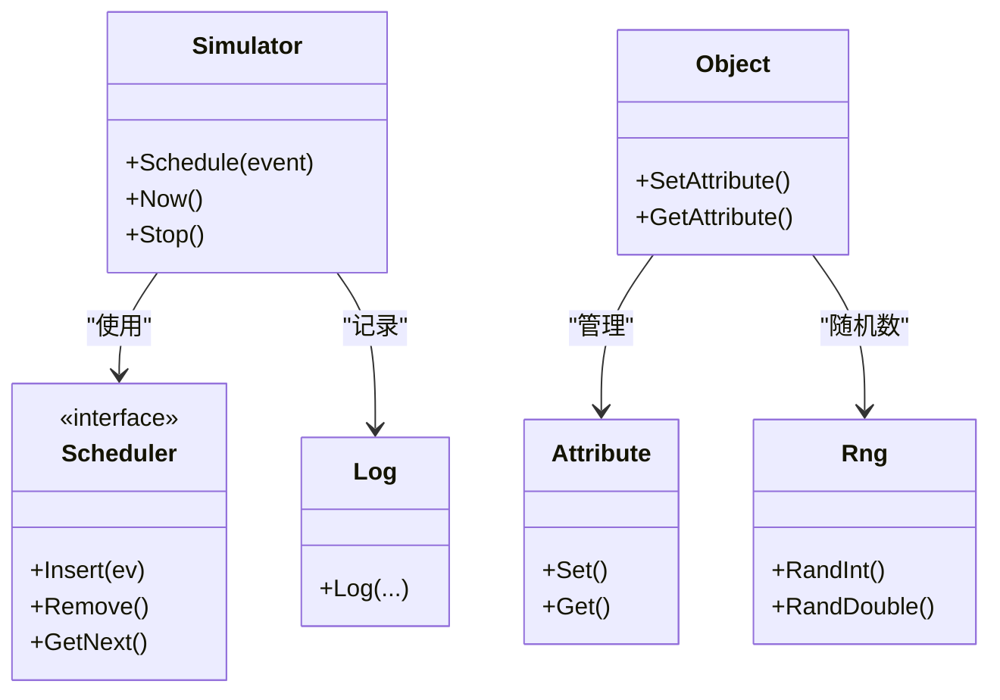
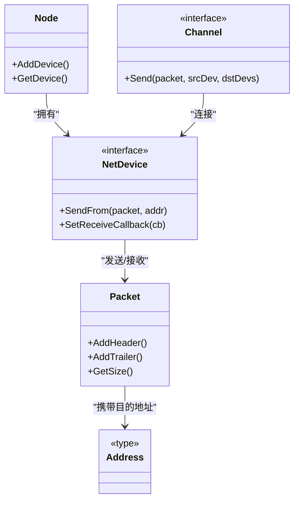
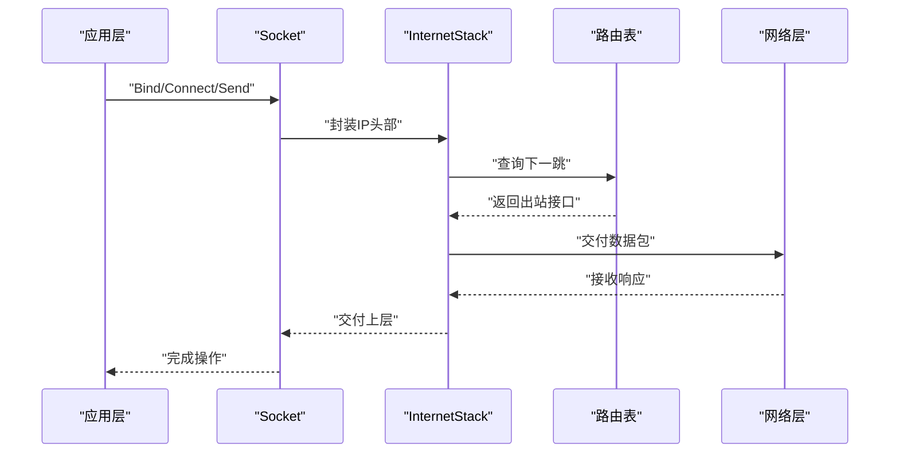
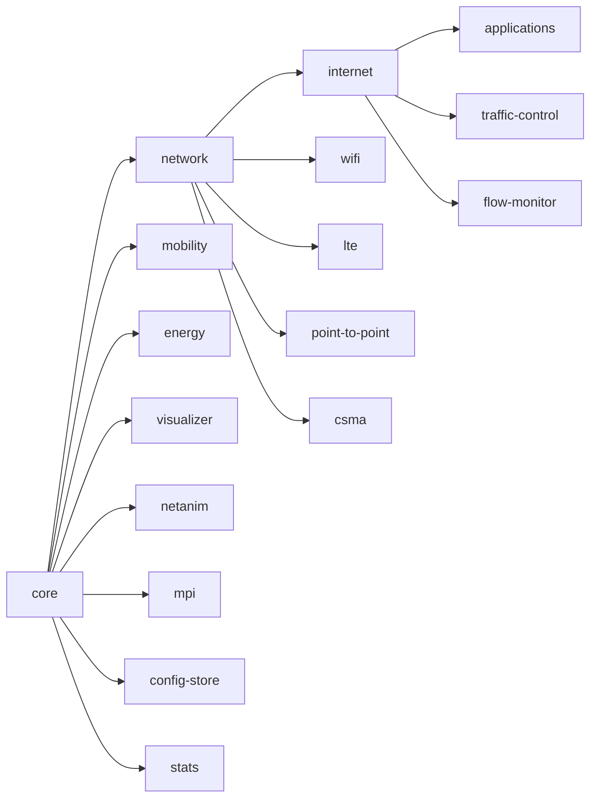
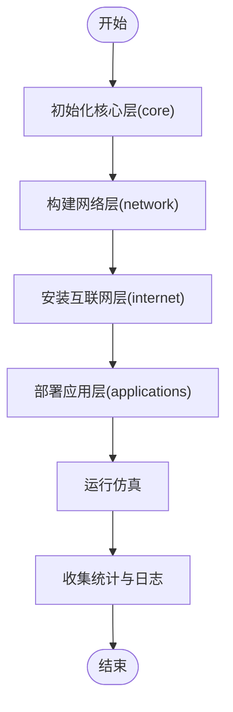

# 模块层次结构

<cite>
**本文引用的文件**
- [CMakeLists.txt](file://simulator/ns-3.39/CMakeLists.txt)
- [core/CMakeLists.txt](file://simulator/ns-3.39/src/core/CMakeLists.txt)
- [network/CMakeLists.txt](file://simulator/ns-3.39/src/network/CMakeLists.txt)
- [internet/CMakeLists.txt](file://simulator/ns-3.39/src/internet/CMakeLists.txt)
- [applications/CMakeLists.txt](file://simulator/ns-3.39/src/applications/CMakeLists.txt)
- [lte/CMakeLists.txt](file://simulator/ns-3.39/src/lte/CMakeLists.txt)
- [wifi/CMakeLists.txt](file://simulator/ns-3.39/src/wifi/CMakeLists.txt)
- [point-to-point/CMakeLists.txt](file://simulator/ns-3.39/src/point-to-point/CMakeLists.txt)
- [csma/CMakeLists.txt](file://simulator/ns-3.39/src/csma/CMakeLists.txt)
- [mobility/CMakeLists.txt](file://simulator/ns-3.39/src/mobility/CMakeLists.txt)
- [energy/CMakeLists.txt](file://simulator/ns-3.39/src/energy/CMakeLists.txt)
- [traffic-control/CMakeLists.txt](file://simulator/ns-3.39/src/traffic-control/CMakeLists.txt)
- [flow-monitor/CMakeLists.txt](file://simulator/ns-3.39/src/flow-monitor/CMakeLists.txt)
- [visualizer/CMakeLists.txt](file://simulator/ns-3.39/src/visualizer/CMakeLists.txt)
- [netanim/CMakeLists.txt](file://simulator/ns-3.39/src/netanim/CMakeLists.txt)
- [mpi/CMakeLists.txt](file://simulator/ns-3.39/src/mpi/CMakeLists.txt)
- [config-store/CMakeLists.txt](file://simulator/ns-3.39/src/config-store/CMakeLists.txt)
- [stats/CMakeLists.txt](file://simulator/ns-3.39/src/stats/CMakeLists.txt)
</cite>

## 目录
1. [引言](#引言)
2. [项目结构](#项目结构)
3. [核心组件](#核心组件)
4. [架构总览](#架构总览)
5. [详细组件分析](#详细组件分析)
6. [依赖分析](#依赖分析)
7. [性能考虑](#性能考虑)
8. [故障排查指南](#故障排查指南)
9. [结论](#结论)
10. [附录](#附录)

## 引言
本文件系统性梳理 NS-3 的模块层次结构与设计原则，聚焦于核心层（core）、网络层（network）、互联网层（internet）以及应用层（applications）等主要层次，阐明各层职责、功能边界与相互依赖关系，并给出层次调整与扩展的最佳实践与流程图示。

## 项目结构
NS-3 采用“按模块分层”的组织方式：顶层通过构建脚本统一管理模块启用/禁用与编译选项；每个子模块在独立目录下维护其模型、助手、示例与测试代码。核心层提供仿真内核与通用基础设施；网络层负责节点、设备、链路与数据包抽象；互联网层在 IP 协议族之上提供路由、ICMP、流量控制等能力；应用层提供高层协议与应用示例。

图表来源
- [CMakeLists.txt:140-156](file://simulator/ns-3.39/CMakeLists.txt#L140-L156)
- [core/CMakeLists.txt:360-368](file://simulator/ns-3.39/src/core/CMakeLists.txt#L360-L368)
- [network/CMakeLists.txt:173-194](file://simulator/ns-3.39/src/network/CMakeLists.txt#L173-L194)
- [internet/CMakeLists.txt](file://simulator/ns-3.39/src/internet/CMakeLists.txt)
- [applications/CMakeLists.txt](file://simulator/ns-3.39/src/applications/CMakeLists.txt)

章节来源
- [CMakeLists.txt:140-156](file://simulator/ns-3.39/CMakeLists.txt#L140-L156)

## 核心组件
- 核心层（core）
  - 职责：提供仿真调度器、事件系统、对象系统、属性系统、日志、随机数、时间与度量等通用能力。
  - 关键构件：仿真器、调度器、对象工厂、配置、类型系统、随机变量、计时器与看门狗等。
  - 依赖：无上层依赖，是所有模块的基础。
  
- 网络层（network）
  - 职责：抽象节点、设备、链路、数据包、地址与套接字，提供队列、错误模型、抓包与跟踪工具。
  - 关键构件：节点、网卡、通道、数据包、标签、队列、地址工具集等。
  - 依赖：依赖 core 提供的对象与调度能力。
  
- 互联网层（internet）
  - 职责：在 IP 基础上提供路由、ICMP、IPv6 支持、流量控制接口、统计与监控等。
  - 关键构件：IP 路由、ICMP、IPv6、流量控制、流监控、应用辅助等。
  - 依赖：依赖 network 与 core。
  
- 应用层（applications）
  - 职责：提供高层应用协议与示例（如 TCP/UDP、HTTP、视频流等），通过 helpers 快速装配拓扑与场景。
  - 关键构件：应用容器、Socket 工具、示例应用等。
  - 依赖：依赖 internet 与 network。

章节来源
- [core/CMakeLists.txt:142-214](file://simulator/ns-3.39/src/core/CMakeLists.txt#L142-L214)
- [network/CMakeLists.txt:1-82](file://simulator/ns-3.39/src/network/CMakeLists.txt#L1-L82)
- [internet/CMakeLists.txt](file://simulator/ns-3.39/src/internet/CMakeLists.txt)
- [applications/CMakeLists.txt](file://simulator/ns-3.39/src/applications/CMakeLists.txt)

## 架构总览
NS-3 的模块层次遵循“自底向上”的依赖关系：core 为最底层基础，network 在其上提供网络抽象，internet 在网络之上实现 IP 与相关服务，applications 在最上层使用高层协议与应用。

图表来源
- [core/CMakeLists.txt:142-214](file://simulator/ns-3.39/src/core/CMakeLists.txt#L142-L214)
- [network/CMakeLists.txt:1-82](file://simulator/ns-3.39/src/network/CMakeLists.txt#L1-L82)
- [internet/CMakeLists.txt](file://simulator/ns-3.39/src/internet/CMakeLists.txt)
- [applications/CMakeLists.txt](file://simulator/ns-3.39/src/applications/CMakeLists.txt)

## 详细组件分析

### 核心层（core）分析
- 设计要点
  - 事件驱动仿真内核：提供多种调度器实现，支持优先队列、堆、映射等策略。
  - 对象系统：基于类型系统与工厂模式，支持属性访问、回调与配置。
  - 随机数与度量：提供可插拔的 64x64 精度实现与多种哈希算法。
  - 日志与断点：统一的日志宏与致命错误处理机制。
- 复杂度与性能
  - 调度器选择影响事件处理复杂度；优先队列与堆式调度适合大规模仿真。
  - 属性系统与工厂模式带来运行时开销，但提升灵活性。
- 错误处理
  - 断言与致命错误封装，便于调试与定位问题。

图表来源
- [core/CMakeLists.txt:142-214](file://simulator/ns-3.39/src/core/CMakeLists.txt#L142-L214)

章节来源
- [core/CMakeLists.txt:142-214](file://simulator/ns-3.39/src/core/CMakeLists.txt#L142-L214)

### 网络层（network）分析
- 设计要点
  - 抽象节点与网卡：统一的 NetDevice 接口与 Channel 抽象，支持多种物理层实现。
  - 数据包与标签：Packet、Tag、Header、Trailer 组成灵活的数据单元。
  - 地址与套接字：提供 IPv4/IPv6、MAC 地址与 Socket 工具。
  - 队列与错误模型：支持丢尾队列、动态队限、CRC 校验与错误注入。
- 依赖关系
  - 依赖 core 的对象系统与日志。
- 性能特性
  - 队列与错误模型对吞吐与延迟有直接影响；应根据场景选择合适的队列策略。

图表来源
- [network/CMakeLists.txt:1-82](file://simulator/ns-3.39/src/network/CMakeLists.txt#L1-L82)

章节来源
- [network/CMakeLists.txt:1-82](file://simulator/ns-3.39/src/network/CMakeLists.txt#L1-L82)

### 互联网层（internet）分析
- 设计要点
  - IP 路由与 ICMP：提供全局/静态/动态路由，ICMP 控制报文支持。
  - IPv6 支持：地址与基本 IPv6 功能。
  - 流量控制接口：统一的 TrafficControlLayer 接口，便于集成不同队列机制。
  - 流监控：FlowMonitor 提供端到端统计。
- 依赖关系
  - 依赖 network 的数据包与节点抽象，依赖 core 的仿真与日志。
- 扩展建议
  - 新路由协议或队列机制可通过统一接口接入，避免侵入核心逻辑。

图表来源
- [internet/CMakeLists.txt](file://simulator/ns-3.39/src/internet/CMakeLists.txt)
- [network/CMakeLists.txt:1-82](file://simulator/ns-3.39/src/network/CMakeLists.txt#L1-L82)

章节来源
- [internet/CMakeLists.txt](file://simulator/ns-3.39/src/internet/CMakeLists.txt)

### 应用层（applications）分析
- 设计要点
  - 应用容器与 Socket 工具：简化常见客户端/服务器场景的搭建。
  - 示例丰富：涵盖 TCP/UDP、HTTP、视频流等典型场景。
- 依赖关系
  - 依赖 internet 与 network 提供的协议栈与网络设施。
- 最佳实践
  - 使用 helpers 快速装配拓扑，结合 FlowMonitor 进行性能评估。

章节来源
- [applications/CMakeLists.txt](file://simulator/ns-3.39/src/applications/CMakeLists.txt)

### 其他支撑模块（以代表性模块为例）
- 无线（wifi/lte）
  - 职责：提供 WiFi/LTE 物理与 MAC 层实现，适配移动场景。
  - 依赖：依赖 network 的设备与链路抽象。
- 有线（point-to-point/csma）
  - 职责：提供点对点与 CSMA/CD 链路模型。
  - 依赖：依赖 network 的设备与通道。
- 移动性（mobility）
  - 职责：位置更新与轨迹生成。
  - 依赖：依赖 core 的时间与事件系统。
- 能源（energy）
  - 职责：节点能耗建模。
  - 依赖：依赖 core 与 network。
- 交通控制（traffic-control）
  - 职责：队列调度与拥塞控制算法。
  - 依赖：依赖 internet 的流量控制接口。
- 流监控（flow-monitor）
  - 职责：端到端流统计与分析。
  - 依赖：依赖 internet 与 network。
- 可视化（visualizer/netanim）
  - 职责：仿真可视化与动画输出。
  - 依赖：依赖 core 与 network。

章节来源
- [wifi/CMakeLists.txt](file://simulator/ns-3.39/src/wifi/CMakeLists.txt)
- [lte/CMakeLists.txt](file://simulator/ns-3.39/src/lte/CMakeLists.txt)
- [point-to-point/CMakeLists.txt](file://simulator/ns-3.39/src/point-to-point/CMakeLists.txt)
- [csma/CMakeLists.txt](file://simulator/ns-3.39/src/csma/CMakeLists.txt)
- [mobility/CMakeLists.txt](file://simulator/ns-3.39/src/mobility/CMakeLists.txt)
- [energy/CMakeLists.txt](file://simulator/ns-3.39/src/energy/CMakeLists.txt)
- [traffic-control/CMakeLists.txt](file://simulator/ns-3.39/src/traffic-control/CMakeLists.txt)
- [flow-monitor/CMakeLists.txt](file://simulator/ns-3.39/src/flow-monitor/CMakeLists.txt)
- [visualizer/CMakeLists.txt](file://simulator/ns-3.39/src/visualizer/CMakeLists.txt)
- [netanim/CMakeLists.txt](file://simulator/ns-3.39/src/netanim/CMakeLists.txt)
- [mpi/CMakeLists.txt](file://simulator/ns-3.39/src/mpi/CMakeLists.txt)
- [config-store/CMakeLists.txt](file://simulator/ns-3.39/src/config-store/CMakeLists.txt)
- [stats/CMakeLists.txt](file://simulator/ns-3.39/src/stats/CMakeLists.txt)

## 依赖分析
- 模块耦合与分层
  - core 为唯一底层依赖，network 依赖 core，internet 依赖 network 与 core，applications 依赖 internet、network 与 core。
- 直接与间接依赖
  - 例如：applications -> internet -> network -> core；flow-monitor -> internet -> network -> core。
- 外部依赖与集成点
  - 构建系统通过选项控制模块启用/禁用与第三方库（如 GSL、GTK3、SQLite 等）。
- 循环依赖
  - 从构建脚本可见，未见循环依赖声明；实际代码中通过接口与前向声明避免循环包含。

图表来源
- [CMakeLists.txt:140-156](file://simulator/ns-3.39/CMakeLists.txt#L140-L156)
- [core/CMakeLists.txt:360-368](file://simulator/ns-3.39/src/core/CMakeLists.txt#L360-L368)
- [network/CMakeLists.txt:173-194](file://simulator/ns-3.39/src/network/CMakeLists.txt#L173-L194)
- [internet/CMakeLists.txt](file://simulator/ns-3.39/src/internet/CMakeLists.txt)
- [applications/CMakeLists.txt](file://simulator/ns-3.39/src/applications/CMakeLists.txt)
- [traffic-control/CMakeLists.txt](file://simulator/ns-3.39/src/traffic-control/CMakeLists.txt)
- [flow-monitor/CMakeLists.txt](file://simulator/ns-3.39/src/flow-monitor/CMakeLists.txt)
- [wifi/CMakeLists.txt](file://simulator/ns-3.39/src/wifi/CMakeLists.txt)
- [lte/CMakeLists.txt](file://simulator/ns-3.39/src/lte/CMakeLists.txt)
- [point-to-point/CMakeLists.txt](file://simulator/ns-3.39/src/point-to-point/CMakeLists.txt)
- [csma/CMakeLists.txt](file://simulator/ns-3.39/src/csma/CMakeLists.txt)
- [mobility/CMakeLists.txt](file://simulator/ns-3.39/src/mobility/CMakeLists.txt)
- [energy/CMakeLists.txt](file://simulator/ns-3.39/src/energy/CMakeLists.txt)
- [visualizer/CMakeLists.txt](file://simulator/ns-3.39/src/visualizer/CMakeLists.txt)
- [netanim/CMakeLists.txt](file://simulator/ns-3.39/src/netanim/CMakeLists.txt)
- [mpi/CMakeLists.txt](file://simulator/ns-3.39/src/mpi/CMakeLists.txt)
- [config-store/CMakeLists.txt](file://simulator/ns-3.39/src/config-store/CMakeLists.txt)
- [stats/CMakeLists.txt](file://simulator/ns-3.39/src/stats/CMakeLists.txt)

章节来源
- [CMakeLists.txt:140-156](file://simulator/ns-3.39/CMakeLists.txt#L140-L156)

## 性能考虑
- 调度器选择
  - 事件插入/删除复杂度与队列规模相关，优先队列与堆式调度在大规模仿真中更高效。
- 队列与错误模型
  - 队列长度与丢弃策略直接影响吞吐与延迟；错误模型会引入额外 CPU 开销。
- 日志与断点
  - 过多日志会显著降低仿真速度；建议仅在调试阶段开启详细日志。
- 并行与分布式
  - MPI 模块可用于跨节点并行仿真，需谨慎处理事件顺序与状态同步。

## 故障排查指南
- 常见问题
  - 事件未触发：检查调度器是否正确插入事件与仿真是否启动。
  - 数据包丢失：检查队列策略、错误模型与链路参数。
  - 应用无法通信：确认 Socket 绑定、路由表与地址配置。
- 定位手段
  - 使用 FlowMonitor 输出端到端统计；启用 PCAP 抓包分析链路层行为。
  - 利用日志与断点定位异常路径。

章节来源
- [flow-monitor/CMakeLists.txt](file://simulator/ns-3.39/src/flow-monitor/CMakeLists.txt)
- [network/CMakeLists.txt:1-82](file://simulator/ns-3.39/src/network/CMakeLists.txt#L1-L82)

## 结论
NS-3 的模块层次清晰地将仿真内核、网络抽象、互联网服务与应用示例分层解耦，既保证了核心的稳定性，又为扩展与定制提供了统一接口。遵循“自底向上”的依赖关系与“接口优先”的设计原则，可在不破坏整体架构的前提下进行模块化扩展与优化。

## 附录
- 层次结构调整最佳实践
  - 新增模块时，优先复用现有接口（如 NetDevice、Socket、TrafficControl），减少对核心层的侵入。
  - 将平台相关或第三方依赖封装在模块内部，避免污染公共接口。
  - 通过构建选项控制模块启用/禁用，保持最小可用集合。
- 层级间交互流程图（概念示意）

