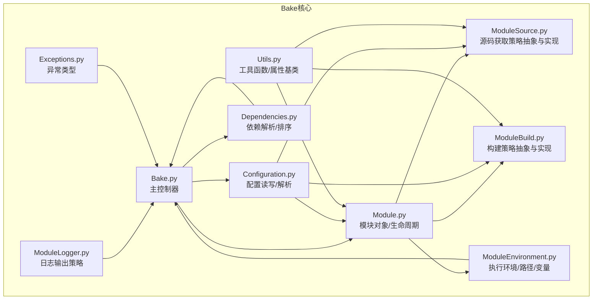
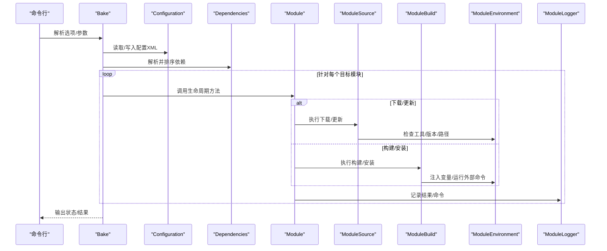
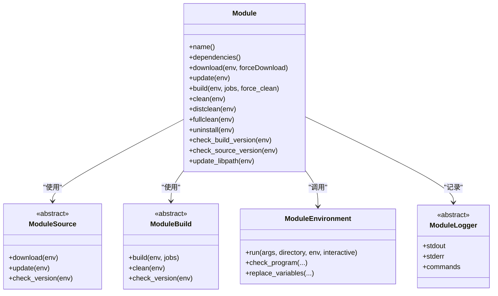
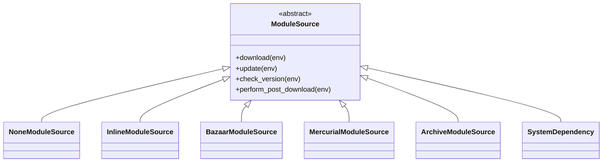
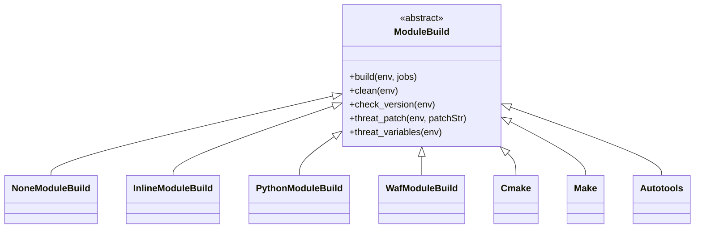
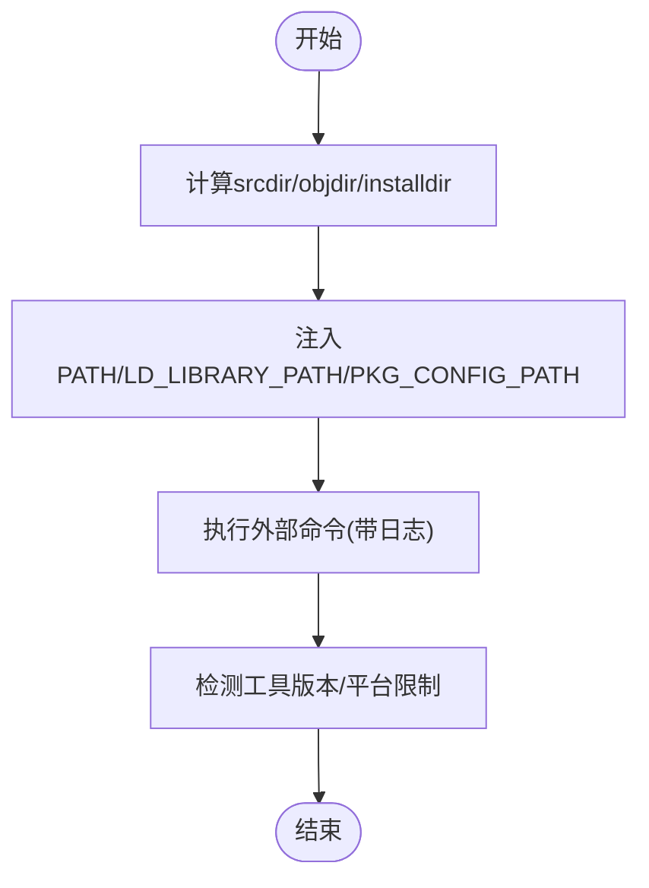
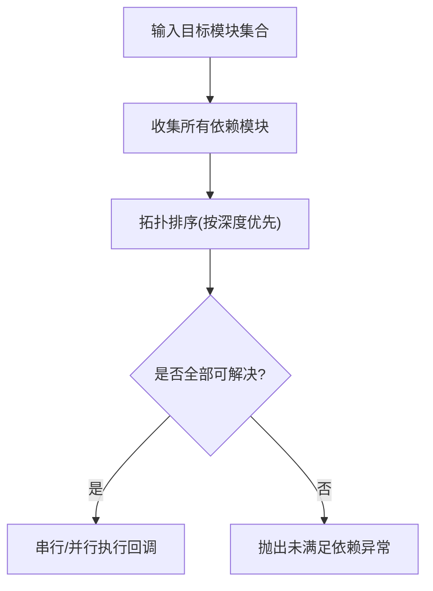
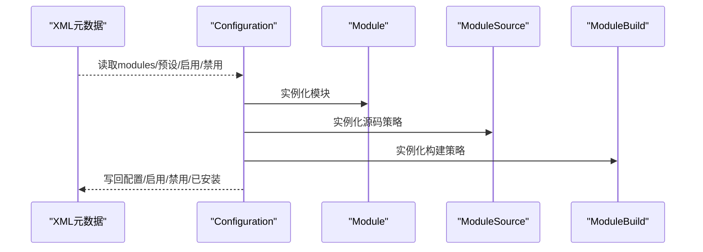
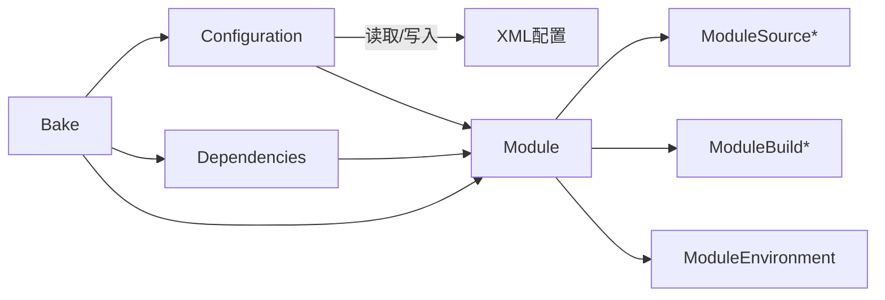

# 模块组织架构

<cite>
**本文引用的文件**
- [Bake.py](file://simulator/bake/bake/Bake.py)
- [Configuration.py](file://simulator/bake/bake/Configuration.py)
- [Module.py](file://simulator/bake/bake/Module.py)
- [ModuleBuild.py](file://simulator/bake/bake/ModuleBuild.py)
- [ModuleEnvironment.py](file://simulator/bake/bake/ModuleEnvironment.py)
- [ModuleSource.py](file://simulator/bake/bake/ModuleSource.py)
- [Dependencies.py](file://simulator/bake/bake/Dependencies.py)
- [ModuleLogger.py](file://simulator/bake/bake/ModuleLogger.py)
- [Utils.py](file://simulator/bake/bake/Utils.py)
- [Exceptions.py](file://simulator/bake/bake/Exceptions.py)
</cite>

## 目录
1. [引言](#引言)
2. [项目结构](#项目结构)
3. [核心组件](#核心组件)
4. [架构总览](#架构总览)
5. [详细组件分析](#详细组件分析)
6. [依赖分析](#依赖分析)
7. [性能考虑](#性能考虑)
8. [故障排查指南](#故障排查指南)
9. [结论](#结论)
10. [附录：最佳实践](#附录最佳实践)

## 引言
本文件面向NS-3的模块化组织与构建体系，系统梳理Bake模块管理器如何通过“模块-源码-构建-环境-日志-工具-异常”等子系统协同工作，实现模块的可配置、可扩展、可复用与可维护。重点涵盖：
- 模块化设计如何实现功能分离与代码复用
- 模块间的依赖关系、接口规范与通信机制
- 构建系统、配置管理与动态加载（按需）机制
- 模块组织图、依赖关系图与模块交互序列图
- 模块开发、集成与测试的最佳实践

## 项目结构
NS-3的模块组织以Bake为核心，围绕XML元数据描述模块的“源码来源、构建方式、依赖关系”，并通过统一的执行引擎驱动下载、更新、清理、构建、安装与卸载等生命周期操作。

图表来源
- [Bake.py:70-800](file://simulator/bake/bake/Bake.py#L70-L800)
- [Configuration.py:81-524](file://simulator/bake/bake/Configuration.py#L81-L524)
- [Dependencies.py:95-467](file://simulator/bake/bake/Dependencies.py#L95-L467)
- [Module.py:110-634](file://simulator/bake/bake/Module.py#L110-L634)
- [ModuleBuild.py:46-830](file://simulator/bake/bake/ModuleBuild.py#L46-L830)
- [ModuleSource.py:55-953](file://simulator/bake/bake/ModuleSource.py#L55-L953)
- [ModuleEnvironment.py:36-538](file://simulator/bake/bake/ModuleEnvironment.py#L36-L538)
- [ModuleLogger.py:32-158](file://simulator/bake/bake/ModuleLogger.py#L32-L158)
- [Utils.py:170-254](file://simulator/bake/bake/Utils.py#L170-L254)
- [Exceptions.py:26-50](file://simulator/bake/bake/Exceptions.py#L26-L50)

章节来源
- [Bake.py:70-800](file://simulator/bake/bake/Bake.py#L70-L800)
- [Configuration.py:81-524](file://simulator/bake/bake/Configuration.py#L81-L524)

## 核心组件
- 配置层（Configuration）：负责从XML元数据中读取模块定义、预设配置、启用/禁用状态，并生成目标配置文件；支持哈希校验与相对路径计算。
- 模块层（Module）：封装单个模块的生命周期方法（下载、更新、构建、清理、安装、卸载），并维护依赖列表与版本约束。
- 源码层（ModuleSource）：抽象不同源码获取方式（如归档包、Mercurial、Bazaar、系统依赖），并提供版本/可用性检查。
- 构建层（ModuleBuild）：抽象不同构建工具链（make、cmake、autotools、waf、python/setup.py、内联脚本），并处理补丁、变量注入、平台限制等。
- 环境层（ModuleEnvironment）：统一管理源目录、构建目录、安装目录、库/二进制/PKG_CONFIG路径、环境变量注入、命令执行与版本检测。
- 依赖层（Dependencies）：对模块依赖进行拓扑排序、循环检测、可选依赖处理与失败回退。
- 日志层（ModuleLogger）：支持标准输出、单一文件或按模块分文件的日志输出策略。
- 工具层（Utils）：提供属性模型、参数拆分、XML美化、目录合并、颜色打印等通用能力。
- 异常层（Exceptions）：统一任务错误、元数据错误与未实现异常。

章节来源
- [Module.py:110-634](file://simulator/bake/bake/Module.py#L110-L634)
- [ModuleSource.py:55-953](file://simulator/bake/bake/ModuleSource.py#L55-L953)
- [ModuleBuild.py:46-830](file://simulator/bake/bake/ModuleBuild.py#L46-L830)
- [ModuleEnvironment.py:36-538](file://simulator/bake/bake/ModuleEnvironment.py#L36-L538)
- [Dependencies.py:95-467](file://simulator/bake/bake/Dependencies.py#L95-L467)
- [Configuration.py:81-524](file://simulator/bake/bake/Configuration.py#L81-L524)
- [ModuleLogger.py:32-158](file://simulator/bake/bake/ModuleLogger.py#L32-L158)
- [Utils.py:170-254](file://simulator/bake/bake/Utils.py#L170-L254)
- [Exceptions.py:26-50](file://simulator/bake/bake/Exceptions.py#L26-L50)

## 架构总览
下图展示Bake在一次典型“配置-解析-执行”流程中的关键交互：

图表来源
- [Bake.py:780-800](file://simulator/bake/bake/Bake.py#L780-L800)
- [Configuration.py:413-453](file://simulator/bake/bake/Configuration.py#L413-L453)
- [Dependencies.py:175-418](file://simulator/bake/bake/Dependencies.py#L175-L418)
- [Module.py:226-516](file://simulator/bake/bake/Module.py#L226-L516)
- [ModuleSource.py:290-371](file://simulator/bake/bake/ModuleSource.py#L290-L371)
- [ModuleBuild.py:401-490](file://simulator/bake/bake/ModuleBuild.py#L401-L490)
- [ModuleEnvironment.py:490-538](file://simulator/bake/bake/ModuleEnvironment.py#L490-L538)
- [ModuleLogger.py:32-158](file://simulator/bake/bake/ModuleLogger.py#L32-L158)

## 详细组件分析

### 组件A：模块对象与生命周期（Module）
- 职责：封装模块的下载、更新、构建、清理、安装、卸载、版本检查、库路径导出等。
- 关键点：
  - 支持递归子模块下载（多级子节点）。
  - 对系统依赖与补丁处理有专门分支。
  - 可设置“仅一次构建标记”，避免重复安装。
  - 提供“停止即退出”模式用于CI/调试。
- 接口要点：
  - download/update/build/clean/distclean/fullclean/uninstall/check_* 等。
  - 依赖通过 ModuleDependency 表达，支持可选依赖标记。

图表来源
- [Module.py:110-634](file://simulator/bake/bake/Module.py#L110-L634)
- [ModuleSource.py:55-100](file://simulator/bake/bake/ModuleSource.py#L55-L100)
- [ModuleBuild.py:46-105](file://simulator/bake/bake/ModuleBuild.py#L46-L105)
- [ModuleEnvironment.py:490-538](file://simulator/bake/bake/ModuleEnvironment.py#L490-L538)
- [ModuleLogger.py:32-86](file://simulator/bake/bake/ModuleLogger.py#L32-L86)

章节来源
- [Module.py:110-634](file://simulator/bake/bake/Module.py#L110-L634)

### 组件B：源码获取策略（ModuleSource）
- 抽象与实现：
  - 通用抽象：ModuleSource（属性模型、后处理钩子、依赖表达式解析）。
  - 具体实现：None/Inline/Bazaar/Mercurial/Archive/SystemDependency 等。
- 关键能力：
  - 归档解压、URL下载、版本控制克隆/更新。
  - 系统依赖探测与提示安装命令（按发行版自动选择包管理器）。
  - 自定义后处理命令（下载后执行）。

图表来源
- [ModuleSource.py:55-953](file://simulator/bake/bake/ModuleSource.py#L55-L953)

章节来源
- [ModuleSource.py:55-953](file://simulator/bake/bake/ModuleSource.py#L55-L953)

### 组件C：构建策略（ModuleBuild）
- 抽象与实现：
  - 通用抽象：ModuleBuild（属性模型、补丁应用、变量注入、平台检查）。
  - 具体实现：None/Inline/Python/Waf/CMake/Make/Autotools 等。
- 关键能力：
  - 各工具链的configure/build/install参数传递与并行度控制。
  - 预/后安装命令、自定义环境变量注入（PATH/LD_LIBRARY_PATH/PKG_CONFIG）。
  - 版本检查与平台限制（如仅支持特定Linux发行版）。

图表来源
- [ModuleBuild.py:46-830](file://simulator/bake/bake/ModuleBuild.py#L46-L830)

章节来源
- [ModuleBuild.py:46-830](file://simulator/bake/bake/ModuleBuild.py#L46-L830)

### 组件D：执行环境（ModuleEnvironment）
- 职责：统一管理源/构建/安装目录、路径与环境变量、命令执行、版本检测、平台差异（Linux/Darwin/FreeBSD）。
- 关键能力：
  - 追加库/二进制/PKG_CONFIG路径，注入PYTHONPATH。
  - 定位可执行程序、检测版本范围。
  - 生成环境脚本（便于用户后续调用已构建模块）。

图表来源
- [ModuleEnvironment.py:186-538](file://simulator/bake/bake/ModuleEnvironment.py#L186-L538)

章节来源
- [ModuleEnvironment.py:36-538](file://simulator/bake/bake/ModuleEnvironment.py#L36-L538)

### 组件E：依赖解析（Dependencies）
- 职责：收集模块间依赖，进行拓扑排序、循环检测、可选依赖处理与失败回退。
- 关键点：
  - 支持回调式执行，允许在执行过程中动态添加依赖。
  - 可选依赖失败时记录警告但不中断（除非强制停止）。
  - 提前构建“可选依赖链”，减少重复计算。

图表来源
- [Dependencies.py:175-418](file://simulator/bake/bake/Dependencies.py#L175-L418)

章节来源
- [Dependencies.py:95-467](file://simulator/bake/bake/Dependencies.py#L95-L467)

### 组件F：配置与元数据（Configuration）
- 职责：读写XML配置文件，解析模块元数据（名称、类型、最小/最大版本、依赖、源码/构建策略、已安装文件列表），并支持预设配置。
- 关键点：
  - 内置元数据文件哈希校验，防止篡改。
  - 支持相对路径根目录与路径还原。
  - 将对象模型映射到XML树，再序列化为配置文件。

图表来源
- [Configuration.py:103-453](file://simulator/bake/bake/Configuration.py#L103-L453)

章节来源
- [Configuration.py:81-524](file://simulator/bake/bake/Configuration.py#L81-L524)

### 组件G：日志与工具（ModuleLogger/Utils）
- 日志：Stdout/单文件/按模块分文件三种策略，支持命令与标准输出分离。
- 工具：属性模型（ModuleAttribute/ModuleAttributeBase）、参数拆分、XML美化、目录合并、颜色打印。

章节来源
- [ModuleLogger.py:32-158](file://simulator/bake/bake/ModuleLogger.py#L32-L158)
- [Utils.py:170-254](file://simulator/bake/bake/Utils.py#L170-L254)

## 依赖分析
- 模块耦合与内聚：
  - Module高内聚于自身生命周期，低耦合于具体Source/Build实现，通过抽象接口解耦。
  - Configuration集中管理模块元数据，被Bake与UI共同使用。
  - Dependencies独立于具体模块，仅依赖模块接口（名称、依赖列表、可选标记）。
- 外部依赖与集成点：
  - ModuleEnvironment封装系统命令与路径，是与宿主系统的唯一接口。
  - ModuleSource/ModuleBuild均通过ModuleEnvironment执行外部命令，确保一致的错误处理与日志。
- 循环依赖风险：
  - Dependencies在解析阶段检测并报告循环依赖，避免死锁。
- 动态加载机制：
  - 通过XML中type字段与工厂方法（create/name）动态实例化具体策略类，实现“按需加载”。

图表来源
- [Configuration.py:308-401](file://simulator/bake/bake/Configuration.py#L308-L401)
- [Module.py:110-634](file://simulator/bake/bake/Module.py#L110-L634)
- [Dependencies.py:95-148](file://simulator/bake/bake/Dependencies.py#L95-L148)
- [Bake.py:780-800](file://simulator/bake/bake/Bake.py#L780-L800)

章节来源
- [Configuration.py:308-401](file://simulator/bake/bake/Configuration.py#L308-L401)
- [Module.py:110-634](file://simulator/bake/bake/Module.py#L110-L634)
- [Dependencies.py:95-148](file://simulator/bake/bake/Dependencies.py#L95-L148)
- [Bake.py:780-800](file://simulator/bake/bake/Bake.py#L780-L800)

## 性能考虑
- 并行化：当前依赖解析采用串行迭代，保留了并行接口但默认回退串行，避免复杂度与竞态。
- 依赖缓存：Dependencies预先构建“可选依赖链”并在多次解析中复用，降低重复计算。
- 命令执行：ModuleEnvironment统一注入路径与变量，减少重复查找与错误重试。
- 日志开销：按级别分流（命令/标准输出），在高冗余场景可切换至文件/分模块日志以降低终端压力。

## 故障排查指南
- 依赖未满足：
  - 触发DependencyUnmet异常，区分“必需依赖失败”与“可选依赖失败”。
  - 可选依赖失败会打印警告并继续，必要时开启更详细日志。
- 构建失败：
  - 检查ModuleEnvironment的命令输出与返回码；确认工具版本与平台限制。
  - 若使用补丁，确认patch工具存在且补丁文件路径正确。
- 配置损坏：
  - 使用fix-config修复配置文件；若仍失败，删除配置后重新configure。
- 权限问题：
  - 安装阶段可能需要sudo权限；可通过--sudo选项提升权限（谨慎使用）。

章节来源
- [Dependencies.py:390-418](file://simulator/bake/bake/Dependencies.py#L390-L418)
- [ModuleBuild.py:165-206](file://simulator/bake/bake/ModuleBuild.py#L165-L206)
- [Bake.py:92-206](file://simulator/bake/bake/Bake.py#L92-L206)
- [ModuleEnvironment.py:490-538](file://simulator/bake/bake/ModuleEnvironment.py#L490-L538)

## 结论
NS-3通过Bake实现了高度模块化的构建与管理框架：以XML为契约描述模块，以抽象策略解耦源码与构建，以统一环境屏蔽平台差异，以依赖解析保障构建顺序与健壮性。该架构既保证了功能分离与代码复用，又提供了灵活的配置与扩展能力，适合大规模网络仿真模块的持续演进与团队协作。

## 附录：最佳实践
- 开发新模块
  - 在XML中声明模块名、类型、版本范围与依赖；选择合适的ModuleSource/ModuleBuild类型。
  - 为可选特性使用可选依赖，避免阻断主流程。
- 集成第三方库
  - 优先使用SystemDependency进行探测与提示；若需打包，提供Archive或VCS源码策略。
- 构建与安装
  - 明确CFLAGS/CXXFLAGS/LDFLAGS与configure/build参数；在必要时使用补丁与后处理命令。
  - 使用ModuleEnvironment提供的变量注入与路径追加，避免硬编码。
- 测试与验证
  - 在本地先执行download/update/build/clean，确保各阶段无误。
  - 使用--stop-on-error加速定位问题；结合--verbose/-vvv查看命令与版本信息。
- 配置管理
  - 利用预设配置（predefined）快速切换常用组合；定期备份.bakerc资源文件。
- 动态加载与扩展
  - 新增策略类时，遵循create/name约定并通过XML type字段启用；保持属性模型清晰与向后兼容。