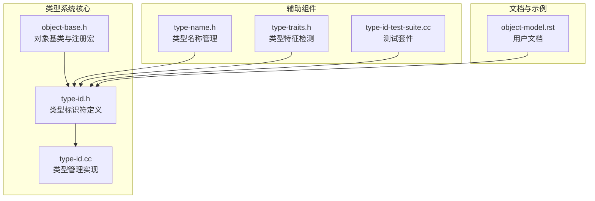
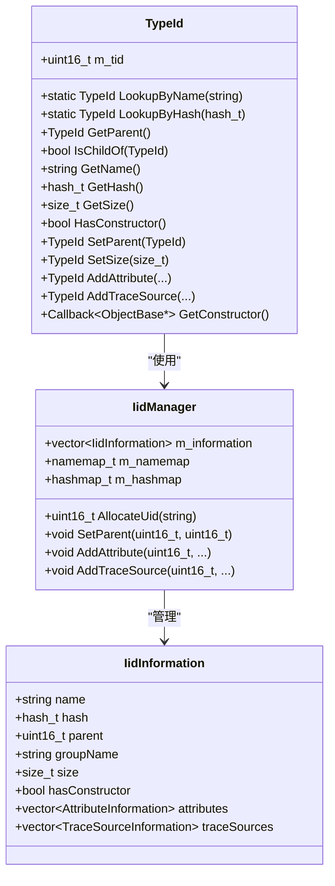
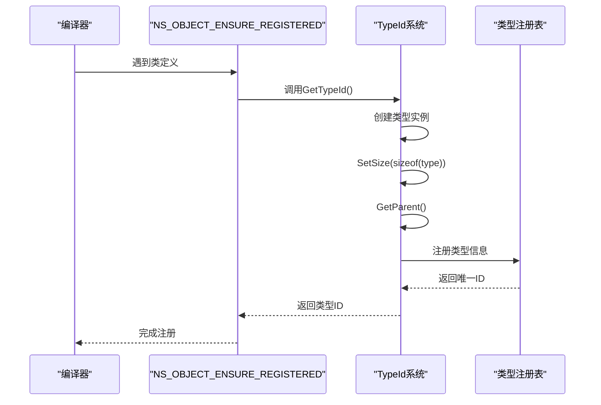
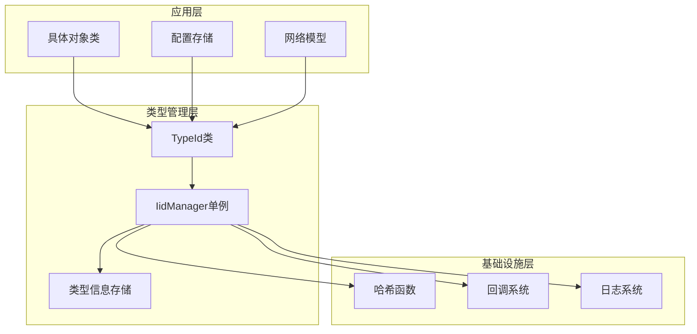
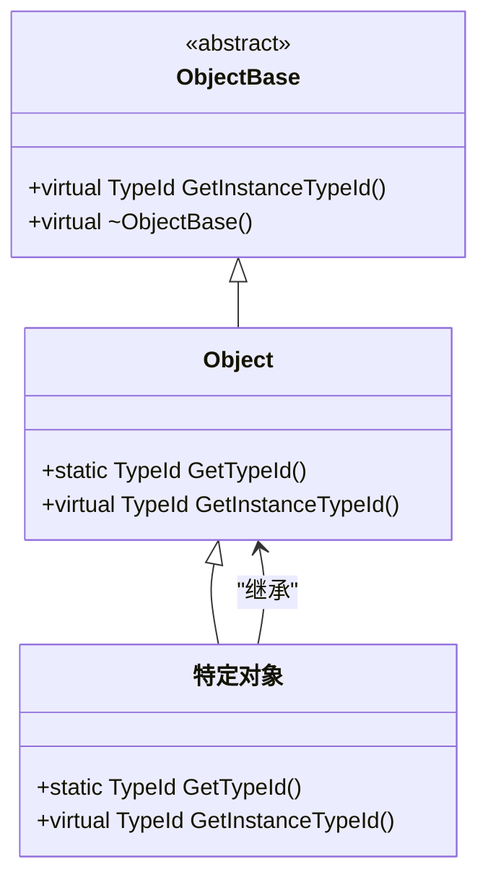
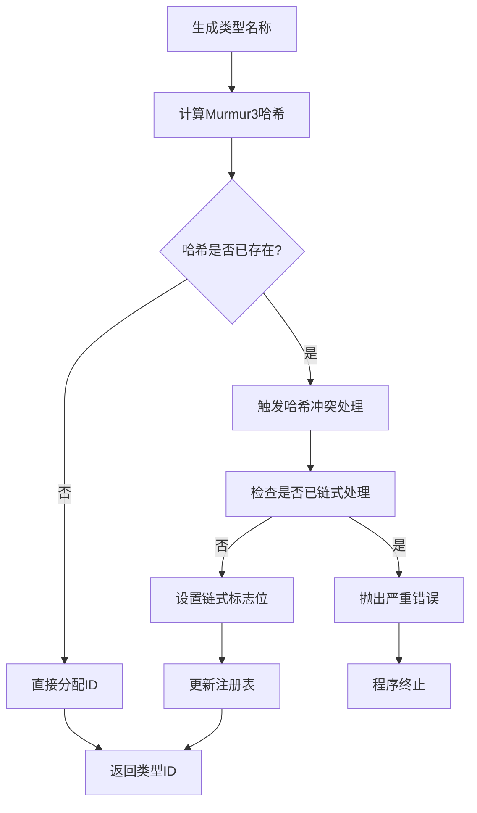
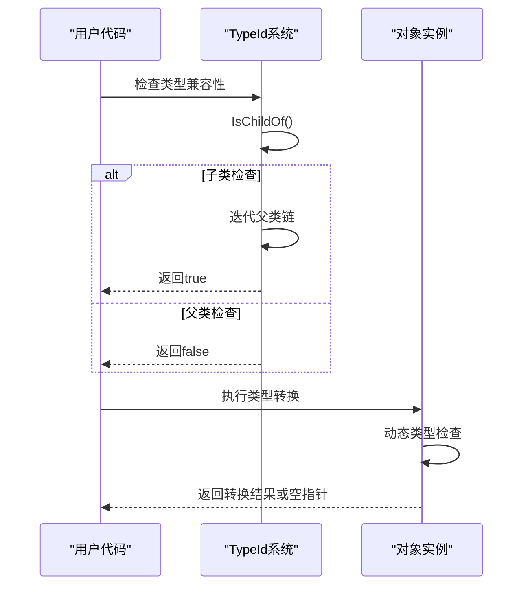
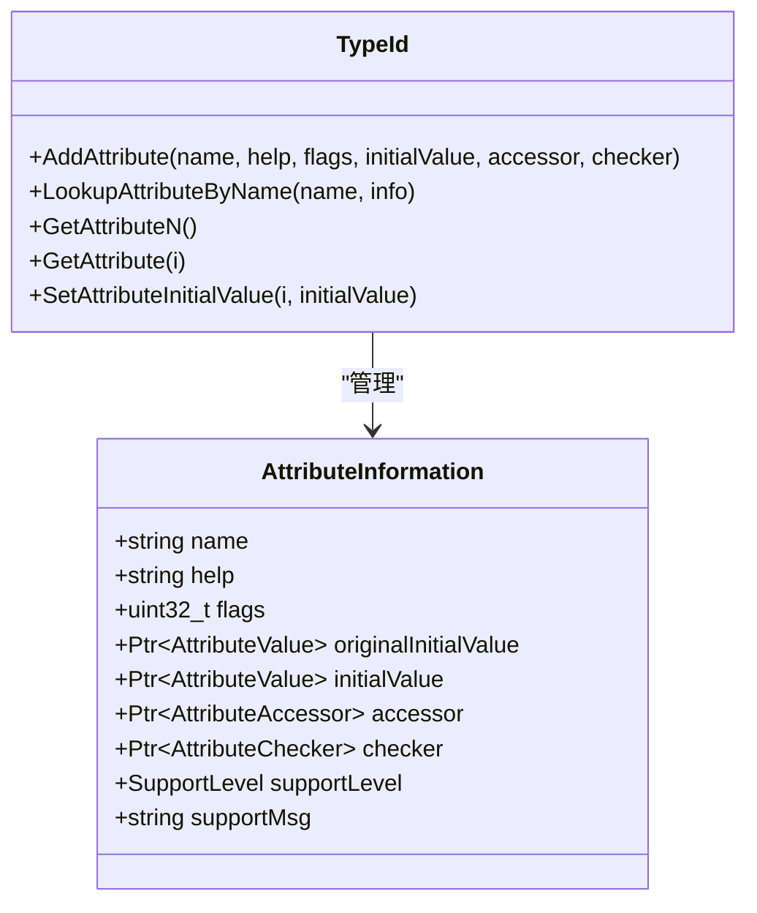
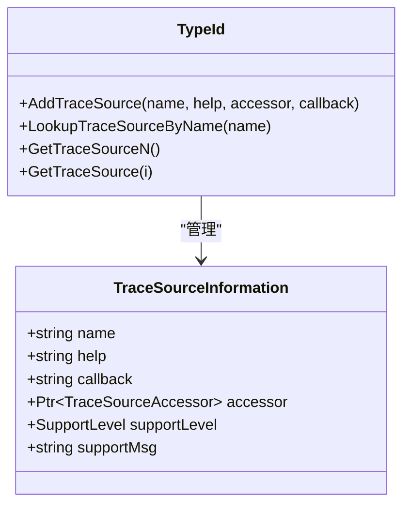
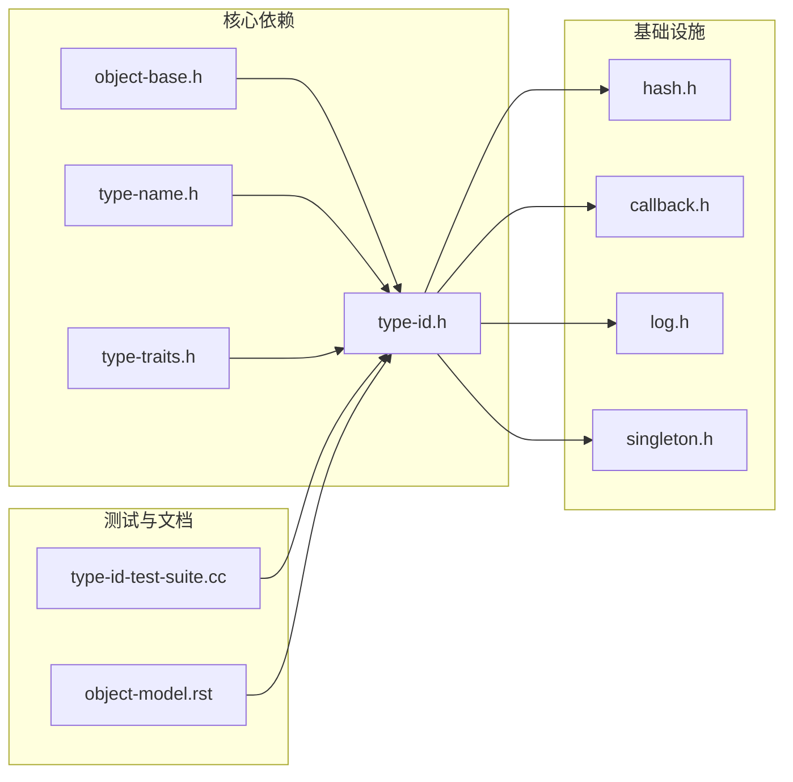

# 类型系统设计

<cite>
**本文档引用的文件**
- [type-id.h](file://simulator/ns-3.39/src/core/model/type-id.h)
- [type-id.cc](file://simulator/ns-3.39/src/core/model/type-id.cc)
- [object-base.h](file://simulator/ns-3.39/src/core/model/object-base.h)
- [type-name.h](file://simulator/ns-3.39/src/core/model/type-name.h)
- [type-traits.h](file://simulator/ns-3.39/src/core/model/type-traits.h)
- [type-id-test-suite.cc](file://simulator/ns-3.39/src/core/test/type-id-test-suite.cc)
- [object-model.rst](file://simulator/ns-3.39/doc/manual/source/object-model.rst)
</cite>

## 目录
1. [引言](#引言)
2. [项目结构](#项目结构)
3. [核心组件](#核心组件)
4. [架构概览](#架构概览)
5. [详细组件分析](#详细组件分析)
6. [依赖关系分析](#依赖关系分析)
7. [性能考虑](#性能考虑)
8. [故障排除指南](#故障排除指南)
9. [结论](#结论)

## 引言

NS-3类型系统是该网络模拟器的核心基础设施，它提供了强大的类型识别、继承关系管理和运行时反射能力。本文档深入分析了NS-3类型系统的设计原理、实现机制和最佳实践。

NS-3类型系统的核心价值在于：
- **类型安全**：通过编译时和运行时双重验证确保类型安全
- **动态类型检查**：支持运行时的类型识别和转换
- **反射功能**：提供属性访问、构造函数调用等反射能力
- **模块化架构**：支持插件式扩展和版本兼容性

## 项目结构

NS-3类型系统主要分布在以下核心文件中：



**图表来源**
- [type-id.h:1-670](file://simulator/ns-3.39/src/core/model/type-id.h#L1-L670)
- [type-id.cc:1-1264](file://simulator/ns-3.39/src/core/model/type-id.cc#L1-L1264)
- [object-base.h:1-341](file://simulator/ns-3.39/src/core/model/object-base.h#L1-L341)

**章节来源**
- [type-id.h:1-670](file://simulator/ns-3.39/src/core/model/type-id.h#L1-L670)
- [type-id.cc:1-1264](file://simulator/ns-3.39/src/core/model/type-id.cc#L1-L1264)
- [object-base.h:1-341](file://simulator/ns-3.39/src/core/model/object-base.h#L1-L341)

## 核心组件

### TypeId类设计

TypeId是NS-3类型系统的核心类，提供了完整的类型元数据管理功能：



**图表来源**
- [type-id.h:58-669](file://simulator/ns-3.39/src/core/model/type-id.h#L58-L669)
- [type-id.cc:78-358](file://simulator/ns-3.39/src/core/model/type-id.cc#L78-L358)

TypeId类的主要特性包括：

1. **唯一标识符**：使用16位整数作为内部标识符
2. **哈希管理**：基于Murmur3算法的32位哈希值
3. **继承关系**：支持多层继承层次结构
4. **元数据存储**：属性、构造函数、追踪源信息

**章节来源**
- [type-id.h:58-669](file://simulator/ns-3.39/src/core/model/type-id.h#L58-L669)
- [type-id.cc:78-358](file://simulator/ns-3.39/src/core/model/type-id.cc#L78-L358)

### 类型注册机制

NS-3采用静态注册机制，通过宏定义自动完成类型注册：



**图表来源**
- [object-base.h:46-57](file://simulator/ns-3.39/src/core/model/object-base.h#L46-L57)
- [type-id.cc:824-831](file://simulator/ns-3.39/src/core/model/type-id.cc#L824-L831)

**章节来源**
- [object-base.h:46-57](file://simulator/ns-3.39/src/core/model/object-base.h#L46-L57)
- [type-id.cc:824-831](file://simulator/ns-3.39/src/core/model/type-id.cc#L824-L831)

## 架构概览

NS-3类型系统采用分层架构设计，确保了高内聚低耦合的特性：



**图表来源**
- [type-id.h:38-600](file://simulator/ns-3.39/src/core/model/type-id.h#L38-L600)
- [type-id.cc:41-815](file://simulator/ns-3.39/src/core/model/type-id.cc#L41-L815)

### 继承关系管理

NS-3类型系统支持复杂的继承层次结构，通过父类指针维护继承关系：



**图表来源**
- [object-base.h:172-341](file://simulator/ns-3.39/src/core/model/object-base.h#L172-L341)

**章节来源**
- [object-base.h:172-341](file://simulator/ns-3.39/src/core/model/object-base.h#L172-L341)

## 详细组件分析

### 类型ID生成与管理

NS-3类型系统实现了高效的类型ID生成和管理机制：

#### 哈希冲突处理



**图表来源**
- [type-id.cc:381-453](file://simulator/ns-3.39/src/core/model/type-id.cc#L381-L453)

#### 类型信息存储结构

IidInformation结构体存储了完整的类型元数据：

| 字段名 | 类型 | 描述 | 默认值 |
|--------|------|------|--------|
| name | string | 类型完整名称 | 空字符串 |
| hash | hash_t | 哈希值 | 0 |
| parent | uint16_t | 父类类型ID | 0 |
| groupName | string | 分组名称 | 空字符串 |
| size | size_t | 对象大小 | (size_t)(-1) |
| hasConstructor | bool | 是否有构造函数 | false |
| mustHideFromDocumentation | bool | 是否隐藏文档 | false |
| supportLevel | SupportLevel | 支持级别 | SUPPORTED |

**章节来源**
- [type-id.cc:295-322](file://simulator/ns-3.39/src/core/model/type-id.cc#L295-L322)

### 动态类型检查与转换

NS-3类型系统提供了多种动态类型检查机制：

#### 类型转换流程



**图表来源**
- [type-id.h:205-215](file://simulator/ns-3.39/src/core/model/type-id.h#L205-L215)
- [type-id.cc:975-985](file://simulator/ns-3.39/src/core/model/type-id.cc#L975-L985)

**章节来源**
- [type-id.h:205-215](file://simulator/ns-3.39/src/core/model/type-id.h#L205-L215)
- [type-id.cc:975-985](file://simulator/ns-3.39/src/core/model/type-id.cc#L975-L985)

### 反射功能实现

NS-3类型系统提供了丰富的反射能力：

#### 属性系统



**图表来源**
- [type-id.h:80-100](file://simulator/ns-3.39/src/core/model/type-id.h#L80-L100)

#### 追踪源系统



**图表来源**
- [type-id.h:102-117](file://simulator/ns-3.39/src/core/model/type-id.h#L102-L117)

**章节来源**
- [type-id.h:80-117](file://simulator/ns-3.39/src/core/model/type-id.h#L80-L117)

### 类型特征检测

NS-3类型系统提供了强大的模板类型特征检测功能：

#### 类型特征检测机制

| 特征类型 | 检测目标 | 实现方式 |
|----------|----------|----------|
| 引用类型 | T& | ReferenceTraits<T&> |
| 指针类型 | T* | PointerTraits<T*> |
| 智能指针 | Ptr<T> | PointerTraits<Ptr<T>> |
| 函数指针 | T(*)() | FunctionPtrTraits |
| 成员指针 | T (U::*)() | PtrToMemberTraits |

**章节来源**
- [type-traits.h:38-800](file://simulator/ns-3.39/src/core/model/type-traits.h#L38-L800)

## 依赖关系分析

NS-3类型系统具有清晰的依赖关系结构：



**图表来源**
- [type-id.h:22-28](file://simulator/ns-3.39/src/core/model/type-id.h#L22-L28)
- [object-base.h:22-25](file://simulator/ns-3.39/src/core/model/object-base.h#L22-L25)

### 外部依赖分析

NS-3类型系统依赖的关键外部组件：

1. **哈希系统**：Murmur3算法提供高质量的哈希值
2. **回调系统**：支持类型安全的回调函数管理
3. **日志系统**：提供详细的调试和错误信息
4. **单例模式**：IidManager作为全局类型管理器

**章节来源**
- [type-id.h:22-28](file://simulator/ns-3.39/src/core/model/type-id.h#L22-L28)
- [type-id.cc:361-366](file://simulator/ns-3.39/src/core/model/type-id.cc#L361-L366)

## 性能考虑

NS-3类型系统在设计时充分考虑了性能优化：

### 查找性能

| 操作类型 | 时间复杂度 | 空间复杂度 | 说明 |
|----------|------------|------------|------|
| 名称查找 | O(log n) | O(n) | 使用映射表进行查找 |
| 哈希查找 | O(1) | O(n) | 直接哈希索引 |
| 继承遍历 | O(h) | O(1) | h为继承深度 |
| 属性查找 | O(a+h) | O(1) | a为属性数量，h为继承深度 |

### 内存使用

- **类型信息存储**：每个类型约占用200-300字节
- **索引结构**：名称映射和哈希映射各占用O(n)空间
- **缓存友好**：向量存储提供良好的内存局部性

### 优化策略

1. **延迟初始化**：类型信息按需加载
2. **哈希预计算**：避免重复计算哈希值
3. **批量操作**：支持批量类型查询优化

## 故障排除指南

### 常见问题及解决方案

#### 类型注册失败

**症状**：编译时或运行时出现类型未注册错误

**原因分析**：
1. 缺少NS_OBJECT_ENSURE_REGISTERED宏
2. GetTypeId方法未正确实现
3. 类型名称冲突

**解决方法**：
```cpp
// 确保类定义中包含正确的宏
NS_OBJECT_ENSURE_REGISTERED(MyClass);

// 确保GetTypeId方法正确实现
static TypeId MyClass::GetTypeId() {
    static TypeId tid = TypeId("ns3::MyClass")
        .SetParent<ParentClass>()
        .AddAttribute(...);
    return tid;
}
```

#### 哈希冲突

**症状**：程序启动时出现哈希冲突警告

**原因分析**：两个不同的类型名称产生相同的哈希值

**解决方法**：
1. 修改其中一个类型的名称
2. 使用更长的类型名称
3. 联系开发团队获取帮助

#### 类型转换失败

**症状**：dynamic_cast返回空指针

**原因分析**：
1. 类型不兼容
2. 对象生命周期问题
3. 多态接口未正确实现

**解决方法**：
```cpp
// 使用TypeId进行类型检查
TypeId sourceTid = obj->GetInstanceTypeId();
TypeId targetTid = TargetClass::GetTypeId();

if (sourceTid.IsChildOf(targetTid)) {
    // 安全转换
    TargetClass* ptr = dynamic_cast<TargetClass*>(obj);
}
```

**章节来源**
- [type-id-test-suite.cc:150-201](file://simulator/ns-3.39/src/core/test/type-id-test-suite.cc#L150-L201)
- [object-model.rst:286-298](file://simulator/ns-3.39/doc/manual/source/object-model.rst#L286-L298)

## 结论

NS-3类型系统是一个设计精良、功能完备的类型管理系统。其主要优势包括：

1. **设计优雅**：采用分层架构，职责分离明确
2. **性能优异**：哈希索引提供O(1)查找性能
3. **功能丰富**：支持属性、追踪源、构造函数等多种元数据
4. **扩展性强**：模块化设计便于功能扩展
5. **类型安全**：编译时和运行时双重验证

该类型系统为NS-3网络模拟器提供了坚实的基础，使得复杂的网络仿真成为可能。通过合理的抽象和优化，NS-3类型系统在保证功能完整性的同时，也保持了优秀的性能表现。

对于开发者而言，理解NS-3类型系统的设计原理和实现细节，有助于更好地利用其提供的功能，开发出更加健壮和高效的网络仿真程序。