# 设计模式应用

<cite>
**本文引用的文件**   
- [object.h](file://simulator/ns-3.39/src/core/model/object.h)
- [nstime.h](file://simulator/ns-3.39/src/core/model/nstime.h)
- [simulator.h](file://simulator/ns-3.39/src/core/model/simulator.h)
- [event-impl.h](file://simulator/ns-3.39/src/core/model/event-impl.h)
- [object-factory.h](file://simulator/ns-3.39/src/core/model/object-factory.h)
- [trace-source-accessor.h](file://simulator/ns-3.39/src/core/model/trace-source-accessor.h)
- [attribute.h](file://simulator/ns-3.39/src/core/model/attribute.h)
- [ptr.h](file://simulator/ns-3.39/src/core/model/ptr.h)
- [simple-ref-count.h](file://simulator/ns-3.39/src/core/model/simple-ref-count.h)
- [event-id.h](file://simulator/ns-3.39/src/core/model/event-id.h)
- [make-event.h](file://simulator/ns-3.39/src/core/model/make-event.h)
- [scheduler.h](file://simulator/ns-3.39/src/core/model/scheduler.h)
- [scheduler-impl.h](file://simulator/ns-3.39/src/core/model/scheduler-impl.h)
- [wifi-mac.h](file://simulator/ns-3.39/src/wifi/model/wifi-mac.h)
- [wifi-phy.h](file://simulator/ns-3.39/src/wifi/model/wifi-phy.h)
- [wifi-channel.h](file://simulator/ns-3.39/src/wifi/model/wifi-channel.h)
- [point-to-point-net-device.h](file://simulator/ns-3.39/src/point-to-point/model/point-to-point-net-device.h)
- [point-to-point-channel.h](file://simulator/ns-3.39/src/point-to-point/model/point-to-point-channel.h)
- [flow-probe.h](file://simulator/ns-3.39/src/flow-monitor/model/flow-probe.h)
- [flow-classifier.h](file://simulator/ns-3.39/src/flow-monitor/model/flow-classifier.h)
- [applications-app.h](file://simulator/ns-3.39/src/applications/model/applications-app.h)
- [applications-helper.h](file://simulator/ns-3.39/src/applications/helper/applications-helper.h)
- [internet-stack-helper.h](file://simulator/ns-3.39/src/internet/helper/internet-stack-helper.h)
- [internet-stack-helper.cc](file://simulator/ns-3.39/src/internet/helper/internet-stack-helper.cc)
- [traffic-control-helper.h](file://simulator/ns-3.39/src/traffic-control/helper/traffic-control-helper.h)
- [traffic-control-helper.cc](file://simulator/ns-3.39/src/traffic-control/helper/traffic-control-helper.cc)
- [energy-source.h](file://simulator/ns-3.39/src/energy/model/energy-source.h)
- [energy-source-adapter.h](file://simulator/ns-3.39/src/energy/model/energy-source-adapter.h)
- [energy-source-adapter.cc](file://simulator/ns-3.39/src/energy/model/energy-source-adapter.cc)
- [mobility-model.h](file://simulator/ns-3.39/src/mobility/model/mobility-model.h)
- [random-walk-2d-mobility-model.h](file://simulator/ns-3.39/src/mobility/model/random-walk-2d-mobility-model.h)
- [random-walk-2d-mobility-model.cc](file://simulator/ns-3.39/src/mobility/model/random-walk-2d-mobility-model.cc)
</cite>

## 目录
1. [引言](#引言)
2. [项目结构](#项目结构)
3. [核心组件](#核心组件)
4. [架构总览](#架构总览)
5. [详细组件分析](#详细组件分析)
6. [依赖关系分析](#依赖关系分析)
7. [性能考量](#性能考量)
8. [故障排查指南](#故障排查指南)
9. [结论](#结论)
10. [附录](#附录)

## 引言
本文件系统化梳理NS-3在仿真建模中对多种设计模式的应用与实践，重点覆盖工厂模式、观察者模式（事件/跟踪）、策略模式（调度器/流量控制）与适配器模式（能量源适配）。通过对核心对象模型、时间管理、事件调度与网络子层的深入分析，阐明这些模式如何提升系统的可扩展性、可维护性与可测试性，并给出对应的UML类图与时序图以帮助读者建立直观理解。

## 项目结构
NS-3采用模块化的分层组织：核心（core）提供对象模型、时间、事件与调度；网络（network）承载链路与设备抽象；互联网（internet）提供IP/TCP/UDP栈；无线（wifi/lte等）提供MAC/PHY层；辅助模块如能量（energy）、移动性（mobility）、流量监控（flow-monitor）等作为横切关注点融入整体架构。

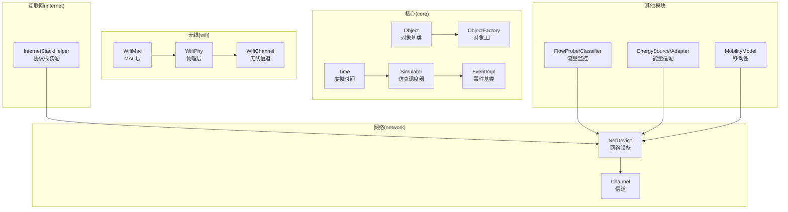

**图表来源**
- [object.h:88-447](file://simulator/ns-3.39/src/core/model/object.h#L88-L447)
- [nstime.h:104-124](file://simulator/ns-3.39/src/core/model/nstime.h#L104-L124)
- [simulator.h:67-531](file://simulator/ns-3.39/src/core/model/simulator.h#L67-L531)
- [event-impl.h:45-81](file://simulator/ns-3.39/src/core/model/event-impl.h#L45-L81)
- [object-factory.h](file://simulator/ns-3.39/src/core/model/object-factory.h)
- [wifi-mac.h](file://simulator/ns-3.39/src/wifi/model/wifi-mac.h)
- [wifi-phy.h](file://simulator/ns-3.39/src/wifi/model/wifi-phy.h)
- [wifi-channel.h](file://simulator/ns-3.39/src/wifi/model/wifi-channel.h)
- [point-to-point-net-device.h](file://simulator/ns-3.39/src/point-to-point/model/point-to-point-net-device.h)
- [point-to-point-channel.h](file://simulator/ns-3.39/src/point-to-point/model/point-to-point-channel.h)
- [flow-probe.h](file://simulator/ns-3.39/src/flow-monitor/model/flow-probe.h)
- [energy-source.h](file://simulator/ns-3.39/src/energy/model/energy-source.h)
- [energy-source-adapter.h](file://simulator/ns-3.39/src/energy/model/energy-source-adapter.h)
- [mobility-model.h](file://simulator/ns-3.39/src/mobility/model/mobility-model.h)

**章节来源**
- [object.h:88-447](file://simulator/ns-3.39/src/core/model/object.h#L88-L447)
- [simulator.h:67-531](file://simulator/ns-3.39/src/core/model/simulator.h#L67-L531)

## 核心组件
- 对象模型与聚合：基于Object的继承体系，支持属性注册、类型识别、对象聚合与生命周期管理，是所有模块的基础。
- 时间与事件：Time提供统一的虚拟时间表示与单位转换；EventImpl定义事件接口；Simulator封装调度逻辑。
- 工厂与智能指针：ObjectFactory负责动态创建对象；Ptr与SimpleRefCount提供RAII式资源管理。
- 观察者与跟踪：通过TraceSourceAccessor与回调机制实现事件/状态变化的观察与统计。

**章节来源**
- [object.h:88-447](file://simulator/ns-3.39/src/core/model/object.h#L88-L447)
- [nstime.h:104-124](file://simulator/ns-3.39/src/core/model/nstime.h#L104-L124)
- [event-impl.h:45-81](file://simulator/ns-3.39/src/core/model/event-impl.h#L45-L81)
- [simulator.h:67-531](file://simulator/ns-3.39/src/core/model/simulator.h#L67-L531)
- [ptr.h](file://simulator/ns-3.39/src/core/model/ptr.h)
- [simple-ref-count.h](file://simulator/ns-3.39/src/core/model/simple-ref-count.h)
- [object-factory.h](file://simulator/ns-3.39/src/core/model/object-factory.h)
- [trace-source-accessor.h](file://simulator/ns-3.39/src/core/model/trace-source-accessor.h)

## 架构总览
NS-3通过“对象-工厂-调度-事件-跟踪”的主干架构支撑从简单点对点到复杂无线网络的仿真。对象模型提供统一的生命周期与属性系统；工厂模式解耦实例化过程；调度器与事件模型实现离散事件仿真；跟踪机制提供可观测性与可测试性。

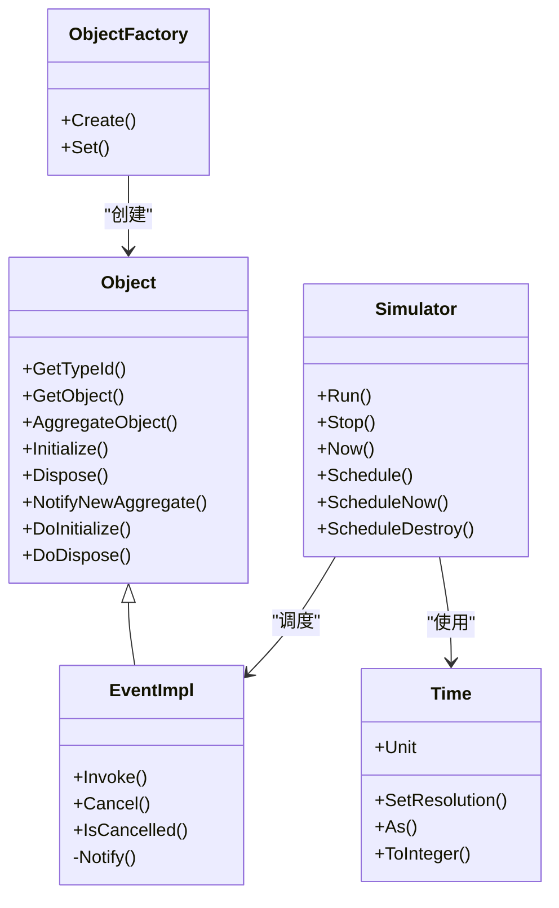

**图表来源**
- [object.h:88-447](file://simulator/ns-3.39/src/core/model/object.h#L88-L447)
- [object-factory.h](file://simulator/ns-3.39/src/core/model/object-factory.h)
- [nstime.h:104-124](file://simulator/ns-3.39/src/core/model/nstime.h#L104-L124)
- [event-impl.h:45-81](file://simulator/ns-3.39/src/core/model/event-impl.h#L45-L81)
- [simulator.h:67-531](file://simulator/ns-3.39/src/core/model/simulator.h#L67-L531)

## 详细组件分析

### 工厂模式：对象创建与模块装配
- 应用场景
  - 模块实例化：通过ObjectFactory按类型创建设备、协议栈、MAC/PHY等组件。
  - 协议栈装配：InternetStackHelper根据配置选择不同协议族与队列策略。
  - 流量控制：TrafficControlHelper按需创建队列与调度策略。
- 实现要点
  - 类型注册与构造参数列表：AttributeConstructionList配合TypeId完成构造。
  - 统一创建入口：CreateObject模板函数与CompleteConstruct内部流程。
  - 配置驱动：Helper类封装参数设置，降低用户心智负担。
- 优势
  - 解耦高层调用与底层实现细节，便于替换与扩展。
  - 支持属性注入与默认值，提升可配置性与可测试性。

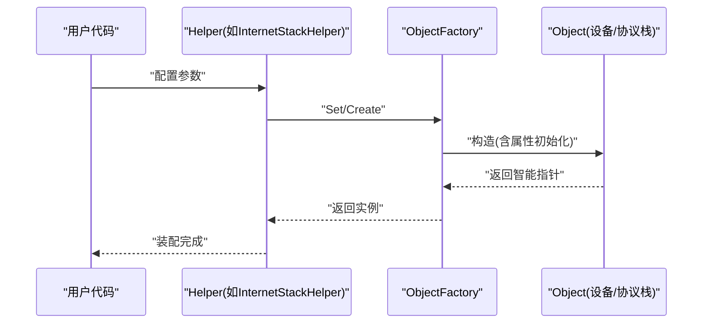

**图表来源**
- [object-factory.h](file://simulator/ns-3.39/src/core/model/object-factory.h)
- [object.h:577-582](file://simulator/ns-3.39/src/core/model/object.h#L577-L582)
- [internet-stack-helper.h](file://simulator/ns-3.39/src/internet/helper/internet-stack-helper.h)
- [internet-stack-helper.cc](file://simulator/ns-3.39/src/internet/helper/internet-stack-helper.cc)
- [traffic-control-helper.h](file://simulator/ns-3.39/src/traffic-control/helper/traffic-control-helper.h)
- [traffic-control-helper.cc](file://simulator/ns-3.39/src/traffic-control/helper/traffic-control-helper.cc)

**章节来源**
- [object.h:577-582](file://simulator/ns-3.39/src/core/model/object.h#L577-L582)
- [object-factory.h](file://simulator/ns-3.39/src/core/model/object-factory.h)
- [internet-stack-helper.h](file://simulator/ns-3.39/src/internet/helper/internet-stack-helper.h)
- [internet-stack-helper.cc](file://simulator/ns-3.39/src/internet/helper/internet-stack-helper.cc)
- [traffic-control-helper.h](file://simulator/ns-3.39/src/traffic-control/helper/traffic-control-helper.h)
- [traffic-control-helper.cc](file://simulator/ns-3.39/src/traffic-control/helper/traffic-control-helper.cc)

### 观察者模式：事件调度与状态跟踪
- 应用场景
  - 事件驱动：Simulator::Schedule系列方法将函数或成员函数包装为EventImpl并排队执行。
  - 状态跟踪：通过TraceSourceAccessor与回调签名记录时间序列数据（如吞吐量、延迟）。
- 实现要点
  - 事件封装：MakeEvent将任意可调用对象绑定参数生成EventImpl。
  - 调度接口：Simulator提供统一的Schedule/ScheduleNow/ScheduleDestroy接口。
  - 回调签名：TracedCallback用于连接观察者与被观察对象。
- 优势
  - 松耦合：观察者与被观察者仅依赖回调接口。
  - 可扩展：新增观测点无需修改核心逻辑。
  - 可测试：通过替换回调实现行为验证。

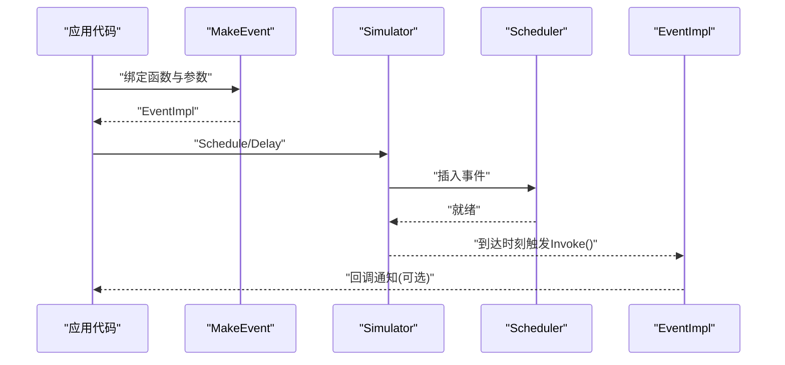

**图表来源**
- [make-event.h](file://simulator/ns-3.39/src/core/model/make-event.h)
- [simulator.h:214-391](file://simulator/ns-3.39/src/core/model/simulator.h#L214-L391)
- [event-impl.h:45-81](file://simulator/ns-3.39/src/core/model/event-impl.h#L45-L81)
- [scheduler.h](file://simulator/ns-3.39/src/core/model/scheduler.h)
- [scheduler-impl.h](file://simulator/ns-3.39/src/core/model/scheduler-impl.h)
- [trace-source-accessor.h](file://simulator/ns-3.39/src/core/model/trace-source-accessor.h)

**章节来源**
- [simulator.h:214-391](file://simulator/ns-3.39/src/core/model/simulator.h#L214-L391)
- [event-impl.h:45-81](file://simulator/ns-3.39/src/core/model/event-impl.h#L45-L81)
- [make-event.h](file://simulator/ns-3.39/src/core/model/make-event.h)
- [trace-source-accessor.h](file://simulator/ns-3.39/src/core/model/trace-source-accessor.h)

### 策略模式：调度器与流量控制
- 应用场景
  - 调度策略：通过SetScheduler注入不同调度器实现（如堆、列表），影响事件排序与性能。
  - 流量控制策略：TC Helper按需选择RED/CODEL/CBQ等队列调度策略。
- 实现要点
  - 接口抽象：调度器与队列策略均遵循统一接口，可通过工厂/配置切换。
  - 运行期替换：Simulator::SetScheduler允许在运行前更换调度实现。
- 优势
  - 易于A/B对比不同策略的仿真结果。
  - 便于引入新策略而无需改动上层调用代码。

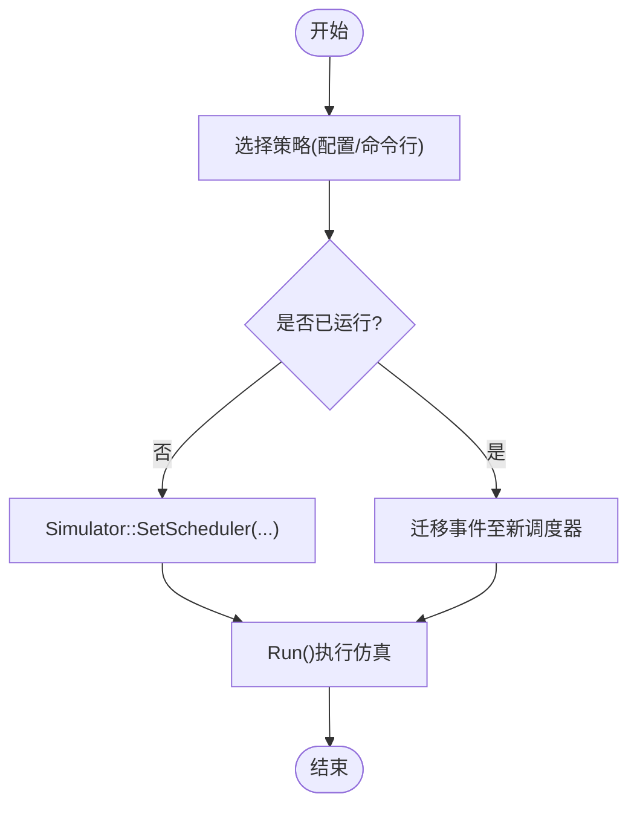

**图表来源**
- [simulator.h:108-115](file://simulator/ns-3.39/src/core/model/simulator.h#L108-L115)
- [scheduler.h](file://simulator/ns-3.39/src/core/model/scheduler.h)
- [traffic-control-helper.h](file://simulator/ns-3.39/src/traffic-control/helper/traffic-control-helper.h)
- [traffic-control-helper.cc](file://simulator/ns-3.39/src/traffic-control/helper/traffic-control-helper.cc)

**章节来源**
- [simulator.h:108-115](file://simulator/ns-3.39/src/core/model/simulator.h#L108-L115)
- [scheduler.h](file://simulator/ns-3.39/src/core/model/scheduler.h)
- [traffic-control-helper.h](file://simulator/ns-3.39/src/traffic-control/helper/traffic-control-helper.h)
- [traffic-control-helper.cc](file://simulator/ns-3.39/src/traffic-control/helper/traffic-control-helper.cc)

### 适配器模式：能量源适配
- 应用场景
  - 将不同形式的能量源（如恒功率、可再生）适配为统一的EnergySource接口，供节点使用。
- 实现要点
  - Adapter封装具体能量源，暴露一致的查询/消耗接口。
  - 通过Helper与Factory接入到设备生命周期。
- 优势
  - 上层无需感知底层能量源差异。
  - 便于替换/组合不同能量供给方案。

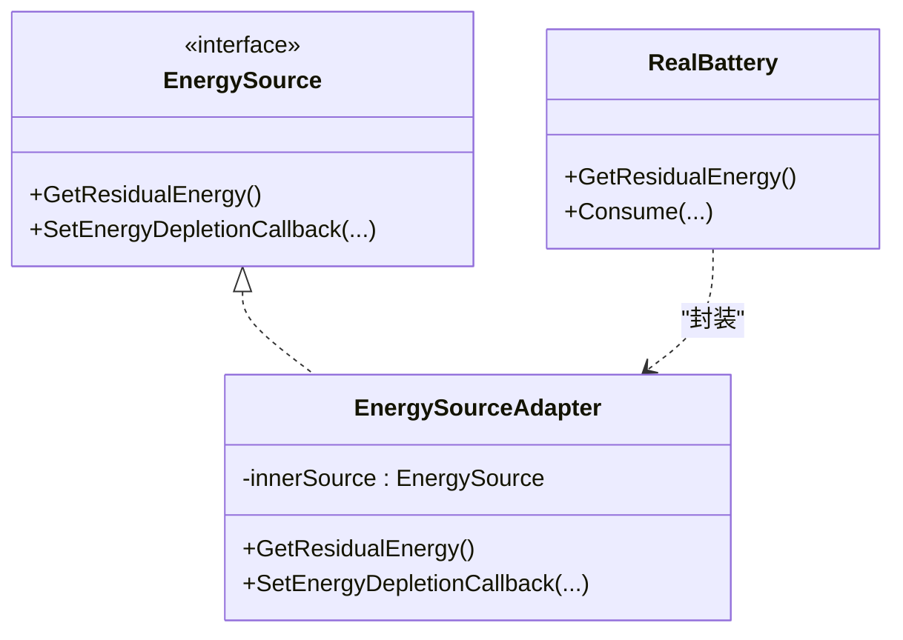

**图表来源**
- [energy-source.h](file://simulator/ns-3.39/src/energy/model/energy-source.h)
- [energy-source-adapter.h](file://simulator/ns-3.39/src/energy/model/energy-source-adapter.h)
- [energy-source-adapter.cc](file://simulator/ns-3.39/src/energy/model/energy-source-adapter.cc)

**章节来源**
- [energy-source.h](file://simulator/ns-3.39/src/energy/model/energy-source.h)
- [energy-source-adapter.h](file://simulator/ns-3.39/src/energy/model/energy-source-adapter.h)
- [energy-source-adapter.cc](file://simulator/ns-3.39/src/energy/model/energy-source-adapter.cc)

### 具体子系统示例：WiFi MAC/PHY/Channel
- 设计要点
  - 分层解耦：MAC负责帧调度与冲突避免；PHY负责信号传播与误码；Channel建模共享介质。
  - 可插拔：MAC/PHY可替换，Channel可扩展为多频段/干扰场景。
- 适配与观察
  - 通过TraceSource记录发送/接收事件，结合FlowMonitor进行端到端统计。

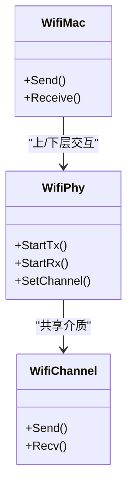

**图表来源**
- [wifi-mac.h](file://simulator/ns-3.39/src/wifi/model/wifi-mac.h)
- [wifi-phy.h](file://simulator/ns-3.39/src/wifi/model/wifi-phy.h)
- [wifi-channel.h](file://simulator/ns-3.39/src/wifi/model/wifi-channel.h)

**章节来源**
- [wifi-mac.h](file://simulator/ns-3.39/src/wifi/model/wifi-mac.h)
- [wifi-phy.h](file://simulator/ns-3.39/src/wifi/model/wifi-phy.h)
- [wifi-channel.h](file://simulator/ns-3.39/src/wifi/model/wifi-channel.h)

### 具体子系统示例：点对点链路
- 设计要点
  - NetDevice与Channel分离，便于替换链路特性（带宽、延迟、丢包）。
  - 通过Helper简化拓扑构建与参数配置。

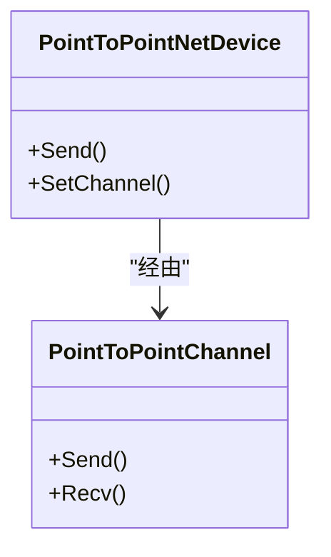

**图表来源**
- [point-to-point-net-device.h](file://simulator/ns-3.39/src/point-to-point/model/point-to-point-net-device.h)
- [point-to-point-channel.h](file://simulator/ns-3.39/src/point-to-point/model/point-to-point-channel.h)

**章节来源**
- [point-to-point-net-device.h](file://simulator/ns-3.39/src/point-to-point/model/point-to-point-net-device.h)
- [point-to-point-channel.h](file://simulator/ns-3.39/src/point-to-point/model/point-to-point-channel.h)

### 具体子系统示例：流量监控与分类
- 设计要点
  - FlowProbe记录单流指标；FlowClassifier将数据包映射到流。
  - 与观察者模式结合，输出统计报告。

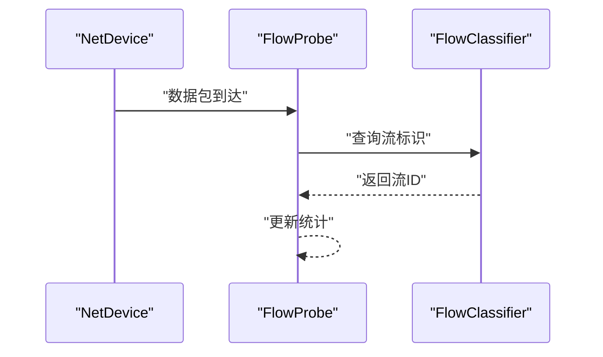

**图表来源**
- [flow-probe.h](file://simulator/ns-3.39/src/flow-monitor/model/flow-probe.h)
- [flow-classifier.h](file://simulator/ns-3.39/src/flow-monitor/model/flow-classifier.h)

**章节来源**
- [flow-probe.h](file://simulator/ns-3.39/src/flow-monitor/model/flow-probe.h)
- [flow-classifier.h](file://simulator/ns-3.39/src/flow-monitor/model/flow-classifier.h)

### 具体子系统示例：移动性模型
- 设计要点
  - MobilityModel抽象位置/速度演化；RandomWalk2D作为策略之一。
  - 与设备/信道解耦，便于替换/组合。

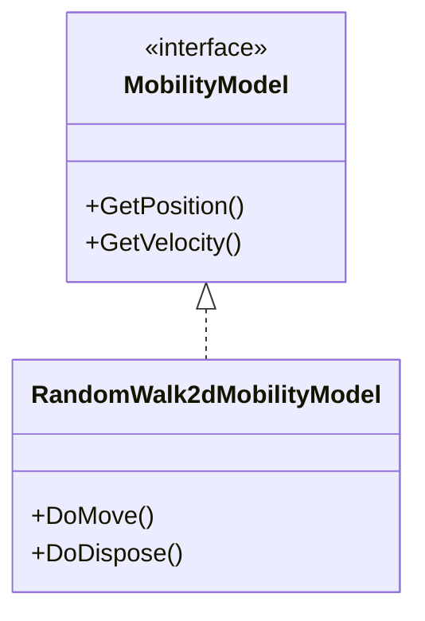

**图表来源**
- [mobility-model.h](file://simulator/ns-3.39/src/mobility/model/mobility-model.h)
- [random-walk-2d-mobility-model.h](file://simulator/ns-3.39/src/mobility/model/random-walk-2d-mobility-model.h)
- [random-walk-2d-mobility-model.cc](file://simulator/ns-3.39/src/mobility/model/random-walk-2d-mobility-model.cc)

**章节来源**
- [mobility-model.h](file://simulator/ns-3.39/src/mobility/model/mobility-model.h)
- [random-walk-2d-mobility-model.h](file://simulator/ns-3.39/src/mobility/model/random-walk-2d-mobility-model.h)
- [random-walk-2d-mobility-model.cc](file://simulator/ns-3.39/src/mobility/model/random-walk-2d-mobility-model.cc)

## 依赖关系分析
- 耦合与内聚
  - 核心对象与工厂高内聚，通过智能指针与引用计数低耦合。
  - 事件与调度器通过接口解耦，支持策略替换。
- 外部依赖
  - 属性系统与跟踪机制依赖核心对象模型。
  - 子模块（WiFi/Internet/Energy/Mobility）依赖核心抽象。

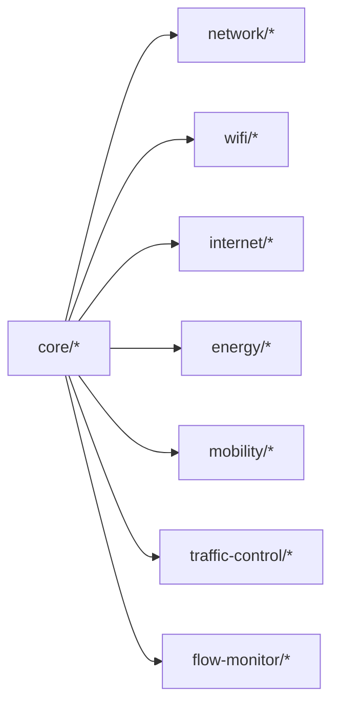

**图表来源**
- [object.h:88-447](file://simulator/ns-3.39/src/core/model/object.h#L88-L447)
- [simulator.h:67-531](file://simulator/ns-3.39/src/core/model/simulator.h#L67-L531)

**章节来源**
- [object.h:88-447](file://simulator/ns-3.39/src/core/model/object.h#L88-L447)
- [simulator.h:67-531](file://simulator/ns-3.39/src/core/model/simulator.h#L67-L531)

## 性能考量
- 事件调度
  - 使用高效调度器（如堆式）减少插入/提取开销；合理设置时间分辨率以平衡精度与范围。
- 内存管理
  - 借助SimpleRefCount与Ptr避免显式释放；聚合对象的Dispose链确保无泄漏。
- 观察与统计
  - 谨慎选择跟踪粒度，避免高频回调带来的额外开销。

## 故障排查指南
- 事件未触发
  - 检查是否正确调用Schedule/ScheduleNow；确认事件未被Cancel；核对当前时间与延迟。
- 对象生命周期问题
  - 确保聚合关系正确；在需要打破循环引用时调用Dispose。
- 能量源异常
  - 核对Adapter封装是否正确；检查回调是否注册；确认剩余能量非负。

**章节来源**
- [event-impl.h:45-81](file://simulator/ns-3.39/src/core/model/event-impl.h#L45-L81)
- [object.h:170-184](file://simulator/ns-3.39/src/core/model/object.h#L170-L184)
- [energy-source-adapter.cc](file://simulator/ns-3.39/src/energy/model/energy-source-adapter.cc)

## 结论
NS-3通过对象模型、工厂、事件调度与跟踪机制，构建了高度模块化与可扩展的仿真框架。工厂模式实现灵活装配，观察者模式提供可观测性，策略模式支持运行时替换，适配器模式统一异构接口。这些设计共同提升了系统的可维护性与可测试性，便于研究者快速迭代算法与评估性能。

## 附录
- 关键API路径参考
  - 对象与工厂：[object.h:88-447](file://simulator/ns-3.39/src/core/model/object.h#L88-L447)、[object-factory.h](file://simulator/ns-3.39/src/core/model/object-factory.h)
  - 时间与事件：[nstime.h:104-124](file://simulator/ns-3.39/src/core/model/nstime.h#L104-L124)、[event-impl.h:45-81](file://simulator/ns-3.39/src/core/model/event-impl.h#L45-L81)
  - 调度与运行：[simulator.h:67-531](file://simulator/ns-3.39/src/core/model/simulator.h#L67-L531)
  - 协议栈与流量控制：[internet-stack-helper.h](file://simulator/ns-3.39/src/internet/helper/internet-stack-helper.h)、[traffic-control-helper.h](file://simulator/ns-3.39/src/traffic-control/helper/traffic-control-helper.h)
  - 能量适配：[energy-source.h](file://simulator/ns-3.39/src/energy/model/energy-source.h)、[energy-source-adapter.h](file://simulator/ns-3.39/src/energy/model/energy-source-adapter.h)
  - 移动性：[mobility-model.h](file://simulator/ns-3.39/src/mobility/model/mobility-model.h)、[random-walk-2d-mobility-model.h](file://simulator/ns-3.39/src/mobility/model/random-walk-2d-mobility-model.h)