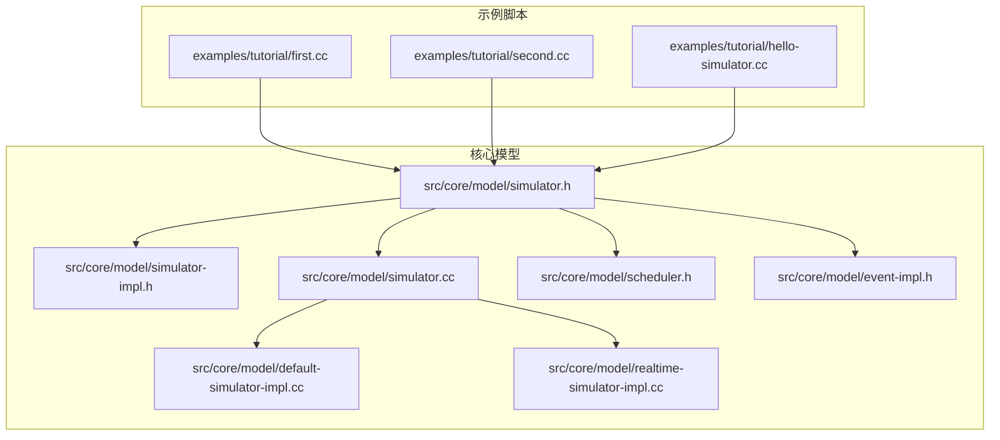
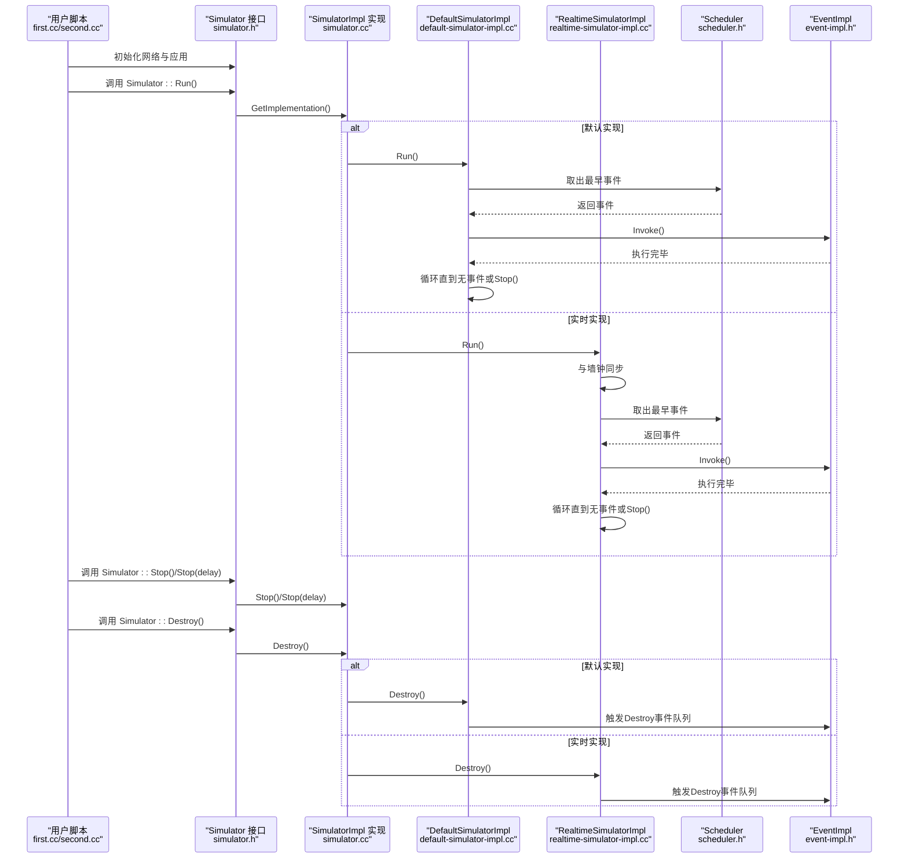
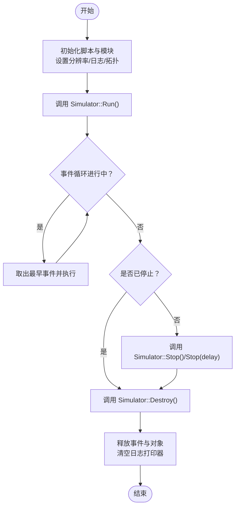
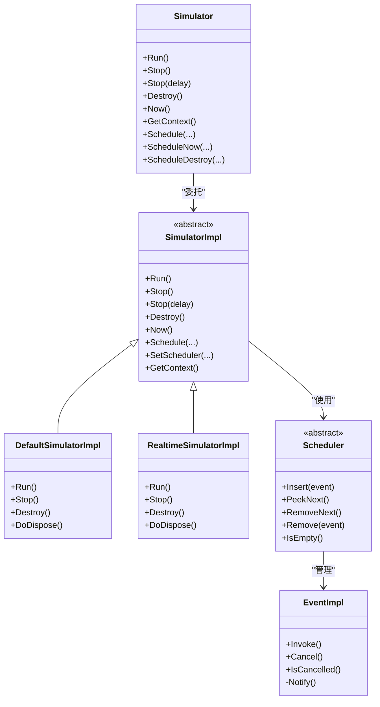
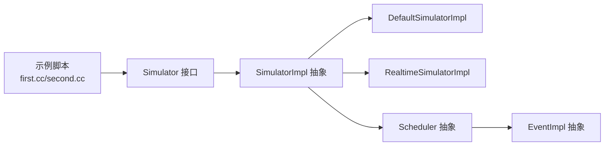

# 仿真生命周期管理

<cite>
**本文引用的文件**   
- [hello-simulator.cc](file://simulator/ns-3.39/examples/tutorial/hello-simulator.cc)
- [first.cc](file://simulator/ns-3.39/examples/tutorial/first.cc)
- [second.cc](file://simulator/ns-3.39/examples/tutorial/second.cc)
- [simulator.h](file://simulator/ns-3.39/src/core/model/simulator.h)
- [simulator-impl.h](file://simulator/ns-3.39/src/core/model/simulator-impl.h)
- [simulator.cc](file://simulator/ns-3.39/src/core/model/simulator.cc)
- [default-simulator-impl.cc](file://simulator/ns-3.39/src/core/model/default-simulator-impl.cc)
- [realtime-simulator-impl.cc](file://simulator/ns-3.39/src/core/model/realtime-simulator-impl.cc)
- [scheduler.h](file://simulator/ns-3.39/src/core/model/scheduler.h)
- [event-impl.h](file://simulator/ns-3.39/src/core/model/event-impl.h)
- [conceptual-overview.rst](file://simulator/ns-3.39/doc/tutorial/source/conceptual-overview.rst)
</cite>

## 目录
1. [引言](#引言)
2. [项目结构](#项目结构)
3. [核心组件](#核心组件)
4. [架构总览](#架构总览)
5. [详细组件分析](#详细组件分析)
6. [依赖关系分析](#依赖关系分析)
7. [性能考量](#性能考量)
8. [故障排查指南](#故障排查指南)
9. [结论](#结论)
10. [附录：脚本与最佳实践](#附录脚本与最佳实践)

## 引言
本文件面向使用 NS-3 的仿真工程师，系统化阐述“仿真生命周期管理”的完整流程与实现原理，覆盖从初始化、运行、暂停、停止到销毁的全过程；解释仿真状态管理、事件调度器启动、全局变量初始化、资源分配与清理机制；给出多仿真实例管理、仿真间切换与资源共享的指导；并提供可直接参考的脚本路径与调试技巧。

## 项目结构
NS-3 仿真脚本通常位于 examples 或 scratch 目录，核心仿真引擎位于 src/core/model。以下图示展示与仿真生命周期相关的关键文件与模块：

**图表来源**
- [first.cc:1-80](file://simulator/ns-3.39/examples/tutorial/first.cc#L1-L80)
- [second.cc:1-114](file://simulator/ns-3.39/examples/tutorial/second.cc#L1-L114)
- [hello-simulator.cc:1-28](file://simulator/ns-3.39/examples/tutorial/hello-simulator.cc#L1-L28)
- [simulator.h:67-126](file://simulator/ns-3.39/src/core/model/simulator.h#L67-L126)
- [simulator-impl.h:48-110](file://simulator/ns-3.39/src/core/model/simulator-impl.h#L48-L110)
- [simulator.cc:101-137](file://simulator/ns-3.39/src/core/model/simulator.cc#L101-L137)
- [default-simulator-impl.cc:43-103](file://simulator/ns-3.39/src/core/model/default-simulator-impl.cc#L43-L103)
- [realtime-simulator-impl.cc:89-113](file://simulator/ns-3.39/src/core/model/realtime-simulator-impl.cc#L89-L113)
- [scheduler.h:156-229](file://simulator/ns-3.39/src/core/model/scheduler.h#L156-L229)
- [event-impl.h:45-81](file://simulator/ns-3.39/src/core/model/event-impl.h#L45-L81)

**章节来源**
- [first.cc:1-80](file://simulator/ns-3.39/examples/tutorial/first.cc#L1-L80)
- [second.cc:1-114](file://simulator/ns-3.39/examples/tutorial/second.cc#L1-L114)
- [hello-simulator.cc:1-28](file://simulator/ns-3.39/examples/tutorial/hello-simulator.cc#L1-L28)

## 核心组件
- 仿真控制接口（Simulator）：提供 Run/Stop/Destroy 等静态方法，封装具体实现细节，暴露统一的生命周期控制入口。
- 仿真实现基类（SimulatorImpl）：定义 Run/Stop/Destroy/Schedule 等纯虚函数，作为不同实现（单线程/实时）的抽象。
- 默认实现（DefaultSimulatorImpl）：单线程事件驱动执行，按调度器顺序取出最早事件执行。
- 实时实现（RealtimeSimulatorImpl）：在默认实现基础上增加与墙钟同步器的协作，保证事件时间与现实时间对齐。
- 调度器（Scheduler）：维护未来事件列表（FEL），提供插入、取出、删除、判空等操作，支持多种实现（堆、链表、映射等）。
- 事件（EventImpl）：事件的抽象基类，包含 Invoke/Clear 等逻辑，由 MakeEvent 绑定目标函数与参数。

**章节来源**
- [simulator.h:67-126](file://simulator/ns-3.39/src/core/model/simulator.h#L67-L126)
- [simulator-impl.h:48-110](file://simulator/ns-3.39/src/core/model/simulator-impl.h#L48-L110)
- [default-simulator-impl.cc:43-103](file://simulator/ns-3.39/src/core/model/default-simulator-impl.cc#L43-L103)
- [realtime-simulator-impl.cc:89-113](file://simulator/ns-3.39/src/core/model/realtime-simulator-impl.cc#L89-L113)
- [scheduler.h:156-229](file://simulator/ns-3.39/src/core/model/scheduler.h#L156-L229)
- [event-impl.h:45-81](file://simulator/ns-3.39/src/core/model/event-impl.h#L45-L81)

## 架构总览
下图展示了从脚本入口到事件执行与销毁的整体流程，以及默认与实时两种实现的差异点。

**图表来源**
- [first.cc:76-77](file://simulator/ns-3.39/examples/tutorial/first.cc#L76-L77)
- [second.cc:110-111](file://simulator/ns-3.39/examples/tutorial/second.cc#L110-L111)
- [simulator.h:139-170](file://simulator/ns-3.39/src/core/model/simulator.h#L139-L170)
- [simulator.cc:175-196](file://simulator/ns-3.39/src/core/model/simulator.cc#L175-L196)
- [default-simulator-impl.cc:186-203](file://simulator/ns-3.39/src/core/model/default-simulator-impl.cc#L186-L203)
- [realtime-simulator-impl.cc:422-480](file://simulator/ns-3.39/src/core/model/realtime-simulator-impl.cc#L422-L480)
- [scheduler.h:192-220](file://simulator/ns-3.39/src/core/model/scheduler.h#L192-L220)
- [event-impl.h:56-77](file://simulator/ns-3.39/src/core/model/event-impl.h#L56-L77)

## 详细组件分析

### 生命周期阶段与控制流
- 初始化：脚本通过模块 API 创建节点、设备、栈与应用，并通过 Start/Stop 设置应用生命周期。同时设置时间分辨率与日志级别。
- 运行：调用 Simulator::Run() 启动事件循环，按调度器顺序取出最早事件执行，直至无事件或达到 Stop 条件。
- 暂停：通过 Simulator::Stop() 或 Schedule(delay, &Simulator::Stop) 触发停止标志，当前事件处理完后返回。
- 停止：Stop() 使 Run() 提前退出；若需要绝对时间停止，使用 Stop(delay)。
- 销毁：调用 Simulator::Destroy() 清理资源，触发所有“销毁时刻”事件，释放内部对象与调度器。

**图表来源**
- [first.cc:39-77](file://simulator/ns-3.39/examples/tutorial/first.cc#L39-L77)
- [second.cc:48-111](file://simulator/ns-3.39/examples/tutorial/second.cc#L48-L111)
- [simulator.h:139-170](file://simulator/ns-3.39/src/core/model/simulator.h#L139-L170)
- [simulator.cc:175-196](file://simulator/ns-3.39/src/core/model/simulator.cc#L175-L196)

**章节来源**
- [first.cc:39-77](file://simulator/ns-3.39/examples/tutorial/first.cc#L39-L77)
- [second.cc:48-111](file://simulator/ns-3.39/examples/tutorial/second.cc#L48-L111)
- [simulator.h:139-170](file://simulator/ns-3.39/src/core/model/simulator.h#L139-L170)
- [simulator.cc:175-196](file://simulator/ns-3.39/src/core/model/simulator.cc#L175-L196)

### 事件处理循环与调度器
- 事件模型：EventImpl 封装可调用体，通过 MakeEvent 绑定函数与参数；Scheduler 维护事件键（时间戳、唯一ID、上下文）。
- 调度器类型：支持多种实现（如 Map/List/Heap 等），复杂度与内存开销各异；可通过配置在运行时切换。
- 默认实现：单线程顺序执行，每次从 FEL 中取出最早事件并执行。
- 实时实现：在默认实现基础上加入与墙钟同步器交互，确保事件时间与现实时间一致。

**图表来源**
- [simulator.h:67-126](file://simulator/ns-3.39/src/core/model/simulator.h#L67-L126)
- [simulator-impl.h:48-110](file://simulator/ns-3.39/src/core/model/simulator-impl.h#L48-L110)
- [default-simulator-impl.cc:43-103](file://simulator/ns-3.39/src/core/model/default-simulator-impl.cc#L43-L103)
- [realtime-simulator-impl.cc:89-113](file://simulator/ns-3.39/src/core/model/realtime-simulator-impl.cc#L89-L113)
- [scheduler.h:156-229](file://simulator/ns-3.39/src/core/model/scheduler.h#L156-L229)
- [event-impl.h:45-81](file://simulator/ns-3.39/src/core/model/event-impl.h#L45-L81)

**章节来源**
- [scheduler.h:50-146](file://simulator/ns-3.39/src/core/model/scheduler.h#L50-L146)
- [default-simulator-impl.cc:186-203](file://simulator/ns-3.39/src/core/model/default-simulator-impl.cc#L186-L203)
- [realtime-simulator-impl.cc:422-480](file://simulator/ns-3.39/src/core/model/realtime-simulator-impl.cc#L422-L480)

### 全局变量初始化与日志打印器
- 全局值：通过 GlobalValue 定义 SimulatorImplementationType 与 SchedulerType，默认使用 MapScheduler 与 DefaultSimulatorImpl。
- 日志打印器：在获取 SimulatorImpl 之前避免递归调用，先创建实现再注册时间与节点打印器，防止栈溢出。

**章节来源**
- [simulator.cc:64-137](file://simulator/ns-3.39/src/core/model/simulator.cc#L64-L137)

### 多仿真实例管理与仿真间切换
- 上下文与并发：Simulator 支持带上下文的事件调度（ScheduleWithContext），用于区分不同逻辑进程或线程的安全边界。
- 切换策略：通过设置不同的 SimulatorImplementationType 与 SchedulerType，在同一进程中切换实现与调度策略；注意事件迁移与一致性校验。
- 资源共享：默认实现与实时实现均在 Destroy 阶段释放事件与内部对象，避免泄漏；实时实现额外负责销毁队列中的事件。

**章节来源**
- [simulator.h:197-203](file://simulator/ns-3.39/src/core/model/simulator.h#L197-L203)
- [simulator.h:258-304](file://simulator/ns-3.39/src/core/model/simulator.h#L258-L304)
- [default-simulator-impl.cc:74-103](file://simulator/ns-3.39/src/core/model/default-simulator-impl.cc#L74-L103)
- [realtime-simulator-impl.cc:102-113](file://simulator/ns-3.39/src/core/model/realtime-simulator-impl.cc#L102-L113)

## 依赖关系分析
- 脚本依赖：示例脚本仅依赖 Simulator 接口与模块 API，不直接耦合具体实现。
- 接口与实现：Simulator 将控制权委托给 SimulatorImpl；默认与实时实现分别满足常规与实时需求。
- 调度器解耦：Scheduler 抽象屏蔽了不同实现的复杂度，便于按场景选择与切换。

**图表来源**
- [first.cc:16-21](file://simulator/ns-3.39/examples/tutorial/first.cc#L16-L21)
- [second.cc:16-22](file://simulator/ns-3.39/examples/tutorial/second.cc#L16-L22)
- [simulator.h:67-126](file://simulator/ns-3.39/src/core/model/simulator.h#L67-L126)
- [simulator-impl.h:48-110](file://simulator/ns-3.39/src/core/model/simulator-impl.h#L48-L110)
- [scheduler.h:156-229](file://simulator/ns-3.39/src/core/model/scheduler.h#L156-L229)
- [event-impl.h:45-81](file://simulator/ns-3.39/src/core/model/event-impl.h#L45-L81)

**章节来源**
- [first.cc:16-21](file://simulator/ns-3.39/examples/tutorial/first.cc#L16-L21)
- [second.cc:16-22](file://simulator/ns-3.39/examples/tutorial/second.cc#L16-L22)

## 性能考量
- 调度器选择：根据事件规模与特性选择合适 Scheduler 实现；关注 Insert/RemoveNext 的时间复杂度与空间开销。
- 事件取消策略：频繁取消建议使用 Cancel（O(1)）而非 Remove（可能 O(n)），但不可用于“销毁时刻”事件。
- 时间分辨率：合理设置分辨率以平衡精度与性能；过细的分辨率会增加比较与排序成本。
- 实时同步：实时实现引入同步器与锁，需评估 CPU 与延迟影响。

**章节来源**
- [scheduler.h:54-146](file://simulator/ns-3.39/src/core/model/scheduler.h#L54-L146)
- [simulator.h:393-436](file://simulator/ns-3.39/src/core/model/simulator.h#L393-L436)

## 故障排查指南
- 栈溢出与递归：在获取 SimulatorImpl 前避免日志调用，防止因日志回调再次触发 Now()/GetImpl() 导致递归。
- 未调用 Destroy：若需在同一进程内重启仿真，必须显式调用 Destroy 并清空日志打印器，否则可能导致后续栈递归。
- 事件取消错误：对“销毁时刻”事件调用 Remove/Cancel 会导致程序错误，应遵循接口约束。
- 实时实现异常：实时实现停止时需确保工作线程安全退出与 Join，避免悬挂与资源泄漏。

**章节来源**
- [simulator.cc:105-137](file://simulator/ns-3.39/src/core/model/simulator.cc#L105-L137)
- [simulator.cc:144-159](file://simulator/ns-3.39/src/core/model/simulator.cc#L144-L159)
- [simulator.h:393-436](file://simulator/ns-3.39/src/core/model/simulator.h#L393-L436)
- [realtime-simulator-impl.cc:115-113](file://simulator/ns-3.39/src/core/model/realtime-simulator-impl.cc#L115-L113)

## 结论
NS-3 的仿真生命周期通过“接口抽象 + 多实现 + 调度器解耦”的设计，提供了清晰可控的生命周期管理能力。默认实现适合常规离线仿真，实时实现满足与现实时间对齐的需求。通过合理的调度器选择、事件管理策略与资源清理流程，可以高效地完成大规模仿真任务，并在多实例与切换场景中保持稳定性与可维护性。

## 附录：脚本与最佳实践

### 示例脚本路径
- 最简示例：[hello-simulator.cc:22-27](file://simulator/ns-3.39/examples/tutorial/hello-simulator.cc#L22-L27)
- 基础拓扑与应用：[first.cc:33-79](file://simulator/ns-3.39/examples/tutorial/first.cc#L33-L79)
- CSMA 拓扑与路由：[second.cc:36-113](file://simulator/ns-3.39/examples/tutorial/second.cc#L36-L113)

### 生命周期控制最佳实践
- 在脚本开头设置时间分辨率与日志级别，避免运行中频繁切换。
- 明确应用 Start/Stop 时间，确保事件序列完整且可预测。
- 使用 Destroy 清理资源，以便在同一进程内重启仿真。
- 对于长时间运行的仿真，优先使用 Cancel 而非 Remove 进行事件管理。

### 多仿真实例与切换
- 使用不同的 SimulatorImplementationType 与 SchedulerType 进行切换，注意事件迁移与一致性检查。
- 通过上下文（ScheduleWithContext）隔离不同逻辑进程，避免状态竞争。

### 调试技巧
- 利用概念性概述文档理解事件链路与执行顺序：[conceptual-overview.rst:688-709](file://simulator/ns-3.39/doc/tutorial/source/conceptual-overview.rst#L688-L709)
- 在关键点输出当前时间与事件计数，辅助定位卡顿或遗漏事件问题。