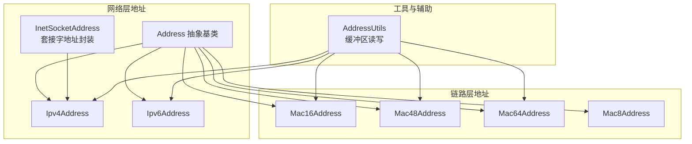
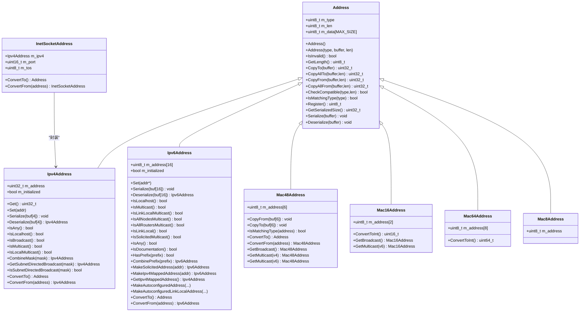
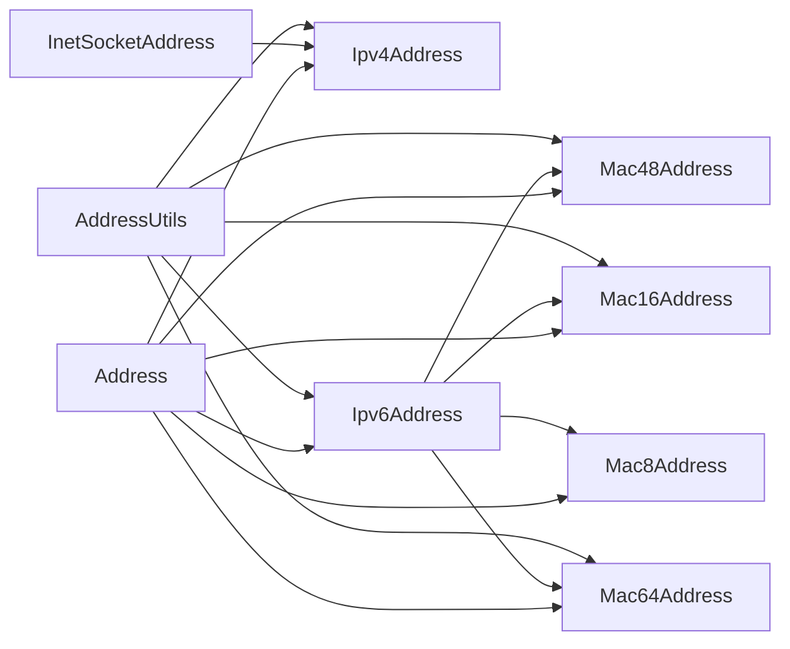

# 地址模型

<cite>
**本文引用的文件**
- [address.cc](file://simulator/ns-3.39/src/network/model/address.cc)
- [address.h](file://simulator/ns-3.39/src/network/utils/address.h)
- [ipv4-address.h](file://simulator/ns-3.39/src/network/utils/ipv4-address.h)
- [ipv4-address.cc](file://simulator/ns-3.39/src/network/utils/ipv4-address.cc)
- [ipv6-address.h](file://simulator/ns-3.39/src/network/utils/ipv6-address.h)
- [ipv6-address.cc](file://simulator/ns-3.39/src/network/utils/ipv6-address.cc)
- [mac48-address.cc](file://simulator/ns-3.39/src/network/utils/mac48-address.cc)
- [mac16-address.cc](file://simulator/ns-3.39/src/network/utils/mac16-address.cc)
- [mac64-address.cc](file://simulator/ns-3.39/src/network/utils/mac64-address.cc)
- [mac8-address.cc](file://simulator/ns-3.39/src/network/utils/mac8-address.cc)
- [address-utils.cc](file://simulator/ns-3.39/src/network/utils/address-utils.cc)
- [inet-socket-address.cc](file://simulator/ns-3.39/src/network/utils/inet-socket-address.cc)
- [ipv6-address-test-suite.cc](file://simulator/ns-3.39/src/network/test/ipv6-address-test-suite.cc)
</cite>

## 目录
1. [简介](#简介)
2. [项目结构](#项目结构)
3. [核心组件](#核心组件)
4. [架构总览](#架构总览)
5. [详细组件分析](#详细组件分析)
6. [依赖关系分析](#依赖关系分析)
7. [性能考量](#性能考量)
8. [故障排查指南](#故障排查指南)
9. [结论](#结论)
10. [附录：使用示例与最佳实践](#附录使用示例与最佳实践)

## 简介
本文件系统性梳理 NS-3 中“地址模型”的设计与实现，围绕抽象基类 Address 及其派生类型（IPv4、IPv6、MAC 系列）展开，覆盖以下主题：
- 设计理念：统一的多态地址抽象、类型注册与兼容性检测、序列化/反序列化接口
- 具体类型：IPv4、IPv6、MAC8/MAC16/MAC48/MAC64 的构造、比较、转换与专用工具函数
- 创建/比较/转换/序列化：如何从字符串或二进制构建地址对象，如何进行类型转换与序列化
- 协议应用：在不同网络层协议中的使用，如套接字地址封装（InetSocketAddress）
- 地址解析与映射：IPv4/IPv6 组播映射、IPv4 映射 IPv6、自动配置地址生成（基于 MAC 的 EUI-64）
- 范围检查与有效性验证：掩码匹配、前缀匹配、特殊地址判断
- 错误处理：断言、日志与异常策略
- 示例与最佳实践：常见用法、性能优化与扩展新地址类型的方法

## 项目结构
NS-3 的地址模型主要位于 network 模块的 utils 子目录中，并通过抽象基类 Address 提供统一接口；各具体地址类型均实现序列化/反序列化、类型注册与比较等通用能力。

图示来源
- [address.cc:34-180](file://simulator/ns-3.39/src/network/model/address.cc#L34-L180)
- [ipv4-address.cc:156-367](file://simulator/ns-3.39/src/network/utils/ipv4-address.cc#L156-L367)
- [ipv6-address.cc:152-694](file://simulator/ns-3.39/src/network/utils/ipv6-address.cc#L152-L694)
- [mac48-address.cc:69-184](file://simulator/ns-3.39/src/network/utils/mac48-address.cc#L69-L184)
- [mac16-address.cc:69-197](file://simulator/ns-3.39/src/network/utils/mac16-address.cc#L69-L197)
- [mac64-address.cc:69-216](file://simulator/ns-3.39/src/network/utils/mac64-address.cc#L69-L216)
- [mac8-address.cc:33-73](file://simulator/ns-3.39/src/network/utils/mac8-address.cc#L33-L73)
- [address-utils.cc:30-134](file://simulator/ns-3.39/src/network/utils/address-utils.cc#L30-L134)
- [inet-socket-address.cc:30-157](file://simulator/ns-3.39/src/network/utils/inet-socket-address.cc#L30-L157)

章节来源
- [address.cc:34-180](file://simulator/ns-3.39/src/network/model/address.cc#L34-L180)
- [ipv4-address.h:41-243](file://simulator/ns-3.39/src/network/utils/ipv4-address.h#L41-L243)
- [ipv6-address.h:48-445](file://simulator/ns-3.39/src/network/utils/ipv6-address.h#L48-L445)
- [mac48-address.cc:69-184](file://simulator/ns-3.39/src/network/utils/mac48-address.cc#L69-L184)
- [address-utils.cc:30-134](file://simulator/ns-3.39/src/network/utils/address-utils.cc#L30-L134)
- [inet-socket-address.cc:30-157](file://simulator/ns-3.39/src/network/utils/inet-socket-address.cc#L30-L157)

## 核心组件
- 抽象基类 Address：提供统一的类型注册、长度与数据拷贝、序列化/反序列化、比较运算符与兼容性检测
- IPv4Address/Ipv4Mask：32 位 IPv4 地址与掩码，支持字符串/整数构造、掩码匹配、子网广播计算
- IPv6Address/Ipv6Prefix：128 位 IPv6 地址与前缀，支持字符串构造、前缀组合、特殊地址判断、IPv4 映射
- MAC 地址族：Mac8/Mac16/Mac48/Mac64，支持字符串解析、类型转换、组播映射、自增分配
- 套接字地址 InetSocketAddress：将 IPv4 地址与端口封装为 Address 类型
- AddressUtils：提供向缓冲区写入/读取各类地址的便捷函数

章节来源
- [address.cc:34-180](file://simulator/ns-3.39/src/network/model/address.cc#L34-L180)
- [ipv4-address.cc:156-367](file://simulator/ns-3.39/src/network/utils/ipv4-address.cc#L156-L367)
- [ipv6-address.cc:152-694](file://simulator/ns-3.39/src/network/utils/ipv6-address.cc#L152-L694)
- [mac48-address.cc:69-184](file://simulator/ns-3.39/src/network/utils/mac48-address.cc#L69-L184)
- [inet-socket-address.cc:30-157](file://simulator/ns-3.39/src/network/utils/inet-socket-address.cc#L30-L157)
- [address-utils.cc:30-134](file://simulator/ns-3.39/src/network/utils/address-utils.cc#L30-L134)

## 架构总览
Address 抽象类定义了所有地址类型的共同接口，派生类各自实现特定格式的序列化/反序列化与语义判断。AddressUtils 提供跨类型的数据读写，InetSocketAddress 将传输层端口信息与网络层地址结合。

图示来源
- [address.cc:34-180](file://simulator/ns-3.39/src/network/model/address.cc#L34-L180)
- [ipv4-address.h:41-243](file://simulator/ns-3.39/src/network/utils/ipv4-address.h#L41-L243)
- [ipv6-address.h:48-445](file://simulator/ns-3.39/src/network/utils/ipv6-address.h#L48-L445)
- [mac48-address.cc:69-184](file://simulator/ns-3.39/src/network/utils/mac48-address.cc#L69-L184)
- [mac16-address.cc:69-197](file://simulator/ns-3.39/src/network/utils/mac16-address.cc#L69-L197)
- [mac64-address.cc:69-216](file://simulator/ns-3.39/src/network/utils/mac64-address.cc#L69-L216)
- [mac8-address.cc:33-73](file://simulator/ns-3.39/src/network/utils/mac8-address.cc#L33-L73)
- [inet-socket-address.cc:30-157](file://simulator/ns-3.39/src/network/utils/inet-socket-address.cc#L30-L157)

## 详细组件分析

### Address 抽象类
- 类职责：提供统一的多态地址接口，包括类型注册、长度控制、数据拷贝、序列化/反序列化、比较与兼容性检测
- 关键点：
  - 类型注册：通过静态 Register 返回唯一类型标识，用于区分不同地址类型
  - 兼容性检测：CheckCompatible 支持宽松匹配（零类型时允许长度一致即视为兼容）
  - 序列化：Serialize/Deserialize 与 CopyAllTo/CopyAllFrom 提供带类型/长度头的完整序列化
  - 比较：==/!=/< 实现按类型、长度与字节序的全序比较
- 性能：拷贝与比较均为 O(n)，其中 n 为地址长度；建议在频繁比较场景使用哈希表缓存

章节来源
- [address.cc:34-180](file://simulator/ns-3.39/src/network/model/address.cc#L34-L180)

### IPv4Address 与 Ipv4Mask
- 构造与解析：支持整数与点分十进制字符串；失败时标记未初始化并返回 0
- 掩码与网络计算：掩码支持 /n 与点分十进制两种输入；提供前缀长度、反掩码、子网定向广播等
- 特殊地址判断：Any/Localhost/Broadcast/Multicast/LocalMulticast
- 类型转换：ConvertTo/ConvertFrom 与 Address::Register 结合，确保类型一致性
- 序列化：4 字节网络序存储

章节来源
- [ipv4-address.h:41-243](file://simulator/ns-3.39/src/network/utils/ipv4-address.h#L41-L243)
- [ipv4-address.cc:156-367](file://simulator/ns-3.39/src/network/utils/ipv4-address.cc#L156-L367)

### IPv6Address 与 Ipv6Prefix
- 构造与解析：支持标准 IPv6 字符串；失败时标记未初始化
- 前缀与掩码：Ipv6Prefix 支持多种构造方式，可获取最小前缀长度
- 特殊地址判断：本地回环、多播、链路本地、文档地址、全节点/路由器多播等
- IPv4 映射：支持 IPv4 映射 IPv6 地址的生成与提取
- 自动配置：基于 MAC 地址生成 EUI-64 的自动配置地址（支持 Mac8/16/48/64）
- 链路本地多播：提供 Solicited 多播地址生成
- 序列化：16 字节网络序存储

章节来源
- [ipv6-address.h:48-445](file://simulator/ns-3.39/src/network/utils/ipv6-address.h#L48-L445)
- [ipv6-address.cc:152-694](file://simulator/ns-3.39/src/network/utils/ipv6-address.cc#L152-L694)

### MAC 地址族（Mac8/Mac16/Mac48/Mac64）
- 解析与序列化：支持冒号分隔的十六进制字符串；提供 CopyFrom/CopyTo
- 类型转换：ConvertTo/ConvertFrom 与 Address::Register 结合
- 组播映射：
  - Mac48：支持 IPv4/IPv6 组播映射
  - Mac16：支持 IPv6 组播映射
- 分配与广播：提供广播地址与自增分配（Simulator 生命周期内重置）

章节来源
- [mac48-address.cc:69-184](file://simulator/ns-3.39/src/network/utils/mac48-address.cc#L69-L184)
- [mac16-address.cc:69-197](file://simulator/ns-3.39/src/network/utils/mac16-address.cc#L69-L197)
- [mac64-address.cc:69-216](file://simulator/ns-3.39/src/network/utils/mac64-address.cc#L69-L216)
- [mac8-address.cc:33-73](file://simulator/ns-3.39/src/network/utils/mac8-address.cc#L33-L73)

### InetSocketAddress（套接字地址封装）
- 将 IPv4 地址与端口、TOS 封装为 Address，便于上层套接字使用
- 序列化：IPv4 4 字节 + 端口 2 字节 + TOS 1 字节，共 7 字节
- 类型检测：IsMatchingType 通过 CheckCompatible 判断长度与类型

章节来源
- [inet-socket-address.cc:30-157](file://simulator/ns-3.39/src/network/utils/inet-socket-address.cc#L30-L157)

### AddressUtils（缓冲区读写）
- WriteTo/ReadFrom：为 Ipv4Address、Ipv6Address、Address、Mac48/Mac64/Mac16 提供统一的缓冲区读写接口
- 多播判定：当前支持 IPv4 多播判断，IPv6 多播可扩展

章节来源
- [address-utils.cc:30-134](file://simulator/ns-3.39/src/network/utils/address-utils.cc#L30-L134)

## 依赖关系分析
- Address 是所有具体地址类型的基类，派生类通过 Address::Register 获取类型 ID 并实现类型检测
- IPv6Address 依赖 MAC 地址族以生成自动配置地址
- InetSocketAddress 依赖 Ipv4Address 进行地址封装
- AddressUtils 依赖各地址类型以实现通用读写

图示来源
- [address.cc:34-180](file://simulator/ns-3.39/src/network/model/address.cc#L34-L180)
- [ipv6-address.cc:279-305](file://simulator/ns-3.39/src/network/utils/ipv6-address.cc#L279-L305)
- [inet-socket-address.cc:113-157](file://simulator/ns-3.39/src/network/utils/inet-socket-address.cc#L113-L157)
- [address-utils.cc:30-134](file://simulator/ns-3.39/src/network/utils/address-utils.cc#L30-L134)

章节来源
- [address.cc:34-180](file://simulator/ns-3.39/src/network/model/address.cc#L34-L180)
- [ipv6-address.cc:279-305](file://simulator/ns-3.39/src/network/utils/ipv6-address.cc#L279-L305)
- [inet-socket-address.cc:113-157](file://simulator/ns-3.39/src/network/utils/inet-socket-address.cc#L113-L157)
- [address-utils.cc:30-134](file://simulator/ns-3.39/src/network/utils/address-utils.cc#L30-L134)

## 性能考量
- 比较与哈希：Address 的比较为字节级顺序比较，时间复杂度 O(n)；IPv4/IPv6 提供专用哈希类（如 Ipv4AddressHash、Ipv6AddressHash），用于容器键值优化
- 序列化开销：Address 的完整序列化包含类型与长度头，额外 2 字节；若仅需裸数据，可直接使用各类型 Serialize/GetBytes
- 断言与日志：大量 NS_ASSERT/NS_LOG 在调试阶段提升可靠性，但可能带来运行时开销；建议在发布版本中谨慎启用详细日志
- 内存布局：IPv4 使用 4 字节，IPv6 使用 16 字节，MAC48/64 分别为 6/8 字节；选择合适类型可降低内存占用

## 故障排查指南
- 无效地址与未初始化：
  - IPv4/IPv6 在解析失败时会标记未初始化，应先调用 IsInitialized 或 IsInvalid 进行判断
- 类型不匹配：
  - ConvertFrom 前务必调用 IsMatchingType 或 CheckCompatible，否则触发断言
- 多播映射问题：
  - Mac48/Mac16 的 IPv6 多播映射依赖 IPv6 地址的低 64 位；请确认传入地址有效
- 缓冲区读写：
  - AddressUtils 的 ReadFrom/WriteTo 需要与序列化长度严格对应，避免越界

章节来源
- [ipv4-address.cc:170-213](file://simulator/ns-3.39/src/network/utils/ipv4-address.cc#L170-L213)
- [ipv6-address.cc:173-222](file://simulator/ns-3.39/src/network/utils/ipv6-address.cc#L173-L222)
- [address-utils.cc:100-134](file://simulator/ns-3.39/src/network/utils/address-utils.cc#L100-L134)

## 结论
NS-3 的地址模型通过抽象基类 Address 提供统一接口，结合各具体类型（IPv4/IPv6/MAC）实现了跨协议的一致性与可扩展性。其设计强调：
- 类型安全：通过类型注册与兼容性检测避免误用
- 序列化友好：支持带类型头的完整序列化，便于跨模块传递
- 功能完备：涵盖掩码/前缀、多播映射、IPv4 映射、自动配置等常用能力
- 易于扩展：新增地址类型只需实现序列化、类型检测与转换接口

## 附录：使用示例与最佳实践

### 常见用法路径（以文件路径代替代码片段）
- 创建 IPv4 地址并判断类型
  - [ipv4-address.cc:170-213](file://simulator/ns-3.39/src/network/utils/ipv4-address.cc#L170-L213)
  - [ipv4-address.cc:331-367](file://simulator/ns-3.3.39/src/network/utils/ipv4-address.cc#L331-L367)
- 创建 IPv6 地址并生成自动配置地址
  - [ipv6-address.cc:279-305](file://simulator/ns-3.39/src/network/utils/ipv6-address.cc#L279-L305)
  - [ipv6-address.cc:314-370](file://simulator/ns-3.39/src/network/utils/ipv6-address.cc#L314-L370)
- MAC 地址解析与组播映射
  - [mac48-address.cc:225-283](file://simulator/ns-3.39/src/network/utils/mac48-address.cc#L225-L283)
  - [mac16-address.cc:209-225](file://simulator/ns-3.39/src/network/utils/mac16-address.cc#L209-L225)
- 套接字地址封装
  - [inet-socket-address.cc:113-157](file://simulator/ns-3.39/src/network/utils/inet-socket-address.cc#L113-L157)
- 缓冲区读写与多播判定
  - [address-utils.cc:30-134](file://simulator/ns-3.39/src/network/utils/address-utils.cc#L30-L134)
  - [address-utils.cc:139-151](file://simulator/ns-3.39/src/network/utils/address-utils.cc#L139-L151)

### 最佳实践
- 优先使用专用类型（如 Ipv4Address/Ipv6Address/Mac48Address）而非 Address，以获得更强的类型约束与功能
- 在容器中使用哈希类（如 Ipv4AddressHash/Ipv6AddressHash）作为键，提高查找效率
- 对外传输前统一使用 Address 的完整序列化（含类型/长度头），并在接收端进行类型校验
- IPv6 自动配置地址生成时，确保传入的 MAC 类型与前缀有效
- 多播映射时注意 IPv4/IPv6 的差异与边界条件

### 扩展新地址类型步骤
- 定义类并继承 Address（或直接实现序列化/反序列化接口）
- 实现：
  - 构造函数（字符串/二进制）
  - Serialize/Deserialize
  - ConvertTo/ConvertFrom
  - IsMatchingType
  - GetType：调用 Address::Register 返回唯一类型 ID
- 在 AddressUtils 中补充对应的 WriteTo/ReadFrom 重载，以便统一序列化
- 添加必要的有效性检查与日志输出，保证健壮性

章节来源
- [address.cc:34-180](file://simulator/ns-3.39/src/network/model/address.cc#L34-L180)
- [ipv6-address.cc:279-305](file://simulator/ns-3.39/src/network/utils/ipv6-address.cc#L279-L305)
- [address-utils.cc:30-134](file://simulator/ns-3.39/src/network/utils/address-utils.cc#L30-L134)