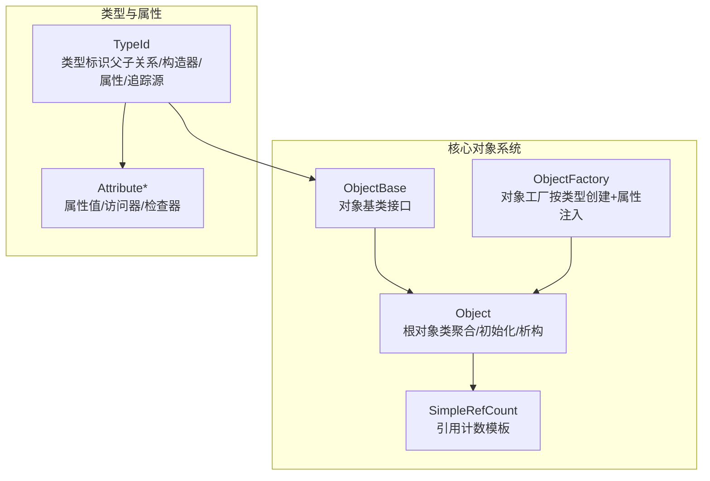
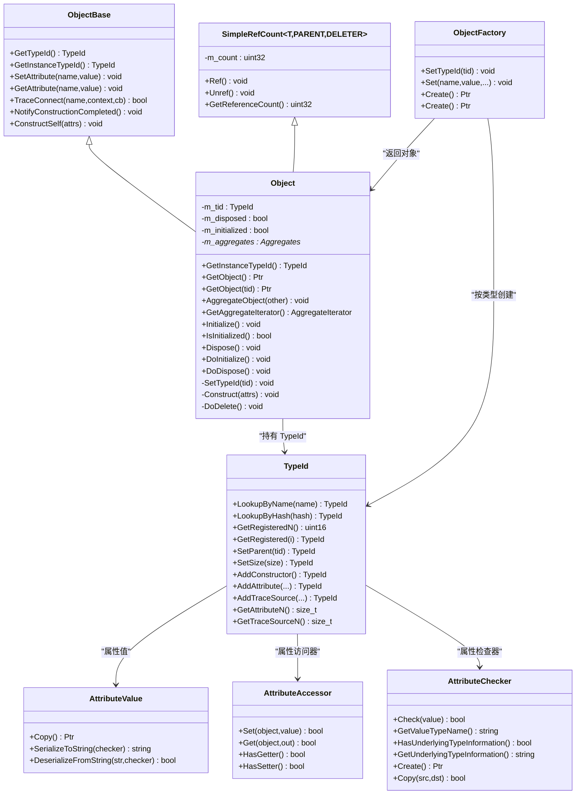
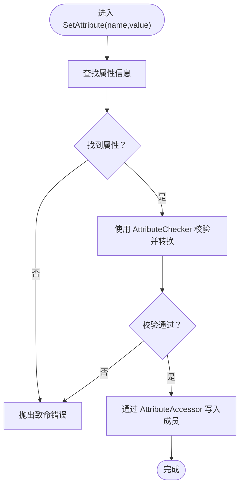
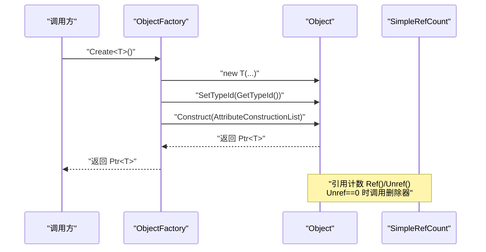
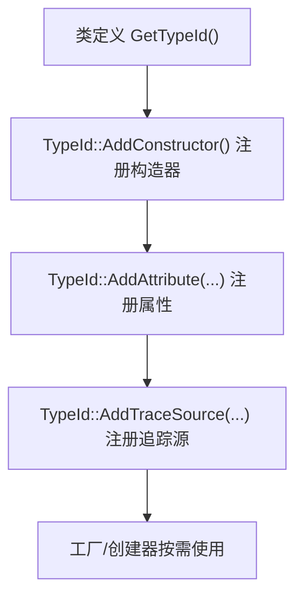
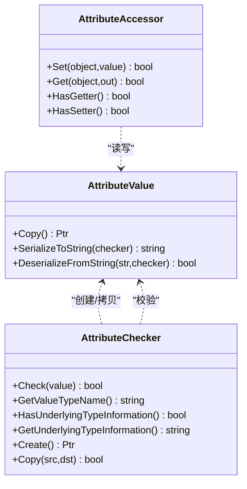
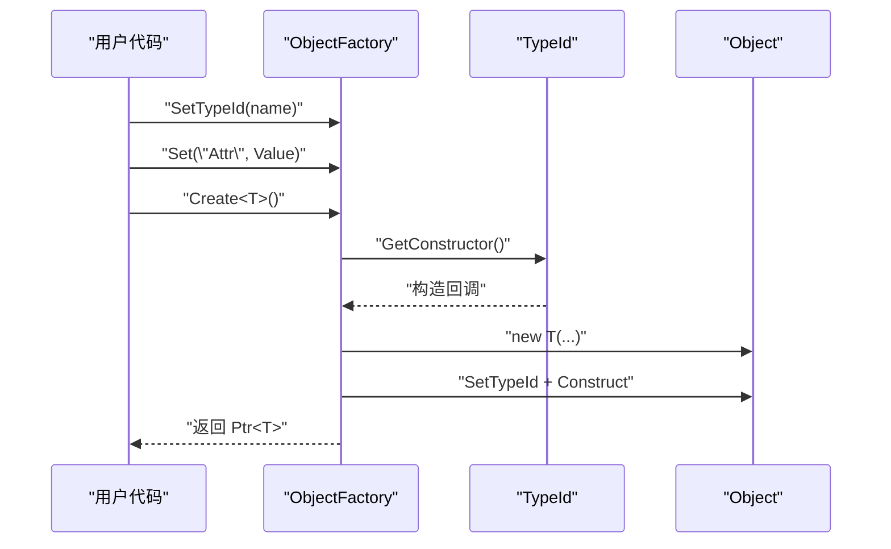
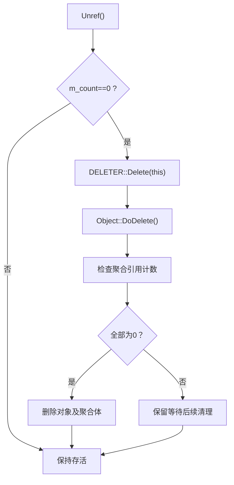
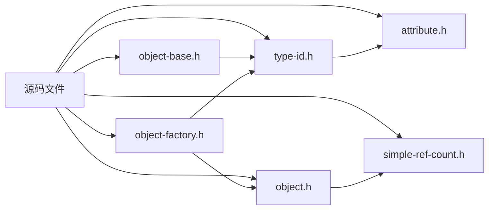

# 对象系统基础

<cite>
**本文档引用的文件**
- [object-base.h](file://simulator/ns-3.39/src/core/model/object-base.h)
- [object.h](file://simulator/ns-3.39/src/core/model/object.h)
- [type-id.h](file://simulator/ns-3.39/src/core/model/type-id.h)
- [attribute.h](file://simulator/ns-3.39/src/core/model/attribute.h)
- [object-factory.h](file://simulator/ns-3.39/src/core/model/object-factory.h)
- [simple-ref-count.h](file://simulator/ns-3.39/src/core/model/simple-ref-count.h)
- [first.cc](file://simulator/ns-3.39/examples/tutorial/first.cc)
</cite>

## 目录
1. [引言](#引言)
2. [项目结构](#项目结构)
3. [核心组件](#核心组件)
4. [架构总览](#架构总览)
5. [详细组件分析](#详细组件分析)
6. [依赖关系分析](#依赖关系分析)
7. [性能考量](#性能考量)
8. [故障排查指南](#故障排查指南)
9. [结论](#结论)
10. [附录：最佳实践与示例路径](#附录最佳实践与示例路径)

## 引言
本文件系统性梳理 NS-3 的对象系统基础设施，围绕 Object 基类、TypeId 类型标识系统、属性系统与工厂模式展开，解释对象注册机制、类型识别、属性访问器与修改器、对象生命周期管理、内存与引用计数、对象销毁策略，并给出可直接定位到源码的示例路径，帮助读者快速上手并正确使用该体系。

## 项目结构
NS-3 的对象系统位于 core 模块的 model 子目录中，关键文件如下：
- 对象基类与层次：object-base.h、object.h
- 类型标识系统：type-id.h
- 属性系统：attribute.h
- 工厂模式：object-factory.h
- 引用计数与智能指针支持：simple-ref-count.h
- 示例脚本：examples/tutorial/first.cc（演示属性设置）

**图表来源**
- [object-base.h:172-341](file://simulator/ns-3.39/src/core/model/object-base.h#L172-L341)
- [object.h:88-447](file://simulator/ns-3.39/src/core/model/object.h#L88-L447)
- [type-id.h:58-670](file://simulator/ns-3.39/src/core/model/type-id.h#L58-L670)
- [attribute.h:69-326](file://simulator/ns-3.39/src/core/model/attribute.h#L69-L326)
- [object-factory.h:47-172](file://simulator/ns-3.39/src/core/model/object-factory.h#L47-L172)
- [simple-ref-count.h:79-155](file://simulator/ns-3.39/src/core/model/simple-ref-count.h#L79-L155)

**章节来源**
- [object-base.h:172-341](file://simulator/ns-3.39/src/core/model/object-base.h#L172-L341)
- [object.h:88-447](file://simulator/ns-3.39/src/core/model/object.h#L88-L447)
- [type-id.h:58-670](file://simulator/ns-3.39/src/core/model/type-id.h#L58-L670)
- [attribute.h:69-326](file://simulator/ns-3.39/src/core/model/attribute.h#L69-L326)
- [object-factory.h:47-172](file://simulator/ns-3.39/src/core/model/object-factory.h#L47-L172)
- [simple-ref-count.h:79-155](file://simulator/ns-3.39/src/core/model/simple-ref-count.h#L79-L155)

## 核心组件
- ObjectBase：面向对象系统的“锚点”，为每个对象实例绑定 TypeId，并提供统一的属性读写与追踪源连接接口；负责在构造完成后通知派生类完成最终初始化。
- Object：继承自 SimpleRefCount<Object,ObjectBase,ObjectDeleter>，提供对象聚合、初始化/销毁生命周期钩子、Dispose 机制以打破引用环、以及通过 GetObject/AggregateObject 实现的弱耦合组合关系。
- TypeId：类型标识与元数据容器，记录父类型、构造器、属性、追踪源等信息；提供按名称/哈希/索引查询能力。
- Attribute 系统：AttributeValue（值封装）、AttributeAccessor（读取/写入）、AttributeChecker（类型与范围校验），三者协作实现属性的类型安全与序列化。
- ObjectFactory：按 TypeId 创建对象并自动注入属性，是工厂模式在 NS-3 中的具体实现。
- SimpleRefCount：基于 CRTP 的轻量引用计数模板，Unref 到零时调用自定义删除器，避免虚析构成本。

**章节来源**
- [object-base.h:172-341](file://simulator/ns-3.39/src/core/model/object-base.h#L172-L341)
- [object.h:88-447](file://simulator/ns-3.39/src/core/model/object.h#L88-L447)
- [type-id.h:58-670](file://simulator/ns-3.39/src/core/model/type-id.h#L58-L670)
- [attribute.h:69-326](file://simulator/ns-3.39/src/core/model/attribute.h#L69-L326)
- [object-factory.h:47-172](file://simulator/ns-3.39/src/core/model/object-factory.h#L47-L172)
- [simple-ref-count.h:79-155](file://simulator/ns-3.39/src/core/model/simple-ref-count.h#L79-L155)

## 架构总览
NS-3 对象系统采用“类型驱动 + 属性驱动”的设计：每个类通过 TypeId 注册自身元信息（构造器、属性、追踪源），对象实例由工厂或 CreateObject 创建，随后通过属性系统完成成员变量的初始化与运行期修改；生命周期通过引用计数与 Dispose 钩子管理，聚合关系提供松耦合的组合能力。

**图表来源**
- [object-base.h:172-341](file://simulator/ns-3.39/src/core/model/object-base.h#L172-L341)
- [object.h:88-447](file://simulator/ns-3.39/src/core/model/object.h#L88-L447)
- [type-id.h:58-670](file://simulator/ns-3.39/src/core/model/type-id.h#L58-L670)
- [attribute.h:69-326](file://simulator/ns-3.39/src/core/model/attribute.h#L69-L326)
- [object-factory.h:47-172](file://simulator/ns-3.39/src/core/model/object-factory.h#L47-L172)
- [simple-ref-count.h:79-155](file://simulator/ns-3.39/src/core/model/simple-ref-count.h#L79-L155)

## 详细组件分析

### ObjectBase：对象基类与属性/追踪接口
- 职责：为对象提供统一的 TypeId 查询、属性读写（带/不带致命错误）、追踪源连接/断开、构造完成通知。
- 关键点：
  - SetAttribute/GetAttribute 与 SetAttributeFailSafe/GetAttributeFailSafe 提供两种行为模式（失败即致命 vs 安静失败）。
  - NotifyConstructionCompleted 在成员属性初始化后被调用，派生类可重载以执行后置逻辑。
  - ConstructSelf 接受 AttributeConstructionList，用于在创建阶段注入初始值。

**图表来源**
- [object-base.h:212-250](file://simulator/ns-3.39/src/core/model/object-base.h#L212-L250)
- [attribute.h:115-151](file://simulator/ns-3.39/src/core/model/attribute.h#L115-L151)

**章节来源**
- [object-base.h:172-341](file://simulator/ns-3.39/src/core/model/object-base.h#L172-L341)
- [attribute.h:69-326](file://simulator/ns-3.39/src/core/model/attribute.h#L69-L326)

### Object：对象生命周期与聚合
- 继承链：SimpleRefCount<Object,ObjectBase,ObjectDeleter>，结合引用计数与自定义删除器实现自动内存管理。
- 生命周期：
  - Initialize/DoInitialize：仅在首次初始化时调用，适合一次性资源准备。
  - Dispose/DoDispose：在对象或其聚合体不再被引用时触发，适合释放资源、打断循环引用。
  - DoDelete：内部尝试删除对象及其聚合体，前提是它们的引用计数均为零。
- 聚合：
  - AggregateObject 将两个对象聚合，彼此可通过 GetObject 查找对方。
  - AggregateIterator 支持遍历聚合对象集合。
- 辅助模板：
  - CopyObject：浅拷贝对象（不复制聚合关系）。
  - CompleteConstruct/GetObject<T>()：创建对象并设置 TypeId、属性初始化、类型安全获取。

**图表来源**
- [object.h:88-447](file://simulator/ns-3.39/src/core/model/object.h#L88-L447)
- [object-factory.h:205-234](file://simulator/ns-3.39/src/core/model/object-factory.h#L205-L234)
- [simple-ref-count.h:114-133](file://simulator/ns-3.39/src/core/model/simple-ref-count.h#L114-L133)

**章节来源**
- [object.h:88-447](file://simulator/ns-3.39/src/core/model/object.h#L88-L447)
- [object-factory.h:47-172](file://simulator/ns-3.39/src/core/model/object-factory.h#L47-L172)
- [simple-ref-count.h:79-155](file://simulator/ns-3.39/src/core/model/simple-ref-count.h#L79-L155)

### TypeId：类型标识与元数据
- 能力：
  - 名称/哈希/索引查询：LookupByName/LookupByHash/GetRegistered。
  - 父类型关系：SetParent/SetParent<T>()，IsChildOf/GetParent。
  - 元信息注册：AddConstructor<T>()、AddAttribute(...)、AddTraceSource(...)。
  - 文档控制：HideFromDocumentation、MustHideFromDocumentation。
- 使用场景：
  - 工厂创建对象时通过构造器回调实例化。
  - 属性系统通过 AttributeInformation 访问属性元数据。
  - 追踪系统通过 TraceSourceInformation 连接回调。

**图表来源**
- [type-id.h:311-460](file://simulator/ns-3.39/src/core/model/type-id.h#L311-L460)

**章节来源**
- [type-id.h:58-670](file://simulator/ns-3.39/src/core/model/type-id.h#L58-L670)

### 属性系统：AttributeValue/Accessor/Checker
- AttributeValue：值的抽象封装，支持深拷贝、序列化/反序列化。
- AttributeAccessor：对具体成员的读取/写入封装，HasGetter/HasSetter 标识能力。
- AttributeChecker：类型与取值范围校验，提供底层类型信息与创建临时值的能力。
- 协作流程：TypeId 注册属性时绑定 Accessor/Checker；ObjectBase::SetAttribute 通过 Checker 校验、Accessor 写入。

**图表来源**
- [attribute.h:69-326](file://simulator/ns-3.39/src/core/model/attribute.h#L69-L326)

**章节来源**
- [attribute.h:69-326](file://simulator/ns-3.39/src/core/model/attribute.h#L69-L326)

### 工厂模式：ObjectFactory
- 功能：配置 TypeId 与一组属性，在 Create 时创建对象并自动注入属性。
- 语法糖：
  - ObjectFactory::Create<T>() 返回指定类型的 Ptr。
  - CreateObjectWithAttributes(...) 直接按类型创建并设置属性。
- 适用场景：模块化构建网络拓扑、设备、协议栈组件，统一通过属性驱动配置。

**图表来源**
- [object-factory.h:205-234](file://simulator/ns-3.39/src/core/model/object-factory.h#L205-L234)
- [type-id.h:274-279](file://simulator/ns-3.39/src/core/model/type-id.h#L274-L279)

**章节来源**
- [object-factory.h:47-172](file://simulator/ns-3.39/src/core/model/object-factory.h#L47-L172)
- [type-id.h:274-279](file://simulator/ns-3.39/src/core/model/type-id.h#L274-L279)

### 引用计数与对象销毁：SimpleRefCount 与 ObjectDeleter
- SimpleRefCount：维护引用计数，Unref 减少计数至零时调用 DELETER::Delete。
- ObjectDeleter：委托给 Object::DoDelete，后者再依次检查聚合对象引用计数并删除。
- 最佳实践：
  - 避免循环引用；必要时显式调用 Dispose 打破环。
  - 不要手动 delete，始终通过 Ptr 和引用计数管理生命周期。

**图表来源**
- [simple-ref-count.h:114-133](file://simulator/ns-3.39/src/core/model/simple-ref-count.h#L114-L133)
- [object.h:415-415](file://simulator/ns-3.39/src/core/model/object.h#L415-L415)

**章节来源**
- [simple-ref-count.h:79-155](file://simulator/ns-3.39/src/core/model/simple-ref-count.h#L79-L155)
- [object.h:88-447](file://simulator/ns-3.39/src/core/model/object.h#L88-L447)

## 依赖关系分析
- Object 依赖 SimpleRefCount 以获得引用计数与自动删除能力。
- ObjectBase 依赖 TypeId 以进行类型识别与属性系统交互。
- TypeId 依赖 AttributeAccessor/AttributeChecker/AttributeValue 以描述属性与追踪源。
- ObjectFactory 依赖 TypeId 与 AttributeConstructionList 以创建对象并注入属性。
- Object 通过聚合关系与其他对象建立弱耦合联系，避免强依赖导致的编译期耦合。

**图表来源**
- [object-base.h:172-341](file://simulator/ns-3.39/src/core/model/object-base.h#L172-L341)
- [object.h:88-447](file://simulator/ns-3.39/src/core/model/object.h#L88-L447)
- [type-id.h:58-670](file://simulator/ns-3.39/src/core/model/type-id.h#L58-L670)
- [attribute.h:69-326](file://simulator/ns-3.39/src/core/model/attribute.h#L69-L326)
- [object-factory.h:47-172](file://simulator/ns-3.39/src/core/model/object-factory.h#L47-L172)
- [simple-ref-count.h:79-155](file://simulator/ns-3.39/src/core/model/simple-ref-count.h#L79-L155)

**章节来源**
- [object-base.h:172-341](file://simulator/ns-3.39/src/core/model/object-base.h#L172-L341)
- [object.h:88-447](file://simulator/ns-3.39/src/core/model/object.h#L88-L447)
- [type-id.h:58-670](file://simulator/ns-3.39/src/core/model/type-id.h#L58-L670)
- [attribute.h:69-326](file://simulator/ns-3.39/src/core/model/attribute.h#L69-L326)
- [object-factory.h:47-172](file://simulator/ns-3.39/src/core/model/object-factory.h#L47-L172)
- [simple-ref-count.h:79-155](file://simulator/ns-3.39/src/core/model/simple-ref-count.h#L79-L155)

## 性能考量
- 引用计数操作为常数时间，但频繁 Ref/Unref 仍带来原子性与缓存局部性开销；建议减少不必要的对象创建与销毁。
- 属性系统在运行期进行类型校验与字符串序列化/反序列化，批量设置属性时优先使用对象工厂一次性注入，避免多次反射式查找。
- 聚合对象列表的访问排序启发式（GetObject 访问计数）有助于提升后续查找效率，但应避免过度聚合导致的遍历成本上升。

## 故障排查指南
- 致命错误的属性设置/读取：
  - 现象：调用 SetAttribute/GetAttribute 抛出致命错误。
  - 排查：确认属性名存在、具备对应 Getter/Setter、类型匹配且可序列化。
  - 参考：[object-base.h:212-250](file://simulator/ns-3.39/src/core/model/object-base.h#L212-L250)
- 属性设置静默失败：
  - 现象：SetAttributeFailSafe 返回 false。
  - 排查：检查属性是否存在、是否允许在当前阶段设置、值是否合法。
  - 参考：[object-base.h:224-224](file://simulator/ns-3.39/src/core/model/object-base.h#L224-L224)
- 对象未释放或内存泄漏：
  - 现象：引用计数长期大于零、对象无法销毁。
  - 排查：检查是否存在循环引用、是否遗漏 Dispose、是否仍有外部持有 Ptr。
  - 参考：[simple-ref-count.h:114-133](file://simulator/ns-3.39/src/core/model/simple-ref-count.h#L114-L133)，[object.h:415-415](file://simulator/ns-3.39/src/core/model/object.h#L415-L415)
- 类型未注册或构造失败：
  - 现象：创建对象时报错或类型信息缺失。
  - 排查：确保类已实现 GetTypeId 并通过 NS_OBJECT_ENSURE_REGISTERED 注册，构造器已通过 AddConstructor 注册。
  - 参考：[object-base.h:46-57](file://simulator/ns-3.39/src/core/model/object-base.h#L46-L57)，[type-id.h:359-360](file://simulator/ns-3.39/src/core/model/type-id.h#L359-L360)

**章节来源**
- [object-base.h:212-250](file://simulator/ns-3.39/src/core/model/object-base.h#L212-L250)
- [simple-ref-count.h:114-133](file://simulator/ns-3.39/src/core/model/simple-ref-count.h#L114-L133)
- [object.h:415-415](file://simulator/ns-3.39/src/core/model/object.h#L415-L415)
- [object-base.h:46-57](file://simulator/ns-3.39/src/core/model/object-base.h#L46-L57)
- [type-id.h:359-360](file://simulator/ns-3.39/src/core/model/type-id.h#L359-L360)

## 结论
NS-3 的对象系统以 TypeId 为核心，将类型识别、属性系统与工厂模式有机融合，配合引用计数与聚合机制，实现了高内聚、低耦合的对象生命周期管理。遵循本文档的注册、属性与工厂使用规范，可有效避免常见陷阱，提升仿真脚本的可维护性与性能。

## 附录：最佳实践与示例路径
- 自定义对象步骤（无代码示例，仅路径）
  - 定义类并实现静态 GetTypeId：[object-base.h:179-179](file://simulator/ns-3.39/src/core/model/object-base.h#L179-L179)
  - 在类实现文件末尾添加注册宏：[object-base.h:46-57](file://simulator/ns-3.39/src/core/model/object-base.h#L46-L57)
  - 在 GetTypeId 中注册构造器与属性：[type-id.h:359-360](file://simulator/ns-3.39/src/core/model/type-id.h#L359-L360)，[type-id.h:384-430](file://simulator/ns-3.39/src/core/model/type-id.h#L384-L430)
  - 如需模板实例化，使用模板注册宏：[object-base.h:78-94](file://simulator/ns-3.39/src/core/model/object-base.h#L78-L94)
- 使用工厂创建并设置属性
  - 通过 ObjectFactory 设置属性并创建对象：[object-factory.h:205-234](file://simulator/ns-3.39/src/core/model/object-factory.h#L205-L234)
  - 或使用 CreateObjectWithAttributes 便捷函数：[object-factory.h:226-234](file://simulator/ns-3.39/src/core/model/object-factory.h#L226-L234)
- 示例脚本（属性设置）
  - 点对点链路设备属性设置示例：[first.cc:46-48](file://simulator/ns-3.39/examples/tutorial/first.cc#L46-L48)
  - 应用层客户端属性设置示例：[first.cc:68-70](file://simulator/ns-3.39/examples/tutorial/first.cc#L68-L70)
- 生命周期与内存管理
  - 初始化/销毁钩子：[object.h:260-276](file://simulator/ns-3.39/src/core/model/object.h#L260-L276)
  - 引用计数与删除器：[simple-ref-count.h:114-133](file://simulator/ns-3.39/src/core/model/simple-ref-count.h#L114-L133)，[object.h:464-467](file://simulator/ns-3.39/src/core/model/object.h#L464-L467)