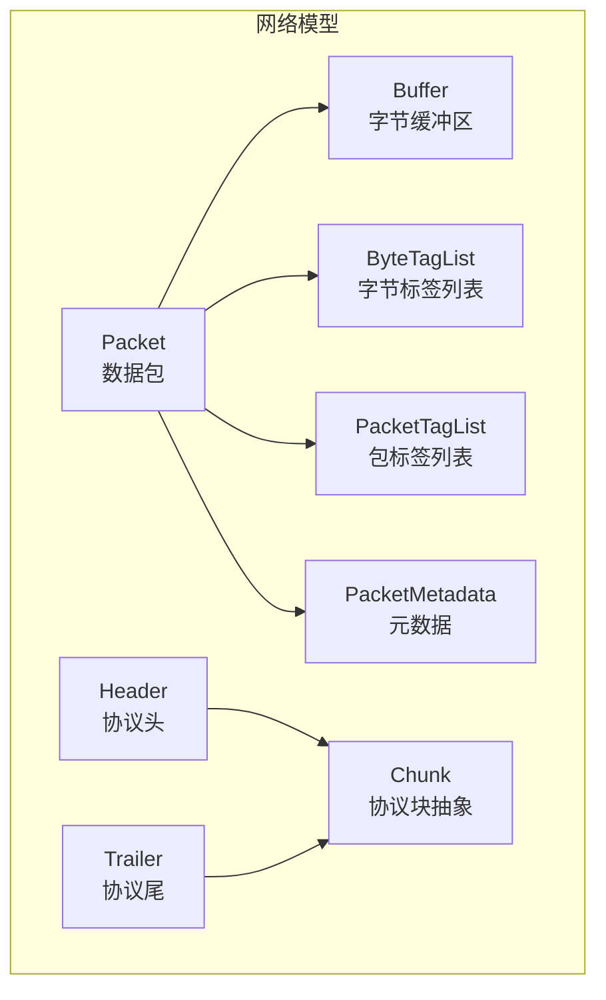
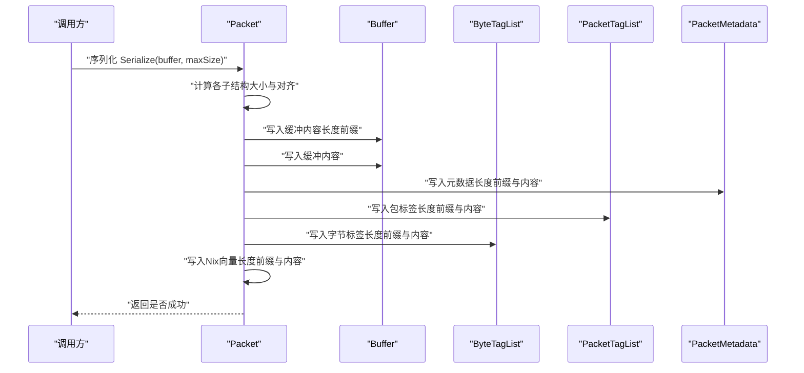
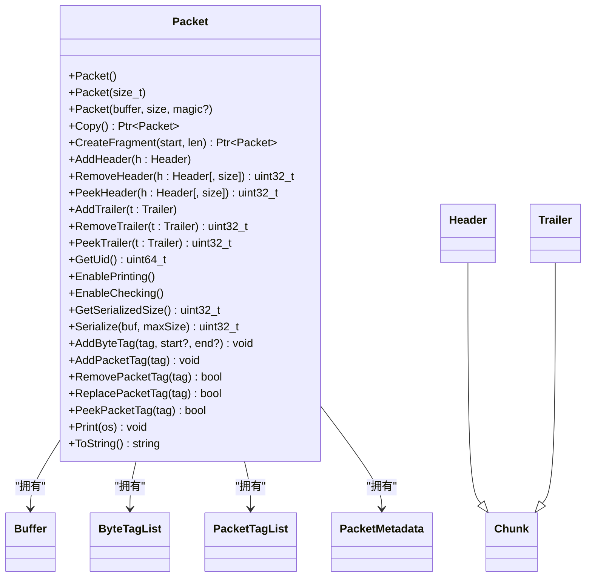
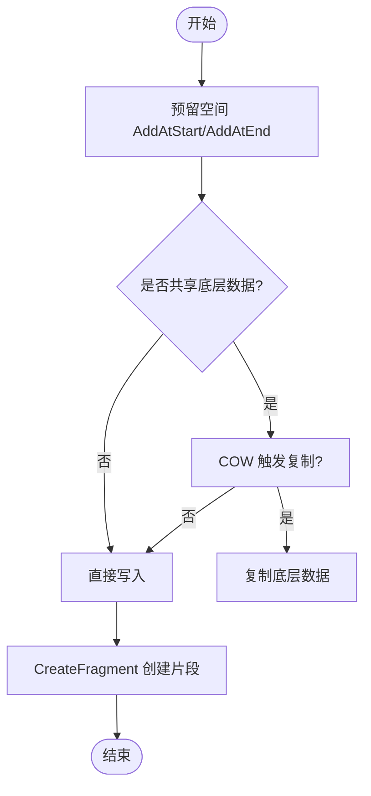
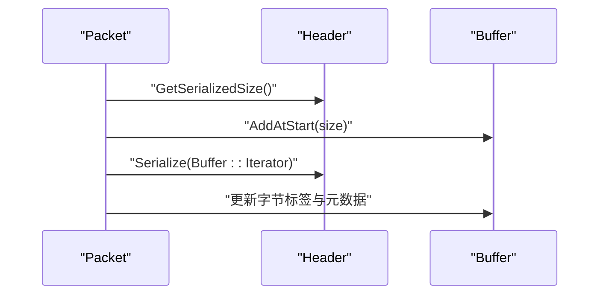
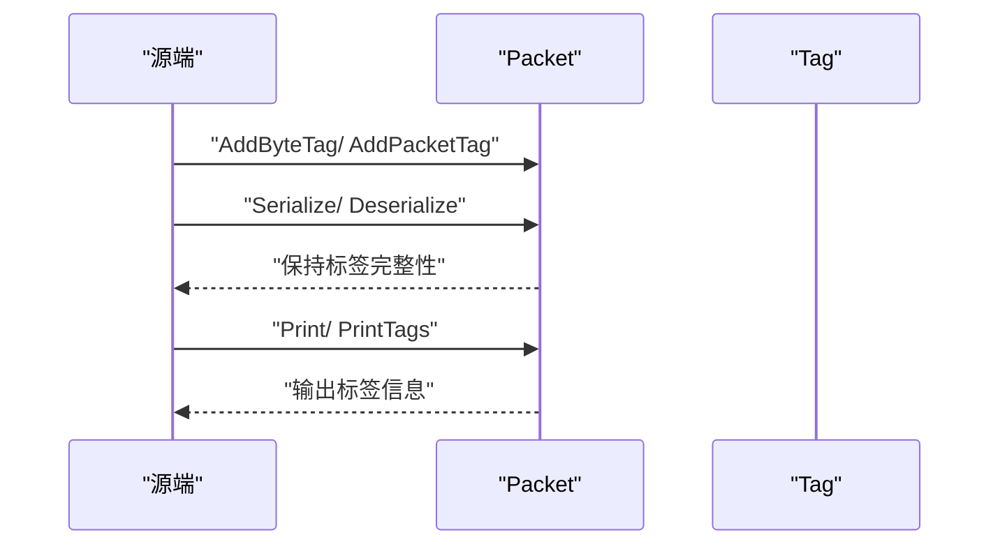
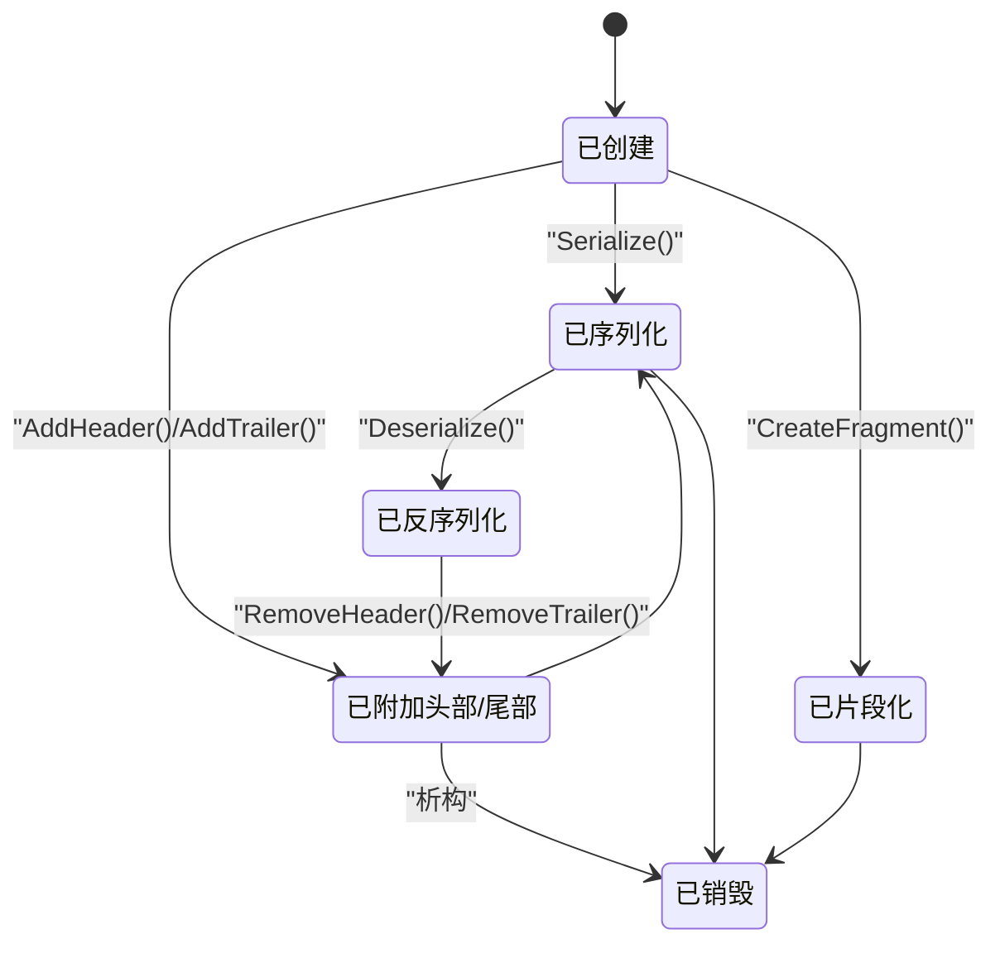
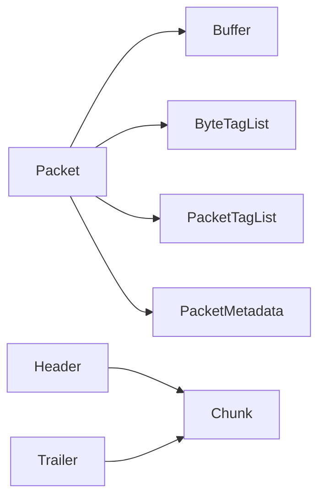

# 数据包模型

<cite>
**本文引用的文件**   
- [packet.h](file://simulator/ns-3.39/src/network/model/packet.h)
- [packet.cc](file://simulator/ns-3.39/src/network/model/packet.cc)
- [buffer.h](file://simulator/ns-3.39/src/network/model/buffer.h)
- [buffer.cc](file://simulator/ns-3.39/src/network/model/buffer.cc)
- [chunk.h](file://simulator/ns-3.39/src/network/model/chunk.h)
- [chunk.cc](file://simulator/ns-3.39/src/network/model/chunk.cc)
- [header.h](file://simulator/ns-3.39/src/network/model/header.h)
- [trailer.h](file://simulator/ns-3.39/src/network/model/trailer.h)
- [main-packet-header.cc](file://simulator/ns-3.39/src/network/examples/main-packet-header.cc)
- [packet-test-suite.cc](file://simulator/ns-3.39/src/network/test/packet-test-suite.cc)
</cite>

## 目录
1. [引言](#引言)
2. [项目结构](#项目结构)
3. [核心组件](#核心组件)
4. [架构总览](#架构总览)
5. [详细组件分析](#详细组件分析)
6. [依赖关系分析](#依赖关系分析)
7. [性能考量](#性能考量)
8. [故障排查指南](#故障排查指南)
9. [结论](#结论)
10. [附录](#附录)

## 引言
本文件系统性梳理 NS-3 网络模块中的数据包模型，围绕 Packet 类展开，覆盖其设计与实现要点：数据包头部结构、负载管理、唯一标识符机制；创建、复制、销毁流程与内存管理策略；头部操作、字节序处理、校验和计算；数据包在仿真中的生命周期；性能优化、内存池与调试技巧。文中所有技术细节均基于仓库源码进行解析，并通过图示与路径引用帮助读者快速定位实现位置。

## 项目结构
NS-3 的网络层数据包模型位于 network 模块的 model 子目录中，关键文件如下：
- Packet 核心类：packet.h、packet.cc
- 缓冲区与内存管理：buffer.h、buffer.cc
- 协议头/尾抽象基类：chunk.h、chunk.cc、header.h、trailer.h
- 示例与测试：examples 中的 main-packet-header.cc；test 中的 packet-test-suite.cc

**图表来源**
- [packet.h:190-238](file://simulator/ns-3.39/src/network/model/packet.h#L190-L238)
- [buffer.h:93-120](file://simulator/ns-3.39/src/network/model/buffer.h#L93-L120)
- [chunk.h:35-42](file://simulator/ns-3.39/src/network/model/chunk.h#L35-L42)
- [header.h:43-51](file://simulator/ns-3.39/src/network/model/header.h#L43-L51)
- [trailer.h:40-48](file://simulator/ns-3.39/src/network/model/trailer.h#L40-L48)

**章节来源**
- [packet.h:1-120](file://simulator/ns-3.39/src/network/model/packet.h#L1-L120)
- [buffer.h:1-120](file://simulator/ns-3.39/src/network/model/buffer.h#L1-L120)

## 核心组件
- Packet：封装字节缓冲区、字节标签、包标签、元数据与可选的 Nix 向量，提供头部/尾部添加与移除、序列化/反序列化、拷贝（含 COW）、打印等能力。
- Buffer：自动扩容的字节缓冲区，支持迭代器、片段化、COW 共享与内存池回收。
- Chunk/Header/Trailer：协议块抽象及具体协议头/尾的序列化接口。
- 标签系统：ByteTagList（按字节范围）与 PacketTagList（按包整体），用于携带仿真特定信息。
- 元数据：PacketMetadata 记录头部/尾部类型与顺序，支持打印与一致性检查。

**章节来源**
- [packet.h:190-780](file://simulator/ns-3.39/src/network/model/packet.h#L190-L780)
- [buffer.h:93-120](file://simulator/ns-3.39/src/network/model/buffer.h#L93-L120)
- [chunk.h:35-42](file://simulator/ns-3.39/src/network/model/chunk.h#L35-L42)
- [header.h:43-51](file://simulator/ns-3.39/src/network/model/header.h#L43-L51)
- [trailer.h:40-48](file://simulator/ns-3.39/src/network/model/trailer.h#L40-L48)

## 架构总览
Packet 将“协议头/尾 + 负载”序列化到 Buffer 中，同时维护两类标签与元数据。序列化时，Packet 在缓冲区前部写入长度前缀与各子结构（Nix 向量、字节标签、包标签、元数据、缓冲内容），并确保 4 字节对齐；反序列化时按相同顺序读取并恢复各子结构。

**图表来源**
- [packet.cc:662-821](file://simulator/ns-3.39/src/network/model/packet.cc#L662-L821)

**章节来源**
- [packet.cc:609-821](file://simulator/ns-3.39/src/network/model/packet.cc#L609-L821)

## 详细组件分析

### Packet 类设计与实现
- 唯一标识符（Uid）：由元数据持有，结合系统 ID 与全局自增 UID，确保跨节点唯一性。
- 复制语义：默认浅拷贝共享底层 Buffer 与标签，Copy() 返回独立副本（COW）。
- 片段化：CreateFragment 支持零拷贝片段，共享底层数据但调整标签与元数据范围。
- 头部/尾部：AddHeader/RemoveHeader/PpeekHeader、AddTrailer/RemoveTrailer/PpeekTrailer 统一通过 Chunk 接口完成序列化与反序列化。
- 打印与检查：EnablePrinting/EnableChecking 控制元数据记录与运行时一致性检查。
- 序列化/反序列化：GetSerializedSize/Serialize/Deserialize，严格按固定顺序写入长度前缀与内容，保证跨平台可移植性。

**图表来源**
- [packet.h:190-780](file://simulator/ns-3.39/src/network/model/packet.h#L190-L780)
- [header.h:43-51](file://simulator/ns-3.39/src/network/model/header.h#L43-L51)
- [trailer.h:40-48](file://simulator/ns-3.39/src/network/model/trailer.h#L40-L48)
- [chunk.h:35-42](file://simulator/ns-3.39/src/network/model/chunk.h#L35-L42)

**章节来源**
- [packet.h:238-780](file://simulator/ns-3.39/src/network/model/packet.h#L238-L780)
- [packet.cc:130-265](file://simulator/ns-3.39/src/network/model/packet.cc#L130-L265)

### Buffer 内存管理与 COW
- 自动扩容：根据使用历史选择推荐起始偏移，减少重分配次数。
- COW 共享：多个 Buffer 实例可共享同一底层数据块，仅在需要修改时复制。
- 片段化：CreateFragment 返回共享底层数据的新 Buffer 片段，避免复制。
- 内存池：静态空洞缓冲与自由列表复用，降低频繁分配/释放开销。

**图表来源**
- [buffer.h:47-92](file://simulator/ns-3.39/src/network/model/buffer.h#L47-L92)
- [buffer.cc:100-161](file://simulator/ns-3.39/src/network/model/buffer.cc#L100-L161)

**章节来源**
- [buffer.h:93-200](file://simulator/ns-3.39/src/network/model/buffer.h#L93-L200)
- [buffer.cc:100-161](file://simulator/ns-3.39/src/network/model/buffer.cc#L100-L161)

### 头部/尾部与字节序处理
- Header/Trailer 必须实现序列化接口，确保与真实网络报文位级一致。
- Buffer 提供主机/网络字节序转换方法，便于在序列化时正确写入字段。
- 校验和：Buffer 迭代器提供 IP 校验和计算工具，支持增量校验和累加。

**图表来源**
- [packet.cc:267-277](file://simulator/ns-3.39/src/network/model/packet.cc#L267-L277)
- [header.h:62-73](file://simulator/ns-3.39/src/network/model/header.h#L62-L73)
- [buffer.h:164-232](file://simulator/ns-3.39/src/network/model/buffer.h#L164-L232)

**章节来源**
- [header.h:62-104](file://simulator/ns-3.39/src/network/model/header.h#L62-L104)
- [trailer.h:56-102](file://simulator/ns-3.39/src/network/model/trailer.h#L56-L102)
- [buffer.h:365-373](file://simulator/ns-3.39/src/network/model/buffer.h#L365-L373)

### 标签系统与生命周期
- 字节标签（ByteTag）：标记包内特定字节范围，随分片传播；适合一次性写入、多次读取场景。
- 包标签（PacketTag）：标记整个包，支持查找、替换、删除；适合跨层传递一次性信息。
- 生命周期：创建时可添加标签；序列化/反序列化保留标签；打印/遍历支持输出标签内容。

**图表来源**
- [packet.cc:934-1042](file://simulator/ns-3.39/src/network/model/packet.cc#L934-L1042)

**章节来源**
- [packet.cc:934-1042](file://simulator/ns-3.39/src/network/model/packet.cc#L934-L1042)

### 数据包生命周期（创建—传输—销毁）
- 创建：空包、零填充包、从缓冲区构造、从序列化数据构造。
- 传输：添加头部/尾部、追加/裁剪、片段化、序列化。
- 销毁：智能指针自动管理，Buffer 与标签列表析构，必要时触发底层数据复制或回收。

**图表来源**
- [packet.cc:139-223](file://simulator/ns-3.39/src/network/model/packet.cc#L139-L223)
- [packet.cc:237-253](file://simulator/ns-3.39/src/network/model/packet.cc#L237-L253)
- [packet.cc:823-931](file://simulator/ns-3.39/src/network/model/packet.cc#L823-L931)

**章节来源**
- [packet.cc:139-223](file://simulator/ns-3.39/src/network/model/packet.cc#L139-L223)
- [packet.cc:237-253](file://simulator/ns-3.39/src/network/model/packet.cc#L237-L253)
- [packet.cc:823-931](file://simulator/ns-3.39/src/network/model/packet.cc#L823-L931)

### 代码示例（路径引用）
- 构造与打印：[main-packet-header.cc:118-146](file://simulator/ns-3.39/src/network/examples/main-packet-header.cc#L118-L146)
- 添加头部：[main-packet-header.cc:127-143](file://simulator/ns-3.39/src/network/examples/main-packet-header.cc#L127-L143)
- 序列化/反序列化：[packet.cc:662-821](file://simulator/ns-3.39/src/network/model/packet.cc#L662-L821)
- 反序列化：[packet.cc:823-931](file://simulator/ns-3.39/src/network/model/packet.cc#L823-L931)

**章节来源**
- [main-packet-header.cc:118-146](file://simulator/ns-3.39/src/network/examples/main-packet-header.cc#L118-L146)
- [packet.cc:662-931](file://simulator/ns-3.39/src/network/model/packet.cc#L662-L931)

## 依赖关系分析
Packet 对 Buffer、ByteTagList、PacketTagList、PacketMetadata、Chunk/Header/Trailer 的依赖清晰且内聚：
- Buffer 提供底层字节存储与 COW；
- 标签与元数据作为“非协议数据”与“协议数据”分离的补充；
- Header/Trailer 通过 Chunk 接口统一序列化/反序列化。

**图表来源**
- [packet.h:22-29](file://simulator/ns-3.39/src/network/model/packet.h#L22-L29)
- [chunk.h:35-42](file://simulator/ns-3.39/src/network/model/chunk.h#L35-L42)
- [header.h:43-51](file://simulator/ns-3.39/src/network/model/header.h#L43-L51)
- [trailer.h:40-48](file://simulator/ns-3.39/src/network/model/trailer.h#L40-L48)

**章节来源**
- [packet.h:22-29](file://simulator/ns-3.39/src/network/model/packet.h#L22-L29)

## 性能考量
- COW 与共享缓冲：减少不必要的内存复制，提升多路复用场景性能。
- 内存池与空洞缓冲：降低频繁分配成本，提高吞吐。
- 对齐与长度前缀：序列化/反序列化顺序固定，便于快速跳转与边界检查。
- 标签最小化：仅在需要时启用打印/检查，避免额外元数据开销。
- 避免过度片段化：频繁 CreateFragment 会增加标签与元数据维护成本。

[本节为通用指导，无需引用具体文件]

## 故障排查指南
- 打印与检查：启用 EnablePrinting/EnableChecking，利用 Packet::Print 输出结构化信息，定位头部/尾部顺序与缺失问题。
- 标签一致性：通过 GetByteTagIterator/GetPacketTagIterator 遍历标签，核对类型与范围。
- 反序列化失败：检查缓冲区长度前缀与实际大小是否匹配，确认 4 字节对齐。
- 校验和错误：使用 Buffer::Iterator 的校验和工具进行增量校验，定位错误字段。

**章节来源**
- [packet.cc:595-607](file://simulator/ns-3.39/src/network/model/packet.cc#L595-L607)
- [packet.cc:455-587](file://simulator/ns-3.39/src/network/model/packet.cc#L455-L587)
- [buffer.h:365-373](file://simulator/ns-3.39/src/network/model/buffer.h#L365-L373)

## 结论
NS-3 的数据包模型以 Packet 为核心，通过 Buffer 的 COW 与内存池、标签与元数据的分离设计，实现了高性能、可扩展且可调试的数据包处理框架。遵循本文所述的头部/尾部序列化规范、字节序与校验和处理建议，以及性能优化与调试实践，可在复杂网络仿真中获得稳定可靠的报文处理行为。

## 附录
- 示例与测试参考：
  - 协议头示例：[main-packet-header.cc:118-146](file://simulator/ns-3.39/src/network/examples/main-packet-header.cc#L118-L146)
  - 标签与序列化测试：[packet-test-suite.cc:32-200](file://simulator/ns-3.39/src/network/test/packet-test-suite.cc#L32-L200)

**章节来源**
- [main-packet-header.cc:118-146](file://simulator/ns-3.39/src/network/examples/main-packet-header.cc#L118-L146)
- [packet-test-suite.cc:32-200](file://simulator/ns-3.39/src/network/test/packet-test-suite.cc#L32-L200)