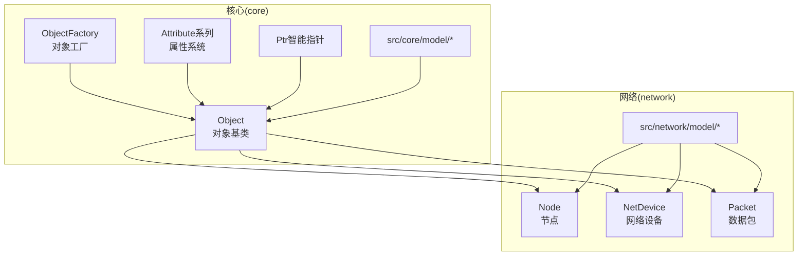
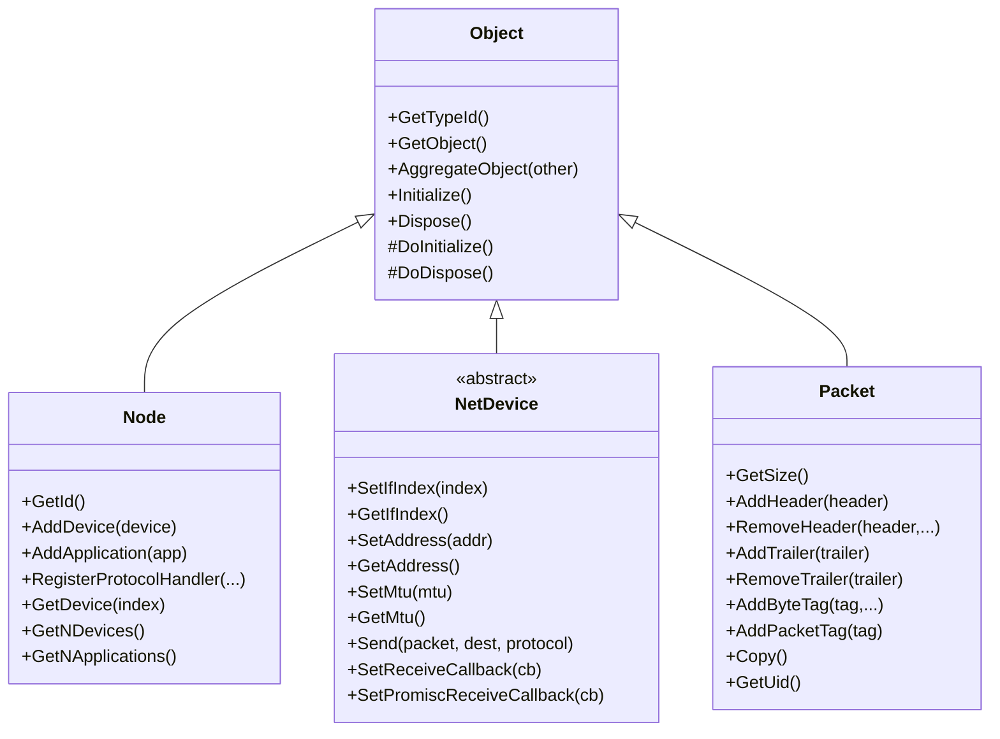
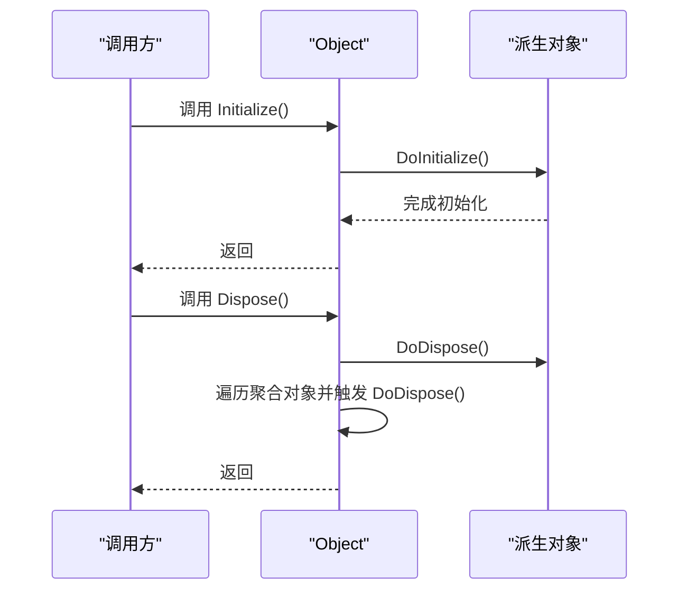
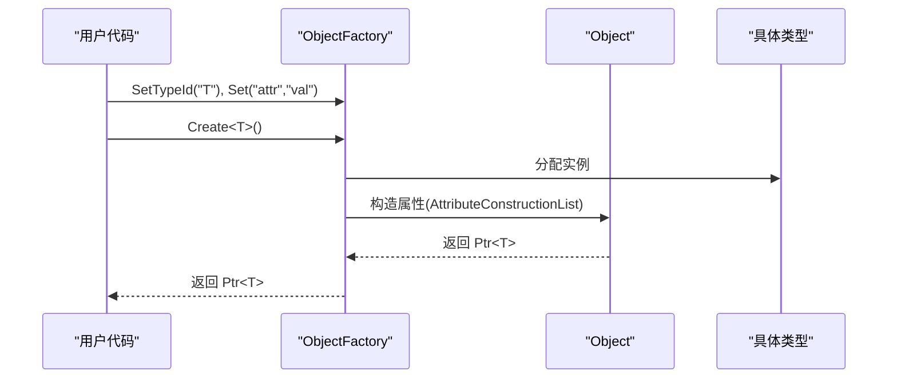
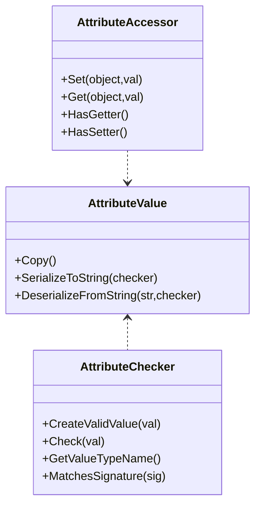
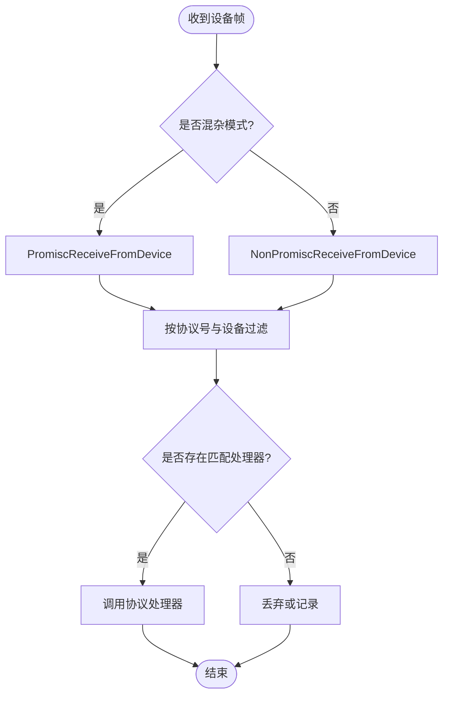
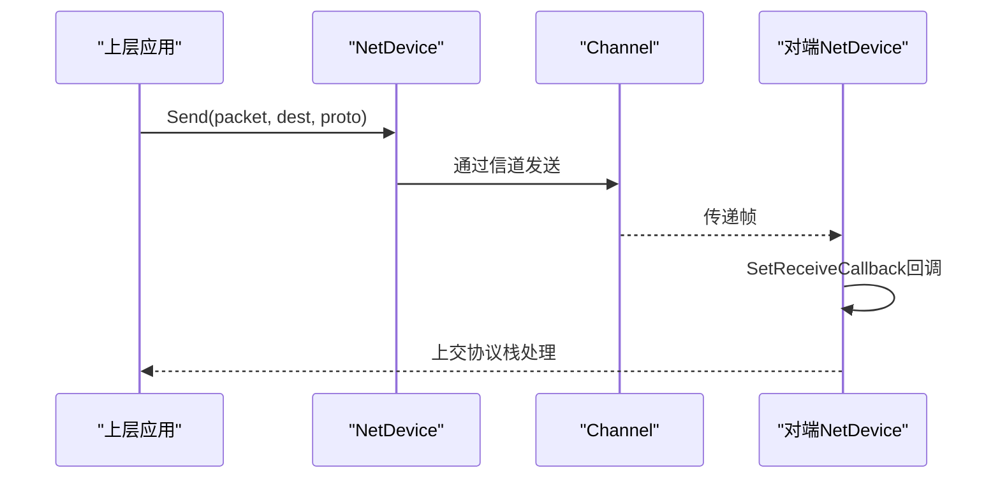
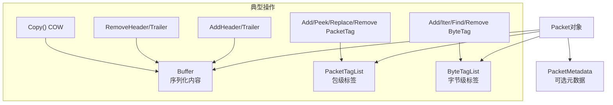
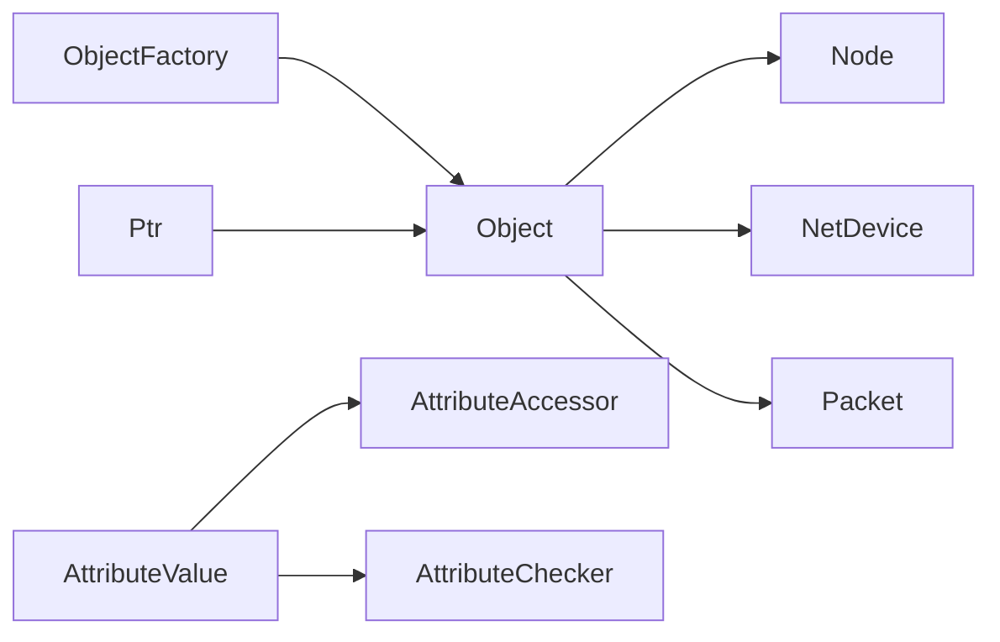

# 数据模型与对象系统

<cite>
**本文引用的文件**
- [object.h](file://simulator/ns-3.39/src/core/model/object.h)
- [object-factory.h](file://simulator/ns-3.39/src/core/model/object-factory.h)
- [attribute.h](file://simulator/ns-3.39/src/core/model/attribute.h)
- [ptr.h](file://simulator/ns-3.39/src/core/model/ptr.h)
- [node.h](file://simulator/ns-3.39/src/network/model/node.h)
- [net-device.h](file://simulator/ns-3.39/src/network/model/net-device.h)
- [packet.h](file://simulator/ns-3.39/src/network/model/packet.h)
</cite>

## 目录
1. [引言](#引言)
2. [项目结构](#项目结构)
3. [核心组件](#核心组件)
4. [架构总览](#架构总览)
5. [详细组件分析](#详细组件分析)
6. [依赖关系分析](#依赖关系分析)
7. [性能考量](#性能考量)
8. [故障排查指南](#故障排查指南)
9. [结论](#结论)
10. [附录](#附录)

## 引言
本文件面向NS-3网络仿真器的数据模型与对象系统，聚焦于网络仿真中的核心对象：Node（节点）、NetDevice（网络设备）、Packet（数据包）。文档从对象继承体系、属性系统、工厂模式入手，系统阐述对象的生命周期、内存管理策略；并结合数据包的头部结构、标签机制与负载处理流程，解释节点状态管理、设备抽象与地址分配等关键概念。最后提供对象创建、配置与使用的参考路径，并给出内存管理、性能优化与扩展开发建议。

## 项目结构
NS-3采用模块化组织方式，核心对象系统位于core模块，网络层对象（Node、NetDevice）位于network模块，数据包模型位于network模块内部。对象系统通过智能指针、引用计数与类型系统支撑整个仿真框架。

图示来源
- [object.h:88-447](file://simulator/ns-3.39/src/core/model/object.h#L88-L447)
- [object-factory.h:47-172](file://simulator/ns-3.39/src/core/model/object-factory.h#L47-L172)
- [attribute.h:69-203](file://simulator/ns-3.39/src/core/model/attribute.h#L69-L203)
- [ptr.h:76-200](file://simulator/ns-3.39/src/core/model/ptr.h#L76-L200)
- [node.h:58-331](file://simulator/ns-3.39/src/network/model/node.h#L58-L331)
- [net-device.h:101-379](file://simulator/ns-3.39/src/network/model/net-device.h#L101-L379)
- [packet.h:238-800](file://simulator/ns-3.39/src/network/model/packet.h#L238-L800)

章节来源
- [object.h:88-447](file://simulator/ns-3.39/src/core/model/object.h#L88-L447)
- [object-factory.h:47-172](file://simulator/ns-3.39/src/core/model/object-factory.h#L47-L172)
- [attribute.h:69-203](file://simulator/ns-3.39/src/core/model/attribute.h#L69-L203)
- [ptr.h:76-200](file://simulator/ns-3.39/src/core/model/ptr.h#L76-L200)
- [node.h:58-331](file://simulator/ns-3.39/src/network/model/node.h#L58-L331)
- [net-device.h:101-379](file://simulator/ns-3.39/src/network/model/net-device.h#L101-L379)
- [packet.h:238-800](file://simulator/ns-3.39/src/network/model/packet.h#L238-L800)

## 核心组件
- 对象基类与生命周期
  - Object提供对象层次结构、聚合、初始化/析构钩子、引用计数与循环解除机制。其派生类Node、NetDevice、Packet均遵循统一的生命周期管理。
- 属性系统
  - AttributeValue/Accessor/Checker构成属性值、访问器与类型检查的三元组，支持运行时反射式配置与追踪。
- 工厂模式
  - ObjectFactory负责按类型创建对象并注入初始属性，简化对象构造与配置。
- 智能指针
  - Ptr提供RAII语义的堆对象管理，避免裸指针带来的内存泄漏风险。

章节来源
- [object.h:88-276](file://simulator/ns-3.39/src/core/model/object.h#L88-L276)
- [attribute.h:69-203](file://simulator/ns-3.39/src/core/model/attribute.h#L69-L203)
- [object-factory.h:47-172](file://simulator/ns-3.39/src/core/model/object-factory.h#L47-L172)
- [ptr.h:76-200](file://simulator/ns-3.39/src/core/model/ptr.h#L76-L200)

## 架构总览
NS-3对象系统以Object为核心，Node与NetDevice作为网络层实体继承自Object，Packet作为数据传输载体同样继承自可引用计数基类。工厂与属性系统贯穿对象创建与配置阶段，智能指针贯穿全生命周期管理。

图示来源
- [object.h:88-447](file://simulator/ns-3.39/src/core/model/object.h#L88-L447)
- [node.h:58-331](file://simulator/ns-3.39/src/network/model/node.h#L58-L331)
- [net-device.h:101-379](file://simulator/ns-3.39/src/network/model/net-device.h#L101-L379)
- [packet.h:238-800](file://simulator/ns-3.39/src/network/model/packet.h#L238-L800)

## 详细组件分析

### 组件一：对象基类与继承体系（Object）
- 设计要点
  - 继承自SimpleRefCount，具备引用计数能力；通过Ref/Unref与Dispose/DoDispose控制生命周期。
  - 支持对象聚合（Aggregate），通过NotifyNewAggregate通知聚合事件，GetAggregateIterator遍历聚合对象。
  - 初始化与析构：Initialize调用DoInitialize一次；Dispose触发DoDispose并递归清理聚合对象。
- 关键接口
  - GetObject<T>()与GetObject(TypeId)用于在聚合树中查找目标类型对象。
  - AggregateObject用于建立父子对象关系。
  - DoInitialize/DoDispose由子类覆盖，确保资源正确释放。

图示来源
- [object.h:224-276](file://simulator/ns-3.39/src/core/model/object.h#L224-L276)

章节来源
- [object.h:88-447](file://simulator/ns-3.39/src/core/model/object.h#L88-L447)

### 组件二：工厂模式（ObjectFactory）
- 设计要点
  - 通过SetTypeId指定待创建类型，Set(name,value)批量设置属性，Create()/Create<T>()完成对象实例化。
  - 内部借助类型系统与属性列表，在对象构造阶段自动注入默认值或用户配置。
- 使用场景
  - 在脚本或高层封装中集中配置对象参数，屏蔽构造细节。

图示来源
- [object-factory.h:47-172](file://simulator/ns-3.39/src/core/model/object-factory.h#L47-L172)

章节来源
- [object-factory.h:47-172](file://simulator/ns-3.39/src/core/model/object-factory.h#L47-L172)

### 组件三：属性系统（AttributeValue/Accessor/Checker）
- 设计要点
  - AttributeValue封装属性值，支持序列化/反序列化。
  - AttributeAccessor提供Get/Set能力，隐藏底层存储细节。
  - AttributeChecker进行类型校验与范围检查，保证属性一致性。
- 与对象集成
  - 对象注册属性后，可通过ObjectFactory或配置接口动态设置。

图示来源
- [attribute.h:69-203](file://simulator/ns-3.39/src/core/model/attribute.h#L69-L203)

章节来源
- [attribute.h:69-203](file://simulator/ns-3.39/src/core/model/attribute.h#L69-L203)

### 组件四：智能指针（Ptr）
- 设计要点
  - 基于引用计数的RAII指针，自动管理对象生命周期；支持隐式转换与安全比较。
  - 与SimpleRefCount配合，确保对象在无人持有引用时被正确销毁。
- 典型用法
  - 创建对象：CreateObject<T>()返回Ptr<T>；直接new不推荐。

章节来源
- [ptr.h:76-200](file://simulator/ns-3.39/src/core/model/ptr.h#L76-L200)

### 组件五：节点（Node）
- 角色与职责
  - 管理一组NetDevice与Application；维护协议处理器表；接收来自设备的帧并分发到上层协议栈。
- 关键接口
  - AddDevice/AddApplication/GetDevice/GetNDevices/GetNApplications。
  - RegisterProtocolHandler/UnregisterProtocolHandler注册/注销协议回调。
  - ReceiveFromDevice/NonPromiscReceiveFromDevice/PromiscReceiveFromDevice处理入站帧。
- 生命周期
  - 通过Object::Initialize/Dispose参与全局生命周期管理。

图示来源
- [node.h:258-295](file://simulator/ns-3.39/src/network/model/node.h#L258-L295)

章节来源
- [node.h:58-331](file://simulator/ns-3.39/src/network/model/node.h#L58-L331)

### 组件六：网络设备（NetDevice）
- 抽象接口
  - 设备标识（IfIndex）、地址（SetAddress/GetAddress）、MTU（SetMtu/GetMtu）、链路状态（IsLinkUp/AddLinkChangeCallback）。
  - 发送接口：Send/SendFrom；接收回调：SetReceiveCallback/SetPromiscReceiveCallback。
  - 多播/广播支持：IsMulticast/GetMulticast；广播地址：IsBroadcast/GetBroadcast。
- 行为约定
  - 设备通过回调向上层投递帧；混杂模式下接收所有可见帧。
- 扩展点
  - 子类需实现纯虚接口，通常配合队列接口与链路层协议协作。

图示来源
- [net-device.h:242-291](file://simulator/ns-3.39/src/network/model/net-device.h#L242-L291)

章节来源
- [net-device.h:101-379](file://simulator/ns-3.39/src/network/model/net-device.h#L101-L379)

### 组件七：数据包（Packet）
- 结构组成
  - 字节缓冲区（Buffer）承载序列化后的头部/载荷/尾部。
  - 标签系统：PacketTag（随包迁移）与ByteTag（随字节迁移），用于跨层信息传递。
  - 元数据（PacketMetadata）可选启用，支持打印与校验。
- 生命周期与复制
  - 默认采用写时复制（COW）策略，Copy()仅在必要时分离底层缓冲。
- 头部/尾部处理
  - AddHeader/RemoveHeader/PpeekHeader；AddTrailer/RemoveTrailer/PpeekTrailer。
- 标签操作
  - AddPacketTag/PeekPacketTag/ReplacePacketTag/RemovePacketTag/RemoveAllPacketTags；
  - AddByteTag(GetByteTagIterator/FindFirstMatchingByteTag/RemoveAllByteTags)。

图示来源
- [packet.h:238-800](file://simulator/ns-3.39/src/network/model/packet.h#L238-L800)

章节来源
- [packet.h:238-800](file://simulator/ns-3.39/src/network/model/packet.h#L238-L800)

## 依赖关系分析
- 继承关系
  - Node/NetDevice/Packet均继承自Object，共享统一的生命周期与聚合能力。
- 组合关系
  - Node组合多个NetDevice与Application；NetDevice通过回调与上层协议交互；Packet内含Buffer与标签集合。
- 工厂与属性
  - ObjectFactory依赖类型系统与属性列表，驱动对象创建与初始化。

图示来源
- [object.h:88-447](file://simulator/ns-3.39/src/core/model/object.h#L88-L447)
- [object-factory.h:47-172](file://simulator/ns-3.39/src/core/model/object-factory.h#L47-L172)
- [attribute.h:69-203](file://simulator/ns-3.39/src/core/model/attribute.h#L69-L203)
- [ptr.h:76-200](file://simulator/ns-3.39/src/core/model/ptr.h#L76-L200)
- [node.h:58-331](file://simulator/ns-3.39/src/network/model/node.h#L58-L331)
- [net-device.h:101-379](file://simulator/ns-3.39/src/network/model/net-device.h#L101-L379)
- [packet.h:238-800](file://simulator/ns-3.39/src/network/model/packet.h#L238-L800)

章节来源
- [object.h:88-447](file://simulator/ns-3.39/src/core/model/object.h#L88-L447)
- [object-factory.h:47-172](file://simulator/ns-3.39/src/core/model/object-factory.h#L47-L172)
- [attribute.h:69-203](file://simulator/ns-3.39/src/core/model/attribute.h#L69-L203)
- [ptr.h:76-200](file://simulator/ns-3.39/src/core/model/ptr.h#L76-L200)
- [node.h:58-331](file://simulator/ns-3.39/src/network/model/node.h#L58-L331)
- [net-device.h:101-379](file://simulator/ns-3.39/src/network/model/net-device.h#L101-L379)
- [packet.h:238-800](file://simulator/ns-3.39/src/network/model/packet.h#L238-L800)

## 性能考量
- 智能指针与引用计数
  - Ptr基于引用计数，避免重复拷贝；在高频对象创建/销毁场景中，尽量复用对象与标签容器，减少不必要的拷贝。
- 数据包复制策略
  - Packet默认COW，Copy()仅在需要修改时分离缓冲；频繁Copy会增加内存占用，应评估是否可共享只读数据。
- 标签使用
  - ByteTag适合轻量、只读的字节级标记；PacketTag适合跨层状态，但删除/替换有开销，应按需使用。
- 属性系统
  - 属性检查与序列化存在额外成本，调试阶段开启EnableChecking/EnablePrinting，发布版本关闭以降低开销。
- 设备回调
  - 回调链过长会引入额外分支判断，建议在Node侧按协议号快速分发，减少无谓回调。

## 故障排查指南
- 对象未释放/内存泄漏
  - 确认所有对象通过Ptr持有，且无循环引用；若存在循环引用，需在合适时机调用Dispose打破循环。
- 协议回调未触发
  - 检查Node::RegisterProtocolHandler是否正确注册；确认协议号与设备匹配；混杂模式下注意PromiscReceiveCallback的使用。
- 数据包标签异常
  - 若使用PacketTag，确保在生命周期内正确Add/Peek/Replace/Remove；错误的标签操作可能导致统计或行为异常。
- MTU与分片
  - NetDevice::GetMtu与上层协议的分片策略需一致，避免因MTU不匹配导致丢包。

章节来源
- [object.h:172-184](file://simulator/ns-3.39/src/core/model/object.h#L172-L184)
- [node.h:184-194](file://simulator/ns-3.39/src/network/model/node.h#L184-L194)
- [net-device.h:146-153](file://simulator/ns-3.39/src/network/model/net-device.h#L146-L153)
- [packet.h:527-538](file://simulator/ns-3.39/src/network/model/packet.h#L527-L538)

## 结论
NS-3的对象系统以Object为核心，通过工厂与属性系统实现灵活的配置与扩展，结合智能指针保障内存安全。Node/NetDevice/NetDevice构成网络层的三大支柱，Packet承载着丰富的头部/尾部与标签信息。理解这些组件的生命周期、依赖关系与性能特征，有助于编写高效、可维护的仿真脚本与模块。

## 附录
- 对象创建与配置参考路径
  - 创建对象：[object.h:577-582](file://simulator/ns-3.39/src/core/model/object.h#L577-L582)
  - 工厂创建：[object-factory.h:120-132](file://simulator/ns-3.39/src/core/model/object-factory.h#L120-L132)
  - 属性设置：[object-factory.h:98-107](file://simulator/ns-3.39/src/core/model/object-factory.h#L98-L107)
  - 智能指针：[ptr.h:134-171](file://simulator/ns-3.39/src/core/model/ptr.h#L134-L171)
- 节点与设备
  - 注册协议处理器：[node.h:184-194](file://simulator/ns-3.39/src/network/model/node.h#L184-L194)
  - 发送帧：[net-device.h:258-275](file://simulator/ns-3.39/src/network/model/net-device.h#L258-L275)
- 数据包
  - 添加/移除头部/尾部：[packet.h:321-393](file://simulator/ns-3.39/src/network/model/packet.h#L321-L393)
  - 标签操作：[packet.h:639-691](file://simulator/ns-3.39/src/network/model/packet.h#L639-L691)
  - 启用打印/校验：[packet.h:527-538](file://simulator/ns-3.39/src/network/model/packet.h#L527-L538)