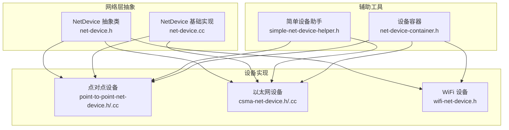
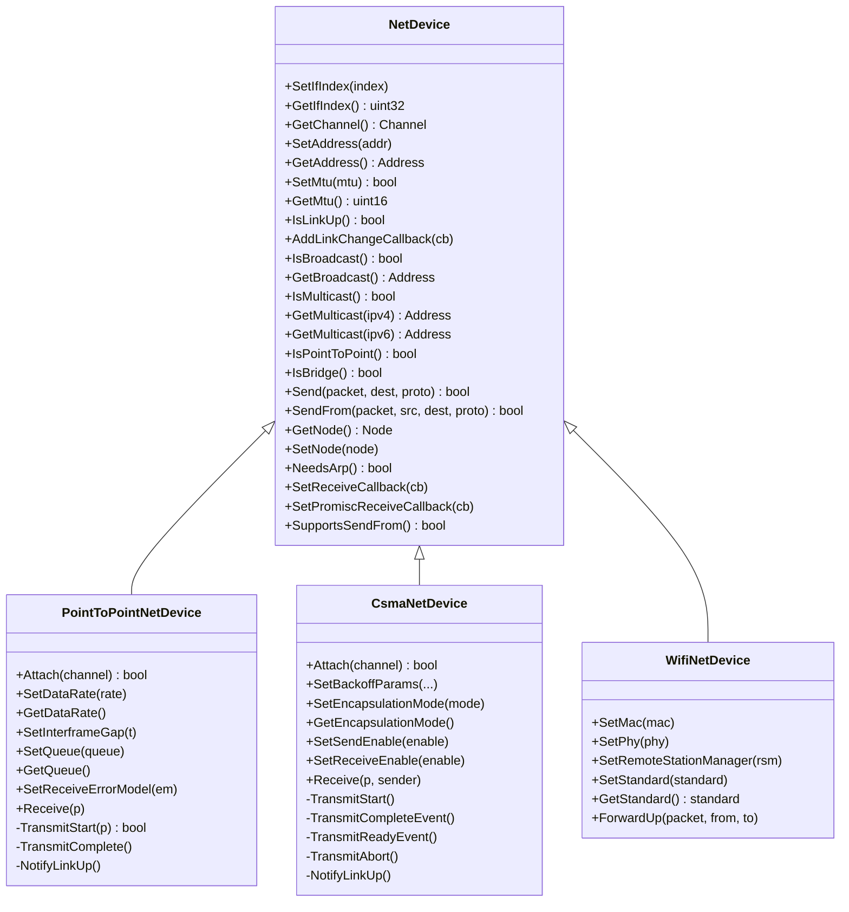
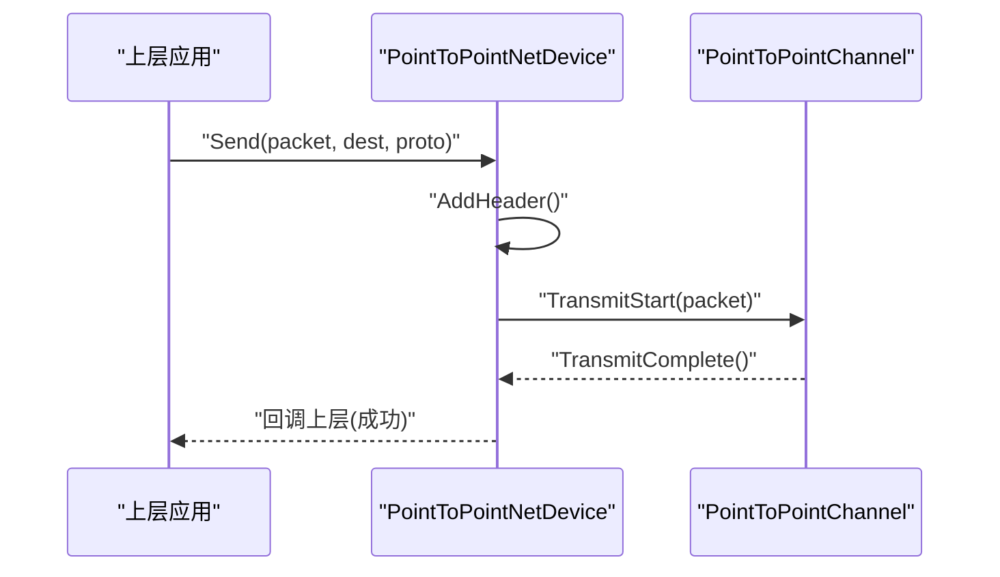
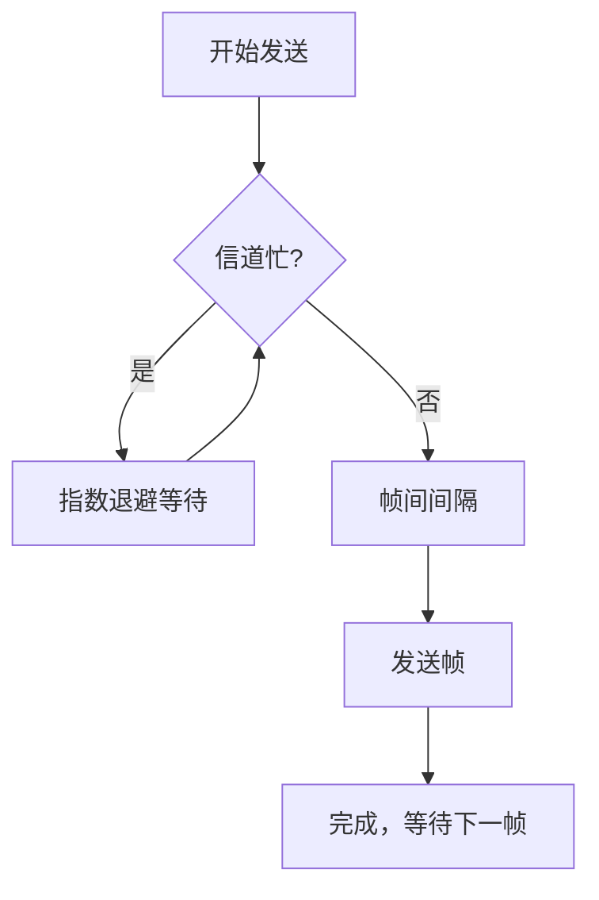
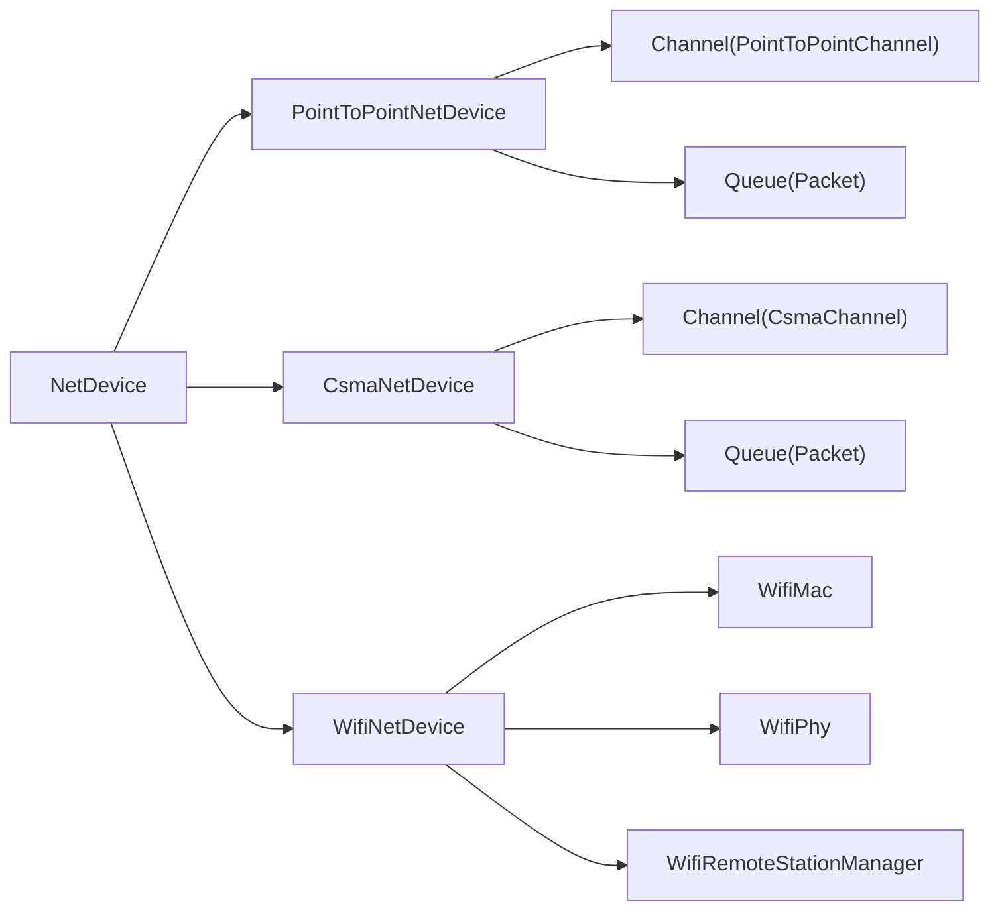

# 网络设备模型

<cite>
**本文引用的文件**
- [net-device.h](file://simulator/ns-3.39/src/network/model/net-device.h)
- [net-device.cc](file://simulator/ns-3.39/src/network/model/net-device.cc)
- [point-to-point-net-device.h](file://simulator/ns-3.39/src/point-to-point/model/point-to-point-net-device.h)
- [point-to-point-net-device.cc](file://simulator/ns-3.39/src/point-to-point/model/point-to-point-net-device.cc)
- [csma-net-device.h](file://simulator/ns-3.39/src/csma/model/csma-net-device.h)
- [csma-net-device.cc](file://simulator/ns-3.39/src/csma/model/csma-net-device.cc)
- [wifi-net-device.h](file://simulator/ns-3.39/src/wifi/model/wifi-net-device.h)
- [simple-net-device-helper.h](file://simulator/ns-3.39/src/network/helper/simple-net-device-helper.h)
- [net-device-container.h](file://simulator/ns-3.39/src/network/helper/net-device-container.h)
</cite>

## 目录
1. [简介](#简介)
2. [项目结构](#项目结构)
3. [核心组件](#核心组件)
4. [架构总览](#架构总览)
5. [详细组件分析](#详细组件分析)
6. [依赖关系分析](#依赖关系分析)
7. [性能考量](#性能考量)
8. [故障排除指南](#故障排除指南)
9. [结论](#结论)
10. [附录](#附录)

## 简介
本文件系统化梳理 NS-3 中“网络设备模型”的设计与实现，围绕抽象基类 NetDevice 的职责边界、生命周期与回调机制，结合以太网（CSMA）、点对点（Point-to-Point）与 WiFi 等典型设备实现，解释设备初始化、数据包收发、地址与多播、接口索引与链路状态、混杂模式、队列与流量控制、事件调度与跟踪等关键主题，并给出可操作的扩展与优化建议。

## 项目结构
NS-3 将网络设备抽象置于 network 模块，具体设备实现分布在对应子模块中。下图概览了与网络设备模型直接相关的目录与文件：

图表来源
- [net-device.h:101-384](file://simulator/ns-3.39/src/network/model/net-device.h#L101-L384)
- [net-device.cc:27-55](file://simulator/ns-3.39/src/network/model/net-device.cc#L27-L55)
- [point-to-point-net-device.h:63-485](file://simulator/ns-3.39/src/point-to-point/model/point-to-point-net-device.h#L63-L485)
- [csma-net-device.h:60-740](file://simulator/ns-3.39/src/csma/model/csma-net-device.h#L60-L740)
- [wifi-net-device.h:58-267](file://simulator/ns-3.39/src/wifi/model/wifi-net-device.h#L58-L267)
- [simple-net-device-helper.h:37-208](file://simulator/ns-3.39/src/network/helper/simple-net-device-helper.h#L37-L208)
- [net-device-container.h:42-206](file://simulator/ns-3.39/src/network/helper/net-device-container.h#L42-L206)

章节来源
- [net-device.h:101-384](file://simulator/ns-3.39/src/network/model/net-device.h#L101-L384)
- [net-device.cc:27-55](file://simulator/ns-3.39/src/network/model/net-device.cc#L27-L55)

## 核心组件
- 抽象基类 NetDevice：定义设备与上层协议栈交互的统一接口，包括接口索引、链路 MTU、地址、广播/多播能力、链路状态与回调、发送与接收回调、混杂模式回调、ARP 需求等。
- 具体设备实现：
  - 点对点设备 PointToPointNetDevice：面向点对点链路，具备数据速率、帧间间隔、错误模型、队列与状态机等特性。
  - 以太网设备 CsmaNetDevice：面向共享总线式以太网，具备封装模式（DIX/LLC）、退避算法、发送/接收使能、队列与状态机等特性。
  - WiFi 设备 WifiNetDevice：面向无线局域网，组合 MAC、PHY、远程站管理器等高层组件，支持多种标准与多链路场景。
- 辅助工具：
  - SimpleNetDeviceHelper：简化安装流程，自动创建设备、队列与通道并绑定到节点。
  - NetDeviceContainer：持有多个设备指针，便于批量操作与遍历。

章节来源
- [net-device.h:101-384](file://simulator/ns-3.39/src/network/model/net-device.h#L101-L384)
- [point-to-point-net-device.h:63-485](file://simulator/ns-3.39/src/point-to-point/model/point-to-point-net-device.h#L63-L485)
- [csma-net-device.h:60-740](file://simulator/ns-3.39/src/csma/model/csma-net-device.h#L60-L740)
- [wifi-net-device.h:58-267](file://simulator/ns-3.39/src/wifi/model/wifi-net-device.h#L58-L267)
- [simple-net-device-helper.h:37-208](file://simulator/ns-3.39/src/network/helper/simple-net-device-helper.h#L37-L208)
- [net-device-container.h:42-206](file://simulator/ns-3.39/src/network/helper/net-device-container.h#L42-L206)

## 架构总览
下图展示了 NetDevice 抽象与三种典型设备的关系，以及与 Node、Channel、Queue、ErrorModel 等对象的交互：

图表来源
- [net-device.h:101-384](file://simulator/ns-3.39/src/network/model/net-device.h#L101-L384)
- [point-to-point-net-device.h:63-485](file://simulator/ns-3.39/src/point-to-point/model/point-to-point-net-device.h#L63-L485)
- [csma-net-device.h:60-740](file://simulator/ns-3.39/src/csma/model/csma-net-device.h#L60-L740)
- [wifi-net-device.h:58-267](file://simulator/ns-3.39/src/wifi/model/wifi-net-device.h#L58-L267)

## 详细组件分析

### NetDevice 抽象类
- 职责边界：向上屏蔽不同 MAC 层细节，向下通过 Channel 连接物理链路；提供统一的发送/接收、地址、MTU、链路状态与回调接口。
- 关键接口要点：
  - 接口索引与链路状态：SetIfIndex/GetIfIndex、IsLinkUp、AddLinkChangeCallback。
  - 地址与多播：SetAddress/GetAddress、IsBroadcast/GetBroadcast、IsMulticast、GetMulticast。
  - 发送路径：Send/SendFrom（支持 MAC 欺骗）、NeedsArp 决定是否需要 ARP。
  - 回调机制：SetReceiveCallback（非混杂）、SetPromiscReceiveCallback（混杂）。
  - 设备属性：IsPointToPoint、IsBridge、SupportsSendFrom。
- 默认行为：抽象类提供部分默认实现（例如 Qbb 支持与 SwitchSend），便于派生类按需覆盖。

章节来源
- [net-device.h:101-384](file://simulator/ns-3.39/src/network/model/net-device.h#L101-L384)
- [net-device.cc:27-55](file://simulator/ns-3.39/src/network/model/net-device.cc#L27-L55)

### 点对点设备 PointToPointNetDevice
- 初始化与连接：Attach 绑定 Channel；SetDataRate/SetInterframeGap 设置传输参数；SetQueue/GetQueue 管理队列；可选 SetReceiveErrorModel。
- 数据路径：
  - 上行（应用到链路）：Send -> AddHeader -> TransmitStart（调度完成事件）-> TransmitComplete -> 通知 Channel。
  - 下行（链路到应用）：Channel 调用 Receive -> ProcessHeader -> SetReceiveCallback 回调上层。
- 状态机：READY/BUSY，受数据速率与帧间间隔影响；链路状态通过 NotifyLinkUp 通知。
- 跟踪与事件：丰富的 TracedCallback（MAC/PKT/TX/RX/丢弃等），便于仿真观测与调试。

图表来源
- [point-to-point-net-device.h:181-194](file://simulator/ns-3.39/src/point-to-point/model/point-to-point-net-device.h#L181-L194)
- [point-to-point-net-device.cc:190-200](file://simulator/ns-3.39/src/point-to-point/model/point-to-point-net-device.cc#L190-L200)

章节来源
- [point-to-point-net-device.h:63-485](file://simulator/ns-3.39/src/point-to-point/model/point-to-point-net-device.h#L63-L485)
- [point-to-point-net-device.cc:190-200](file://simulator/ns-3.39/src/point-to-point/model/point-to-point-net-device.cc#L190-L200)

### 以太网设备 CsmaNetDevice
- 初始化与连接：Attach 绑定 CsmaChannel；SetBackoffParams 定义退避策略；SetEncapsulationMode 控制封装（DIX/LLC）；SetSendEnable/SetReceiveEnable 可动态启停收发。
- CSMA/CD 行为：
  - 发送前检测信道忙；若忙则进入 BACKOFF 状态，按指数退避等待；完成后进入 GAP（帧间间隔），再尝试发送。
  - 发送完成后由通道触发接收端，经 ProcessHeader 后回调上层。
- 多播与广播：支持 IsMulticast/GetMulticast；广播地址通过 IsBroadcast/GetBroadcast。
- 错误模型：可挂载接收端错误模型模拟误码。

图表来源
- [csma-net-device.h:404-438](file://simulator/ns-3.39/src/csma/model/csma-net-device.h#L404-L438)

章节来源
- [csma-net-device.h:60-740](file://simulator/ns-3.39/src/csma/model/csma-net-device.h#L60-L740)

### WiFi 设备 WifiNetDevice
- 组合式架构：内部持有 WifiMac、WifiPhy、WifiRemoteStationManager 等组件，支持多种标准（如 802.11a/b/g/n/ac/ax/ae 等）。
- 生命周期：CompleteConfig 完成组件互联；LinkUp/LinkDown 管理链路状态；ForwardUp 将上行包转发至更高层。
- 参数配置：SetStandard/SetMac/SetPhy/SetRemoteStationManager 等方法用于装配与调整。

章节来源
- [wifi-net-device.h:58-267](file://simulator/ns-3.39/src/wifi/model/wifi-net-device.h#L58-L267)

### 设备与节点、接口索引与混杂模式
- 节点关联：SetNode/GetNode 提供设备与 Node 的双向绑定；设备在 Node::AddDevice 时被注册。
- 接口索引：SetIfIndex/GetIfIndex 为设备分配唯一接口编号，便于路由与统计。
- 混杂模式：SetPromiscReceiveCallback 在混杂模式下接收所有可见帧（包括非本机帧），常用于抓包与监控。

章节来源
- [net-device.h:114-118](file://simulator/ns-3.39/src/network/model/net-device.h#L114-L118)
- [net-device.h:284-291](file://simulator/ns-3.39/src/network/model/net-device.h#L284-L291)
- [net-device.h:363-373](file://simulator/ns-3.39/src/network/model/net-device.h#L363-L373)

### 设备创建、配置与数据包处理示例（路径指引）
以下示例均来自仓库中的实现或帮助器，读者可据此定位具体实现位置：
- 创建并安装点对点设备：参考 [point-to-point-net-device.cc:38-172](file://simulator/ns-3.39/src/point-to-point/model/point-to-point-net-device.cc#L38-L172)，关注 GetTypeId 与属性注册。
- 创建并安装以太网设备：参考 [csma-net-device.cc:44-185](file://simulator/ns-3.39/src/csma/model/csma-net-device.cc#L44-L185)，关注 GetTypeId 与属性注册。
- 使用 SimpleNetDeviceHelper 安装设备：参考 [simple-net-device-helper.h:127-162](file://simulator/ns-3.39/src/network/helper/simple-net-device-helper.h#L127-L162)，了解 Install 流程与工厂参数设置。
- 批量管理设备：参考 [net-device-container.h:42-206](file://simulator/ns-3.39/src/network/helper/net-device-container.h#L42-L206)，掌握容器的构造、遍历与合并。

章节来源
- [point-to-point-net-device.cc:38-172](file://simulator/ns-3.39/src/point-to-point/model/point-to-point-net-device.cc#L38-L172)
- [csma-net-device.cc:44-185](file://simulator/ns-3.39/src/csma/model/csma-net-device.cc#L44-185)
- [simple-net-device-helper.h:127-162](file://simulator/ns-3.39/src/network/helper/simple-net-device-helper.h#L127-L162)
- [net-device-container.h:42-206](file://simulator/ns-3.39/src/network/helper/net-device-container.h#L42-L206)

## 依赖关系分析
- 继承关系：三种设备均继承自 NetDevice，复用其接口契约。
- 组合关系：WifiNetDevice 组合 MAC/PHY/RSManager；CsmaNetDevice/PointToPointNetDevice 分别组合 Channel 与 Queue。
- 辅助关系：SimpleNetDeviceHelper 通过 ObjectFactory 自动装配设备、队列与通道；NetDeviceContainer 提供批量访问。

图表来源
- [net-device.h:101-384](file://simulator/ns-3.39/src/network/model/net-device.h#L101-L384)
- [point-to-point-net-device.h:321-329](file://simulator/ns-3.39/src/point-to-point/model/point-to-point-net-device.h#L321-L329)
- [csma-net-device.h:528-537](file://simulator/ns-3.39/src/csma/model/csma-net-device.h#L528-L537)
- [wifi-net-device.h:242-245](file://simulator/ns-3.39/src/wifi/model/wifi-net-device.h#L242-L245)

章节来源
- [net-device.h:101-384](file://simulator/ns-3.39/src/network/model/net-device.h#L101-L384)
- [point-to-point-net-device.h:321-329](file://simulator/ns-3.39/src/point-to-point/model/point-to-point-net-device.h#L321-L329)
- [csma-net-device.h:528-537](file://simulator/ns-3.39/src/csma/model/csma-net-device.h#L528-L537)
- [wifi-net-device.h:242-245](file://simulator/ns-3.39/src/wifi/model/wifi-net-device.h#L242-L245)

## 性能考量
- 队列与背压：合理选择队列类型（如 DropTail、RED、CoDel）与容量，避免尾部丢弃；在多队列设备中正确配置 SelectQueue 回调与队列追踪。
- 传输参数：点对点设备的数据速率与帧间间隔直接影响吞吐与时延；以太网设备的退避参数影响冲突域内的竞争公平性与延迟。
- 错误模型：在接收端启用错误模型可模拟真实信道质量，但需平衡仿真精度与性能。
- 跟踪开销：大量 TracedCallback 会带来可观测性提升，但也可能影响仿真速度，应按需开启。

## 故障排除指南
- 链路不生效：检查 IsLinkUp 与 AddLinkChangeCallback 是否正确触发；确认设备已 Attach 到有效 Channel。
- 无法收到广播/多播：确认 IsBroadcast/IsMulticast 返回值与 GetBroadcast/GetMulticast 的使用；确保上层协议栈正确解析多播地址。
- 发送失败：核查 Send/SendFrom 返回值与队列状态；检查 MTU 设置与上层分片逻辑。
- 混杂模式无效：确认 SetPromiscReceiveCallback 已设置且未被覆盖；注意混杂模式下的包过滤逻辑。
- 性能异常：评估队列长度、退避参数、错误模型强度与跟踪源数量；必要时关闭非关键跟踪。

章节来源
- [net-device.h:157-170](file://simulator/ns-3.39/src/network/model/net-device.h#L157-L170)
- [net-device.h:172-183](file://simulator/ns-3.39/src/network/model/net-device.h#L172-L183)
- [net-device.h:258-275](file://simulator/ns-3.39/src/network/model/net-device.h#L258-L275)
- [net-device.h:363-373](file://simulator/ns-3.39/src/network/model/net-device.h#L363-L373)

## 结论
NS-3 的网络设备模型以 NetDevice 为核心抽象，将不同链路层实现（点对点、以太网、WiFi）统一到一致的接口之下，既保证了上层协议栈的独立性，也为仿真提供了灵活的可扩展空间。通过合理的参数配置、队列与错误模型选择、以及必要的跟踪与调试手段，用户可以在保证仿真精度的同时获得良好的性能表现。

## 附录
- 代码示例路径指引（不含具体代码内容）：
  - 点对点设备属性与事件注册：[point-to-point-net-device.cc:38-172](file://simulator/ns-3.39/src/point-to-point/model/point-to-point-net-device.cc#L38-L172)
  - 以太网设备属性与事件注册：[csma-net-device.cc:44-185](file://simulator/ns-3.39/src/csma/model/csma-net-device.cc#L44-185)
  - 简单设备安装流程：[simple-net-device-helper.h:127-162](file://simulator/ns-3.39/src/network/helper/simple-net-device-helper.h#L127-L162)
  - 设备容器批量管理：[net-device-container.h:42-206](file://simulator/ns-3.39/src/network/helper/net-device-container.h#L42-L206)