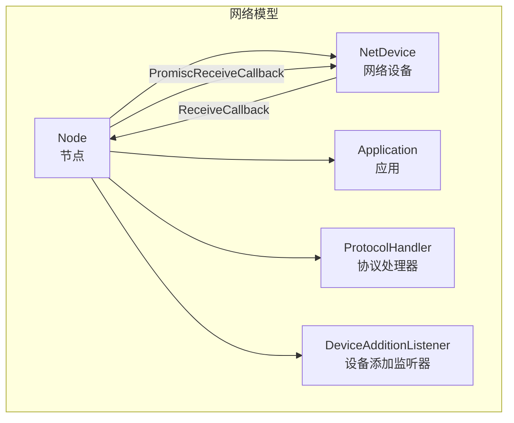
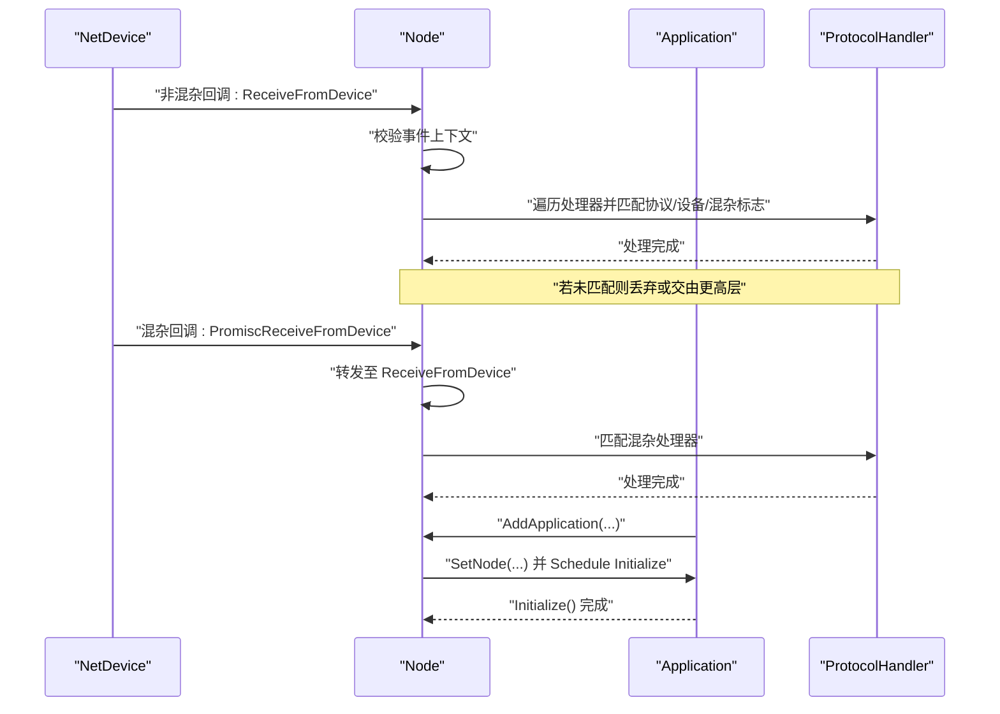
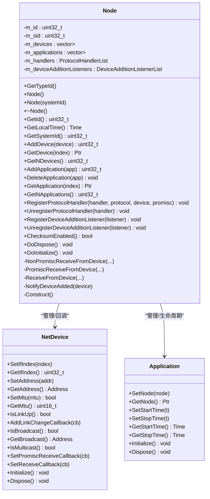
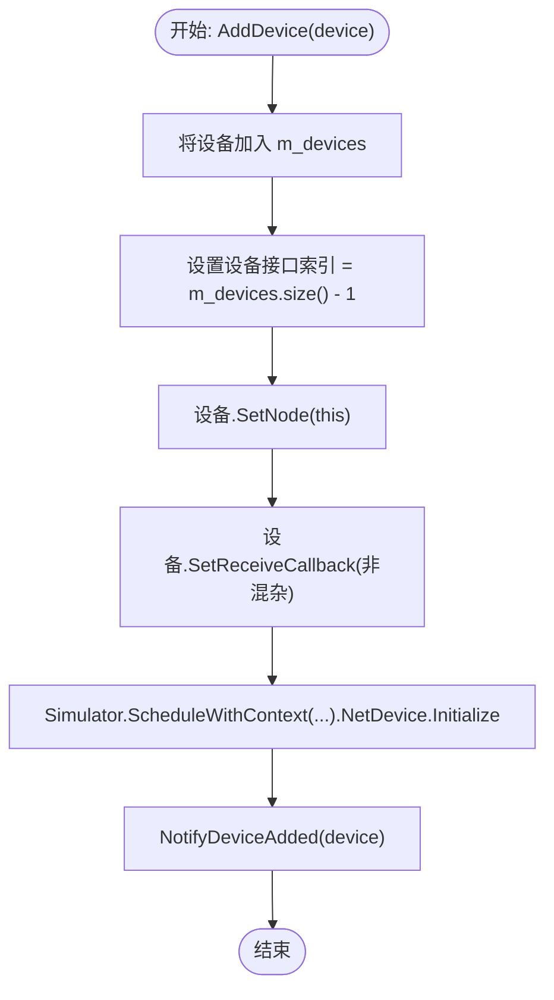
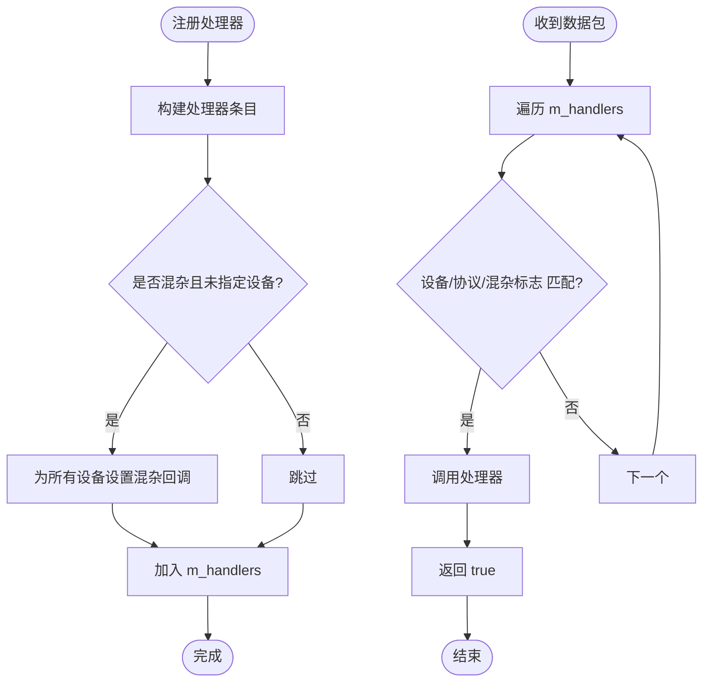
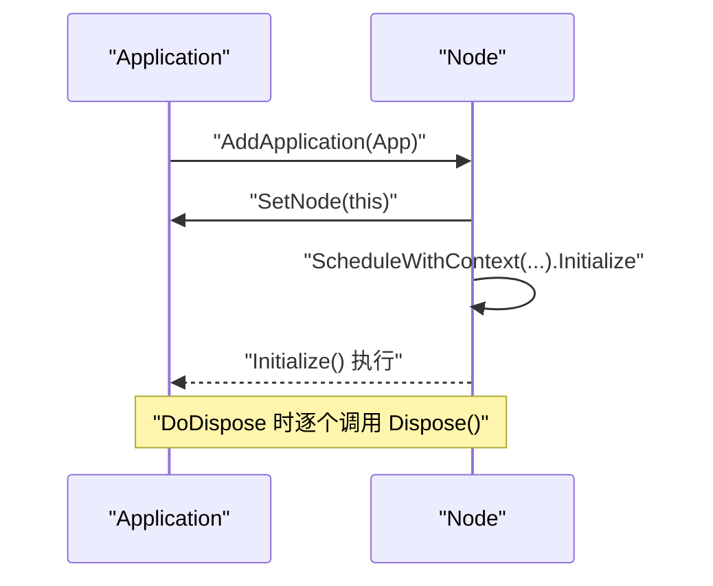
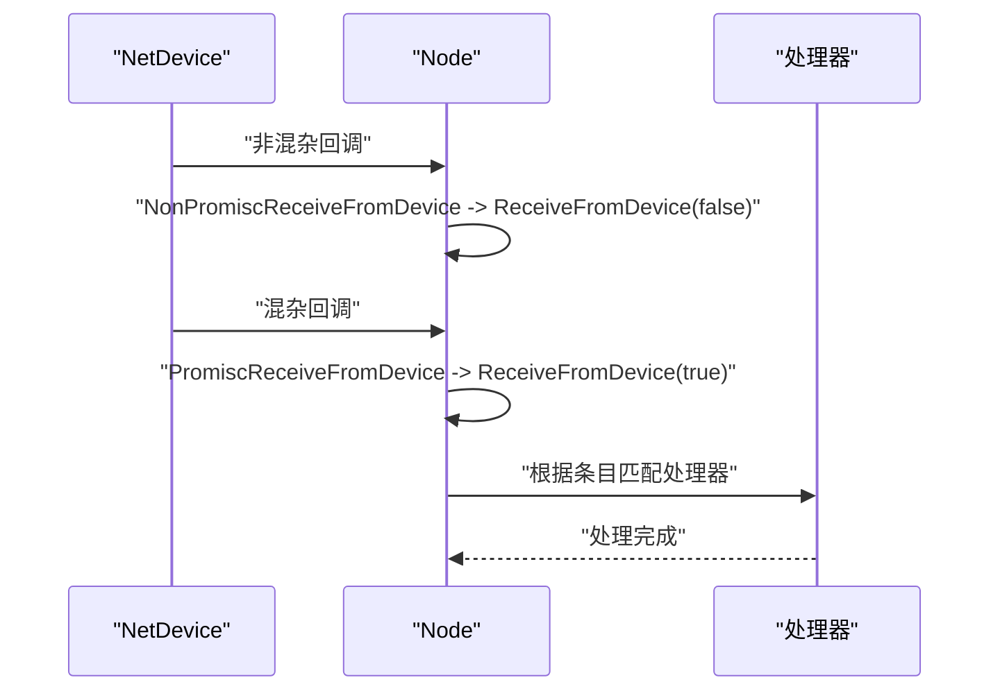
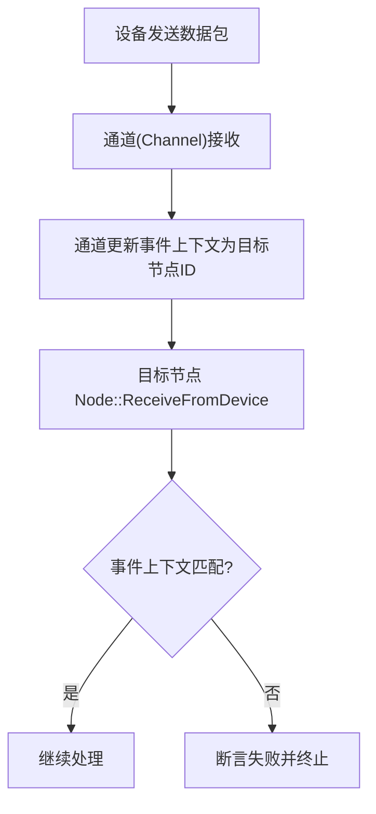
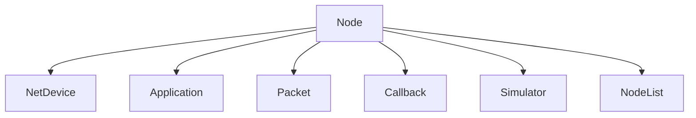

# 节点模型

<cite>
**本文引用的文件**
- [node.h](file://simulator/ns-3.39/src/network/model/node.h)
- [node.cc](file://simulator/ns-3.39/src/network/model/node.cc)
- [net-device.h](file://simulator/ns-3.39/src/network/model/net-device.h)
- [application.h](file://simulator/ns-3.39/src/applications/model/application.h)
- [node-list.h](file://simulator/ns-3.39/src/network/model/node-list.h)
- [packet.h](file://simulator/ns-3.39/src/network/model/packet.h)
- [callback.h](file://simulator/ns-3.39/src/core/include/ns3/callback.h)
- [simulator.h](file://simulator/ns-3.39/src/core/include/ns3/simulator.h)
</cite>

## 目录
1. [简介](#简介)
2. [项目结构](#项目结构)
3. [核心组件](#核心组件)
4. [架构总览](#架构总览)
5. [详细组件分析](#详细组件分析)
6. [依赖关系分析](#依赖关系分析)
7. [性能考虑](#性能考虑)
8. [故障排查指南](#故障排查指南)
9. [结论](#结论)
10. [附录](#附录)

## 简介
本文件系统性梳理 NS-3 中“节点（Node）”模型的设计与实现，重点覆盖以下方面：
- 节点标识符管理：唯一 ID、系统 ID 的生成与使用
- 设备列表管理：设备添加、索引分配、初始化与销毁
- 应用程序管理：应用生命周期、注册与注销
- 协议处理器注册：按协议类型与设备维度进行分发
- 混杂模式处理：Promiscuous 回调与非混杂回调的差异
- 数据包接收与转发：从设备到协议处理器的分发流程
- 节点间通信：通过通道（Channel）与事件上下文保证正确性
- 性能优化与扩展建议：回调链、容器选择、初始化策略等

## 项目结构
Node 类位于网络模块中，作为网络层与设备层之间的桥梁，负责：
- 维护 NetDevice 列表并为其设置回调
- 维护 Application 列表并触发其 Initialize 生命周期
- 注册/注销协议处理器，并在收到数据包时进行分发
- 提供设备添加监听器，支持动态发现已连接设备

图示来源
- [node.h:58-331](file://simulator/ns-3.39/src/network/model/node.h#L58-L331)
- [net-device.h:101-200](file://simulator/ns-3.39/src/network/model/net-device.h#L101-L200)

章节来源
- [node.h:41-57](file://simulator/ns-3.39/src/network/model/node.h#L41-L57)
- [node.cc:88-109](file://simulator/ns-3.39/src/network/model/node.cc#L88-L109)

## 核心组件
- 节点标识与时间
  - 唯一 ID：由 NodeList 自动分配，用于索引节点列表
  - 系统 ID：用于并行仿真区分不同系统实例
  - 本地时间：当前仿真时间的便捷访问
- 设备管理
  - 添加设备：自动分配接口索引、设置节点指针、设置接收回调、调度初始化
  - 获取设备：按索引访问，带断言保护
  - 数量统计：返回设备数量
- 应用管理
  - 添加应用：记录到列表、绑定节点、调度 Initialize
  - 删除应用：线性搜索并移除
  - 访问应用：按索引获取，带断言保护
- 协议处理器
  - 注册：支持按协议类型与设备过滤，支持混杂模式
  - 注销：基于回调相等性匹配移除
- 设备添加监听器
  - 注册：新监听器会收到现有所有设备的通知
  - 注销：基于回调相等性移除

章节来源
- [node.h:67-142](file://simulator/ns-3.39/src/network/model/node.h#L67-L142)
- [node.cc:137-202](file://simulator/ns-3.39/src/network/model/node.cc#L137-L202)
- [node.cc:250-295](file://simulator/ns-3.39/src/network/model/node.cc#L250-L295)
- [node.cc:371-398](file://simulator/ns-3.39/src/network/model/node.cc#L371-L398)

## 架构总览
下图展示了节点与设备、应用、协议处理器之间的交互关系，以及数据包从设备进入节点后的处理路径。

图示来源
- [node.cc:306-369](file://simulator/ns-3.39/src/network/model/node.cc#L306-L369)
- [node.cc:137-149](file://simulator/ns-3.39/src/network/model/node.cc#L137-L149)
- [node.cc:168-177](file://simulator/ns-3.39/src/network/model/node.cc#L168-L177)

## 详细组件分析

### 节点类设计与职责
- 继承关系：Node 继承自 Object，具备 NS-3 对象体系的属性、构造与生命周期能力
- 关键成员
  - m_id：节点唯一 ID，由 NodeList 分配
  - m_sid：系统 ID，用于并行仿真
  - m_devices：设备向量，保存该节点的所有 NetDevice
  - m_applications：应用向量，保存该节点的所有 Application
  - m_handlers：协议处理器列表，包含处理器、目标设备、协议类型、是否混杂
  - m_deviceAdditionListeners：设备添加监听器列表
- 关键方法
  - AddDevice：设置回调、索引、初始化并通知监听器
  - AddApplication：登记应用、绑定节点、调度 Initialize
  - RegisterProtocolHandler/UnregisterProtocolHandler：按条件匹配分发
  - NonPromiscReceiveFromDevice/PromiscReceiveFromDevice/ReceiveFromDevice：统一入口分发
  - DoDispose/DoInitialize：设备与应用的初始化与销毁顺序

图示来源
- [node.h:58-331](file://simulator/ns-3.39/src/network/model/node.h#L58-L331)
- [net-device.h:101-200](file://simulator/ns-3.39/src/network/model/net-device.h#L101-L200)
- [application.h](file://simulator/ns-3.39/src/applications/model/application.h)

章节来源
- [node.h:58-331](file://simulator/ns-3.39/src/network/model/node.h#L58-L331)
- [node.cc:204-247](file://simulator/ns-3.39/src/network/model/node.cc#L204-L247)

### 设备索引分配与初始化流程
- 索引分配：AddDevice 在将设备加入列表后，立即设置其接口索引为当前列表大小
- 接收回调：为设备设置非混杂回调，指向 Node::NonPromiscReceiveFromDevice
- 初始化：通过 Simulator::ScheduleWithContext 将设备 Initialize 放入事件队列
- 通知：调用 NotifyDeviceAdded 通知所有监听器

图示来源
- [node.cc:137-149](file://simulator/ns-3.39/src/network/model/node.cc#L137-L149)

章节来源
- [node.cc:137-149](file://simulator/ns-3.39/src/network/model/node.cc#L137-L149)

### 协议处理器注册与分发
- 注册：RegisterProtocolHandler 构造条目并写入 m_handlers；当 promiscuous 为真且未指定具体设备时，会对所有设备设置混杂回调
- 分发：ReceiveFromDevice 遍历处理器列表，按“设备匹配/协议匹配/混杂标志匹配”三要素筛选，命中即调用处理器
- 注销：基于回调相等性匹配移除

图示来源
- [node.cc:250-295](file://simulator/ns-3.39/src/network/model/node.cc#L250-L295)
- [node.cc:334-369](file://simulator/ns-3.39/src/network/model/node.cc#L334-L369)

章节来源
- [node.h:163-194](file://simulator/ns-3.39/src/network/model/node.h#L163-L194)
- [node.cc:250-295](file://simulator/ns-3.39/src/network/model/node.cc#L250-L295)
- [node.cc:334-369](file://simulator/ns-3.39/src/network/model/node.cc#L334-L369)

### 应用程序生命周期管理
- 添加：AddApplication 返回索引，设置应用节点并调度 Initialize
- 访问：GetApplication 与 GetNApplications 提供索引访问与计数
- 删除：DeleteApplication 线性搜索并移除
- 销毁：DoDispose 逐个调用应用 Dispose 并清空列表

图示来源
- [node.cc:168-177](file://simulator/ns-3.39/src/network/model/node.cc#L168-L177)
- [node.cc:204-227](file://simulator/ns-3.39/src/network/model/node.cc#L204-L227)

章节来源
- [node.cc:168-202](file://simulator/ns-3.39/src/network/model/node.cc#L168-L202)
- [node.cc:204-227](file://simulator/ns-3.39/src/network/model/node.cc#L204-L227)

### 混杂模式处理
- 非混杂：设备直接回调 Node::NonPromiscReceiveFromDevice，目的地址取自设备自身地址
- 混杂：当任一处理器注册为混杂模式时，Node 为相关设备设置混杂回调；回调进入 Node::PromiscReceiveFromDevice，再统一转入 ReceiveFromDevice
- 分发：ReceiveFromDevice 依据处理器条目中的 promiscuous 字段进行匹配

图示来源
- [node.cc:306-332](file://simulator/ns-3.39/src/network/model/node.cc#L306-L332)
- [node.cc:334-369](file://simulator/ns-3.39/src/network/model/node.cc#L334-L369)

章节来源
- [node.h:250-295](file://simulator/ns-3.39/src/network/model/node.h#L250-L295)
- [node.cc:306-369](file://simulator/ns-3.39/src/network/model/node.cc#L306-L369)

### 节点间通信与事件上下文
- 事件上下文：ReceiveFromDevice 断言当前事件上下文必须等于节点 ID，确保通道在事件传递时正确更新上下文
- 通道协作：NetDevice 通过 Channel 进行跨节点传输，节点仅在自身上下文中处理数据包

图示来源
- [node.cc:345-348](file://simulator/ns-3.39/src/network/model/node.cc#L345-L348)

章节来源
- [node.cc:345-348](file://simulator/ns-3.39/src/network/model/node.cc#L345-L348)

### 代码示例（路径）
以下为常见操作对应的源码位置（不直接展示代码内容）：
- 创建节点并获取 ID
  - [node.cc:88-109](file://simulator/ns-3.39/src/network/model/node.cc#L88-L109)
- 添加设备并设置回调
  - [node.cc:137-149](file://simulator/ns-3.39/src/network/model/node.cc#L137-L149)
- 注册协议处理器（含混杂模式）
  - [node.cc:250-295](file://simulator/ns-3.39/src/network/model/node.cc#L250-L295)
- 添加应用并启动 Initialize
  - [node.cc:168-177](file://simulator/ns-3.39/src/network/model/node.cc#L168-L177)
- 删除应用
  - [node.cc:179-185](file://simulator/ns-3.39/src/network/model/node.cc#L179-L185)
- 数据包接收与分发
  - [node.cc:334-369](file://simulator/ns-3.39/src/network/model/node.cc#L334-L369)

## 依赖关系分析
- 内部依赖
  - Node 依赖 NetDevice、Application、Packet、Callback、Simulator、NodeList
  - 处理器与监听器均采用回调封装，便于解耦
- 外部依赖
  - 通过 NodeList 维护全局节点索引
  - 通过 Simulator 管理事件上下文与调度

图示来源
- [node.h:23-31](file://simulator/ns-3.39/src/network/model/node.h#L23-L31)
- [node.cc:21-35](file://simulator/ns-3.39/src/network/model/node.cc#L21-L35)

章节来源
- [node.h:23-31](file://simulator/ns-3.39/src/network/model/node.h#L23-L31)
- [node.cc:21-35](file://simulator/ns-3.39/src/network/model/node.cc#L21-L35)

## 性能考虑
- 容器选择：设备与应用列表使用 std::vector，索引访问 O(1)，但插入/删除为摊还 O(1)，适合频繁查询场景
- 回调链长度：处理器列表遍历为 O(N)，建议按设备/协议做更细粒度的分组以降低匹配成本
- 初始化策略：设备与应用的 Initialize 通过事件调度延迟执行，避免阻塞构造过程
- 混杂模式：仅在需要时启用混杂回调，减少不必要的广播式处理
- 上下文校验：ReceiveFromDevice 的上下文断言可尽早暴露通道事件传递错误，避免无效计算

## 故障排查指南
- 设备索引越界
  - 现象：GetDevice 断言失败
  - 排查：确认 AddDevice 是否成功、索引是否与 m_devices.size() 对应
  - 参考
    - [node.cc:151-159](file://simulator/ns-3.39/src/network/model/node.cc#L151-L159)
- 应用索引越界
  - 现象：GetApplication 断言失败
  - 排查：确认 AddApplication 后是否被 DeleteApplication 删除
  - 参考
    - [node.cc:187-195](file://simulator/ns-3.39/src/network/model/node.cc#L187-L195)
- 事件上下文错误
  - 现象：ReceiveFromDevice 断言失败
  - 排查：检查通道是否正确设置事件上下文为目标节点 ID
  - 参考
    - [node.cc:345-348](file://simulator/ns-3.39/src/network/model/node.cc#L345-L348)
- 混杂回调未生效
  - 现象：混杂处理器未被调用
  - 排查：确认是否注册了混杂处理器、是否对相应设备设置了混杂回调
  - 参考
    - [node.cc:262-278](file://simulator/ns-3.39/src/network/model/node.cc#L262-L278)
- 节点销毁异常
  - 现象：设备或应用未正确释放
  - 排查：确认 DoDispose 是否被调用、是否提前释放了对象
  - 参考
    - [node.cc:204-227](file://simulator/ns-3.39/src/network/model/node.cc#L204-L227)

章节来源
- [node.cc:151-159](file://simulator/ns-3.39/src/network/model/node.cc#L151-L159)
- [node.cc:187-195](file://simulator/ns-3.39/src/network/model/node.cc#L187-L195)
- [node.cc:345-348](file://simulator/ns-3.39/src/network/model/node.cc#L345-L348)
- [node.cc:262-278](file://simulator/ns-3.39/src/network/model/node.cc#L262-L278)
- [node.cc:204-227](file://simulator/ns-3.39/src/network/model/node.cc#L204-L227)

## 结论
Node 类在 NS-3 中承担着“设备与应用的协调者、协议分发的枢纽”的角色。通过清晰的接口设计与严格的生命周期管理，它实现了：
- 明确的节点标识与系统标识
- 高效的设备与应用管理
- 灵活的协议处理器注册与分发
- 安全的事件上下文约束与混杂模式支持

对于扩展开发，建议：
- 在处理器注册前评估是否需要混杂模式，避免无谓的广播处理
- 使用监听器机制实现设备动态发现
- 在大规模场景中考虑对处理器列表进行分组或索引优化

## 附录
- 相关类型与接口
  - NetDevice：抽象网络设备接口，定义地址、MTU、链路状态、回调等
  - Application：抽象应用接口，定义生命周期与时间窗口
  - Packet：数据包抽象
  - Callback：回调封装
  - Simulator：仿真调度器与事件上下文
- 参考路径
  - [net-device.h:101-200](file://simulator/ns-3.39/src/network/model/net-device.h#L101-L200)
  - [application.h](file://simulator/ns-3.39/src/applications/model/application.h)
  - [packet.h](file://simulator/ns-3.39/src/network/model/packet.h)
  - [callback.h](file://simulator/ns-3.39/src/core/include/ns3/callback.h)
  - [simulator.h](file://simulator/ns-3.39/src/core/include/ns3/simulator.h)
  - [node-list.h](file://simulator/ns-3.39/src/network/model/node-list.h)