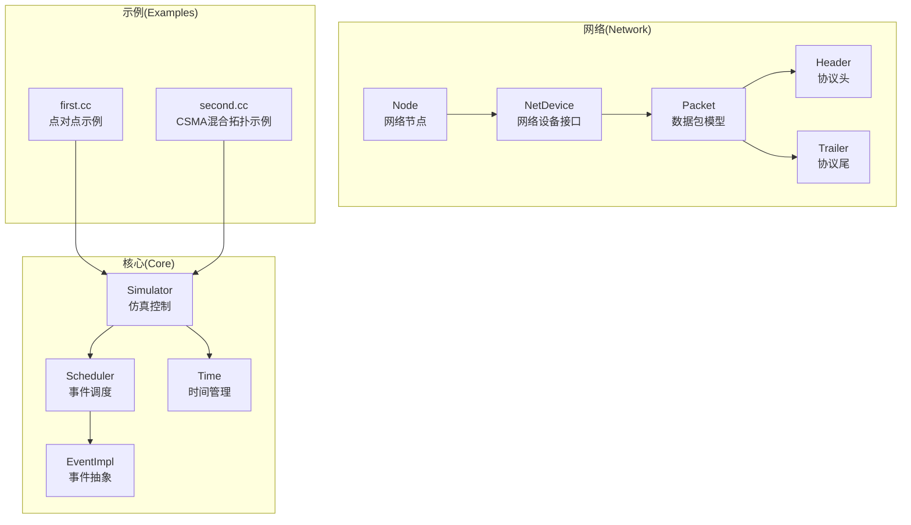
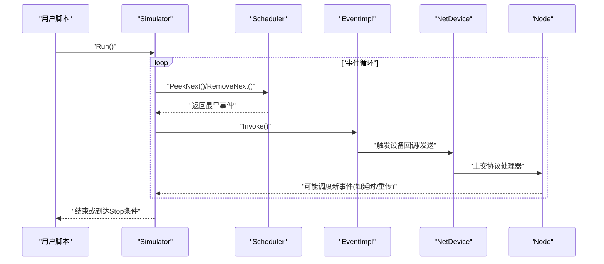
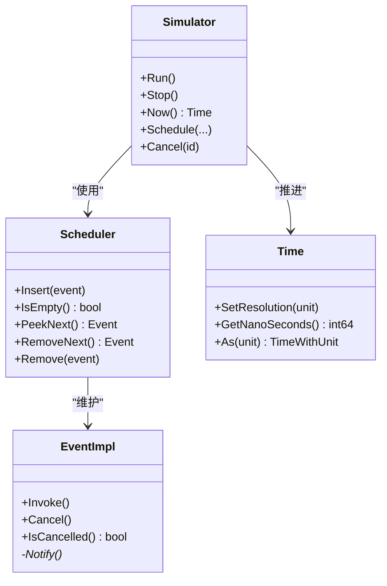
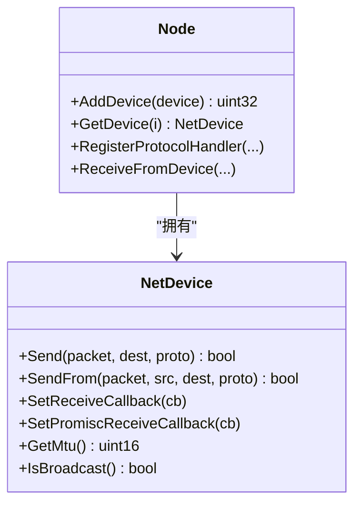
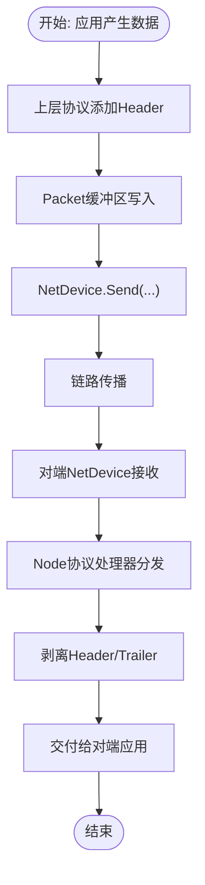
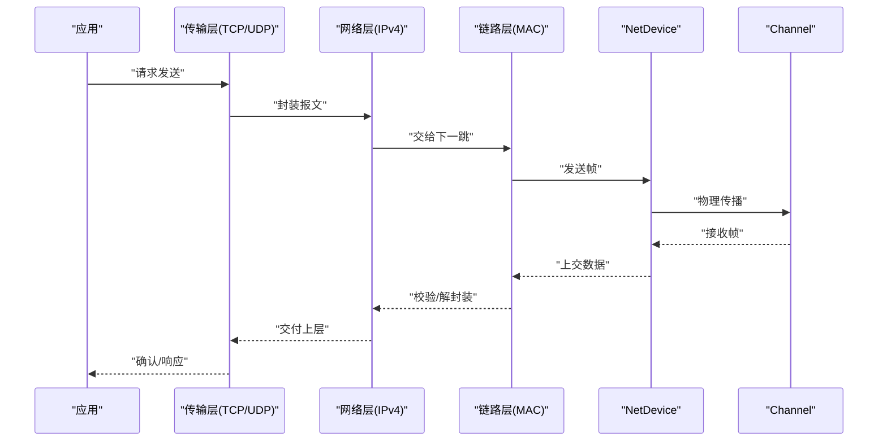
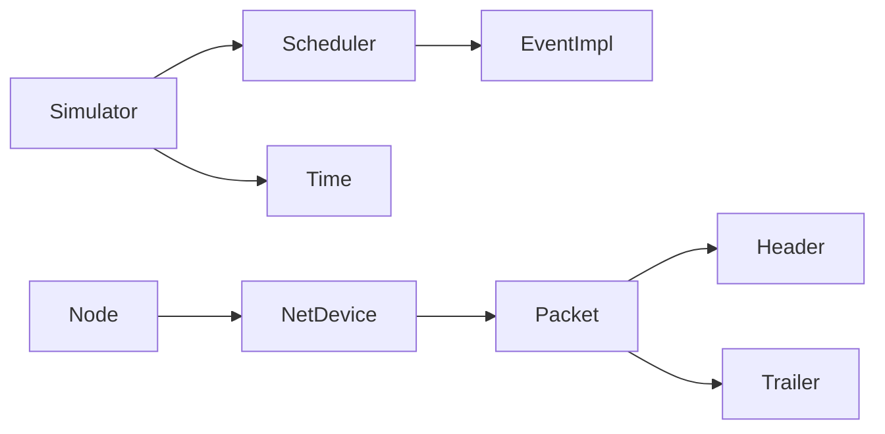

# 核心概念

<cite>
**本文引用的文件**   
- [README.md](file://simulator/ns-3.39/README.md)
- [index.rst](file://simulator/ns-3.39/doc/manual/source/index.rst)
- [simulator.h](file://simulator/ns-3.39/src/core/model/simulator.h)
- [simulator-impl.h](file://simulator/ns-3.39/src/core/model/simulator-impl.h)
- [scheduler.h](file://simulator/ns-3.39/src/core/model/scheduler.h)
- [event-impl.h](file://simulator/ns-3.39/src/core/model/event-impl.h)
- [nstime.h](file://simulator/ns-3.39/src/core/model/nstime.h)
- [packet.h](file://simulator/ns-3.39/src/network/model/packet.h)
- [node.h](file://simulator/ns-3.39/src/network/model/node.h)
- [net-device.h](file://simulator/ns-3.39/src/network/model/net-device.h)
- [header.h](file://simulator/ns-3.39/src/network/model/header.h)
- [trailer.h](file://simulator/ns-3.39/src/network/model/trailer.h)
- [first.cc](file://simulator/ns-3.39/examples/tutorial/first.cc)
- [second.cc](file://simulator/ns-3.39/examples/tutorial/second.cc)
</cite>

## 目录
1. [引言](#引言)
2. [项目结构](#项目结构)
3. [核心组件](#核心组件)
4. [架构总览](#架构总览)
5. [详细组件分析](#详细组件分析)
6. [依赖关系分析](#依赖关系分析)
7. [性能考量](#性能考量)
8. [故障排查指南](#故障排查指南)
9. [结论](#结论)
10. [附录](#附录)

## 引言
本文件面向具备一定编程经验但对网络仿真不熟悉的开发者，系统性地梳理NS-3数据中心平台的核心概念与实现要点。内容涵盖离散事件仿真原理、网络仿真基础理论、NS-3架构设计思想，并深入讲解仿真调度机制、事件处理流程与时间管理；同时阐明网络节点、设备、数据包等核心对象模型及其交互关系，解释数据包生命周期、路由转发机制与协议栈实现原理。文中通过关键源码路径与架构图帮助读者建立从概念到实现的完整认知。

## 项目结构
NS-3采用模块化分层组织：核心（Core）负责虚拟时钟与事件调度；网络（Network）定义节点、设备与数据包模型；互联网（Internet）提供IP/TCP/UDP等高层协议；应用（Applications）提供典型流量生成器；示例（Examples）展示端到端用法。下图给出与数据中心仿真密切相关的模块视图：

**图表来源**
- [simulator.h:67-531](file://simulator/ns-3.39/src/core/model/simulator.h#L67-L531)
- [scheduler.h:156-229](file://simulator/ns-3.39/src/core/model/scheduler.h#L156-L229)
- [event-impl.h:45-81](file://simulator/ns-3.39/src/core/model/event-impl.h#L45-L81)
- [nstime.h:104-103](file://simulator/ns-3.39/src/core/model/nstime.h#L104-L103)
- [node.h:58-331](file://simulator/ns-3.39/src/network/model/node.h#L58-L331)
- [net-device.h:101-383](file://simulator/ns-3.39/src/network/model/net-device.h#L101-L383)
- [packet.h:189-238](file://simulator/ns-3.39/src/network/model/packet.h#L189-L238)
- [header.h:43-105](file://simulator/ns-3.39/src/network/model/header.h#L43-L105)
- [trailer.h:40-116](file://simulator/ns-3.39/src/network/model/trailer.h#L40-L116)
- [first.cc:34-79](file://simulator/ns-3.39/examples/tutorial/first.cc#L34-L79)
- [second.cc:36-113](file://simulator/ns-3.39/examples/tutorial/second.cc#L36-L113)

**章节来源**
- [README.md:1-175](file://simulator/ns-3.39/README.md#L1-L175)
- [index.rst:1-35](file://simulator/ns-3.39/doc/manual/source/index.rst#L1-L35)

## 核心组件
- 仿真控制与调度
  - Simulator：统一入口，封装事件调度、停止条件、上下文切换、销毁清理等能力，屏蔽具体调度器实现差异。
  - Scheduler：抽象事件列表维护接口，支持多种实现（如堆、映射、链表等），决定插入/取出复杂度与内存开销。
  - EventImpl：事件抽象基类，Invoke/Cancel/IsCancelled构成事件执行与取消语义。
  - Time：虚拟时间表示与单位转换，支持纳秒级分辨率与单位自动缩放。

- 网络对象模型
  - Node：封装一组NetDevice与Application，提供协议处理器注册、设备添加监听等能力。
  - NetDevice：抽象网络设备接口，向上提供Send/SendFrom，向下连接Channel，支持广播/组播/点对点等特性。
  - Packet：带缓冲区、字节标签、包标签与元数据的数据单元，支持序列化/反序列化、片段化、拷贝等操作。
  - Header/Trailer：协议头/尾的序列化与打印接口，用于在Packet中按位精确描述协议字段。

- 示例脚本
  - first.cc：点对点链路+回显应用，演示基本拓扑搭建、日志与运行流程。
  - second.cc：点对点+CSMA混合拓扑，演示多段链路、全局路由表与PCAP抓包输出。

**章节来源**
- [simulator.h:67-531](file://simulator/ns-3.39/src/core/model/simulator.h#L67-L531)
- [simulator-impl.h:48-110](file://simulator/ns-3.39/src/core/model/simulator-impl.h#L48-L110)
- [scheduler.h:156-229](file://simulator/ns-3.39/src/core/model/scheduler.h#L156-L229)
- [event-impl.h:45-81](file://simulator/ns-3.39/src/core/model/event-impl.h#L45-L81)
- [nstime.h:104-103](file://simulator/ns-3.39/src/core/model/nstime.h#L104-L103)
- [node.h:58-331](file://simulator/ns-3.39/src/network/model/node.h#L58-L331)
- [net-device.h:101-383](file://simulator/ns-3.39/src/network/model/net-device.h#L101-L383)
- [packet.h:189-238](file://simulator/ns-3.39/src/network/model/packet.h#L189-L238)
- [header.h:43-105](file://simulator/ns-3.39/src/network/model/header.h#L43-L105)
- [trailer.h:40-116](file://simulator/ns-3.39/src/network/model/trailer.h#L40-L116)
- [first.cc:34-79](file://simulator/ns-3.39/examples/tutorial/first.cc#L34-L79)
- [second.cc:36-113](file://simulator/ns-3.39/examples/tutorial/second.cc#L36-L113)

## 架构总览
NS-3以“离散事件仿真”为核心范式：仿真器维护一个未来事件集合（FEL），按时间戳与唯一ID排序，每次取出最早事件并推进虚拟时间，驱动网络状态变化。网络对象（Node/NetDevice/Packet）在事件驱动下完成数据包收发、路由查询与协议处理。

**图表来源**
- [simulator.h:139-170](file://simulator/ns-3.39/src/core/model/simulator.h#L139-L170)
- [scheduler.h:202-220](file://simulator/ns-3.39/src/core/model/scheduler.h#L202-L220)
- [event-impl.h:56-77](file://simulator/ns-3.39/src/core/model/event-impl.h#L56-L77)
- [net-device.h:258-275](file://simulator/ns-3.39/src/network/model/net-device.h#L258-L275)
- [node.h:258-295](file://simulator/ns-3.39/src/network/model/node.h#L258-L295)

## 详细组件分析

### 仿真调度与时间管理
- 调度器接口
  - Scheduler定义事件键（含时间戳、唯一ID、上下文）与事件结构，提供插入、取最早、删除等纯虚方法，允许替换不同实现以平衡时间/空间复杂度。
- 事件抽象
  - EventImpl封装事件执行语义：Invoke在到期时调用绑定函数/方法；Cancel标记取消但不立即移除，提升取消效率。
- 时间管理
  - Time以64位整数存储虚拟时间，支持单位换算与分辨率设置；分辨率越高，最大可模拟时长越短，需根据场景权衡。

**图表来源**
- [scheduler.h:156-229](file://simulator/ns-3.39/src/core/model/scheduler.h#L156-L229)
- [event-impl.h:45-81](file://simulator/ns-3.39/src/core/model/event-impl.h#L45-L81)
- [nstime.h:104-103](file://simulator/ns-3.39/src/core/model/nstime.h#L104-L103)
- [simulator.h:139-170](file://simulator/ns-3.39/src/core/model/simulator.h#L139-L170)

**章节来源**
- [scheduler.h:54-155](file://simulator/ns-3.39/src/core/model/scheduler.h#L54-L155)
- [event-impl.h:45-81](file://simulator/ns-3.39/src/core/model/event-impl.h#L45-L81)
- [nstime.h:86-103](file://simulator/ns-3.39/src/core/model/nstime.h#L86-L103)
- [simulator.h:139-170](file://simulator/ns-3.39/src/core/model/simulator.h#L139-L170)

### 网络节点与设备模型
- Node
  - 维护设备列表与应用列表，提供协议处理器注册（普通/混杂模式）、设备添加监听、本地时间接口等。
  - 支持多设备聚合与动态发现，便于扩展数据中心拓扑中的交换机/服务器等角色。
- NetDevice
  - 向上提供Send/SendFrom，向下连接Channel；支持MTU、链路状态、广播/组播地址、点对点/桥接等特性。
  - 设备与节点双向关联，便于在事件中定位所属系统与上下文。

**图表来源**
- [node.h:58-331](file://simulator/ns-3.39/src/network/model/node.h#L58-L331)
- [net-device.h:101-383](file://simulator/ns-3.39/src/network/model/net-device.h#L101-L383)

**章节来源**
- [node.h:58-331](file://simulator/ns-3.39/src/network/model/node.h#L58-L331)
- [net-device.h:101-383](file://simulator/ns-3.39/src/network/model/net-device.h#L101-L383)

### 数据包生命周期与协议栈
- Packet
  - 内部包含缓冲区、字节标签、包标签与元数据；支持头部/尾部序列化/反序列化、片段化、拷贝与打印。
  - 字节标签随字节移动，包标签随包移动，用于跨层信息传递（如流ID、QoS）。
- Header/Trailer
  - 协议头/尾必须实现序列化/反序列化与打印接口，确保与真实网络协议位级一致。
- 典型流程
  - 应用产生数据 → 上层协议封装头部 → Packet缓冲区写入 → NetDevice发送 → 对端NetDevice接收 → Node协议处理器分发 → 下层协议剥离头部 → 应用读取。

**图表来源**
- [packet.h:189-238](file://simulator/ns-3.39/src/network/model/packet.h#L189-L238)
- [header.h:43-105](file://simulator/ns-3.39/src/network/model/header.h#L43-L105)
- [trailer.h:40-116](file://simulator/ns-3.39/src/network/model/trailer.h#L40-L116)
- [net-device.h:258-275](file://simulator/ns-3.39/src/network/model/net-device.h#L258-L275)
- [node.h:258-295](file://simulator/ns-3.39/src/network/model/node.h#L258-L295)

**章节来源**
- [packet.h:189-238](file://simulator/ns-3.39/src/network/model/packet.h#L189-L238)
- [header.h:43-105](file://simulator/ns-3.39/src/network/model/header.h#L43-L105)
- [trailer.h:40-116](file://simulator/ns-3.39/src/network/model/trailer.h#L40-L116)
- [net-device.h:258-275](file://simulator/ns-3.39/src/network/model/net-device.h#L258-L275)
- [node.h:258-295](file://simulator/ns-3.39/src/network/model/node.h#L258-L295)

### 路由转发机制与协议栈实现
- 路由表与全局路由
  - 示例脚本通过全局路由助手填充路由表，实现跨子网转发；数据中心场景可结合静态/动态路由策略。
- 协议栈层次
  - 应用层（Applications）→ 传输层（TCP/UDP）→ 网络层（IPv4/IPv6）→ 链路层（MAC/ARP）→ 物理层（Channel/NetDevice）
- 事件驱动的转发
  - 每次事件可能触发新的数据包发送、重传或超时处理，调度器保证按时间顺序推进。

**图表来源**
- [second.cc:105-108](file://simulator/ns-3.39/examples/tutorial/second.cc#L105-L108)
- [net-device.h:258-275](file://simulator/ns-3.39/src/network/model/net-device.h#L258-L275)
- [node.h:258-295](file://simulator/ns-3.39/src/network/model/node.h#L258-L295)

**章节来源**
- [second.cc:105-108](file://simulator/ns-3.39/examples/tutorial/second.cc#L105-L108)

### 实践示例与最佳实践
- 基础示例
  - first.cc：点对点链路+回显应用，演示拓扑构建、日志启用、运行与销毁流程。
  - second.cc：混合拓扑（点对点+CSMA），演示多段链路、全局路由表与抓包输出。
- 最佳实践
  - 明确事件上下文：使用带上下文的调度接口避免跨上下文状态竞争。
  - 合理选择调度器：大规模事件列表优先考虑低插入/取出复杂度实现。
  - 精细控制时间分辨率：根据仿真时长与精度需求设置分辨率。
  - 使用标签追踪：通过字节/包标签记录流信息与QoS属性，便于统计分析。

**章节来源**
- [first.cc:34-79](file://simulator/ns-3.39/examples/tutorial/first.cc#L34-L79)
- [second.cc:36-113](file://simulator/ns-3.39/examples/tutorial/second.cc#L36-L113)
- [simulator.h:262-304](file://simulator/ns-3.39/src/core/model/simulator.h#L262-L304)
- [scheduler.h:75-155](file://simulator/ns-3.39/src/core/model/scheduler.h#L75-L155)

## 依赖关系分析
- 松耦合与高内聚
  - Node与NetDevice通过接口解耦，NetDevice与Channel通过抽象接口连接，降低设备类型对上层的影响。
  - Packet与Header/Trailer通过继承Chunk实现序列化契约，保持协议扩展的灵活性。
- 关键依赖链
  - Simulator依赖Scheduler与Time；Scheduler持有EventImpl指针；Node/NetDevice/Packet共同组成网络层核心。
- 循环依赖规避
  - 通过前向声明与智能指针（Ptr）管理生命周期，避免直接循环引用。

**图表来源**
- [simulator.h:67-115](file://simulator/ns-3.39/src/core/model/simulator.h#L67-L115)
- [scheduler.h:156-229](file://simulator/ns-3.39/src/core/model/scheduler.h#L156-L229)
- [event-impl.h:45-81](file://simulator/ns-3.39/src/core/model/event-impl.h#L45-L81)
- [node.h:58-331](file://simulator/ns-3.39/src/network/model/node.h#L58-L331)
- [net-device.h:101-383](file://simulator/ns-3.39/src/network/model/net-device.h#L101-L383)
- [packet.h:189-238](file://simulator/ns-3.39/src/network/model/packet.h#L189-L238)
- [header.h:43-105](file://simulator/ns-3.39/src/network/model/header.h#L43-L105)
- [trailer.h:40-116](file://simulator/ns-3.39/src/network/model/trailer.h#L40-L116)

**章节来源**
- [simulator.h:67-115](file://simulator/ns-3.39/src/core/model/simulator.h#L67-L115)
- [scheduler.h:156-229](file://simulator/ns-3.39/src/core/model/scheduler.h#L156-L229)
- [node.h:58-331](file://simulator/ns-3.39/src/network/model/node.h#L58-L331)
- [net-device.h:101-383](file://simulator/ns-3.39/src/network/model/net-device.h#L101-L383)
- [packet.h:189-238](file://simulator/ns-3.39/src/network/model/packet.h#L189-L238)

## 性能考量
- 调度器选择
  - 插入/取出复杂度与内存占用因实现而异，建议针对模型特征进行基准测试后选择（如堆/映射/链表等）。
- 取消策略
  - Cancel仅标记取消，Remove实际删除，前者O(1)，后者更费时但可减小事件表规模。
- 时间分辨率
  - 提升分辨率会缩小最大可模拟时长，应依据业务需求折中。
- 复制与拷贝
  - Packet支持写时复制（COW）优化，频繁拷贝场景需关注内存与CPU成本。

[本节为通用指导，无需特定文件引用]

## 故障排查指南
- 常见问题
  - 事件未执行：检查是否被Cancel、是否在Destroy队列中、是否超过Stop时间。
  - 数据包未达：核对路由表、设备MTU、链路状态与协议号匹配。
  - 日志无输出：确认日志组件已启用且级别配置正确。
- 定位手段
  - 使用示例脚本作为最小复现，逐步加入自定义逻辑。
  - 利用抓包输出与统计工具定位转发路径与丢包位置。

**章节来源**
- [simulator.h:405-436](file://simulator/ns-3.39/src/core/model/simulator.h#L405-L436)
- [first.cc:39-42](file://simulator/ns-3.39/examples/tutorial/first.cc#L39-L42)
- [second.cc:48-52](file://simulator/ns-3.39/examples/tutorial/second.cc#L48-L52)

## 结论
NS-3以离散事件仿真为核心，通过抽象的仿真器、调度器与时间管理，将复杂的网络行为建模为可预测的事件序列。网络层以Node/NetDevice/Packet为基本构件，配合Header/Trailer实现协议栈的模块化与可扩展。示例脚本展示了从简单点对点到混合拓扑的搭建流程。掌握这些核心概念与对象关系，即可在数据中心场景中高效构建与验证网络方案。

[本节为总结性内容，无需特定文件引用]

## 附录
- 快速参考
  - 仿真控制：Simulator::Run/Stop/Now/Cancel/Remove/Schedule系列
  - 调度器：Scheduler::Insert/RemoveNext/PeekNext/Remove
  - 时间：Time::SetResolution/GetNanoSeconds/As
  - 网络：Node::RegisterProtocolHandler/NetDevice::Send/SendFrom/Packet::AddHeader/RemoveHeader

**章节来源**
- [simulator.h:139-531](file://simulator/ns-3.39/src/core/model/simulator.h#L139-L531)
- [scheduler.h:197-228](file://simulator/ns-3.39/src/core/model/scheduler.h#L197-L228)
- [nstime.h:468-593](file://simulator/ns-3.39/src/core/model/nstime.h#L468-L593)
- [node.h:184-194](file://simulator/ns-3.39/src/network/model/node.h#L184-L194)
- [net-device.h:258-275](file://simulator/ns-3.39/src/network/model/net-device.h#L258-L275)
- [packet.h:321-343](file://simulator/ns-3.39/src/network/model/packet.h#L321-L343)