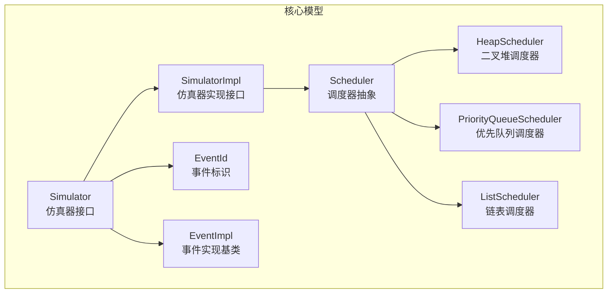
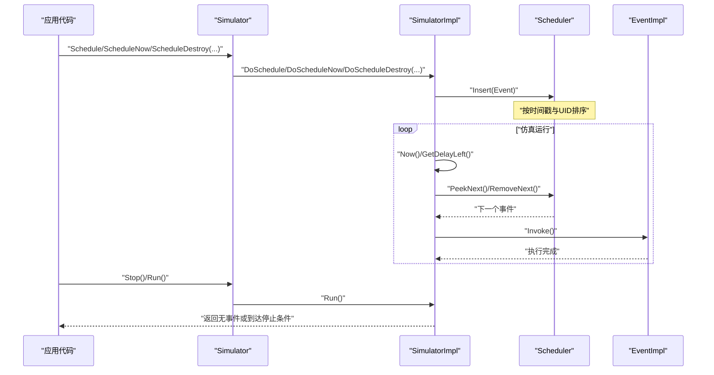
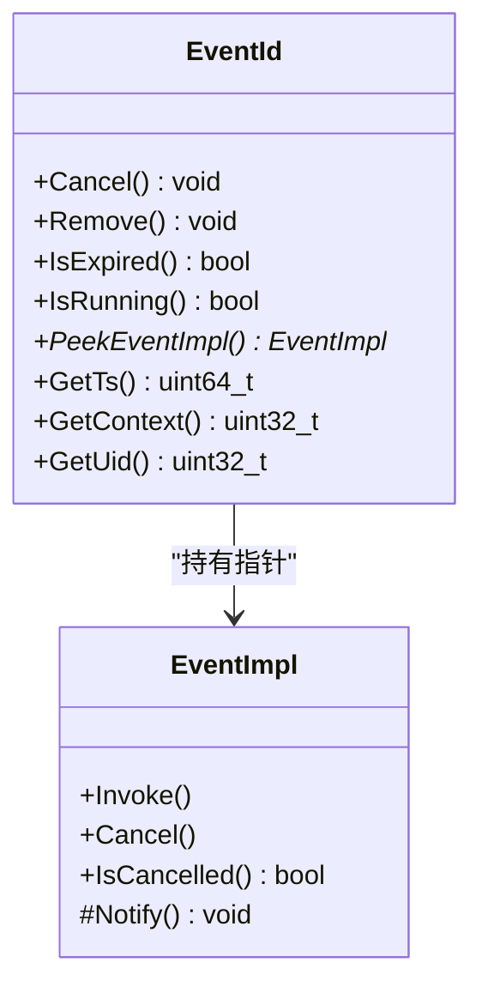
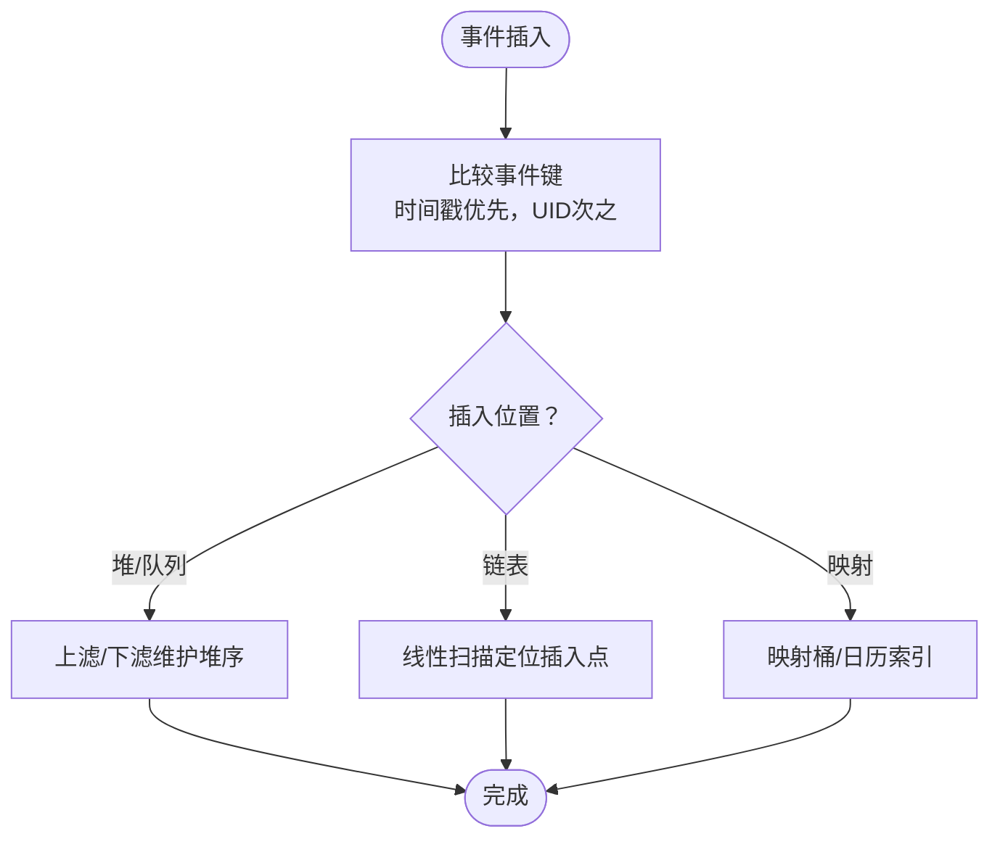
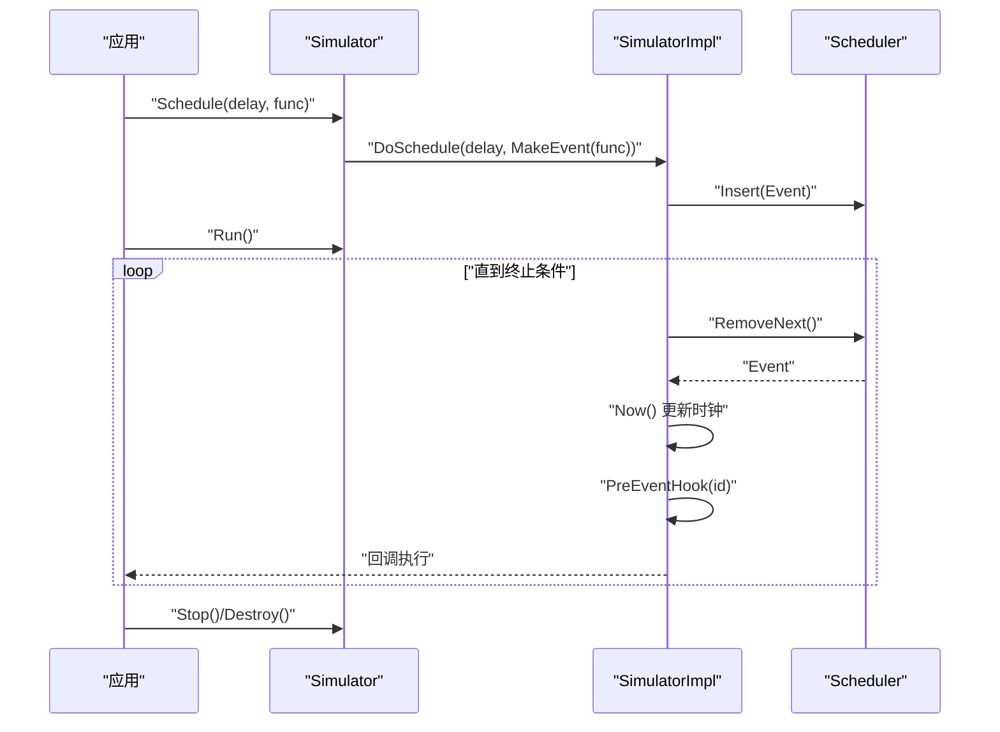
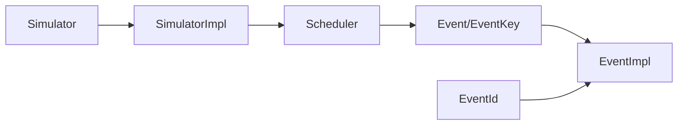

# 离散事件仿真原理

<cite>
**本文引用的文件**   
- [simulator-impl.h](file://simulator/ns-3.39/src/core/model/simulator-impl.h)
- [simulator.h](file://simulator/ns-3.39/src/core/model/simulator.h)
- [event-impl.h](file://simulator/ns-3.39/src/core/model/event-impl.h)
- [event-id.h](file://simulator/ns-3.39/src/core/model/event-id.h)
- [scheduler.h](file://simulator/ns-3.39/src/core/model/scheduler.h)
- [heap-scheduler.h](file://simulator/ns-3.39/src/core/model/heap-scheduler.h)
- [priority-queue-scheduler.h](file://simulator/ns-3.39/src/core/model/priority-queue-scheduler.h)
- [list-scheduler.h](file://simulator/ns-3.39/src/core/model/list-scheduler.h)
- [default-simulator-impl.h](file://simulator/ns-3.39/src/core/model/default-simulator-impl.h)
- [realtime-simulator-impl.h](file://simulator/ns-3.39/src/core/model/realtime-simulator-impl.h)
- [sample-simulator.cc](file://simulator/ns-3.39/examples/sample-simulator.cc)
</cite>

## 目录
1. [引言](#引言)
2. [项目结构](#项目结构)
3. [核心组件](#核心组件)
4. [架构总览](#架构总览)
5. [关键组件详解](#关键组件详解)
6. [依赖关系分析](#依赖关系分析)
7. [性能考量](#性能考量)
8. [故障排查指南](#故障排查指南)
9. [结论](#结论)
10. [附录：示例与最佳实践](#附录示例与最佳实践)

## 引言
本文件系统性阐述 NS-3 中离散事件仿真（Discrete Event Simulation, DES）的原理与实现要点，覆盖以下主题：
- 基本概念与数学基础：虚拟时间、事件、事件列表、调度器、仿真时钟推进
- 事件队列管理与调度机制：事件插入、取出、取消、删除、优先级排序
- 时间推进算法与仿真时钟管理：当前时间查询、停止条件、最大可表示时间
- 实时仿真与传统仿真的差异及适用场景
- 性能优化策略与最佳实践

目标是帮助读者从代码层面理解 NS-3 的 DES 运行机制，并在实际建模中高效、安全地使用事件调度。

## 项目结构
围绕 DES 的核心代码主要位于 core 模块的 model 子目录，包括：
- 仿真器接口与实现：Simulator 与 SimulatorImpl
- 事件模型：EventImpl 与 EventId
- 调度器抽象与多种实现：Scheduler 及其具体实现（堆、优先队列、链表、映射等）
- 实现变体：默认单线程仿真器与实时仿真器
- 示例：如何创建与调度事件

图示来源
- [simulator.h:67-531](file://simulator/ns-3.39/src/core/model/simulator.h#L67-L531)
- [simulator-impl.h:48-110](file://simulator/ns-3.39/src/core/model/simulator-impl.h#L48-L110)
- [event-impl.h:45-81](file://simulator/ns-3.39/src/core/model/event-impl.h#L45-L81)
- [event-id.h:54-150](file://simulator/ns-3.39/src/core/model/event-id.h#L54-L150)
- [scheduler.h:156-229](file://simulator/ns-3.39/src/core/model/scheduler.h#L156-L229)
- [heap-scheduler.h:73-185](file://simulator/ns-3.39/src/core/model/heap-scheduler.h#L73-L185)
- [priority-queue-scheduler.h:65-107](file://simulator/ns-3.39/src/core/model/priority-queue-scheduler.h#L65-L107)
- [list-scheduler.h:65-94](file://simulator/ns-3.39/src/core/model/list-scheduler.h#L65-L94)

章节来源
- [simulator.h:67-531](file://simulator/ns-3.39/src/core/model/simulator.h#L67-L531)
- [simulator-impl.h:48-110](file://simulator/ns-3.39/src/core/model/simulator-impl.h#L48-L110)
- [event-impl.h:45-81](file://simulator/ns-3.39/src/core/model/event-impl.h#L45-L81)
- [event-id.h:54-150](file://simulator/ns-3.39/src/core/model/event-id.h#L54-L150)
- [scheduler.h:156-229](file://simulator/ns-3.39/src/core/model/scheduler.h#L156-L229)
- [heap-scheduler.h:73-185](file://simulator/ns-3.39/src/core/model/heap-scheduler.h#L73-L185)
- [priority-queue-scheduler.h:65-107](file://simulator/ns-3.39/src/core/model/priority-queue-scheduler.h#L65-L107)
- [list-scheduler.h:65-94](file://simulator/ns-3.39/src/core/model/list-scheduler.h#L65-L94)

## 核心组件
- 仿真器接口与实现
  - Simulator：面向用户的静态接口，封装调度、运行、停止、上下文、销毁等操作；内部委托给 SimulatorImpl 单例
  - SimulatorImpl：仿真器实现接口，定义 Destroy、Run、Stop、Schedule、Now、SetScheduler 等虚方法
- 事件模型
  - EventImpl：事件抽象，提供 Invoke、Cancel、IsCancelled 等生命周期控制
  - EventId：事件标识符，携带事件实现指针、虚拟时间戳、上下文与唯一 ID，支持比较与取消/移除
- 调度器
  - Scheduler：抽象事件列表维护接口，定义 Insert、PeekNext、RemoveNext、Remove 等
  - 多种实现：HeapScheduler（二叉堆）、PriorityQueueScheduler（STL 优先队列）、ListScheduler（链表）

章节来源
- [simulator.h:67-531](file://simulator/ns-3.39/src/core/model/simulator.h#L67-L531)
- [simulator-impl.h:48-110](file://simulator/ns-3.39/src/core/model/simulator-impl.h#L48-L110)
- [event-impl.h:45-81](file://simulator/ns-3.39/src/core/model/event-impl.h#L45-L81)
- [event-id.h:54-150](file://simulator/ns-3.39/src/core/model/event-id.h#L54-L150)
- [scheduler.h:156-229](file://simulator/ns-3.39/src/core/model/scheduler.h#L156-L229)

## 架构总览
下图展示了 DES 的高层交互：应用通过 Simulator 接口调度事件，事件被包装为 EventImpl 并由 Scheduler 维护；SimulatorImpl 决定何时推进仿真时钟并执行下一个事件。

图示来源
- [simulator.h:140-170](file://simulator/ns-3.39/src/core/model/simulator.h#L140-L170)
- [simulator-impl.h:79-86](file://simulator/ns-3.39/src/core/model/simulator-impl.h#L79-L86)
- [scheduler.h:192-228](file://simulator/ns-3.39/src/core/model/scheduler.h#L192-L228)
- [event-impl.h:56-77](file://simulator/ns-3.39/src/core/model/event-impl.h#L56-L77)

## 关键组件详解

### 事件与事件标识
- EventImpl
  - 提供 Invoke 作为执行入口，Notify 为子类实现
  - 支持 Cancel/IsCancelled 控制事件是否跳过执行
- EventId
  - 包含 EventImpl 指针、虚拟时间戳、上下文与唯一 ID
  - 支持比较运算符，用于调度器排序与查找
  - 提供 Cancel/Remove/IsExpired/IsRunning 等便捷方法

图示来源
- [event-impl.h:45-81](file://simulator/ns-3.39/src/core/model/event-impl.h#L45-L81)
- [event-id.h:54-150](file://simulator/ns-3.39/src/core/model/event-id.h#L54-L150)

章节来源
- [event-impl.h:45-81](file://simulator/ns-3.39/src/core/model/event-impl.h#L45-L81)
- [event-id.h:54-150](file://simulator/ns-3.39/src/core/model/event-id.h#L54-L150)

### 调度器与事件优先级
- Scheduler 抽象
  - 定义事件键 EventKey（时间戳、UID、上下文）与事件结构
  - 提供 Insert/IsEmpty/PeekNext/RemoveNext/Remove 接口
  - 事件比较规则：先按时间戳，再按 UID，确保同刻度内 FIFO
- 具体实现复杂度对比（来自注释）
  - 堆/优先队列：插入/删除均对数复杂度，适合大事件列表
  - 链表：插入线性，取首常数，适合小到中等规模且频繁取首
  - 映射/日历：常数插入/删除，但内存开销较大

图示来源
- [scheduler.h:169-187](file://simulator/ns-3.39/src/core/model/scheduler.h#L169-L187)
- [scheduler.h:272-287](file://simulator/ns-3.39/src/core/model/scheduler.h#L272-L287)
- [heap-scheduler.h:73-185](file://simulator/ns-3.39/src/core/model/heap-scheduler.h#L73-L185)
- [priority-queue-scheduler.h:65-107](file://simulator/ns-3.39/src/core/model/priority-queue-scheduler.h#L65-L107)
- [list-scheduler.h:65-94](file://simulator/ns-3.39/src/core/model/list-scheduler.h#L65-L94)

章节来源
- [scheduler.h:156-229](file://simulator/ns-3.39/src/core/model/scheduler.h#L156-L229)
- [heap-scheduler.h:73-185](file://simulator/ns-3.39/src/core/model/heap-scheduler.h#L73-L185)
- [priority-queue-scheduler.h:65-107](file://simulator/ns-3.39/src/core/model/priority-queue-scheduler.h#L65-L107)
- [list-scheduler.h:65-94](file://simulator/ns-3.39/src/core/model/list-scheduler.h#L65-L94)

### 仿真器接口与运行循环
- Simulator
  - 提供 Schedule/ScheduleNow/ScheduleDestroy 系列模板方法，内部通过 MakeEvent 封装函数/成员函数
  - Run/Stop/IsFinished/Now/GetDelayLeft/GetMaximumSimulationTime 等
  - 支持设置不同 Scheduler 实现（如堆、优先队列、链表）
- SimulatorImpl
  - 作为具体实现的抽象接口，定义 Destroy/Run/Stop/Now/SetScheduler 等纯虚方法
  - 默认实现与实时实现分别对应传统仿真与时钟同步需求

图示来源
- [simulator.h:212-499](file://simulator/ns-3.39/src/core/model/simulator.h#L212-L499)
- [simulator.h:140-170](file://simulator/ns-3.39/src/core/model/simulator.h#L140-L170)
- [simulator-impl.h:79-110](file://simulator/ns-3.39/src/core/model/simulator-impl.h#L79-L110)
- [scheduler.h:192-228](file://simulator/ns-3.39/src/core/model/scheduler.h#L192-L228)

章节来源
- [simulator.h:67-531](file://simulator/ns-3.39/src/core/model/simulator.h#L67-L531)
- [simulator-impl.h:48-110](file://simulator/ns-3.39/src/core/model/simulator-impl.h#L48-L110)

### 实时仿真与传统仿真的区别
- 默认实现（非实时）
  - 单线程推进，不进行系统时钟同步，追求高吞吐与低开销
- 实时实现
  - 通过与系统真实时间同步，保证仿真步进与现实时间保持比例关系，适用于需要“以现实速度”观察仿真的场景
- 切换方式
  - 可在运行前通过 SetImplementation 或运行中通过 SetScheduler 切换不同实现/调度器

章节来源
- [simulator.h:74-86](file://simulator/ns-3.39/src/core/model/simulator.h#L74-L86)
- [default-simulator-impl.h](file://simulator/ns-3.39/src/core/model/default-simulator-impl.h)
- [realtime-simulator-impl.h](file://simulator/ns-3.39/src/core/model/realtime-simulator-impl.h)

## 依赖关系分析
- Simulator 依赖 SimulatorImpl（组合/委托）
- SimulatorImpl 依赖 Scheduler（组合）
- Scheduler 依赖 EventImpl（通过 Event/EventKey）
- EventId 持有 EventImpl 指针并参与排序比较
- 不同 Scheduler 实现之间相互独立，可通过工厂切换

图示来源
- [simulator.h:67-531](file://simulator/ns-3.39/src/core/model/simulator.h#L67-L531)
- [simulator-impl.h:48-110](file://simulator/ns-3.39/src/core/model/simulator-impl.h#L48-L110)
- [scheduler.h:156-229](file://simulator/ns-3.39/src/core/model/scheduler.h#L156-L229)
- [event-impl.h:45-81](file://simulator/ns-3.39/src/core/model/event-impl.h#L45-L81)
- [event-id.h:54-150](file://simulator/ns-3.39/src/core/model/event-id.h#L54-L150)

章节来源
- [simulator.h:67-531](file://simulator/ns-3.39/src/core/model/simulator.h#L67-L531)
- [simulator-impl.h:48-110](file://simulator/ns-3.39/src/core/model/simulator-impl.h#L48-L110)
- [scheduler.h:156-229](file://simulator/ns-3.39/src/core/model/scheduler.h#L156-L229)
- [event-impl.h:45-81](file://simulator/ns-3.39/src/core/model/event-impl.h#L45-L81)
- [event-id.h:54-150](file://simulator/ns-3.39/src/core/model/event-id.h#L54-L150)

## 性能考量
- 调度器选择
  - 大事件列表：优先选择堆或优先队列实现，以获得对数级插入/删除
  - 小到中等规模且频繁取首：链表实现更合适
  - 可在运行中通过 Simulator::SetScheduler 动态切换
- 取消策略
  - Cancel（置位取消位）为 O(1)，Remove（从列表删除）通常较慢，需权衡事件生命周期
- 事件数量统计
  - 使用 GetEventCount 跟踪执行事件总数，辅助性能分析
- 时间精度与比较
  - 虚拟时间以整数单位存储，相同时间戳的事件按 FIFO 排序，避免竞态

章节来源
- [scheduler.h:54-74](file://simulator/ns-3.39/src/core/model/scheduler.h#L54-L74)
- [simulator.h:407-420](file://simulator/ns-3.39/src/core/model/simulator.h#L407-L420)
- [simulator.h:208-209](file://simulator/ns-3.39/src/core/model/simulator.h#L208-L209)

## 故障排查指南
- 无法取消/删除“Destroy”类事件
  - Simulator::Remove/Cancel 对“销毁时刻”事件无效，调用会导致程序错误
- 检查事件状态
  - 使用 EventId::IsExpired/IsRunning 或 Simulator::IsExpired 判断事件状态
- 获取剩余延迟
  - 使用 Simulator::GetDelayLeft 获取某事件距离到期的剩余时间
- 上下文与并发
  - 使用 ScheduleWithContext 指定上下文，避免跨上下文共享状态导致的竞争

章节来源
- [simulator.h:405-436](file://simulator/ns-3.39/src/core/model/simulator.h#L405-L436)
- [event-id.h:98-104](file://simulator/ns-3.39/src/core/model/event-id.h#L98-L104)

## 结论
NS-3 的 DES 架构以 Simulator 为核心接口，通过 SimulatorImpl 与 Scheduler 解耦了调度策略与仿真控制逻辑。EventImpl/EventId 提供了清晰的事件生命周期与标识能力。借助多种调度器实现与上下文机制，用户可以在性能与功能之间灵活取舍，并在需要时切换实时仿真模式。掌握这些组件及其交互，有助于高效构建大规模离散事件仿真。

## 附录：示例与最佳实践
- 创建与调度事件
  - 参考示例脚本，使用 Simulator::Schedule/ScheduleNow/ScheduleDestroy 等接口
  - 使用 MakeEvent 将函数/成员函数绑定为事件
- 最佳实践
  - 事件尽量短小、幂等，避免长事务阻塞事件队列
  - 合理使用上下文，减少跨上下文状态访问
  - 在大规模仿真中优先选择堆或优先队列调度器
  - 需要“现实速度”观察时启用实时仿真实现

章节来源
- [sample-simulator.cc](file://simulator/ns-3.39/examples/sample-simulator.cc)
- [simulator.h:212-499](file://simulator/ns-3.39/src/core/model/simulator.h#L212-L499)