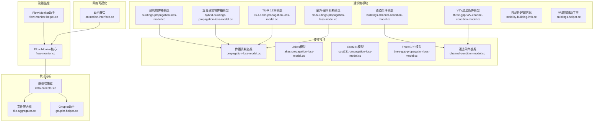
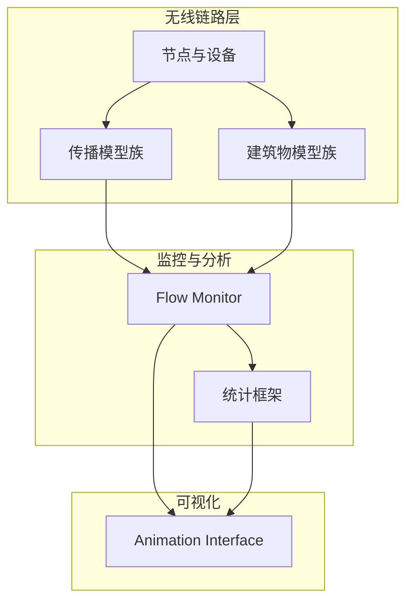
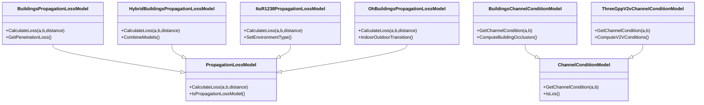
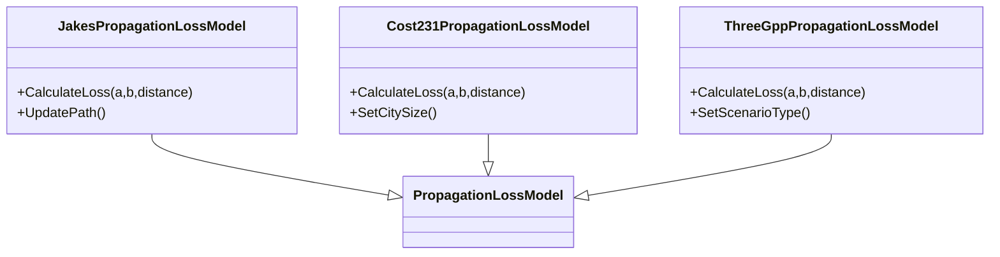
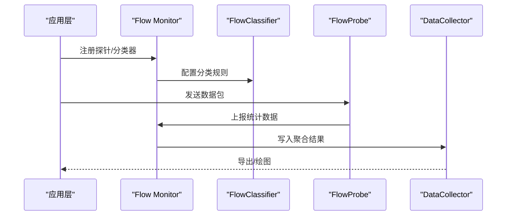
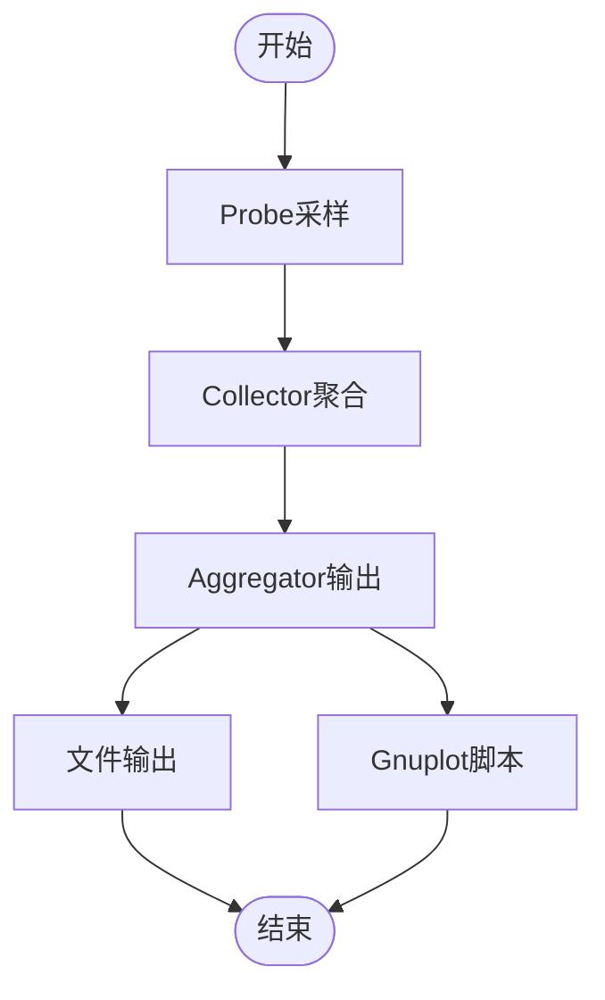
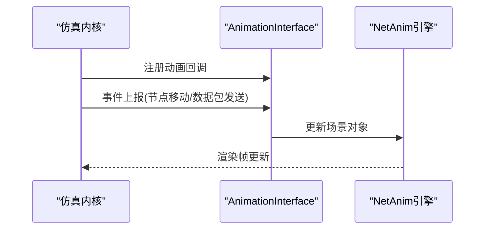
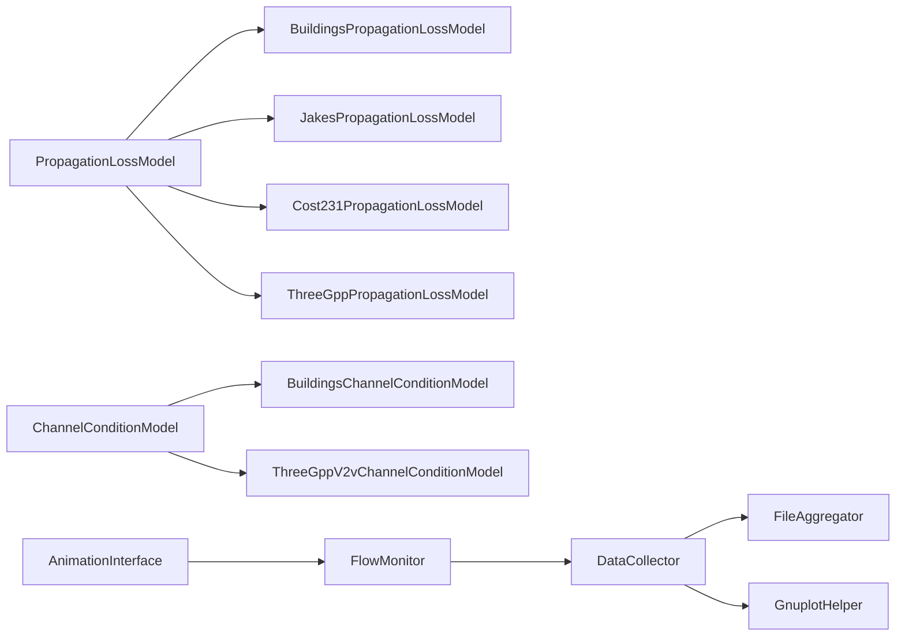

# 专用模块

<cite>
**本文引用的文件**
- [buildings-module.cc](file://simulator/ns-3.39/src/buildings/buildings-module.cc)
- [buildings-propagation-loss-model.cc](file://simulator/ns-3.39/src/buildings/model/buildings-propagation-loss-model.cc)
- [hybrid-buildings-propagation-loss-model.cc](file://simulator/ns-3.39/src/buildings/model/hybrid-buildings-propagation-loss-model.cc)
- [itu-r-1238-propagation-loss-model.cc](file://simulator/ns-3.39/src/buildings/model/itu-r-1238-propagation-loss-model.cc)
- [oh-buildings-propagation-loss-model.cc](file://simulator/ns-3.39/src/buildings/model/oh-buildings-propagation-loss-model.cc)
- [buildings-channel-condition-model.cc](file://simulator/ns-3.39/src/buildings/model/buildings-channel-condition-model.cc)
- [three-gpp-v2v-channel-condition-model.cc](file://simulator/ns-3.39/src/buildings/model/three-gpp-v2v-channel-condition-model.cc)
- [mobility-building-info.cc](file://simulator/ns-3.39/src/buildings/model/mobility-building-info.cc)
- [buildings-helper.cc](file://simulator/ns-3.39/src/buildings/helper/buildings-helper.cc)
- [animation-interface.cc](file://simulator/ns-3.39/src/netanim/model/animation-interface.cc)
- [flow-monitor.cc](file://simulator/ns-3.39/src/flow-monitor/model/flow-monitor.cc)
- [flow-monitor-helper.cc](file://simulator/ns-3.39/src/flow-monitor/helper/flow-monitor-helper.cc)
- [propagation-loss-model.cc](file://simulator/ns-3.39/src/propagation/model/propagation-loss-model.cc)
- [jakes-propagation-loss-model.cc](file://simulator/ns-3.39/src/propagation/model/jakes-propagation-loss-model.cc)
- [cost231-propagation-loss-model.cc](file://simulator/ns-3.39/src/propagation/model/cost231-propagation-loss-model.cc)
- [three-gpp-propagation-loss-model.cc](file://simulator/ns-3.39/src/propagation/model/three-gpp-propagation-loss-model.cc)
- [channel-condition-model.cc](file://simulator/ns-3.39/src/propagation/model/channel-condition-model.cc)
- [data-collector.cc](file://simulator/ns-3.39/src/stats/model/data-collector.cc)
- [file-aggregator.cc](file://simulator/ns-3.39/src/stats/model/file-aggregator.cc)
- [gnuplot-helper.cc](file://simulator/ns-3.39/src/stats/helper/gnuplot-helper.cc)
</cite>

## 目录
1. [简介](#简介)
2. [项目结构](#项目结构)
3. [核心组件](#核心组件)
4. [架构总览](#架构总览)
5. [详细组件分析](#详细组件分析)
6. [依赖关系分析](#依赖关系分析)
7. [性能考虑](#性能考虑)
8. [故障排查指南](#故障排查指南)
9. [结论](#结论)
10. [附录](#附录)

## 简介
本文件面向NS-3仿真平台的专用模块，系统化梳理并解释以下专业能力：
- 建筑物传播模型：包括建筑物穿透损耗、室内定位支持、信号遮挡建模等
- 网络可视化：基于NetAnim的动画驱动与场景渲染
- 统计分析：Probe/Collector/Aggregator体系，支持文件输出与图表生成
- 流量监控：Flow Monitor对端到端吞吐、时延、丢包等指标的采集与聚合

文档以代码级分析为基础，结合架构图与流程图，帮助读者快速理解模块职责、数据流、控制流以及与核心功能的集成方式，并提供可复用的配置与使用建议。

## 项目结构
NS-3专用模块主要分布在以下子目录中：
- buildings：建筑物相关传播模型、通道条件模型、移动性信息与辅助工具
- netanim：网络动画接口与示例
- flow-monitor：流量监控与分类器/探针
- propagation：通用传播模型族（含Jakes、Cost231、ThreeGPP等）
- stats：统计框架（Probe、Collector、Aggregator、Gnuplot等）

**图表来源**
- [buildings-propagation-loss-model.cc](file://simulator/ns-3.39/src/buildings/model/buildings-propagation-loss-model.cc)
- [hybrid-buildings-propagation-loss-model.cc](file://simulator/ns-3.39/src/buildings/model/hybrid-buildings-propagation-loss-model.cc)
- [itu-r-1238-propagation-loss-model.cc](file://simulator/ns-3.39/src/buildings/model/itu-r-1238-propagation-loss-model.cc)
- [oh-buildings-propagation-loss-model.cc](file://simulator/ns-3.39/src/buildings/model/oh-buildings-propagation-loss-model.cc)
- [buildings-channel-condition-model.cc](file://simulator/ns-3.39/src/buildings/model/buildings-channel-condition-model.cc)
- [three-gpp-v2v-channel-condition-model.cc](file://simulator/ns-3.39/src/buildings/model/three-gpp-v2v-channel-condition-model.cc)
- [propagation-loss-model.cc](file://simulator/ns-3.39/src/propagation/model/propagation-loss-model.cc)
- [jakes-propagation-loss-model.cc](file://simulator/ns-3.39/src/propagation/model/jakes-propagation-loss-model.cc)
- [cost231-propagation-loss-model.cc](file://simulator/ns-3.39/src/propagation/model/cost231-propagation-loss-model.cc)
- [three-gpp-propagation-loss-model.cc](file://simulator/ns-3.39/src/propagation/model/three-gpp-propagation-loss-model.cc)
- [channel-condition-model.cc](file://simulator/ns-3.39/src/propagation/model/channel-condition-model.cc)
- [flow-monitor.cc](file://simulator/ns-3.39/src/flow-monitor/model/flow-monitor.cc)
- [flow-monitor-helper.cc](file://simulator/ns-3.39/src/flow-monitor/helper/flow-monitor-helper.cc)
- [data-collector.cc](file://simulator/ns-3.39/src/stats/model/data-collector.cc)
- [file-aggregator.cc](file://simulator/ns-3.39/src/stats/model/file-aggregator.cc)
- [gnuplot-helper.cc](file://simulator/ns-3.39/src/stats/helper/gnuplot-helper.cc)
- [animation-interface.cc](file://simulator/ns-3.39/src/netanim/model/animation-interface.cc)

**章节来源**
- [buildings-module.cc](file://simulator/ns-3.39/src/buildings/buildings-module.cc)
- [animation-interface.cc](file://simulator/ns-3.39/src/netanim/model/animation-interface.cc)
- [flow-monitor.cc](file://simulator/ns-3.39/src/flow-monitor/model/flow-monitor.cc)
- [data-collector.cc](file://simulator/ns-3.39/src/stats/model/data-collector.cc)

## 核心组件
- 建筑物传播模型族：提供建筑物穿透损耗、室内路径损耗、遮挡条件建模，支撑室内定位与信号质量评估
- 传播模型族：覆盖自由空间、Jakes瑞利衰落、Okumura-Hata、COST231-Hata、ITU-R系列及ThreeGPP V2X等
- 流量监控：通过Flow Monitor对应用层流量进行分类、探针采样与统计聚合
- 统计分析：Probe/Collector/Aggregator形成数据采集链路，支持文件与Gnuplot输出
- 网络可视化：Animation Interface驱动NetAnim进行节点、链路、数据包的动画展示

**章节来源**
- [buildings-propagation-loss-model.cc](file://simulator/ns-3.39/src/buildings/model/buildings-propagation-loss-model.cc)
- [hybrid-buildings-propagation-loss-model.cc](file://simulator/ns-3.39/src/buildings/model/hybrid-buildings-propagation-loss-model.cc)
- [itu-r-1238-propagation-loss-model.cc](file://simulator/ns-3.39/src/buildings/model/itu-r-1238-propagation-loss-model.cc)
- [oh-buildings-propagation-loss-model.cc](file://simulator/ns-3.39/src/buildings/model/oh-buildings-propagation-loss-model.cc)
- [propagation-loss-model.cc](file://simulator/ns-3.39/src/propagation/model/propagation-loss-model.cc)
- [jakes-propagation-loss-model.cc](file://simulator/ns-3.39/src/propagation/model/jakes-propagation-loss-model.cc)
- [cost231-propagation-loss-model.cc](file://simulator/ns-3.39/src/propagation/model/cost231-propagation-loss-model.cc)
- [three-gpp-propagation-loss-model.cc](file://simulator/ns-3.39/src/propagation/model/three-gpp-propagation-loss-model.cc)
- [flow-monitor.cc](file://simulator/ns-3.39/src/flow-monitor/model/flow-monitor.cc)
- [flow-monitor-helper.cc](file://simulator/ns-3.39/src/flow-monitor/helper/flow-monitor-helper.cc)
- [data-collector.cc](file://simulator/ns-3.39/src/stats/model/data-collector.cc)
- [file-aggregator.cc](file://simulator/ns-3.39/src/stats/model/file-aggregator.cc)
- [gnuplot-helper.cc](file://simulator/ns-3.39/src/stats/helper/gnuplot-helper.cc)
- [animation-interface.cc](file://simulator/ns-3.39/src/netanim/model/animation-interface.cc)

## 架构总览
下图展示了专用模块在NS-3中的整体交互关系：建筑物与传播模块为无线链路提供损耗与条件模型；流量监控与统计模块负责数据采集与输出；可视化模块将仿真过程映射为动画。

**图表来源**
- [propagation-loss-model.cc](file://simulator/ns-3.39/src/propagation/model/propagation-loss-model.cc)
- [buildings-propagation-loss-model.cc](file://simulator/ns-3.39/src/buildings/model/buildings-propagation-loss-model.cc)
- [flow-monitor.cc](file://simulator/ns-3.39/src/flow-monitor/model/flow-monitor.cc)
- [data-collector.cc](file://simulator/ns-3.39/src/stats/model/data-collector.cc)
- [animation-interface.cc](file://simulator/ns-3.39/src/netanim/model/animation-interface.cc)

## 详细组件分析

### 建筑物传播模型
- 建筑物穿透损耗与室内路径损耗：通过建筑物传播模型族实现，支持不同环境下的穿透与阴影衰减
- 混合模型：结合多种经验模型，提升复杂城市/室内场景的适配度
- ITU-R 1238：适用于广泛的城市与郊区场景的室内/室外路径损耗
- 室外-室内（OH）模型：区分室外与室内传播差异，支持室内定位与信号质量评估
- 通道条件模型：提供LOS/NLOS状态、多径与时延扩展等条件信息
- V2V通道条件模型：面向车对车通信的传播条件建模
- 移动性建筑信息：为移动节点提供与建筑物的交互信息（如是否在室内、遮挡状态）
- 建筑物辅助工具：提供构建、分配、定位等高层封装

**图表来源**
- [propagation-loss-model.cc](file://simulator/ns-3.39/src/propagation/model/propagation-loss-model.cc)
- [buildings-propagation-loss-model.cc](file://simulator/ns-3.39/src/buildings/model/buildings-propagation-loss-model.cc)
- [hybrid-buildings-propagation-loss-model.cc](file://simulator/ns-3.39/src/buildings/model/hybrid-buildings-propagation-loss-model.cc)
- [itu-r-1238-propagation-loss-model.cc](file://simulator/ns-3.39/src/buildings/model/itu-r-1238-propagation-loss-model.cc)
- [oh-buildings-propagation-loss-model.cc](file://simulator/ns-3.39/src/buildings/model/oh-buildings-propagation-loss-model.cc)
- [channel-condition-model.cc](file://simulator/ns-3.39/src/propagation/model/channel-condition-model.cc)
- [buildings-channel-condition-model.cc](file://simulator/ns-3.39/src/buildings/model/buildings-channel-condition-model.cc)
- [three-gpp-v2v-channel-condition-model.cc](file://simulator/ns-3.39/src/buildings/model/three-gpp-v2v-channel-condition-model.cc)

**章节来源**
- [buildings-propagation-loss-model.cc](file://simulator/ns-3.39/src/buildings/model/buildings-propagation-loss-model.cc)
- [hybrid-buildings-propagation-loss-model.cc](file://simulator/ns-3.39/src/buildings/model/hybrid-buildings-propagation-loss-model.cc)
- [itu-r-1238-propagation-loss-model.cc](file://simulator/ns-3.39/src/buildings/model/itu-r-1238-propagation-loss-model.cc)
- [oh-buildings-propagation-loss-model.cc](file://simulator/ns-3.39/src/buildings/model/oh-buildings-propagation-loss-model.cc)
- [buildings-channel-condition-model.cc](file://simulator/ns-3.39/src/buildings/model/buildings-channel-condition-model.cc)
- [three-gpp-v2v-channel-condition-model.cc](file://simulator/ns-3.39/src/buildings/model/three-gpp-v2v-channel-condition-model.cc)
- [mobility-building-info.cc](file://simulator/ns-3.39/src/buildings/model/mobility-building-info.cc)
- [buildings-helper.cc](file://simulator/ns-3.39/src/buildings/helper/buildings-helper.cc)

### 传播模型族
- Jakes模型：用于瑞利衰落信道的时域建模
- COST231-Hata：适用于移动通信的城市/郊区场景
- Okumura-Hata：经典电波传播模型
- ITU-R系列：包括LOS/NLOS与屋顶Over-Rooftop场景
- ThreeGPP：支持V2X与宏微站场景
- 传播延迟模型：计算信号传播时间
- 传播缓存：加速重复查询

**图表来源**
- [propagation-loss-model.cc](file://simulator/ns-3.39/src/propagation/model/propagation-loss-model.cc)
- [jakes-propagation-loss-model.cc](file://simulator/ns-3.39/src/propagation/model/jakes-propagation-loss-model.cc)
- [cost231-propagation-loss-model.cc](file://simulator/ns-3.39/src/propagation/model/cost231-propagation-loss-model.cc)
- [three-gpp-propagation-loss-model.cc](file://simulator/ns-3.39/src/propagation/model/three-gpp-propagation-loss-model.cc)

**章节来源**
- [propagation-loss-model.cc](file://simulator/ns-3.39/src/propagation/model/propagation-loss-model.cc)
- [jakes-propagation-loss-model.cc](file://simulator/ns-3.39/src/propagation/model/jakes-propagation-loss-model.cc)
- [cost231-propagation-loss-model.cc](file://simulator/ns-3.39/src/propagation/model/cost231-propagation-loss-model.cc)
- [three-gpp-propagation-loss-model.cc](file://simulator/ns-3.39/src/propagation/model/three-gpp-propagation-loss-model.cc)

### 流量监控
- Flow Monitor核心：维护流列表、处理事件、聚合统计
- 分类器与探针：按四元组/五元组分类，对特定流进行采样
- 助手：简化Flow Monitor的安装与配置

**图表来源**
- [flow-monitor.cc](file://simulator/ns-3.39/src/flow-monitor/model/flow-monitor.cc)
- [flow-monitor-helper.cc](file://simulator/ns-3.39/src/flow-monitor/helper/flow-monitor-helper.cc)

**章节来源**
- [flow-monitor.cc](file://simulator/ns-3.39/src/flow-monitor/model/flow-monitor.cc)
- [flow-monitor-helper.cc](file://simulator/ns-3.39/src/flow-monitor/helper/flow-monitor-helper.cc)

### 统计分析
- Probe：对数值、布尔、时间序列等进行采样
- Collector：汇总来自多个Probe的数据
- Aggregator：将数据写入文件或生成Gnuplot脚本
- 文件与SQLite输出：支持多种后处理格式

**图表来源**
- [data-collector.cc](file://simulator/ns-3.39/src/stats/model/data-collector.cc)
- [file-aggregator.cc](file://simulator/ns-3.39/src/stats/model/file-aggregator.cc)
- [gnuplot-helper.cc](file://simulator/ns-3.39/src/stats/helper/gnuplot-helper.cc)

**章节来源**
- [data-collector.cc](file://simulator/ns-3.39/src/stats/model/data-collector.cc)
- [file-aggregator.cc](file://simulator/ns-3.39/src/stats/model/file-aggregator.cc)
- [gnuplot-helper.cc](file://simulator/ns-3.39/src/stats/helper/gnuplot-helper.cc)

### 网络可视化
- Animation Interface：提供节点、链路、数据包的动画接口，支持实时渲染与交互

**图表来源**
- [animation-interface.cc](file://simulator/ns-3.39/src/netanim/model/animation-interface.cc)

**章节来源**
- [animation-interface.cc](file://simulator/ns-3.39/src/netanim/model/animation-interface.cc)

## 依赖关系分析
- 建筑物模型依赖传播损耗基类，同时提供通道条件模型以增强LOS/NLOS建模
- 传播模型族独立于建筑物，可与任意无线MAC/PHY配合使用
- Flow Monitor依赖统计框架进行数据输出
- 可视化模块与监控/统计模块解耦，通过统一事件接口接入

**图表来源**
- [propagation-loss-model.cc](file://simulator/ns-3.39/src/propagation/model/propagation-loss-model.cc)
- [buildings-propagation-loss-model.cc](file://simulator/ns-3.39/src/buildings/model/buildings-propagation-loss-model.cc)
- [jakes-propagation-loss-model.cc](file://simulator/ns-3.39/src/propagation/model/jakes-propagation-loss-model.cc)
- [cost231-propagation-loss-model.cc](file://simulator/ns-3.39/src/propagation/model/cost231-propagation-loss-model.cc)
- [three-gpp-propagation-loss-model.cc](file://simulator/ns-3.39/src/propagation/model/three-gpp-propagation-loss-model.cc)
- [channel-condition-model.cc](file://simulator/ns-3.39/src/propagation/model/channel-condition-model.cc)
- [buildings-channel-condition-model.cc](file://simulator/ns-3.39/src/buildings/model/buildings-channel-condition-model.cc)
- [three-gpp-v2v-channel-condition-model.cc](file://simulator/ns-3.39/src/buildings/model/three-gpp-v2v-channel-condition-model.cc)
- [flow-monitor.cc](file://simulator/ns-3.39/src/flow-monitor/model/flow-monitor.cc)
- [data-collector.cc](file://simulator/ns-3.39/src/stats/model/data-collector.cc)
- [file-aggregator.cc](file://simulator/ns-3.39/src/stats/model/file-aggregator.cc)
- [gnuplot-helper.cc](file://simulator/ns-3.39/src/stats/helper/gnuplot-helper.cc)
- [animation-interface.cc](file://simulator/ns-3.39/src/netanim/model/animation-interface.cc)

**章节来源**
- [buildings-module.cc](file://simulator/ns-3.39/src/buildings/buildings-module.cc)
- [flow-monitor.cc](file://simulator/ns-3.39/src/flow-monitor/model/flow-monitor.cc)
- [data-collector.cc](file://simulator/ns-3.39/src/stats/model/data-collector.cc)

## 性能考虑
- 传播模型选择：在高保真与性能之间权衡，复杂模型（如ThreeGPP/V2V）适合精确场景，简单模型（如Okumura-Hata/COST231）适合大规模仿真实验
- 建筑物穿透损耗：合理设置穿透损耗参数与遮挡阈值，避免过度衰减导致仿真结果失真
- Flow Monitor开销：仅对关键流启用探针，减少统计开销；批量导出与延迟写入可降低I/O压力
- 统计输出：优先使用文件聚合器，必要时再生成Gnuplot脚本，避免频繁I/O
- 可视化帧率：根据仿真规模调整渲染频率，避免动画成为瓶颈

## 故障排查指南
- 传播模型未生效：检查是否正确设置链路层的传播损耗模型与通道条件模型
- 建筑物穿透损耗异常：确认建筑物几何定义、节点位置与遮挡状态
- Flow Monitor无数据：核查探针注册、分类器规则与导出配置
- 统计输出为空：检查Collector与Aggregator的绑定关系与输出路径权限
- 可视化无动画：确认Animation Interface已注册且事件上报正常

**章节来源**
- [buildings-propagation-loss-model.cc](file://simulator/ns-3.39/src/buildings/model/buildings-propagation-loss-model.cc)
- [flow-monitor.cc](file://simulator/ns-3.39/src/flow-monitor/model/flow-monitor.cc)
- [data-collector.cc](file://simulator/ns-3.39/src/stats/model/data-collector.cc)
- [animation-interface.cc](file://simulator/ns-3.39/src/netanim/model/animation-interface.cc)

## 结论
NS-3专用模块围绕“传播建模—流量监控—统计分析—可视化”闭环展开，既满足高保真场景（建筑物穿透、V2X条件），也兼顾大规模仿真实验效率。通过模块化设计与清晰的接口契约，用户可在不修改核心代码的前提下扩展新模型与可视化方案。

## 附录
- 专用场景配置要点
  - 建筑物场景：定义建筑物容器、设置穿透损耗模型、启用通道条件模型
  - 传播模型：根据频段与场景选择合适模型（如ThreeGPP V2X或ITU-R系列）
  - 流量监控：针对关键流启用探针，配置分类器规则，导出CSV/SQLite/Gnuplot
  - 可视化：注册Animation Interface，按需开启节点/链路/数据包动画
- 可视化定制
  - 使用Animation Interface提供的回调机制自定义节点样式、轨迹与标签
  - 结合统计输出生成动态图表，实现“边跑边看”的监控体验
- 统计报告生成
  - 使用FileAggregator与GnuplotHelper生成标准报告模板，便于对比实验与论文撰写
- 扩展方法
  - 新增传播模型：继承PropagationLossModel并实现CalculateLoss
  - 新增通道条件模型：继承ChannelConditionModel并实现GetChannelCondition
  - 新增可视化元素：通过Animation Interface扩展场景对象类型